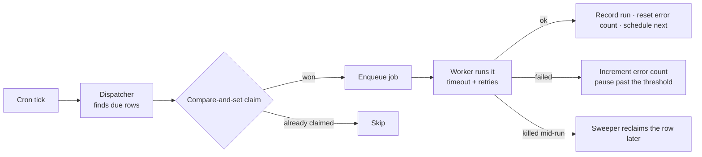

# Workers (Background Execution)

**Workers** are the engine room behind everything that happens when you're not looking. They're the background-execution layer that runs your [Agents](./agents.md), generation pipelines, [scheduled updates](./scheduled-updates.md), and [Mission](./missions.md) ticks reliably, in parallel, with retries — so the platform's [autonomous operation](./autonomous-operation.md) keeps humming whether you have one Work or a hundred.

You rarely manage Workers directly. They're the "who's actually doing the job" answer underneath the Agents and schedules you _do_ manage.

## What Workers run

| Job kind                            | What it does                                                                                            |
| ----------------------------------- | ------------------------------------------------------------------------------------------------------- |
| **Agent heartbeats**                | Wake each active Agent on its cadence, run its decision loop, record the run.                           |
| **Agent tasks & chat replies**      | Execute work assigned to an Agent; reply when an Agent is mentioned.                                    |
| **Generation pipelines**            | Build and refresh a Work's content and code.                                                            |
| **Scheduled updates**               | Re-run a Work's pipeline on its cadence.                                                                |
| **Mission ticks**                   | Generate fresh Ideas for scheduled Missions.                                                            |
| **Inbound email**                   | Turn incoming mail into Tasks or conversations.                                                         |
| **Ingest & extraction**             | Normalize and extract uploaded Knowledge Base sources.                                                  |
| **Community PR processing**         | Triage and merge community contributions.                                                               |
| **Digests**                         | Assemble and deliver the daily and weekly briefings.                                                    |
| **Memory consolidation**            | Run the consolidation pass over [Memory](./memory.md) on a cadence, not only when you press the button. |
| **Goal evaluation & advance**       | Ask "is the number there yet?" and "should we keep working on this?" for each [Goal](./goals.md).       |
| **Event ingest & triggers**         | Process the event spine and fire [inbound triggers](./inbound-triggers.md).                             |
| **Webhook & notification delivery** | Sign, POST and retry outbound webhooks; deliver notifications to each channel.                          |
| **Terminal sessions**               | Host the durable shell behind an [Agent Terminal](./agent-terminals.md).                                |
| **Long-running plugin calls**       | Execute plugin operations whose manifest marks them `long-running`.                                     |
| **Housekeeping sweeps**             | Reclaim stranded runs and leases, prune transcripts and merged branches, settle credit meters.          |

## Scheduled jobs and their cadences

These jobs are cron-driven: nothing enqueues them, they simply fire. Times are UTC.

| Job                              | Cadence                           | What it does                                                                                                                                   |
| -------------------------------- | --------------------------------- | ---------------------------------------------------------------------------------------------------------------------------------------------- |
| `agent-heartbeat-dispatcher`     | Every minute (configurable)       | Claims the Agents whose heartbeat is due and enqueues one `agent-heartbeat` run each. Interval = `AGENT_DISPATCH_INTERVAL_MINUTES`.            |
| `work-schedule-dispatcher`       | Every minute (configurable, 1–60) | Finds Works whose [scheduled update](./scheduled-updates.md) is due and enqueues the pipeline.                                                 |
| `mission-tick`                   | Every minute                      | Spawns fresh [Ideas](./ideas.md) for Missions whose cron matches.                                                                              |
| `task-recurrence-dispatcher`     | Every minute                      | Materializes recurring [Tasks](./tasks.md) — per-minute so any RRULE granularity works.                                                        |
| `goal-evaluate-dispatcher`       | Every minute                      | Re-measures each Goal on its own `checkFrequencyMinutes` cadence.                                                                              |
| `user-research-rerun-dispatcher` | Every minute                      | Runs the scheduled Work-proposal batch — the recurring research behind proposed [Ideas](./ideas.md).                                           |
| `data-repo-sync-dispatcher`      | Every minute (configurable)       | Dispatches due data-repository syncs. Cron overridable with `DATA_SYNC_DISPATCHER_CRON`.                                                       |
| `goal-advance-dispatcher`        | Every 5 minutes                   | Drives the Goal execution loop — proposes and advances the next step.                                                                          |
| `event-ingest-tick`              | Every 5 minutes                   | Processes the event-ingest spine, including the pull path.                                                                                     |
| `credits-meter-flush`            | Every 5 minutes                   | Resends metered usage rows the settlement path could not deliver. See [Credits & Billing](./credits-and-billing.md).                           |
| `fleet-job-lease-sweeper`        | Every 5 minutes, at :03 / :08 / … | Reclaims expired [Fleet](./fleet.md) job leases so a queue does not freeze when every node goes away.                                          |
| `deploy-ready-poller`            | Every 2 minutes                   | Flips mid-deploy Works to READY once their health endpoint answers `200`.                                                                      |
| `task-pr-status-sync`            | Every 2 minutes                   | Refreshes cached PR and CI verdicts on Tasks whose pull request is still open.                                                                 |
| `agent-run-sweeper`              | Every 2 hours, at :23             | Reaps `agent_runs` rows stranded in `queued` / `running` by a killed worker.                                                                   |
| `credits-daily-grant`            | Daily, 00:05                      | Grants the daily credit allowance.                                                                                                             |
| `anonymous-user-cleanup`         | Daily, 03:17                      | Purges expired anonymous users and the files they uploaded.                                                                                    |
| `terminal-transcript-gc`         | Daily, 03:17                      | Prunes terminal transcript chunks past each run owner's retention window.                                                                      |
| `kb-reconcile`                   | Daily, 03:42                      | Reconciles [Knowledge Base](./knowledge-base.md) documents against their mirrored files.                                                       |
| `task-branch-gc`                 | Daily, 04:41                      | Deletes remote `task/*` branches for finished or abandoned Tasks, per the Work's branch-cleanup policy. See [Repositories](./repositories.md). |
| `digest-dispatcher`              | Daily, 07:15                      | Sends the daily [digests](./digests.md); on Mondays the weekly ones ride the same run.                                                         |
| `memory-consolidation-tick`      | Daily, 08:37                      | Consolidates [Memory](./memory.md) across the workspace.                                                                                       |

:::note Why the odd minutes
The per-minute crons already own :00 of every minute, and the midnight and hourly jobs crowd the top of the hour. So every sweeper and daily job is deliberately offset — `agent-run-sweeper` at :23 past every second hour, `fleet-job-lease-sweeper` on the `3/5` pattern (:03, :08, :13 …), `kb-reconcile` at 03:42 rather than 03:00. It keeps a slow housekeeping pass from colliding with the dispatchers that must not be delayed.
:::

## On-demand jobs

Everything else is enqueued by something you — or an Agent — did. The API returns immediately, usually `202 Accepted`, and a Worker picks the job up.

| Job                             | Enqueued when                                                                       | Time limit           |
| ------------------------------- | ----------------------------------------------------------------------------------- | -------------------- |
| `work-generation`               | A Work's content and code pipeline runs, manually or on schedule.                   | 5 hours              |
| `work-import`                   | You [import](./work-import.md) an existing repository or dataset.                   | 2 hours              |
| `work-onboarding`               | The zero-friction onboarding flow finishes registration.                            | 2 hours              |
| `kb-backfill-skeleton`          | An operator backfills the Knowledge Base skeleton for a list of Works.              | 2 hours              |
| `agent-task-execute`            | A Task is assigned to an Agent.                                                     | 60 minutes           |
| `idea-build-execute`            | An Idea is built into a Work, retried or rebuilt.                                   | 60 minutes           |
| `run-plugin-operation`          | A [plugin](./plugins.md) operation is marked `long-running` in its manifest.        | 60 minutes           |
| `terminal-session`              | You open an [Agent Terminal](./agent-terminals.md).                                 | 60 minutes           |
| `template-customization`        | A [template](./website-templates.md) is customized for a Work.                      | 60 minutes           |
| `workflow-run`                  | `POST /api/workflows/:id/run` creates the run row, then enqueues it.                | —                    |
| `webhook-delivery`              | An event matches an [outbound webhook](../advanced/webhook-system.md) subscription. | 30 minutes           |
| `kb-reembed-work`               | A Work's Knowledge Base needs re-embedding wholesale.                               | 30 minutes           |
| `kb-transcribe`                 | An uploaded audio source needs a transcript.                                        | 30 minutes           |
| `kb-normalize-video`            | An uploaded video source needs normalizing.                                         | 30 minutes           |
| `kb-normalize-audio`            | An uploaded audio source needs normalizing.                                         | 15 minutes           |
| `kb-embed-document`             | A Knowledge Base document is created or updated.                                    | 10 minutes           |
| `kb-mirror-document`            | A Knowledge Base mutation must be written to its `.yml` sidecar and `.md` body.     | 10 minutes           |
| `kb-org-overlay-fanout`         | An org-scope Knowledge Base document must fan out to the Works it covers.           | 10 minutes           |
| `agent-heartbeat`               | The dispatcher claims a due Agent — or you fire one by hand.                        | 30 minutes (default) |
| `agent-chat-reply`              | An Agent is mentioned in a Task chat thread.                                        | 5 minutes            |
| `notification-channel-delivery` | A [notification](./notifications.md) has to reach a channel.                        | 5 minutes            |

Two of those limits are configurable rather than fixed: `agent-heartbeat` uses `AGENT_MAX_RUN_DURATION_SECONDS` (default `1800`), and the platform-wide ceiling for any single job is five hours.

## How Workers behave

- **Parallel** — many jobs run at once; a dispatcher claims due work in batches so thousands of Agents and schedules scale without stepping on each other. The Agent dispatcher claims up to `AGENT_DISPATCH_MAX_BATCH` Agents per tick (default 25).
- **Safe under contention** — a single Agent's heartbeat can only be claimed by one Worker at a time (compare-and-set), so nothing runs twice.
- **Retried** — transient failures (network blips, provider rate limits, upstream 5xx) are retried with backoff before a job is marked failed.
- **Bounded** — runs have timeouts; an Agent that keeps failing auto-pauses rather than burning budget.
- **Observable** — every run emits activity-log entries and surfaces on the relevant Dashboard, with cost attributed to the right Agent, Task, or Work.

### Retries and backoff

Retry policy is set per job, because a chat notification and a customer's webhook endpoint deserve very different patience.

| Policy                          | Schedule                                                                                                                                                                                                                                                                                                                               |
| ------------------------------- | -------------------------------------------------------------------------------------------------------------------------------------------------------------------------------------------------------------------------------------------------------------------------------------------------------------------------------------- |
| Shared default                  | 3 attempts, 1s → 10s backoff (factor 2, jittered). Written explicitly in `trigger.config.ts` only when `TRIGGER_DEV_ENABLE_RETRIES=true`, which is also what switches retries on in local dev; without the flag the job runtime's own defaults apply, and those are the same numbers — so this is the production behaviour either way. |
| `webhook-delivery`              | 30s → 2m → 10m → 1h → 6h → 1d → 1d, capped at 24h between attempts, up to 10 attempts by default (`WEBHOOK_MAX_CONSECUTIVE_FAILURES`), after which the subscription is dead-lettered.                                                                                                                                                  |
| `notification-channel-delivery` | 30s → 2m → 8m → 32m → 2h, 5 attempts, 6h cap. A chat or email notification has little value a full day late.                                                                                                                                                                                                                           |
| `work-onboarding`               | 3 attempts — onboarding is long, but a failed run should not silently strand a new account.                                                                                                                                                                                                                                            |

### When an Agent keeps failing

Every failed heartbeat increments the Agent's error count. Once it reaches that Agent's **Pause after failures** threshold (default `3`, editable on the Agent's **Settings** tab), the Agent flips to `error` status and its next heartbeat is cleared — the dispatcher stops waking it, so a broken Agent cannot burn its [budget](./budgets-and-usage.md) overnight. A successful run resets the counter. Resume the Agent once you have fixed the cause.

### When a Worker dies mid-job

A killed process — out of memory, an eviction, a deploy, a laptop going to sleep — cannot clean up after itself, so two sweepers do it instead:

- `agent-run-sweeper` reaps `agent_runs` rows stranded in `queued` or `running`. Its cutoff is derived from the longest Agent task's duration ceiling and clamped to at least three times that ceiling, so a run that is legitimately still retrying is never reaped out from under itself.
- `fleet-job-lease-sweeper` reclaims expired [Fleet](./fleet.md) leases. A lease is a deadline, not a lock. Reclaim also runs inline on every lease poll, which covers the ordinary case of one node dying while its siblings keep polling; the cron covers the case inline reclaim structurally cannot — a fleet where every node went away at once. Detection lag is bounded by the lease TTL plus five minutes.

## Where they run

Workers are powered by the platform's background-jobs infrastructure. In the cloud, this is fully managed for you. When you self-host — or run the [Desktop App](./desktop-app.md) — Workers run alongside the rest of the stack, and you can also point them at an external or self-hosted jobs backend.

Which engine actually executes a job is a **plugin choice**, not a hard-coded dependency. Six job runtimes ship with the platform:

| Runtime         | Plugin                 | Shape                                                       |
| --------------- | ---------------------- | ----------------------------------------------------------- |
| **Trigger.dev** | `job-runtime-trigger`  | The default; managed cloud or self-hosted.                  |
| **Temporal**    | `job-runtime-temporal` | Durable workflow engine for teams that already run one.     |
| **BullMQ**      | `job-runtime-bullmq`   | Redis-backed queues inside your own deployment.             |
| **pg-boss**     | `job-runtime-pgboss`   | Queues on the Postgres you already have — no extra service. |
| **Inngest**     | `job-runtime-inngest`  | Hosted, event-driven execution.                             |
| **Fleet node**  | `job-runtime-node`     | Your own machines leasing work through [Fleet](./fleet.md). |

The instance-wide choice is the `EVER_WORKS_JOB_RUNTIME` environment variable, with a per-tenant overlay under **Sidebar → Settings → Job Runtime**.

:::note Read the runtime page before you switch
Part of that seam is shipped and part of it is not — the selector is honoured on the Agent-run dispatch path, but the queue dispatchers still route to Trigger.dev in the bundled build, and per-tenant bring-your-own credentials are recorded without yet being injected into runs. [Job Runtimes](./job-runtimes.md) spells out exactly which half is which.
:::

## Watching and driving a job

1. **Watch the feed.** [Activity](./activity.md) is the workspace-wide log; every Agent, Task and Work also has its own Activity tab showing the runs that touched it. Failures land there with the reason attached.
2. **Open the Agent.** The Agent detail page's **Dashboard** tab is the per-Agent cockpit: the status pill (`draft`, `active`, `paused`, `running`, `error`, `archived`) and tiles for **Heartbeat** (its cadence, or `Manual`), **Idle behavior**, **Last run** and **Next heartbeat**, over a health strip that turns red once the error count is non-zero. To fire a heartbeat immediately instead of waiting for the next dispatcher tick, call `POST /api/agents/:id/run-now` — it answers `202 Accepted` and is rate-limited to 30 calls a minute — or ask the platform chat to run the Agent now, which is the `run_agent_now` tool posting to that same endpoint. The response says what happened: a run id when a run was enqueued, or a skip reason (`already-claimed`, `inactive`, `concurrency-limit`, `agent-missing`) when one was not.
3. **Read the run.** Agent runs are listed on the Agent's **Activity** tab and across the workspace under **Sidebar → Teams → Sessions**, where you can open a run, follow its steps, and [steer or interrupt](./sessions-and-steering.md) it while it is live.
4. **Re-run a schedule by hand.** A Work's **Schedule** card has its own **Run now** button (the schedule has to be active), and a Mission's detail page has one for its tick. Both enqueue exactly the job the cron would have.
5. **Check what it cost.** Every run attributes spend to the Agent, Task or Work that caused it — see [Budgets & Usage](./budgets-and-usage.md).

:::tip A job that never seems to run
Check three things, in order. The entity is `active` — a paused or errored Agent is skipped before anything is claimed. The dispatcher is enabled for the deployment — `AGENTS_DISPATCHER_ENABLED` is not set to `false`. And the cadence is what you think it is — an Agent with no heartbeat cadence shows **Manual** on its Dashboard tab and only ever runs when something asks it to.
:::

## See also

- [Agents](./agents.md) · [Autonomous Operation](./autonomous-operation.md)
- [Scheduled Updates](./scheduled-updates.md) · [Missions](./missions.md)
- [Job Runtimes](./job-runtimes.md) · [Fleet](./fleet.md)
- [Desktop App](./desktop-app.md)
