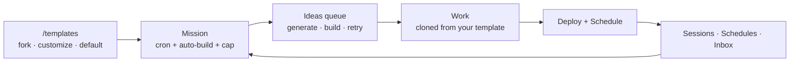

# Build a Site Fully Autonomously from a Template

[Quickstart: Build a Directory](./quickstart-directory.md) walks one Work from a prompt to a deployed site with your hands on every control. This guide does the opposite: it wires the same machinery into a **standing loop** and then gets out of the way.

Four decisions make the loop:

| Decision                     | Where it lives                                   | What it controls                                                         |
| ---------------------------- | ------------------------------------------------ | ------------------------------------------------------------------------ |
| **What the code looks like** | A template in the catalog at `/templates`        | The repository every generated Work's website is cloned from.            |
| **What gets built**          | A [Mission](../features/missions.md) with a cron | Which [Ideas](../features/ideas.md) appear, and whether they auto-build. |
| **How far it may go**        | Budgets at account, Mission and Work scope       | The spend ceiling, and what pauses when it is reached.                   |
| **When you get pulled in**   | Guardrails, the Inbox and the approvals queue    | The moments a human still decides.                                       |

Routes are written the way you type them, without the locale prefix — the address bar shows `/en/templates`, this guide says `/templates`.



## What "fully autonomous" means here

Once the loop is configured, these steps run without you:

| Step                                           | Runs on                                                       | Watch it at                     |
| ---------------------------------------------- | ------------------------------------------------------------- | ------------------------------- |
| Spawn new Ideas for a Mission                  | The Mission's cron, evaluated every minute by the tick worker | `/missions/:id` → **Ideas**     |
| Suggest account-wide Ideas                     | The **Auto-generate Ideas** cadence                           | `/ideas`                        |
| Turn an Idea into a Work                       | **Auto-build Works from spawned Ideas**, inside the caps      | `/agents/sessions`, `/activity` |
| Retry a build that failed on a transient error | The **Auto-retry policy**                                     | `/ideas` (the card's status)    |
| Refresh a published Work                       | The Work's [schedule](../features/scheduled-updates.md)       | `/activity` → **Schedules**     |
| Keep template code current                     | Branch sync from the template's base                          | `/templates`                    |

:::caution Three things are deliberately not automatic

**The Work agent is off until you switch it on.** **Enable Work agent** on `/settings/work-agent` is unchecked on every new account, and every build in this guide goes through it — **Build** and **Retry** on `/ideas`, and a Mission's auto-build alike. While it is off, the API answers `400 "Work agent is disabled."`: pressing **Build** still commits the Idea's `PENDING → QUEUED` transition (the queue write lands before the refusal), but no build request is created and nothing generates. A Mission tick hits the same gate without telling you — it queues the Idea, logs the refusal server-side and moves on. So turn it on before anything else: [How to: switch the Work agent on first](#how-to-switch-the-work-agent-on-first). This gate is yours on every deployment, managed or self-hosted.

**The Idea → Work build executor is operator-gated.** That is a second, separate gate — the deployment's, not yours. `EVER_WORKS_IDEA_BUILD_EXECUTOR_ENABLED` (default off) switches on the worker that executes a queued build, and even then it starts in dry-run mode (`EVER_WORKS_IDEA_BUILD_EXECUTOR_DRY_RUN`, default on) so an operator cannot trigger real spend by accident. Where your switch is loud, this one is silent: **Build** answers success, the Idea sits in `QUEUED` with a build request recorded against it, and nothing executes. The Work-agent settings page says it in plain words: _"Live execution stays blocked until an executor is connected."_ If you self-host, that flag is yours; on managed hosting it is the platform operator's.

**The first deploy is a human action.** No code path publishes a freshly generated Work on its own — you deploy it once from the Work's **Deploy** tab (`POST /api/deploy/works/:id`, or `ever-works work deploy`). From then on, scheduled updates keep the deployed site fresh.
:::

## 1. Pick the template the loop will build from

The catalog at `/templates` holds three kinds behind one pill switch. The page opens on **Website Templates**; `?kind=` deep-links the others.

| Pill                  | Route                     | What these templates are                                                                                | Built-ins                                                                                                                                  |
| --------------------- | ------------------------- | ------------------------------------------------------------------------------------------------------- | ------------------------------------------------------------------------------------------------------------------------------------------ |
| **Website Templates** | `/templates?kind=website` | The repository a Work's `<slug>-website` repo is cloned from, and kept in sync with.                    | **Classic** (Next.js, `directory-web-template`), **Minimal** (Astro), **Website** (Next.js, `web-template`), **Website (Minimal)** (Astro) |
| **Work Templates**    | `/templates?kind=work`    | Starter boilerplates a new Work begins from, labelled with their framework.                             | **Starter Directory** (Next.js), **Starter Directory (Minimal)** (Astro)                                                                   |
| **Mission Templates** | `/templates?kind=mission` | Pre-baked Mission setups — cadence, guardrails, auto-build flag and KB seeds in a `.works/mission.yml`. | **Starter Business**, **Starter Content Site**                                                                                             |

Which website template a Work gets, unless you override it: `website`, `landing-page` and `blog` Works default to **Website** (`web`); `directory`, `awesome-repo` and the legacy `default` kind fall through to **Classic**. Full matrix in [Work Kinds & Capabilities](../features/work-kinds.md) and [Website Templates](../features/website-templates.md).

### How to: make a template your own default

1. Open `/templates` and pick the pill for the kind you want. Use the **All / Built-in / Custom** filters and the search box (_"Search templates, frameworks, or repositories..."_) to find a card.
2. On a **built-in** card, press **Fork**. The **Fork standard template** dialog asks for a destination — your personal account or a GitHub organization you belong to — and the button reads **Fork and make default**. The toast confirms: _"Forked {repository}, added it to your catalog, and set it as your default."_
3. To bring in a repository you already have, press **Add custom template** in the page header and fill the dialog: **GitHub repository URL**, optional **Template name**, **Framework**, **Short description**, **Default branch** (empty means `main`) and an optional **Beta branch**. Press **Save template**.
4. On a custom card, **Make default** pins it for that kind. Your current choice shows in the **Active default** tile at the top of the page, with the hint _"New works start from this template unless you override it per work."_
5. Press **Refresh templates** after changing a template repository on GitHub, so the catalog re-reads its metadata.

The default applies to **new** Works. An existing Work can be moved onto a different website template later — `POST /api/works/:id/switch-website-template`; see [Website Templates](../features/website-templates.md).

### How to: restyle a template with an agent

**Create with AI** duplicates a base template into a fresh repository in your GitHub account and runs a code-edit plugin against it.

1. Press **Create with AI** in the header of `/templates`.
2. Fill the dialog: **Template name** (it also names the new repo), **Base template** — _"Only bases marked AI-customizable are listed"_ — **Code-edit agent** (one of your installed code-edit plugins), **AI provider**, **GitHub destination**, and **Describe the UI you want**.
3. Press **Create custom template** and watch the status line: _Queued → Provisioning the new repo → Agent is applying your changes → Pushing → Customization completed successfully._ The toast warns it _"typically takes a few minutes."_
4. Later, **Customize again** on the same card runs another round and pushes a new commit; **Sync from base** pulls the built-in base's updates back into your fork.

:::note What an AI customization may change

Styling only. The run is allowed to commit exactly one file — `apps/web/src/styles/theme.css` — and anything else the agent edits is discarded, which is why the dialog promises _"Functionality stays untouched."_ Two guards fail the run rather than ship a broken site: a Tailwind directive inside `theme.css` (it must be plain CSS), and a fork whose layout never imports `theme.css` — that one fails with _"Sync this template from its base before customizing."_

**Classic** is not AI-customizable (too large to agent-edit end to end today); **Minimal**, **Website** and **Website (Minimal)** are.
:::

## 2. Create the Mission that keeps building

A [Mission](../features/missions.md) is the part of the loop that decides _what_ is worth building. A **one-shot** Mission spawns Ideas when you run it; a **scheduled** Mission ticks on a five-field cron, in UTC.

### How to: switch the Work agent on first

Nothing in the loop builds until this switch is on, and it is off on every new account. It gates both build paths — the **Build** button you press yourself and the auto-build a Mission tick runs for you — so do it before you wire the Mission.

1. Open `/settings/work-agent`. The first block is **Work agent planning**, described as _"Prepare approval-ready Work plans from high-level build requests."_
2. Switch **Enable Work agent** on. The three toggles beside it — **Auto-approve low-impact changes**, **Daily suggestions**, **Dry run by default** — can stay as they are; leaving **Dry run by default** on keeps the first runs to plans rather than spend.
3. Press **Save settings** at the foot of the **Guardrails** block underneath: one button saves both blocks. The toast reads _"Work agent settings saved"_.

Skip this step and the loop looks armed but never builds. **Build** answers `400 "Work agent is disabled."`, and a Mission tick queues Ideas that never become Works.

### How to: start a scheduled Mission with auto-build on

1. Click **+ New** in the sidebar to open `/new`, keep the **Mission** chip selected, describe the ongoing goal, and submit. For a deterministic, no-AI path use **Create manually** → `/missions/new`, which asks for **Title**, **Description**, **Type** (_One-shot — run once_ / _Scheduled — run repeatedly_) and **Schedule**. The hint under the field is exact: _"Five-field cron expression. Example: 0 9 \* \* \* runs every day at 09:00."_
2. Prefer to start from a template? On `/templates?kind=mission` press **Use** (**Use this Template**) — Mission cards are the only ones that carry it. You land on `/new?type=mission&template=<id>` with the prompt seeded from the template's name and description, and the spawned Mission inherits the template's cadence, auto-build flag, outstanding-Ideas cap and guardrails. Anything you set yourself overrides them. See [Mission Templates](../features/mission-templates.md).
3. Open the Mission at `/missions/:id` and fill the **Mission settings** block:
    - **Schedule (cron, UTC)** — leave it empty for a one-shot Mission.
    - **Auto-build Works from spawned Ideas** — the switch that removes the human step between an Idea and a Work.
    - **Inherit user-level default cap**, or an explicit **Outstanding-Ideas cap (-1 = unlimited)**.
    - Press **Save settings** (_"Mission settings saved"_).
4. Open **Guardrails override** if this Mission should be stricter or looser than your account-wide Work-agent guardrails. With nothing set, the panel reads _"No overrides set — using your global Work-agent guardrails."_
5. Press **Run now** for the first tick instead of waiting for the cron to come round.

The server enforces the type/schedule pairing: a `scheduled` Mission with no cron is rejected with _"scheduled requires a non-empty `schedule`"_, and a `one-shot` Mission that carries one is rejected with _"one-shot must NOT have..."_ — both `400`.

```bash
curl -X POST http://localhost:3100/api/me/missions \
  -H "Authorization: Bearer <token>" \
  -H "Content-Type: application/json" \
  -d '{
        "title": "Keep the AI tooling directory current",
        "description": "Track new open-source AI agent frameworks and keep our directory current",
        "type": "scheduled",
        "schedule": "0 9 * * *",
        "outstandingIdeasCap": 5
      }'
```

### What one tick actually does

The tick worker evaluates every ACTIVE Mission each minute and, on a cron match, asks the research generator for new Ideas — **at most 5 per tick**, however much headroom the cap allows. Before generating anything it counts the Mission's un-built Ideas (`PENDING` + `QUEUED` + `BUILDING`) and stops if that count has reached the cap.

Cap resolution, in order:

1. The **per-Mission** cap, when set (`-1` means unlimited).
2. Your account default — **Default outstanding-Ideas cap per Mission** in Work-agent settings.
3. The platform default of **20**.

Every tick reports one outcome, and **Run now** surfaces it as a toast:

| Outcome         | Toast                                          | What happened                                                               |
| --------------- | ---------------------------------------------- | --------------------------------------------------------------------------- |
| `spawned`       | New Ideas spawned                              | One or more Ideas were created (and queued, if auto-build is on).           |
| `cap-hit`       | Outstanding-Ideas cap reached; nothing spawned | Un-built Ideas are at or above the cap. Build or dismiss some, or raise it. |
| `no-ideas`      | Tick ran but generated no Ideas                | The generator returned nothing this cycle.                                  |
| `cron-no-match` | Tick ran (cron skipped)                        | The schedule did not fire on this minute. **Run now** bypasses the cron.    |
| `queued`        | Tick queued                                    | The tick was handed to a background worker.                                 |
| `failed`        | Run now failed                                 | The generator threw. Existing Ideas and Works are untouched.                |

**Run now** is gated by status the same way every other transition is: on a COMPLETED Mission it answers `400` with _"...cannot be run from status 'completed'"_, and on a Mission that is not yours, `404 "Mission not found"`.

## 3. The Ideas queue and its three gears

`/ideas` is the queue between "the platform has an idea" and "there is a Work". The gear button in the page header opens **Settings** with four deep links — the three gears that drive the loop, plus budgets:

| Gear                    | Opens                                      | Fields                                                                                               | What it decides                                                                                                                                                                                                                    |
| ----------------------- | ------------------------------------------ | ---------------------------------------------------------------------------------------------------- | ---------------------------------------------------------------------------------------------------------------------------------------------------------------------------------------------------------------------------------- |
| **Auto-generate Ideas** | `/settings/work-agent#auto-generate-ideas` | **Run every N minutes** (stored as `*/N * * * *`, N between 1 and 1440) · **Ideas per cycle** (1–20) | How often the platform suggests new Ideas across your account, and how many per cycle. Applies to account-wide suggestions only — Ideas spawned by a Mission tick use that Mission's cap headroom, bounded at 5 per tick (see §2). |
| **Auto-build Works**    | `/settings/work-agent#auto-build-works`    | **Daily auto-build cap** (0–1000) · **Default outstanding-Ideas cap per Mission** (`-1` = unlimited) | How many Works the auto-builder may create in a 24-hour window, and the cap each Mission inherits.                                                                                                                                 |
| **Auto-retry policy**   | `/settings/work-agent#auto-retry`          | **Max retries** (0–5) · **Initial backoff** (10–3600 seconds) · **Backoff factor** (1.0–4.0)         | Retries a failed build on a **transient** error — network blip, rate limit, upstream 5xx — with exponential backoff. Permanent failures never retry.                                                                               |

Each block saves on its own **Save** button, and each has a **Use default** button that clears your override.

:::note There is no separate "Ideas cadence" picker

**Run every N minutes** above is the only schedule for Idea generation. The account-level preference endpoint (`GET` / `PUT /api/me/work-proposals/preferences`) is an **opt-out switch** — `optOut`, plus an email-notification alias — not a second cadence control. Mission-specific Ideas come from the Mission's own cron, not from this preference.
:::

### What still lands on you

Even with all three gears on, some Ideas need a decision. On `/ideas` the **Status** filter opens on **All**, which lists every Idea including the accepted and dismissed ones; choose **Actionable** to narrow it to Pending, Queued, Building and Failed, then act on the cards:

- **Build** queues an Idea the auto-builder skipped — because the daily cap was reached, or because you typed the Idea in yourself.
- **Retry** re-runs a `FAILED` build with the previous attempt's context; **Rebuild** starts a fresh one with no carry-over.
- **Dismiss** takes an Idea out of circulation so refreshes stop resurfacing it.
- **Accept** links an Idea to a Work you built outside the queue, so the catalog reflects reality.

Retry has a precondition worth knowing before you script against it: `POST /api/me/work-proposals/:id/retry` on an Idea that is not `FAILED` answers `400 "Retry is only valid for FAILED Ideas."` The failure-kind table lives in [Ideas](../features/ideas.md).

## 4. Set the budgets before you walk away

An autonomous loop with no ceiling is a bill with no ceiling. Three scopes stack, and the strictest one wins.

| Scope       | Where                                                        | What you set                                                                                                                                                                                                                                              |
| ----------- | ------------------------------------------------------------ | --------------------------------------------------------------------------------------------------------------------------------------------------------------------------------------------------------------------------------------------------------- |
| **Account** | `/settings/work-agent#account-budgets`                       | **Set a monthly cap** · **Monthly spend cap (USD)** · **Allow overage past the cap (with warning)**. When the cap is enabled and reached, the platform pauses Idea generation and auto-build until the next cycle — or warns only, if overage is allowed. |
| **Mission** | `/missions/:id` → **Guardrails override**                    | Max Works per run, max items per Work, max budget per run, the approval switches, and dry-run-by-default. Inherited from a Mission Template's manifest when you forked one.                                                                               |
| **Work**    | `/works/:id/settings/budgets-usage` (Settings → **Budgets**) | A **Global cap** (monthly cap plus **Allow overage**) and optional **Per-plugin caps**, alongside a read-only **Spend by plugin** breakdown.                                                                                                              |

### How to: cap one Work

1. Open the Work and go to **Settings → Budgets** (`/works/:id/settings/budgets-usage`). The header states the rule: _"Alerts fire at 75%, 90%, 100%; at 100% new plugin calls are blocked unless overage is allowed."_
2. Under **Global cap**, type a **Monthly cap** and press **Create global cap**. The row then reads _"Spent {spent} of {cap} ({percent}%)"_ for the current period.
3. Tick **Allow overage (warn but don't block at 100%)** only if a hard stop would be worse than an overrun.
4. Add a **Per-plugin cap** when one provider dominates the bill: pick the plugin, set its monthly cap, press **Add cap**. Only AI, search, screenshot and content-extractor plugins enabled for that Work are eligible.
5. Press **Download CSV** for the period's raw usage rows when you want to reconcile against a provider invoice.

Mechanics of counting, owner types and the refusal path: [Budgets & Usage](../features/budgets-and-usage.md).

## 5. Watch it run

### Sessions — what an agent is doing right now

`/agents/sessions` (**Teams → Sessions**) is every agent run across your Agents and Works: _"live activity, tokens, cost and quality gates in one place."_

- Filter by status (**All statuses**, Queued, Running, Completed, Failed, Cancelled) or by Work, and tick **Group by Work** to collapse the list per site.
- A queued row explains itself — _"Waiting for a concurrency slot"_ — and a parked one shows **Awaiting input**, which means a human answer is blocking it.
- **Attach** opens the session detail, where you can read the timeline and tool calls, send a message into a live run, or **Interrupt** it. See [Sessions & Run Steering](../features/sessions-and-steering.md).
- An empty list is meaningful, not broken: _"Runs appear here as soon as an agent starts working."_

### Schedules — what is going to happen

`/activity`, then the **Schedules** toggle, is every scheduled thing in one list, gathered from seven sources: **Mission tick**, **Work schedule**, **Agent heartbeat**, **Recurring task**, **Source validation**, **Data sync** and **Inbound trigger**. Each row shows **Owner**, **Cadence**, **Next run** and **Status**; filter chips carry a count per source, and **Active only** hides what is switched off.

This is the screen that answers "is the loop actually armed?" — a Mission with no **Mission tick** row is a Mission that is one-shot or paused. The view is read-only: follow the Owner link to change anything, and reopen the view to refresh it (it is fetched once, with no polling).

### Log — what already happened

The **Log** view on the same page lists every generation, deployment, import and schedule run, newest first, 25 to a page, refreshing itself every 5 seconds. A generation still **In Progress** carries a red **Stop** button that acts on the first click, with no confirmation. Full behaviour in [Activity](../features/activity.md).

## 6. Where to intervene

| When                                          | Go to                                                      | Do                                                                                                             |
| --------------------------------------------- | ---------------------------------------------------------- | -------------------------------------------------------------------------------------------------------------- |
| An agent asks a blocking question             | **Inbox** (`/inbox`, the badged sidebar entry)             | Answer it. The banner is literal: _"The agent is waiting for your reply. Its run is paused until you answer."_ |
| An agent proposes a side-effectful action     | The **Action approvals** block on the dashboard home (`/`) | **Approve** or **Reject** per row, or **Approve all** for the visible queue.                                   |
| The queue fills faster than you can review it | `/missions/:id`                                            | Lower the **Outstanding-Ideas cap**, or turn **Auto-build Works from spawned Ideas** off.                      |
| Spend is climbing                             | `/settings/work-agent#account-budgets`                     | Set the monthly cap. Idea generation and auto-build pause when it is reached.                                  |
| One agent run is going wrong                  | `/agents/sessions` → **Attach**                            | Steer it with a message, or **Interrupt** it.                                                                  |
| A generation is going wrong                   | `/works/:id/generator`, or `/activity` → Log               | **Stop generation** / **Stop**. See [Generation Cancellation](../features/generation-cancellation.md).         |
| You want the whole Mission to stand down      | `/missions/:id`                                            | **Pause**. Ticks stop; existing Ideas and Works are untouched. **Resume** picks it back up.                    |
| The Mission has served its purpose            | `/missions/:id`                                            | **Complete**, optionally recording an outcome. Terminal — it stops spawning for good.                          |

How much gets queued for you rather than done outright is itself a setting — the guardrail modes and risk flags in [Approvals & Escalations](../features/approvals-and-escalations.md). Start strict, then relax.

## 7. What "done" looks like

The loop is fully wired when all five of these are true:

1. **A Work exists.** `/works` lists it, and its three repositories — `<slug>-data`, `<slug>`, `<slug>-website` — are in the Git account you own.
2. **It is deployed.** The **Deploy** tab shows a **Live** badge on the managed subdomain card, or your Vercel / Kubernetes target. Do this once by hand: **Deploy to {provider}**, `POST /api/deploy/works/:id`, or `ever-works work deploy`.
3. **Its schedule is armed.** `/works/:id/generator/schedule` reports **Status**, **Next run**, **Last run** and **Failures**, and the Work appears in `/activity` → Schedules as a **Work schedule** row with a next-run time. (The form unlocks only after one successful manual generation: _"Run a manual generation first."_)
4. **The Mission is still ticking.** Its card reads **Scheduled** with the cron, and the Schedules view carries a **Mission tick** row for it.
5. **The changelog is filling.** The Work's **History** tab records item- and taxonomy-level changes per run, so you can read what each unattended refresh actually changed — see [Work Changelog](../features/work-changelog.md).

At that point your day job is the Inbox, the approvals block, and the occasional **Dismiss** on an Idea that missed the point.

## Troubleshooting

| Symptom                                                                                           | What it means                                                                                                                                                                                                                                                                                                                 |
| ------------------------------------------------------------------------------------------------- | ----------------------------------------------------------------------------------------------------------------------------------------------------------------------------------------------------------------------------------------------------------------------------------------------------------------------------- |
| **Run now** says _"Outstanding-Ideas cap reached; nothing spawned"_                               | Un-built Ideas are at or above the cap. Build or dismiss some, raise the per-Mission cap, or set it to `-1`.                                                                                                                                                                                                                  |
| The Mission never ticks on its own                                                                | It is one-shot, PAUSED, or its cron never matches. Cron is five fields and UTC. **Run now** bypasses the cron, so use it to prove the rest of the loop works.                                                                                                                                                                 |
| **Build** answers _"Work agent is disabled."_                                                     | **Enable Work agent** is off on `/settings/work-agent` — it is off on every new account. The Idea still commits its `PENDING → QUEUED` transition, but no build request is created. Switch the agent on, **Save settings**, then build a fresh Idea: `QUEUED` is not a status **Build** accepts (`PENDING` or `FAILED` only). |
| An Idea sits in `QUEUED` for ever, with no session and no error                                   | The Work agent is on and the build request exists, but the Idea-build executor is off on this deployment (`EVER_WORKS_IDEA_BUILD_EXECUTOR_ENABLED`). Nothing executes until an operator flips it — on managed hosting, ask them.                                                                                              |
| A Work was "built" but has no content                                                             | The executor is running in dry-run mode: it drives the full completion state machine with zero AI and zero deploy spend.                                                                                                                                                                                                      |
| A `FAILED` Idea never retries by itself                                                           | Auto-retry only covers transient failure kinds. `permanent-invalid-input` and `permanent-unknown` never retry — edit the Idea, **Rebuild**, or dismiss it.                                                                                                                                                                    |
| Forking is blocked with _"Connect GitHub and load your organizations before forking a template."_ | No GitHub fork destination is resolvable. Connect GitHub under Settings, then reopen `/templates`.                                                                                                                                                                                                                            |
| **Create with AI** does not list the base you want                                                | Only bases marked AI-customizable are offered. **Classic** is not one of them.                                                                                                                                                                                                                                                |
| A customization fails with _"Sync this template from its base before customizing."_               | Your fork predates the `theme.css` override surface, so styling edits would not load. Press **Sync from base**, then customize again.                                                                                                                                                                                         |
| A customization fails on a Tailwind directive                                                     | `apps/web/src/styles/theme.css` must be plain CSS — a Tailwind at-rule there would break the build, so the run is refused instead of pushed.                                                                                                                                                                                  |
| The **Deploy** tab bounces back to the Work overview                                              | The website repository does not exist yet. Finish a generation first.                                                                                                                                                                                                                                                         |

## Related

- [Missions](../features/missions.md) · [Mission Templates](../features/mission-templates.md) · [Ideas](../features/ideas.md)
- [Work Templates](../features/work-templates.md) · [Website Templates](../features/website-templates.md) · [Work Kinds & Capabilities](../features/work-kinds.md)
- [Budgets & Usage](../features/budgets-and-usage.md) · [Scheduled Updates](../features/scheduled-updates.md) · [Generation Cancellation](../features/generation-cancellation.md)
- [Activity](../features/activity.md) · [Sessions & Run Steering](../features/sessions-and-steering.md) · [Work Changelog](../features/work-changelog.md)
- [Inbox](../features/inbox.md) · [Approvals & Escalations](../features/approvals-and-escalations.md) · [Autonomous Operation](../features/autonomous-operation.md)
- [Quickstart: Build a Directory](./quickstart-directory.md) — the same machinery, driven by hand
- [Platform Tour](./platform-tour.md) · [The Founder Journey](./founder-journey.md)
