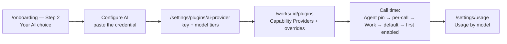

# Bring Your Own AI Provider

Ever Works never hard-wires a model. Every AI call — generating a Work, writing an item description, answering in the chat rail, embedding a Knowledge Base document — resolves an **AI provider plugin** at the moment of the call. Which plugin that is, and whose API key it spends, is yours to decide: the managed default, a commercial API on your own key, a gateway, or a model running on your own hardware.

This guide takes you from the choice in the setup wizard to a provider configured, tiered, overridden per Work, and visible in your usage reports.

Routes are written without the locale prefix — the address bar shows `/en/settings/plugins/ai-provider`, this guide says `/settings/plugins/ai-provider`.



## Two different choices, often confused

| You are choosing…  | What it is                                                                                                              | Where it lives                                                        |
| ------------------ | ----------------------------------------------------------------------------------------------------------------------- | --------------------------------------------------------------------- |
| An **AI provider** | The model API that answers a completion, a structured-JSON call or an embedding. Declares the `ai-provider` capability. | `/settings/plugins/ai-provider`, and per Work at `/works/:id/plugins` |
| A **pipeline**     | The engine that orchestrates a whole generation run. Declares the `pipeline` capability.                                | `/settings/plugins/pipeline`, and per run under **Advanced Settings** |

Most pipelines call whatever AI provider you configured. A few CLI-agent pipelines carry **their own** credential and bypass the AI provider entirely — [see below](#6-pipelines-that-bring-their-own-credential). Getting these two confused is the usual reason a freshly pasted API key appears to do nothing.

## 1. Choose your provider in the setup wizard

The wizard at `/onboarding` (also reachable as a dialog from the dashboard) makes the AI choice its second step.

1. Open `/onboarding`. **Step 1 — Welcome** has nothing to choose; press **Next**.
2. On **Step 2 — Your AI choice**, pick one of six cards. Every card except the first carries a **BYOK** badge — bring your own key.

| Card              | What it does                                                                                           | Plugin it configures |
| ----------------- | ------------------------------------------------------------------------------------------------------ | -------------------- |
| **Ever Works AI** | The default. Uses the provider Ever Works has configured. No setup, no credential.                     | —                    |
| **OpenRouter**    | Routes AI calls through OpenRouter on your own API key.                                                | `openrouter`         |
| **Claude Code**   | Anthropic Claude via the Claude Code CLI. An OAuth token taps your Claude plan with no per-token cost. | `claude-code`        |
| **Codex**         | The Codex CLI, connected through a device-authorisation flow.                                          | `codex`              |
| **Gemini**        | Google Gemini via your AI Studio API key.                                                              | `gemini`             |
| **Grok (xAI)**    | xAI Grok via your xAI API key.                                                                         | `grok`               |

3. Picking anything other than **Ever Works AI** inserts a **Configure AI** step straight after it — titled _Configure &lt;plugin name&gt;_, described as _"Paste your credentials below. Skip to come back later."_ Fill it in, or skip it and finish from Settings afterwards.
4. If the plugin authenticates by OAuth or device code rather than a pasted key, the step shows that panel instead, plus a **Refresh** button in the footer so you can complete the flow in another tab and re-check the connection without leaving the wizard.
5. Finish the wizard. Every choice is written to the server as you go, so closing the tab mid-way leaves a **Setup** badge in the dashboard header rather than losing your progress.

:::note Cards marked "Coming soon" depend on your installation
The catalog behind these cards is served by `GET /api/onboarding/catalog`, and each card carries an `available` flag driven by the deployment's configuration. A card that is selectable on the hosted platform can appear greyed out on a self-hosted one. Trust the badge in front of you.
:::

Nothing here is permanent. **Settings → AI Providers** is where you change it later — which is also where you go if you skipped the wizard entirely.

## 2. Configure a provider from Settings

`/settings/plugins` has no page of its own: it redirects to `/settings/plugins/ai-provider`, the AI Providers category. That page lists only the AI providers **you have already enabled** — and a category page with an empty list answers _page not found_, so the very first thing to do is enable a plugin.

1. Open `/plugins` and find the provider you want (the search box matches name, description, category and capabilities).
2. Press **Enable** on its card. A dialog opens carrying one checkbox, **Also enable for all works**, ticked by default. Press **Enable** again in the dialog to commit — the first click only opens it.
3. Open the plugin's page from **Settings** on its card, or go back to `/settings/plugins/ai-provider`.
4. Paste the API key and press **Save Settings**.
5. Open the **Default Model** picker. It is a `model-select` widget that calls the plugin's `listModels()` live, so a working credential is what makes the list appear.

:::caution Enable first, then save
With the plugin disabled the Save button is greyed out and the page prints _"Enable this plugin first, then save its settings."_ Enable, then paste your key — not the other way round.
:::

:::caution Account-level "on" does not cascade to your Works
Disabling a plugin at `/plugins` cascades to every Work. Enabling one does **not** — unless you ticked **Also enable for all works**, or you enable it on the Work's own Plugins tab. This asymmetry is the single most common reason a freshly configured provider appears to do nothing.
:::

Saved secrets come back **partially revealed** — first four characters, a mask, last four (`sk-1••••9f2a`) — rendered read-only. Press **Modify** to replace one; there is no way to read the old value back, so if you lost it, generate a fresh key at the provider.

### The eleven AI provider plugins

| Provider              | Plugin ID           | Credential                                                  | Notes                                                                                                                                  |
| --------------------- | ------------------- | ----------------------------------------------------------- | -------------------------------------------------------------------------------------------------------------------------------------- |
| **OpenAI**            | `openai`            | API key (user-scoped, encrypted)                            | Tiers default to `gpt-5-nano` / `gpt-4o-mini` / `gpt-5.1`; also carries the embedding and transcription models the Knowledge Base uses |
| **Anthropic**         | `anthropic`         | API key                                                     | Default model `claude-sonnet-4-5-20250514`; no embeddings                                                                              |
| **Google Gemini**     | `google`            | API key                                                     | Default model `models/gemini-2.5-flash`; embeddings supported                                                                          |
| **Grok (xAI)**        | `grok`              | API key, env fallback `XAI_API_KEY`                         | 131,072-token context, vision and tool calling over an OpenAI-compatible transport                                                     |
| **Groq**              | `groq`              | API key                                                     | Default model `qwen/qwen3-32b`; LPU inference, which the platform's "fastest" selection strategy prefers                               |
| **Mistral**           | `mistral`           | API key, env fallback `PLUGIN_MISTRAL_API_KEY`              | Default model `mistral-small-latest`; every tier has its own `PLUGIN_MISTRAL_*` env fallback                                           |
| **Ollama**            | `ollama`            | Server URL; API key only for a secured instance             | Your own models — see [Run models on your own hardware](#3-run-models-on-your-own-hardware)                                            |
| **LM Studio**         | `lm-studio`         | Server URL; API key only behind an auth proxy               | Local desktop server, OpenAI-compatible                                                                                                |
| **vLLM**              | `vllm`              | Server URL; API key `EMPTY` unless started with `--api-key` | High-throughput GPU serving                                                                                                            |
| **OpenRouter**        | `openrouter`        | API key, env fallback `PLUGIN_OPENROUTER_API_KEY`           | Gateway to many upstream models on one key; auto-enabled, and the platform's default AI provider                                       |
| **Vercel AI Gateway** | `vercel-ai-gateway` | API key, env fallback `PLUGIN_VERCEL_AI_GATEWAY_API_KEY`    | Gateway with caching, rate limiting and observability; base URL `https://ai-gateway.vercel.sh/v1`                                      |

All eleven extend the same `BaseAiProvider` and delegate to the shared `AiOperations` layer, so they support chat completion, structured JSON output, streaming, model listing and a connection test through one code path. Capability differences — vision, embeddings, tool calling, context length — are reported per model; see [AI Provider Plugins](../plugin-system/ai-provider-plugins.md) for the per-provider matrix.

:::note Models without a dedicated plugin
The eleven above are the plugins that ship. A model family with no plugin of its own — including most reasoning-model releases — reaches you through **OpenRouter** or **Vercel AI Gateway**. That is exactly what those two are for: one key, one plugin, many upstream models.
:::

An **env-var fallback** (`x-envVar` on the setting) is the operator's default, not your key. It only fills a field you left blank, and it counts as a platform-supplied credential for billing — which matters in [What BYOK does to your credits](#7-what-byok-does-to-your-credits).

## 3. Run models on your own hardware

Three of the eleven talk to a server you run. All three speak the OpenAI-compatible `/v1` API, so they reuse the same transport as everything else — only the base URL changes.

| Plugin      | Default Base URL            | Start it with                                    | API key                                          |
| ----------- | --------------------------- | ------------------------------------------------ | ------------------------------------------------ |
| `ollama`    | `http://localhost:11434/v1` | Install Ollama, then `ollama pull <model>`       | Usually none; only for a secured instance        |
| `lm-studio` | `http://localhost:1234/v1`  | LM Studio → **Developer** tab → **Start Server** | Usually none; only behind an auth proxy          |
| `vllm`      | `http://localhost:8000/v1`  | `vllm serve <model>`                             | `EMPTY` unless launched with `--api-key <token>` |

To wire one up:

1. Start the server and confirm at least one model is loaded or pulled.
2. Enable the plugin at `/plugins`, then open `/settings/plugins/ai-provider`.
3. Set the **Server URL** field — **include the `/v1` suffix**. A missing `/v1` is the most common cause of a `Connection refused`.
4. Save, then open the **Default Model** picker. For LM Studio and vLLM there is no hardcoded default: the list is populated from what your server is actually serving, so the connection has to work before you can pick. For vLLM, choose the model you passed to `vllm serve --model …`.
5. Optionally set the **Embedding Model** — only needed if you use Knowledge Base semantic search.

:::warning A `localhost` URL only works where generation actually runs
The base URL must be resolvable **from the machine executing the run**, not from your browser. On managed hosting, `http://localhost:11434/v1` points at the platform's own container, not your laptop. Local models therefore mean one of: a self-hosted Ever Works deployment on the same network, [Ever Works Desktop](../features/desktop-app.md) running the stack on your machine, a [Fleet](../features/fleet.md) node of yours executing the work, or a server exposed at a reachable URL and secured with a token.
:::

The payoff is real: requests never leave your infrastructure, and there is no per-token bill — which is also why these runs consume no platform credits.

## 4. Model tiers, and how a model actually gets picked

Every AI provider plugin exposes four model fields, not one:

| Field          | Label in the UI          | Used for                                        |
| -------------- | ------------------------ | ----------------------------------------------- |
| `defaultModel` | **Default Model**        | Everything, unless a tier-specific model is set |
| `simpleModel`  | **Simple Tasks Model**   | Tags, short descriptions, quick classifications |
| `mediumModel`  | **Standard Tasks Model** | Listings, summaries, content reformatting       |
| `complexModel` | **Complex Tasks Model**  | Full page generation and multi-step analysis    |

You do not choose a tier per call — the pipeline tags each task with a complexity and the AI facade maps it onto the field. The resolution order for a single call is exact:

1. An explicit **model override** on the call (for example, a model pinned in the chat rail's **Model** picker).
2. The **`{complexity}Model`** field, when the task carried a complexity hint and that field is set.
3. **`defaultModel`** from settings.
4. The plugin's own built-in default.

**Auto-escalation** sits on top: when a call that carried a complexity hint fails, the facade retries once with the next higher tier's configured model (`simple → medium → complex`), logging _"Escalating from … to …"_. It is on unless the caller turns it off, and it only escalates to a tier you have actually filled in — which is the argument for setting all three.

Setting `simpleModel` to something cheap and `complexModel` to something strong is the highest-leverage cost control available to you, and it costs nothing to configure.

:::note The operator-level model router is a different, off-by-default thing
There is also a deployment-wide router that maps `SIMPLE` / `MEDIUM` / `COMPLEX` onto `ECONOMY` / `STANDARD` / `PREMIUM` tiers **across providers**, configured entirely by environment variables (`MODEL_ROUTING_ENABLED`, `MODEL_ROUTING_ECONOMY_PROVIDER`, and so on) and disabled by default. It is an operator control on a self-hosted install, not a per-user setting. See [Model Router](../ai-agents/model-router.md).
:::

## 5. Override the provider for one Work

Account settings are the fallback, not the law. A Work can run on a different provider, a different model, or a different key from the rest of your account.

1. Open the Work, then its **Plugins** tab at `/works/:id/plugins`. This needs the **Manager** or **Owner** role on that Work.
2. The panel at the top is **Capability Providers** — _"Select which plugin provides each capability for this Work"_. Find the `ai-provider` row and choose the plugin this Work should use.
3. Turn off **Show installed only** if the provider you want is hidden: the toggle starts on, so plugins you have not enabled at the account level do not appear.
4. To change the model or the key rather than the plugin, open that plugin's card on the same tab: _"Override settings for this Work. Unset fields inherit from your user settings."_ Fields you leave blank keep inheriting. **Reset to Defaults** clears the Work's overrides.

At call time the provider is resolved fresh, in this order:

| #   | Source                                                            | Falls through on a miss?                    |
| --- | ----------------------------------------------------------------- | ------------------------------------------- |
| 1   | The **Agent's** pinned provider, when an Agent is making the call | **No** — fails with `ProviderNotFoundError` |
| 2   | An explicit per-call override                                     | **No** — fails with `ProviderNotFoundError` |
| 3   | The Work's **Capability Providers** choice                        | Yes                                         |
| 4   | An enabled plugin that declares itself the capability default     | Yes                                         |
| 5   | Otherwise, the first enabled one                                  | Ends in `NoProviderError` if there is none  |

Rows 1 and 2 are hard pins on purpose: an [Agent](../features/agents.md) with a provider pinned either runs on that provider or does not run, so a per-Agent budget can never be quietly spent against a different account.

## 6. Pipelines that bring their own credential

Some pipelines are CLI agents that authenticate on their own account and never read your AI provider setting. Pick one at `/settings/plugins/pipeline`, or per run under **Advanced Settings** on the create-a-Work form.

| Pipeline                         | Plugin ID              | Where its credential comes from                                                                               |
| -------------------------------- | ---------------------- | ------------------------------------------------------------------------------------------------------------- |
| **Standard Pipeline** (15 steps) | `standard-pipeline`    | The Work's configured `ai-provider`                                                                           |
| **Agent Pipeline**               | `agent-pipeline`       | The Work's configured `ai-provider`                                                                           |
| **OpenCode**                     | `opencode`             | The Work's configured `ai-provider` — it explicitly reuses that provider's base URL, key and model            |
| **Claude Code**                  | `claude-code`          | Its own: an **OAuth Token** (bills your Claude plan, no per-token cost) or an **API Key** (per-token billing) |
| **Claude Managed Agent**         | `claude-managed-agent` | Its own API key; the Managed Agents API it calls is in beta                                                   |
| **Codex**                        | `codex`                | Its own: `api-key`, `access-token`, or `device-auth` — it declares the `device-auth` capability               |
| **Gemini CLI**                   | `gemini`               | Its own AI Studio API key (env fallback `PLUGIN_GEMINI_API_KEY`)                                              |
| **Hermes Agent**                 | `hermes-agent`         | A Hermes profile already configured on the backend machine via `hermes model`; you enter the profile name     |

The **Claude Code** plugin adds a **Billing Mode** setting worth knowing about, because it decides which account pays:

- `subscription` uses the OAuth token **only**. If the token is missing the run fails, rather than quietly spending API credit.
- `api-key` uses the API key, falling back to the OAuth token when no key is set — that direction costs plan quota rather than money you did not authorise.
- Left unset, whichever of the two is configured wins, with the OAuth token taking precedence when both are.

**Device authorisation** (Codex, and any plugin declaring `device-auth`) follows the standard device-code shape: the plugin hands the platform a verification URL and a user code, you complete the flow on the provider's own site, and the **Device Authentication** panel on the plugin's page reports the result. In the wizard, press **Refresh** after finishing in the other tab.

At `/settings/plugins/pipeline` you can also nominate a **global default pipeline** and tick enforce — which locks every user on the install to it. Leaving it on **Auto** lets the platform resolve one. That page is the only plugin category page that renders even when its list is empty.

## 7. What BYOK does to your credits

Credits are the platform's unit of consumption, and the rule for bringing your own key is short:

**A run on a key you supplied spends no credits.**

Concretely: at settlement the platform checks where each plugin's `apiKey` was resolved from. If the source is the **user** or **work** settings level — you pasted it — that plugin's spend is removed from the billable sum, produces no `consumption` ledger row, and costs you nothing. If the key came from the platform's own environment or admin configuration, it bills normally.

Two honest caveats:

- The spend is still **metered and shown**. It stays on the run's recorded cost and in the usage surfaces, labelled — so BYOK makes your reports more useful, not blanker.
- When key provenance cannot be determined (a deployment where the plugin-settings service is not wired, or a resolution that throws for one plugin), the affected spend is billed at the platform rate rather than given away. Doubt bills; it does not exempt.

Local models — Ollama, LM Studio, vLLM — are the same story with no bill at either end.

### Seeing where it went

**Settings → Usage & Credits** (`/settings/usage`) answers "where did the credits go?". One reporting period drives the whole page — the tiles and all four charts always describe the same window.

1. Open `/settings/usage`. The period selector accepts a calendar month (`YYYY-MM`) or a rolling `7d` / `30d`, and `?period=` is honoured server-side, so `/settings/usage?period=2026-07` is a shareable link to exactly that month.
2. Read **Usage by model** — the breakdown that tells you whether your tier configuration is doing its job, or whether everything is quietly landing on the expensive model.
3. Cross-check **Usage by agent** and **Usage by Work**. Rows that cannot be attributed are grouped as **Unattributed** rather than dropped, so the totals still add up.
4. **Export CSV** downloads every usage event in the selected period via `GET /api/credits/usage/export?period=…`, using whatever the selector is set to, so the export and the charts always agree.

For a hard ceiling rather than a report, pair this with [Budgets](../features/budgets-and-usage.md): budgets block a call **before** it runs, at Work, Mission, Idea or account scope; credits are the account-level balance the platform meters against. They are complementary, not alternatives.

## 8. Do it from the CLI or the API

The dashboard is not the only surface.

```bash
# Browse, enable and configure plugins interactively, filtered to AI providers
ever-works plugins --category ai-provider
```

The CLI walks the same lifecycle as the UI: search the list, open a plugin's detail view (id, version, category, status, capabilities, settings field counts), then **Enable** — which prompts for the required settings and asks whether to auto-enable for your Works — **Disable**, or **Configure** to edit every field. `ever-works work plugins` does the same thing scoped to one Work.

The REST surface behind both:

| Call                                                   | Does                                                         |
| ------------------------------------------------------ | ------------------------------------------------------------ |
| `GET /api/plugins`                                     | Every plugin your install carries, with status               |
| `GET /api/plugins/:pluginId/models`                    | The provider's live model list — what the model picker shows |
| `POST /api/plugins/:pluginId/enable`                   | Enable for your account                                      |
| `PATCH /api/plugins/:pluginId/settings`                | Write the API key and model fields                           |
| `GET /api/works/:workId/plugins`                       | The Work's plugin list plus its capability providers         |
| `PATCH /api/works/:workId/plugins/:pluginId/settings`  | The per-Work settings override                               |
| `POST /api/works/:workId/plugins/:pluginId/capability` | Pin a plugin as the Work's provider for a capability         |
| `GET /api/credits/usage-summary?groupBy=model`         | The Usage-by-model breakdown as data                         |

Device-code flows live under `/api/device-auth` — a status read and a start call, both per plugin. See [Device Auth Capability](../api/device-auth-capability.md).

## Troubleshooting

| Symptom                                                                   | Likely cause                                                                                                               | Fix                                                                                                    |
| ------------------------------------------------------------------------- | -------------------------------------------------------------------------------------------------------------------------- | ------------------------------------------------------------------------------------------------------ |
| `/settings/plugins` lands on _page not found_                             | It redirects to the AI Providers category, and you have no AI provider enabled yet                                         | Enable one at `/plugins` first, then come back                                                         |
| Save greyed out, _"Enable this plugin first, then save its settings."_    | The plugin is configured but not enabled                                                                                   | Press **Enable** on its card at `/plugins`, confirm in the dialog, then save                           |
| Key saved, model picker empty                                             | `listModels()` could not authenticate, or the local server is unreachable                                                  | Re-check the key; for local servers fix the Base URL first, then reopen the picker                     |
| Provider configured, but generation still uses the old one                | Account-level enable does not cascade into Works                                                                           | Tick **Also enable for all works**, or enable it on `/works/:id/plugins`                               |
| `<capability> provider not found: <id>`                                   | An Agent pin or per-call override names a plugin that is not registered, loaded, enabled and capable                       | Fix the pin on the Agent, or enable that plugin for the scope — these two overrides never fall through |
| `Connection refused` from a local server                                  | Base URL missing the `/v1` suffix, wrong port, or the server is not running                                                | Use `http://localhost:11434/v1`, `:1234/v1` or `:8000/v1` as appropriate, and confirm the server is up |
| Local server reachable from your browser but not from the platform        | Generation runs somewhere your `localhost` does not exist                                                                  | Self-host, use Desktop or a Fleet node, or expose the server at a reachable URL secured with a token   |
| `401` / `Invalid API key`                                                 | Key missing, revoked, or scoped to a different organization                                                                | Re-enter it via **Modify**; check the org or project at the provider                                   |
| `429 Too Many Requests`                                                   | The provider's per-minute, per-token or per-account quota is exhausted                                                     | Reduce concurrency, raise the quota upstream, or move the affected tier to a cheaper model             |
| `Model not found` / `400 invalid model`                                   | The model id is not enabled for your account, region or beta program — or, on vLLM, is not the model being served          | Pick an enabled model in the picker; on vLLM match `vllm serve --model …`                              |
| Empty or truncated output                                                 | **Max Tokens** too low, or the context window exceeded                                                                     | Raise **Max Tokens** (a hidden advanced field) or split the input into smaller batches                 |
| Everything lands on the expensive model                                   | Only `defaultModel` is set, so no complexity tier can apply                                                                | Fill in **Simple** and **Standard** as well — auto-escalation only reaches tiers you configured        |
| A BYOK run still debited credits                                          | The key resolved from an env var or admin config, so it counted as platform-supplied — or provenance could not be resolved | Save the key as your own user- or Work-scoped setting instead of relying on the operator's fallback    |
| Chat rail says _"This provider is not configured. Set it up in Plugins."_ | The provider selected in the rail's toolbar has no credentials                                                             | Add them at `/settings/plugins/ai-provider`, or pick another provider in the toolbar                   |

## Related

- [AI Provider Plugins](../plugin-system/ai-provider-plugins.md) — the per-provider capability matrix and the shared settings schema
- [Plugins](../features/plugins.md) — enabling, the account/Work switch asymmetry, secret handling, capability resolution
- [Onboarding & Setup Wizard](../features/onboarding.md) — all ten steps, and what each choice maps to in Settings
- [Model Router](../ai-agents/model-router.md) — the operator-level cross-provider tier router
- [Pipeline Plugins](../plugin-system/pipeline-plugins.md) · [Creating a Work](../features/creating-a-work.md) — where the pipeline choice is made
- [Credits & Billing](../features/credits-and-billing.md) · [Budgets & Usage](../features/budgets-and-usage.md) — the two halves of cost control
- [Agents (Your AI Employees)](../features/agents.md) — per-Agent provider pins and budgets
- [Desktop App](../features/desktop-app.md) · [Fleet](../features/fleet.md) — where a local model server becomes reachable
- [Knowledge Base & Memory](../features/knowledge-base.md) — what the embedding and transcription model fields feed
- [Settings Map](../features/settings-map.md) — where every other setting lives
- [CLI Plugin Commands](../cli/plugin-commands.md) · [Plugins API](../api/plugins-api.md) · [Device Auth Capability](../api/device-auth-capability.md)
