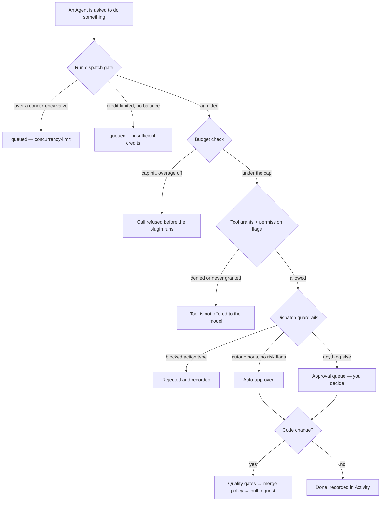
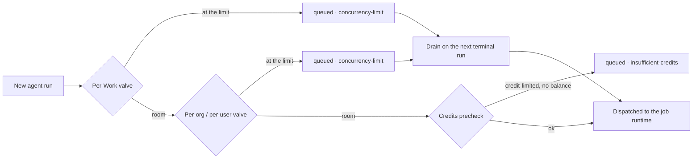

# Budgets and Guardrails

A workforce that runs while you sleep is only worth having if you can say, precisely, **how far it may go**. Ever Works gives you two independent families of limits:

- **Money limits** — spend caps that refuse an AI, search, screenshot or content-extraction call before it is made.
- **Action limits** — guardrails, tool grants, merge policy, quality gates and environment networking that decide what an Agent may _do_, regardless of what it can afford.

They are separate on purpose. A cheap action can still be destructive, and an expensive one can be perfectly routine. This guide walks every ceiling the platform ships, says where each one is set, what happens when it is reached, and ends with a checklist you can apply to a brand-new team in about ten minutes.

Routes are written the way you type them, without the locale prefix — the address bar shows `/en/agents`, this guide says `/agents`.



## Where every ceiling lives

| Ceiling                      | What it limits                                                              | Where you set it                                                                                                  | What happens at the limit                                                            |
| ---------------------------- | --------------------------------------------------------------------------- | ----------------------------------------------------------------------------------------------------------------- | ------------------------------------------------------------------------------------ |
| **Account-wide monthly cap** | Total spend across every Work, Idea and Mission you own, per calendar month | **Settings → Work Agent → Account-wide budgets** (`/settings/work-agent`)                                         | Idea generation and auto-build pause until the next cycle, unless overage is allowed |
| **Mission guardrails**       | Works per tick, items per Work, spend per tick, approval thresholds         | Account defaults on `/settings/work-agent`; per-Mission override via `PATCH /api/me/missions/:id`                 | The tick is held for approval, refuses, or runs dry                                  |
| **Work global cap**          | Every billable plugin call made for one Work, per calendar month            | **Work → Settings → Budgets & Usage** (`/works/:id/settings/budgets-usage`)                                       | The call is refused before the plugin is invoked                                     |
| **Work per-plugin cap**      | One plugin's spend on that Work                                             | Same screen, **Per-plugin caps**                                                                                  | Same — that plugin's next call is refused                                            |
| **Agent budget row**         | One Agent's spend per hour / day / week / month                             | Not writable from the dashboard or the public API yet — see [What is not enforced yet](#what-is-not-enforced-yet) | The run is failed and `agent_budget_exceeded` is recorded                            |
| **Concurrency valves**       | How many runs may be in flight at once, per Work and per org/user           | Operator environment variables                                                                                    | The run is created **parked**, not dropped, and drains when a slot frees             |
| **Credits**                  | Whether a credit-limited plan may start another run at all                  | Your plan and balance                                                                                             | The run parks with `insufficient-credits` until you top up                           |
| **Dispatch guardrails**      | Which side-effectful actions an Agent may take on its own                   | **Agent → Dashboard tab → Guardrails card** (`/agents/:id`)                                                       | The proposal is queued for you, or rejected outright                                 |
| **Tool grants**              | Which named tools an Agent may call                                         | **Agent → Capabilities → Agent tools** (`/agents/:id/capabilities`)                                               | The tool is never assembled into the run                                             |
| **Permission flags**         | Eight coarse capability switches per Agent                                  | **Agent → Settings → Permissions** (`/agents/:id/settings`)                                                       | The whole tool family is never assembled                                             |
| **Merge policy**             | Whether an Agent may land its own pull request                              | Work Settings, Agent Settings, Organization Settings                                                              | The merge is refused and a `merge-refused` escalation is filed                       |
| **Quality gates**            | What "done" means for an agent-executed Task                                | **Work → Settings → Quality gates** (`/works/:id/settings`)                                                       | Red blocks completion; the Agent iterates within a bounded attempt budget            |
| **Task isolation**           | Whether an Agent touches your main line at all                              | **Work → Settings → Task isolation** (`/works/:id/settings`)                                                      | Work happens on a `task/<slug>` branch and arrives as a pull request                 |
| **Environment networking**   | Which hosts a managed-agent run may reach                                   | **Settings → Environments** (`/settings/environments`)                                                            | Egress outside the allow-list is blocked inside the sandbox                          |
| **Auto-pause on failures**   | How many consecutive failed runs an Agent gets                              | **Agent → Settings → Pause after failures** (`/agents/:id/settings`)                                              | The Agent moves to `error` and its heartbeat is cleared                              |

## Budgets, level by level

Every billable call records a usage row tagged with the plugin that ran, the owner it bills against, the units the plugin reported and a cents cost computed from that plugin's price list. Caps are evaluated against those rows. The full data model is in [Budgets & Usage](../features/budgets-and-usage.md); this section is about where you actually click.

### Account-wide

The account cap is the one ceiling that covers everything you own — every Work, every Idea, every Mission — for the current **calendar month, UTC**.

1. Go to **Settings → Work Agent** (`/settings/work-agent`) and scroll to **Account-wide budgets**.
2. Tick **Set a monthly cap** and enter a **Monthly spend cap (USD)**.
3. Decide on **Allow overage past the cap (with warning)**. Leave it off for a hard stop; turn it on if you would rather be told than blocked.
4. Save the section.

With the cap enabled and reached, the platform pauses Idea generation and auto-build until the next cycle rather than continuing and billing you.

### Mission guardrails

The same screen carries a **Guardrails** section that sets the account defaults every Mission and build request inherits:

| Field                             | What it caps                                                                       |
| --------------------------------- | ---------------------------------------------------------------------------------- |
| **Max Works per run**             | How many Works a single tick may spawn or queue                                    |
| **Max items per Work**            | How many items each spawned Work's generation may produce                          |
| **Max budget per run**            | Hard spend cap for one tick                                                        |
| **Approval threshold**            | Approval kicks in only when the spend forecast crosses this amount                 |
| **Confirm before creating Works** | Holds builds until you approve                                                     |
| **Confirm before deleting items** | The same, for destructive operations                                               |
| **Dry run by default**            | Run the loop without making real AI calls — the cheapest way to test a new Mission |

A single Mission can override any of these fields on its own. The Mission detail page shows a **Guardrails** section that reads either _"Custom guardrail overrides are active on this Mission"_ or _"No overrides set — using your global Work-agent guardrails"_, so you always know which set is in force. Write an override with `PATCH /api/me/missions/:id` and a `guardrailsOverride` object; any field you leave out falls through to the account default.

Ideas inherit their Mission's guardrails. Their spend rollup is readable at `GET /api/me/work-proposals/:id/budget`, and a Mission's at `GET /api/me/missions/:id/budget`.

### The Work cap — the one that actually blocks a call

This is the ceiling to reach for first, because it is enforced at the narrowest point in the system: immediately before a plugin is invoked.

1. Open the Work, then **Settings → Budgets & Usage** (`/works/:id/settings/budgets-usage`). The tab is visible only to members whose Work role can access settings — everyone else gets a 404 rather than a peek at your spend.
2. Under **Global cap**, enter a **Monthly cap** in your currency and click **Create global cap**.
3. Leave **Allow overage (warn but don't block at 100%)** unticked for a hard stop.
4. Watch the progress bar underneath: _"Spent $12.40 of $50.00 (25%)"_. It turns red the moment spend reaches the cap, computed from raw cents so it never flips a tick early.

Reads need a viewer role; creating, editing and deleting caps needs a manager role. Over the API the same rows are `GET` / `POST /api/works/:workId/budgets` and `PATCH` / `DELETE /api/works/:workId/budgets/:budgetId`. A second `POST` for a scope that already has a cap answers `409` and tells you to patch it instead.

### Per-plugin caps

A global cap stops the bleeding; a per-plugin cap tells you **where** it was coming from — and lets you leave cheap capabilities alone while fencing an expensive one.

1. On the same **Budgets & Usage** page, find **Per-plugin caps** — _"Optional. Caps a single plugin alongside the global cap."_
2. Under **Add plugin cap**, pick the **Plugin** from the dropdown, set its **Monthly cap**, and click **Add cap**.
3. Each capped plugin gets a row showing _"Spent … of … (…%)"_ with its own **Save** and delete controls.

Only plugins that actually produce billable usage are offered, and only ones enabled on this Work:

| Eligible plugin category | Examples                                         |
| ------------------------ | ------------------------------------------------ |
| `ai-provider`            | openai, anthropic, google, groq, mistral, ollama |
| `search`                 | tavily, brave, exa, perplexity, firecrawl        |
| `screenshot`             | screenshotone, urlbox, scrapfly                  |
| `content-extractor`      | notion-extractor, pdf-extractor, scrapfly        |

Capping anything else — a git provider, a deployment plugin — would be a no-op, because no usage rows are ever recorded for those categories. If the picker says _"Enable an AI, search, screenshot or content-extractor plugin for this directory to set a per-plugin cap"_, enable one on the Work's [Plugins](../features/plugins.md) tab first.

Below the caps, **Spend by plugin** is a read-only breakdown for the current period — plugin, capability, units, cost — and **Download CSV** in the page header exports the same usage rows for the Work.

### Per-Agent budgets

Each Agent has a **Budgets** tab (`/agents/:id/budgets`) reporting its spend over a **rolling 30-day window**, attributed from the usage rows tagged to that Agent. Two Agents never see each other's numbers, and a stranger asking for yours gets a `404`.

Treat this tab as a **readout**, not a ceiling: see [What is not enforced yet](#what-is-not-enforced-yet) for exactly how far the per-Agent cap goes today, and put the limits that must hold on the Work and the account.

## What happens when a cap is hit

Ever Works tells you before it stops you, and stops you before the money is spent.

**Alerts.** Crossing 75%, 90%, 100% or going into overage raises an alert once per threshold per period. The in-app notification always fires. The email is opt-out per user: **Settings → Profile → Budget alert emails → Email me budget alerts**.

**Blocking.** The guard runs at the top of every AI, search, screenshot and content-extraction facade call and refuses in two distinct ways:

| Check           | Fires when                                                                       | Result                                                                                           |
| --------------- | -------------------------------------------------------------------------------- | ------------------------------------------------------------------------------------------------ |
| **Post-flight** | A previous call already pushed spend to or past the cap                          | The call is refused; the plugin is never invoked                                                 |
| **Pre-flight**  | This call's estimated maximum cost would cross a cap that does not allow overage | Refused before invocation, so one expensive request cannot blow the cap by an order of magnitude |

Both the global cap and the plugin cap are evaluated, and the strictest one wins. **Allow overage** turns a cap into an alert: the call proceeds and the spend lands on the usage row.

A refusal is never silent. It surfaces as a failed operation with the reason recorded, and a run that stopped because of a ceiling files a `budget-stop` [escalation](../features/approvals-and-escalations.md) into your [Inbox](../features/inbox.md).

## The run dispatch gate

Before any of that, a run has to get **capacity**. Every path that enqueues an agent run — task fan-out, board runs, resume, an `@agent` mention in a task chat, the heartbeat cron, run-now, and `POST /api/agents/:id/assign-task` — passes through one dispatch gate, which evaluates three policies in a fixed order.



| Valve                                | Default | Scope                                                        |
| ------------------------------------ | ------- | ------------------------------------------------------------ |
| `AGENT_MAX_CONCURRENT_RUNS_PER_WORK` | `10`    | In-flight runs for one Work                                  |
| `AGENT_MAX_CONCURRENT_RUNS_PER_ORG`  | `25`    | In-flight runs for one organization, or one user with no org |

These are **operator safety valves, not product limits** — set either to `0` or below to disable it entirely. A plan's `max-concurrent-runs` entitlement can raise the org valve for the buyer (behind `PLAN_CONCURRENCY_ENFORCEMENT`) but is deliberately **raise-only**: it is consulted only once the environment valve has already decided to park, so it can exempt a run and never park one.

Two things matter for day-to-day operation:

- **A parked run is not a lost run.** It is created with `status: queued` and a `queuedReason`, and the **Sessions** view (**Sidebar → Teams → Sessions**) shows _"Waiting for a concurrency slot"_ on the row. When a run reaches a terminal state, the gate promotes the **oldest** parked run for that Work; a stuck-run sweeper is the safety net behind that.
- **The two queued reasons behave differently.** `concurrency-limit` drains automatically. `insufficient-credits` does not — a credit-parked run is waiting for a top-up, not for capacity, and stays visibly queued until you add credits. A run that never gets capacity inside the bound files a `queued-too-long` escalation.

The gate is **fail-open** by design: if its own counting query breaks, the run is dispatched anyway. A broken safety valve must never stop legitimate work.

Credit enforcement itself follows the money — it is on when a billing provider is configured, and self-hosted plan codes carry no credit limit at all. See [Credits & Billing](../features/credits-and-billing.md).

## Guardrails: what an Agent may decide on its own

Guardrails are a per-Agent policy evaluated **before** a proposed side-effectful action ever reaches you. Every new Agent starts with no guardrails at all, which means the most conservative posture available: **everything queues for a human**.

| Field                    | Values                            | Effect                                                                                 |
| ------------------------ | --------------------------------- | -------------------------------------------------------------------------------------- |
| `mode`                   | `require_approval` · `autonomous` | `require_approval` queues every proposal; `autonomous` may auto-approve unflagged ones |
| `autoApproveActionTypes` | list, optional                    | Narrows `autonomous` to just these types; omitted means every type is eligible         |
| `blockedActionTypes`     | list, optional                    | Never allowed, in **either** mode                                                      |

The action types are a fixed set: `spawn_agent`, `schedule_task`, `send_message`, `budget_override`, `other`. A type can never be on both lists — the server refuses the overlap, and the card unticks the other side for you.

Two properties are worth internalising before you relax anything:

- **Risk flags always win.** Every proposal is scored first for `budget_override`, `destructive`, `cross_scope` and `high_fanout` (a `spawn_agent` three levels deep). Any flag at all forces the human queue, whatever the mode says. Autonomy buys speed on routine actions, never on dangerous ones.
- **Nothing is dropped silently.** A blocked action is persisted as a `rejected` proposal, an auto-approved one as `approved`, both stamped `decidedVia: guardrail` with no human on the record. The attempt is always in the history.

Set them at **Sidebar → Teams → Agents → your Agent** (`/agents/:id`) → the **Guardrails** card: pick a **Dispatch mode**, tick the action types, then **Save guardrails**. **Reset to default** puts you back to queue-everything. Over the API it is a whole-object `PUT /api/agents/:id/guardrails`, and `{"guardrails": null}` restores the default.

Pending proposals land in the **Action approvals** block on the dashboard home (`/`) with their action-type and risk badges — **Approve** or **Reject** per row, or **Approve all** for the visible queue. The same items are in the [Inbox](../features/inbox.md) if you prefer one queue for everything. Full detail, including escalations and human-in-the-loop questions, is in [Approvals & Escalations](../features/approvals-and-escalations.md).

## Tool grants: what an Agent may call

Guardrails gate _decisions_. Tool grants gate **capability** — the named tools that are assembled into a run at all.

Grants resolve down a four-level lattice over a permissive platform default:

```text
platform default  <  tenant  <  organization  <  Work  <  Agent
```

One rule makes this a security boundary rather than a preference: **a more specific scope may only ever narrow what its ancestors granted.**

- `allow` omitted means "inherit". `allow` present is **intersected** with the inherited set — a pattern the ancestors never granted is rejected, reported, and never widened in.
- `deny` is **additive and permanent**. Once a scope denies a tool, no descendant can un-deny it.

Patterns are deliberately tiny and case-insensitive: `*` matches everything, `prefix*` matches by prefix, anything else is an exact tool name. MCP tools are named `mcp__<server>__<tool>` and flow through the same matrix, so a tenant-level `deny` of `mcp__*` switches off every MCP tool beneath it.

In the dashboard, open **Agent → Capabilities** (`/agents/:id/capabilities`) → **Agent tools**. Tools are grouped by where they come from, each with a switch; a switch you cannot move tells you why (an inherited deny, or a wildcard deny on this Agent). **Reset to inherited** deletes this Agent's own grant row so it inherits everything again.

| Operation                | Endpoint                                                   |
| ------------------------ | ---------------------------------------------------------- |
| Preview the whole matrix | `GET /api/tool-grants/resolve?workId=…&agentId=…`          |
| Check one tool           | `GET /api/tool-grants/check?toolName=…&workId=…&agentId=…` |
| List your grant rows     | `GET /api/tool-grants`                                     |
| Write one scope's grant  | `PUT /api/tool-grants`                                     |
| Clear a scope            | `DELETE /api/tool-grants/:id`                              |

`resolve` returns the full chain, least to most specific, **including each layer's rejected patterns** — because "that tool isn't available" is only actionable if the answer also says which layer said so. Refusals carry a stable code: `tool-denied`, `tool-not-granted` or `tool-name-invalid`.

:::tip Permissions are stronger than a deny
The eight permission flags on **Agent → Settings → Permissions** — Create agents, Assign tasks, Edit skills, Edit instructions, Spend budget, Commit to repo, Open pull requests, Call external tools — decide whether a whole family of tools is assembled in the first place. Leaving a flag off is a stronger statement than denying its tools by name, because the model never sees them. Every flag defaults to off on a new Agent.
:::

Note the failure posture, which differs from the merge policy on purpose: if grant resolution itself errors, it degrades to the permissive platform default with a warning. The per-Agent permission flags still apply underneath, and an access-layer outage silently stripping every Agent of every tool would be worse than the matrix briefly not narrowing.

## Guardrails for code changes

When an Agent touches a repository, three more mechanisms stack up. All three are configured on the Work's **Settings** page (`/works/:id/settings`).

**1. Task isolation.** Under **Task isolation**, tick _"Isolate Tasks in worktree branches"_. Each agent-executed Task then gets its own branch (`task/<slug>`) cut from a base branch you choose, a private working copy, and a pull request at the end instead of a direct commit. Nothing reaches your main line until you merge. Pick a **Base branch** and a **Branch cleanup** policy (delete on merge, or keep and clean up manually). A single Task can opt in or out from its **Branch** panel while it has no branch yet. See [Task Isolation](../features/task-isolation.md).

**2. Quality gates.** Under **Quality gates**, declare the **Default checks** every Task inherits (build, test, lint, typecheck, custom), then pick a **Checks policy**:

| Policy       | Behaviour                                                            |
| ------------ | -------------------------------------------------------------------- |
| **Off**      | Checks never run                                                     |
| **Warn**     | Checks run and report; red does not block                            |
| **Required** | Red blocks completion — the Agent iterates instead of declaring done |

**Max gate attempts** (1–5) bounds the red→iterate loop, and the loop is also consulted against your spend guardrails, so an expensive retry cycle stops when the budget does. Under **Required**, a refused pull request never destroys work: the branch is still written, committed and pushed — only the pull request is withheld, and the failing check ids come back with the refusal. See [Quality Gates](../features/quality-gates.md).

**3. Merge policy.** Under **Merge policy**, decide whether an Agent may land what it opened. The platform default is conservative: `allowAgentMerge: false`, a green gate required, a human approval required, squash only, and `main` / `master` / `develop` / `stage` protected. The policy resolves field by field across `platform default < tenant < organization < Work < Agent`, so setting one field on a Work leaves the rest inherited. A refusal carries a stable code (`agent-merge-disabled`, `protected-branch`, `gate-not-green`, `human-approval-required`, …) and becomes a `merge-refused` escalation. See [Merge Policy](../features/merge-policy.md).

Opening a pull request is a permission (`canOpenPullRequests`); merging one is this policy. The two are independent.

## Environments: what a run may reach

An [Environment](../features/environments.md) is a named runtime recipe — pip and npm packages plus a networking posture — that you publish once under **Settings → Environments** (`/settings/environments`) and assign to an Agent on its **Capabilities** or **Settings** tab.

| Networking mode  | What the run may reach                                                                             |
| ---------------- | -------------------------------------------------------------------------------------------------- |
| **Unrestricted** | Any host                                                                                           |
| **Limited**      | Only the hostnames you list, plus package-manager registries when **Allow package managers** is on |

Allowed hosts are bare hostnames with at most one leading `*.` label. URLs, ports, paths, IP literals and `localhost` / `.local` / `.internal` names are rejected at every layer — an allow-list entry names a public service, never the runtime's own network.

:::caution Environments are honoured by the managed-agent pipeline only
The screen, the API and the per-Agent assignment are all shipped and enforced server-side, but what an Environment **does** at run time is narrower: today it is honoured by the `claude-managed-agent` pipeline plugin, which turns it into the sandbox's networking policy and a package-install bootstrap. Every other pipeline plugin receives the resolved Environment as advisory metadata and ignores it. If a run seems unaffected by its Environment, check which pipeline it used before assuming a bug.
:::

Two behaviours are deliberate: a missing or unpublished Environment resolves silently to "no Environment" and the run proceeds as it did before Environments existed, while a resolver **error** fails the run rather than quietly downgrading it to the fallback posture.

## Auto-pause and the other safety nets

Underneath everything above sit the nets that stop a misbehaving Agent while nobody is watching.

| Net                        | What it does                                                                                                                                                                |
| -------------------------- | --------------------------------------------------------------------------------------------------------------------------------------------------------------------------- |
| **Auto-pause on failures** | Each failed run increments the Agent's error count; at **Pause after failures** the Agent moves to `error` and its heartbeat is cleared. A successful run resets the count. |
| **Doom-loop detector**     | Ends a run cycling on the same failure and files a `loop-detected` escalation with the evidence, instead of spending the rest of the retry budget on identical failures.    |
| **Escalations**            | Any run that gives up writes a confidence-scored record into your Inbox, ranked so the ones that genuinely need you come first.                                             |
| **Activity log**           | Budget blocks, environment changes and policy decisions all land in [Activity](../features/activity.md) with a stable action type.                                          |

Set the fuse on **Agent → Settings** (`/agents/:id/settings`) in the **Pause after failures** field: it defaults to **3** and accepts 1–20. Three is the right first value — two identical failures is what a legitimate "fix it and re-run" looks like when the fix was wrong.

## Safe defaults for a new team

A ten-minute pass that leaves you with real limits rather than good intentions. Do it once per account, then once per Work.

1. **Cap the account.** **Settings → Work Agent → Account-wide budgets** → tick **Set a monthly cap**, enter a number you would not mind losing, leave **Allow overage** off. This is your last line of defence.
2. **Turn on budget alert emails.** **Settings → Profile → Budget alert emails** → **Email me budget alerts**. Alerts fire at 75%, 90%, 100% and overage; you want the 75% one.
3. **Tighten the Mission guardrails.** Same Work Agent screen → **Guardrails** → set **Max Works per run** and **Max budget per run** to something small, and tick **Confirm before creating Works** and **Confirm before deleting items**. Turn on **Dry run by default** while you are still learning what a tick does.
4. **Cap each Work.** **Work → Settings → Budgets & Usage** → **Global cap** → **Create global cap**. This is the ceiling that actually refuses a plugin call, so it is the most important number on this list.
5. **Add one per-plugin cap.** Cap your AI provider under **Per-plugin caps**. It is usually the largest line in **Spend by plugin**, and capping it separately tells you _which_ capability ran away.
6. **Isolate the code.** **Work → Settings → Task isolation** → **Isolate Tasks in worktree branches**, base branch `main`, cleanup **Delete branch when merged**. Agents now propose; they do not push to your main line.
7. **Define done.** **Work → Settings → Quality gates** → add your real build and test commands as **Default checks**, set **Checks policy** to **Required** and **Max gate attempts** to 3. A Work that declares **Required** with no checks refuses everything, so add the commands before flipping the policy.
8. **Leave merge policy alone at first.** The default already means "Agents open pull requests, humans merge them". Loosen it only after a few pull requests you would have merged yourself.
9. **Create the Agent locked down.** **Sidebar → Teams → Agents → + New Agent**. On its **Settings** tab, enable only the permission flags it genuinely needs, and set **Pause after failures** to 3.
10. **Keep guardrails at the default.** A new Agent has none, which already means every proposal queues. On the **Guardrails** card, explicitly tick **`budget_override`** under blocked action types — that is the one you never want auto-approved — and **Save guardrails**.
11. **Narrow the tools if the Agent is narrow.** **Agent → Capabilities → Agent tools** → switch off everything outside its job. **Reset to inherited** undoes it in one click.
12. **Give network-touching Agents an Environment.** **Settings → Environments** → **New environment** → **Limited** networking with an explicit host list → **Save & publish**, then assign it on the Agent's **Capabilities** tab. Remember it binds on managed-agent runs.
13. **Run it and watch.** Trigger a heartbeat or assign a Task, then watch **Sidebar → Teams → Sessions** for queued reasons and the **Action approvals** block on `/` for proposals. After a few cycles you will know which of these ceilings to relax first.

Relax in this order, one step at a time: guardrail mode → merge policy → per-plugin caps → concurrency. Tighten in the reverse order.

## What is not enforced yet

Being straight about the edges, so you do not build a plan on a ceiling that is still being wired:

- **Per-Agent spend caps are a readout, not a limit.** The data model (`hour` / `day` / `week` / `month` / `unlimited`, cap, currency, overage flag) and the pre-run check both exist — a run that fails the check is marked failed and records `agent_budget_exceeded`. But there is no dashboard or public-API surface to **write** an Agent's cap row today, and `GET /api/agents/:id/budget` reports a rolling-30-day spend with `capCents: null`. Put the ceilings that must hold on the Work and the account.
- **Approval records the decision; execution is a follow-up.** Approving a proposal marks it `approved` and stamps who decided it and when. Automatically resuming or executing the approved action is a later increment, and there is no public endpoint that _creates_ a proposal — they are minted by the platform on an Agent's behalf, so a brand-new account's queue is legitimately empty.
- **Environments bind on managed-agent runs only.** Every other pipeline receives the resolved Environment and ignores it.
- **The tenant scope has almost no write surface.** Merge policy and tool grants both resolve a tenant layer; tool grants can be written at the tenant scope for your own tenant over the API, but the merge policy's tenant ceiling is set out of band and there is no dashboard screen for either.
- **Concurrency valves are environment variables.** There is no per-Work override in the product yet; on managed hosting the defaults (10 per Work, 25 per org) apply, and self-hosted operators change them in the deployment.

## Related

- [Budgets & Usage](../features/budgets-and-usage.md) · [Credits & Billing](../features/credits-and-billing.md) — the spend model and the plan entitlements behind it
- [Approvals, Escalations & Guardrail Modes](../features/approvals-and-escalations.md) · [Inbox](../features/inbox.md) — the human-in-the-loop surfaces
- [Agent Capabilities](../features/agent-capabilities.md) · [Agents](../features/agents.md) — tool grants, permission flags, and what an Agent is
- [Merge Policy](../features/merge-policy.md) · [Quality Gates](../features/quality-gates.md) · [Task Isolation](../features/task-isolation.md) — the code-change ceilings
- [Environments](../features/environments.md) · [Plugins](../features/plugins.md) — runtime networking, and where billable plugins are enabled
- [Sessions & Run Steering](../features/sessions-and-steering.md) · [Activity](../features/activity.md) — where queued reasons and policy decisions show up
- [Missions](../features/missions.md) · [Settings Map](../features/settings-map.md) — the objective layer and the rest of the Settings screens
- [Run Your Business 24/7 with Agents](./run-your-business-24-7.md) · [Platform Tour](./platform-tour.md) — the guides this one backs
- API reference: [Agents](../api/agents.md) · [Tasks](../api/tasks.md)
