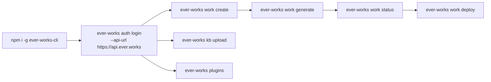

# CLI Quickstart

The **Ever Works CLI** is a published npm package (`ever-works-cli`, `0.1.5` at the time of writing) that installs one binary — `ever-works` — and talks to the same REST API the dashboard uses, signed in as you. It ships four command groups, wired in `apps/cli/src/main.ts`:

| Group     | Command                | What it covers                                                        |
| --------- | ---------------------- | --------------------------------------------------------------------- |
| `auth`    | `ever-works auth …`    | Browser (OAuth) or manual login, session status, logout               |
| `work`    | `ever-works work …`    | Create, generate, update, deploy, delete a Work; submit/remove items  |
| `plugins` | `ever-works plugins …` | Enable, configure and (in dynamic mode) install plugins for your user |
| `kb`      | `ever-works kb …`      | List, read, upload and lock Knowledge Base documents on a Work        |

Two things to know before you start, because they shape everything below:

- **Most `work` commands are interactive.** They prompt with `inquirer` and take no flags. That makes them excellent for a terminal session and unsuitable for a cron job — see [Scripting the CLI](#scripting-the-cli) for the subset that is non-interactive.
- **The CLI is a client, not a second platform.** Everything it does exists over REST too, so anything the CLI has not grown a command for yet is still reachable with `curl`, the MCP server ([what it is](../features/mcp-server.md), [how to connect a client](./mcp-server-setup.md)), or the dashboard chat rail.

Dashboard routes in this guide are written the way you would type them, without the locale prefix — the address bar shows `/en/settings/plugins`, this guide says `/settings/plugins`.



## Before you start

- **Node.js 20 or newer.** The published package declares `engines.node: ">=20.0.0"` and is bundled for the `node20` target (`apps/cli/build.js`).
- **An Ever Works account** on the platform you intend to drive — the hosted API at `https://api.ever.works`, or your own self-hosted API.
- **A git provider connected** (`/settings/plugins/git-provider`) if you plan to use `work create` or `work generate`. Without one, `work create` stops with _"No git providers are configured. Please configure a git provider in Settings > Plugins."_
- **An AI provider connected** (`/settings/plugins/ai-provider`) before `work generate` — generation and every Agent call route through it.
- The **editor** role or higher on an **existing** Work for every command that changes it. `work create` needs only a login —
  there is no Work to hold a role on yet — and `work delete` is owner-only.

## 1. Install the CLI

```bash
npm install -g ever-works-cli
ever-works --help
```

Or run it without installing:

```bash
npx ever-works-cli work list
```

`ever-works --version` prints the package version. `ever-works` with no arguments prints the top-level help and exits 0; `ever-works work` with no subcommand prints the `work` group's own menu (create, list, generate, update, submit-item, remove-item, regenerate-markdown, update-website, deploy, delete, status, plugins, register).

## 2. Sign in

```bash
ever-works auth login --api-url https://api.ever.works
```

| Option            | Default                               | What it does                                                  |
| ----------------- | ------------------------------------- | ------------------------------------------------------------- |
| `--api-url <url>` | The `API_URL` compiled into the build | API base URL to authenticate against and store in credentials |
| `--manual`        | off                                   | Skip the browser flow and paste a token instead               |

Pass the **origin only** — `https://api.ever.works`, not `https://api.ever.works/api`. The HTTP client appends `/api` itself (`ensureApiEndpoint` in `apps/cli/src/services/http-client.ts`), and doubling it produces 404s.

### What the browser flow actually does

1. Starts a callback server bound to `127.0.0.1` on an OS-assigned free port (falling back to `44663`).
2. Generates a 32-byte random `state` nonce and embeds it in `redirect_uri=http://127.0.0.1:<port>/?state=<nonce>`.
3. Opens `{WEB_URL}/api/auth/authorize?redirect_uri=…&response_type=token&client_id=cli` in your default browser. If it cannot open one, it prints the URL to paste.
4. You sign in on the web app. It redirects back to the loopback URL with a `sessionToken`, and the CLI rejects any callback whose `state` does not match (constant-time compare).
5. The CLI fetches your profile to verify the token, then writes `~/.ever-works/.credentials.json` — file mode `0600`, directory mode `0700` on POSIX.
6. The browser tab renders a success page and closes itself after 15 seconds.

The whole flow times out after **5 minutes**. If you are already logged in, the CLI asks whether you want to switch accounts before touching the stored session.

:::caution The web URL is compiled in, the API URL is not

`--api-url` overrides the API base only. The **web** URL that the authorize page is opened on is baked into the binary at build time (`apps/cli/build.js` substitutes `process.env.WEB_URL`, defaulting to `http://localhost:3000`). If the browser opens something that is not your platform's web app, cancel and use `--manual` instead — or build the CLI yourself with `API_URL` and `WEB_URL` set in `apps/cli/.env`.

:::

### The manual flow

```bash
ever-works auth login --manual
```

You are prompted for the API URL and then for a token (input hidden). The CLI writes the token to a temporary credentials file, calls the profile endpoint to prove it works, and **rolls back your previous login** if verification fails — so a mistyped token never clobbers a working session.

The token has to be a **JWT session token**: the credential store validates that it has three dot-separated parts and an unexpired `exp` claim, and silently deletes the file otherwise (`CredentialsService.get()`). An `ew_live_…` [API key](../features/api-keys.md) is accepted by the API but **not** by the CLI's credential store — use API keys with `curl`, CI, or the MCP server instead.

### Check and end the session

```bash
ever-works auth status   # email, username, email-verified, API URL, expiry, live token check
ever-works auth logout   # deletes ~/.ever-works/.credentials.json
```

`auth status` prints the stored identity and time left on the token, then verifies it against the API. If the token is expired or malformed, the credentials file is removed on the spot and you are told to log in again.

One safety rule applies to every request: the client refuses to attach your bearer token to a cleartext `http://` URL for a non-loopback host. `http://localhost:3100` for local development is fine; `http://some-remote-host` is refused.

## 3. Create your first Work

```bash
ever-works work create
```

The command is a guided sequence — no flags:

1. **Provider discovery** — git providers and deploy providers are fetched in parallel and every git provider's connection is checked.
2. **Git provider selection** — pick one of the enabled, connected providers. If the one you pick is not connected, the CLI points you at the web app to connect it and stops.
3. **Deploy provider selection** — skipped entirely when none are available; you can set one later from `work deploy`.
4. **Owner** — your personal account or one of the organizations the git provider reports.
5. **Work details** — name, slug, description.
6. **Slug conflicts** — on a `409`, you are offered an incremented slug, a chance to type your own, or cancel.

On success it prints the name, slug, owner and description, and tells you to run `work generate` next.

## 4. Generate content, then watch it

```bash
ever-works work generate
```

Select the Work, then walk the configuration: **pipeline** (for example `agent-pipeline`, `standard-pipeline`, `claude-code`), **providers** for the categories that pipeline requires (AI, search, content extraction, screenshots), the **generation prompt** (pre-filled from your last run), any **pipeline-specific fields** from the plugin's schema, and — on an existing Work — the generation method (`CREATE_UPDATE` or `RECREATE`), whether to open a pull request, and how the website repository should be created. Unconfigured providers are listed before anything starts, with a pointer to Settings > Plugins.

Then follow it:

```bash
ever-works work status
```

`work status` polls every 5 seconds for up to 30 minutes, showing the current step, percentage, items processed and elapsed time. It stops on `GENERATED`, `ERROR` or `CANCELLED`, handles `Ctrl+C` cleanly, and prints a summary: name, generation status, deploy provider, deployment state, last deployment time and website URL.

## 5. Deploy the site

```bash
ever-works work deploy
```

Content must be generated first — the command refuses with _"Work content must be generated before deploying"_ otherwise. From there it resolves one of four states:

| State | Situation                                         | What the CLI does                                     |
| ----- | ------------------------------------------------- | ----------------------------------------------------- |
| A     | No deploy provider set on the Work                | Prompts you to pick one, saves it, re-checks, deploys |
| B     | Provider set, cannot deploy, Work shared with you | Tells you the owner has to configure the token        |
| C     | Provider set, cannot deploy, you own the Work     | Offers to configure the token or switch provider      |
| D     | Provider set and ready                            | Deploys                                               |

In state D it looks up any existing deployment, offers the deployment team when the provider exposes teams, shows a summary (source repository, provider), asks for confirmation, then polls the deployment state until it reaches `READY`, `ERROR`, `CANCELED` or `TIMEOUT` and prints the final URL.

## The `work` group at a glance

| Command                    | Flags                | What it does                                                                                       |
| -------------------------- | -------------------- | -------------------------------------------------------------------------------------------------- |
| `work create`              | —                    | Interactive Work creation with git/deploy provider and slug-conflict handling                      |
| `work list`                | `--limit <n>` (`20`) | Lists Works you can see with role badges, slug, owner, description, website; non-interactive       |
| `work generate`            | —                    | Full generation flow: pipeline, providers, prompt, options, confirmation                           |
| `work status`              | —                    | Polls generation status every 5s (30-minute cap) and prints a summary                              |
| `work update`              | —                    | Re-runs an update against an existing Work: generation method, optional pull request, confirmation |
| `work update-website`      | —                    | Updates only the website repository (for example to pick up template changes)                      |
| `work deploy`              | —                    | The four-state deploy flow above, with live deployment polling                                     |
| `work submit-item`         | —                    | Adds one item: URL, name, description, category, tags, brand, brand logo, images, featured flag    |
| `work remove-item`         | —                    | Removes an item by slug, with an optional reason and a confirmation                                |
| `work regenerate-markdown` | —                    | Regenerates the Work's readme markdown from current data                                           |
| `work plugins`             | —                    | Per-Work plugin management: enable/disable, choose the active capability, override settings        |
| `work delete`              | —                    | Owner-only. Choose which repositories to delete, optional force + reason, type the slug to confirm |
| `work register`            | see below            | Non-interactive repo registration against `POST /api/register-work`                                |

Every one of these requires a login; `generate`, `update`, `update-website`, `deploy`, `submit-item`, `remove-item`, `regenerate-markdown` and `plugins` additionally require the **editor** role or higher and say so (`Your role: <role>. Required: editor or higher.`) when you do not have it.

`work plugins` is the Work-scoped mirror of the user-scoped `plugins` group: it lists the plugins configured on the selected Work, shows which capability each one is currently providing, and lets you enable, disable, switch capability, or set Work-level settings that override your user-level values — blank fields inherit.

## 6. Register a repo in one non-interactive call

`work register` is the CLI's front door to [zero-friction onboarding](../agent-services/zero-friction-onboarding.md): it registers a GitHub repository that carries a [`.works/works.yml`](../agent-services/works-yml-schema.md) manifest and queues the Work, creating the account if it does not exist.

```bash
export GITHUB_TOKEN=ghp_…
ever-works work register \
  --repo https://github.com/acme/awesome-observability \
  --email ops@acme.example \
  --subdomain awesome-observability \
  --idempotency-key 8f5c1c3e-2f0e-4f36-9a1e-0f9a1d9d4c11
```

| Flag                      | Required | Notes                                                                     |
| ------------------------- | -------- | ------------------------------------------------------------------------- |
| `--repo <url>`            | yes      | HTTPS GitHub repo URL with `.works/works.yml` at the root                 |
| `--github-token <token>`  | no       | Falls back to `$GITHUB_TOKEN`; exits `2` when neither is set              |
| `--email <email>`         | no       | Contact address for human reachability                                    |
| `--agent-id <id>`         | no       | Opaque identifier for an agent's own bookkeeping                          |
| `--webhook-url <url>`     | no       | Must be a valid `https://` URL; used for signed terminal-status callbacks |
| `--subdomain <slug>`      | no       | DNS-safe slug; the platform allocates an alternative if it is taken       |
| `--idempotency-key <key>` | no       | Sent as `Idempotency-Key` so a retry is provably a retry                  |
| `--api-url <url>`         | no       | Defaults to `$EVER_WORKS_API_URL` or `https://api.ever.works`             |

This is the one command whose default API URL is the hosted platform rather than the compiled-in `API_URL`, and the one that authenticates with a **GitHub token** instead of your CLI session. The token travels as the `X-GitHub-Token` header, so the command refuses to send it over cleartext `http://` to anything but a loopback host.

On acceptance it prints the **Onboarding ID**, **Work ID**, **Status**, **Subdomain**, **Status URL** and any warnings, and exits `0`. Poll the printed status URL (`GET /api/register-work/:id`, same `X-GitHub-Token`) to follow the build.

## 7. Manage plugins

```bash
ever-works plugins                    # interactive browser over all your plugins
ever-works plugins --category search   # filter to one category
```

The interactive view is a type-ahead search grouped by category, with a filled dot for enabled and a hollow one for disabled. Select a plugin to see its id, version, category, status, capabilities and settings-field count, then act on it:

- **Enable** — if the plugin's schema has required fields you have not filled, the CLI prompts for them first (secrets are masked and stored as secret settings), then asks whether to auto-enable it for all Works.
- **Disable** — with a confirmation. System plugins have no enable/disable action.
- **Configure settings** — only offered while the plugin is enabled; otherwise the entry reads _"Configure settings (enable plugin first)"_.

### Dynamic distribution subcommands

These four are non-interactive and map 1:1 onto the plugin REST surface:

| Command                             | Flags                                                                         | Endpoint                                |
| ----------------------------------- | ----------------------------------------------------------------------------- | --------------------------------------- |
| `plugins catalog`                   | —                                                                             | `GET /plugins/catalog`                  |
| `plugins install <pluginId>`        | `--version <semver>`, `--integrity <sha512>`, `--source npm\|github-packages` | `POST /plugins/:pluginId/install`       |
| `plugins uninstall <pluginId>`      | —                                                                             | `DELETE /plugins/:pluginId/install`     |
| `plugins install-status <pluginId>` | —                                                                             | `GET /plugins/:pluginId/install-status` |

```bash
ever-works plugins catalog
ever-works plugins install notion-extractor --version 1.2.0
ever-works plugins install-status notion-extractor
```

Each row prints the install state (`available`, `installing`, `installed`, `error`), the source, and the installed version. A deployment running in bundled mode returns an **empty catalog** rather than an error — the commands are safe to call anywhere, but only a platform started with `PLUGIN_DISTRIBUTION_MODE=dynamic` has anything to install. A degraded catalog prints its reason before the rows.

## 8. Drive the Knowledge Base

The `kb` group is mounted at the top level (`ever-works kb …`, not under `work`) and mirrors the per-Work KB REST surface. Every subcommand takes the **Work UUID** as its first argument — copy it from the address bar on `/works/:id`.

| Command                                | Arguments                | Flags                                                     |
| -------------------------------------- | ------------------------ | --------------------------------------------------------- |
| `kb list <workId>`                     | Work UUID                | `--class`, `--tag`, `--q`, `--limit` (20), `--offset` (0) |
| `kb get <workId> <idOrPath>`           | Work UUID, doc UUID/path | `--json`                                                  |
| `kb upload <workId> <filePath>`        | Work UUID, local file    | `--title`, `--class`                                      |
| `kb lock <workId> <idOrPath> --mode …` | Work UUID, doc UUID/path | `--mode` (required)                                       |
| `kb unlock <workId> <idOrPath>`        | Work UUID, doc UUID/path | —                                                         |

```bash
WORK=5b2f8b1e-7c3a-4f0d-9a11-0f2c3d4e5f6a

ever-works kb list  $WORK --class brand --limit 50
ever-works kb list  $WORK --q "tone of voice"
ever-works kb get   $WORK brand/voice
ever-works kb get   $WORK brand/voice --json | jq '.tags'
ever-works kb upload $WORK ./brand-guide.pdf --class brand --title "Brand guide v3"
ever-works kb lock  $WORK legal/disclaimer --mode full
ever-works kb unlock $WORK legal/disclaimer
```

`kb get` renders metadata plus the raw markdown body to stdout, so it pipes into `bat`, `glow` or a file; `--json` emits the DTO for `jq`. `kb list` prints a compact table (id, class, status, lock, path, title) and the total. Paths keep their slashes — only the segments are URL-encoded — so `brand/voice` works as an identifier exactly as a UUID does. `kb lock` resolves a path to a UUID before issuing the request, because the lock route is UUID-scoped on the server.

`kb upload` guesses the MIME type from the extension (`.md`, `.markdown`, `.txt`, `.json`, `.html`, `.pdf`, `.docx`, `.xlsx`, else `application/octet-stream`) and posts the file as multipart. It prints the upload row — id, filename, MIME, size, SHA-256, extraction status — and the resulting KB document, or a clear notice that no document was created because no extractor matched the MIME.

:::caution `--mode` values do not line up yet

The platform's lock modes are `full` and `additions-only` (`KB_LOCK_MODES` in `@ever-works/contracts`), but the CLI's local validator currently accepts `full` and `content`. So `--mode full` works end to end; an additions-only lock has to be applied from the KB workbench at `/works/:id/kb` or through the MCP `kb.lock` tool until the CLI catches up.

:::

The CLI deliberately has no `kb create` / `kb update` — markdown bodies are miserable to author through flags. Use the workbench, the MCP `kb.create` / `kb.update` tools, or `kb upload` for file-driven creation. See the [MCP & CLI reference](../kb/mcp-cli-reference.md) for the full operation-by-operation mapping.

## 9. Connect a coding-agent pipeline

Five pipeline plugins are coding agents, and each needs its own credential before `work generate` can select it. Only **`codex`** authenticates with the **OAuth 2.0 device authorization grant** — the flow where you get a verification URL and a short user code and paste the code on the provider's site. The other four are configured by pasting a token or an API key into the plugin's settings form on `/settings/plugins/pipeline`.

| Plugin id              | Category   | How you authenticate it                                                                                                         |
| ---------------------- | ---------- | ------------------------------------------------------------------------------------------------------------------------------- |
| `codex`                | `pipeline` | **Device code**, an OpenAI API key, or a ChatGPT workspace access token — selected by the plugin's `authMode` setting           |
| `claude-code`          | `pipeline` | An OAuth token generated by `claude setup-token` (bills a Claude Pro/Max subscription), or an Anthropic API key                 |
| `claude-managed-agent` | `pipeline` | An Anthropic API key — the only required field in its schema                                                                    |
| `gemini`               | `pipeline` | A Gemini API key from Google AI Studio                                                                                          |
| `opencode`             | `pipeline` | No credential of its own — it runs on whichever AI provider you have configured, reusing that provider's `baseUrl` and `apiKey` |

`codex` is the only plugin whose manifest declares the `device-auth` capability, and the platform gates on that manifest entry rather than on method presence: ask any other plugin for a device-auth session and the API answers `400 Plugin "<id>" does not support device auth`. The dashboard follows the same rule — the device-auth card is rendered only for plugins whose `capabilities` include `device-auth`, so it appears on Codex and nowhere else.

### The device-code flow (Codex)

**There is no `ever-works auth device` subcommand today.** Connect the pipeline once in the dashboard, then use it from the CLI:

1. Open `/settings/plugins/pipeline` in the dashboard and pick **Codex**.
2. Start the connection. The card shows the verification URL (`https://auth.openai.com/codex/device` unless the CLI reports another) and the user code, with a button that opens the URL in a new tab.
3. Enter the code on OpenAI's page. The card polls until it flips to connected.
4. Back in the terminal, run `ever-works work generate` and select Codex — the stored token is used server-side, so nothing sensitive is ever handed to the CLI.

Headless hosts can drive the same two endpoints directly with your session token:

```bash
curl -X POST https://api.ever.works/api/device-auth/codex/start \
  -H "Authorization: Bearer $EVER_WORKS_TOKEN"
# → { "pending": true, "prompt": { "verificationUri": "…", "userCode": "ABCD-1234" }, … }

curl https://api.ever.works/api/device-auth/codex/status \
  -H "Authorization: Bearer $EVER_WORKS_TOKEN"
```

Both routes return the same `DeviceAuthStatus` envelope — `installed`, `connected`, `pending`, `scope`, `flowType`, a human-readable `message`, and an optional `prompt` carrying `verificationUri` and `userCode`. Poll `status` until `pending` is `false` and `connected` is `true`. There is no HTTP endpoint for cancelling a flow; the cancel path is internal. Full envelope and error semantics: [Device Auth Capability](../api/device-auth-capability.md).

### The other four pipelines

There is nothing to poll — you are just filling in a settings form:

1. Open `/settings/plugins/pipeline` and pick the plugin.
2. Enable it and fill the required fields. Secrets are masked in the form and stored as secret settings.
3. Run `ever-works work generate` and select that pipeline.

The CLI can do step 2 as well: `ever-works plugins --category pipeline` opens the browser from [Manage plugins](#7-manage-plugins) filtered to pipelines, and enabling a plugin there prompts for exactly the required fields its schema declares.

## Scripting the CLI

Only some commands are safe in a script. The rest open prompts and will hang on a non-TTY.

| Scriptable today                                                                    | Interactive (prompts, no flags)                                                                                                                     |
| ----------------------------------------------------------------------------------- | --------------------------------------------------------------------------------------------------------------------------------------------------- |
| `auth status`, `auth logout`                                                        | `auth login` (browser or manual)                                                                                                                    |
| `work list`, `work register`                                                        | `work create`, `generate`, `update`, `update-website`, `deploy`, `status`, `submit-item`, `remove-item`, `regenerate-markdown`, `plugins`, `delete` |
| `plugins catalog`, `plugins install`, `plugins uninstall`, `plugins install-status` | `plugins` (the browser view)                                                                                                                        |
| `kb list`, `kb get`, `kb upload`, `kb lock`, `kb unlock`                            | —                                                                                                                                                   |

Register a repo and wait for it, entirely unattended:

```bash
#!/usr/bin/env bash
set -euo pipefail

out=$(ever-works work register --repo "https://github.com/acme/awesome-observability")
status_url=$(printf '%s\n' "$out" | awk '/Status URL/ { print $3 }')

until curl -fsS "$status_url" -H "X-GitHub-Token: $GITHUB_TOKEN" | jq -e '.status == "deployed"' >/dev/null; do
  sleep 30
done
echo "deployed"
```

Seed a Work's Knowledge Base from a folder, then lock the legal pages:

```bash
WORK=5b2f8b1e-7c3a-4f0d-9a11-0f2c3d4e5f6a

for f in ./kb-seed/*.md; do
  ever-works kb upload "$WORK" "$f" --class brand
done

ever-works kb list "$WORK" --class legal --limit 100
ever-works kb lock "$WORK" legal/disclaimer --mode full
```

Export one document's tags for a downstream job:

```bash
ever-works kb get "$WORK" brand/voice --json | jq -r '.tags[]'
```

### Exit codes and errors

| Code | Meaning                                                                                        |
| ---- | ---------------------------------------------------------------------------------------------- |
| `0`  | Success                                                                                        |
| `1`  | Validation error, file not found, server 4xx/5xx, or an expired session                        |
| `2`  | `work register` only: missing GitHub token, unsafe `--api-url`, or a non-HTTPS `--webhook-url` |

API failures are printed by a shared handler that shows the server's message; a `401` adds _"Authentication failed. Please login again"_ and a `404` on a Work adds _"Work not found"_. Any `401` on a request exits `1` immediately — re-run `ever-works auth login`.

## What the CLI cannot do yet

Honest gaps, all of which have another supported route today:

- **No `work import`.** Importing a data repository, an awesome-list README, or linking an existing repo is dashboard and API only — see [Work Import](../features/work-import.md).
- **No Agents, Tasks, Missions, Ideas, Teams or Memory commands.** The command tree is `auth`, `work`, `plugins`, `kb` and nothing else. Drive those over REST ([Agents API](../api/agents.md), [Tasks API](../api/tasks.md)) or from the dashboard chat rail — see [Do Everything From Chat](./do-everything-from-chat.md).
- **No `kb create` / `kb update`.** Body editing lives in the workbench and the MCP tools; `kb upload` covers file-driven creation.
- **No device-auth subcommand.** Connect Codex — the one pipeline that uses the device-code flow — in `/settings/plugins/pipeline`
  or through `/api/device-auth/codex/*`. The other coding-agent pipelines take a token or API key on the same settings page.
- **API keys are not accepted by `auth login --manual`.** The credential store requires a JWT. Use `ew_live_…` keys with `curl`, CI, or the MCP server.
- **The default API and web URLs are compiled in.** `--api-url` fixes the API side per login; the web URL used for the OAuth page is fixed at build time (the exception is `work register`, which honours `$EVER_WORKS_API_URL` at runtime).
- **`kb lock --mode additions-only` is not accepted by the CLI validator** even though the platform supports it.

## Related

- [CLI Overview](../cli/index.md) · [CLI Commands](../cli/commands.md) · [Work Commands](../cli/work-commands.md) · [Auth Commands](../cli/auth-commands.md) · [Plugin Commands](../cli/plugin-commands.md) · [Generation Commands](../cli/generation-commands.md)
- [Knowledge Base — MCP & CLI Reference](../kb/mcp-cli-reference.md) · [Knowledge Base — User Guide](../kb/user-guide.md) · [Knowledge Base & Memory](../features/knowledge-base.md)
- [MCP Server](../features/mcp-server.md) · [Use Ever Works from an MCP Client](./mcp-server-setup.md) · [API Keys](../features/api-keys.md) · [Plugins](../features/plugins.md) · [Device Auth Capability](../api/device-auth-capability.md)
- [Zero-Friction Onboarding for Agents](../agent-services/zero-friction-onboarding.md) · [`works.yml` Schema](../agent-services/works-yml-schema.md) · [Work Import](../features/work-import.md)
- [API Overview](../api/index.md) · [API Authentication](../api/authentication.md) · [Works API](../api/works.md)
- [Creating a Work](../features/creating-a-work.md) · [Platform Tour](./platform-tour.md) · [Do Everything From Chat](./do-everything-from-chat.md)
