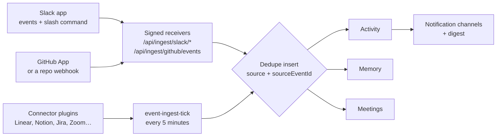

# Connect Slack, GitHub, Linear, Notion and more

Your AI team is only as informed as the systems it can see. This guide is the wiring: what to create on the provider's side, what to paste into Ever Works, in which order, and how to prove the chain works end to end.

There are four different mechanisms behind the word "integration", and mixing them up is the most common reason a setup looks finished and does nothing:

- **Connector plugins** pull activity in on a cron and — for the ones that write back — push messages, comments and records out.
- **Dedicated receivers** accept signed webhook deliveries from Slack and GitHub, which do more than a poll can (chat replies, pull-request reviews).
- **Notification channels** are an outbound-only family for alerts, digests and agent pings, with their own settings screen and a test button.
- **The event spine** is the single pipeline underneath all of them: dedupe, Activity, Memory, Meetings.

Dashboard routes are written the way you type them, without the locale prefix — the address bar shows `/en/plugins`, this guide says `/plugins`. API examples use `https://api.ever.works`; on a self-hosted install, swap in your own API origin.



## Pick the right surface first

| You want to…                                                        | Use                                            | Set it up at                                                                      |
| ------------------------------------------------------------------- | ---------------------------------------------- | --------------------------------------------------------------------------------- |
| Ask the platform questions from Slack and get answers in the thread | The **Slack app** receivers                    | Slack app config + `slack-connector` settings — [§1](#1-slack)                    |
| Have Slack channel messages land on your feed                       | The `slack-connector` **event source**         | `/plugins` → Slack Connector — [§1](#1-slack)                                     |
| Get AI reviews on pull requests                                     | The **GitHub receiver**                        | GitHub App, or a repo webhook — [§2](#2-github)                                   |
| Link repositories and onboard an existing data repo                 | The **GitHub App**                             | `/settings/github-app` — [§2](#2-github)                                          |
| Pull in issues, pages, deals, files, recordings                     | A **connector plugin**                         | `/settings/plugins/connector` — [§3](#3-enable-a-connector)                       |
| Push alerts, digests and agent pings out to chat                    | A **notification channel**                     | `/settings/integrations/channels` — [§4](#4-notification-channels-and-the-digest) |
| Turn recorded calls into summaries your Agents remember             | The **Zoom** or **Google Workspace** connector | `/plugins` — [§6](#6-meetings-from-recorded-calls)                                |

:::note There is no Settings → Integrations page
`/settings/integrations` has no index page and soft-404s — the settings navigation deliberately omits a bare **Integrations** tab. Only its two children exist: **Channels** (`/settings/integrations/channels`) and **Email Addresses** (`/settings/integrations/emails`). Everything connector-shaped lives under **Plugins**: `/plugins` for the catalog, `/settings/plugins/connector` for the connector category. Bare `/settings/plugins` redirects to the AI Providers category, so link the category explicitly when you mean connectors.
:::

## 1. Slack

The Slack app is the one integration wired all the way through: inbound messages reach the same platform chat engine the web app uses, and the answer is posted back into the thread it was asked in.

| Slack setting                         | Point it at                                        | Rate limit           |
| ------------------------------------- | -------------------------------------------------- | -------------------- |
| **Event Subscriptions → Request URL** | `https://api.ever.works/api/ingest/slack/events`   | 300 deliveries / min |
| **Slash Commands → Request URL**      | `https://api.ever.works/api/ingest/slack/commands` | 300 deliveries / min |

Both endpoints verify every delivery with your app's **signing secret** — HMAC `v0` over `v0:{timestamp}:{rawBody}`, a ±300-second timestamp tolerance and a constant-time compare — and both **fail closed**. With no configured Slack install carrying a signing secret, everything is rejected with `401`, including Slack's own `url_verification` handshake, which Slack signs like any other delivery. Save the secret in Ever Works _before_ you ask Slack to verify the URL.

### What the bot actually calls

Grant the Slack scopes these methods require, and invite the bot into every channel you want it to read or post in.

| Slack API method        | What Ever Works uses it for                                                             |
| ----------------------- | --------------------------------------------------------------------------------------- |
| `auth.test`             | Validating the bot token, and caching the bot user id so the bot skips its own messages |
| `chat.postMessage`      | Outbound messages, mention replies and slash-command answers                            |
| `conversations.history` | The connector's `pullEvents` sweep over the configured channels                         |
| `chat.getPermalink`     | The `sourceUrl` deep link on each ingested message                                      |

Per Slack's own scope rules that is `chat:write` for posting, `channels:history` (or `groups:history` for private channels) for the history sweep, the `app_mentions:read` event scope for mentions, and `commands` for the slash command.

### How to: connect a Slack workspace

1. Create a Slack app in the workspace you want to connect. Copy the **Bot User OAuth token** (`xoxb-…`) from **OAuth & Permissions** and the **Signing secret** from **Basic Information**.
2. In Ever Works, open **Sidebar → Plugins** (`/plugins`), find **Slack Connector**, and press **Enable**. In the dialog, leave **Also enable for all works** ticked — account-level _on_ does not cascade on its own — and press **Enable** again to commit.
3. Open the plugin's settings page and fill it in, then press **Save Settings**. Save is blocked while the plugin is disabled, so enable first and paste second.

    | Field              | Required    | Value                                                                             |
    | ------------------ | ----------- | --------------------------------------------------------------------------------- |
    | `botToken`         | **Yes**     | The `xoxb-…` token from step 1.                                                   |
    | `signingSecret`    | For inbound | The signing secret. Without it both receivers reject every delivery.              |
    | `appId`            | No          | Your Slack app id.                                                                |
    | `defaultChannelId` | No          | Where outbound messages go when a send names no channel, e.g. `C0123456789`.      |
    | `eventChannelIds`  | No          | Comma-separated channel ids to ingest from. Defaults to the default channel only. |

4. Back in Slack, open **Event Subscriptions**, set the Request URL to `https://api.ever.works/api/ingest/slack/events`, and let Slack verify it. Under **Subscribe to bot events**, add the events that deliver `app_mention` and channel `message` payloads (`app_mention` and `message.channels`; add `message.groups` for private channels).
5. Open **Slash Commands** and create one — `/works` is the name the usage hint assumes, but any name works. Request URL: `https://api.ever.works/api/ingest/slack/commands`.
6. Install (or reinstall) the app to the workspace so the new scopes and events take effect, then invite the bot into each channel: `/invite @YourApp`.
7. Test both entry points:
    - Type `/works what shipped today?`. You get a private ack — _"On it — I am asking Ever Works now and will post the answer in this channel shortly."_ — and the answer arrives in the channel a moment later.
    - Post `@works summarise the last three PRs` in a channel the bot is in. The reply lands in that thread.

### What happens on each delivery

| Behaviour                   | Detail                                                                                                                                                                       |
| --------------------------- | ---------------------------------------------------------------------------------------------------------------------------------------------------------------------------- |
| **Workspace attribution**   | The delivery's `team_id` (plus `enterprise_id` on Grid) selects which install's signing secret to verify against, so two customers' workspaces never cross-attribute.        |
| **Forged workspace ids**    | Harmless. A forged `team_id` only picks a secret, and that secret then fails the HMAC.                                                                                       |
| **Unknown workspace**       | Refused, never guessed. Events answer `200` with `{ ok: true, ignored: … }` so Slack stops retrying; a command answers with a private "this workspace is not connected yet". |
| **Ack budget**              | Slack gives a slash command three seconds. The receiver verifies, resolves and acks inside that, then produces the answer detached and posts it into the channel.            |
| **Bare `/works`**           | Answers with a usage hint — ``Usage: `/works <your question>` `` — instead of sending an empty prompt to the model.                                                          |
| **Echo protection**         | Messages carrying a `bot_id` or a subtype are never routed back in, so the bot cannot answer itself.                                                                         |
| **What lands on your feed** | `slack.mention` and `slack.message` envelopes, identified by `channel:ts` so webhook pushes and connector sweeps converge on one row, plus `slack.command` per invocation.   |

### Slack troubleshooting

| Symptom                                                                | What it means                                                             | Fix                                                                                      |
| ---------------------------------------------------------------------- | ------------------------------------------------------------------------- | ---------------------------------------------------------------------------------------- |
| Slack cannot verify the Request URL                                    | The receiver is failing closed — no install with a signing secret exists. | Complete step 3 (enable + save `signingSecret`), then retry the verification.            |
| `/works` replies "This Slack workspace is not connected…"              | The delivery verified against nothing this account owns.                  | Enable and configure `slack-connector` on the account that should own this workspace.    |
| The mention is on the Activity feed but no reply appears in the thread | The chat leg is best-effort and never fails the webhook.                  | Check that `botToken` is still valid and that the bot is a member of the channel.        |
| Channel messages never appear                                          | `eventChannelIds` defaults to the default channel only.                   | List every channel id you want swept, comma-separated, and invite the bot into each one. |

## 2. GitHub

GitHub has two URLs and **one** receiver behind them. Whichever URL a delivery arrives at, the same code verifies it once and fans it out to every consumer: GitHub App installation sync, the event spine, and the AI pull-request reviewer.

|                                    | `POST /api/ingest/github/events`                                              | `POST /api/github-app/webhooks`                                    |
| ---------------------------------- | ----------------------------------------------------------------------------- | ------------------------------------------------------------------ |
| **Who points at it**               | A repository or organization webhook you configure yourself                   | The platform GitHub App — the URL is baked into the App's settings |
| **Verified with**                  | The per-user `github` plugin's **Webhook secret**, or the platform App secret | The same two credentials                                           |
| **What runs**                      | Installation sync **+** event ingest **+** AI review                          | Identical                                                          |
| **Unattributable delivery**        | `200` no-op, so GitHub stops retrying                                         | `401`                                                              |
| **Which leg can fail the request** | The review leg — GitHub's retry is how a transient ingest failure recovers    | The sync leg — retry is load-bearing for installation sync         |
| **Rate limit**                     | 300 deliveries / min                                                          | —                                                                  |

:::tip Installing the App is enough
The two receivers used to be independent, which is why installing the GitHub App did not turn pull-request reviews on. They are now one receiver: an App installation drives installation sync **and** the ingest spine **and** the AI review, with no second webhook to configure.
:::

A delivery with no `x-github-event` header is rejected outright, and bot-authored comments — including the reviewer's own replies — are never ingested, so the loop cannot echo itself.

### How to: install the GitHub App

1. Install the Ever Works GitHub App on the user account or organization, and choose the repositories it may see.
2. Complete the setup redirect. GitHub hands off to `GET /api/github-app/setup` and then `GET /api/github-app/callback`, which bind the installation to your Ever Works account and sign you in.
3. Open **Settings → GitHub App** (`/settings/github-app`). Each installation card shows its status (**Active** / **Suspended**), the account and target type, the repository count, the last sync and the app slug. With nothing linked yet the page says: _"Install the Ever Works GitHub App on a repository or organization, then complete the setup redirect to have the installation linked to this workspace."_
4. Press **Sync** on the installation to refresh the repository snapshot from GitHub. A fresh installation shows _"This installation has no repositories stored yet. Run sync to refresh the snapshot from GitHub."_ until you do.
5. Press **Onboard** next to a repository to register it as a Work.

:::caution Onboard accepts data repositories only
The onboarding path analyses the repository first and only proceeds when it detects an existing **data repo**. Anything else comes back as _"Only existing data repositories can be onboarded from GitHub App installations right now"_. To bring in a different kind of repository, use the [Work import](../features/work-import.md) path instead.
:::

The same three actions exist on the API:

```bash
curl https://api.ever.works/api/github-app/installations \
  -H "Authorization: Bearer <jwt-token>"

curl -X POST https://api.ever.works/api/github-app/installations/<installationId>/sync \
  -H "Authorization: Bearer <jwt-token>"

curl -X POST \
  https://api.ever.works/api/github-app/installations/<installationId>/repositories/<repositoryId>/onboard \
  -H "Authorization: Bearer <jwt-token>"
```

Self-hosting? You register your own GitHub App and wire it through environment variables:

| Variable                    | Purpose                                                                |
| --------------------------- | ---------------------------------------------------------------------- |
| `GITHUB_APP_ID`             | The App's numeric id.                                                  |
| `GITHUB_APP_CLIENT_ID`      | OAuth client id, for the user-authorization leg of the setup redirect. |
| `GITHUB_APP_CLIENT_SECRET`  | OAuth client secret.                                                   |
| `GITHUB_APP_PRIVATE_KEY`    | The App private key. Escaped newlines (`\n`) are unescaped on read.    |
| `GITHUB_APP_WEBHOOK_SECRET` | The App-level webhook secret the receiver accepts.                     |
| `GITHUB_APP_SLUG`           | The App's slug. Defaults to `ever-works`.                              |
| `GITHUB_APP_SETUP_URL`      | Overrides the default `<web app URL>/api/github-app/setup`.            |
| `GITHUB_APP_CALLBACK_URL`   | Overrides the default `<web app URL>/api/github-app/callback`.         |

### How to: turn on review for a single repository, without the App

1. Enable the **GitHub** plugin at `/plugins` and open its settings.
2. Set **Webhook secret** — _"Leave blank to keep the receiver disabled for your account."_ That field is the on switch for the per-repository path. Press **Save Settings**.
3. In the repository (or organization) on GitHub, open **Settings → Webhooks → Add webhook**:
    - **Payload URL**: `https://api.ever.works/api/ingest/github/events`
    - **Content type**: `application/json`
    - **Secret**: the exact value from step 2
    - **Events**: pull requests, issue comments, pull request review comments, and pushes
4. Save, open a pull request, and check **Recent Deliveries** on the webhook for a `200`.

Deliveries with a missing or mismatched `X-Hub-Signature-256` are rejected.

### What triggers a review, and what only gets recorded

| Delivery                                                           | Result                                                                                                                         |
| ------------------------------------------------------------------ | ------------------------------------------------------------------------------------------------------------------------------ |
| `pull_request` **opened** / **synchronize**                        | Ingested as `github.pr`, then reviewed. The review is keyed on the head SHA, so each pushed revision is reviewed exactly once. |
| `@ever-works` in an issue comment or a pull-request review comment | Ingested as `github.mention`. The comment text rides along as the review instruction and the reply lands in that thread.       |
| `push`                                                             | Ingested as `github.push` and `github.commit` — Activity only. The code has already landed, so there is nothing to review.     |
| `pull_request` **closed** with `merged: true`                      | Ingested as `github.merge`. Also Activity only.                                                                                |

For each review the platform matches the repository to a Work across all three repository roles, builds a byte-capped diff, adds [Knowledge Base](../features/knowledge-base.md) context and memory recall, makes one structured AI call, and posts the result. See [Community PR Processing](../features/community-pr-processing.md) for the review loop in depth.

## 3. Enable a connector

Every connector except the Slack app is pure setup: enable, paste credentials, wait for the sweep. The `event-ingest-tick` cron runs **every 5 minutes** — there is no "sync now" button. Nine of the eleven also accept a historical backfill window.

| Connector            | Plugin id                    | Required credentials                                                                   | `backfillDays` |
| -------------------- | ---------------------------- | -------------------------------------------------------------------------------------- | -------------- |
| **Linear**           | `linear-connector`           | API key (`lin_api_…`)                                                                  | Yes            |
| **Notion**           | `notion-connector`           | Integration token (`ntn_…` / `secret_…`)                                               | Yes            |
| **Jira**             | `jira-connector`             | Site base URL, Atlassian account email, API token                                      | Yes            |
| **HubSpot**          | `hubspot-connector`          | Private-app access token (`pat-…`)                                                     | Yes            |
| **Pipedrive**        | `pipedrive-connector`        | API token                                                                              | Yes            |
| **Zoom**             | `zoom-connector`             | Account id, client id, client secret (Server-to-Server OAuth app)                      | Yes            |
| **Google Workspace** | `google-workspace-connector` | OAuth client id, client secret, refresh token (`drive.readonly` + `calendar.readonly`) | Yes            |
| **Bluesky**          | `bluesky-connector`          | Handle or DID, **app password** (never your account password)                          | Yes            |
| **Mastodon**         | `mastodon-connector`         | Instance URL, access token                                                             | Yes            |
| **Slack**            | `slack-connector`            | Bot token; signing secret for inbound                                                  | No             |
| **Discord**          | `discord-connector`          | Bot token                                                                              | n/a            |

[Connectors](../features/connectors.md#what-each-connector-needs) carries the full field-by-field matrix, including every optional scoping setting.

### How to: enable and configure one

1. Open **Sidebar → Plugins** (`/plugins`), or go straight to **Settings → Plugins → Connectors** (`/settings/plugins/connector`). Use **Search plugins…** if the catalog is long.
2. Press **Enable** on the card. In the dialog — _"Configure how this plugin is enabled across your works."_ — leave **Also enable for all works** ticked and press **Enable** again.
3. Open the plugin's settings form, paste the credentials from the table above, and press **Save Settings**. Enabled is not the same as configured: a connector with a missing required field reports itself **not configured** and its sweep is skipped quietly.
4. Narrow the sweep while you are there. `teamIds`, `databaseIds`, `projectKeys`, `objectTypes`, `entityTypes`, `driveFolderIds`, `calendarIds`, `surfaces` and `eventChannelIds` all scope what gets pulled — empty usually means "everything", which is rarely what you want on a large workspace.
5. Decide on history **before the first sweep**. `backfillDays` widens the _first_ pull only: `0` (the default) is off, `1`–`90` reaches that many days back, and anything else — negatives, `NaN`, garbage — is clamped to `0`. Setting it after the first sweep has already run does nothing.
6. Wait up to five minutes, then check `/works/:id/activity` or `/activity`.

:::caution Discord is outbound only
The Discord connector posts into a channel; it does not read one. It declares no `event-source` capability, so nothing from Discord reaches your Activity feed and `backfillDays` does not apply. Inbound routing is a documented follow-up — the `publicKey` setting sits on the manifest for it, unused today.
:::

## 4. Notification channels and the digest

Channels are the opposite direction from connectors: they carry alerts, digests and agent pings **out**. They are a separate plugin family, so `slack-channel` (an incoming webhook) and `slack-connector` (a bot token) are two different things and can both be configured at once.

### How to: add a channel and test it

1. Open **Settings → Channels** (`/settings/integrations/channels`).
2. Press **Add channel** — _"Pick a provider and enter its delivery details. You can send a test after."_
3. Pick a provider and fill its fields:

    | Provider     | Plugin id          | Fields                                                      |
    | ------------ | ------------------ | ----------------------------------------------------------- |
    | **Slack**    | `slack-channel`    | Incoming Webhook URL (`https://hooks.slack.com/services/…`) |
    | **Discord**  | `discord-channel`  | Webhook URL (`https://discord.com/api/webhooks/…`)          |
    | **Telegram** | `telegram-channel` | Bot Token, Chat ID (`@channel` or a numeric id)             |
    | **WhatsApp** | `whatsapp-channel` | Access Token, Phone Number ID, Recipient (`+15551234567`)   |
    | **Novu**     | `novu-channel`     | API Key, Workflow ID, Subscriber ID                         |

4. Save, then press **Test** on the new row. It sends _"Ever Works notification channel test message ✓"_ and marks the row **✓** with the provider's message id, or **✗** with the provider's error.
5. **Remove** deletes a channel; the row disappears immediately.

The same operations on the API:

```bash
# add a channel
curl -X POST https://api.ever.works/api/notification-channels \
  -H "Authorization: Bearer <jwt-token>" \
  -H "Content-Type: application/json" \
  -d '{ "pluginId": "slack-channel", "name": "Ops alerts",
        "targetConfig": { "webhookUrl": "https://hooks.slack.com/services/…" } }'

# test it
curl -X POST https://api.ever.works/api/notification-channels/<id>/test \
  -H "Authorization: Bearer <jwt-token>"
```

`GET /api/notification-channels` lists them, `PATCH /api/notification-channels/:id` renames or disables one, and `DELETE /api/notification-channels/:id` removes it. Limits worth knowing: the name is capped at 120 characters, `targetConfig` at **16 KB** serialized, creates at 20 per minute and updates at 30 per minute.

Two things to know once channels exist:

- **Which events reach which channel** is configured at **Settings → Notifications**. The event × channel grid renders read-only in this version — use the preferences API to change it. Full behaviour, including quiet hours and category mutes, is in [Notifications](../features/notifications.md).
- **Agents can ping a channel directly** with the `notifyChannel` tool, given a channel id and plain text. It requires the Agent's `canCallExternalTools` permission and at least one enabled channel. Use it for proactive status pings; leave routine event delivery to the subscription fan-out.

### Turn the digest on

The digest is the daily or weekly briefing, and its **Connected sources** section counts the ingested events per source — which makes it the easiest ongoing check that your connectors are still pulling.

1. Open **Settings → Digest** (`/settings/digest`). Digests are off by default.
2. Pick **Daily** or **Weekly** for your personal digest. The dispatcher runs at **07:15 UTC** every day; weekly briefings go out on Mondays in that same run.
3. The organization digest is a separate setting on the same page — turning one on never changes the other.

Delivery reuses the notifications stack: the bell always gets a copy, and the briefing fans out under the `digest_ready` event to every channel subscribed to it. See [Digests](../features/digests.md).

## 5. Where the events show up

| Surface             | Route / call                             | What you see                                                                                                                                                                                                                                                            |
| ------------------- | ---------------------------------------- | ----------------------------------------------------------------------------------------------------------------------------------------------------------------------------------------------------------------------------------------------------------------------- |
| **Work → Activity** | `/works/:id/activity`                    | The **External activity** panel below the platform feed — _"Events ingested from the connectors for this Work — repos, trackers, docs, chat and meetings."_ Source chips start at **All sources** and are derived from what is actually there; each row deep-links out. |
| **Global Activity** | `/activity`                              | Ingested events fan out to the Activity log. `github.push`, `github.commit` and `github.merge` get dedicated git action types.                                                                                                                                          |
| **Memory**          | `/memory`                                | A best-effort memory observation per event, carrying its provenance.                                                                                                                                                                                                    |
| **Meetings**        | `/memory#meetings`                       | `zoom.recording` and `google.meet-recording` envelopes become Meeting rows.                                                                                                                                                                                             |
| **API**             | `GET /api/ingest/events?workId=&source=` | Owner-scoped, newest first, `limit` defaults to 20 and caps at 100.                                                                                                                                                                                                     |
| **Agents and chat** | `list_recent_events` tool                | Agents list your recent events filtered by `source` or `workId` and cite each one by its `sourceUrl`.                                                                                                                                                                   |

An event with no Work match is not an error — it stays account-scoped, still reaches Activity and Memory, and simply is not filed under a Work.

### How to: route a source's events to a Work

A connector knows Slack channel ids and Jira project keys; it has never heard of your Work ids. Claim the container and the routing follows.

1. Open the Work and go to its **Settings** tab (`/works/:id/settings`).
2. Find **Ingest routing claims** — _"Claim the external containers whose events belong to this Work."_
3. Type the source-system id into the matching group and press **Add**:

    | Group             | What goes in it                       | Example        |
    | ----------------- | ------------------------------------- | -------------- |
    | **Chat channels** | Slack channel ids                     | `C0123456789`  |
    | **Tracker teams** | Linear team keys, Jira project keys   | `ENG`          |
    | **Doc databases** | Notion database ids, Drive folder ids | `db_2f19c4a7`  |
    | **Meetings**      | Recurring meeting / conference ids    | `meeting-8891` |

4. Press **Save claims**. Ids are trimmed and compared case-insensitively, capped at 200 characters each and 50 per kind.

Repositories are deliberately absent from that panel: repository events already route through the repositories the Work declares. HubSpot, Pipedrive, Bluesky and Mastodon emit no routing hint at all today, so their events always stay account-scoped.

## 6. Meetings from recorded calls

A recorded call becomes a first-class **Meeting**: title, start and end, participants, a link back to the recording and — the part that matters — the transcript.

1. Enable **Zoom Connector** at `/plugins` and open its settings.
2. Create a **Server-to-Server OAuth** app in your Zoom account and paste its **Account id**, **Client id** and **Client secret**. Set `backfillDays` now if you want existing recordings pulled in. Press **Save Settings**.
3. Wait for the next 5-minute sweep. Completed cloud recordings arrive as `zoom.recording` envelopes and are turned into Meeting rows by a kind processor that runs _before_ the Activity write, so a failure retries rather than duplicating feed rows.
4. Open **Sidebar → Memory** and scroll to the **Meetings** block (`/memory#meetings`), or filter it — `/memory?source=zoom#meetings` is a real, shareable URL.

Google Meet works the same way through **Google Workspace Connector**: keep `meetTranscripts` on (the default) and Meet transcript documents are exported into meeting envelopes alongside Drive and Calendar activity. Recordings often complete before their transcripts do, which is why a transcript-bearing delivery is treated as a distinct event rather than a duplicate of the transcript-less first one.

Attaching a transcript — by connector or by hand at `/meetings/new` — kicks off a best-effort fan-out: an AI summary, a memory observation, and an Activity entry carrying the recording link. Only the transcript write itself can fail the call, so a missing AI key costs you the summary, not the transcript. See [Meetings](../features/meetings.md).

## Verify the whole chain

Work down this list; each row fails in a distinctive way.

| Check                                                  | Where                                                        | Healthy looks like                                                                  |
| ------------------------------------------------------ | ------------------------------------------------------------ | ----------------------------------------------------------------------------------- |
| The plugin is **enabled**, not just configured         | `/plugins`                                                   | The card reads **Disable**, meaning it is currently on.                             |
| It is enabled **for your Works**, not only the account | `/works/:id/plugins`                                         | The plugin is on for the Work. Account-level _on_ does not cascade.                 |
| Required credentials are filled in                     | The plugin's settings page                                   | No unfilled required field; no warning dot on the category in the Settings sidebar. |
| Webhook deliveries are being accepted                  | Slack **Event Subscriptions** / GitHub **Recent Deliveries** | `200`, not `401`.                                                                   |
| Events are landing                                     | `GET /api/ingest/events` or `/activity`                      | Rows appear within one 5-minute tick.                                               |
| They are filed under the right Work                    | `/works/:id/activity`                                        | The **External activity** panel is populated, not empty.                            |
| Outbound delivery works                                | `/settings/integrations/channels`                            | **Test** marks the row ✓.                                                           |

Two failure modes are silent on purpose and worth remembering: a connector missing a required setting **skips its sweep quietly** rather than erroring every five minutes, and an inbound receiver with nothing configured **rejects everything** rather than guessing an owner. Neither writes anything you would notice without looking.

## Related

- [Integrations](../features/integrations.md) · [Connectors](../features/connectors.md) — the event envelope, the receivers, and the full connector catalog
- [Plugins](../features/plugins.md) — enabling, the account-vs-Work asymmetry, and where settings live
- [Notifications](../features/notifications.md) · [Digests](../features/digests.md) — outbound delivery, subscriptions and briefings
- [Activity Log & Schedules](../features/activity.md) · [Memory](../features/memory.md) · [Meetings](../features/meetings.md) — where ingested events end up
- [Community PR Processing](../features/community-pr-processing.md) · [Repositories](../features/repositories.md) · [Work Import](../features/work-import.md) — the GitHub side in depth
- [Inbound Triggers](../features/inbound-triggers.md) · [MCP Connections](../features/mcp-connections.md) — the other two ways outside systems reach your Agents
- [Do Everything From Chat](./do-everything-from-chat.md) · [Run Your Business 24/7](./run-your-business-24-7.md) — what to do once the events are flowing
- API reference: [Notifications](../api/notifications.md) · [Activity Log](../api/activity-log.md) · [Integrations Module](../api/integrations-module.md)
