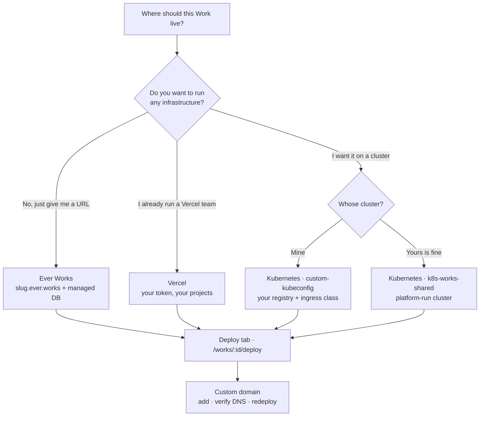
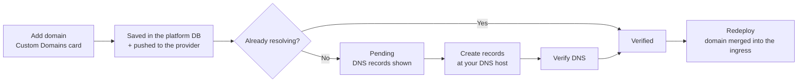

# Custom Domains and Deploy Targets

Every Work whose kind produces a site — Website, Landing Page, Blog, Directory, Awesome Repo — ends up at a public address. This guide covers the whole path: picking a deploy target, wiring its credentials, running a deploy from the **Deploy** tab, attaching your own domain and verifying its DNS, and moving a Work from one provider to another later.

Routes are written the way you would type them, without the locale prefix — the address bar shows `/en/works/:id/deploy`, this guide says `/works/:id/deploy`.

## The three deploy targets

There are exactly three places a Work can be published today. Two of them are deploy plugins (`packages/plugins/vercel` and `packages/plugins/k8s`, the only two plugins in the `deployment` category); the third is the platform's own managed provider.

| Target         | Provider id  | You supply                                      | The platform supplies                                                                      | Managed `*.ever.works` address    |
| -------------- | ------------ | ----------------------------------------------- | ------------------------------------------------------------------------------------------ | --------------------------------- |
| **Ever Works** | `ever-works` | Nothing.                                        | Cluster, namespace, ingress, the `*.ever.works` DNS record, and (when enabled) a database. | Yes, always                       |
| **Vercel**     | `vercel`     | A Vercel API token (or the OAuth connection).   | The deploy run, project creation, team scoping, domain sync.                               | No                                |
| **Kubernetes** | `k8s`        | A kubeconfig — or a platform-managed cluster.\* | Container build, registry push, `Deployment` / `Service` / `Ingress`, TLS annotations.     | Only when the operator enables it |

\* The Kubernetes plugin can target your own cluster (`custom-kubeconfig`) or a platform-run one (`k8s-works-shared`, the default). The full matrix is in [Kubernetes Deployment](../features/k8s-deployment.md#target-cluster) and [Managed Deployment & Cluster Sources](../advanced/managed-deployment.md).



### Ever Works (managed)

Zero infrastructure. The Work gets `<slug>.ever.works` with its Cloudflare CNAME, a per-Work PostgreSQL database, a per-tenant namespace on the platform cluster, and HTTPS you never touch. It is chosen in the [onboarding wizard](../features/onboarding.md) at **Step 5 — Your deployment**, and it is applied when the Work is created.

Two facts that catch people out:

- **It is chosen at Work creation, not from the Deploy tab.** The Deploy tab's selector lists installed deploy _plugins_, and `PATCH /api/works/:id { deployProvider }` accepts only `vercel` and `k8s` — anything else returns `400 Unsupported deploy provider: <value>`.
- **It is env-gated and capped.** The option only persists when the platform has `DEPLOY_EVER_WORKS_ENABLED` on; when it is off, Work creation stores `vercel` instead. Active managed Works are capped per account (default 3, `EVER_WORKS_DEPLOY_MAX_WORKS_PER_USER`).

Everything about this path — subdomain allocation, the managed database, the Ever Works Git storage twin — is documented in [Managed Hosting](../features/managed-hosting.md).

### Vercel

The fastest path if you already have a Vercel account. You paste a personal API token (`x-secret`, stored encrypted, never returned by the API) into the Vercel plugin's settings; the plugin creates and deploys the project, and — when your token can see Vercel Teams — the Deploy button asks which team to deploy under before it runs.

The plugin also advertises an `oauth` capability ("Connect with Vercel") when the operator has registered a Vercel OAuth Integration and wired `VERCEL_OAUTH_CLIENT_ID`, `VERCEL_OAUTH_CLIENT_SECRET` and `VERCEL_INTEGRATION_SLUG`. Until then the manual API-token field is the only path, and nothing breaks.

Vercel assigns its own `*.vercel.app` hostname. That row shows up in **Custom Domains** with an **Auto-assigned** badge and no remove button — Vercel re-creates it on every deploy, so removing it from the dashboard would be pointless.

### Kubernetes

Your cluster, your registry, your ingress controller. On deploy the plugin builds a container image of the generated site, pushes it to your registry with a deterministic tag, and server-side-applies a `Deployment`, a `Service` and (when there is a host to serve) an `Ingress`.

| Piece          | What ships today                                                                                                                               |
| -------------- | ---------------------------------------------------------------------------------------------------------------------------------------------- |
| **Registries** | GitHub Container Registry (default, reuses your connected GitHub account), Docker Hub, and any generic OCI registry (Harbor, Quay, GitLab CR). |
| **Ingress**    | `ingress-nginx` and Traefik get controller-specific annotations; any other `IngressClass` falls back to a vanilla `Ingress`.                   |
| **TLS**        | Name a cert-manager `ClusterIssuer` in **TLS issuer** and the Ingress is annotated for it; certificates are issued once DNS verifies.          |
| **Replicas**   | 1 by default, 1–10 in v1.                                                                                                                      |
| **Cluster**    | `k8s-works-shared` (platform-run, the default) or `custom-kubeconfig` (yours). `k8s-works` is admin-only and rejected for everyone else.       |

:::warning kubeconfigs with `exec` plugins do not work
A kubeconfig that authenticates through `users[].user.exec` — `aws-iam-authenticator`, `gke-gcloud-auth-plugin`, Azure CLI auth — fails in the deploy runner, which has no `aws`/`gcloud`/`az` binary. Mint a static service-account token kubeconfig instead; [Kubernetes Deployment](../features/k8s-deployment.md) has the exact `kubectl` commands, including the namespace-scoped `rolebinding` you should use instead of a `clusterrolebinding`.
:::

## Before you start

- **A Work whose kind can deploy.** `deploy` is on for `website`, `landing-page`, `blog`, `directory`, `awesome-repo` and `default`, and off for `company` and `campaign` — those two have no Deploy tab at all. See [Work Kinds & Capabilities](../features/work-kinds.md).
- **The editor role or higher on the Work.** `canDeploy()` requires `EDITOR`; viewers get a 404 on `/works/:id/deploy`.
- **An initialized website repository.** Until the Work has a website repository or a recorded website URL, the Deploy tab redirects back to the Work overview at `/works/:id`.
- **Generated content, if you deploy from the CLI.** `ever-works work deploy` refuses a Work whose `generateStatus` is not `GENERATED` and tells you to run `ever-works work generate` first.

## 1. Pick the provider for a Work

Open **Work → Deploy** (`/works/:id/deploy`). What you see first depends on what is already set:

| State                                              | What the tab shows                                                                                                                       |
| -------------------------------------------------- | ---------------------------------------------------------------------------------------------------------------------------------------- |
| No provider set                                    | A **No Deployment Provider** card listing every enabled deploy plugin with its icon and description, and a **Select & Continue** button. |
| A provider is set and more than one is installed   | A compact dropdown showing the current provider; pick another and a **Select & Continue** button appears to save the change.             |
| A provider is set and it is the only one installed | No selector at all — there is nothing to choose between.                                                                                 |
| No deploy plugin is enabled                        | _"No deployment providers available. Install a deployment plugin first."_                                                                |

Two other ways to set the same field:

```bash
curl -X PATCH http://localhost:3100/api/works/<work-id> \
  -H "Authorization: Bearer <token>" \
  -H "Content-Type: application/json" \
  -d '{"deployProvider": "k8s"}'
```

...or in the Work's data repository, in `.works/works.yml`:

```yaml
deployProvider: k8s
```

When the dashboard and the data repo disagree, **the data repo wins** — Ever Works treats it as the source of truth. The resolver takes the first value it finds, in this order: the value requested on this call, the value imported from `.works/works.yml`, the value already in the config, then the Work's own column.

:::note The switch is silent
Nothing is written to the [activity log](../features/activity.md) when the data-repo value overrides the dashboard one, so re-open the Deploy tab after a data-repo sync if you want to confirm which provider is now in force.
:::

## 2. Give the provider its credentials

If the provider has no usable token, the Deploy tab replaces the deploy form with an alert instead of failing at deploy time.

| You see                                                                                                                          | Why                                                              | What to do                                                                                                                                |
| -------------------------------------------------------------------------------------------------------------------------------- | ---------------------------------------------------------------- | ----------------------------------------------------------------------------------------------------------------------------------------- |
| **{provider} Token Required**, with **Configure in Plugin Settings** and (when the plugin declares a homepage) **Get API Token** | You own the Work and the provider has no token for your account. | Follow the four-step panel below the alert: get a token from the provider, then save it on the plugin's page at `/plugins/<provider-id>`. |
| **Deployment Not Available** — _"The Work owner has not configured deployment."_                                                 | The Work is shared with you and the **owner** has no token.      | Ask the owner to configure it. Collaborators can trigger deploys once they have; the deploy runs on the owner's credentials.              |

Concretely:

1. **Vercel** — open `/plugins/vercel`, paste a personal API token from your Vercel account tokens page into **Vercel API Token**, and save. `POST /api/deploy/validate-token` (the **Validate** action) confirms it.
2. **Kubernetes** — open **Settings → Plugins → Deployment** (`/settings/plugins/deployment`), find the **Kubernetes** card, click **Configure**, then fill **Target cluster**, and for `custom-kubeconfig` the **kubeconfig**, **Context**, **Namespace**, **Registry**, **Ingress class**, **Default ingress host**, **TLS issuer** and **Replicas**. Click **Save & verify** — for a custom kubeconfig the platform connects to the cluster and reports its name, server URL, Kubernetes version and every `IngressClass` it detected.
3. **Ever Works** — nothing to configure. The credentials belong to the platform and never reach your account.

## 3. Deploy

With a provider and a token in place, the Deploy tab renders these cards, top to bottom:

| Card                           | Shown when                                         | What it does                                                              |
| ------------------------------ | -------------------------------------------------- | ------------------------------------------------------------------------- |
| Provider selector              | More than one deploy plugin is enabled             | Switch the Work's provider.                                               |
| **Deploy Work**                | Always                                             | The **Deploy to {provider}** button, plus the live URL once there is one. |
| **Update Work Repository**     | Always                                             | Re-sync the Work repository from its template.                            |
| **Automatic Template Updates** | Always                                             | Template selection, hourly auto-update, beta channel.                     |
| Deploy progress                | A deploy is in flight, or one has reported a state | Live state, elapsed time, **Open website**.                               |
| **Site URL / Subdomain**       | Provider is `ever-works` or `k8s`                  | The managed `*.ever.works` address.                                       |
| **Custom Domains**             | The Work has a deployed website                    | Add, verify and remove your own domains.                                  |
| **Database & environment**     | The Work has a deployed website                    | Database backend and the allow-listed runtime environment variables.      |

### Run a deploy

1. Click **Deploy to {provider}**.
2. The **Configure Before Deploy** dialog opens with the site's settings — Global, Header, Homepage and Footer tabs, loaded from the Work. Edit what you want and click **Save & Deploy**, or leave them alone and click **Skip & Deploy**. **Cancel** backs out without deploying.
3. If your provider returns teams (Vercel does), a **Select Team** dialog asks which team to deploy under; confirm with **Deploy to team**. With no teams the deploy starts immediately.
4. A toast reports the outcome — _"Deployment started successfully"_, or _"Deployment is queued and will start shortly"_ when the provider accepted it but has not begun.
5. Watch the progress panel. It polls `/api/works/:id/deploy/status` every 3 seconds until a terminal state, and shows an elapsed-time counter that ticks every second.

The same deploy over REST and from the CLI:

```bash
curl -X POST http://localhost:3100/api/deploy/works/<work-id> \
  -H "Authorization: Bearer <token>" \
  -H "Content-Type: application/json" \
  -d '{"teamScope": "my-vercel-team"}'
```

```bash
ever-works work deploy
```

The CLI walks the same states interactively — it selects the Work, checks your role, refuses if content has not been generated, offers to pick a provider or configure a token when either is missing, then polls the deployment status every 5 seconds until `READY`, `ERROR`, `CANCELED` or `TIMEOUT`.

### Deploy states

| State          | Panel title           | What the panel says                                                                                  |
| -------------- | --------------------- | ---------------------------------------------------------------------------------------------------- |
| `INITIALIZING` | Initializing deploy   | Setting up your deploy environment.                                                                  |
| `QUEUED`       | Queued                | Waiting for the deploy workflow runner to pick up the job.                                           |
| `BUILDING`     | Building              | Building your container image and pushing to the registry.                                           |
| `READY`        | Deployed successfully | Your website is live — the panel shows an **Open website** link.                                     |
| `ERROR`        | Deploy failed         | The deploy workflow finished with an error; check the GitHub Actions logs on the website repository. |
| `CANCELED`     | Deploy canceled       | The deploy was canceled.                                                                             |
| `TIMEOUT`      | Deploy timed out      | The deploy took too long to finish; the cluster may still be rolling out.                            |
| `UNKNOWN`      | Status unknown        | No recent deploy activity yet.                                                                       |

The panel shows that title as its heading, with the raw state name (`BUILDING`, `READY`, …) beside it in a small coloured pill, so both the sentence and the machine value are on screen.

A deploy is treated as "in flight" by the page while the state is `INITIALIZING`, `QUEUED` or `BUILDING` **and** it started less than 10 minutes ago, so a wedged run stops blocking the button forever. That page-side gate is separate from the server-side verifier, which polls the provider for up to 13 minutes and then records `TIMEOUT`.

### Update the Work repository

**Update Work Repository → Update Repository** re-syncs the Work repository from its template without deploying — the description links straight to the repository when its name is known. Use it when the template has moved on and you want the code refreshed before the next deploy. In **Automatic Template Updates** you can instead turn on **Update automatically** (checks hourly and applies), or **Use beta version of template** to track the template's `stage` branch instead of `main`.

:::warning Switching template rewrites the repository
**Switch template** in the same card replaces the Work repository's contents from the newly selected template if that repository already exists. Custom code in it is lost. The confirmation dialog says so; switch before you hand-edit code, or expect to re-apply your edits.
:::

## 4. Add and verify a custom domain

The **Custom Domains** card only appears after the Work has a deployed website — the API returns `400 No deployment exists for this work. Deploy first before adding domains.` if you try earlier. Deploy once, then:

1. Open **Work → Deploy** → **Custom Domains**.
2. Type the domain in the field (placeholder `example.com`) and click **Add**. The platform stores the domain and pushes it to your provider.
3. Read the toast. _"Domain added and verified!"_ means DNS already pointed the right way and you are done. _"Domain added. Configure DNS to verify it."_ means the row is now **Pending** and the DNS panel has been expanded for you.
4. In the expanded **Configure these DNS records:** panel, copy each record's **Name:** and **Value:** with the copy buttons and create them at your DNS host. Each record shows its type and the provider's own reason for it.
5. Create the records, wait for propagation, then click **Verify DNS** (the circular-arrow button on the row).
6. On success the row flips to a green **Verified** badge and the toast reads _"Domain verified successfully!"_. If not, you get _"DNS not verified yet. Please check your DNS settings and try again later."_ — nothing is lost, click it again after propagation.
7. Redeploy so the domain is merged into the live ingress alongside the Work's existing address.



### Which DNS record to create

| Domain shape                   | Record  | Points at                                                                        |
| ------------------------------ | ------- | -------------------------------------------------------------------------------- |
| Subdomain — `blog.example.com` | `CNAME` | Your provider's target. On Kubernetes this is the cluster ingress load balancer. |
| Apex — `example.com`           | `A`     | Your provider's IP. On Kubernetes this is the ingress load balancer's IP.        |

The exact values always come from the verification records the card shows, not from this table — on Vercel they are whatever the Vercel API returns for that domain (often a `TXT` ownership record alongside the routing record), and on Kubernetes the plugin builds them itself from your cluster's ingress load-balancer host.

:::note Multi-level suffixes
The Kubernetes guidance treats "exactly two labels" as an apex, so `example.co.uk` and `example.com.br` are suggested a `CNAME` when they need an `A` record. Override the record type by hand when the suggestion is wrong for your suffix.
:::

### What happens once a domain verifies

- **It can become the Work's primary URL.** If the Work's current website URL is provider-assigned — a `*.vercel.app` host, or a `*.ever.works` host — it is promoted to `https://<your-domain>`. A URL you already promoted to your own domain is left alone.
- **The managed subdomain keeps working.** A `*.ever.works` address and a custom domain are not alternatives; every active custom domain is merged in as an **additional** ingress host on the next deploy.
- **TLS**: on Kubernetes, cert-manager issues the certificate once DNS resolves, provided you set a **TLS issuer**. On the managed path HTTPS is already terminated for you. On Vercel, Vercel handles it.

### Remove a domain

Click the trash icon on the row. It is removed from both the platform database and the provider. The one row you cannot remove is the provider-assigned `*.vercel.app` hostname **while the Work still deploys to Vercel** — it carries an **Auto-assigned** badge and no delete button, because Vercel re-creates it. Switch the Work off Vercel and the row becomes removable, so you can clean up the stale record.

### Let the Cloudflare DNS plugin write the records

If your zone is on Cloudflare, you can skip the manual record creation. The `cloudflare-dns` plugin (category `dns`) has a bring-your-own-zone mode: supply a scoped **Cloudflare API token** with `DNS:Edit` on the zone and the **Cloudflare zone id**, both stored as encrypted user-scoped plugin settings, and the platform manages records in your zone the same way it manages its own.

| Setting                  | What it is                                                                                                                         |
| ------------------------ | ---------------------------------------------------------------------------------------------------------------------------------- |
| **Cloudflare API token** | Scoped token with `DNS:Edit` on the target zone. Secret; stored encrypted.                                                         |
| **Cloudflare zone id**   | The zone that owns the root domain. Required alongside the token.                                                                  |
| **Root domain**          | The zone this provider manages. Defaults to `ever.works` for the platform's managed mode.                                          |
| **Ingress LB hostname**  | The CNAME target public Work subdomains resolve to. Admin-only in managed mode.                                                    |
| **Cloudflare proxy**     | Whether new records go behind the orange-cloud proxy. On by default; turn it off for a custom domain whose TLS you serve yourself. |

Record writes are idempotent and drift-correcting: a record already pointing at the right target is left alone, one pointing elsewhere is patched in place, a missing one is created. In this bring-your-own-zone mode the orange cloud is purely a setting — the plugin uses the proxy flag passed on the call, and otherwise the **Cloudflare proxy** setting above, which resolves to on unless you turn it off.

The platform's **managed** `*.ever.works` mode is what creates and removes the CNAMEs behind managed subdomains; those credentials are operator environment variables and are never exposed to tenants. It adds one behaviour that is derived rather than configured: a record whose target is a Cloudflare Tunnel hostname (`*.cfargotunnel.com`) is always created proxied, because an unproxied CNAME at a tunnel is dead on the public internet. Any other target — a real load-balancer hostname, or an `A` record — keeps the unproxied default.

## 5. The managed subdomain card

For Works on `ever-works` — and on `k8s` when the operator has turned on `K8S_MANAGED_SUBDOMAIN` — a **Site URL / Subdomain** card sits directly above **Custom Domains**. It is the Work's primary address; custom domains are additive on top.

| What you see                                                          | What it means                                                                         |
| --------------------------------------------------------------------- | ------------------------------------------------------------------------------------- |
| The address with a green **Live** badge                               | The label is claimed and its DNS record exists. The address is a working link.        |
| The address with a **DNS propagating** badge                          | The claim is persisted but no record was found yet — shown as plain text, not a link. |
| _No managed subdomain yet — it will be allocated on the next deploy._ | Nothing is claimed for this Work.                                                     |
| A **Change subdomain** field with a fixed `.ever.works` suffix        | You may re-allocate. Type a label and click **Save**.                                 |
| _Managed subdomain is read-only for this Work._                       | The Work's provider or this environment's flag does not allow re-allocation.          |

Renaming validates the label (lowercase letters, digits and hyphens; no leading or trailing hyphen; the form asks for 3–63 characters), refuses reserved platform labels such as `www`, `api`, `app`, `admin`, `docs` and `status` with a `400`, and returns `409` when another Work already holds it. The old record is removed and the new one created; if the new record cannot be written, the claim is rolled back. Full detail — allocation, collisions, HTTPS, the activity-log entry — is in [Managed Hosting](../features/managed-hosting.md#managed-subdomains).

## 6. Switching providers

Changing `deployProvider` is a one-field change, but the consequences are worth knowing before you make it.

| Thing                      | What happens on a switch                                                                                                                           |
| -------------------------- | -------------------------------------------------------------------------------------------------------------------------------------------------- |
| **Custom domain rows**     | **Persist.** They live in the platform database, which is the source of truth, and are re-synced to the new provider on the next deploy.           |
| **DNS records**            | Do not move themselves. The new provider's target is different — re-open the domain's DNS panel and update the records, then **Verify DNS** again. |
| **The old deployment**     | **Is not torn down.** Delete the Vercel project or the Kubernetes resources yourself.                                                              |
| **The `*.vercel.app` row** | Becomes removable once the Work is no longer on Vercel, so you can delete the now-stale row.                                                       |
| **The managed subdomain**  | Only meaningful on `ever-works` and `k8s`. Switching to Vercel hides the card; the claim stays on the Work.                                        |
| **Going _to_ Ever Works**  | Not possible from the Deploy tab — the managed provider is set at Work creation, and `PATCH /api/works/:id` accepts only `vercel` and `k8s`.       |

The practical sequence for moving a live Work between Vercel and Kubernetes:

1. Configure the target provider's credentials first (`/plugins/vercel` or `/settings/plugins/deployment` → **Kubernetes** → **Save & verify**).
2. Switch the provider on the Deploy tab and click **Select & Continue**.
3. Deploy once on the new provider and confirm the progress panel reaches `READY`.
4. Re-open each domain's DNS panel, update the records to the new target, and click **Verify DNS**.
5. Redeploy so the verified domains are merged into the new ingress.
6. Delete the old provider's project or cluster resources by hand.

## Troubleshooting

| Symptom                                                                   | Cause and fix                                                                                                                                                                                                                                                                                   |
| ------------------------------------------------------------------------- | ----------------------------------------------------------------------------------------------------------------------------------------------------------------------------------------------------------------------------------------------------------------------------------------------- |
| The Deploy tab redirects to `/works/:id`                                  | The Work has no initialized website repository and no recorded website. Initialize it from the Work settings first.                                                                                                                                                                             |
| The Deploy tab 404s                                                       | Your role on the Work is below **editor**.                                                                                                                                                                                                                                                      |
| **{provider} Token Required**                                             | No token for that provider on your account. **Configure in Plugin Settings** takes you to `/plugins/<provider-id>`.                                                                                                                                                                             |
| **Deployment Not Available** on a shared Work                             | The Work's owner has not configured deployment. Only the owner's credentials are used.                                                                                                                                                                                                          |
| _"No deployment providers available. Install a deployment plugin first."_ | No `deployment`-category plugin is enabled on this installation. Enable Vercel or Kubernetes under **Settings → Plugins → Deployment**.                                                                                                                                                         |
| `400 Unsupported deploy provider: ever-works`                             | The managed provider cannot be selected after creation. Create the Work with the Ever Works deploy option instead.                                                                                                                                                                              |
| `400 No deployment exists for this work…` on any domain call              | The Work has never deployed successfully. Deploy first — all four domain verbs are gated on a recorded website.                                                                                                                                                                                 |
| Deploy stuck at `BUILDING` / `QUEUED`                                     | The workflow runner has not finished. On Kubernetes, check the pod: `kubectl -n <ns> describe pod -l app.kubernetes.io/name=<slug>`. The deploy verifier gives up after about 13 minutes and records `TIMEOUT`; the Deploy tab stops treating the run as in flight after 10 minutes regardless. |
| State `ERROR`                                                             | The deploy workflow failed. Open the GitHub Actions runs on the website repository — the panel's message points there.                                                                                                                                                                          |
| `ErrImagePull` on Kubernetes                                              | Registry credentials are wrong or the registry is unreachable from the cluster. For a private GHCR image the pull secret comes from your GitHub plugin token.                                                                                                                                   |
| `403 Forbidden` applying manifests                                        | The service account lacks `edit` on the namespace. Bind it with `kubectl create rolebinding` — namespace-scoped, not cluster-wide.                                                                                                                                                              |
| Domain stays **Pending** after **Verify DNS**                             | DNS has not propagated, or the record does not match. Re-read the values in the DNS panel; on a multi-level suffix check whether you need an `A` record instead of a `CNAME`.                                                                                                                   |
| Domain verified but the site still serves the old address                 | Verification updates DNS state; the ingress host list is applied on the **next deploy**. Redeploy.                                                                                                                                                                                              |
| Can't remove a `*.vercel.app` row                                         | Expected while the Work deploys to Vercel — the badge reads **Auto-assigned**. It becomes removable after you switch providers.                                                                                                                                                                 |
| Card shows _"No managed subdomain yet"_ after a deploy                    | DNS credentials or the load-balancer target are not configured, so allocation was skipped deliberately. The Work is still served at the cluster host.                                                                                                                                           |
| `500 Managed DNS is not configured on this environment`                   | `CLOUDFLARE_API_TOKEN`, `CLOUDFLARE_ZONE_ID` or `EVER_WORKS_DEPLOY_LB_HOSTNAME` is missing on this installation. Nothing was persisted.                                                                                                                                                         |
| A deploy to `k8s-works-shared` reports "not yet available"                | The shared customer cluster is not provisioned in this environment yet. Use `custom-kubeconfig` if your website repo is in your own GitHub org.                                                                                                                                                 |

## What is not supported yet

Being precise about the edges saves you an afternoon:

- **Only three targets exist.** Vercel, Kubernetes and the managed Ever Works provider. There is no Docker deploy target, no generic cloud (AWS / GCP / Azure) deploy target, and no static-host target. Adding one means adding a plugin in the `deployment` category.
- **No preview or per-branch deployments.** Every deploy replaces the Work's live site; there is no preview URL to promote from.
- **No rollback or deployment-history UI.** The API has `GET /api/deploy/works/:id/deployments` and `POST /api/deploy/works/:id/rollback` (which takes a `deploymentId` UUID), but the Deploy tab does not render either yet.
- **Domains are managed, not bought.** The platform writes records in zones that already exist. It does not register or transfer domains, does not add `www` redirects for you, does not route several Works under paths of one hostname, and does not merge their sitemaps.
- **Kubernetes is one cluster per user in v1.** Every Work of yours that targets Kubernetes deploys to the cluster in your plugin settings; there are no per-Work cluster overrides, no Helm or Kustomize input, no GitOps mode, and no cluster provisioning.
- **`k8s-works-shared` may still be provisioning** in a given environment; a deploy to it fails loudly rather than silently landing somewhere else.

## API reference

Every endpoint requires JWT or API-key authentication. Per-Work endpoints require view rights to read and edit rights to change.

| Method   | Endpoint                                       | Purpose                                                            |
| -------- | ---------------------------------------------- | ------------------------------------------------------------------ |
| `GET`    | `/api/deploy/providers`                        | List the deploy plugins available to you.                          |
| `GET`    | `/api/deploy/providers/:providerId/configured` | Whether that provider has credentials for you.                     |
| `GET`    | `/api/deploy/cluster-sources`                  | The Kubernetes cluster sources you may select.                     |
| `POST`   | `/api/deploy/validate-token`                   | Validate your configured deployment token.                         |
| `POST`   | `/api/deploy/works/:id`                        | Deploy the Work (optional `teamScope`).                            |
| `POST`   | `/api/deploy/works/:id/check`                  | Whether this Work can deploy, and whose token would be used.       |
| `POST`   | `/api/deploy/works/:id/lookup`                 | Adopt an existing provider deployment for the Work.                |
| `POST`   | `/api/deploy/works/:id/teams`                  | Provider teams available for this Work.                            |
| `POST`   | `/api/deploy/batch`                            | Deploy several Works at once.                                      |
| `GET`    | `/api/deploy/works/:id/deployments`            | Deployment history.                                                |
| `POST`   | `/api/deploy/works/:id/rollback`               | Roll back to a previous `deploymentId`.                            |
| `GET`    | `/api/deploy/works/:id/domains`                | List the Work's custom domains.                                    |
| `POST`   | `/api/deploy/works/:id/domains`                | Add a domain; the response carries the DNS records to create.      |
| `DELETE` | `/api/deploy/works/:id/domains/:domain`        | Remove a domain from the database and the provider.                |
| `POST`   | `/api/deploy/works/:id/domains/:domain/verify` | Trigger DNS verification.                                          |
| `GET`    | `/api/deploy/works/:id/subdomain`              | The managed subdomain, its FQDN, URL and DNS health.               |
| `PUT`    | `/api/deploy/works/:id/subdomain`              | Re-allocate the managed subdomain.                                 |
| `GET`    | `/api/deploy/works/:id/runtime-env`            | Database mode and the allow-listed runtime environment variables.  |
| `PUT`    | `/api/deploy/works/:id/runtime-env`            | Set the database mode, connection string or environment variables. |
| `POST`   | `/api/deploy/works/:id/db/test`                | Validate a custom Postgres connection string without saving it.    |
| `POST`   | `/api/works/:id/update-website`                | Re-sync the Work repository from its template.                     |

```bash
# Add a domain and read back the records to create
curl -X POST http://localhost:3100/api/deploy/works/<work-id>/domains \
  -H "Authorization: Bearer <token>" \
  -H "Content-Type: application/json" \
  -d '{"domain": "tools.example.com"}'

# ...then verify it once DNS is in place
curl -X POST http://localhost:3100/api/deploy/works/<work-id>/domains/tools.example.com/verify \
  -H "Authorization: Bearer <token>"
```

## Related

- [Custom Domains](../features/custom-domains.md) — the domain feature and its full REST surface.
- [Managed Hosting](../features/managed-hosting.md) — `*.ever.works` subdomains, the Ever Works DB, and managed DNS.
- [Kubernetes Deployment](../features/k8s-deployment.md) — registries, ingress classes, cert-manager and the cluster matrix.
- [Managed Deployment & Cluster Sources](../advanced/managed-deployment.md) — per-tenant namespaces and the fail-closed cluster rules.
- [Work Kinds & Capabilities](../features/work-kinds.md) — which kinds have a Deploy tab at all.
- [Website Templates](../features/website-templates.md) — what the Work repository is built from.
- [Deployment API](../api/deployment.md) — the REST surface behind the Deploy tab.
- [Work CLI commands](../cli/work-commands.md) — `ever-works work deploy` in depth.
- [Quickstart: A Marketing Website](./quickstart-website.md) — the end-to-end flow this guide's step 4 belongs to.
- [Self-host with Docker Compose and Kubernetes](./self-host-docker-kubernetes.md) — running the platform itself, as opposed to the sites it deploys.
