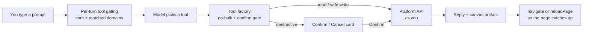

# Do Everything From Chat

Every dashboard page in Ever Works carries a **chat rail**, and the rail is not a help widget. It calls the same REST API the buttons call, signed in as you, and it can create a Mission, queue an Idea for build, assign a Task to an Agent, enable a plugin, chart your spend, or generate a comparison — one entity at a time, asking before anything irreversible.

This guide is the hands-on companion to [Platform Chat & Canvas](../features/platform-chat.md). That page describes the system; this one gives you **ten prompts that work**, says exactly which tool each one calls, and tells you where in the dashboard to check the result.

Routes are written without the locale prefix — the address bar shows `/en/works`, this guide says `/works`.



## Step 1 — Open the rail and pick a provider

1. Sign in and open any dashboard page — `/works` is a good one because most examples below want a Work in reach.
2. Click the **robot icon** on the right edge of the navigation sidebar. The panel slides in. Its open/closed state is stored in the `chat-panel-open` cookie, so it is already open the next time you land on a dashboard page.
3. In the toolbar, open the **Provider** selector on the right. It lists your AI-provider plugins. One showing a **Not configured** badge is disabled until you add credentials at `/settings/plugins` → **AI Providers**; without a configured provider the composer says _"This provider is not configured. Set it up in Plugins."_ and a send attempt fails with _"Unable to send message"_.
4. Optionally pin a model with the **Model** picker beside the composer. It offers **Provider default** first, then the provider's configured tier models (simple / medium / complex), then a searchable list of the provider's full catalogue, fetched only when you open the picker. The pin is stored on the conversation row, so it survives a reload.
5. Type into the composer (placeholder _Ask me anything…_). **Enter** sends, **Shift+Enter** adds a line, **Stop generating** aborts a streaming reply.

:::tip Say the domain out loud
The rail has roughly 400 tools, and no provider will accept 400 function schemas per turn. Each turn activates an always-on core plus every domain whose keywords appear in your last three messages or in the current page URL, capped at 128 tools. So say the noun: **agent**, **task**, **mission**, **idea**, **plugin**, **webhook**, **budget**, **comparison**, **knowledge**. If the assistant claims it cannot do something, name the domain in your next message and its tools are pulled into that turn. Nothing is lost permanently.
:::

Two more things the rail does on its own, and it helps to expect them:

- **It uses where you are.** The current page URL travels with every message, so on `/works/:id/…` you never paste the Work id.
- **It moves the page.** After creating a Work it navigates you to the new Work; after other mutations it reloads the page so the dashboard shows what just changed.

## Step 2 — Ten prompts that do real work

Each row is a prompt you can paste, the tool it lands on, and where to verify it. Every tool named here is registered in the live tool set — the generated single-entity registry (`apps/web/src/lib/ai/tools/generated/registry*.ts`) or the hand-written tools beside it.

| #   | Say this                                                                  | Tool that runs                        | Check it at                        |
| --- | ------------------------------------------------------------------------- | ------------------------------------- | ---------------------------------- |
| 1   | Create a mission that researches AI developer tools every Monday at 09:00 | `createMission`                       | `/missions`                        |
| 2   | Add an idea: a directory of open-source observability tools               | `createIdea`                          | `/ideas`                           |
| 3   | Build that idea                                                           | `buildIdea`                           | `/ideas/:id`                       |
| 4   | How much has the Researcher agent spent this period?                      | `list_agents` → `get_agent_budget`    | `/agents/:id/budgets`              |
| 5   | Show my blocked tasks as a table                                          | `list_tasks` → `renderTable`          | `/tasks`                           |
| 6   | Assign that task to the Researcher agent and start it                     | `assign_task_to_agent`                | `/tasks/:id`                       |
| 7   | Enable the Slack connector                                                | `list_plugins` → `enable_plugin`      | `/plugins`                         |
| 8   | Attach the Observability Directory work to that mission as `created`      | `attachWorkToMission`                 | `/missions/:id`                    |
| 9   | Generate the next comparison for this work                                | `generate_comparison`                 | `/works/:id/generator/comparisons` |
| 10  | List this work's knowledge-base documents and show me the brand voice one | `list_kb_documents` → `showComponent` | `/works/:id/kb`                    |

### 1. Create a Mission

> Create a mission that researches AI developer tools and drafts a weekly digest. Run it every Monday at 09:00 and keep at most five unbuilt ideas.

`createMission` takes a `description` (at least 10 characters — it becomes the Mission's AI Goal context), an optional `title`, a `type` of `one-shot` or `scheduled`, a five-field cron `schedule`, `autoBuildWorks`, and `outstandingIdeasCap`. The tool defaults to `one-shot` and only flips to `scheduled` when you explicitly ask for recurring runs, so "every Monday at 09:00" is what turns your sentence into `type: "scheduled"`, `schedule: "0 9 * * 1"`. `autoBuildWorks` is never set unless you ask for it — the Mission spawns Ideas and waits.

If you leave out the cadence, the assistant asks rather than inventing one. That is a rule it works under, not a quirk: missing name, cadence or URL is always a question.

**Verify:** `/missions` lists the new Mission; `/missions/:id` has its Run now, Pause, Clone and budget controls. See [Missions](../features/missions.md).

### 2. Add an Idea

> Add an idea: a directory of open-source observability tools, with pricing and self-host notes for each entry.

`createIdea` needs only a `description`; the server derives the title when you omit one. Attachments added through a composer's **+** button travel with the prompt as upload ids and are attached to the Idea.

**Verify:** `/ideas`. See [Ideas](../features/ideas.md).

### 3. Build it

> Build that idea.

`buildIdea` transitions the Idea from `PENDING` (or `FAILED`) to `QUEUED`, spawns a Work build request under the hood, and returns the build-request id so the assistant can point you at the live run. Ask instead for `refreshIdeas` ("find me new ideas") to run the research job that proposes fresh ones — it is rate-limited server-side and reports `status: "rate-limited"` rather than failing.

If you already have a Work that fulfils the Idea and only want the back-reference, say so: that is `acceptIdea`, which links Idea to Work without generating anything.

**Verify:** `/ideas/:id`, then the Work it produces under `/works`.

### 4. Spend, per Agent

> How much has the Researcher agent spent this period?

Two calls: `list_agents` to resolve the name to an agent, then `get_agent_budget` (`GET /api/agents/{id}/budget`) for that agent's current-period spend. Ask for it as a dial — "show that as a gauge" — and the assistant follows with `showComponent` using the `gauge` component, which is built for budget and cap usage.

Spend questions scale up and down from there:

| Ask                                    | What runs                                   |
| -------------------------------------- | ------------------------------------------- |
| "What has this work spent, by plugin?" | `runReport` → `work_spend_by_plugin`        |
| "Chart this work's daily spend"        | `runReport` → `work_spend_trend`            |
| "What have I spent across everything?" | `runReport` → `account_spend_overview`      |
| "What did task T-12 cost?"             | `get_task_spend`                            |
| "Cap this work at $50 a month"         | `create_work_budget` (needs cap + currency) |

**Verify:** `/agents/:id/budgets` for the Agent, `/works/:id/settings/budgets-usage` for the Work, `/settings/usage` for the account. See [Budgets & Usage](../features/budgets-and-usage.md).

### 5. List blocked Tasks

> Show my blocked tasks as a table.

`list_tasks` accepts `status` and `missionId` query filters, so this is one call with `status: "blocked"`, followed by `renderTable` to put the rows in the canvas rather than in the message. Ask for "my tasks as a board" instead and you get `runReport` → `tasks_board`, a kanban artifact grouped by status.

**Verify:** `/tasks`, which has the same status, priority, scope, label and search filters. See [Tasks](../features/tasks.md).

### 6. Run a Task with an Agent

> Assign the "Refresh the pricing table" task to the Researcher agent and start it.

`assign_task_to_agent` (`POST /api/agents/{id}/assign-task`, body `taskId`) is the tool that actually dispatches work. It returns a `runId`, and it de-duplicates: if that Agent already has an in-flight run for that Task, you get the existing run back instead of a second one. The run goes through the same per-Work concurrency valve as every other dispatch, so a busy Work may return the run as queued with a reason rather than starting it immediately.

Related tools in the same breath: `transition_task` moves a Task's status (`in_progress`, `completed`, `blocked`), `add_task_assignee` / `add_task_reviewer` / `add_task_approver` set people on it, and `post_task_chat` writes into the Task's own thread.

**Verify:** `/tasks/:id` — the run appears in the Task's activity and run history. See [Tasks](../features/tasks.md) and [Agents](../features/agents.md).

### 7. Enable a plugin

> Enable the Slack connector.

`list_plugins` finds the plugin id, `enable_plugin` turns it on for the account, and `get_plugin_connection_status` tells you whether it is actually reachable — enabling a connector is not the same as authenticating it. Scope it to one Work instead with `enable_work_plugin`.

Turning a plugin **off** is confirmation-gated (`disable_plugin`, `disable_work_plugin`); turning one on is not.

**Verify:** `/plugins` for the catalogue, `/plugins/:pluginId` for its settings, `/settings/plugins` for the per-category view, `/works/:id/plugins` for the Work-scoped list. See [Plugins](../features/plugins.md) and [Integrations](../features/integrations.md).

### 8. Attach a Work to a Mission

> Attach the Observability Directory work to the AI developer tools mission, as the work it created.

`attachWorkToMission` records a typed relation — one of `created`, `improves`, `operates`, `markets`, `researches`, `retires` — between a Mission and an existing Work. It never transfers or changes ownership: a Mission does not own Works, and the same Work can relate to many Missions across its life, even to the same Mission under several relation kinds. The assistant resolves both ids first with `listWorks` and `listMissions`, then calls `attachWorkToMission`; `listMissionWorks` reads the relations back and `detachWorkFromMission` removes exactly one edge.

**Verify:** the **Attached Works** panel on `/missions/:id`. See [Missions](../features/missions.md).

### 9. Generate a comparison

> Generate the next comparison for this work.

Open `/works/:id/generator/comparisons` first so the Work id comes from the URL. `generate_comparison` auto-picks the next best pair of items and generates the page; `get_comparison_generation_status` reports progress on an in-flight run and `get_remaining_comparison_count` says how many pairs are left. For a specific pair, say which two — that routes to `generate_manual_comparison`, whose body takes `itemASlug` and `itemBSlug`.

Deleting one (`delete_comparison`) is confirmation-gated.

**Verify:** `/works/:id/generator/comparisons`. See [Comparisons](../features/comparisons.md).

### 10. Ask the Knowledge Base

> List this work's knowledge-base documents, then show me the brand voice one.

On a Work page the assistant already knows which Work you mean. `list_kb_documents` reads that Work's Memory, and rendering a document is `showComponent` with the `markdown` component so the body lands in the canvas rather than flooding the transcript. `create_kb_document` (path, title, content) and `update_kb_document` write back; `delete_kb_document` is confirmation-gated. `list_kb_tags` and `create_kb_tag` manage the tag set.

When a reply references a document with a `kb:{class}/{slug}` token — `kb:brand/voice`, say — a **Cited:** footer appears under the message with one hover chip per document, resolved through the same endpoints the Memory workbench uses.

**Verify:** `/works/:id/kb`. See [Knowledge Base & Memory](../features/knowledge-base.md).

## Confirmation cards, and how to cancel

Anything that deletes, removes, revokes, disconnects, cancels, rotates a secret, or spends on your behalf is marked as needing confirmation. **54 of the 332 generated tools carry the flag** — `delete_task`, `revoke_api_key`, `remove_work_member`, `rotate_webhook_secret`, `disconnect_oauth`, `cancel_generation`, `run_agent_now`, `send_email_message`, `delete_comparison`, `leave_work` and their siblings.

The gate lives in the tool factory, not in the model's judgement. Called without `confirmed: true`, a gated tool returns a marker **instead of touching the API** — no request is made — and the chat renders a card:

1. The card is titled **Confirm this action** and reads _"&lt;what the tool does&gt; (&lt;target&gt;). This can't be undone."_
2. Click **Confirm**. The card collapses to a **Confirming…** spinner and sends a message naming the exact tool and target, so the model re-issues that call with `confirmed: true`. The spinner is deliberately a pending state, not a success claim — the mutation runs after the model processes the message.
3. Click **Cancel** instead and the card collapses to **Cancelled**, having sent _"No, cancel &lt;tool&gt; — do not proceed."_ Nothing was called.
4. Changed your mind after Confirm? There is no undo — that is the point of the card. Recover the way you would from the dashboard: recreate the entity, or restore from Git for anything that lives in your repository.

The card names the tool and its target for a reason: if two confirmations are pending at once, confirming one cannot be misread as confirming the other.

### The no-bulk guard

There is no bulk anything. Bulk endpoints are excluded from the registry, and the factory rejects any call whose arguments or body carry an array with more than one entry — regardless of the field name. Ask for "delete all my works" and you get:

> Bulk operations are not allowed in chat. Multiple values were supplied for "ids". Please ask me to do this one entity at a time.

Then the assistant asks which single entity to start with. A single-element array is fine.

## Reading the canvas, reports and History

### The canvas

When a tool produces something better seen than read, it is rendered into the **Canvas**, a slide-over panel on the right, and the chat shows a compact chip ending in _· in canvas_. Click the chip to focus that artifact. When a conversation has produced several, a tab strip appears above the panel; **Close canvas** dismisses it without losing anything, because artifacts are saved with the conversation.

| Artifact  | Tool              | What you see                                                                     |
| --------- | ----------------- | -------------------------------------------------------------------------------- |
| chart     | `renderChart`     | Line, bar, area or pie, one or more series                                       |
| table     | `renderTable`     | A scannable grid — works, items, agents, tasks, runs                             |
| stat      | `renderStatCards` | A row of metric tiles with optional hints                                        |
| detail    | `renderDetail`    | One entity's fields plus status badges                                           |
| kanban    | `runReport`       | Columns of cards, e.g. tasks grouped by status                                   |
| component | `showComponent`   | A named component — `gauge`, `progress`, `timeline`, `markdown`, `funnel`, `kpi` |

Canvas tools never ask for confirmation: they only draw data that was already fetched.

### Reports

Analytics questions have a turnkey path. Ask the question in English and `runReport` fetches, aggregates and renders in one call.

| Ask                                     | Report id              |
| --------------------------------------- | ---------------------- |
| "How are my tasks distributed?"         | `tasks_by_status`      |
| "Show my tasks as a board"              | `tasks_board`          |
| "How many agents are active?"           | `agents_by_status`     |
| "Chart my missions by status"           | `missions_by_status`   |
| "Spend over time for this work"         | `work_spend_trend`     |
| "This work's spend by plugin"           | `work_spend_by_plugin` |
| "Activity per day"                      | `activity_per_day`     |
| "Items generated per day for this work" | `work_items_per_day`   |
| "Members of this work by role"          | `work_members_by_role` |

Say "what reports are there?" to get `listReports`. When nothing named fits, `buildReport` groups any of nineteen list sources — tasks, agents, missions, ideas, works, skills, notifications, webhooks and deliveries, plugins, organizations, notification channels, API keys, templates, and the Work-scoped items, members, KB documents, comparisons and deployments — by any field into a bar or pie chart. "Chart this work's items by category" needs no named report.

Work-scoped reports need a Work. Run them from a `/works/:id/…` page and the id comes from the URL; run them from elsewhere and the assistant will ask which Work you mean.

### History

**History** in the toolbar lists your saved conversations, newest first, dated **Today**, **Yesterday**, `3d ago`, then a plain date. Click a row to reopen the thread with its messages — and its canvas artifacts — intact; hover a row for the delete icon. **New chat** starts a fresh thread and carries your pinned model over.

Everything History shows is also available over REST at `/api/conversations`, which is worth knowing when you want to script an export. See [AI Conversation](../api/ai-conversation.md).

## From Slack

With the Slack connector enabled, you get the same engine in a channel.

| You do                                        | What happens                                                                                                                                       |
| --------------------------------------------- | -------------------------------------------------------------------------------------------------------------------------------------------------- |
| `@works what shipped today?`                  | The mention is routed into the platform chat as the bound user and the answer is posted back into that thread.                                     |
| `/works what shipped today?`                  | You get an instant private acknowledgement — _"On it — I am asking Ever Works now…"_ — and the answer is posted into the channel when it is ready. |
| `/works` with nothing after                   | A usage hint naming the command and an example question, rather than an empty prompt sent to the model.                                            |
| Either, from a workspace nobody has connected | _"This Slack workspace is not connected to an Ever Works account yet. Enable the Slack connector in Ever Works and try again."_                    |

Both paths verify Slack's request signature, resolve which install owns the workspace from the delivery's team id, and use your configured AI provider and model.

:::caution Slack answers, it does not operate
The Slack bridge runs a plain completion — it does not carry the dashboard's tool loop, so it has no confirmation cards and no canvas. "Delete the staging webhook" typed in Slack is a question about a webhook, not a deletion. Do the operating from the rail.
:::

See [Integrations](../features/integrations.md).

## From any OpenAI-compatible client

The engine behind the rail is exposed at `POST /api/v1/chat/completions`, so any OpenAI-style client can talk to your platform, with your provider plugins and your Work context.

| Header / field            | What it does                                                                                                                                                       |
| ------------------------- | ------------------------------------------------------------------------------------------------------------------------------------------------------------------ |
| `Authorization: Bearer …` | Required. Acts as you.                                                                                                                                             |
| `x-work-id`               | Scopes the completion to one Work — per-Work AI plugin settings apply, and `@kb:{class}/{slug}` mentions in the latest user message resolve to that Work's Memory. |
| `x-provider-override`     | Route this request to a specific AI-provider plugin id.                                                                                                            |
| `model`                   | A model id, or `auto` for the provider's configured default.                                                                                                       |
| `stream: true`            | Returns `text/event-stream` with `chat.completion.chunk` frames and a final `data: [DONE]`.                                                                        |

```bash
curl -X POST "https://api.ever.works/api/v1/chat/completions" \
  -H "Authorization: Bearer $EVER_WORKS_TOKEN" \
  -H "x-work-id: $WORK_ID" \
  -H "Content-Type: application/json" \
  -d '{
    "model": "auto",
    "messages": [
      { "role": "user", "content": "Summarize @kb:brand/voice in three bullets." }
    ]
  }'
```

With no AI provider configured the endpoint answers `422 { "error": { "type": "provider_unavailable" } }` — a truthful 4xx, never a 500. Tools you pass in the body are handed to the model and come back as `tool_calls`; **executing them is the caller's job**. The rail is one such caller, and its tool loop is what turns "delete the staging webhook" into a confirmation card rather than a suggestion.

Omit `x-work-id` and the platform falls back to your first Work, so pass it whenever the answer depends on which Work you mean.

## Chat or MCP?

The [MCP server](../features/mcp-server.md) exposes a curated whitelist of API operations to external AI assistants over the Model Context Protocol, authenticated with an [API key](../features/api-keys.md). It is the right surface when the conversation is happening outside Ever Works. It is a deliberately smaller one.

| Capability                                         | Dashboard chat rail                      | MCP server                                        |
| -------------------------------------------------- | ---------------------------------------- | ------------------------------------------------- |
| Tool surface                                       | ~400 tools                               | A curated whitelist of operations                 |
| Runs as                                            | Your logged-in session                   | An API key                                        |
| Confirmation card before destructive actions       | Yes                                      | No — the client's own approval UI is all there is |
| No-bulk guard enforced in the tool layer           | Yes                                      | Not applicable — bulk routes are not whitelisted  |
| Canvas artifacts (charts, tables, boards, gauges)  | Yes                                      | No                                                |
| Built-in reports (`runReport`, `buildReport`)      | Yes                                      | No                                                |
| Knows which page you are on                        | Yes — the URL travels with every message | No                                                |
| Navigates and reloads the dashboard after a change | Yes                                      | No                                                |
| Conversation history with artifacts, replayable    | Yes                                      | No                                                |
| Works inside your editor or an external assistant  | No                                       | Yes                                               |

Use MCP to reach Ever Works from wherever you already are. Use the rail when you want the confirmation cards, the canvas, and a dashboard that keeps up with what you just did.

## When something does not work

| Symptom                                                    | Cause and fix                                                                                                                                       |
| ---------------------------------------------------------- | --------------------------------------------------------------------------------------------------------------------------------------------------- |
| _"This provider is not configured. Set it up in Plugins."_ | No credentials on the selected AI-provider plugin. Add them at `/settings/plugins` → **AI Providers**, or pick a different provider in the toolbar. |
| The assistant says it cannot do something you know it can  | Per-turn tool gating dropped that domain. Name the noun — "the **webhook** for staging", "this **agent**" — and its tools return on the next turn.  |
| It keeps asking for an id you can see on screen            | You are not on the entity's page. Open `/works/:id/…` (or the Mission, Task, Agent page) and ask again; the URL is passed with every message.       |
| A report answers "needs a workId"                          | It is a Work-scoped report. Run it from a Work page, or name the Work in your message.                                                              |
| _"Bulk operations are not allowed in chat."_               | By design. Ask for one entity, then the next.                                                                                                       |
| A destructive request produced a card and then nothing     | The card was left unanswered, so the tool never ran. Click **Confirm** or ask again.                                                                |
| The page still shows stale data after a change             | The rail reloads after mutations, but a reload that raced a slow write can miss it. Refresh the page.                                               |
| `422 provider_unavailable` from the API                    | Same root cause as the first row, seen from `POST /api/v1/chat/completions`.                                                                        |

## Related

- [Platform Chat & Canvas](../features/platform-chat.md) — the reference page behind this guide: every control, the full report catalogue, the canvas component list
- [Platform Tour (Screen by Screen)](./platform-tour.md) — the screens these prompts drive
- [The Founder Journey](./founder-journey.md) — where chat fits in the wider Start → Build → Sell → Scale loop
- [Missions](../features/missions.md) · [Ideas](../features/ideas.md) · [Tasks](../features/tasks.md) · [Agents (Your AI Employees)](../features/agents.md)
- [Plugins](../features/plugins.md) · [Integrations](../features/integrations.md) · [Budgets & Usage](../features/budgets-and-usage.md) · [Comparisons](../features/comparisons.md)
- [Knowledge Base & Memory](../features/knowledge-base.md) · [KB MCP & CLI Reference](../kb/mcp-cli-reference.md)
- [MCP Server](../features/mcp-server.md) · [API Keys](../features/api-keys.md)
- API reference: [AI Conversation](../api/ai-conversation.md) · [Authentication](../api/authentication.md) · [Agents](../api/agents.md) · [Tasks](../api/tasks.md)
