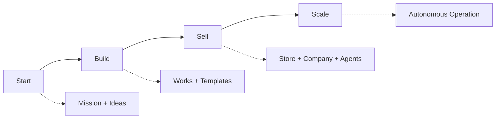

# The Founder Journey — Start, Build, Sell, Scale

Most guides for founders are *just content* — articles that tell you what to do and leave you to do it. This one is different: every step maps to something Ever Works can actually **do for you**. Read it top to bottom as one playbook, or jump to the phase you're in. The four phases — **Start → Build → Sell → Scale** — line up with the platform's core building blocks: [Missions](../features/missions.md), [Ideas](../features/ideas.md), [Works](../features/creating-a-work.md), and [Agents](../features/agents.md).

The mental model in one line: **you set the goal; an AI organization researches, builds, and runs the business toward it — 24/7, in your own Git.**

---

## 1. Start — turn a goal into a plan

You don't need a finished plan to begin. You need a **goal**.

- **Define a [Mission](../features/missions.md).** A Mission is an ambitious, ongoing goal — *"run the best cats business worldwide,"* *"launch an AI-tools media company."* It's bigger than any one website, and Ever Works keeps pursuing it for you.
- **Let Ideas come to you.** From a Mission, the platform generates [Ideas](../features/ideas.md): atomic, one-shot proposals (*"a directory of indie cat-toy brands," "a weekly cat-care blog"*). Add your own, accept the good ones, dismiss the rest.
- **Plan vs. commit.** Not sure yet? Capture it as an **Idea** and let the system research it before you commit — think of an Idea as a lightweight plan you can drop cheaply. Already know exactly what you want? Skip straight to a **Work**.
- **Think about the entity early.** If this is a real business, you'll eventually want a company behind it. The planned [Company Builder](../features/company-builder.md) is designed to guide incorporation through provider integrations (e.g. Stripe Atlas) — so registering the company is part of the journey, not a side quest.

**Platform pieces:** [Missions](../features/missions.md) · [Ideas](../features/ideas.md) · [Mission Templates](../features/mission-templates.md)

---

## 2. Build — ship the things the goal needs

A goal succeeds when real things exist online. In Ever Works, each of those is a **[Work](../features/creating-a-work.md)**.

- **Works are built from [Templates](../features/website-templates.md).** Websites, blogs, directories, landing pages — and soon [stores](../features/store-builder.md) — start from a base template in the catalog, so you're never staring at a blank page.
- **One Idea → one Work.** Accept an Idea and the platform builds it: researches the topic, writes the content, generates the code, and deploys it to your target.
- **Everything lives in your Git.** Code and content are committed to repositories you own. Nothing is locked in.
- **Give Works a brain.** Each Work has a [Knowledge Base](../features/knowledge-base.md) — brand voice, SEO rules, personas, research — that every build reads from, so output stays on-brand and gets smarter over time.

**Platform pieces:** [Creating a Work](../features/creating-a-work.md) · [Website Templates](../features/website-templates.md) · [Knowledge Base](../features/knowledge-base.md) · [Custom Domains](../features/custom-domains.md)

---

## 3. Sell — staff a team and open for business

This is where Ever Works diverges hardest from one-shot builders. A site that exists isn't a business. You need people doing the work — and here, those people are [Agents](../features/agents.md).

- **Hire an AI organization.** Create Tenant-scoped Agents for company-wide roles — a **CEO** to keep the roadmap coherent, a **CTO** to own the build, a **Researcher** to feed Ideas, a **Copywriter** to keep pages sharp. Ready-made roles ship as templates.
- **Split global vs. focused.** Some Agents work across the whole company; others are scoped to a single Work (a "Blog Editor" for one blog). You decide the org chart.
- **Give them mailboxes.** With [Agent Email & Inboxes](../features/agent-email.md), Agents send updates and outreach from real addresses and turn incoming mail into work — so sales and support conversations actually happen.
- **Open a storefront.** The planned [Store Builder](../features/store-builder.md) turns a commerce goal into a working storefront that an AI team researches, stocks, writes, and optimizes — built to *act on* your business, not just advise.

**Platform pieces:** [Agents](../features/agents.md) · [Agent Email & Inboxes](../features/agent-email.md) · [Store Builder](../features/store-builder.md) · [Company Builder](../features/company-builder.md)

---

## 4. Scale — let it run, then grow it

The point of all this is leverage: the business should keep moving without you in the loop for every step.

- **Run 24/7.** With [Autonomous Operation](../features/autonomous-operation.md), Agents and [Workers](../features/workers.md) keep writing content, finding products, improving code, generating new Ideas, and redeploying — on a schedule.
- **Stay in control of spend.** Set [budgets](../features/budgets-and-usage.md) per Work, Idea, Mission, and Agent, soft or hard, with alerts and auto-pause.
- **Add Missions and Works as you grow.** A successful company runs many Works toward several Missions; the model scales sideways without adding process.
- **Own it, forever.** Because everything is open source (AGPLv3) and lives in your Git, you can self-host, take it offline with the upcoming [Desktop App](../features/desktop-app.md), or move providers at any time. Growth never becomes a lock-in trap.

**Platform pieces:** [Autonomous Operation](../features/autonomous-operation.md) · [Workers](../features/workers.md) · [Budgets & Usage](../features/budgets-and-usage.md) · [Desktop App](../features/desktop-app.md)

---

## The whole journey, in one picture

| Phase | You do | Ever Works does | Core pieces |
|---|---|---|---|
| **Start** | Set a goal | Generates Ideas, plans, suggests the entity | Missions, Ideas |
| **Build** | Pick what to ship | Researches, writes, codes, deploys from Templates | Works, Templates, KB |
| **Sell** | Define the team & offer | Staffs Agents, gives them mailboxes, opens the store | Agents, Email, Store, Company |
| **Scale** | Set budgets & let go | Runs everything 24/7, keeps improving | Autonomous Operation, Workers |

You can be the solo founder who is *all of these roles at once* — on top of a platform that does the work. Start with a single Idea, or set a Mission and watch a company take shape.

## See also

- [Platform Overview](../overview.md)
- [Missions](../features/missions.md) · [Ideas](../features/ideas.md) · [Creating a Work](../features/creating-a-work.md) · [Agents](../features/agents.md)
- [Company Builder](../features/company-builder.md) · [Autonomous Operation](../features/autonomous-operation.md)
