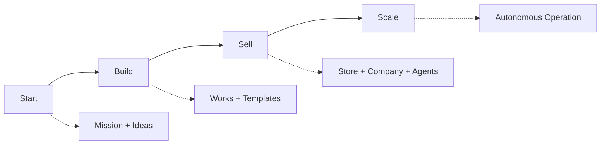

# The Founder Journey — Start, Build, Sell, Scale

Most guides for founders are _just content_ — articles that tell you what to do and leave you to do it. This one is different: every step maps to something Ever Works can actually **do for you**. Read it top to bottom as one playbook, or jump to the phase you're in. The four phases — **Start → Build → Sell → Scale** — line up with the platform's core building blocks: [Missions](../features/missions.md), [Ideas](../features/ideas.md), [Works](../features/creating-a-work.md), and [Agents](../features/agents.md).

The mental model in one line: **you set the goal; an AI organization researches, builds, and runs the business toward it — 24/7, in your own Git.**

```mermaid
flowchart LR
    Start --> Build --> Sell --> Scale
    Start -.-> M[Mission + Ideas]
    Build -.-> W[Works + Templates]
    Sell -.-> Co[Store + Company + Agents]
    Scale -.-> Auto[Autonomous Operation]
```

---

## 1. Start — turn a goal into a plan

You don't need a finished plan to begin. You need a **goal**.

- **Define a [Mission](../features/missions.md).** A Mission is an ambitious, ongoing goal — _"run the best cats business worldwide,"_ _"launch an AI-tools media company."_ It's bigger than any one website, and Ever Works keeps pursuing it for you.
- **Let Ideas come to you.** From a Mission, the platform generates [Ideas](../features/ideas.md): atomic, one-shot proposals (_"a directory of indie cat-toy brands," "a weekly cat-care blog"_). Add your own, accept the good ones, dismiss the rest.
- **Plan vs. commit.** Not sure yet? Capture it as an **Idea** and let the system research it before you commit — think of an Idea as a lightweight plan you can drop cheaply. Already know exactly what you want? Skip straight to a **Work**.
- **Think about the entity early.** If this is a real business, you'll want a company behind it — and the first half of that ships today. The **Company** chip on **`/new`** opens the **Register Company** dialog: enter a **Company name** and, optionally, a two-letter **Country (ISO 3166-1)** code, then click **Register**. You land on `/org/<slug>/dashboard` with a real Organization backed by a Work of kind `company`. This is **v1, manual** — the Organization is stored with `registrationProvider = "manual"` and `registrationStatus = "registered"`, and nothing is filed with a registrar. Incorporation through a formation provider (e.g. Stripe Atlas) is still planned; the [Company Builder](../features/company-builder.md) page draws the line exactly. Either way, registering the company is part of the journey, not a side quest.

**Platform pieces:** [Missions](../features/missions.md) · [Ideas](../features/ideas.md) · [Mission Templates](../features/mission-templates.md)

**Guides:** [Platform Tour](./platform-tour.md) — every screen and the route it lives at · [Teams and Organizations](./teams-and-organizations.md) — create the Organization, register the Company, invite people

---

## 2. Build — ship the things the goal needs

A goal succeeds when real things exist online. In Ever Works, each of those is a **[Work](../features/creating-a-work.md)**.

- **Works are built from [Templates](../features/website-templates.md).** Websites, blogs, directories, landing pages — and soon [stores](../features/store-builder.md) — start from a base template in the catalog, so you're never staring at a blank page.
- **One Idea → one Work.** Accept an Idea and the platform builds it: researches the topic, writes the content, generates the code, and deploys it to your target.
- **Everything lives in your Git.** Code and content are committed to repositories you own. Nothing is locked in.
- **Give Works a brain.** Each Work has a [Knowledge Base](../features/knowledge-base.md) — brand voice, SEO rules, personas, research — that every build reads from, so output stays on-brand and gets smarter over time.

**Platform pieces:** [Creating a Work](../features/creating-a-work.md) · [Website Templates](../features/website-templates.md) · [Knowledge Base](../features/knowledge-base.md) · [Custom Domains](../features/custom-domains.md)

**Guides:** [Quickstart: Website](./quickstart-website.md) · [Quickstart: Blog](./quickstart-blog.md) · [Quickstart: Directory](./quickstart-directory.md) · [Quickstart: Landing Page](./quickstart-landing-page.md) · [Quickstart: Awesome List](./quickstart-awesome-repo.md) · [Knowledge Base and Memory](./knowledge-base-and-memory.md)

---

## 3. Sell — staff a team and open for business

This is where Ever Works diverges hardest from one-shot builders. A site that exists isn't a business. You need people doing the work — and here, those people are [Agents](../features/agents.md).

- **Hire an AI organization.** Create Tenant-scoped Agents for company-wide roles — a **CEO** to keep the roadmap coherent, a **CTO** to own the build, a **Researcher** to feed Ideas, a **Copywriter** to keep pages sharp. Ready-made roles ship as templates.
- **Split global vs. focused.** Some Agents work across the whole company; others are scoped to a single Work (a "Blog Editor" for one blog). You decide the org chart.
- **Give them mailboxes.** With [Agent Email & Inboxes](../features/agent-email.md), Agents send updates and outreach from real addresses and turn incoming mail into work — so sales and support conversations actually happen.
- **Open a storefront.** The planned [Store Builder](../features/store-builder.md) turns a commerce goal into a working storefront that an AI team researches, stocks, writes, and optimizes — built to _act on_ your business, not just advise.

**Platform pieces:** [Agents](../features/agents.md) · [Agent Email & Inboxes](../features/agent-email.md) · [Store Builder](../features/store-builder.md) · [Company Builder](../features/company-builder.md)

**Guides:** [Run Your Business 24/7 with Agents](./run-your-business-24-7.md) — hire from the Agent catalog, build the org chart, set heartbeats · [Teams and Organizations](./teams-and-organizations.md) — Teams, the Org Chart, prebuilt companies

---

## 4. Scale — let it run, then grow it

The point of all this is leverage: the business should keep moving without you in the loop for every step.

- **Run 24/7.** With [Autonomous Operation](../features/autonomous-operation.md), Agents and [Workers](../features/workers.md) keep writing content, finding products, improving code, generating new Ideas, and redeploying — on a schedule.
- **Stay in control of spend.** Set [budgets](../features/budgets-and-usage.md) per Work, Idea, Mission, and Agent, soft or hard, with alerts and auto-pause.
- **Add Missions and Works as you grow.** A successful company runs many Works toward several Missions; the model scales sideways without adding process.
- **Own it, forever.** Because everything is open source (AGPLv3) and lives in your Git, you can self-host, take it onto your own machine with the [Desktop App](../features/desktop-app.md), or move providers at any time. Growth never becomes a lock-in trap.
- **The Desktop App is in early access.** The Electron shell, its first-launch install wizard and both modes are in the monorepo today: `local-stack` supervises the API on `:3100` and the web UI on `:3000` on your machine, while `remote-client` is a native window onto an instance that already runs elsewhere. CI packages Windows, macOS and Linux installers on every change to `apps/desktop/**` and uploads them as workflow artifacts. What is _not_ there yet: a public download page and an auto-update channel — so today you pull a CI artifact or build it from source.

**Platform pieces:** [Autonomous Operation](../features/autonomous-operation.md) · [Workers](../features/workers.md) · [Budgets & Usage](../features/budgets-and-usage.md) · [Desktop App](../features/desktop-app.md)

**Guides:** [Run Your Business 24/7 with Agents](./run-your-business-24-7.md) · [Budgets and Guardrails](./budgets-and-guardrails.md) — every ceiling, the approval queue, safe defaults · [Desktop App: Local Stack or Client Mode](./desktop-app.md)

---

## The whole journey, in one picture

| Phase     | You do                  | Ever Works does                                      | Core pieces                   |
| --------- | ----------------------- | ---------------------------------------------------- | ----------------------------- |
| **Start** | Set a goal              | Generates Ideas, plans, suggests the entity          | Missions, Ideas               |
| **Build** | Pick what to ship       | Researches, writes, codes, deploys from Templates    | Works, Templates, KB          |
| **Sell**  | Define the team & offer | Staffs Agents, gives them mailboxes, opens the store | Agents, Email, Store, Company |
| **Scale** | Set budgets & let go    | Runs everything 24/7, keeps improving                | Autonomous Operation, Workers |

You can be the solo founder who is _all of these roles at once_ — on top of a platform that does the work. Start with a single Idea, or set a Mission and watch a company take shape.

## What is shipped, and what is still coming

Three pieces this playbook names sit at different stages. Here is exactly where each one is, so you can plan around it rather than around a promise.

| Piece                    | Status today         | What that means in practice                                                                                                                                                                                                         |
| ------------------------ | -------------------- | ----------------------------------------------------------------------------------------------------------------------------------------------------------------------------------------------------------------------------------- |
| **Company registration** | Shipped (v1, manual) | `/new` → **Company** chip → **Register Company** creates a real Organization plus a backing `company` Work, stored as `registrationProvider = "manual"`. Incorporation through a formation provider (e.g. Stripe Atlas) is planned. |
| **Desktop App**          | Early access         | The Electron shell, install wizard and both modes (`local-stack`, `remote-client`) are in the repo; CI publishes Windows, macOS and Linux installers as workflow artifacts. No public download page or auto-update channel yet.     |
| **Store Builder**        | Planned              | The **Store** chip telegraphs it on the create surface. The storefront generator and the commerce integrations behind it are on the roadmap.                                                                                        |

Everything else this page names — Missions, Ideas, Works, Templates, Knowledge Base, Agents, Teams, budgets, guardrails, autonomous operation — is live today.

## The guides behind each phase

Every phase above has a full walkthrough. Read the playbook for the shape, then follow the guide for the clicks.

| Phase     | Start here                                                                                                                                                                                                                                                                         |
| --------- | ---------------------------------------------------------------------------------------------------------------------------------------------------------------------------------------------------------------------------------------------------------------------------------- |
| **Start** | [Platform Tour](./platform-tour.md) · [Teams and Organizations](./teams-and-organizations.md)                                                                                                                                                                                      |
| **Build** | [Quickstart: Website](./quickstart-website.md) · [Blog](./quickstart-blog.md) · [Directory](./quickstart-directory.md) · [Landing Page](./quickstart-landing-page.md) · [Awesome List](./quickstart-awesome-repo.md) · [Knowledge Base and Memory](./knowledge-base-and-memory.md) |
| **Sell**  | [Run Your Business 24/7 with Agents](./run-your-business-24-7.md) · [Teams and Organizations](./teams-and-organizations.md)                                                                                                                                                        |
| **Scale** | [Run Your Business 24/7 with Agents](./run-your-business-24-7.md) · [Budgets and Guardrails](./budgets-and-guardrails.md) · [Desktop App: Local Stack or Client Mode](./desktop-app.md)                                                                                            |

## See also

- [Platform Overview](../overview.md)
- [Missions](../features/missions.md) · [Ideas](../features/ideas.md) · [Creating a Work](../features/creating-a-work.md) · [Agents](../features/agents.md)
- [Company Builder](../features/company-builder.md) · [Autonomous Operation](../features/autonomous-operation.md)
- [Platform Tour](./platform-tour.md) — the dashboard screen by screen, with the route for each one
- [Run Your Business 24/7 with Agents](./run-your-business-24-7.md) — Goals, the Agent catalog, heartbeats, the approval queue and the digest
- [Budgets and Guardrails](./budgets-and-guardrails.md) — spend caps at every level, guardrail modes, tool grants, merge policy and quality gates
- [Knowledge Base and Memory](./knowledge-base-and-memory.md) — seed a Work's KB, ask it questions with citations, keep organization Memory honest
- [Teams and Organizations](./teams-and-organizations.md) — Organizations, invitations, nested Teams, the Org Chart and Company registration
- [Desktop App: Local Stack or Client Mode](./desktop-app.md) — run the platform on your own machine, or use it as a native client
- Quickstarts: [Website](./quickstart-website.md) · [Blog](./quickstart-blog.md) · [Directory](./quickstart-directory.md) · [Landing Page](./quickstart-landing-page.md) · [Awesome List](./quickstart-awesome-repo.md)
