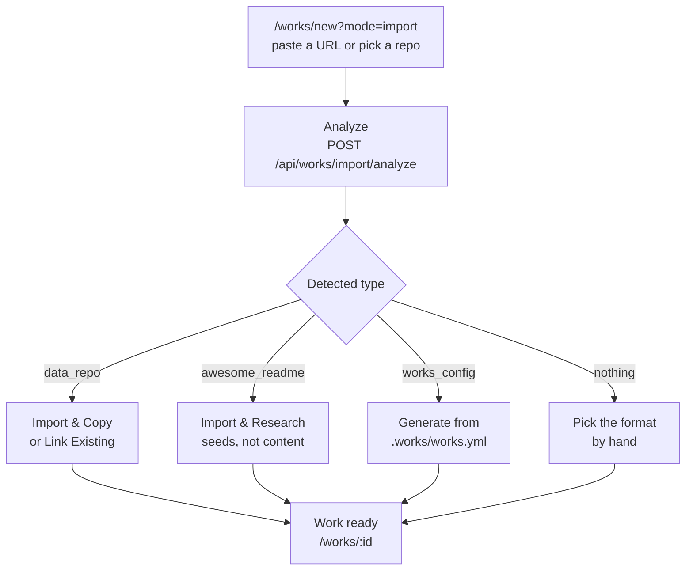

# Import an Existing Repository

Not every Work starts from an empty prompt. If the content already exists in Git — a curated awesome list, a data repository from another Ever Works instance, or a repo you simply want the platform to manage — you can bring it in instead of rebuilding it.

An import does one of two things, and the difference matters:

- **Copy.** The source is read once and written into three new repositories created under your account or organization. The source is never modified.
- **Link.** The repository you already own becomes the Work's data repository. Nothing is copied, nothing is moved, and the platform commits back into it — which is why linking requires write access.

Routes are written the way you type them, without the locale prefix — the address bar shows `/en/works/new`, this guide says `/works/new`.



## 1. Before you start

| You need                          | Why an import needs it                                                                                                           | Where it comes from                                                                                                                |
| --------------------------------- | -------------------------------------------------------------------------------------------------------------------------------- | ---------------------------------------------------------------------------------------------------------------------------------- |
| **A git provider**                | Every import call carries a `gitProvider`. Without one the form refuses with _"Please select a git provider first"_.             | The onboarding wizard's **Your Git Storage** step, or the **Git Provider** picker in the right-hand sidebar.                       |
| **A connected GitHub account**    | Required to read a **private** source, to list your repositories, and to create repos under an organization.                     | Settings → Plugins → GitHub, or the GitHub App (section 4).                                                                        |
| **Write access to the source**    | Only for **Link Existing** — the platform commits generated output back. Read-only access is not enough and the link is refused. | GitHub itself. The analyzer checks it and hides the **Link Existing** option when you do not have it.                              |
| **An AI provider and a pipeline** | Only for an **awesome list** import, which researches and rewrites every item.                                                   | Settings → Plugins. The import form offers **Agent Pipeline** and **Claude Code** only.                                            |
| **A deploy target**               | Optional. Needed when you want the imported Work to ship a site.                                                                 | The onboarding wizard's **Your deployment** step. See [Custom Domains and Deploy Targets](./custom-domains-and-deploy-targets.md). |

Sources may live on GitHub, GitLab or Bitbucket — the URL parser accepts all three, with or without a trailing `/` or `.git`. The dashboard import form is written around GitHub, and the GitHub App path in section 4 is GitHub-only.

## 2. The import screen

Open `/works/new?mode=import`. You can also land there from `/works/new`: under the prompt box, the row that starts with _"or"_ carries an **Import Existing Work** button next to **Create Work Manually**.

The form is titled **Import Work from GitHub** — _"Import items from an existing GitHub repository to create your Work"_ — and runs in three steps: **source → analysis → configure**.

### The four source types

| Source                                         | Detected as      | What the platform does                                                                    | Response                    |
| ---------------------------------------------- | ---------------- | ----------------------------------------------------------------------------------------- | --------------------------- |
| Data repository (`.works/works.yml` + `data/`) | `data_repo`      | Copies items, categories and tags verbatim into three new repositories.                   | `202 Accepted` — background |
| Awesome list `README.md`                       | `awesome_readme` | Treats the list as research seeds; the pipeline researches, rewrites and expands past it. | `202 Accepted` — background |
| A repository you already own                   | `link_existing`  | References it as the Work's data repository. No copy, no data movement.                   | `200 OK` — instant          |
| A repo carrying only `.works/works.yml`        | `works_config`   | Generates a new Work from the manifest's `initial_prompt`.                                | `202 Accepted` — background |

The first two are auto-detected from repository structure. `link_existing` is a choice you make on the **Choose Import Method** screen. `works_config` is what you get when a repo carries the manifest but has neither a `data/` directory nor an awesome-list README.

### How to: analyze a source repository

1. Open `/works/new?mode=import`.
2. Pick how to name the source. **Paste URL** — _"Enter a GitHub repository URL directly"_ — gives you a **GitHub Repository URL** field (`https://github.com/owner/repository`). **My Repositories** — _"Select from your GitHub repositories"_ — lists what your connected account can see, with a search box, an owner switch between **Personal Account** and your organizations, and paging (`GET /api/works/import/repositories`).
3. Read the **Supported Repository Formats** panel if you are unsure: **Data Repository** (_"Repositories with .works/works.yml and data/ folder structure"_) and **Awesome List** (_"Curated list repositories with markdown README"_).
4. Press **Analyze Repository**. The screen switches to **Analyzing Repository** — _"Detecting repository type and structure…"_ — while `POST /api/works/import/analyze` inspects the root of the repo.
5. The analysis result decides which screen you land on:

| Analysis result                                                        | Where you go next                                                                       |
| ---------------------------------------------------------------------- | --------------------------------------------------------------------------------------- |
| `data_repo`, or a companion data repo detected next to what you pasted | **Choose Import Method** — **Import & Copy** or **Link Existing**                       |
| `awesome_readme` or `works_config`                                     | Straight to the configure step, with the detected type shown as a badge                 |
| Nothing detected                                                       | The configure step with a manual format picker (**Awesome List** / **Data Repository**) |

The analysis also pre-fills the **Work Name** from `.works/works.yml` (or the repo slug, with a trailing `-data` / `-website` stripped), previews the item and category counts, and warns you when repositories with the target slug already exist — **Repository name conflict**, with a one-click _Use "my-dir-2" instead_.

If the analyzer finds a repo it cannot classify it says so plainly: _"We could not automatically detect the format. Please select how to import this repository."_ — or, when the repo has no recognizable structure at all, _"No supported config was found. Add .works/works.yml to the repository, or choose a manual import format below."_ That second message is the cue for section 3.

### Import and copy a data repository

Choose **Import & Copy** — _"Create new repositories with a copy of the data. Best for forking or starting fresh."_

1. Confirm or edit the **Work Name**. It becomes the slug, and the slug becomes the repository names.
2. Leave **Restore .works/works.yml settings** on (it defaults to on whenever the source carries a manifest) to apply _"AI provider, model, schedule, and related repository settings from this repository"_. Turn it off to import the data but keep your own defaults.
3. Set **Repository Owner** — **Personal Account** or one of your organizations. This is where the three new repositories are created.
4. Check the **Source Attribution** note: _"This Work will reference &lt;url&gt; as its source"_.
5. Press **Import Work**.

The API answers `202 Accepted` with a `workId` and a `historyId`, and the clone-and-copy runs in the background (dispatched to Trigger.dev, with an in-process fallback). You are redirected to `/works/:id`, where the generation status moves from _generating_ to _generated_.

What lands: every item under `data/`, the categories from `categories.yml`, the tags from `tags.yml`, and the config from `.works/works.yml` — written into a **new** data repository, plus a fresh markdown repository and website repository. The source repo is untouched.

### Import and research an awesome list

An awesome-list import is not a copy. The banner says so: **Import & Research Mode** — _"Items from the source repository will be used as research seeds. The AI pipeline will discover new items, rewrite descriptions, and expand the taxonomy."_ Each source link is visited and researched independently; descriptions are written fresh rather than lifted.

1. Confirm the **Work Name**.
2. Choose the **GitHub repository** shape:
    - **Clone / recreate** — _"Create a new generated README repository for this Work. Data and Work repositories are still created."_
    - **Reuse source README** — _"Do not create a generated README repository. GitHub repository links will point to the source README repository."_
3. Set the **Expansion target**: `1.5x`, `2x`, `2.5x (recommended)`, `3x` or `5x`. The line underneath does the arithmetic for you — _"~120 seed items → target ~300 final items (~180 new items to discover)"_.
4. Decide on **Keep synchronized** — _"Automatically pull updates from the source repository."_ The switch starts **off**; turn it on to have the platform create a **weekly** schedule that re-runs the import. That sync always opens a pull request rather than committing directly, so you review before merging. (Callers hitting `POST /api/works/import` directly get the opposite default: omit `sync` and the weekly schedule is created; send `"sync": false` to skip it.)
5. Pick the plugins in the provider block. The pipeline dropdown is deliberately narrow here — only **Agent Pipeline** and **Claude Code** run imports. An unconfigured plugin blocks submission with _"{provider} is not configured. Visit Settings → Plugins to set it up before importing."_
6. Press **Start Import & Research**. The button becomes _"Starting research pipeline…"_ and the run continues in the background.

A full awesome-list walkthrough — including community pull requests and source validation afterwards — lives in [Quickstart: Build an Awesome List](./quickstart-awesome-repo.md).

### Link a repository you already own

Choose **Link Existing** — _"Use your existing repository directly. No copying, changes sync automatically."_ The option only appears when the analyzer confirmed you have write access to the data repo.

1. Selecting it runs `POST /api/works/import/analyze-for-linking`, which verifies the repo exists, verifies write access, and reads the `data/` listing and `categories.yml` through the git provider's contents API to preview item and category counts. Nothing is cloned or copied.
2. The **Link Repository** dialog lists the three roles it looked for — **Data Repository**, **Markdown Repository**, **Work Repository** — each marked **Found** or **Not found**. When everything is present it says _"All repositories found. Ready to link."_; otherwise _"Some repositories were not found. You can continue without them or create them now."_
3. Press **Create missing** to have the platform create the absent markdown and website repositories, or **Continue without** to link only what exists. The **data repository is never created** here — it must already exist, which is the whole point.
4. The call returns `200 OK` immediately. There is no background task: the Work is marked generated on the spot, with a generation-history entry of zero seconds.

Two consequences worth knowing:

- The Work's **owner is the source repository's owner**, not your default git account — link `acme-org/awesome-tools-data` and companion repos are created under `acme-org`.
- No sync schedule is created for a linked Work. Ongoing updates come from [Scheduled Updates](../features/scheduled-updates.md), from a manual generation run, or from data-repo instant sync (section 5).

If the site for this repository is already live somewhere, you can register that address without deploying anything: `PUT /api/works/:id/existing-website` records an existing root HTTPS URL against the Work's website and custom-domain records. It never deploys, never touches DNS, and never contacts a deployment provider.

## 3. Onboard a repo by adding `.works/works.yml`

The fastest way to make any repository importable is to add the manifest. A file with a name and a prompt is enough:

```yaml
# yaml-language-server: $schema=https://api.ever.works/api/schema/works.yml.schema.json
kind: directory
name: Awesome Chairs
initial_prompt: A curated directory of ergonomic office chairs, with pricing and build quality
model: anthropic/claude-sonnet-4
providers:
    ai: openai
    search: tavily
schedule: weekly
```

Commit it at the repository root as `.works/works.yml`, then run the import again. The analyzer now classifies the repo as `works_config` — the configure step shows the label **Works config repository** and the badge `.works/works.yml` — and the import generates the Work from `initial_prompt` instead of copying anything.

`initial_prompt` is the one field this path cannot do without: an import of a manifest that omits it fails with _".works/works.yml is missing initial_prompt"_ (`PARSE_FAILED`).

### The published JSON Schema

The platform serves the schema publicly so your editor can complete and validate the file as you type it:

```
GET https://api.ever.works/api/schema/works.yml.schema.json
```

It needs no authentication, is cached for five minutes, and is generated from the same definition the server validates against — so the two cannot drift. Point at it with the `yaml-language-server` comment shown above.

The full field reference is in [`.works/works.yml` Configuration](../features/works-config.md), and the per-kind `spec` blocks are in [works.yml schema](../agent-services/works-yml-schema.md). Two behaviours are worth repeating here:

- **Unknown keys are preserved.** The platform round-trips this file back into your repo after every successful generation and only rewrites the fields it owns.
- **The manifest pre-fills the import.** Name, prompt, model, providers and schedule are read out of it and shown in the analysis preview before you commit to anything.

## 4. GitHub App installations and the Repositories registry

The Ever Works GitHub App is the other way in. An installation gives the platform a scoped, per-repository token — no personal access token, and no OAuth scope covering your whole account.

### How to: onboard a data repo from an installation

1. Go to `/settings/github-app` — **GitHub App Installations**.
2. If the page is empty it tells you what to do: _"Install the Ever Works GitHub App on a repository or organization, then complete the setup redirect to have the installation linked to this workspace."_
3. Each installation card shows its account, an **Active** or **Suspended** badge, and a meta line — _"Installation #12345678 · Organization account · Organization target"_ — plus repository count, last sync time and app slug.
4. Press **Sync** to refresh the repository snapshot from GitHub (`POST /api/github-app/installations/:installationId/sync`). Do this after granting the App access to new repositories.
5. Find the repository in the list and press **Onboard**. The platform analyzes it using an installation access token and, on success, redirects you to the new Work.

What **Onboard** actually does: it analyzes the repository, then links it — the same `link_existing` path as section 2, with `createMissingRepos` off and no sync schedule. The Work name comes from `.works/works.yml` when present, otherwise from the repository name.

Its one restriction is explicit in the error it returns: _"Only existing data repositories can be onboarded from GitHub App installations right now."_ A repository that is not a data repo has to go through `/works/new?mode=import`. Suspended or deleted installations are refused outright.

### Repositories that are not Works

Not every repository you want an Agent to touch is a Work. **Settings → Repositories** (`/settings/repositories`) is an account-level registry for the rest: the API service an Agent reads, the design-system repo it copies tokens from, the private tooling repo it runs a script out of.

A repository visible to a GitHub App installation can be imported into that registry in one click:

```http
POST /api/repo-connections/import/github-app/:installationRepoId
```

Registry rows carry a mount directory, a credential pointer and up to eight encrypted `.env` files, and can be attached to individual Agents. Repositories derived from your Works appear there too, read-only, so the page answers "which repositories does my account touch at all?" in one place. Full reference: [Repositories Registry](../features/repositories.md).

## 5. Data-repo instant sync (flag-gated)

:::caution Off by default

Instant sync ships behind two environment flags that both default to **false**: `DATA_SYNC_WEBHOOK_ENABLED` and `DATA_SYNC_DISPATCHER_ENABLED`. Unless your operator has turned them on, a push to your data repository will **not** render on its own. Use the manual endpoint below, a [scheduled update](../features/scheduled-updates.md), or a generation run instead.

:::

When both flags are on, a linked data repository can render into the Work's markdown repository shortly after you push to it. Two paths feed the same dispatcher:

- **Webhook flush.** The GitHub App's `push` handler resolves the repository full name to the Works that declare it as their data repo and marks each one pending. Several commits inside the quiet period collapse into a single flush.
- **Poller fallback.** Works without the App installed are picked up on a cadence instead, so the feature does not require the App.

Every run takes a per-Work lock and passes three gates in order: a retry-backoff gate (short-circuits after a recent failure), a pipeline gate (defers while a full generation run is mid-flight), and the render gate that actually syncs and writes a success row into the activity feed.

| Environment variable              | Default | What it controls                                                      |
| --------------------------------- | ------- | --------------------------------------------------------------------- |
| `DATA_SYNC_WEBHOOK_ENABLED`       | `false` | Whether the GitHub App `push` handler marks Works as pending.         |
| `DATA_SYNC_DISPATCHER_ENABLED`    | `false` | Whether the dispatcher fans out due Works on each tick.               |
| `DATA_SYNC_DEBOUNCE_MS`           | `30000` | Quiet period after a push before the flush runs.                      |
| `DATA_SYNC_LOCK_TTL_SECONDS`      | `300`   | Lifetime of the per-Work sync lock.                                   |
| `DATA_SYNC_RETRY_BACKOFF_SECONDS` | `300`   | How long a failed Work is held back before the dispatcher retries it. |

### Force a sync run

```http
POST /api/works/:id/sync
```

The manual escape valve. It bypasses the dispatcher cadence and returns `202` with the same three-gate outcome the dispatcher would have produced:

| Response                                         | Meaning                                                                            |
| ------------------------------------------------ | ---------------------------------------------------------------------------------- |
| `{ "status": "enqueued", "outcome": "success" }` | The run started and the render completed.                                          |
| `{ "status": "skipped", "reason": … }`           | A gate declined: `retry-backoff`, `sync-in-progress`, or `generation-in-progress`. |
| `{ "status": "failed", "errorClass": … }`        | The run failed; the class tells you whether retrying is worthwhile.                |

Editor role or higher on the Work is required — an unknown Work returns `404`, a Work you cannot edit returns `403`.

## 6. Register a repository from the CLI, MCP, or one API call

If the repository already carries `.works/works.yml`, you do not need the dashboard at all. One call creates the account if it does not exist, links it to your GitHub identity, parses the manifest, and queues the Work.

### CLI

```bash
ever-works work register --repo https://github.com/octocat/awesome-mcp
```

The command reads `$GITHUB_TOKEN` when `--github-token` is not passed, prints the onboarding id, work id, status, subdomain and status URL, and exits non-zero on rejection.

| Option                    | Notes                                                                                                                                     |
| ------------------------- | ----------------------------------------------------------------------------------------------------------------------------------------- |
| `--repo <url>`            | Required. HTTPS GitHub URL with `.works/works.yml` at the root.                                                                           |
| `--github-token <token>`  | Fine-grained PAT, classic PAT, or GitHub App installation token. Defaults to `$GITHUB_TOKEN`.                                             |
| `--email <email>`         | Optional contact email.                                                                                                                   |
| `--agent-id <id>`         | Optional opaque agent identifier (printable ASCII, ≤ 256 chars).                                                                          |
| `--webhook-url <url>`     | HTTPS URL for signed terminal-status webhooks. Rejected if it is not `https://`.                                                          |
| `--subdomain <slug>`      | DNS-safe slug for the assigned subdomain.                                                                                                 |
| `--idempotency-key <key>` | Sent as `Idempotency-Key` so a retry cannot double-register.                                                                              |
| `--api-url <url>`         | Defaults to `$EVER_WORKS_API_URL` or `https://api.ever.works`. The CLI refuses to send your token over plain HTTP to a non-loopback host. |

### MCP

The same capability is exposed as the `register_work` tool on the Ever Works MCP server, with the identical parameters. See [Use Ever Works from an MCP Client](./mcp-server-setup.md).

### REST

```http
POST /api/register-work
X-GitHub-Token: <token>
Content-Type: application/json

{ "repo": "https://github.com/octocat/awesome-mcp", "subdomain": "awesome-mcp" }
```

`202 Accepted` comes back with `onboardingId`, `workId`, `status`, `statusUrl` and the assigned `subdomain`. Poll `GET /api/register-work/:id` with the **same** `X-GitHub-Token` to follow it. Agents can discover the whole capability without reading docs first: `GET /.well-known/agent.json` returns an agent card naming the REST endpoint, the MCP tool and a `manifestSchema` link to the [works.yml schema](../agent-services/works-yml-schema.md) documentation page — the docs page, not the JSON Schema endpoint in section 3.

Two operational notes: registration is rate-limited to 10 requests per minute per IP, and an operator can disable the public surface with `FEATURE_ZERO_FRICTION_ONBOARDING=false` (default on), in which case the endpoint answers `404` with `code: "feature_disabled"`. The full contract is in [Zero-Friction Onboarding](../agent-services/zero-friction-onboarding.md).

## 7. After the import — sync, generate, deploy

| Step                    | Where                           | What it does                                                                                                                                                         |
| ----------------------- | ------------------------------- | -------------------------------------------------------------------------------------------------------------------------------------------------------------------- |
| **Watch it land**       | `/works/:id`                    | Opening the Work refreshes it from the data repository automatically, and again whenever a generation run finishes.                                                  |
| **Sync on demand**      | `POST /api/works/:id/sync-data` | Re-reads item counts, pending pull-request data and markdown header/footer templates from the data repo. Also available in the dashboard chat as _"sync this work"_. |
| **Review the content**  | `/works/:id/items`              | Items, categories, tags and collections as they arrived.                                                                                                             |
| **Generate or extend**  | `/works/:id/generator`          | Run the pipeline over the imported Work — useful after a copy import to enrich thin descriptions.                                                                    |
| **Deploy**              | `/works/:id/deploy`             | Ship the website repository. See [Custom Domains and Deploy Targets](./custom-domains-and-deploy-targets.md).                                                        |
| **Keep it fresh**       | `/works/:id/generator/schedule` | Set or change the cadence. Awesome-list imports that opted into sync already have a weekly, pull-request-only schedule here.                                         |
| **Check what happened** | `/works/:id/activity`           | Import start, sync outcomes and generation runs are all recorded.                                                                                                    |

## Troubleshooting

| What you see                                                                         | What it means                                                               | What to do                                                                          |
| ------------------------------------------------------------------------------------ | --------------------------------------------------------------------------- | ----------------------------------------------------------------------------------- |
| `INVALID_URL`                                                                        | The URL did not parse as a git repository URL.                              | Use the full `https://github.com/owner/repo` form.                                  |
| `REPO_NOT_FOUND` — _"It may be private — please connect your git provider account."_ | The repo does not exist, or the platform cannot see it.                     | Connect GitHub in Settings → Plugins, or install the GitHub App on that repository. |
| `REPO_ACCESS_DENIED`                                                                 | The credential cannot read the repository.                                  | Grant the account or installation access, then press **Sync** and retry.            |
| `UNSUPPORTED_FORMAT` / _"No supported config was found…"_                            | Nothing about the repo matches a supported shape.                           | Add `.works/works.yml` (section 3), or pick a format by hand in the configure step. |
| `PARSE_FAILED` — _".works/works.yml is missing initial_prompt"_                      | The manifest exists but carries no prompt to generate from.                 | Add `initial_prompt` and re-run the import.                                         |
| **Link Existing** is missing on **Choose Import Method**                             | The analyzer found no write access to the data repo.                        | Get write permission on the repository, or use **Import & Copy** instead.           |
| **Repository name conflict**                                                         | Repositories with the target slug already exist on the destination account. | Accept the suggested slug, or rename the Work.                                      |
| _"{provider} is not configured. Visit Settings → Plugins…"_                          | An awesome-list import selected a plugin with no credentials.               | Configure it under Settings → Plugins, or pick a configured one.                    |
| _"Only existing data repositories can be onboarded from GitHub App installations…"_  | The **Onboard** button only accepts `data_repo` repositories.               | Import it from `/works/new?mode=import` instead.                                    |
| A push to the data repo changes nothing                                              | Instant sync is flag-gated and off by default.                              | Call `POST /api/works/:id/sync`, or ask your operator about the flags in section 5. |

## Related

- [Work Import](../features/work-import.md) — the full import reference: lifecycle phases, detection heuristics and API payloads
- [`.works/works.yml` Configuration](../features/works-config.md) — every field the manifest accepts
- [works.yml schema](../agent-services/works-yml-schema.md) — the envelope, versioning and per-kind `spec`
- [Repositories Registry](../features/repositories.md) — repositories that are not Works, and the GitHub App one-click import
- [Git Operations](../features/git-operations.md) — the three-repository model an import creates or links
- [Scheduled Updates](../features/scheduled-updates.md) — cadences, pull-request mode and failure handling
- [Quickstart: Build an Awesome List](./quickstart-awesome-repo.md) — the end-to-end awesome-list path
- [Custom Domains and Deploy Targets](./custom-domains-and-deploy-targets.md) — shipping the imported Work
- [CLI Work Commands](../cli/work-commands.md) — the rest of the `work` command group
- [Use Ever Works from an MCP Client](./mcp-server-setup.md) — running `register_work` from an MCP client
- [Zero-Friction Onboarding](../agent-services/zero-friction-onboarding.md) — the `POST /api/register-work` contract
- [Import System](../agent-services/import-system.md) — internals of the import module
- [Data Management](../features/data-management.md) — exporting and importing whole accounts, and GitHub config sync
