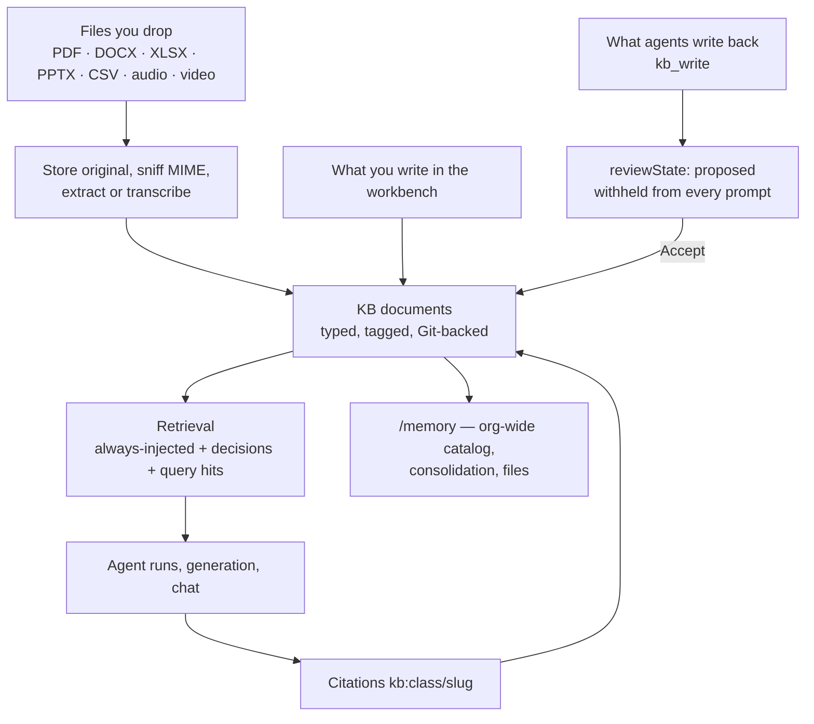

# Knowledge Base and Memory

An agent that starts every run from a blank prompt will rewrite your brand voice every Tuesday. The fix is not a longer prompt — it is a place to put what your business already knows, in a shape the runtime reads on its own, that you own and can audit afterwards.

Ever Works ships that place in four layers: a **Knowledge Base** per [Work](../features/creating-a-work.md), the **originals** those documents were extracted from, an organization-wide **Memory** that fans every Work's KB into one searchable catalog, and the **Agent definition files** that carry an agent's identity across every run it will ever do. This guide walks the whole loop — seed it, write it, review what the agents added, ask it questions, and keep it clean.

Routes are written the way you type them, without the locale prefix — the address bar shows `/en/works`, this guide says `/works`.



## The four places knowledge lives

| Layer                                               | What it holds                                                                     | Where                              |
| --------------------------------------------------- | --------------------------------------------------------------------------------- | ---------------------------------- |
| **[Knowledge Base](../features/knowledge-base.md)** | Typed Markdown documents an agent reads — brand, legal, style, glossary, research | `/works/:id/kb`                    |
| **Originals**                                       | The verbatim files those documents were extracted from, with extraction status    | `/works/:id/kb`, **Originals** tab |
| **[Memory](../features/memory.md)**                 | Every Work's KB plus organization-level documents, files, meetings, consolidation | `/memory`                          |
| **[Agent definition files](../features/agents.md)** | Who an agent is and how it operates — five files per Agent                        | `/agents/:id/instructions`         |

The first three are the same rows seen at different zoom levels: Memory adds no second copy of your knowledge. The fourth is a different thing entirely — instructions rather than reference material — and it is the one people forget exists.

## 1. Seed a Work's Knowledge Base

### Pick classes before you upload anything

Every KB document has a **class**, and the class is not decoration: it decides whether a document is injected into every run or only retrieved when relevant, and how the model is told to treat it.

| Class         | How agents treat it                                             | Injected into every run? |
| ------------- | --------------------------------------------------------------- | ------------------------ |
| `brand`       | Soft guidance — "write in this voice"                           | Yes                      |
| `legal`       | Verbatim or omitted — copied exactly, never paraphrased         | Yes                      |
| `style`       | Editorial constraints — grammar, banned words, tense, voice     | Yes                      |
| `glossary`    | Term substitution — always these terms, never invented synonyms | Yes                      |
| `seo`         | Target keywords and structured-data patterns per page type      | On relevance             |
| `personas`    | Audience definitions — who the writing is for                   | On relevance             |
| `competitors` | Inclusion / exclusion rules, and the do-not-mention list        | On relevance             |
| `research`    | Background material, including machine transcripts              | On relevance             |
| `decision`    | A settled call, with its own status lifecycle                   | Accepted ones, always    |
| `output`      | Agent-authored artifacts — reports, summaries, drafts           | On relevance             |
| `freeform`    | Catch-all notes                                                 | On relevance             |

The four always-injected classes are `brand`, `legal`, `style` and `glossary`. Everything else reaches a run only when the query pulls it in, or — for `decision` — when it is accepted. A good first pass is one document in each of the four, however short: an agent with a two-paragraph brand voice behaves very differently from one with none.

:::tip Start smaller than you think

A 200-page PDF of everything is worse context than four tight documents. The always-injected block has a hard character budget (16 000 by default) and truncates the last document with a `[…truncated]` marker when it overflows — so padding `brand` with filler evicts real guidance from the prompt.

:::

### How to: upload your first sources

1. Open the Work and go to **`/works/:id/kb`**. The left pane is the tree, grouped by class; the tabs above it are **KB**, **Originals** and **Agent memory**.
2. Drag one or more files from your desktop onto the tree. Drop them **on top of a class group** — the group you land on becomes the suggested class. Dropping on empty space falls back to `freeform`.
3. The classification modal opens. Confirm or change the class, add tags (Enter or comma commits each one), write a one-line description, and decide about **auto-classify**: with it ticked the server picks the class from the extracted text and your choice becomes the fallback.
4. Confirm. Progress toasts track each file; the tree refetches as documents land.
5. Switch to the **Originals** tab to see the file rows themselves and their extraction state.

The same upload over the API and the CLI:

```bash
curl -X POST http://localhost:3100/api/works/$WORK_ID/kb/uploads \
  -H "Authorization: Bearer $TOKEN" \
  -F "file=@./brand-guide.pdf" \
  -F "targetClass=brand" \
  -F "autoClassify=true"

ever works kb upload $WORK_ID ./brand-guide.pdf --class brand --title "Brand guide v3"
```

Uploads are capped at `KB_UPLOAD_MAX_BYTES`, 200 MB by default. The server computes a SHA-256 and deduplicates against originals already in the Work, so re-uploading the same bytes does not create a second row.

### What the platform can read out of the box

Extraction runs on the bytes already in memory after the upload — there is no second fetch — and routes by the MIME type sniffed from the file's magic bytes, never the one the browser claimed.

| You upload                 | What lands in the KB                                                   |
| -------------------------- | ---------------------------------------------------------------------- |
| `.md`, `.txt`              | The text itself, passed through                                        |
| `.html`                    | Markdown, converted with the same rules the web-fetch path uses        |
| `.pdf`                     | The text layer, wrapped as a Markdown body                             |
| `.docx`                    | Markdown, via a Word OOXML converter                                   |
| `.xlsx`, `.xlsm`           | One Markdown table per sheet, each under an `##` heading with its name |
| `.csv`, `.tsv`             | A single Markdown table                                                |
| `.pptx`                    | One `## Slide N` section per slide, from the slide text runs           |
| Audio, or video with audio | A transcript, filed as a `research` document                           |
| Anything else              | Stored verbatim, marked **skipped** with "no extractor route"          |

Two caps keep a monster file from blowing past the 1 MiB body limit: 10 000 rows per spreadsheet or CSV, and 1 000 slides per deck. Legacy binary formats — `.doc`, `.xls`, `.ppt` — are deliberately not routed, because the libraries behind those routes produce garbage rather than failing. Convert them and re-upload.

### Scanned PDFs, Office files, audio and video

Three of those routes have a plugin behind them, and two are off until you turn them on.

| Need                                | Plugin / capability                         | State                                                                                  |
| ----------------------------------- | ------------------------------------------- | -------------------------------------------------------------------------------------- |
| OCR for scanned, image-only PDFs    | **PDF Content Extractor** (`pdf-extractor`) | Built in, **not auto-enabled**. Text PDFs need no key; OCR needs a Mistral AI API key. |
| Office extraction through OfficeCLI | **OfficeCLI Content Extractor**             | Built in, **optional and off by default**. Enable only if you want it.                 |
| Speech to text                      | Any AI plugin advertising `transcribe`      | Resolved automatically; pin one with `KB_TRANSCRIPTION_PROVIDER_ID`.                   |

Enable either extractor from **`/settings/plugins`**. The PDF extractor decides on its own whether a document needs OCR by measuring text density per page (default threshold: 100 characters), so a mixed pile of born-digital and scanned PDFs does the right thing per file.

For media, the pipeline is: store the original, normalize to MP3 (extracting the audio track from a video), call the transcription capability, and materialize the transcript as a KB document — class `research` by default, changeable with `KB_TRANSCRIPTION_TARGET_CLASS`. Add `KB_TRANSCRIPTION_LANGUAGE` if you would rather hint the language than have it detected. The step is idempotent: a re-run finds the existing transcript by its source upload id instead of writing a second one. When no provider can transcribe, the upload is marked **Extraction failed** with a transcription-not-configured reason on the row rather than silently doing nothing.

### How to: rescue an upload that produced nothing

"Uploaded" and "usable by an agent" are different states, and the Originals tab is where you can tell them apart.

1. Open **`/works/:id/kb`** → **Originals**.
2. Look at the status on each row: **Pending**, **Extracting…**, **Extracted**, **No text extracted**, or **Extraction failed** — failures carry the reason.
3. Fix the cause. "No extractor route" usually means an unrouted MIME type (enable the OfficeCLI extractor, or convert the file); a failed scanned PDF usually means the Mistral key for OCR is missing.
4. Press **Retry** on the row. The button appears on **Extraction failed** rows; retry re-reads the stored bytes and runs extraction again, so it never needs a re-upload. Over REST that is `POST /api/works/:id/kb/uploads/:uploadId/retry-extraction`, and it takes manager or owner role.
5. **No text extracted** rows — where "no extractor route" lands — carry no Retry button in the workbench today. The REST endpoint does accept them, so enable the extractor that file needs and call `POST /api/works/:id/kb/uploads/:uploadId/retry-extraction` directly, or convert the file to a routed format and upload it again.
6. A row that already produced a document returns `409` on retry. That is not an error to work around: the content is already in the KB.

### Web pages and Notion pages

There is no "paste a URL into the KB" box today. URLs are handled on the agent side, by the **content-extractor** plugin family — `local-content-extractor` for ordinary pages, `notion-extractor` for Notion, `pdf-extractor` for a PDF behind a link. An agent with `canCallExternalTools` calls `extractContent` on a URL, gets Markdown back, and writes it into the KB with `kb_write`; the same facade feeds Work generation, comparisons and research runs. So the practical route for a web page is: ask an agent (or the chat rail) to read it and file it, then review the result in the queue described below.

## 2. Write, link and lock

### The editor

Opening a document at **`/works/:id/kb/<class>/<slug>.md`** gives you the three-pane workbench: tree on the left, editor in the middle, metadata on the right.

The editor is WYSIWYG over a Markdown round-trip — what is persisted stays Markdown, so the Git diff stays readable. It autosaves 800 ms after your last keystroke and shows a "Saved" pill. Two banners matter: a **conflict** banner when someone else changed the document underneath you (reload, then re-apply), and a **locked** banner when the document is locked `full` and the save was refused.

### How to: link one document to another

1. In the body, type `[[` followed by part of a title. A popover lists matching documents in this Work.
2. Press Enter or click. The editor inserts a normal inline link pointing at `/works/:id/kb/<path>` — the closing `]]` is intentionally never inserted, because the saved Markdown is a real link, not wiki syntax.
3. Type `@` instead to mention something. That popover lists both **documents** and **Agents**, and inserts a coloured chip rather than plain text.
4. To hand a document to a model in conversation, write `@kb:brand/voice` in your message. That is the mention format the platform parses, resolves and injects — and it is the same `kb:class/slug` shape the model uses when it cites something back at you, so a citation you paste into a new question round-trips.
5. Right-click a tree row for **Copy path** and **Copy wikilink** when you want the reference without hunting for it.

:::note Moving a document

Treat a document's path as fixed once other documents point at it. The **Rename** item in the tree's right-click menu sends a path change that the document-update endpoint does not accept today, and the rewriter that would repoint inbound `[[oldPath]]` references ships but is not wired to a rename. To move something, create it at the new path, copy the body across, and archive the old one — then fix the references deliberately. Links inserted by the `[[` picker are ordinary Markdown links and behave like any other link.

:::

### Metadata, classes and tags

The right-hand panel saves each field on its own as you change it: class chips, tags (400 ms debounce), description and language (800 ms), status (`draft` / `active` / `archived`), the lock toggle and mode, plus a read-only **Source** badge — `user`, `agent`, `imported` or `seeded` — that tells you at a glance who wrote what.

### How to: create a document without uploading a file

The workbench has no "+ New document" button today. Three paths do work, and all three land in the same place:

1. **From the chat rail**, on any page of that Work: _"create a KB document at `glossary/terms` in the glossary class titled Approved terminology"_ — the rail calls `create_kb_document`. Say the word "knowledge" or "document" in your message so the KB tools are gated into that turn.
2. **From an external session over MCP**: `kb.create` with `workId`, `path`, `title`, `class` and a Markdown `body`.
3. **Over REST**: `POST /api/works/:id/kb/documents` with the same four required fields.

The fourth way is the one you have already used: uploading a file, which creates the document as a side effect of extraction. A plain `.md` file is passed through verbatim, so "write it in your editor and drop it in" is a perfectly good authoring loop.

Every one of them writes `.content/kb/<class>/<slug>.md` plus its `.yml` sidecar into the Work's Git data repository and indexes the body for retrieval, so a document created from a script is indistinguishable from one typed in the browser.

### Locks

A lock is what stops a scheduled regeneration from quietly rewriting your lawyer's paragraph.

| Mode             | Effect                                                           | Use it for                                                |
| ---------------- | ---------------------------------------------------------------- | --------------------------------------------------------- |
| `full`           | Every agent edit is refused. Humans still edit in the workbench. | Legal copy, approved brand statements                     |
| `additions-only` | Agents may append; existing body and metadata are frozen.        | Research dossiers you want to keep growing, not rewritten |

Locking takes **manager or owner** role on the Work. A `full` lock also disables Rename, Duplicate and Delete in the context menu, and an agent's write comes back as a refusal rather than a silent no-op.

### How to: lock the legal copy

1. Open the document at `/works/:id/kb/legal/<slug>.md`.
2. In the metadata panel, switch the lock toggle on and choose **full**.
3. Confirm it took: the tree row shows a padlock, and the metadata panel reports the mode.
4. From a script, the same move is `POST /api/works/:id/kb/documents/:docId/lock` with `{ "mode": "full" }`, or the `kb.lock` MCP tool with `lockMode: "additions-only"` when you want the softer one.

### Git history and restore

Every KB mutation is a commit in the Work's data repository. In the metadata panel, **View Git history** lists the commits that touched this document's body, newest first (up to 50). Each row has a **Restore** button: restoring reads the body at that commit, writes it back onto the live document and mirrors a fresh commit — so the history moves forward instead of being rewritten. The API pair is `GET …/documents/:docId/history?limit=` and `POST …/documents/:docId/restore` with `{ "commitSha": "…" }`.

## 3. Review what the agents wrote

### Proposed, not published

Anything created with source `agent` is born **`reviewState: proposed`**, and proposed documents are excluded from context injection on every retrieval path. That is the circuit breaker that stops an agent from teaching itself its own guesses: a claim an agent invented on Monday cannot become the ground truth it reads on Tuesday unless a human said yes in between.

Documents with no review state — everything a person writes, and everything written before the feature existed — count as accepted and keep feeding context exactly as before.

### Decisions

A `decision`-class document records a call: what was decided, why, and whether it still holds. Decisions carry their own status, separate from the document's publish status.

```
proposed  →  accepted  →  superseded  →  archived
```

`archived` is reachable from any non-terminal state, and an illegal move is refused with `409`. Superseding with a `supersededByDocId` records the replacement on both documents, so a reader always lands on the decision currently in force. Accepted decisions are injected into every run in their own labelled section, ahead of general notes; a superseded or archived one that a query drags back is labelled _historical — replaced by_ so the archive is never served as current truth.

### How to: clear a Work's review queue

1. In the workbench tree header, click **Review** — the badge next to it is the count of proposed documents, and it is the quickest place to see that count. The route is **`/works/:id/kb/review`**.
2. Expand a row's chevron to read the body. Rows show the class, the source and when it was created; the preview is fetched lazily, one document at a time.
3. Pick an action per row:
    - **Accept** — the document starts feeding agent context immediately. A `decision` still in `proposed` is accepted as current in the same call.
    - **Edit & accept** — opens the document in the normal editor. A banner at the top of that page carries the Accept button, so you fix the wording first and accept in place.
    - **Supersede** — decision documents only. Pick the survivor from the candidate list; the losing decision keeps its history and points readers at the replacement.
    - **Archive** — kept readable, dropped from listings and from every prompt. Never a physical delete.
4. Rows leave the queue as you resolve them. A failed action names what failed and leaves the row where it is, so a refusal never reads as success.

The organization-level equivalent — proposals from consolidation, and org-scoped documents — is the **Awaiting review** panel on `/memory`, with Accept and Reject.

### Memory health, right above the queue

The same page renders the memory health panel, and it is the reason the queue feels worth clearing:

| Metric              | The question it answers                                                              |
| ------------------- | ------------------------------------------------------------------------------------ |
| **Recall hit rate** | Were the documents we injected actually cited afterwards?                            |
| **Stale decisions** | How many settled calls has nobody revisited inside the freshness horizon?            |
| **Review backlog**  | How much agent-written memory is waiting — and therefore excluded from every prompt? |
| **Gap topics**      | Which questions did retrieval fail to answer at all?                                 |

Every rate is nullable and renders as **"Not measurable yet"** when it cannot be computed — never as `0%`, because "we measured zero" and "we cannot measure" are different facts.

## 4. Ask, and check the citations

### What actually reaches the prompt

Retrieval assembles one `<kb>…</kb>` block, in a fixed priority order, and it is worth knowing because it explains most "why did it ignore my document" questions:

1. **Always-injected** — every active `brand`, `legal`, `style` and `glossary` document, regardless of the question. Per-Work overrides live on the Work's KB retrieval config.
2. **Accepted decisions** — grouped into their own labelled section with a status prefix on each heading.
3. **Query-retrieved** — the top hits for the actual question, ranked by Reciprocal Rank Fusion over a lexical search and a pgvector similarity search, so a lexical miss and a semantic miss have to happen together for a document to be dropped.

Superseded, archived and `proposed` documents are excluded from steps 1 and 2 by construction. Each document is rendered as `## {title} (kb:{class}/{slug})` followed by its body, and the whole block is capped — over the cap, the **last** document's body is trimmed with `[…truncated]` and earlier ones are kept whole.

### How to: put specific documents in front of a model

There are three paths, and they are not the same mechanism — knowing which one you are on saves a lot of guessing.

1. **An agent run or a generation needs nothing from you.** The bundle above is resolved automatically from the Work, using the run's own prompt as the query.
2. **From a script, pin documents by name.** `POST /api/v1/chat/completions` with an `x-work-id` header is the OpenAI-compatible surface, and it is the one that parses `@kb:` mentions: write _"Rewrite this intro. Follow `@kb:brand/voice` and `@kb:style/house-style`."_ and each resolved mention is injected as a `<kb>` block ahead of your message, with an instruction to cite what it used as `kb:{class}/{slug}`. A mention that resolves to nothing — wrong path, no access — is dropped silently and the answer proceeds without it.
3. **In the dashboard chat rail, ask by name.** _"Read the KB document at `brand/voice`, then rewrite this intro in that voice."_ The rail reaches the KB through its own tools — `list_kb_documents`, `create_kb_document`, `update_kb_document`, `delete_kb_document`, `list_kb_tags`, `create_kb_tag` — so say "knowledge" or "document" in the message to make sure that tool domain is gated into the turn.

Whichever path produced it, an assistant answer containing `kb:{class}/{slug}` tokens renders a **Cited:** footer when you are on a Work page. Each document appears once as a chip: hover to preview it, click to open it in the workbench.

### How to: find out why a document keeps showing up

1. Open a **`decision`** document in the workbench. **Ask why** is deliberately scoped to the decision class — that is where "is this still what we retrieve?" is the question people actually ask.
2. In the metadata panel, expand **Ask why**.
3. Read the retrieval trail: which questions retrieved this document, when, how many documents came back alongside it, and how many citations exist against it.

Documents in the other ten classes have no **Ask why** control in the panel today, but the same trail is one request away for any document: `GET /api/works/:id/kb/documents/:docId/retrieval-trail`, with optional `windowDays` (default 90, clamped to 1–365) and `limit` (default 20, clamped to 1–100).

There is no model anywhere in that path — it is a read of an append-only log. An explanation that can hallucinate is worse than none, because it is the one surface a reader trusts unconditionally.

### Searching inside the workbench

Press **Cmd+K** (Ctrl+K) anywhere in the workbench for a palette scoped to this Work's KB. It searches title, description and body, and narrows server-side with chips for class, tags, status, locked state and language — so results cover the whole KB, not just the page already loaded. The facet bar above the tree does the same job for class and source while you browse.

## 5. Organization memory

Everything above is one Work. **`/memory`** is the layer above: every Work's KB in the active Organization, plus the documents that belong to the Organization itself, in one faceted list — with files, meetings, agent memory, the org review queue and the consolidation pass. It is documented end to end in [Memory (Org-Wide)](../features/memory.md); two things are worth doing early.

One habit is free: files you attach to a chat message are ingested into org-wide Memory in the background, reading the bytes back from the storage spine that already holds them. Dropping a deck into a conversation therefore keeps it after the conversation scrolls away.

### How to: turn on scheduled consolidation

An append-only memory silts up: the same fact arrives four times and nobody can tell which copy is in force. Consolidation promotes the strongest documents, marks near-duplicates as superseded (never deleting them), and — with an AI provider configured — merges clusters of three or more into one document that lands in the review queue.

1. **Sidebar → Memory**, and press **Consolidate** in the header for a one-off. The first pass is always a dry run: read the report, then press **Apply** to persist the markers or **Cancel** to walk away.
2. Scroll to **Scheduled consolidation** at the bottom of the page.
3. Turn **Run on a schedule** on and pick a cadence — Day, Week or Month. Weekly is the default.
4. Choose the mode. **Report only** (`dry-run`) computes and writes nothing. **Propose merges** (`propose`) persists the promote and supersede markers and files syntheses as proposals. Neither mode ever auto-accepts anything, and neither deletes anything.
5. Check back on the **Awaiting review** panel afterwards — that is where a synthesis lands.

From a script the same knobs are `GET` and `PUT /api/memory/consolidation/settings`; every field is optional and merges onto what is stored.

### Publish once, inherit everywhere

Three classes — `legal`, `style` and `seo` — can live at the organization level and be inherited by every Work, with a per-Work override at the same path. Brand identity is deliberately always per-Work. Organization-level documents are created by uploading into Memory, or over the API with `POST /api/organizations/:orgId/kb/documents`; there is no `/orgs/:id/kb` screen today. When an inheritable organization document is accepted, it is overlaid into every Work; rejecting one that had been accepted retracts the overlay.

## 6. The other memory: Agent definition files

A Knowledge Base tells an agent about your business. The **definition files** tell it who it is — and unlike KB documents, they are not retrieved on relevance, they are always at the top of the prompt.

| File           | What belongs in it                                        |
| -------------- | --------------------------------------------------------- |
| `SOUL.md`      | Identity — personality, principles, voice                 |
| `AGENTS.md`    | Operating instructions and house rules                    |
| `HEARTBEAT.md` | What to do on a scheduled tick, when nothing was assigned |
| `TOOLS.md`     | Which tools this agent leans on, and when                 |
| `agent.yml`    | Metadata — provider, idle behaviour, avatar               |

They are assembled in a fixed order: identity first, then role, then capabilities, then the operating loop (`HEARTBEAT.md` on a heartbeat run, a per-trigger preamble otherwise), then tools, then skills, then scope context, then memory. Identity is first on purpose — the model anchors on "who am I" before "how do I do it".

All five files are stored inline on the Agent row today, for every scope alike — Tenant, Mission, Idea and Work — which is why the read endpoint reports `storage: "db"` whatever an agent is scoped to. Git-backed storage in the scope's own repository is the designed end state and is not wired yet; when it lands, the same endpoints will report `storage: "git"` and nothing in the editing loop below changes.

### How to: edit an agent's instructions

1. Open **`/agents/:id/instructions`**. Five pills across the top, one per file.
2. Pick a pill and edit the body. It autosaves 800 ms after you stop typing; the pill shows saving, saved, conflict or error.
3. A **conflict** means someone (or the agent itself) changed that file since you loaded the page — refresh and re-apply your edit. Saves carry the hash you loaded, so a concurrent write is never silently clobbered.
4. Keep each file under **64 KB**; that cap is enforced server-side on every write path.
5. Over REST: `GET /api/agents/:id/files/:name` returns `{ name, body, hash, storage }`, and `PUT` the same path with `{ "body": "…", "expectedHash": "…" }` returns the new hash.

An agent can edit **its own** files — that is one of the moves available on an idle heartbeat tick, and it is how an agent captures a learning permanently. It only happens when `canEditAgentFiles` is on for that agent, the body is secret-scanned, and it is limited to once per file per run. No agent can touch another agent's files.

### Turning recall off

Recalled memory from previous runs is injected as a fenced, explicitly lower-trust block — it replays content that may have processed hostile external text, so it is wrapped, budgeted (about 1 500 tokens) and time-boxed. It is on by default and can be turned off at two levels:

| Toggle        | How                                                            | Effect                                                                |
| ------------- | -------------------------------------------------------------- | --------------------------------------------------------------------- |
| **Per Work**  | `PATCH /api/works/:id` with `{ "memoryRecallEnabled": false }` | Self-managed pipeline runs for that Work skip the fenced recall block |
| **Per Agent** | The Agent's `memoryRecallEnabled` field                        | Task-kind runs of that Agent skip it                                  |

Neither touches the write path: sessions still open, save and close. Turning recall off stops the reading, not the remembering.

## Reach the KB from a machine

### MCP

The [MCP server](../features/mcp-server.md) exposes six `kb.*` tools. Every one takes a `workId`; document-scoped tools take an `idOrPath` that resolves to either a UUID or a path like `brand/voice`.

| Tool        | Does                                                                        |
| ----------- | --------------------------------------------------------------------------- |
| `kb.list`   | List documents — filter by `class`, `status`, `tag`, `q`, `limit`, `offset` |
| `kb.get`    | Read one document — full Markdown body plus metadata                        |
| `kb.create` | Create a document at a path, in a class, with a body                        |
| `kb.update` | Patch title, description, body, tags, categories, language or status        |
| `kb.lock`   | Lock with `lockMode: "full"` or `"additions-only"`                          |
| `kb.unlock` | Clear the lock                                                              |

There is no `kb.search` and no `kb.upload` tool — `kb.list` with `q` covers search, and multipart uploads go through the REST endpoint or the CLI. Setup for an external session is in [Use Ever Works from an MCP Client](./mcp-server-setup.md).

### CLI

```bash
ever works kb list $WORK_ID --class brand --limit 50
ever works kb get $WORK_ID brand/voice --json | jq '.tags'
ever works kb upload $WORK_ID ./calls/2026-09-01.mp3 --class research
ever works kb lock $WORK_ID legal/disclaimer --mode full
ever works kb unlock $WORK_ID legal/disclaimer
```

:::note One rough edge on `kb lock`

The API accepts exactly two lock modes, `full` and `additions-only`. The CLI's own validator accepts `full` and `content`, so `ever works kb lock … --mode full` is the combination that works end to end today. For an `additions-only` lock, use the workbench toggle, the `kb.lock` MCP tool, or `POST /api/works/:id/kb/documents/:docId/lock` directly.

:::

The CLI deliberately ships no `create` or `update` — Markdown bodies are miserable to pass as flags. Use the workbench, the MCP tools, or `kb upload` for file-driven creation. Full argument reference: [KB over MCP & CLI](../kb/mcp-cli-reference.md).

## A hygiene checklist

| Cadence       | Do this                                                                                                                                                  | Where                                                       |
| ------------- | -------------------------------------------------------------------------------------------------------------------------------------------------------- | ----------------------------------------------------------- |
| **Weekly**    | Clear the review badge. Proposed documents are captured learning that is feeding nothing until you accept it.                                            | `/works/:id/kb/review`, `/memory`                           |
| **Weekly**    | Scan the Originals tab for **Extraction failed** and **No text extracted** rows. A stored file that never became a document is invisible to every agent. | `/works/:id/kb` → Originals                                 |
| **Weekly**    | Read the gap topics on the health panel. They are the questions retrieval could not answer — each one is a document you have not written yet.            | `/works/:id/kb/review`                                      |
| **Monthly**   | Re-read the four always-injected documents out loud. They are in every prompt; stale guidance there is expensive everywhere.                             | `/works/:id/kb`, classes `brand`/`legal`/`style`/`glossary` |
| **Monthly**   | Check the stale-decision rate. A decision nobody has revisited in three months is either settled or forgotten, and the two look identical from outside.  | `/works/:id/kb/review`                                      |
| **Monthly**   | Run consolidation and read the report before applying. Promoted and superseded lists are a good map of what your memory actually contains.               | `/memory` → **Consolidate**                                 |
| **Quarterly** | Re-read every agent's `SOUL.md` and `AGENTS.md`. Agents that were tuned for a business you no longer run behave exactly as instructed.                   | `/agents/:id/instructions`                                  |
| **Quarterly** | Audit the locks. Anything a scheduled run must never touch should be `full`; anything else probably should not be locked at all.                         | Metadata panel on each document                             |

## What is not automatic yet

Being straight about the edges:

- **There is no "+ New document" button in the workbench.** Upload, chat, MCP and REST all create documents; the button does not exist yet.
- **Rename and Duplicate in the tree's context menu do not land.** Rename sends a path change the update endpoint does not accept, and Duplicate posts to a `/duplicate` route that does not exist yet. The wikilink rewriter that would repoint `[[oldPath]]` references ships and is tested, but nothing calls it. Create-and-archive is the reliable way to move a document.
- **The palette search is lexical.** Semantic and RRF-blended retrieval runs on the agent side; what you type into Cmd+K is a text search.
- **There is no `/orgs/:id/kb` screen.** Organization-level documents come from a Memory upload or from the API.
- **External memory and RAG plugins are contracts only.** The plugin manifest carries `memory` and `rag` categories with capability interfaces, and nothing ships under either yet. Built-in retrieval is unchanged and remains the default; the `vector-store` and `content-extractor` seams beside them are real and populated today.
- **Agent definition files are database-inline for every scope.** The read endpoint reports `storage: "db"` for Tenant, Mission, Idea and Work-scoped agents alike; Git-backed storage in the scope's repository is designed but not wired. Editing, the 64 KB cap and the `expectedHash` concurrency check all work today and do not change when it lands.
- **`getKbDocument`, the placeholder agent tool, always errors.** The working agent-side KB tools are `kb_search`, `kb_read`, `kb_write`, `kb_lock` and `kb_unlock`, registered by the agent pipeline.

## Related

- [Knowledge Base & Memory](../features/knowledge-base.md) · [Memory (Org-Wide)](../features/memory.md) · [Decisions & Review](../features/memory-decisions.md) — the reference pages behind this guide
- [Knowledge Base user guide](../kb/user-guide.md) · [KB over MCP & CLI](../kb/mcp-cli-reference.md) — concepts and the full machine surface
- [Agents](../features/agents.md) · [Agent Capabilities](../features/agent-capabilities.md) · [Advanced Prompts](../features/advanced-prompts.md) — the instruction half of memory
- [Plugins](../features/plugins.md) · [Upload Storage Backends](../features/storage-backends.md) · [Meetings](../features/meetings.md) — where extractors, transcription, originals and transcripts come from
- [Activity Log & Schedules](../features/activity.md) · [Organizations](../features/organizations.md) — the audit trail and the scoping model
- [Run Your Business 24/7 with Agents](./run-your-business-24-7.md) · [Do Everything From Chat](./do-everything-from-chat.md) · [Platform Tour](./platform-tour.md)
- [Use Ever Works from an MCP Client](./mcp-server-setup.md) · [CLI Quickstart](./cli-quickstart.md)
- API reference: [Works](../api/works.md) · [Agents](../api/agents.md) · [Activity Log](../api/activity-log.md)
