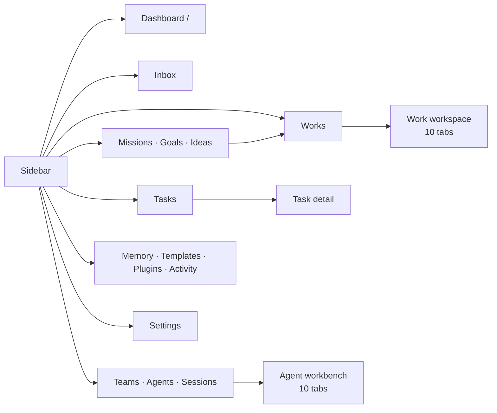

# Platform Tour (Screen by Screen)

This guide walks the entire dashboard, screen by screen, in roughly the order you meet it: the chrome that never leaves, the places you create things, the workspaces where the work happens, and the settings behind all of it. Each section says **what you can do on that screen** and links to the feature page that covers it properly.

Routes are written the way you would type them, without the locale prefix — the address bar shows `/en/works`, this guide says `/works`.

If you would rather read the concepts first, start with [The Founder Journey](./founder-journey.md); if you want the deep version of a single screen, follow the link at the end of each section.

## 1. Dashboard home — the cockpit at `/`

Signing in lands you on `/`. It opens with a welcome line, a row of stat tiles, and a stack of blocks. Three of those blocks are _signal_ blocks: they render only when they have something to say, so a quiet account sees a shorter page rather than a row of empty shells.

| Block                | Shown                  | What you do there                                                                                                                      |
| -------------------- | ---------------------- | -------------------------------------------------------------------------------------------------------------------------------------- |
| **Stat tiles**       | Always                 | Read Missions, Ideas, Works, Items, Active Websites, Month Spend, Agents, Tasks in flight and Teams; click a tile to open its catalog. |
| **Action approvals** | With pending proposals | Approve or reject a side-effectful action an Agent wants to take before it happens.                                                    |
| **Needs attention**  | With problems          | Jump straight to an errored Agent, a failed or paused schedule, a failed generation, a blocked Task, or an exhausted budget.           |
| **Coming up**        | With scheduled runs    | See the next scheduled Work and Mission runs.                                                                                          |
| **Missions**         | Always                 | Preview recent Missions with their Ideas / Works / Sites counters.                                                                     |
| **Ideas**            | Always                 | Skim recent Ideas and press **Refresh** to have the platform research new proposals for you.                                           |
| **Works**            | Always                 | Open a recent Work, or use **+ Add** and **View all**.                                                                                 |
| **Tasks**            | Always                 | Open recent in-flight Tasks.                                                                                                           |
| **Agents**           | Always                 | Check recent Agents, their status, scope and heartbeat.                                                                                |

Eight tiles are always there; **Teams** is a ninth that appears only once the Teams count can be read, so a workspace without it sees a row of eight rather than a tile stuck on zero. **Month Spend** is a link — it opens `/settings/work-agent#account-budgets`, where the account-wide cap is set. **Agents** and **Tasks in flight** each carry a qualifier underneath (_n active_, _n blocked_).

Every number on the page is fetched independently and every fetch is catch-defended, so a single failing call costs you one tile, never the page.

**In depth:** [The Dashboard](../features/dashboard.md).

## 2. The chrome that never leaves

### The sidebar

Thirteen entries, always in this order, with **+ New** pinned above them and a collapse toggle at the top:

| Entry         | Route        | What lives there                                                        |
| ------------- | ------------ | ----------------------------------------------------------------------- |
| **Dashboard** | `/`          | The cockpit above.                                                      |
| **Inbox**     | `/inbox`     | Questions, approvals, escalations and notices. Carries an unread badge. |
| **Missions**  | `/missions`  | Ongoing goals.                                                          |
| **Goals**     | `/goals`     | Measurable outcomes with a loop that advances them.                     |
| **Ideas**     | `/ideas`     | One-shot proposals waiting to be accepted or dismissed.                 |
| **Works**     | `/works`     | Everything you are building. Shows a pulse while a Work is generating.  |
| **Tasks**     | `/tasks`     | The task board and its triggers.                                        |
| **Teams**     | `/teams`     | People _and_ Agents — the entry also covers `/agents` and `/skills`.    |
| **Memory**    | `/memory`    | Org-wide knowledge; the entry also covers `/meetings`.                  |
| **Templates** | `/templates` | Website, Work and Mission template catalogs.                            |
| **Plugins**   | `/plugins`   | The integration catalog.                                                |
| **Activity**  | `/activity`  | The audit log and the Schedules view.                                   |
| **Settings**  | `/settings`  | Everything in section 12.                                               |

Below the list sits the **runner status pill** — "Runner · n/N online". It appears only once at least one node is enrolled, and its popover shows each machine's status with a **Refresh** button. The bot button on the sidebar's outer edge opens the [platform chat panel](../features/platform-chat.md). Your avatar at the bottom opens the profile menu, in this order: **Account Settings**, **Help & Docs**, **Support**, **Keyboard Shortcuts**, **Billing**, **Usage & Credits**, **Sign Out**.

### The organization switcher

At the top of the sidebar, the workspace switcher lists the organizations you belong to and offers **Create Organization**. Switching re-scopes the entire dashboard — Works, Agents, budgets, Memory — to that organization. See [Organizations](../features/organizations.md).

### The header

| Control               | What it is for                                                                                                                  |
| --------------------- | ------------------------------------------------------------------------------------------------------------------------------- |
| **Work switcher**     | Jump between your recent Works without going back to `/works`.                                                                  |
| **Setup badge**       | `Onboarding {step}/{total}` — appears when you closed the setup wizard early. Click it to resume exactly where you stopped.     |
| **Notification bell** | The dropdown of what happened; each entry links to the thing it happened to. See [Notifications](../features/notifications.md). |
| **Theme toggle**      | Light / dark.                                                                                                                   |
| **Help (`?`)**        | Opens the Help drawer.                                                                                                          |

### The Help drawer and keyboard shortcuts

The drawer has four tabs — **Tips**, **Shortcuts**, **FAQ**, **Resources** — plus an **Onboarding** card on the Tips tab whose button reads **Open onboarding (n/N)** and reopens the setup wizard where you left it. Resources link to the documentation, the GitHub repository, the issue tracker and community discussions, and the footer shows the running version and system status.

| Shortcut         | Does                 |
| ---------------- | -------------------- |
| **Cmd/Ctrl + K** | Search Works         |
| **C**            | Create a new Work    |
| **?**            | Open the Help drawer |

## 3. `/new` — the one place things get created

**+ New** in the sidebar opens `/new`: a prompt box and a row of chips that say what your prompt should become. Type a description (at least ten characters) and press **Create**.

| Chip                                                         | Creates                               | Where it goes                                                      |
| ------------------------------------------------------------ | ------------------------------------- | ------------------------------------------------------------------ |
| **Mission**                                                  | An ongoing goal                       | Through the AI chat, then `/missions/:id`                          |
| **Idea**                                                     | A one-shot brief                      | Through the AI chat, then `/ideas/:id`                             |
| **Agent**                                                    | An AI teammate                        | `/agents/new` (finish the dialog to create it)                     |
| **Task**                                                     | A trackable item                      | `/tasks/new`                                                       |
| **Website · Landing Page · Blog · Directory · Awesome Repo** | A Work of that kind                   | `/works/new?kind=…`                                                |
| **Company**                                                  | A registered entity → an Organization | The company registration flow                                      |
| **Store**                                                    | Nothing yet — the chip is inert       | Marked **Soon**; see [Store Builder](../features/store-builder.md) |

The default chip is **Mission** when you have none and **Idea** afterwards. `/new?type=mission&template=<id>` pre-fills the box from a [Mission Template](../features/mission-templates.md). Individual Work kinds can be switched off per installation, in which case their chip renders as **Soon** too.

**In depth:** [The + New page](../features/new-page.md).

## 4. The setup wizard

On a brand-new account the wizard opens by itself. It always has these ten steps, in order:

| #   | Step                       | What you decide                                                                            |
| --- | -------------------------- | ------------------------------------------------------------------------------------------ |
| 1   | **Welcome**                | What Ever Works is; nothing to fill in.                                                    |
| 2   | **Your AI choice**         | Ever Works AI, or bring your own key.                                                      |
| 3   | **Your Git Storage**       | Ever Works Git, your GitHub, GitLab, or your own Git.                                      |
| 4   | **Your DB Storage**        | The managed database or your own.                                                          |
| 5   | **Your deployment**        | Ever Works, Vercel, or Kubernetes.                                                         |
| 6   | **Where it runs**          | Hosted, your machine, or your own machines — this shapes the guidance the last step gives. |
| 7   | **What do you do**         | Your roles and team size; used only to suggest starting points, and it hides nothing.      |
| 8   | **Communication**          | Connect Slack so you can mention the bot in a channel. Discord is marked **Coming soon**.  |
| 9   | **Plugins & Integrations** | Turn on the plugins you already know you want.                                             |
| 10  | **Create your first Work** | **Generate now**, and the platform builds it.                                              |

Three more steps appear only when your choices need them: **Configure AI** (any AI choice other than Ever Works), **Connect your GitHub** (Git storage set to your own GitHub), and **Configure deployment** (Vercel or Kubernetes). So the wizard is ten steps at its shortest and thirteen at its longest — which is why the badge shows a total rather than a fixed number.

Every step has **Back**, **Skip step** and **Next**, and progress is saved on the server as you go. Closing the wizard is safe: the header keeps a **Setup** badge, and the Help drawer's **Open onboarding (n/N)** button brings it back on the step you stopped at.

**In depth:** [Onboarding & Setup Wizard](../features/onboarding.md).

## 5. Inbox

`/inbox` is the operator message center: everything addressed to you by your Agents, your Works and the platform — blocking questions, approval requests, escalations and notices — in one list with an unread badge on the sidebar.

**How to answer a parked run:**

1. Open **Inbox** in the sidebar and stay on the **Active** view (the **Archived** view holds what you have already dealt with).
2. Select the message. A question shows the agent's recommended option alongside the alternatives.
3. Pick the recommended option, pick another option, or type a free-text answer.
4. Press **Send** — this unparks the waiting run and seeds it with your answer.
5. **Archive** the message when you are done. You can also mark messages read/unread, unarchive, or delete them.

**In depth:** [Inbox](../features/inbox.md) · [Approvals & Escalations](../features/approvals-and-escalations.md).

## 6. Missions, Goals and Ideas

### Missions

`/missions` lists your Missions with a prompt composer at the top (**or create manually** takes you to `/missions/new`), a status filter, search and pagination. `/missions/:id` gives you **Run now**, **Clone**, **Pause / Resume**, **Complete**, **Delete** and **Save settings**, plus the Mission's Ideas, its attached Works, its Goals panel and its spend against budget. The detail page carries its own tab strip — **Overview | Tasks | Agents** — at `/missions/:id/tasks` and `/missions/:id/agents`.

**In depth:** [Missions](../features/missions.md).

### Goals

`/goals` and `/goals/new` cover creation; `/goals/:id` is where a Goal is run. Lifecycle actions are **Activate**, **Pause**, **Archive / Unarchive** and **Delete**; **Evaluate now** scores progress on demand and lets you record an outcome. Below that sit the loop controls — **Start**, **Advance**, **Nudge**, **Pause**, **Restart**, **Cancel** and **Adjust limits** (including which Agent runs the loop) — with a progress sparkline, the event history and the sessions the loop spawned.

**In depth:** [Goals](../features/goals.md).

### Ideas

`/ideas` has the same prompt-first composer, a status filter (actionable or all, including done), search, and a gear menu holding the automation switches: **Auto-generate**, **Auto-build**, **Auto-retry** and **Account budgets**. On `/ideas/:id` you **Accept** an Idea to build it into a Work, **Retry / Rebuild** a failed build, **Dismiss** or **Delete** it, **View Work** once it exists, assign or unassign an Agent, and attach files. `/ideas/:id/tasks` and `/ideas/:id/agents/new` hang off the same Idea.

**In depth:** [Ideas](../features/ideas.md).

## 7. Works and `/works/new`

`/works` is the catalog: summary stats across your Works, the list itself, and search.

`/works/new` is the create form, and it has three modes:

| Mode       | When to use it                                                                   |
| ---------- | -------------------------------------------------------------------------------- |
| **AI**     | Describe the Work and let the agent prepare an approval-ready plan. The default. |
| **Manual** | Configure every step yourself — provider, template, items, deploy.               |
| **Import** | Bring in a Work you already have — repository, items and provider settings.      |

On the entry view you pick a **kind** chip — Website, Landing Page, Blog, Directory, Awesome Repo — and the form adapts: the picker below the chips merges **your own website templates** with the **Blueprints** published for that kind, and separate pickers choose the **Git provider** and the **deploy provider**. A **Start a campaign** chip hands off to `/works/new/campaign` for go-to-market Works.

Accepting an Idea sends you here with `?proposal=<id>`, which pre-fills the form from the proposal and starts you in AI mode.

**In depth:** [Creating a Work](../features/creating-a-work.md) · [Work Kinds](../features/work-kinds.md) · [Work Blueprints](../features/work-blueprints.md) · [Work Import](../features/work-import.md) · [Campaigns](../features/campaigns.md).

## 8. The Work workspace

Open any Work and you get a ten-tab workspace. The header above the tabs carries the repository links, the live-site link, the current status, and the Agents dropdown (pinned and assigned Agents, plus **+ New Agent**).

| Tab               | Route                      | What you do there                                                                                                                                                                                                                |
| ----------------- | -------------------------- | -------------------------------------------------------------------------------------------------------------------------------------------------------------------------------------------------------------------------------- |
| **Overview**      | `/works/:id`               | Status card, item/category/tag/comparison counts, budget summary, related Missions, and the Work's configuration at a glance.                                                                                                    |
| **Activity**      | `/works/:id/activity`      | The Work's feed with category and status filters, plus ingested connector events — commits, PRs, tracker items, docs, chat, meetings.                                                                                            |
| **Items**         | `/works/:id/items`         | Five sub-tabs: **Browse items**, **Categories**, **Tags**, **Collections**, **Source health**. Add, edit and bulk-edit items, import and export them, manage taxonomy, and set screenshot and validation options.                |
| **Tasks**         | `/works/:id/tasks`         | The task list filtered to this Work, with its run summary.                                                                                                                                                                       |
| **Pull requests** | `/works/:id/pull-requests` | Open PRs across the Work's repositories: refresh, open, view the diff, **Request review** by the agent, and read the review history.                                                                                             |
| **Memory**        | `/works/:id/kb`            | The Knowledge Base workbench — a document tree, upload zone, **Add doc**, classification, a markdown editor with wikilinks and mentions, history, locks and citations, plus a **Cmd/Ctrl+K** search palette and a side AI panel. |
| **Worker**        | `/works/:id/generator`     | Where generation happens — see the sub-tabs below.                                                                                                                                                                               |
| **Plugins**       | `/works/:id/plugins`       | Enable or disable plugins for this Work and pick which one provides each capability.                                                                                                                                             |
| **Deploy**        | `/works/:id/deploy`        | Choose the deploy provider, deploy or update the repository, watch progress, and manage domains, subdomains and runtime environment variables.                                                                                   |
| **Settings**      | `/works/:id/settings`      | Three sub-tabs: **General**, **Members**, **Budgets & Usage**.                                                                                                                                                                   |

Tabs are permission- and kind-aware, so the strip is shorter for some Works and some roles. The **Items** tab is labelled **Posts** on a blog and **Pages** on a website, and disappears entirely for a landing page; **Worker**, **Deploy**, **Plugins** and **Settings** appear only if you may generate, deploy or administer this Work.

### Worker sub-tabs

| Sub-tab         | Route                              | What you do                                                                                                                                                                         |
| --------------- | ---------------------------------- | ----------------------------------------------------------------------------------------------------------------------------------------------------------------------------------- |
| **Generate**    | `/works/:id/generator`             | **Start generation**, **Recreate Work**, or **Update items** — choose a provider, fill plugin fields, open advanced options, and **Cancel** a run in flight while progress streams. |
| **Schedule**    | `/works/:id/generator/schedule`    | Put generation on a cadence and override the providers a scheduled run uses.                                                                                                        |
| **History**     | `/works/:id/generator/history`     | Past runs and what each one changed.                                                                                                                                                |
| **Comparisons** | `/works/:id/generator/comparisons` | Generate and edit comparison pages; each opens at `/works/:id/generator/comparisons/:slug`.                                                                                         |

### Settings sub-tabs

| Sub-tab             | Route                               | What lives there                                                                                                                                                                                                                                                                         |
| ------------------- | ----------------------------------- | ---------------------------------------------------------------------------------------------------------------------------------------------------------------------------------------------------------------------------------------------------------------------------------------- |
| **General**         | `/works/:id/settings`               | Website configuration, repository visibility, provider repositories, committer identity, community-PR handling, merge policy, quality gates, task isolation, advanced prompts, sources, external references, activity sync, item import/export, the README configuration — and deletion. |
| **Members**         | `/works/:id/settings/members`       | Invite people, set roles, transfer ownership. Visible only if you may manage members.                                                                                                                                                                                                    |
| **Budgets & Usage** | `/works/:id/settings/budgets-usage` | Per-plugin caps and the spend summary for this Work.                                                                                                                                                                                                                                     |

**In depth:** [Items](../features/items.md) · [Knowledge Base](../features/knowledge-base.md) · [Scheduled Updates](../features/scheduled-updates.md) · [Comparisons](../features/comparisons.md) · [Merge Policy](../features/merge-policy.md) · [Quality Gates](../features/quality-gates.md) · [Custom Domains](../features/custom-domains.md) · [Works Config](../features/works-config.md) · [Work Members](../features/work-members.md) · [Budgets & Usage](../features/budgets-and-usage.md).

## 9. Tasks

### The hub

`/tasks` carries a two-entry tab strip — **Tasks | Triggers** — and three views of the same list: **Cards**, **Table** and **Kanban**. Filter by status (`backlog`, `todo`, `in progress`, `in review`, `blocked`, `done`, `cancelled`), by priority `p0`–`p4`, by label, or by free-text search; the status filter hides itself in Kanban, where the columns already group by status. **Run with agent** starts a run from the list, including in batch.

- `/tasks/new` — the create form.
- `/tasks/templates` — reusable task and workflow templates.
- `/tasks/triggers` and `/tasks/triggers/:id` — inbound webhooks that turn an external event into a Task: copy the webhook URL and a signed `curl` example, rotate the secret, **Fire now** to test, **Pause**, and read the recent fires.

### Task detail

`/tasks/:id` is a two-column issue view. The main column holds the title, the status buttons (only legal transitions are offered), the description editor, attachments and the activity thread; the right rail is a sticky **Details** panel with status, priority, labels, dates and scope.

What you can do from here:

1. **Transition** the task through the workflow, or **Delete** it.
2. **Edit the description** inline with **Edit** → **Save**.
3. **Talk to it** — post a chat message, mention an Agent (`@ceo can you review this?`), or start a message with `/` to invoke a Skill.
4. **Re-scope it** — attach or detach the Work, Mission, Idea and Agent it belongs to.
5. **Run it** — **Run with agent**, then **Steer**, **Interrupt** or **Resume** the run, and read the run history.
6. **Review the code** — the branch section, the diff sheet, the PR pill and the checks section show what the run produced; you can discard the branch or resolve decision conflicts.
7. **Repeat it** — subtasks, a recurring schedule, isolation on or off, and a maximum attempt count.

**In depth:** [Tasks](../features/tasks.md) · [Inbound Triggers](../features/inbound-triggers.md) · [Task Isolation](../features/task-isolation.md) · [Sessions & Run Steering](../features/sessions-and-steering.md).

## 10. Teams, Agents and Sessions

One hub with four tabs — **Teams | Agents | Sessions | Archived** — because people and Agents are one organization seen through two doors.

### Teams

`/teams` lists your teams. `/teams/new` asks for a parent team and a manager Agent. `/teams/:id` is the roster: add an Agent or a person as **Lead** or **Member**, remove them, nest sub-teams, and see the Works, Tasks, Agents, Missions and Ideas the team owns. `/teams/:id/settings` re-parents the team, changes the manager or deletes it. `/teams/org-chart` draws the whole hierarchy, humans and Agents together.

### Agents

The **Agents** tab is prompt-first: describe the teammate you want, or pick one of the template chips (**View All** opens the full catalog, and your own templates appear alongside the shipped ones). **Create Agent Manually** opens `/agents/new`, where you choose a template, a scope (Tenant, Mission, Work or Idea), a Team and a reports-to Agent. The header's **Agents Chart** button opens `/agents/chart` — the org chart with human members stripped out. Below the list sits the **Skills** block; `/skills` redirects there, and `/skills/new`, `/skills/:id` and `/skills/templates` are its own pages.

### The Agent workbench

`/agents/:id` has ten tabs:

| Tab               | What you do                                                                                                  |
| ----------------- | ------------------------------------------------------------------------------------------------------------ |
| **Dashboard**     | Status, heartbeat, idle behaviour, last and next run, capabilities, attachments and the scorecard.           |
| **Activity**      | Everything this Agent has done.                                                                              |
| **Terminal**      | The live run stream; `?run=<id>` opens a specific run.                                                       |
| **Instructions**  | The five definition files — `SOUL.md`, `AGENTS.md`, `HEARTBEAT.md`, `TOOLS.md`, `agent.yml` — with autosave. |
| **Skills**        | Bind and unbind Skills.                                                                                      |
| **Capabilities**  | Tool grants, skills, MCP access, repositories, environment, init script and permission flags.                |
| **MCP Servers**   | The MCP servers this Agent may call.                                                                         |
| **Collaborators** | The sub-agents it is allowed to delegate to.                                                                 |
| **Budgets**       | Its spend cap and what it has spent.                                                                         |
| **Settings**      | Heartbeat cadence, idle behaviour, pause-after-failures, scope, and archiving.                               |

An Agent with a mailbox also has `/agents/:id/inbox`, with `/agents/:id/inbox/compose` to write and `/agents/:id/inbox/:messageId` to read a thread.

### Sessions and Archived

`/agents/sessions` lists runs across every Agent, filtered by status or Work, grouped by Work, with a badge on the ones awaiting input. `/agents/sessions/:runId` shows the tool calls with their arguments and results, and lets you **Steer**, **Interrupt** or **Cancel** the run — and jump to the Agent's **Terminal** tab for that run via **Open terminal** when the run has a terminal. `/agents/archived` is where archived Agents go; restore them, or delete them permanently.

**In depth:** [Teams](../features/teams.md) · [Agents](../features/agents.md) · [Agents Catalog](../features/agents-catalog.md) · [Agent Capabilities](../features/agent-capabilities.md) · [Live Agent Terminals](../features/agent-terminals.md) · [Agent Email](../features/agent-email.md) · [Sessions & Run Steering](../features/sessions-and-steering.md) · [Skills Catalog](../features/skills-catalog.md).

## 11. Memory, Templates, Plugins and Activity

### Memory — `/memory`

Every Work's Knowledge Base plus your organization-level documents in one searchable list, faceted by type, Work, source and status. The page also holds the **review panel** (accept or reject agent-written material), the **uploads** and **files** panels, the **consolidation** preview you can inspect before applying, its cadence and mode settings, and the **Meetings** panel at `/memory#meetings`. `/meetings/new` takes a pasted transcript and routes it to a Work; `/meetings/:id` shows the summary and transcript and lets you re-route it.

**In depth:** [Memory](../features/memory.md) · [Decisions & the Memory Review Queue](../features/memory-decisions.md) · [Meetings](../features/meetings.md).

### Templates — `/templates`

One catalog, three kinds: `?kind=website`, `?kind=work` and `?kind=mission`. Filter by All / Built-in / Custom, **Add template** from a repository URL (framework, branches, preview), **Customize template** with an AI provider, **Fork** a Work template into your GitHub user or organization, and **Sync** a custom template with its base or turn on auto-update. Mission templates offer **Use this**, which drops you back on `/new` with the prompt pre-filled.

**In depth:** [Website Templates](../features/website-templates.md) · [Work Templates](../features/work-templates.md) · [Mission Templates](../features/mission-templates.md).

### Plugins — `/plugins`

Search the catalog, filter by category or capability, and enable or disable a plugin for the whole account; the install state is shown on each card. `/plugins/:pluginId` is the plugin's own page: enable it, fill in its settings form, connect it via OAuth or device authorization, and read its README and documentation link.

**In depth:** [Plugins](../features/plugins.md).

### Activity — `/activity`

A segmented view of **Log** and **Schedules**. The Log renders as cards, a table or a board, filtered by action type, status and search, with pagination and **Export CSV**. Your view choice is remembered locally, and `?view=schedules` is a shareable link straight to the schedules side.

**In depth:** [Activity](../features/activity.md).

## 12. Settings

`/settings` is a page with its own sidebar: a fixed list of account and platform entries, then a **PLUGINS** section built from the plugins your installation actually has, then **Danger Zone** pinned at the bottom.

| Entry                   | Route                             | One line                                                                                                              |
| ----------------------- | --------------------------------- | --------------------------------------------------------------------------------------------------------------------- |
| **Profile**             | `/settings`                       | Name, username, avatar, budget-alert email, and email verification.                                                   |
| **Organization**        | `/settings/organization`          | The organizations you belong to and the Vision set on one.                                                            |
| **Security**            | `/settings/security`              | Change your password.                                                                                                 |
| **API Keys**            | `/settings/api-keys`              | Keys for the REST API and the CLI.                                                                                    |
| **Data**                | `/settings/data`                  | Export your account as JSON, import it back, sync configuration to a private repository.                              |
| **GitHub App**          | `/settings/github-app`            | Installations linked to this workspace; re-sync the snapshot and onboard a repository.                                |
| **Repositories**        | `/settings/repositories`          | The account-level repository registry Agents can be granted, including Work-derived repos.                            |
| **Work Agent**          | `/settings/work-agent`            | The built-in agent's preferences, its build requests, and its active run.                                             |
| **Fleet**               | `/settings/fleet`                 | Enroll a node, mint tokens, scan the QR code, set execution preferences.                                              |
| **Job Runtime**         | `/settings/job-runtime`           | Whether jobs use the platform runtime, your credentials, or a provider you pick.                                      |
| **Environments**        | `/settings/environments`          | The sandbox an Agent's work runs in — packages and networking.                                                        |
| **Connections**         | `/settings/connections`           | The registry of external MCP servers your Agents may consume.                                                         |
| **Digest**              | `/settings/digest`                | Personal and organization briefing cadence; the two are separate settings.                                            |
| **Notifications**       | `/settings/notifications`         | The event-by-channel preference grid and the in-app inbox.                                                            |
| **Channels**            | `/settings/integrations/channels` | Create and manage the channels notifications are delivered through.                                                   |
| **Email Addresses**     | `/settings/integrations/emails`   | Tenant-managed inbound and outbound addresses for Agents.                                                             |
| **Billing**             | `/settings/billing`               | Plan, balance, invoices, credits ledger, and `/settings/billing/payment-method`.                                      |
| **Usage & Credits**     | `/settings/usage`                 | Where the credits went — per day, model, agent and Work, with **Export CSV**. `?tab=costs` opens the costs dashboard. |
| **Plugins by category** | `/settings/plugins/:category`     | Configure the plugins of one category; a dot marks a category with required settings missing.                         |
| **Danger Zone**         | `/settings/danger`                | Export everything, then delete the account behind a typed-email confirmation.                                         |

**Fleet** sits directly above **Job Runtime** on purpose: Fleet is _where_ work can run, Job Runtime is _how_ it is dispatched. The Fleet entry disappears entirely on installations where the operator turned Fleet off.

Three **admin** pages exist for platform operators only — `/admin/usage`, `/admin/plugins/allowlist` and `/admin/tenants/:tenantId/runtime-allowlist` — and they return a 404 for everyone else, so their absence from your sidebar is by design rather than a missing permission.

**In depth:** [The Settings Map](../features/settings-map.md) · [API Keys](../features/api-keys.md) · [Data Management](../features/data-management.md) · [Repositories Registry](../features/repositories.md) · [Fleet](../features/fleet.md) · [Job Runtimes](../features/job-runtimes.md) · [Environments](../features/environments.md) · [MCP Connections](../features/mcp-connections.md) · [Digests](../features/digests.md) · [Notifications](../features/notifications.md) · [Credits & Billing](../features/credits-and-billing.md).

## 13. The same screens without a browser

Every screen in this tour is a view over the same REST API, so anything you can click you can also script — with your own permissions, not a weaker service account. Three surfaces reach it:

| Surface                | What it is                                                                                                                                            | Reach for it when                                               |
| ---------------------- | ----------------------------------------------------------------------------------------------------------------------------------------------------- | --------------------------------------------------------------- |
| **CLI** (`ever-works`) | The public command-line client, with `auth`, `work`, `kb` and `plugins`.                                                                              | You live in a terminal, or you are wiring the platform into CI. |
| **MCP server**         | 74 tools — 66 generated from the API's OpenAPI spec plus the `kb.*` Knowledge Base tools, `register_work` and `ping` — over stdio or streamable HTTP. | You want an AI assistant to drive the platform in conversation. |
| **REST API**           | The endpoints every screen above already calls.                                                                                                       | You are writing your own integration or automation.             |

All three authenticate with an API key you mint on **Settings → API Keys** (`/settings/api-keys`).

**How to walk the Works half of this tour from a terminal:**

1. `ever-works auth login --api-url https://api.ever.works` — start a session. On a headless box add `--manual` and paste the key from `/settings/api-keys` instead of opening a browser.
2. `ever-works work list` — the terminal equivalent of `/works`.
3. `ever-works work create` — an interactive walk through what `/works/new` asks in **Manual** mode.
4. `ever-works work generate` — the **Start generation** button on `/works/:id/generator`.
5. `ever-works work status` — the progress panel on that same tab.
6. `ever-works work deploy` — the **Deploy** tab at `/works/:id/deploy`.
7. `ever-works kb list <workId>` and `ever-works kb upload <workId> ./brand-guide.pdf --class brand` — the **Memory** tab at `/works/:id/kb`.

**The endpoints behind the busiest screens:**

| Screen                        | Endpoint                                                    |
| ----------------------------- | ----------------------------------------------------------- |
| `/works`                      | `GET /api/works` (supports `?search=` and pagination)       |
| `/works/new`                  | `POST /api/works`                                           |
| Worker → **Generate**         | `POST /api/works/:id/generate`                              |
| Worker → **History**          | `GET /api/works/:id/history`                                |
| Work → **Memory**             | `GET /api/works/:id/kb/documents`                           |
| Teams → **Agents**            | `GET /api/agents`, `POST /api/agents`                       |
| An Agent's **Pause / Resume** | `POST /api/agents/:id/pause`, `POST /api/agents/:id/resume` |
| `/tasks`                      | `GET /api/tasks` (status, priority, scope, label, search)   |
| A Task's status buttons       | `POST /api/tasks/:id/transition`                            |
| A Task's chat thread          | `GET` and `POST /api/tasks/:id/chat`                        |

**In depth:** [CLI Commands](../cli/commands.md) · [KB MCP & CLI Reference](../kb/mcp-cli-reference.md) · [MCP Server](../features/mcp-server.md) · [API Authentication](../api/authentication.md).

## 14. What is not finished yet

A tour is only useful if it is honest about the edges. As of today:

| Screen                                       | State                                                                                                                                                                                                                                  |
| -------------------------------------------- | -------------------------------------------------------------------------------------------------------------------------------------------------------------------------------------------------------------------------------------- |
| **Store** chip on `/new` and `/works/new`    | Inert, labelled **Soon**. The kind is flag-controlled like every other kind, and the flag is off. See [Store Builder](../features/store-builder.md).                                                                                   |
| **Discord** on the Communication wizard step | Marked **Coming soon**; Slack is the shipped connector.                                                                                                                                                                                |
| **Settings → Email Addresses**               | A first-pass shell: the list renders, but **Add address** opens a placeholder rather than the full add wizard.                                                                                                                         |
| **Settings → Notifications** preference grid | The event-by-channel matrix renders read-only in this version; in-app delivery is always on, and channel routing is edited from **Channels**.                                                                                          |
| **Admin pages**                              | Platform-operator only, and a 404 for everyone else.                                                                                                                                                                                   |
| **Billing purchases**                        | The purchase, payment-method and auto-recharge cards sit behind a server-side switch that is off by default, and need a configured payment provider; otherwise the page shows a coming-soon state instead of buttons that would error. |

## Related

- [The Founder Journey](./founder-journey.md) — the same platform told as a narrative rather than a map.
- [Platform Overview](../overview.md) · [Getting Started](../getting-started.md) — the concepts behind the screens.
- [The Dashboard](../features/dashboard.md) · [The + New page](../features/new-page.md) · [Onboarding](../features/onboarding.md) · [Inbox](../features/inbox.md) — the chrome and the entry points.
- [Missions](../features/missions.md) · [Goals](../features/goals.md) · [Ideas](../features/ideas.md) · [Creating a Work](../features/creating-a-work.md) · [Tasks](../features/tasks.md) · [Agents](../features/agents.md) · [Teams](../features/teams.md) — the core loop.
- [Memory](../features/memory.md) · [Plugins](../features/plugins.md) · [Activity](../features/activity.md) · [The Settings Map](../features/settings-map.md) — everything around it.
- [Platform Chat & Canvas](../features/platform-chat.md) — driving any of these screens by typing instead of clicking.
- [CLI Commands](../cli/commands.md) · [MCP Server](../features/mcp-server.md) — the same screens from a terminal or an AI assistant.
- API reference: [Authentication](../api/authentication.md) · [Works](../api/works.md) · [Agents](../api/agents.md) · [Tasks](../api/tasks.md)
