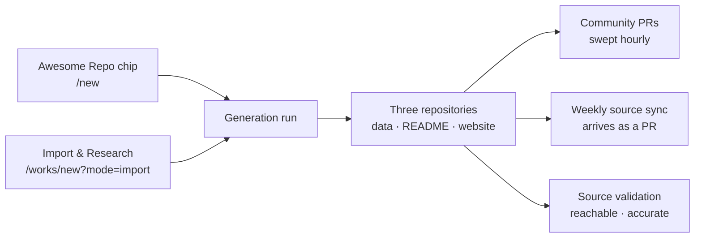

# Quickstart: Build an Awesome List

An **awesome-repo** Work is a curated index that lives as a Git repository you own: a generated `README.md` with a table of contents, one section per category and one line per item, backed by structured YAML — and, if you want one, a deployed site on top.

In the [Work kind](../features/work-kinds.md) capability registry, `awesome-repo` carries items, taxonomy, bulk item import/export, source validation and community pull-request processing. The one thing it does not carry is head-to-head **comparisons** — those stay a directory-shaped affordance, because an awesome list is an index rather than a review site. Its overview tiles are Total Items, Categories, Tags, Generation Status and Days Active.

There are two genuinely different ways in:

- **The list does not exist yet** — start from the **Awesome Repo** chip on `/new` and let the pipeline research it from a prompt.
- **The list already exists** — import the README at `/works/new?mode=import`, where the source becomes _research seed_ rather than content to copy, and an **expansion factor** decides how far past it the run goes.

Routes are written the way you type them, without the locale prefix — the address bar shows `/en/works/new`, this guide says `/works/new`.



## 1. Before you start

| You need            | Why an awesome list needs it                                                                                     | Where it comes from                                                                                              |
| ------------------- | ---------------------------------------------------------------------------------------------------------------- | ---------------------------------------------------------------------------------------------------------------- |
| **An account**      | Everything below is behind the dashboard.                                                                        | Register at `/register`, or sign in at `/login` — see [Creating an Account](../features/creating-an-account.md). |
| **An AI provider**  | The pipeline writes every description, assigns categories and tags, and (on import) researches each source link. | Onboarding **Step 2 — Your AI choice**. The default, **Ever Works AI**, needs no setup.                          |
| **Git storage**     | The list _is_ repositories. You get three of them, under your account or an organization.                        | Onboarding **Step 3 — Your Git Storage**. The default, **Ever Works Git**, is a managed org.                     |
| **A pipeline**      | Import runs on the **Agent Pipeline** by default; the import form accepts **Agent Pipeline** or **Claude Code**. | Settings → Plugins. See [Plugins](../features/plugins.md).                                                       |
| **A deploy target** | Only if you want the companion website. The README repo is useful on its own.                                    | Onboarding **Step 5 — Your deployment**: **Ever Works**, **Vercel**, or **Kubernetes**.                          |

Importing from a **private** repository, or creating repositories under an organization, also needs a connected GitHub account — the import form says so before it lets you continue.

## 2. Start A — the Awesome Repo chip

Use this when the list does not exist yet. The chip is a live Work kind on both creation surfaces: `/new` (the unified composer) and `/works/new` (the Work canvas).

### How to: start an awesome list from a prompt

1. Click **+ New** in the sidebar — it opens `/new`, the one composer for Missions, Ideas, Agents, Tasks and Works.
2. Click the **Awesome Repo** chip. Its description reads _"An awesome-list repo — markdown index, categorized links, and refreshable metadata."_, and picking the chip rewrites the placeholder examples to awesome-list ones, such as _"Awesome list of self-hostable open-source SaaS alternatives — categorized + docker-ready"_.
3. Type what you want the list to cover, then submit. The prompt is sent into the chat panel as _"I want to create a awesome list repo. …"_ and you are forwarded to the Work canvas at `/works/new?mode=ai&kind=awesome-repo`. You can skip the composer and deep-link to that URL directly; `?kind=awesome-repo` pre-selects the chip.
4. On the canvas — **New Work — with AI** — fill in:
    - **Work Name** — optional. _"AI will suggest a name if you leave this empty."_
    - **Work Slug** — auto-generated from the name, checked for availability as you type, and used for the repository names.
    - **Describe Your Work** — the prompt. Say what belongs on the list and what does not; this is what the run is steered by.
5. The **Template** picker opens on the **Awesome** chip. It has no selectable blueprint today — see the note below — so leave it on the default.
6. Open **Advanced Settings** if you want to choose the pipeline, AI, search, screenshot and content-extractor plugins for this run, then press **Generate with AI**. The form warns you up front: _"AI generation typically takes 2-5 minutes depending on the complexity of your request."_

The right-hand sidebar carries the two Work-level choices: **Git Provider** (personal account or organization) and **Deploy Provider**.

:::note The awesome blueprint is a placeholder — the chip is not

The shared blueprint catalog ships an `awesome` entry with `status: placeholder`, and the picker excludes placeholders from the pickable list. So the **Awesome** chip in the template picker shows no blueprint to choose. Nothing is blocked by this: the Work is still created, generated and deployable, and its website repository is created from the system default template, **Classic**. If you want a specific starting site, switch the picker to the **Directory** chip and pick one of the directory blueprints instead. Details in [Website Templates](../features/website-templates.md) and [Work Blueprints](../features/work-blueprints.md).

:::

Prefer the terminal? `ever-works work create` walks the same choices interactively and `ever-works work generate` runs the pipeline — see [CLI Work Commands](../cli/work-commands.md). There is **no** work-import command in the CLI; importing is a dashboard or API operation.

## 3. Start B — import an existing awesome README

Use this when a curated list already exists — yours or a public one — and you want a maintained, expandable version of it that you own.

Import does not copy the source. It hands the source URL to the pipeline as **research input**: workers visit each linked item, write original descriptions, then go looking for items the source never had.

### What the analyzer decides first

Paste a URL and the platform inspects the repository before anything is created:

| Detected as         | How it is recognised                                                                                                          | What you get                                                          |
| ------------------- | ----------------------------------------------------------------------------------------------------------------------------- | --------------------------------------------------------------------- |
| **Awesome List**    | A `README.md` with section headers and at least 5 list-style links — or 3+ links into internal folders for a multi-file list. | The **Import & Research** flow described here.                        |
| **Data Repository** | A root `.works/works.yml` **and** a `data/` folder.                                                                           | A mode selector: **Import & Copy** or **Link Existing**.              |
| **Neither**         | Nothing matches.                                                                                                              | _"We could not automatically detect the format."_ — pick one by hand. |

Meta sections such as Contributing, License, Table of Contents and Authors are ignored when the analyzer counts category headers, so a list is not mistaken for a docs repo.

The URL parser recognises GitHub, GitLab and Bitbucket URL shapes, but the git-provider plugin that ships today is **GitHub** — so import from a GitHub repository. A GitLab or Bitbucket URL parses into an owner and a repo and then stops at the next step, because the import resolves a git-provider access token for the provider the URL names and no plugin answers for those two. See [Plugins](../features/plugins.md) for the current provider list.

### How to: import and expand an existing list

1. Go to `/works/new` and press **Import Existing Work**, or deep-link straight to `/works/new?mode=import`.
2. Choose **Paste URL** (`https://github.com/owner/repository`) or **My Repositories** to pick from your own GitHub repositories, then press **Analyze Repository**.
3. Wait through **Analyzing Repository** — _"Detecting repository type and structure…"_. An awesome list comes back with an **Awesome List Detected** badge and an estimated item and category count.
4. Read the **Import & Research Mode** banner: _"Items from the source repository will be used as research seeds. The AI pipeline will discover new items, rewrite descriptions, and expand the taxonomy."_ It also shows `~N seed items detected` next to `owner/repo`.
5. Set the **Expansion target** — how much bigger than the source the final list should be. The preview line does the arithmetic for you: _"~{seed} seed items → target ~{target} final items (~{new} new items to discover)"_.

    | Expansion | Source is at most | Use it when                                                                   |
    | --------- | ----------------- | ----------------------------------------------------------------------------- |
    | `1.5`     | ~67% of the list  | The source is already near-exhaustive and you mostly want fresh descriptions. |
    | `2`       | 50%               | A solid list that has drifted out of date.                                    |
    | `2.5`     | 40%               | **Recommended default** — a real expansion without an unbounded run.          |
    | `3`       | ~33%              | A thin source in a crowded space.                                             |
    | `5`       | 20%               | A seed list; expect the longest, most expensive run.                          |

6. Choose the **GitHub repository** behaviour:
    - **Clone / recreate** — _"Create a new generated README repository for this Work. Data and Work repositories are still created."_ This is the default and the right choice when the source is not yours.
    - **Reuse source README** — _"Do not create a generated README repository. GitHub repository links will point to the source README repository."_ Pick this when you are bringing your **own** existing list under management and want to keep its URL, stars and history.
7. Turn on **Keep synchronized** — _"Automatically pull updates from the source repository."_ — if you want the weekly sync described in section 5. The switch is off by default in the form.
8. If the source repository carries a `.works/works.yml`, a **Restore .works/works.yml settings** switch appears: _"Apply AI provider, model, schedule, and related repository settings from this repository."_ Leave it on to adopt the file's configuration.
9. Name the Work. If repositories with that slug already exist on your account, the form raises **Repository name conflict** and offers a suffixed alternative — _Use "my-list-2" instead_.
10. Optionally open **Advanced Settings**. For an import the pipeline choice is deliberately narrowed to **Agent Pipeline** and **Claude Code**; the other provider slots behave as they do everywhere else.
11. Press **Start Import & Research**. The API answers `202 Accepted` with a `workId` and a `historyId`, and you land on the Work while the run streams.

### What the pipeline is told to do

The import builds a multi-step instruction for the pipeline plugin rather than parsing the README itself:

| Instruction              | What it means in the run                                                                                      |
| ------------------------ | ------------------------------------------------------------------------------------------------------------- |
| **Process source links** | Fetch the list, then visit each item's own URL and research it. Source descriptions are never copied.         |
| **Discover more items**  | Search for alternatives, competitors and newer projects in the same domain that the source does not mention.  |
| **Enrich descriptions**  | Every item ends up with an original description covering key features and use cases.                          |
| **Build a new taxonomy** | Categories and tags are generated for the final collection instead of mirroring the source's section headers. |

Its defaults: **Agent Pipeline**, an ambition target of **500 items**, a hard ceiling of **1,000 pages** processed per import, screenshots on, and an expansion factor of **2.5**. The page states the legal position plainly: _"Research mode uses the source repository as input data only. The final collection will consist primarily of newly discovered items with original, AI-generated descriptions. Source content is not copied verbatim."_

The run is dispatched as a background task with a two-hour ceiling, and falls back to running in-process if the task runner is unavailable — either way the request returns immediately.

### The same import from the API

```bash
curl -X POST http://localhost:3100/api/works/import \
  -H "Authorization: Bearer <token>" \
  -H "Content-Type: application/json" \
  -d '{
    "sourceUrl": "https://github.com/owner/awesome-something",
    "sourceType": "awesome_readme",
    "name": "Awesome Something",
    "gitProvider": "github",
    "owner": "my-org",
    "organization": true,
    "sync": true
  }'
```

`POST /api/works/import/analyze` runs step 3 on its own if you want to inspect `detectedType`, `itemCount` and `slugConflict` before committing. Full request and response reference: [Work Import](../features/work-import.md).

:::info Importing a data repository instead

If the URL turns out to be an Ever Works **data repository**, you get a choice rather than a research run: **Import & Copy** ("Create new repositories with a copy of the data") or **Link Existing** ("Use your existing repository directly. No copying, changes sync automatically"). Linking is synchronous, needs **write** access, and keeps the source repo's owner as the Work owner. It is the fastest path, but a linked Work has no import source to re-sync from — see section 5.

:::

## 4. What gets generated

Both starts produce the same three repositories, named from the slug:

| Repository        | Name             | What is in it                                                                                        |
| ----------------- | ---------------- | ---------------------------------------------------------------------------------------------------- |
| **Data**          | `{slug}-data`    | The source of truth: item YAML, categories, tags, collections, README templates, `.works/works.yml`. |
| **Markdown/Work** | `{slug}`         | The awesome list itself — generated `README.md`, `details/<slug>.md` pages, `LICENSE.md`.            |
| **Website**       | `{slug}-website` | The deployable site, created from the website template. Optional to deploy, always created.          |

### Inside the data repository

```text
.works/works.yml
categories.yml
tags.yml
collections.yml
references.yml
markdown/
    header.md
    footer.md
data/
    30-seconds-of-code/
        30-seconds-of-code.yml
        30-seconds-of-code.md
```

Each item's `.yml` carries `name`, `description`, `source_url`, `category`, `tags`, `featured` and an `updated_at` stamp; the sibling `.md` holds its long write-up. A taxonomy edit in the dashboard is a commit to `categories.yml` or `tags.yml` — see [Taxonomy System](../features/taxonomy-system.md).

### How the README is assembled

The markdown generator rebuilds `README.md` from the data repository on every run:

1. `markdown/header.md` is emitted first — that is where the title, the intro line and any acknowledgement block live.
2. A **Table of Contents** follows when the data config has `content_table` on (the default), listing every category with its item count, anchored with GitHub-compatible slugs.
3. Each category becomes an `## Category (count)` section, ordered by category priority and then alphabetically.
4. Items inside a section are sorted **featured first**, then by explicit `order`, then alphabetically, and each renders as one line:

    ```markdown
    - [Item name](https://example.com) - One-line description ([Read more](/details/item-name.md)) `tag-one` `tag-two`
    ```

    The `Read more` link appears only when that item actually has a detail page, so the README never links into a missing file.

5. `markdown/footer.md` closes the file — legal notes, licence badges, star history.

Names, descriptions and tag names are Markdown-escaped, link targets are restricted to `http(s)` (anything else collapses to an inert `#`), and secret-looking strings are redacted from item markdown and the README before the commit. That matters here because item text originates from pages fetched off the open web.

### How to: change the README header and footer

1. Open **Settings → General** (`/works/:id/settings`) and find the **README Configuration** card.
2. Fill in **Custom Header** and/or **Custom Footer**. Each has an **overwrite default** switch: leave it off to append your text to the standard block, turn it on to replace it.
3. Press **Update README**.
4. Or edit `markdown/header.md` and `markdown/footer.md` in the data repository directly and commit — the next render picks them up.

To re-render the list without re-running the research pipeline, use `ever-works work regenerate-markdown` ([Generation Commands](../cli/generation-commands.md)).

## 5. Keep it fresh — the weekly source sync

An imported list has something a generated-from-scratch list does not: an upstream source that keeps moving. That is what the sync is for.

**How it is set up.** When you tick **Keep synchronized** on an Awesome List import, the platform creates a schedule for the Work with a **weekly** cadence and **always create pull request** on. Through the API the same happens unless you send `"sync": false`. Only Awesome List imports get this schedule automatically.

**What a due run does.** When the scheduler reaches a Work whose source type is syncable — `data_repo`, `awesome_readme` or `works_config` — it runs a **sync** instead of an ordinary regeneration: the Work moves to `generating` with the step `syncing`, a history entry is written with `type: sync` and `triggeredBy: schedule`, and the research pipeline re-runs against the original source URL. Sync runs are **always** pull-request updates: new and changed items arrive as a PR on the repository rather than a direct commit, so you review the diff before the list changes. That is fixed in the sync path itself — the schedule's **Create Pull Requests** switch steers ordinary generation runs, not syncs, so turning it off does not give a synced list direct commits.

**Where the controls are.**

| Control                                                                              | Where                                                                       |
| ------------------------------------------------------------------------------------ | --------------------------------------------------------------------------- |
| **Sync Enabled** switch — _"Automatically pull updates from the source repository."_ | **Settings → General** → **Source Repository** card (`/works/:id/settings`) |
| Cadence, billing mode, failure limit, **Create Pull Requests**, **Run now**          | `/works/:id/generator/schedule`                                             |
| What the source was, and what `.works/works.yml` contributed                         | **Settings → General** → **Source Repository** card                         |
| Every past run, sync or generation                                                   | `/works/:id/generator/history`                                              |

```bash
curl -X PUT http://localhost:3100/api/works/<work-id>/schedule \
  -H "Authorization: Bearer <token>" \
  -H "Content-Type: application/json" \
  -d '{"enable": true, "cadence": "weekly", "alwaysCreatePullRequest": true}'
```

A **linked** Work (`link_existing`) is the exception and says so: _"Linked works use existing repositories directly and cannot be synced from an import source."_ There is nothing to pull from — you are already editing the real repository.

Separately, `POST /api/works/:id/sync-data` re-reads the data repository into the Work record — item count, README header/footer configuration, the last pull request — which is useful after you have edited the repo by hand. It refreshes the Work's view of its data; it does not fetch anything from the upstream source.

Cadences, retries, failure limits and billing modes are covered in [Scheduled Updates](../features/scheduled-updates.md).

## 6. Let the community add to it

Awesome lists live on contributions, and `awesome-repo` is one of the two kinds where community pull-request processing is available.

### How to: accept community pull requests

1. Make sure the GitHub plugin is configured with a valid token and the Work has both a main and a data repository linked, and that an AI provider is active.
2. Open **Settings → General** (`/works/:id/settings`) → **Community PR** and turn on **Enable Community PR** — _"Automatically process pull requests submitted by the community."_ Leave **Auto-close PRs after processing** on unless you would rather close them yourself.
3. Contributors open a pull request against the Work's main repository. There is no strict template: the extraction step reads the raw diff, so PRs that state a clear item name, description and URL simply extract best.
4. A scheduler sweeps **every hour**. For each unprocessed PR it fetches the diff, combines it with the Work's name, description and existing categories, extracts structured items, commits them to the data repository with a message linking back to the PR, and comments on the PR listing what was added.
5. Trigger a sweep yourself at any time:

    ```bash
    curl -X POST http://localhost:3100/api/works/<work-id>/process-community-prs \
      -H "Authorization: Bearer <token>"
    ```

    It answers `{ "itemsAdded": n }`, or `400` if the feature is not enabled for that Work.

6. Review what is open on the **Pull requests** tab (`/works/:id/pull-requests`), which lists PRs across the Work's repositories.

Full behaviour, settings and comment templates: [Community PR Processing](../features/community-pr-processing.md).

## 7. Keep the links honest

A stale awesome list is worse than no list. Source validation checks two independent things about every item's `source_url` — whether it is **reachable** (`reachable` / `broken` / `unknown`) and whether it is **accurate**, meaning specific enough to actually support the item (`accurate` / `generic` / `weak` / `unknown`). A homepage can be perfectly alive and still be a weak source for the tool you are citing.

### How to: schedule source checks

1. Open **Items → Source Health** on the Work.
2. In the **Source Health Checks** card, enable scheduled checks and pick a frequency. If you set none, validation follows the Work's main schedule cadence. It also runs after each successful scheduled generation.
3. Read the results per item. Broken links are raised as warnings; the softer states render as low-noise status text rather than alarms.
4. On any single item use **Re-check source** from its actions menu, and **Apply suggestion** when the AI proposes a better URL. Repeated manual checks are cached briefly, so hammering the button does not re-run the whole extraction.

Single-item check from the API:

```bash
curl -X POST http://localhost:3100/api/works/<work-id>/check-item-health \
  -H "Authorization: Bearer <token>" \
  -H "Content-Type: application/json" \
  -d '{"item_slug": "30-seconds-of-code"}'
```

More: [Item Source Validation](../features/item-source-validation.md).

## 8. Configure it in Git with `.works/works.yml`

Everything above can also be expressed as a file in the data repository, which is what makes an awesome list portable between environments and reviewable in a diff.

```yaml
name: Awesome Something
initial_prompt: |
    A curated list of tools for X, grouped by use case,
    each with an original one-line description.
model: gpt-5.1
website_repo: my-org/awesome-something-website
providers:
    ai: openai
    pipeline: agent-pipeline
    search: tavily
schedule:
    enabled: true
    cadence: weekly
```

| Field            | Effect on an awesome list                                                                               |
| ---------------- | ------------------------------------------------------------------------------------------------------- |
| `name`           | Display name of the Work.                                                                               |
| `initial_prompt` | The seed description each generation reads — the single strongest lever on what the list includes.      |
| `model`          | Model alias requested from the AI provider.                                                             |
| `website_repo`   | Where the companion site is published. Accepts `owner/repo`, an HTTPS URL, or an SSH remote.            |
| `providers`      | Per-capability plugin ids: `ai`, `search`, `screenshot`, `contentExtractor`, `pipeline`.                |
| `schedule`       | A cadence string, or `{ enabled, cadence }`. `weekly` is what the import flow writes for a synced list. |

The file round-trips: the import flow pre-fills itself from it (that is the **Restore .works/works.yml settings** switch), and every successful generation writes a fresh copy back — preserving any fields the platform does not own. If a repository contains only this file, `ever-works work register` registers it as a Work without a manual setup pass. Full schema and cadence values: [`.works/works.yml` Configuration](../features/works-config.md).

## 9. Publish it under your own org — and keep it

An awesome list is a public artefact, so where it lives matters as much as what is in it.

1. **Choose the owner before you generate.** The **Repository Owner** control offers **Personal Account** or any organization your git account can create in — _"The repository will be created under the {org} organization."_ On an import the owner is pre-filled from the source repository, and choosing **Import & Copy** resets it to your personal account so you consciously pick the destination.
2. **Keep the source repository if it is yours.** Pick **Reuse source README** at step 6 of the import and no new README repository is created; the Work points at the repository people already star.
3. **Set repository visibility** per repository. The Work settings page loads the current visibility of each repository, and the API exposes `GET` / `PUT /api/works/:id/repositories/visibility` with `{ repoType, isPrivate }` — so a data repo can stay private while the list itself is public.
4. **Deploy the companion site** if you want one: `/works/:id/deploy`, then a managed subdomain or your own domain. The README repo stands on its own if you would rather not. See [Managed Hosting](../features/managed-hosting.md) and [Custom Domains](../features/custom-domains.md).
5. **Leave it running.** The list keeps itself current through three loops that need nothing from you: the weekly source sync, the hourly community-PR sweep, and scheduled source validation.

Nothing here is a hosted database you rent. The items, the taxonomy, the README, the templates and the configuration are all files in repositories you own — see [Git Operations](../features/git-operations.md) and [Repositories Registry](../features/repositories.md).

## Next steps

- **Seed the Knowledge Base.** `/works/:id/kb` holds inclusion criteria, tone and prior research; every later run and every Agent reads from it, so the list stops drifting. See [Knowledge Base](../features/knowledge-base.md).
- **Hire a Work-scoped Agent.** A "List Curator" scoped to this one Work, with its own budget and heartbeat, can triage incoming PRs and file findings while you are elsewhere. See [Agents](../features/agents.md).
- **Cap the spend.** Set a budget before leaving a synced list unattended: [Budgets & Usage](../features/budgets-and-usage.md).
- **Bulk-load or export items.** Item import/export is available for this kind but off per Work until you enable it in Settings → General: [CSV & Excel Item Import / Export](../features/item-import-export.md).

## Troubleshooting

| Symptom                                                        | What it means                                                                                                                                     |
| -------------------------------------------------------------- | ------------------------------------------------------------------------------------------------------------------------------------------------- |
| _"We could not automatically detect the format."_              | The README has fewer than 5 list-style links, or no section headers. Pick **Awesome List** manually, or point at a different repository.          |
| Import fails with `REPO_ACCESS_DENIED`                         | The repository is private, or you lack write access on a **Link Existing** import. Connect your git provider, or use **Import & Copy**.           |
| A GitLab or Bitbucket URL is accepted, then the import stalls  | Those URL shapes parse, but GitHub is the git-provider plugin that ships, so the access-token step has nothing to answer with. Use a GitHub repo. |
| Import fails with `ENRICHMENT_FAILED`                          | The research pipeline errored — usually an unconfigured AI or pipeline plugin. Check Settings → Plugins, then retry.                              |
| The template picker shows no blueprint on the **Awesome** chip | Expected: the `awesome` blueprint is a placeholder. Leave the default (Classic), or pick a directory blueprint.                                   |
| No weekly sync ever runs                                       | **Keep synchronized** was off at import, or the Work was created with **Link Existing** — linked Works cannot sync from an import source.         |
| Sync runs, but the list never changes                          | Sync runs always open a pull request, whatever the schedule's **Create Pull Requests** setting says. Merge the PR to update the list.             |
| Community PRs are ignored                                      | **Enable Community PR** is off, or the Work has no linked main **and** data repository. `POST /process-community-prs` answers `400` in that case. |
| The **Comparisons** sub-tab is missing                         | Comparisons are a directory-only capability; `awesome-repo` does not have them.                                                                   |
| A `Read more` link is missing from a README line               | That item has no detail markdown yet, so the generator deliberately omits the link rather than pointing at a missing file.                        |

## Related

- [Work Import](../features/work-import.md) — every import type, error code and endpoint in full
- [Work Kinds & Capabilities](../features/work-kinds.md) · [Creating a Work](../features/creating-a-work.md) — what `awesome-repo` has, and the three creation methods
- [Community PR Processing](../features/community-pr-processing.md) · [Item Source Validation](../features/item-source-validation.md) — the two loops that keep a public list trustworthy
- [`.works/works.yml` Configuration](../features/works-config.md) · [Scheduled Updates](../features/scheduled-updates.md) — configuration in Git, and the cadence that reads it
- [Items](../features/items.md) · [Taxonomy System](../features/taxonomy-system.md) · [CSV & Excel Item Import / Export](../features/item-import-export.md)
- [Website Templates](../features/website-templates.md) · [Work Blueprints](../features/work-blueprints.md) · [Managed Hosting](../features/managed-hosting.md) · [Custom Domains](../features/custom-domains.md)
- [CLI Work Commands](../cli/work-commands.md) · [Generation Commands](../cli/generation-commands.md) — the same operations from a terminal
- [Quickstart: Build a Directory](./quickstart-directory.md) — the neighbouring kind, with comparisons and the full item surface
- [Platform Tour](./platform-tour.md) · [The Founder Journey](./founder-journey.md) — where an awesome list sits in the wider platform
