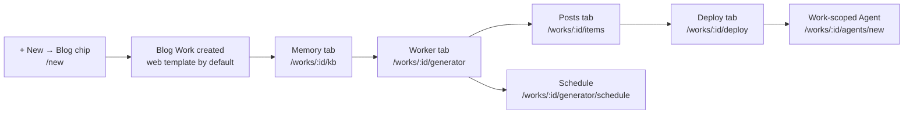

# Quickstart: Launch a Blog

This guide takes a blog from an empty account to a deployed site on your own domain, and then hands it to an [Agent](../features/agents.md) that keeps working on it. Every screen, button and route named below is the one you will actually see.

Routes are written without the locale prefix — the address bar shows `/en/works`, this guide says `/works`.

Read [What is early about the blog kind](#what-is-early-about-the-blog-kind) at the end before you plan a content calendar around it. The short version: the platform half of a Blog Work ships in full, the **content** half still runs on the shared items pipeline, and there is no dedicated post-writer yet.



## Before you begin

| You need                       | Why                                                                                                                                  |
| ------------------------------ | ------------------------------------------------------------------------------------------------------------------------------------ |
| An account and a signed-in tab | See [Creating an Account](../features/creating-an-account.md).                                                                       |
| A connected Git provider       | A Work provisions repositories in your own account — see [Creating a Work](../features/creating-a-work.md).                          |
| At least one AI provider       | The generation pipeline refuses to start without one; the Worker tab says _"{providers} not configured. Visit Settings → Plugins…"_. |
| A deploy target (for step 5)   | Either the managed `*.ever.works` address ([Managed Hosting](../features/managed-hosting.md)) or a deploy plugin such as Vercel.     |

## Step 1 — Create the Blog Work

1. Click **+ New** in the sidebar (`/new`). The chip row reads Mission · Idea · Agent · Task · **Website** · **Landing Page** · **Blog** · **Directory** · **Awesome Repo** · Company, followed by a **Store** chip, which on the hosted service is marked **Soon** (its `works-store` flag is off) and is inert either way — the chips row never emits `store`.
2. Click the **Blog** chip. Two things happen at once. Its one-line description appears under the row — _"A blog with categories, RSS, code highlighting, and SEO-ready content."_ — and the chip's **first** example is written into the composer as real, editable text: _"Personal blog about indie game development with postmortems and tooling tags"_. Focus returns to the box with the caret at the end, so you can send it as-is or rewrite it.

    The chip will not overwrite your own words. A seed lands in an empty box, or replaces a seed the page put there itself when you flip to a different chip; anything you typed, pasted or dictated is left alone (`apps/web/src/components/common/composer/use-prompt-seed.ts`). The chip's four other examples never enter the box — they cycle as grey placeholder hints while the composer is empty and unfocused, and they are worth reading as a menu of what this kind is for: _"Engineering blog with RSS, code-highlighting, author pages, and OG previews"_, _"AI research summaries blog — daily 200-word paper rundowns with citations"_, _"Founder journal — weekly progress logs tagged for revenue, hiring, product"_, _"Recipe blog with structured data, ingredient scaler, and category filters"_.

3. Replace the seeded example with your own brief. Say what the blog is about, who reads it, and what a typical post looks like — this text becomes the Work's `initial_prompt` and is the single biggest lever you have on the first run.
4. Submit. You land on `/works/new?mode=ai&kind=blog` with the AI creator open and the **Blog** kind chip already selected. `/works/new?kind=blog&prompt=…` is a valid deep link if you want to skip `/new` entirely.
5. Name the Work, check the Git provider and repository owner, and create it. Leave the **Website Template** selector on its default unless you have a reason not to — see below.

:::note The Blog chip can be turned off, and it fails open
Every kind chip is gated by a `works-<kind>` feature flag — `works-blog` here — evaluated **server-side** through PostHog so no analytics token reaches the browser (`apps/web/src/lib/feature-flags/work-kinds.ts`). The gate fails **open**: no PostHog key, a missing flag, an error or a 1.5-second timeout all leave the chip enabled, which is why self-hosted and OSS installs get every kind. Only a flag that resolves strictly to `false` turns the chip into "Soon", and in that state `?kind=blog` cannot be deep-linked either.
:::

### Which template a Blog Work gets

A Blog Work defaults to the **`web`** website template — [`ever-works/web-template`](https://github.com/ever-works/web-template), a general-purpose Next.js site (App Router, React 19, Tailwind CSS v4) that ships a full landing page, About / Pricing / Contact pages and a Markdown blog. It is not the directory template, and it has no item lists or faceted filters.

| Situation                                                     | Template used                                                                   |
| ------------------------------------------------------------- | ------------------------------------------------------------------------------- |
| You leave the selector alone                                  | `web` — the kind default for `blog`, `website` and `landing-page`               |
| You have saved a default website template in your preferences | Your saved preference wins over the kind default                                |
| You pick one explicitly on the create form                    | Exactly what you picked — `classic`, `minimal`, `web` or `web-minimal`          |
| You want the static Astro variant                             | `web-minimal` — always opt-in, the same way `minimal` is opt-in for directories |

The default is **resolved late**: creating a Blog Work leaves `websiteTemplateId` as `null` in the create response and on every later `GET`, and `web` is applied only when the website repository is first generated. That is deliberate, so a preference you save _after_ creation still wins. Full catalogue in [Website Templates](../features/website-templates.md).

### The same thing over the API

```bash
curl -X POST "https://api.ever.works/api/works" \
  -H "Authorization: Bearer $EVER_WORKS_TOKEN" \
  -H "Content-Type: application/json" \
  -d '{
    "name": "Indie Game Dev Journal",
    "slug": "indie-game-dev-journal",
    "description": "Postmortems and tooling notes from a solo studio",
    "organization": false,
    "kind": "blog"
  }'
```

The kind is create-only: `UpdateWorkDto` has no `kind` field, so you cannot convert a Directory into a Blog later with `PUT /api/works/:id`. The CLI's interactive `ever-works work create` does not ask for a kind, so Works created there are `default` (directory-shaped) — use the dashboard or this endpoint when you want a blog.

## Step 2 — Meet the Posts tab, and learn where a post lives

Open the Work. Its tab strip is drawn from the per-kind capability registry (`packages/contracts/src/domain/work-capabilities.ts`), so a Blog Work shows:

**Overview · Activity · Posts · Tasks · Pull requests · Memory · Worker · Plugins · Deploy · Settings**

The third tab is the same Items workbench every Work has — the registry simply renames its label from **Items** to **Posts** for `blog` (`items: { enabled: true, labelKey: 'posts' }`). The route is unchanged: `/works/:id/items`.

What the `blog` capability set turns on and off:

| Capability                             | Blog | Note                                                                         |
| -------------------------------------- | ---- | ---------------------------------------------------------------------------- |
| Posts surface (tab + `/items` routes)  | Yes  | Labelled **Posts**                                                           |
| Categories, tags and collections       | Yes  | The taxonomy sub-views inside the Posts tab                                  |
| Knowledge base (the **Memory** tab)    | Yes  | Step 3                                                                       |
| Deploy tab and deployment endpoints    | Yes  | Step 5                                                                       |
| Comparisons generator                  | No   | Directory-only affordance                                                    |
| Community pull-request intake          | No   | Off for `blog`                                                               |
| CSV / Excel import and export of posts | No   | Off for `blog` — you cannot bulk-load a back catalogue through the Posts tab |
| Source-URL validation                  | No   | Off for `blog`                                                               |

The Overview tiles follow the same registry: **Posts · Page Views\* · Registered Users · Deploy Status · Days Active**. Starred tiles are provider-backed and read _"Connect analytics to see this"_ until an analytics provider is connected — an unmeasured blog has _unknown_ page views, not zero.

### Where a post actually lives

A post is a row in the dashboard and a folder in your data repository (`<slug>-data`). The writer is `DataRepository` in `packages/agent/src/generators/data-generator/data-repository.ts`:

```text
.works/works.yml          Work configuration (schema v2: version, kind, spec)
categories.yml            Categories
tags.yml                  Tags
collections.yml           Collections
data/
  first-post/
    first-post.yml        Post metadata (name, description, source_url, category, tags, …)
    first-post.md         Long-form markdown body (optional; the site prefers this file)
```

Three properties of that writer are worth knowing before you hand-edit anything:

- **The slug is the folder and file name**, and it is deliberately never written _inside_ the YAML.
- **Every write stamps `updated_at`**, and a write whose content is otherwise unchanged is skipped entirely, so re-running generation does not churn your Git history with empty diffs.
- **Slugs are confined**: only `[A-Za-z0-9_-]` is accepted as a folder name, and anything that would resolve outside `data/` is rejected outright.

### How to add a post by hand

You need the **editor** role or higher on the Work.

1. Open the **Posts** tab (`/works/:id/items`) and stay on **Browse Items**.
2. Click **Add Item**. The **Add New Item** modal opens.
3. Fill in **Source URL**, **Name**, **Description** and at least one **Category** — all four are required by the form. Optionally paste the source URL and click **Retrieve** to have the platform fetch the page and pre-fill the rest.
4. Write the body in **Content (Markdown, optional)** — up to 100,000 characters, with a **Preview** button that renders GitHub-Flavoured Markdown. Leave it empty and a stub body is generated from the name, description and source URL.
5. Leave **Create Pull Request** off to commit straight to the data repository, or switch it on to propose the post as a PR instead.
6. Click **Add Item**.

The **Source URL is mandatory**, which is the sharpest edge of using the items workbench as a blog editor today: a post written from scratch still needs a URL to point at. To rewrite a body later, use the **⋮** row menu → **Edit content**; it writes `data/<slug>/<slug>.md` and mirrors the text onto the item's YAML `markdown` field. Full reference in [Items (Posts, Pages)](../features/items.md).

## Step 3 — Seed the Memory tab before you generate

This is the step people skip and then regret. The [Knowledge Base](../features/knowledge-base.md) is what makes the difference between a run that produces generic copy and a run that sounds like you — and it is read on **every** run, including every scheduled one. Seed it **before** the first generation, not after.

1. Open the **Memory** tab — `/works/:id/kb`.
2. Click **+ Add**. The **Create a new document** dialog opens: pick a **Class**, give it a **Title** (the placeholder suggests _"e.g. brand voice principles"_), add an optional **Description** and **Tags**, then click **Create document**. The editor opens on the new document.
3. Write the document and let it autosave — the editor status line moves through **Unsaved changes…** → **Saving…** → **Saved**.
4. Repeat for each class you care about. For a blog, four documents are usually enough to change the output noticeably.
5. Lock anything that must not drift. The **Lock** control offers `full` (nothing may change it) or `additions-only` (appending is fine; edits and deletions to existing lines are rejected by the server) — this protects a document from scheduled regeneration and from Agent runs.

The classes that matter most for a blog, and how the runtime treats each:

| Class      | What to put in it for a blog                                                                | How Agents treat it                                     |
| ---------- | ------------------------------------------------------------------------------------------- | ------------------------------------------------------- |
| `brand`    | Voice and tone — what you sound like, and what you never sound like                         | Soft guidance — "follow these brand guidelines"         |
| `style`    | Editorial rules: post length, headline shape, banned words, tense, code-block policy        | Grammar and voice constraints                           |
| `personas` | Who reads this blog, what they already know, what they came for                             | Audience definitions — write for these readers          |
| `seo`      | Target keywords, title and description patterns, internal-linking conventions per page type | Constraints, matched per page type                      |
| `glossary` | Product and domain terms, with the spelling you insist on                                   | Term substitution — never invent synonyms               |
| `legal`    | Disclaimers, licence text, required attributions                                            | Verbatim-or-omitted — copied exactly, never paraphrased |

`brand`, `legal`, `glossary`, `style`, `personas` and page-matched `seo` documents are **deterministically injected** into every relevant run under a token budget with class-precedence truncation; `research`, `freeform` and `output` documents are retrieved by similarity, and every use is recorded as a citation you can audit afterwards.

Already have a style guide as a file? Drag it anywhere onto the workbench, or use **Browse files** — Markdown, HTML, PDF, DOCX, XLSX, CSV/TSV and PPTX are extracted automatically. The **Classify upload** dialog then asks for the **Document class**, an optional description and tags before anything is written. The original is stored verbatim in the Work's storage plugin; Agents read the clean extract, never the binary.

Everything you write here is committed to `.content/kb/` in the Work's data repository as a `<slug>.md` + `<slug>.yml` pair, so it is diffable and portable, and nothing is locked in. If you run an [Organization](../features/organizations.md), publish `legal`, `style` and `seo` once at the org level and every Work inherits them, with per-Work override.

## Step 4 — Generate, then set a refresh cadence

### Run the first generation

1. Open the **Worker** tab — `/works/:id/generator`. Its sub-tabs are **Work · Schedule · History · Comparisons**. The two conditional ones are gated on your **role**, not on the kind: **Schedule** appears once the Work has configuration and you can manage schedules, and **Comparisons** appears for editors on _every_ Work kind (`GeneratorSubTabs.tsx` checks `permissions.canEdit`). On a Blog Work that Comparisons tab is an unused affordance — comparisons are off for `blog` in the capability registry, as the table above says.
2. Check the **Worker Prompt**. It is pre-filled from the brief you typed on `/new`; this is where you refine it. Be specific about what a post should cover — the helper text says so plainly: _"Be specific about the type of content you want to generate."_
3. Under **Show Advanced Options**, optionally set an **AI Model Override** (for example `openai/gpt-4.1`) and **Company Information** for branded content. Leave the model empty to use the account default.
4. Click **Start Work**. Progress streams on the same screen, and runs are cancellable — see [Generation Cancellation](../features/generation-cancellation.md).
5. When it finishes, open the **Posts** tab to see what landed, and **History** for the run record.

Later runs offer **Run Generation** (`create-update` — merges taxonomy, rewrites any post whose slug matches, leaves everything else alone) and **Recreate Work** (`recreate` — clears the generated files first). Recreate is destructive to hand-written entries, and the UI warns you: _"This Work has already been generated. Starting a new generation will replace existing items."_ Give a hand-written post a slug the generator is unlikely to reproduce if you want it left alone.

From a terminal the same pipeline is `ever-works work generate` — see [CLI Generation Commands](../cli/generation-commands.md).

### Set the cadence

[Scheduled Updates](../features/scheduled-updates.md) re-run that pipeline on a recurring basis, with retries, failure tracking and billing handled for you.

1. Go to **Worker → Schedule** (`/works/:id/generator/schedule`).
2. Turn **Automation** on and pick a **Cadence**: Every hour, Every 3 hours, Every 8 hours, Every 12 hours, Every day, Every week, Every month. Which cadences are included depends on your plan; the rest are available on pay-per-use.
3. Set the **Failure limit** — after this many consecutive failures the schedule auto-pauses and you are notified. Default 3, range 1–10.
4. Turn on **Create Pull Requests** if you want every scheduled run proposed as a PR instead of committed directly. For a blog with a human editor in the loop, this is usually the right setting.
5. Optionally override the pipeline, or the AI / search / screenshot / content-extractor plugins, for scheduled runs only — independent of your manual settings.

Two prerequisites: the Work must have completed **at least one** generation, and at least one AI provider plugin must be active. Failed runs retry after 15 minutes, and a run stuck in "generating" for over an hour is marked failed automatically.

The API equivalent:

```bash
curl -X PUT http://localhost:3100/api/works/<work-id>/schedule \
  -H "Authorization: Bearer <token>" \
  -H "Content-Type: application/json" \
  -d '{
    "enable": true,
    "cadence": "weekly",
    "billingMode": "subscription",
    "alwaysCreatePullRequest": true
  }'
```

:::caution What the cadence actually does
A cadence re-runs the **same content pipeline** the Worker tab runs — it refreshes the Work's generated content on a schedule. It is not a publishing calendar, and it does not commission one post per interval. See [What is early about the blog kind](#what-is-early-about-the-blog-kind).
:::

## Step 5 — Deploy, and put it on your domain

1. Open the **Deploy** tab — `/works/:id/deploy`.
2. If no provider is set yet, the **No Deployment Provider** card offers **Select & Continue**. If the provider needs a token, the card walks you through it: create a token with deployment permissions, save it in **Plugin Settings**, come back.
3. Click **Deploy to {provider}**. Deployment typically takes 1–3 minutes and you get a URL when it completes; **Open website** appears on the progress card.
4. **Site URL / Subdomain** shows your default managed address on `ever.works` — _"Your default, managed address on ever.works. Custom domains can be added below."_ You can change the subdomain here; it is allocated on the next deploy if the Work has never been deployed. See [Managed Hosting](../features/managed-hosting.md).
5. **Custom Domains** — type your domain (for example `blog.example.com`) and click **Add**. The toast reads _"Domain added. Configure DNS to verify it."_
6. Click **Show DNS instructions** and copy the records. A subdomain gets a `CNAME` pointing at the provider; an apex domain gets an `A` record pointing at the provider's IP. The exact values come from your deploy provider.
7. Once DNS propagates, click **Verify DNS**. The badge flips from **Pending** to **Verified**, and if the Work's current URL is still a provider-assigned subdomain it is automatically promoted to your custom domain.

Domain records are stored in the Ever Works database as the source of truth, so they survive a provider switch and can be re-synced. Full API in [Custom Domains](../features/custom-domains.md).

:::tip The website repository is managed output
Template updates and branch syncs **force-push** `main`, `stage` and `develop` of `<slug>-website`. Make your edits in `<slug>-data` (posts, configuration) or on a fork of the template that the Work points at — see [The Generated Site](../features/generated-site.md).
:::

## Step 6 — Put a Work-scoped Agent on it

A deployed blog that nobody tends goes stale. A **Work-scoped** [Agent](../features/agents.md) is a named worker that only ever acts on this one Work — a "Blog Editor" that files tasks, drafts, comments and improves things between your visits.

1. From the Work header, open the **Agents** dropdown and choose **New Agent**. It opens `/works/:id/agents/new` with the scope pinned to this Work, so you cannot accidentally create a tenant-wide Agent from here.
2. Give it a name and title ("Blog Editor") and describe its `capabilities` — what it is for, in plain language.
3. Pick a provider and model, or keep the account default.
4. Create it. The Agent starts in `draft`; open its **Dashboard** tab and click **Start**.
5. Write its brain in the **Instructions** tab — five markdown files with autosave, stored in the Work's data repository so you own and version them:

    | File           | What to put in it for a blog editor                                              |
    | -------------- | -------------------------------------------------------------------------------- |
    | `SOUL.md`      | Voice and principles — the editor's judgement, not the blog's brand voice        |
    | `AGENTS.md`    | House rules: what it may publish directly, what must become a pull request       |
    | `HEARTBEAT.md` | What to do on a scheduled tick — review the newest posts, propose the next three |
    | `TOOLS.md`     | Which tools it leans on                                                          |
    | `agent.yml`    | Provider, avatar, and `idleBehavior` (`propose`, `observe` or `noop`)            |

6. Set a **heartbeat cadence** (a cron expression) so it wakes on schedule. On an idle tick it is asked _"What's the next action you should take? Choose ONE."_ and may create a task, comment on an open one, edit one of its own files to capture a learning, or observe and do nothing.
7. Set a **budget** — hourly, daily, weekly, monthly or unlimited. It is checked before every AI call, and repeated failures auto-pause the Agent so a misbehaving worker cannot run away with your spend.
8. Grant permissions deliberately. Every flag (`canAssignTasks`, `canEditAgentFiles`, `canCommitToRepo`, `canCreateAgents`, `canCallExternalTools`, …) defaults to **false**.

Already have a roster? Use **Assign existing** in the same dropdown instead — an Agent from elsewhere can be put on this Work without creating another one, and taken back off from its hover action. Agents pinned to the Work cannot be unassigned, because their placement _is_ their scope.

Because the knowledge base is per Work, a Work-scoped Agent reads the brand voice you seeded in step 3 automatically, on every run.

## What is early about the blog kind

:::caution Read this before you plan a content calendar
The blog kind is **partial**. Here is the exact line between what ships and what does not.
:::

**What ships, completely:**

- The **Blog** chip on `/new` and `/works/new`, its `works-blog` feature flag and its example prompts.
- The persisted `kind: "blog"` and its entry in the capability registry — the **Posts** label, taxonomy, deploy, knowledge base, and the metric tiles.
- The `web` website template as the kind default, resolved at first website generation.
- The `.works/works.yml` schema-v2 `spec` block for `blog`, validated strictly.
- Everything generic: the items workbench, the Memory tab, tasks, pull requests, deploys, custom domains, schedules, budgets and Agents.

**What does not exist yet:**

- **There is no dedicated blog-post writer.** The pipeline a Blog Work runs is the same items pipeline every Work runs, and its writer (`DataRepository`) produces items, categories, tags, collections, references and comparisons. The **Posts** tab is that items surface with a different label.
- **The `web` template's marketing copy comes from the template, not from your prompt.** No generator writes into the template's `site.config.ts`.
- **The blog `spec` fields are stored, not yet consumed.** `spec.generation.topics_prompt`, `spec.generation.posts_per_run`, `spec.generation.cadence`, `spec.feed.enabled` and `spec.content_dir` are validated by `packages/agent/src/works-config/schema/works-config.schema.ts` and round-trip intact in your repository — `posts_per_run: "three"` is rejected as an error — but no runtime reads them to commission posts today.
- **The blog blueprint is a placeholder.** In the Work Templates catalog the `blog` entry is non-selectable and hidden by the picker; Blog Works use the `web` Website Template instead. See [Work Blueprints](../features/work-blueprints.md).
- **A scheduled cadence refreshes content; it does not publish on a calendar.** It re-runs the pipeline described above.
- **Adding a post by hand requires a Source URL**, because the Add Item form is the directory form.
- **No CSV/Excel import or export of posts, no community-PR intake, no source validation, no comparisons** — all four are off for `blog` in the capability registry. The **Comparisons** sub-tab under Worker still renders for editors, because that sub-tab is gated on your role rather than on the kind; on a Blog Work it has nothing to generate.

**What to do about it, today:**

| You want                             | Do this now                                                                                                                                                          |
| ------------------------------------ | -------------------------------------------------------------------------------------------------------------------------------------------------------------------- |
| Posts that sound like you            | Seed `brand`, `style`, `personas` and `glossary` in the Memory tab (step 3) — they are injected into every run.                                                      |
| A specific post, written well        | Create a **Task** on the Work and assign it to your Work-scoped Agent, or write it yourself in the Posts tab and let the Agent edit it.                              |
| Editorial review before it goes live | Turn on **Create Pull Requests** on the schedule and per post, then review in the **Pull requests** tab.                                                             |
| A fully supported build today        | A **Directory** or **Awesome Repo** Work is the mature path — the items pipeline was built for them. See [Quickstart: Build a Directory](./quickstart-directory.md). |

## Related

- [Quickstart: Build a Directory](./quickstart-directory.md) — the same journey on the kind the items pipeline was built for
- [The Founder Journey](./founder-journey.md) — the wider Start → Build → Sell → Scale playbook
- [Platform Tour (Screen by Screen)](./platform-tour.md) — every screen this guide touches, in depth
- [Work Kinds & Capabilities](../features/work-kinds.md) — the full capability matrix and the per-kind `works.yml` spec
- [Items (Posts, Pages)](../features/items.md) · [`.works/works.yml`](../features/works-config.md)
- [Knowledge Base & Memory](../features/knowledge-base.md) · [Agents (Your AI Employees)](../features/agents.md)
- [Website Templates](../features/website-templates.md) · [The Generated Site](../features/generated-site.md)
- [Scheduled Updates](../features/scheduled-updates.md) · [Custom Domains](../features/custom-domains.md) · [Managed Hosting](../features/managed-hosting.md)
