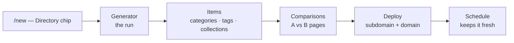

# Quickstart: Build a Directory

A **directory** is the most complete [Work kind](../features/work-kinds.md) Ever Works ships. In the capability registry, `directory` and the legacy `default` kind share one object and it carries everything: items with categories, tags and collections, bulk CSV/Excel import and export, A-vs-B comparison pages, source-health checks, and community pull-request processing. Nothing on this page is marked coming soon — the only thing that can stop you is a provider you have not configured yet.

This guide takes one directory from an empty prompt to a scheduled, deployed site. Expect ten to fifteen minutes at the keyboard; the first generation run itself typically takes **2–5 minutes**, and the dashboard tells you so: _"This may take a few minutes. You can close this page and come back later."_

Routes are written the way you type them, without the locale prefix — the address bar shows `/en/works/new`, this guide says `/works/new`.



## 1. Before you start

| You need              | Why a directory needs it                                                                        | Where it comes from                                                                                              |
| --------------------- | ----------------------------------------------------------------------------------------------- | ---------------------------------------------------------------------------------------------------------------- |
| **An account**        | Everything below is behind the dashboard.                                                       | Register at `/register`, or sign in at `/login` — see [Creating an Account](../features/creating-an-account.md). |
| **An AI choice**      | The pipeline writes descriptions, assigns categories and tags, and drafts comparison articles.  | Onboarding **Step 2 — Your AI choice**. The default, **Ever Works AI**, needs no setup.                          |
| **Git storage**       | Every Work is provisioned as three repositories; you own them.                                  | Onboarding **Step 3 — Your Git Storage**. The default, **Ever Works Git**, is a managed org.                     |
| **A deploy target**   | The site has to land somewhere.                                                                 | Onboarding **Step 5 — Your deployment**: **Ever Works**, **Vercel**, or **Kubernetes**.                          |
| **A search provider** | The Standard Pipeline discovers items by searching the web, then extracting the pages it finds. | Settings → Plugins. Tavily is the default; Brave, Exa and SerpAPI are alternatives.                              |

If you took the defaults in the [setup wizard](../features/onboarding.md), you already have all five and can go straight to step 2. If you skipped the wizard, reopen it at `/onboarding` or change the same choices under **Settings**.

:::note The managed deploy target has two conditions

The **Ever Works** deploy option (`ever-works`) is enabled per platform by an operator flag and capped per account — by default **3** active managed Works. If the flag is off, Work creation quietly stores `vercel` instead, so a Work is never left pointing at a provider that cannot resolve. Because `ever-works` is a platform provider rather than an installed deploy plugin, the Deploy tab's provider dropdown lists only the installed plugins (Vercel, Kubernetes); you choose the managed target at onboarding time, not by switching later. Details in [Managed Hosting](../features/managed-hosting.md).

:::

## 2. Create the directory

### How to: start a directory Work

1. Click **+ New** in the sidebar — it opens `/new`, the one composer for Missions, Ideas, Agents, Tasks and Works.
2. Type what you want in the prompt box, for example: _"Directory of AI coding assistants with reviews, pricing tiers, and editor compatibility."_
3. Click the **Directory** chip. Picking a chip is not just a filter — it writes that kind's worked example into the input, so you start from a real prompt you can edit. The line under the chips reads _"A curated directory site with search, filters, and structured item data."_
4. Submit. The composer forwards you to the Work canvas at `/works/new?mode=ai&kind=directory`, carrying your prompt. You can also skip the composer entirely and deep-link: `/works/new?kind=directory&prompt=…` pre-selects the chip and seeds the prompt.
5. On the canvas — **New Work — with AI** — fill in what you care about:
    - **Work Name** — optional. _"AI will suggest a name if you leave this empty."_
    - **Work Slug** — auto-generated from the name and checked for availability as you type; it becomes the repository names.
    - **Describe Your Work** — the prompt. This is the single most important input; it guides the whole run.
6. Pick a blueprint in the **Work Templates** picker. It filters itself to the kind you chose, so a directory sees directory blueprints first.
7. Open **Advanced Settings** if you want to steer the run (next section), then press **Generate with AI**.

The right-hand sidebar carries two more choices that apply to the Work as a whole: **Git Provider** (where the repositories are created — your personal account or an organization) and **Deploy Provider**.

Prefer the terminal? `ever-works work create` walks the same choices interactively, and `ever-works work generate` runs the pipeline — see [CLI Work Commands](../cli/work-commands.md).

### Advanced Settings — the five provider slots

Advanced Settings exposes the plugin categories the pipeline runs on. Leave them alone and the platform resolves its defaults; change them when you have a reason.

| Slot                  | What it decides                                                                            | Notes                                                                                                                                           |
| --------------------- | ------------------------------------------------------------------------------------------ | ----------------------------------------------------------------------------------------------------------------------------------------------- |
| **Pipeline**          | The orchestrator — how items get discovered, processed and assembled.                      | **Standard Pipeline** (15 structured steps) is the workhorse for directories. **Agent Pipeline** and **Claude Code** give the AI more autonomy. |
| **AI provider**       | Every text task: descriptions, structured extraction, classification, categories and tags. | Three model tiers (simple / medium / complex) are picked per task for you.                                                                      |
| **Search provider**   | The web-discovery phase.                                                                   | Tavily by default; Brave, Exa and SerpAPI are alternatives with different indexes.                                                              |
| **Screenshot**        | Captures a preview image per item URL, shown on item cards.                                | ScreenshotOne, Urlbox. Optional.                                                                                                                |
| **Content extractor** | Fetches a discovered page and strips navigation and ads so the AI reads clean text.        | The built-in Local Content Extractor needs no API key.                                                                                          |

Only configured providers are selectable — an unconfigured one is greyed out, and submitting with one selected raises _"{providers} not configured. Visit Settings → Plugins to set up before generating."_ Below the provider block, the selected pipeline contributes its own **dynamic fields** (target item count, maximum pages to process, capture-screenshots, and more); they change when you switch pipelines because each pipeline plugin publishes its own form schema. The full reference is in [Creating a Work](../features/creating-a-work.md).

### What pressing Generate actually does

1. The AI turns your name and prompt into a slug, a description, and seed keywords.
2. The Work row is created with that metadata.
3. Three repositories are created: `{slug}-data` (structured item data), `{slug}` (rendered markdown), and `{slug}-website` (the deployable site).
4. Generation is dispatched as a background job; the pipeline plugin takes over.
5. You land on the Work, where the run is already streaming.

## 3. Watch the run — and stop it if it is wrong

The **Generator** tab (`/works/:id/generator`) is where a run lives. It has four sub-tabs: **Work** (the generation form and live progress), **Schedule**, **History** and **Comparisons**.

While a run is in flight the form is replaced by **Generation in Progress**: a percentage bar, the current step in words, an items-processed counter, **Show step logs** for the live log stream, and **Stop generation**.

The Standard Pipeline reports these steps, roughly in this order:

| #   | Step shown                               | What is happening                                                         |
| --- | ---------------------------------------- | ------------------------------------------------------------------------- |
| 1   | Comparing prompts                        | Diffing this prompt against the last one to decide what to redo.          |
| 2   | Processing your prompt                   | Turning the prompt into a generation plan.                                |
| 3   | Detecting domain type                    | Working out what kind of subject the directory covers.                    |
| 4   | Generating initial AI items              | A first pass of candidates from the model's own knowledge.                |
| 5   | Creating search queries                  | Query set for the discovery phase.                                        |
| 6   | Searching the web                        | Running those queries through the search provider.                        |
| 7   | Retrieving content                       | Fetching the pages that came back.                                        |
| 8   | Filtering relevant content               | Dropping pages that do not belong.                                        |
| 9   | Processing items from content            | Extracting structured items from what survived.                           |
| 10  | Removing duplicates and aggregating data | Deduplication and merge.                                                  |
| 11  | Processing categories and tags           | Building the taxonomy and assigning it.                                   |
| 12  | Validating sources                       | First pass of [source validation](../features/item-source-validation.md). |
| 13  | Processing quality badges                | Badge evaluation, when enabled.                                           |
| 14  | Generating markdown content              | Writing the markdown repository, then the website repository.             |

Closing the tab does not stop anything. Come back to `/works/:id/generator` — or read the run afterwards on the **History** sub-tab, covered in [Work Changelog](../features/work-changelog.md).

### How to: cancel a run

1. On `/works/:id/generator`, press **Stop generation**. The button confirms with _"Generation cancellation requested."_
2. The API call behind it is `POST /api/works/:id/cancel-generation`, which answers `202` with a `mode` telling you where the cancel landed: `trigger`, `in_process`, `stale`, or `already_finished`.
3. Only a Work currently in the `generating` state can be cancelled; anything else answers `409`. Final state can take a few seconds to settle.

```bash
curl -X POST http://localhost:3100/api/works/<work-id>/cancel-generation \
  -H "Authorization: Bearer <token>"
```

See [Generation Cancellation](../features/generation-cancellation.md) for the full behaviour.

## 4. Shape the items

When the run finishes, the substance of the directory is on the **Items** tab (`/works/:id/items`). It has five sub-tabs:

| Sub-tab           | What you do there                                                                                                                                                   |
| ----------------- | ------------------------------------------------------------------------------------------------------------------------------------------------------------------- |
| **Browse Items**  | Search and page through every item, **Add Item** by hand, edit its display fields or its markdown body, capture a screenshot, reorder, or delete.                   |
| **Categories**    | **Add Category** with a name, description, icon URL and priority (lower numbers sort first). A category with items assigned cannot be deleted until they are moved. |
| **Tags**          | The same CRUD for tags.                                                                                                                                             |
| **Collections**   | **Add Collection** — a curated group with its own name, description, icon and priority — then assign items. The pipeline can also fill collections during a run.    |
| **Source Health** | The status of every item's `source_url`, plus the **Source Health Checks** settings card (step 8).                                                                  |

Categories and tags are not database-only: they are written to `categories.yml` and `tags.yml` in the Work's data repository, so a taxonomy edit is a commit. Background in [Taxonomy System](../features/taxonomy-system.md) and [Collections](../features/collections.md).

### How to: bulk-load items from a spreadsheet

Bulk import/export is a directory-shaped capability, and it is **off by default per Work** — the buttons do not render and the endpoints answer `404` until an owner opts in.

1. Open **Settings → General** (`/works/:id/settings`) and expand **Item Import & Export**.
2. Flip **Enable item export**, **Enable item import**, or both. Optionally change **Max rows per import upload** (1–2000, default 500). **Save Settings**.
3. Back on **Items → Browse Items**, use **Export → CSV** or **Excel (.xlsx)** to download `items-export-<date>.csv`. An export is the safest starting point for an import, because it is exactly the shape the importer expects.
4. Edit the file anywhere — Excel, Numbers, Google Sheets, a script.
5. Press **Import** and walk the five-step wizard: **1. Upload** → **2. Mapping** (one dropdown per column, pre-filled by the auto-mapper) → **3. Preview** (per-row Valid / Invalid / Duplicate) → **4. Confirm** (duplicate handling and default status) → **5. Results**.
6. Steps 1–3 are a dry run: nothing is written until you press **Confirm Import**. The result is one commit, or one pull request, on the data repository.

Column contract, error codes and API endpoints: [CSV & Excel Item Import / Export](../features/item-import-export.md).

## 5. Turn on comparisons

Comparison pages ("A vs B") are one of the strongest SEO surfaces a directory has, and they are a directory-only capability. They need items that are actually comparable — the generator will not pair anything until a category holds at least **3** items (`min_items_for_comparison`, adjustable 2–20).

### How to: generate your first comparison

1. Go to `/works/:id/generator`. On an already-generated Work, press **Show Advanced Options** to reveal the dynamic plugin fields.
2. Set **`comparison_enabled`** to on. While you are there you can set **`comparison_cadence`** (Use Work Schedule / Daily / Weekly / Monthly) and **`comparison_max_mode`** with **`comparison_max`** (a custom limit of 1–500, or all pairs).
3. Open the **Comparisons** sub-tab (`/works/:id/generator/comparisons`).
4. Press **Generate Next** to let the pair-selector pick the best un-compared pair — featured items first, then by `order`, then alphabetically — or **Compare Items** to choose two items yourself.
5. Watch the stages: _Researching A vs B → Analyzing comparison data → Writing comparison article → Saving and publishing._
6. Press **Generate All** to batch the remaining pairs. The dialog states how many are left; a progress bar counts them off, you can **Stop** at any point, and it stops itself after 3 consecutive errors.

Each comparison is stored in the data repository as `comparisons/<slug>/<slug>.yml` plus a markdown article, and carries a summary, a verdict with a winner, and 3–8 scored dimensions. The **AI Model** panel on the same page overrides the provider and model for comparisons only, and toggles the optional 7-section **Extended Analysis**. A scheduler also runs every 6 hours for every Work with comparisons enabled, generating the next best pair. Full reference: [Comparisons](../features/comparisons.md).

## 6. Deploy it

The **Deploy** tab (`/works/:id/deploy`) becomes reachable once the Work has a website repository — before that it redirects back to the Work overview, which is the honest signal that there is nothing to publish yet.

### How to: publish the site

1. Open **Deploy**. If no provider is set yet, the page shows the provider selector on its own; pick one. If the provider needs a token you have not supplied, the page says so instead of failing later.
2. Press **Deploy to {provider}**. Deployment typically takes **1–3 minutes**, and the progress panel below tracks the states (`INITIALIZING`, `QUEUED`, `BUILDING`).
3. On a managed target (`ever-works` or the `k8s` provider in managed-subdomain mode), the **Site URL / Subdomain** card shows your address — _"Your default, managed address on ever.works"_ — with a **Live** badge, or **DNS propagating** until the record is visible. To rename it, type a new label under **Change subdomain** (the `.ever.works` suffix is fixed) and press **Save**. Labels are 3–63 lowercase letters, digits or hyphens, and cannot start or end with a hyphen.
4. To add your own domain, use the **Custom Domains** card: type `example.com`, press **Add**, then create the DNS records the card shows under **Show DNS instructions** — a `CNAME` for a subdomain like `blog.example.com`, the provider's record for an apex. Press **Verify DNS** once the records are live, then redeploy so the domain is merged into the Work's ingress alongside the managed address.

Deeper reading: [Managed Hosting](../features/managed-hosting.md), [Custom Domains](../features/custom-domains.md), [Kubernetes Deployment](../features/k8s-deployment.md).

## 7. Put it on a schedule

A directory that is generated once is a snapshot. Scheduled updates re-run the pipeline on a cadence, with retries and failure handling. The schedule form refuses to arm until the Work has completed at least one manual run — _"Run a manual generation first."_

### How to: automate refreshes

1. Go to `/works/:id/generator/schedule` (the **Schedule** sub-tab).
2. Pick a **Cadence**. The dropdown marks which ones your plan allows.

    | Cadence          | Shown as       |
    | ---------------- | -------------- |
    | `hourly`         | Every hour     |
    | `every_3_hours`  | Every 3 hours  |
    | `every_8_hours`  | Every 8 hours  |
    | `every_12_hours` | Every 12 hours |
    | `daily`          | Every day      |
    | `weekly`         | Every week     |
    | `monthly`        | Every month    |

3. Pick a **Billing mode**: **Subscription** counts the Work against your plan's included scheduled Works; **Pay-per-use** bills per execution and unlocks cadences your plan does not include. Choosing a cadence above your plan while still on Subscription is refused with _"Enable pay-per-use billing to use this cadence."_
4. Set the **Failure limit** (1–10, default 3). After that many consecutive failures the schedule auto-pauses and notifies you. Failed runs are retried after 15 minutes, and a run stuck in `generating` for over an hour is marked failed.
5. Turn on **Create Pull Requests** if you want every scheduled refresh to arrive as a PR to review instead of a direct commit.
6. Optionally override the pipeline or any provider **for scheduled runs only** — the panel shows the active providers for the next run.
7. Press **Save changes**, then **Start Automation**. The summary strip then reports **Status**, **Next run**, **Last run** and **Failures**.
8. **Run now** triggers one immediate run; it requires the schedule to be active and no generation already in flight.

```bash
curl -X PUT http://localhost:3100/api/works/<work-id>/schedule \
  -H "Authorization: Bearer <token>" \
  -H "Content-Type: application/json" \
  -d '{"enable": true, "cadence": "weekly", "billingMode": "subscription"}'
```

Full field list, statuses and endpoints: [Scheduled Updates](../features/scheduled-updates.md).

## 8. Let contributors and link-rot checks keep it honest

Two directory-only loops keep a published directory trustworthy without you reading every row.

### How to: accept community pull requests

1. Make sure the GitHub plugin is configured with a valid token, and the Work has both a main and a data repository linked.
2. Open **Settings → General** → **Community PR** and turn on **Enable Community PR**. Leave **Auto-close PRs after processing** on unless you want to close them yourself.
3. Contributors open a PR against the Work's main repository. There is no strict template — the AI reads the raw diff — but PRs with clear item names, descriptions and URLs extract best.
4. A scheduler sweeps every hour: it reads the diff, extracts structured items, commits them to the data repository with a message linking back to the PR, and comments on the PR listing what was added. Trigger it yourself with `POST /api/works/:id/process-community-prs`.
5. Review what is open on the **Pull requests** tab (`/works/:id/pull-requests`), which lists PRs across the Work's main, website and data repositories, with any agent review attached.

### How to: keep source links honest

1. Go to **Items → Source Health**.
2. In the **Source Health Checks** card, turn on **Enable scheduled checks** and pick a **Check frequency** — hourly, daily, weekly or monthly. If you set none, validation follows the main schedule cadence. Press **Save**.
3. Read the results per item. Validation reports two independent things: **reachability** (`reachable` / `broken` / `unknown`) and **accuracy** (`accurate` / `generic` / `weak` / `unknown`) — because a URL can be perfectly alive and still be too generic to support the item that cites it.
4. On any single item, use **Re-check source** from its actions menu, and **Apply suggestion** when the AI proposes a better URL.

More: [Community PR Processing](../features/community-pr-processing.md), [Item Source Validation](../features/item-source-validation.md).

## Next steps

- **Seed the Knowledge Base.** Each Work has a KB workbench at `/works/:id/kb`. Drop in brand voice, inclusion criteria, the personas you are writing for, and prior research; every later run and every Agent reads from it, so the directory gets more on-brand over time instead of drifting. See [Knowledge Base & Memory](../features/knowledge-base.md).
- **Hire a Work-scoped Agent.** From the Work, **+ New Agent** opens `/works/:id/agents/new` with the scope pinned to this Work. A Work-scoped Agent — a "Directory Curator", a "Source Auditor" — only acts on this one directory, carries its own instructions, budget and heartbeat cadence, and wakes on schedule to decide what to do next. See [Agents](../features/agents.md).
- **Cap the spend.** Set a budget on the Work before you leave it running unattended: [Budgets & Usage](../features/budgets-and-usage.md).
- **Tune the writing.** [Advanced Prompts](../features/advanced-prompts.md) customises the prompts the pipeline steps use, separately from the comparison prompts.

## Troubleshooting

| Symptom                                                  | What it means                                                                                                            |
| -------------------------------------------------------- | ------------------------------------------------------------------------------------------------------------------------ |
| Generate is refused with _"{providers} not configured"_  | A selected slot points at a plugin with no credentials. Configure it under Settings → Plugins, or pick a configured one. |
| The run 400s on the search step                          | No search provider is configured. The Standard Pipeline cannot discover items without one.                               |
| The **Comparisons** sub-tab generates nothing            | No category holds `min_items_for_comparison` items yet (default 3), or every pair is already generated.                  |
| **Export** / **Import** buttons are missing on Items     | Bulk import/export is off for this Work. Turn it on in Settings → General.                                               |
| The **Deploy** tab bounces you back to the Work overview | The website repository does not exist yet — finish a generation first.                                                   |
| The schedule form says _"Run a manual generation first"_ | Schedules unlock after one successful manual run.                                                                        |
| A cadence is greyed out                                  | It is not on your plan. Switch **Billing mode** to **Pay-per-use** to use it anyway.                                     |

## Related

- [Creating a Work](../features/creating-a-work.md) — all three creation methods and the full provider cascade
- [Work Kinds & Capabilities](../features/work-kinds.md) — what each kind has, and why directory has the most
- [Items](../features/items.md) · [Taxonomy System](../features/taxonomy-system.md) · [Collections](../features/collections.md)
- [Comparisons](../features/comparisons.md) · [Scheduled Updates](../features/scheduled-updates.md) · [Generation Cancellation](../features/generation-cancellation.md)
- [Community PR Processing](../features/community-pr-processing.md) · [Item Source Validation](../features/item-source-validation.md) · [CSV & Excel Item Import / Export](../features/item-import-export.md)
- [Managed Hosting](../features/managed-hosting.md) · [Custom Domains](../features/custom-domains.md) · [Website Templates](../features/website-templates.md)
- [Platform Tour](./platform-tour.md) — every other screen in the dashboard
- [The Founder Journey](./founder-journey.md) — where a directory fits in the bigger loop
