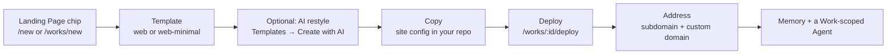

# Quickstart: Ship a Landing Page

A **Landing Page** is the most focused thing you can build in Ever Works: one page with one job — a waitlist, a product launch, a webinar signup, a lead magnet. It is a [Work](../features/creating-a-work.md) like any other — your own Git repositories, your own deploy target — but with a deliberately narrow feature surface: no item catalog, no categories, no comparisons.

This quickstart takes you from an empty account to a live URL in six steps, and it is explicit about the places where you still do the work yourself.

Routes are written the way you would type them, without the locale prefix — the address bar shows `/en/works/new`, this guide says `/works/new`.



:::caution The honest version, up front
`landing-page` is one of the newer Work kinds, and two things are not automated yet: **the platform does not write your landing-page copy**, and the `landing-page` entry in the public blueprint catalog is still a non-selectable placeholder. Everything else below — the kind, the templates, the AI restyling, deploy, domains, Memory, Agents — is shipped and reachable today. Read [What is not automated yet](#what-is-not-automated-yet) before you plan around this page.
:::

## Before you start

| You need                                             | Why                                                                                                           | Where to set it up                                                                 |
| ---------------------------------------------------- | ------------------------------------------------------------------------------------------------------------- | ---------------------------------------------------------------------------------- |
| A connected Git provider (GitHub, GitLab, Bitbucket) | Every Work provisions repositories in an account you own; creation fails without one.                         | Sidebar → **Plugins**, or the provider sidebar on `/works/new`.                    |
| A deploy provider (optional at creation)             | Decides where the site goes live. Without one the website repository is still created, just not deployed.     | The provider sidebar on `/works/new`, or later on `/works/:id/deploy`.             |
| A GitHub connection, for AI template customization   | Custom templates are provisioned as new **private GitHub repositories** — that path is GitHub-only.           | Sidebar → **Plugins** → GitHub.                                                    |
| A code-edit plugin, for AI template customization    | The restyling run is executed by an installed code-edit agent (`claude-code`, `codex`, `gemini`, `opencode`). | Sidebar → **Plugins** → the plugin catalog. See [Plugins](../features/plugins.md). |

Steps 1, 2, 4 and 5 need only the first two rows. Step 3 is optional.

## Step 1 — Create the Landing Page Work

1. Open **+ New** in the sidebar (`/new`), or go straight to `/works/new`.
2. Type what the page is for, then pick the **Landing Page** chip. The composer's placeholder examples show the level of detail that works well — _"Waitlist landing page for an AI customer-support copilot with a hero demo and FAQ"_, _"Webinar registration page with speaker bios, agenda, and a countdown timer"_.
3. Fill in the name and, under **Advanced Settings**, the Git provider, repository owner and deploy provider if you want to override your defaults.
4. Press **Create**. Three repositories are provisioned — `{slug}-data`, `{slug}` and `{slug}-website` — and you land on the Work workspace at `/works/:id`.

The chip you picked is persisted as `work.kind = 'landing-page'`. `landing` is accepted as an alias and normalized to the same value. **Kind is create-only**: `UpdateWorkDto` has no `kind` field, so if you pick the wrong chip, create a new Work rather than trying to convert this one.

### What a Landing Page Work has — and does not

The per-kind capability registry (`packages/contracts/src/domain/work-capabilities.ts`) is what makes a Landing Page workspace narrower than a Directory's. Every surface reads it through `getWorkCapabilities()`, so the API, the agent runtime and the dashboard all give the same answer.

| Surface                                              | Landing Page   | Note                                                       |
| ---------------------------------------------------- | -------------- | ---------------------------------------------------------- |
| **Items** tab, `/works/:id/items`, submissions       | No             | `items.enabled` is `false` — the tab is absent, not empty. |
| Categories, tags, collections                        | No             | Taxonomy is off for this kind.                             |
| Comparisons, community pull-request intake           | No             | Directory-shaped affordances.                              |
| Item import / export, source-URL validation          | No             | Nothing to import into.                                    |
| **Deploy** tab, `/works/:id/deploy`                  | Yes            | The whole point of the kind.                               |
| **Memory** tab (knowledge base), `/works/:id/kb`     | Yes            | See [step 6](#step-6--give-the-page-a-brain).              |
| Repositories: data, provider, work (template output) | Yes, all three | The template checkout lands in the third one.              |

The Overview tab shows four tiles for this kind: **Page Views**, **Conversions**, **Deploy Status**, **Days Active**. The first two are provider-backed — they read _"Connect analytics to see this"_ until an analytics provider is connected to the Work, because a page that has never had analytics has _unknown_ views, not zero.

:::note Create it from the dashboard or the REST API, not the CLI
`ever-works work create` does not prompt for a kind, so a Work created there gets the column default (`default`, which behaves exactly like a Directory). To set the kind programmatically, send `kind: "landing-page"` on `POST /api/works` alongside the required `name`, `slug` and `description`.
:::

## Step 2 — Pick the template: `web` or `web-minimal`

The Work's website repository is a clone of a **base website template**. Two of the four bases are general-purpose rather than directory-shaped, and those are the ones a landing page wants:

| Template      | Name              | Stack                                         | Where the copy lives          | Pick it when                                                              |
| ------------- | ----------------- | --------------------------------------------- | ----------------------------- | ------------------------------------------------------------------------- |
| `web`         | Website           | Next.js App Router, React 19, Tailwind CSS v4 | `apps/web/lib/site.config.ts` | You want the richer section set and room to add interactive pieces later. |
| `web-minimal` | Website (Minimal) | Astro 6, static output, Tailwind CSS v4       | `apps/web/src/config/site.ts` | You want the fastest possible page and near-zero JavaScript.              |

Both ship the same marketing section set — hero, logo cloud, features, how-it-works, testimonials, pricing, FAQ, CTA — plus About / Pricing / Contact pages, a Markdown blog and a 404 page. The `classic` and `minimal` bases are directory templates; do not use them here.

**How the default is resolved.** A Landing Page Work with no explicit `websiteTemplateId` and no saved user preference resolves to `web` (`KIND_DEFAULT_WEBSITE_TEMPLATE` in `website-template.config.ts`). `web-minimal` stays opt-in: choose it in the **Template** picker on `/works/new`, or switch afterwards.

**How to choose or change it.**

1. On `/works/new`, scroll to the **Template** section and pick an entry. The list shows **Your templates** first — every Website Template visible to you, including forked and custom ones — and **Blueprints** second.
2. To change it later, open `/works/:id/settings` → **Website template**.
3. Over the API: pass `websiteTemplateId` on `POST /api/works`, or call `POST /api/works/:id/switch-website-template` with `{ "websiteTemplateId": "web-minimal" }`. The response reports `switchMode: "saved_for_initialization"` — the binding is stored and applied when the website repository is next initialized.

:::note The Landing blueprint is a placeholder
[Work Blueprints](../features/work-blueprints.md) are ready-made Work definitions read from the public `ever-works/works` manifest. The `landing-page` blueprint in that manifest carries `status: "placeholder"` — it is served by `GET /api/work-templates` so coming-soon kinds can render their chip, but placeholders are **never selectable** and never listed in the picker. In practice a Landing Page Work uses the `web` Website Template today, exactly as described above.
:::

## Step 3 — Restyle the template with an AI agent (optional)

Ever Works can point a code-edit agent at a copy of a base template and have it apply **UI-only** changes. This is an enforced boundary, not a suggestion to the model: the orchestrator commits exactly one file and discards everything else.

### What a customization run actually does

1. **Provision.** The base template is cloned and pushed to a **brand-new private repository** in your GitHub account or an organization you belong to (membership is verified server-side; naming an organization you do not belong to is refused with `400`). The repo is named `tpl-<base>-<your-slug>-<6 hex chars>`. It is not a GitHub fork — the fork API allows one fork per account, and you need many custom templates from the same base.
2. **Check the fork is wired.** The run aborts unless a layout file (`apps/web/src/layouts/BaseLayout.astro` for Astro, `apps/web/app/layout.tsx` or `apps/web/src/app/layout.tsx` for Next.js) imports `apps/web/src/styles/theme.css`. If none does, the error tells you to sync the template from its base first.
3. **Run the agent.** Your brief is wrapped in a `<user-request>` delimiter and appended to a base prompt, so the coding agent treats it as opaque design data rather than as instructions.
4. **Enforce the surface.** Only `apps/web/src/styles/theme.css` is committed. Every other changed path is discarded with a log line, and a run that touched nothing inside that surface fails with _"Agent made no changes to the compile-safe styling surface"_.
5. **Reject anything that would not compile.** `theme.css` is processed by Tailwind but is not the Tailwind entry file, so a file containing `@apply`, `@tailwind`, `@theme`, `@source`, `@reference`, `@plugin`, `@config`, `@utility`, `@variant` or `@custom-variant` is rejected and the whole run is discarded.
6. **Commit and push.** The prompt and the agent's summary go into the commit message with control characters collapsed and the text capped at 200 characters, so a prompt cannot forge commit trailers.

### The surface the agent can touch

Restyling happens through two mechanisms, identical across `web` and `web-minimal`.

**Design tokens**, redefined under `:root` (light) and `:root.dark` (dark — both templates toggle the `.dark` class on `<html>`):

```css
:root {
	--color-background: #0b0b12;
	--color-foreground: #f5f5ff;
	--color-primary: #7c5cff;
	--color-primary-foreground: #ffffff;
	--radius-xl: 1.25rem;
	--font-sans: 'Inter', system-ui, sans-serif;
}
```

The full token list is `--color-background`, `--color-foreground`, `--color-card`, `--color-muted`, `--color-muted-foreground`, `--color-border`, `--color-primary`, `--color-primary-foreground`, `--color-accent`, `--font-sans`, `--radius-lg`, `--radius-xl` and `--radius-2xl`. Every Tailwind utility in the template resolves to one of these, so overriding a token re-tints the whole site coherently.

**Component hooks** — stable `[data-component]` and `[data-part]` attributes rendered by the template:

| Group    | Selectors                                                                                                                                                   |
| -------- | ----------------------------------------------------------------------------------------------------------------------------------------------------------- |
| Chrome   | `site-header`, `site-footer`                                                                                                                                |
| Hero     | `hero`, with parts `badge`, `title`, `subtitle`, `actions`                                                                                                  |
| Sections | `logo-cloud`, `features`, `how-it-works`, `testimonials`, `pricing`, `faq`, `cta`                                                                           |
| Cards    | `feature-card` (parts `icon`, `title`, `description`), `pricing-card` (the featured plan carries `[data-featured]`), `testimonial-card`, `step`, `faq-item` |
| Pages    | `blog-list`, `blog-post`, `contact-form`, `not-found`                                                                                                       |

Standard CSS at-rules — `@media`, `@supports`, `@font-face`, `@keyframes` and `@import url(...)` for web fonts — are allowed.

### How to run a customization

1. Go to **Templates** in the sidebar (`/templates`) and stay on the **Website Templates** tab.
2. Press **Create with AI**. The dialog is titled _"Create a custom template with AI"_.
3. Fill it in:
    - **Template name** — shown in your catalog and used to name the new GitHub repo (for example, "Dark Purple Theme").
    - **Base template** — only bases marked AI-customizable are listed. For a landing page choose **Website** (`web`) or **Website (Minimal)** (`web-minimal`); the `classic` directory template is deliberately not customizable.
    - **Code-edit agent** — one of your installed code-edit plugins.
    - **AI provider** — shown only when the chosen plugin declares that it runs against an external LLM.
    - **GitHub destination** — your personal account or an organization you belong to.
    - **Describe the UI you want** — the design brief. Be specific about styling; new features are out of scope.
4. Press **Create custom template** and watch the status: **Queued** → **Provisioning the new repo** → **Agent is applying your changes** → **Pushing changes** → **Customized**.
5. Back on the card, use **Customize again** to run another round on the same repository (each run is a new commit), **View customization status** to re-open the live status, and **Sync from base** to overwrite the repo with the latest base template code.
6. Assign the finished template to your Work: `/works/:id/settings` → **Website template**, or the switch endpoint from step 2.

:::tip No code-edit plugin installed?
The dialog says so plainly — _"No code-edit agent plugins are installed or enabled"_ — and offers **Browse plugin catalog**. Over the API the same situation returns `400` with `Code-edit provider "<id>" is not installed or not enabled for this account.` Skip this step entirely and go to step 4; the base template is production-ready as it ships.
:::

### Customization endpoints

| Method | Endpoint                                      | What it does                                                   |
| ------ | --------------------------------------------- | -------------------------------------------------------------- |
| `GET`  | `/api/templates/customization-providers`      | Installed code-edit plugins usable for a customization run.    |
| `GET`  | `/api/templates/customization-ai-providers`   | Installed AI providers, for plugins that require one.          |
| `POST` | `/api/templates/custom-from-base`             | `{ baseTemplateId, name, prompt, providerId, aiProviderId? }`. |
| `POST` | `/api/templates/custom/:templateId/customize` | Re-run with a fresh prompt against the same repository.        |
| `POST` | `/api/templates/custom/:templateId/sync-base` | Overwrite the custom repo with the latest base template code.  |

```bash
curl -X POST http://localhost:3100/api/templates/custom-from-base \
  -H "Authorization: Bearer <token>" \
  -H "Content-Type: application/json" \
  -d '{"baseTemplateId":"web","name":"Dark Purple Theme","prompt":"Dark theme with subtle purple accents and rounded cards.","providerId":"claude-code"}'
```

## Step 4 — Write the copy

This is the manual half of a landing page today, and it is quick: both general-purpose templates are designed to be rebranded from **one file**.

1. Open the Work's website repository — the one named `{slug}-website`, or your custom template repository if you made one in step 3.
2. Edit the site config: `apps/web/lib/site.config.ts` on `web`, `apps/web/src/config/site.ts` on `web-minimal`. Headline, subheadline, CTA labels, feature copy, pricing tiers, FAQ entries and footer links all live there.
3. Commit and push. The next deploy picks it up.

If you would rather not edit the file by hand, this is a good candidate for a [Task](../features/tasks.md) assigned to the Work-scoped Agent you create in step 6 — the Agent works in the Work's repositories under the same [quality gates](../features/quality-gates.md) and [budgets](../features/budgets-and-usage.md) as everything else.

## Step 5 — Deploy and give it an address

1. Open **Deploy** on the Work (`/works/:id/deploy`).
2. Pick a deploy provider if you did not choose one at creation.
3. Press **Deploy to {provider}** and watch the run — the button reports **Deploying…** and then the live deployment state while it works.
4. Note the address. On the `ever-works` and `k8s` providers a card titled **Site URL / Subdomain** sits directly above **Custom Domains**. It shows the current `*.ever.works` address with a **Live** badge once a DNS record exists, or a **DNS propagating** badge while it does not.

### The managed subdomain

The first deploy allocates a label from your Work's slug and persists it on the Work; later deploys reuse it, so renaming the Work never orphans a live record. On a collision the allocator appends four hex characters of the Work id, then further deterministic candidates.

To rename it, type a new label into **Change subdomain** and press **Save**. The rules the API enforces:

- Lowercase letters, digits and hyphens; no leading or trailing hyphen; 1–63 characters (the form's hint asks for 3–63). Anything else returns `400`.
- Reserved platform labels are refused: `www`, `api`, `app`, `admin`, `mail`, `auth`, `docs`, `status`, `platform`, `dashboard`, `cdn`, `static`, `root`, `mx`, `ns`, `ns1`, `ns2`.
- A label already claimed by another Work returns `409`.
- Re-saving the label you already have is a no-op — DNS is not touched.

HTTPS is handled for you on a `*.ever.works` address; you never provision a certificate. See [Managed Hosting](../features/managed-hosting.md) for the full picture.

### A custom domain on top

A custom domain is **additive** — the managed subdomain stays the Work's primary host, and every active custom domain is merged in as an additional ingress host on the next deploy.

1. In the **Custom Domains** card, add the domain (or `POST /api/deploy/works/:id/domains` with `{"domain": "join.example.com"}`).
2. Configure DNS from the values the response returns: a `CNAME` for a subdomain, an `A` record for an apex domain.
3. Trigger verification (`POST /api/deploy/works/:id/domains/:domain/verify`). Re-run it after DNS propagates if `verified` comes back `false`.
4. Once verified, a provider-assigned URL is automatically promoted to the custom domain.

Full reference: [Custom Domains](../features/custom-domains.md).

## Step 6 — Give the page a brain

A landing page is the surface where tone matters most, and the knowledge base is how you make that tone repeatable across every future edit and every Agent run.

### Load the Memory tab with copy guidance

Open `/works/:id/kb` and use **Add doc**, or drop files into the upload zone. Classify each document — the class is what decides how Agents use it:

| Class      | What to put there for a landing page                           | How Agents treat it                       |
| ---------- | -------------------------------------------------------------- | ----------------------------------------- |
| `brand`    | Positioning, the promise, tone, what you never say.            | Soft guidance.                            |
| `style`    | Editorial rules — sentence length, banned words, voice, tense. | Editorial style guide.                    |
| `personas` | Who the page is written for and what they already believe.     | Audience definitions.                     |
| `seo`      | Target keywords and structured-data patterns for the page.     | Constraints.                              |
| `legal`    | Disclaimers and claims that must appear word for word.         | Copied exactly, never paraphrased.        |
| `glossary` | Product terms and their approved spellings.                    | Term substitution — no invented synonyms. |

`brand`, `legal`, `glossary`, `style`, `personas` and page-matched `seo` documents are injected deterministically into every relevant run, capped by a token budget. The KB is stored in the Work's Git data repository under `.content/kb/` as a `<slug>.md` plus `<slug>.yml` pair per document, so it stays diff-able and yours. See [Knowledge Base](../features/knowledge-base.md).

### Create a Work-scoped Agent

1. Sidebar → **Teams** → **Agents** tab → **+ New Agent**.
2. Give it a name and title and describe its capabilities — for a landing page, something like a "Conversion Editor" that owns the headline, the CTA and the FAQ.
3. Pick a provider and model, or keep your account default.
4. Choose the scope: **Work**, and select this Work. A Work-scoped Agent acts only on its one Work, and can only create or assign work to scopes equal to or narrower than its own.
5. Create it (it starts in `draft`), then open its **Dashboard** tab and press **Start**, optionally setting a heartbeat cadence and a budget.

A Work-scoped Agent's instruction files live in the Work's data repository, so its brain is versioned next to the content it writes about. See [Agents](../features/agents.md).

## What is not automated yet

Keep these in view when you plan around the Landing Page kind.

| Limitation                                                                                                                                                                                                                                 | What to do about it                                                                            |
| ------------------------------------------------------------------------------------------------------------------------------------------------------------------------------------------------------------------------------------------ | ---------------------------------------------------------------------------------------------- |
| **No landing-page copy generator.** The generation pipeline writes directory-shaped data — items, categories, tags, collections, references, comparisons. Nothing writes the general-purpose templates' site config or marketing sections. | Write the copy yourself in step 4, or assign it as a Task to an Agent.                         |
| **The `landing-page` blueprint is a placeholder.** It is served by `GET /api/work-templates` but is never selectable in the picker.                                                                                                        | Use the `web` or `web-minimal` Website Template — that is what a Landing Page Work uses today. |
| **AI template customization is styling only.** One file (`theme.css`), enforced by the orchestrator. New sections, new routes and copy changes are out of scope by design.                                                                 | Treat it as a theming pass; structural changes are ordinary code changes in your repository.   |
| **Customization needs an installed code-edit plugin and GitHub.** Custom template repositories are provisioned on GitHub specifically.                                                                                                     | Skip step 3, or install a code-edit plugin from the catalog first.                             |
| **Page Views and Conversions tiles need an analytics provider.** Until one is connected they read _"Connect analytics to see this"_.                                                                                                       | Connect an analytics plugin to the Work, or read the numbers at your deploy provider.          |
| **The CLI cannot set a Work kind.** `ever-works work create` produces a `default` Work.                                                                                                                                                    | Create Landing Page Works from `/new` or `/works/new`, or send `kind` on `POST /api/works`.    |

## Related

- [Work Kinds & Capabilities](../features/work-kinds.md) — the full capability matrix behind step 1.
- [Website Templates](../features/website-templates.md) — every base template, including `web` and `web-minimal`.
- [Work Blueprints](../features/work-blueprints.md) — the manifest catalog and its placeholder rows.
- [Creating a Work](../features/creating-a-work.md) — the create form in depth.
- [Managed Hosting](../features/managed-hosting.md) and [Custom Domains](../features/custom-domains.md) — addresses, DNS and TLS.
- [Knowledge Base](../features/knowledge-base.md) and [Agents](../features/agents.md) — step 6 in depth.
- [Platform Tour](./platform-tour.md) — every screen this guide sends you to.
- [Quickstart: Launch a Blog](./quickstart-blog.md) — the sibling kind, when one page is not enough.
- [Quickstart: Build a Directory](./quickstart-directory.md) — the widest Work kind, for comparison.
- [Template Catalog API](../api/template-catalog.md) and [Work CLI commands](../cli/work-commands.md) — the programmatic surfaces.
