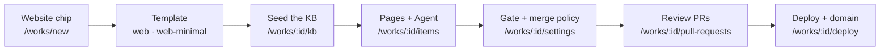

# Quickstart: A Marketing Website

This guide takes you from an empty dashboard to a deployed, agent-maintained marketing site on your own domain. It uses the **Website** Work kind — a multi-page site for a business, service or brand, as opposed to a one-page landing page or a [directory](../features/creating-a-work.md).

Routes are written the way you would type them, without the locale prefix — the address bar shows `/en/works`, this guide says `/works`.



## What a Website Work actually has

Every kind-conditional surface in the platform resolves through one registry — `getWorkCapabilities(kind)` in `@ever-works/contracts` — so a Website Work shows exactly the surfaces its kind uses and hides the directory-shaped ones:

| Capability                 | On a Website Work                                                            | Where it shows up                       |
| -------------------------- | ---------------------------------------------------------------------------- | --------------------------------------- |
| Items surface              | Yes, labelled **Pages**                                                      | The tab strip, and `/works/:id/items`   |
| Taxonomy (categories/tags) | Off                                                                          | —                                       |
| Comparisons                | Off                                                                          | —                                       |
| Community pull requests    | Off                                                                          | —                                       |
| Bulk item import / export  | Off                                                                          | —                                       |
| Source-URL validation      | Off                                                                          | —                                       |
| Deploy                     | Yes                                                                          | The **Deploy** tab, `/works/:id/deploy` |
| Knowledge Base             | Yes                                                                          | The **Memory** tab, `/works/:id/kb`     |
| Overview tiles             | Page views · Registered users · Sessions · Deploy status · Generation status | `/works/:id`                            |
| Repositories provisioned   | Data + provider + website                                                    | `/works/:id/settings`                   |

Three Git repositories are created for this kind. In the persisted vocabulary they are `data`, `work` and `website`; in the UI they read as the **Data Repository**, the **{provider} Repository**, and the **Work Repository** (the template output).

## Before you start

- An **AI provider** connected — `/settings/plugins/ai-provider`. Generation and every Agent call route through it.
- A **git provider** connected, so the Work's three repositories can be created.
- The **editor** role or higher on the Work. Viewers see the Pages list without the **Add Item** button or the row-menu write actions.
- For step 8, a **deploy provider** (`ever-works`, `vercel` or `k8s`). You can add it later — the Deploy tab opens on a provider selector when none is set.

## 1. Create the Work with the Website chip

1. Open `/new` and pick the **Website** chip (the chip row is Mission, Idea, Agent, Task, Website, Landing Page, Blog, Directory, Awesome Repo, Company), or open `/works` and pick **Website** in the composer at the top of the page.
2. Read the line under the chips — _"A multi-page site for a business, service, or brand — generated content + code."_ — then replace the seeded example with your own brief. The seeded examples are real prompts you can edit, for instance _"Marketing site for a B2B SaaS with pricing, integrations, and a documentation hub"_.
3. Submit. The prompt is handed to chat and you land on `/works/new?mode=ai&kind=website` with the AI create form already open. **Create Work Manually** and **Import Existing Work** are the two other doors on the same page.
4. Name the Work, check the slug, and create it.

The same thing over REST — `kind` is validated against the closed set `website · landing-page · blog · directory · awesome-repo · default`, and anything else is coerced to `default`:

```bash
curl -X POST http://localhost:3100/api/works \
  -H "Authorization: Bearer <token>" \
  -H "Content-Type: application/json" \
  -d '{
    "slug": "northwind-studio",
    "name": "Northwind Studio",
    "description": "Marketing site for a boutique design studio",
    "organization": false,
    "kind": "website"
  }'
```

`slug`, `name`, `description` and `organization` are required; `owner`, `gitProvider`, `deployProvider`, `storageProvider` and `websiteTemplateId` are optional and seeded from your onboarding choices when omitted.

## 2. Pick the template

Picking the Website chip already picks a sensible default: the kind-aware resolver maps `website` (and `landing-page`, and `blog`) to the **`web`** template — _"A general-purpose website template (Next.js) for marketing, landing, and content pages — not a directory."_ The Astro sibling **`web-minimal`** is the static alternative. Both expose a plain-CSS `theme.css` surface an Agent can restyle.

In the create flow the template picker layers two sources for the selected chip:

| Group              | What it lists                                                                                                                                               |
| ------------------ | ----------------------------------------------------------------------------------------------------------------------------------------------------------- |
| **Your templates** | Rows from your Website Templates catalog — the built-in `web` / `web-minimal` (and directory) templates plus any custom rows — always first, on every chip. |
| **Blueprints**     | Published rows from the public `ever-works/works` `manifest.json`, `featured` pinned to the top.                                                            |

Today no published manifest row is filed under the `website` chip, so the Blueprints group is empty there unless the catalog is unreachable and the built-in **Classic** / **Minimal** fallback (typed for the website chip) is substituted — the kind default `web` is what a Website Work actually gets when you leave the picker alone.

Blueprints marked `placeholder` are excluded from the pickable list, and if the manifest is cold, rate-limited or unreachable the picker falls back to the built-in **Classic** and **Minimal** rows so it never renders empty. The catalog is cached for an hour and the source ref is pinned with `EVER_WORKS_WORKS_REF` — pin a commit SHA or a version tag in production.

The manifest's production web rows today are `directory`, `directory-minimal` and **`marketing-site`** ("Next.js marketing site with a landing page, feature sections, and content pages for launching a product or brand", forked from `ever-works/ever-works-website-template`); `blog`, `landing-page`, `awesome`, `store` and `company` are placeholders. See [Work Blueprints](../features/work-blueprints.md) for the full catalog, and read the caveat in [What is not finished yet](#what-is-not-finished-yet) before you go looking for the marketing-site row under the Website chip.

To change template after creation:

```bash
curl -X POST http://localhost:3100/api/works/<work-id>/switch-website-template \
  -H "Authorization: Bearer <token>" \
  -H "Content-Type: application/json" \
  -d '{"websiteTemplateId": "web-minimal"}'
```

The response says which of four things happened: `no_change`, `saved_for_initialization` (the website repository does not exist yet), `repository_reset`, or `repository_recreated`. The last two rewrite the website repository — switch before you have hand-edited code in it, or expect to re-apply those edits.

## 3. Seed the Knowledge Base before anything writes copy

A marketing site is mostly claims about your business, so the [Knowledge Base](../features/knowledge-base.md) is not optional housekeeping here — it is the difference between generated copy that sounds like you and generated copy that sounds like nobody. `brand`, `legal`, `glossary`, `style`, `personas` and page-matched `seo` documents are **injected deterministically** into every relevant run; `research` and `freeform` documents are retrieved by similarity and cited.

1. Open the Work and click the **Memory** tab — `/works/:id/kb`.
2. Click **+ New document**, pick a class, and write the body in the markdown editor (WYSIWYG or raw markdown). Metadata — class, tags, status, lock — lives in the front matter or the metadata side panel.
3. Drop your existing material into the **Originals** pane: a PDF brand book, a pitch deck, a positioning doc. The platform stores the original verbatim, runs the content-extractor plugin, and files the agent-readable markdown extract next to it.
4. Lock what must never drift. `full` rejects all agent edits; `additions-only` lets an Agent append but never rewrite.

A workable seed set for a marketing site:

| Document            | Class      | Why it matters here                                                        |
| ------------------- | ---------- | -------------------------------------------------------------------------- |
| `brand/voice`       | `brand`    | Tone, person, and the words you never use. Soft guidance on every run.     |
| `brand/positioning` | `brand`    | What you sell, to whom, and the one sentence every page has to agree with. |
| `personas/buyer`    | `personas` | Who each page is written for.                                              |
| `style/editorial`   | `style`    | Grammar, banned words, tense, heading conventions.                         |
| `seo/keywords`      | `seo`      | Target keywords and structured-data patterns, matched per page type.       |
| `legal/disclaimers` | `legal`    | Copied verbatim or omitted — never paraphrased.                            |

Everything you write lands in the Work's data repository under `.content/kb/<class>/<slug>.md` plus a `.yml` sidecar, so every edit is a Git commit. The same documents are reachable over MCP — the registered tool set is `kb.list`, `kb.get`, `kb.create`, `kb.update`, `kb.lock` and `kb.unlock`, and searching is `kb.list` with its `q` argument rather than a tool of its own — and the CLI (`ever-works kb list|get|lock|unlock|upload …`) or `POST /api/works/:id/kb/uploads` for original files. There is no MCP upload tool; that path is CLI or REST only. See [Knowledge Base — MCP & CLI Reference](../kb/mcp-cli-reference.md) for the argument lists.

## 4. Add pages

On a Website Work the Items surface keeps the machinery and changes the noun: the tab reads **Pages** and lives at `/works/:id/items`.

1. Open the **Pages** tab and stay on **Browse Items**.
2. Click **Add Item**. The **Add New Item** modal opens.
3. Paste a **Source URL** and click **Retrieve** to have the platform fetch the page and pre-fill name, description, tags and images — or skip it and type everything yourself.
4. Fill **Name** and **Description**, then write the page body in **Content (Markdown, optional)**.
5. Pick at least one **Category** — search an existing one, or type a name and click **Create**. The field is required on every kind today (see the caveat below); submitting without one is refused with _"Select at least one category"_. A single `pages` or `site` category is enough for a marketing site.
6. Toggle **Create Pull Request** if you want the change proposed for review instead of committed straight to the default branch.
7. Click **Add Item**. The row appears immediately and the page is committed to the data repository.

Every action on this tab is one commit — or one pull request — in your own Git account. There is no hidden database copy. [Items (Posts, Pages)](../features/items.md) documents the full field list, the markdown editor, the row menu and the machine-access surfaces.

## 5. Hire a Work-scoped Agent

A Work-scoped [Agent](../features/agents.md) only ever acts on this one Work — the right blast radius for "keep the marketing site current".

1. From the Work, open `/works/:id/agents/new`. The scope is pinned to this Work, so you skip the scope picker.
2. Optionally start from a template, or choose **Start from scratch**.
3. Name it something operational — the placeholder suggests _CEO, Reviewer, Content Drafter_; for this job, "Site Editor" or "Content Drafter".
4. Optionally set **Team** and **Reports to**, then click **Create Agent**.
5. Open the Agent and grant only the permissions it needs. Every flag defaults to `false` — `canOpenPullRequests` is what lets it propose changes at all, and merging is governed separately (step 6).
6. Give it a **budget** and, if you want it to act without being asked, a **heartbeat** cron.

## 6. Set the gate and the merge policy

Do this before the Agent starts shipping, not after. The two cards sit next to each other on `/works/:id/settings` for a reason: the [quality gate](../features/quality-gates.md) decides whether a pull request may **exist**, and the [merge policy](../features/merge-policy.md) decides whether an Agent may **land** it.

**Quality gates** card:

1. Set **Checks policy** — `Off — never run checks`, `Warn — run and report only`, or `Required — red blocks`.
2. Set **Max gate attempts** (1–5). On a red required check the Agent is handed the failing check's name, exit code and log tail and asked to fix it, up to this many times.
3. Add **Default checks** — inherited by every Task under this Work, overridable per Task by `id`.

A starting set for a Next.js marketing site (adjust the commands to what your template actually runs):

| id          | kind        | command             | required |
| ----------- | ----------- | ------------------- | -------- |
| `build`     | `build`     | `pnpm build`        | yes      |
| `typecheck` | `typecheck` | `pnpm tsc --noEmit` | yes      |
| `lint`      | `lint`      | `pnpm lint`         | no       |

Checks run with a **scrubbed environment**: a check sees an environment variable only if you name it in that check's `envPassthrough`, and platform-owned configuration is never granted even if you list it. Under `required`, a refused pull request never destroys work — the branch is still written, committed and pushed; only the pull request is withheld, and the failing check ids come back with the refusal.

**Merge policy** card — the platform defaults are deliberately conservative: `allowAgentMerge: false`, `requireGreenGate: true`, `requireHumanApproval: true`, `allowedMergeMethods: ['squash']`, and `main` / `master` / `develop` / `stage` protected. Agents open pull requests; you merge them. When you are ready to loosen that for this Work:

```json
{
	"mergePolicy": {
		"allowAgentMerge": true,
		"requireHumanApproval": false
	}
}
```

Omitted fields inherit, so the green gate stays required and `main` stays protected. Preview the resolved answer — and, more usefully, _where each field came from_ — with `GET /api/merge-policy/resolve?workId=…&agentId=…`.

## 7. Review what the Agent proposes

The **Pull requests** tab (`/works/:id/pull-requests`) lists the open pull requests across every repository this Work declares, grouped per repo and labelled **main repo** / **website repo** / **data repo**. Per-repo failures degrade individually: a Work whose website repository was never generated still shows its main repo's pull requests, with a warning row on the one that failed.

1. Open the tab. The header counts _"{n} open across this Work's repositories"_.
2. Scan the pills on each row: the **state** (Open / Merged / Closed) and the platform's own **review** state (`Reviewed (n)` or `Not reviewed`).
3. Click a row to expand the diff panel — the unified diff per file with additions and deletions, plus the **Agent reviews** list.
4. Click **Request agent review** to run a review now. It calls the same service the git-provider webhook bridge does, so a manually triggered review is identical to an automatic one; the diff reloads and the new review appears in the list.
5. Merge in your git provider — the external-link icon on each row opens the pull request there.

Two labels worth knowing: **Diff truncated** (and the per-file `truncated` marker) means the API capped the patch bytes, so what you see is not the whole change; **not posted to the pull request** on a review means the platform recorded the review but did not publish it to the provider.

## 8. Deploy and put it on your domain

The **Deploy** tab (`/works/:id/deploy`) opens once the website repository exists — before that you are redirected back to the Work overview.

1. Open **Deploy**. With no provider set, you get the provider selector; pick `ever-works` (managed subdomain), `vercel`, or `k8s`.
2. If the provider needs a token you have not configured yet, the tab shows the token alert with a link to the provider — configure it and come back. On a Work shared with you, only the owner can configure that token.
3. Deploy, and watch the progress panel.
4. Use **Subdomain** management for a managed Ever Works address, or add your own domain below it.

For a custom domain the flow is: add the domain, let the platform sync it to the provider, configure DNS, verify, and — once verified — the Work's URL is auto-promoted from the provider-assigned subdomain to yours. A subdomain takes a `CNAME`, an apex domain takes an `A` record; the verification response carries the provider-specific values.

```bash
curl -X POST http://localhost:3100/api/deploy/works/<work-id>/domains \
  -H "Authorization: Bearer <token>" \
  -H "Content-Type: application/json" \
  -d '{"domain": "www.example.com"}'

curl -X POST http://localhost:3100/api/deploy/works/<work-id>/domains/www.example.com/verify \
  -H "Authorization: Bearer <token>"
```

Domain records live in the Ever Works database as the source of truth, so they survive a provider switch and can be re-synced. Full reference: [Custom Domains](../features/custom-domains.md).

## 9. Keep it running

- **Worker** tab (`/works/:id/generator`) — run generation on demand; `/works/:id/generator/schedule` puts it on a cadence. See [Scheduled Updates](../features/scheduled-updates.md).
- **Agent heartbeat** — a cron on the Agent itself, so it wakes up and decides what to do next even with nothing assigned. See [Autonomous Operation](../features/autonomous-operation.md).
- **Activity** tab (`/works/:id/activity`) — every generation, item change, deployment, settings change and schedule run in one feed, filtered by the category chips All, Generation, Items, Deployment, Settings, Comparisons, Community PR, Users, Submissions, Reports and Sync. Agent runs surface on the Agent's own Activity tab. See [Activity](../features/activity.md).

## Reading the Overview tiles

`/works/:id` shows five tiles for this kind, and an unresolved tile shows an em-dash with a hint rather than a fabricated `0`:

| Tile                  | Source                       | Shows `—` when                         |
| --------------------- | ---------------------------- | -------------------------------------- |
| **Page views**        | Connected analytics provider | No analytics provider is connected yet |
| **Sessions**          | Connected analytics provider | No analytics provider is connected yet |
| **Registered users**  | Database count               | Resolution failed                      |
| **Deploy status**     | Derived from the Work row    | The Work has never been deployed       |
| **Generation status** | Derived from the Work row    | Generation has never run               |

"No data yet" and "zero" are different claims, and the tiles keep them different.

## What is not finished yet

:::caution The Website kind is newer than the directory it grew out of

Four honest caveats, all of which affect this guide:

- **The Items page is only half kind-aware.** The capability registry decides whether the **Pages** tab appears and which Overview tiles you get. It does not yet gate the sub-view strip _inside_ the page: a Website Work still renders Categories, Tags, Collections and Source Health, and the underlying API routes are not kind-gated either. Read the capability table above as the statement of intent — see [Work Kinds & Capabilities](../features/work-kinds.md).
- **Pages go through the items pipeline.** Generation writes items, categories, tags, collections, references and comparisons into the data repository; there is no separate `pages/` writer. A Website Work gets the `web` template's code, and its page content is authored as items (the Add Item form still asks for a source URL and a category) or written directly into the website repository by an Agent. Plan for the Agent-plus-review loop in steps 5–7 rather than expecting a one-shot "generate my whole marketing site" run.
- **The `marketing-site` blueprint is filed under a different chip facet.** It is a `production` row in the manifest, but its `chipType` is `marketing`, while the picker's Website chip filters on `website`. If you do not see it, create with the default `web` template and switch afterwards with `POST /api/works/:id/switch-website-template`.
- **There is no CI pill on the Pull requests tab.** The git-provider plugin contract exposes no check-run or commit-status surface, so there is no honest source for one; the review pill you do see is the platform's own record of its own reviews, not your provider's CI. Adding a check-run capability is the documented follow-up.

:::

## Related

- [Work Kinds & Capabilities](../features/work-kinds.md) · [Work Blueprints](../features/work-blueprints.md) · [Website Templates](../features/website-templates.md)
- [Creating a Work](../features/creating-a-work.md) · [Items (Posts, Pages)](../features/items.md)
- [Knowledge Base & Memory](../features/knowledge-base.md) · [Knowledge Base — User Guide](../kb/user-guide.md)
- [Agents (Your AI Employees)](../features/agents.md) · [Quality Gates](../features/quality-gates.md) · [Merge Policy](../features/merge-policy.md)
- [Custom Domains](../features/custom-domains.md) · [Scheduled Updates](../features/scheduled-updates.md) · [Autonomous Operation](../features/autonomous-operation.md)
- [Platform Tour](./platform-tour.md) · [The Founder Journey](./founder-journey.md)
