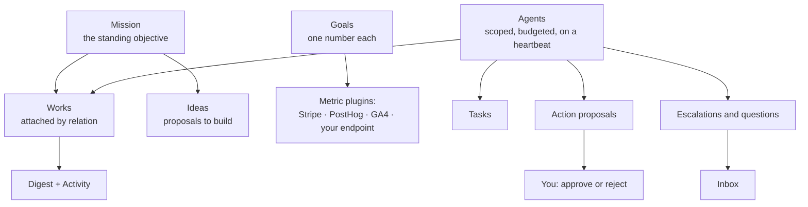

# Run Your Business 24/7 with Agents

Building a website is one afternoon. **Running** the thing afterwards — writing the next post, watching the number that matters, answering the mail, deciding what to build next — is every afternoon after that. This guide is about the second part: how to put a standing AI organization behind a business so the work continues on a schedule, inside limits you set, with you deciding only the things that genuinely need a human.

It assumes you already have at least one [Work](../features/creating-a-work.md) — a directory, a blog, a landing page. If you do not, build one first with the [Directory quickstart](./quickstart-directory.md), then come back.

Routes are written the way you type them, without the locale prefix — the address bar shows `/en/agents`, this guide says `/agents`.

## What you are assembling

| Layer                                  | What it is                                                               | Where it lives                              |
| -------------------------------------- | ------------------------------------------------------------------------ | ------------------------------------------- |
| **[Mission](../features/missions.md)** | The standing objective, and the edge that says which Works serve it.     | `/missions`, `/missions/:id`                |
| **[Goals](../features/goals.md)**      | One number each, read from a metrics plugin on a schedule.               | `/goals`, `/goals/:id`                      |
| **[Agents](../features/agents.md)**    | Named workers with a scope, a heartbeat, a budget and a permission set.  | `/agents`, `/agents/:id`                    |
| **[Teams](../features/teams.md)**      | The grouping and the org chart — who sits where, who reports to whom.    | `/teams`, `/teams/org-chart`                |
| **Guardrails**                         | Per-Agent policy deciding which proposed actions need you.               | The **Guardrails** card on `/agents/:id`    |
| **Operator surfaces**                  | Where the running business reaches you: approvals, questions, briefings. | `/` (dashboard home), `/inbox`, `/activity` |

Each layer is independently useful. You can run Agents with no Mission, or a Mission with no Goals. The combination is what turns a site into an operation.

## 1. Define the Mission, and attach its Works

A [Mission](../features/missions.md) is the long-running objective — _"run the best cat-toy business worldwide"_ — as opposed to a Work, which is one finished thing. The Mission is the unit you pause, budget and hand to a team.

### How to: create the Mission

1. Click **+ New** in the sidebar to open `/new`.
2. Type what the platform should keep working on — the description _is_ the objective.
3. Pick the **Mission** chip and submit.
4. Open the new Mission at `/missions/:id`. It is created **one-shot** by default: it runs once and stops.
5. To make it recurring, flip it to **scheduled** on the detail page and set a cron expression — `0 9 * * *` is every day at 09:00 UTC.
6. Under **Settings**, decide two things before you leave: whether **auto-build Works** is on (each spawned [Idea](../features/ideas.md) is queued for build without you clicking), and the **outstanding-Ideas cap** that stops a runaway Mission filling your queue. The cap resolves per-Mission first, then your account default, then the platform default of **20**.

**Run now** on the detail page triggers a tick immediately, bypassing the cron — for a one-shot Mission that is how you spawn Ideas at all.

### Attach the Works the Mission is responsible for

A Mission does not own Works. It **relates** to them, with an explicit, typed edge — so one Work can serve several Missions over its life, and the same pair can carry more than one relation at once.

Open the **Attached Works** panel on the Mission detail page, pick a Work, choose the relation, and attach. The relation shows as a chip on the row; the remove button detaches the edge and never touches the Work itself.

| Relation     | Use it when the Mission…                                                    |
| ------------ | --------------------------------------------------------------------------- |
| `created`    | …produced this Work (stamped by the build path).                            |
| `improves`   | …works on an existing Work: features, conversion, hardening. _The default._ |
| `operates`   | …runs and maintains the Work day to day.                                    |
| `markets`    | …promotes the Work.                                                         |
| `researches` | …studies the Work or its market rather than changing it.                    |
| `retires`    | …is winding the Work down.                                                  |

Over the API the same three moves are `GET /api/me/missions/:id/works`, `POST /api/me/missions/:id/works` with `{ "workId": "…", "relation": "operates" }`, and `DELETE /api/me/missions/:id/works/:workId/:relation`. Both endpoints must belong to the same owner, and deleting a Mission deletes only these relation rows — the Works survive.

:::note Missions carry their own guardrail override

The Mission detail page has a **Guardrails override** section. Left alone it reports _"No overrides set — using your global Work-agent guardrails"_; set anything there and it reads _"Custom guardrail overrides are active on this Mission."_ The per-Mission caps behind it — works per run, items per Work, budget per run, approval thresholds, dry-run — are documented in [Budgets & Usage](../features/budgets-and-usage.md).

:::

## 2. Give the business numbers — Goals and metric plugins

A [Goal](../features/goals.md) is one number you want to move, checked on a schedule. It reads that number from a **metrics provider plugin**, records a sample, and reports progress toward a target. A Goal does not build anything — that is what the Mission is for.

### The metrics providers that ship today

Four first-party plugins implement the `metrics-provider` capability. All four are **read-only by contract**.

| Plugin ID                  | Metric ID                                 | Windows            | Unit                          | What you configure                                                            |
| -------------------------- | ----------------------------------------- | ------------------ | ----------------------------- | ----------------------------------------------------------------------------- |
| `stripe-metrics`           | `balance_available`                       | point              | your configured currency      | A restricted read-only key (`rk_…`) with Balance: Read + Charges: Read.       |
| `stripe-metrics`           | `gross_volume`                            | day · week · month | your configured currency      | The same key; `currency` (default `usd`) selects which charges are summed.    |
| `posthog-metrics`          | `event_count`, `active_users`             | day · week · month | `count`                       | API host, numeric project ID, and a personal API key scoped to Query: Read.   |
| `google-analytics-metrics` | `active_users`, `sessions`, `conversions` | day · week · month | `count`                       | GA4 property ID plus a service-account JSON key with Viewer on that property. |
| `custom-http-metrics`      | one per endpoint you configure            | point              | your `unit` (default `count`) | A list of GET-only JSON endpoints, each with an `id`, `url` and `valuePath`.  |

Notes that save you an afternoon:

- **Windows are UTC**, and `week` is the ISO week (Monday 00:00 UTC through the following Monday).
- **Stripe's `gross_volume` is single-currency and gross.** Charges in any other currency are excluded and refunds are not subtracted. It walks at most **20 pages / 2,000 charges** per window and then fails loudly with `metric-truncated` rather than undercounting — narrow the window if you hit it.
- **PostHog's `event_count` needs a parameter.** Put the event name in the Goal's **Parameters (JSON)** field: `{ "event": "signup" }`. It travels as a query placeholder, never interpolated into the query text.
- **GA4 renamed conversions to key events.** The `conversions` metric reads `keyEvents`, and a range with no data is a legitimate zero rather than an error — a new property still evaluates.
- **`custom-http-metrics` is deliberately narrow**: GET only, JSON only, no redirects, 1 MB and 15 s ceilings, and every request passes an SSRF guard that blocks private, loopback, link-local, CGNAT and cloud-metadata addresses. `valuePath` is a small dot/bracket resolver (`data.metrics[0].value`), not a full JSONPath engine.

Enable and configure the provider you need under **Settings → Plugins**, category **Metrics** (`/settings/plugins/metrics`), _before_ creating the Goal.

### How to: create a Goal that reads a real number

1. Open `/goals` and choose **New Goal** (`/goals/new`).
2. Give it a **Title** — up to 200 characters, and it cannot be changed later.
3. Enter the **Provider plugin ID** and **Metric ID** from the table above.
4. Add **Parameters (JSON)** if the metric needs them — a JSON object, e.g. `{ "event": "signup" }`.
5. Choose the **Direction** (_At least_ to grow toward a target, _At most_ to stay under one) and the **Target value**. An explicit `0` is valid; a blank field is rejected.
6. Set the **Unit** and the **Window** — Daily, Weekly, Monthly, Total or Point-in-time.
7. Set the **Check frequency** in minutes. The server clamps it to a **15-minute minimum** whatever you type.
8. Save. The Goal is created as a **draft**; nothing is evaluated until you press **Activate**.
9. Press **Evaluate now** once. This is where a wrong plugin ID or an unconfigured provider surfaces — activation deliberately does not verify that the provider exists.

:::caution Match the Window to what the metric supports

`balance_available` and every `custom-http-metrics` endpoint are **point-in-time only**; `gross_volume`, the PostHog metrics and the GA4 metrics are **day / week / month** only. A Goal whose Window the metric cannot serve saves and activates happily, then fails on every evaluation. The placeholder text in the form (`stripe` / `income`) is illustrative and is **not** a working pair — see the warning in [Goals](../features/goals.md).

:::

### Evaluation cadence

The dispatcher fires **every minute** and picks up the Goals that are due; your per-Goal check frequency (≥ 15 minutes) is what actually decides how often each one is read. Every evaluation records a sample, so the progress sparkline on `/goals/:id` fills in over time. **Pause** stops the schedule and keeps the history.

### The loop controls on the Goal page

The Goal detail page also carries **loop controls** — **Start loop**, **Advance now**, **Nudge**, **Pause loop**, **Restart session**, **Cancel loop** and **Adjust limits** — with a status chip reading _Loop running / paused / done / cancelled / stuck_. **Adjust limits** sets a spend cap, a wall-clock limit, a stuck-after-N-iterations threshold, a session budget, a grace period, planner and worker model hints, and a **Pinned agent**.

:::warning The loop needs a pinned agent before it can do anything

Routing only ever considers the Goal's pinned agent plus the agents that have already worked one of its iterations. A Goal created in the dashboard therefore starts with an **empty candidate pool**, and every advance answers `no-candidate-agent` until an operator pins one under **Adjust limits → Pinned agent** (_"No pin (round-robin)"_ is the default). Treat these controls as an advanced surface: the reliable path from a number to work getting done is a [Mission](../features/missions.md) with Agents on it, and a Goal that reports whether it is working.

:::

## 3. Hire the Agents

An [Agent](../features/agents.md) is a named, persistent worker: an identity, a scope, a provider and model, an optional heartbeat, a budget, and a permission set where **every flag defaults to `false`**. You do not have to write one from scratch.

### Where the ready-made roles come from

| Source                     | What it gives you                                                                                                                                                                               | Where                                                                       |
| -------------------------- | ----------------------------------------------------------------------------------------------------------------------------------------------------------------------------------------------- | --------------------------------------------------------------------------- |
| **Agent template catalog** | 12 starter agents — PM, Coder, Researcher, Copywriter, Marketer, Sales, Support, Curator, Growth, Designer, DevOps, Founder — each with a persona, default Skills and a starter knowledge base. | Chips in the Create-Agent wizard, plus **View All** at `/agents/templates`. |
| **Go-to-market presets**   | Six in-code shapes: Content Marketer, SEO Auditor, Lead Researcher, Outreach Drafter, Social Scheduler, Competitive Analyst.                                                                    | The same wizard, and `POST /api/agents/from-template/:slug`.                |
| **Onboarding role kits**   | Your answer to _"what do you do"_ maps to a starter kit of agents **and** Skills. Every role has one — there are no dead ends.                                                                  | The profile step of [onboarding](../features/onboarding.md).                |

A few kits, so you can see the shape:

| Role            | Suggested agents                                         | Suggested Skills                                                                 |
| --------------- | -------------------------------------------------------- | -------------------------------------------------------------------------------- |
| **Founder/CEO** | Content Marketer · Lead Researcher · Competitive Analyst | `digest-compilation`, `competitor-watch`, `campaign-reporting`                   |
| **Marketing**   | Content Marketer · Social Scheduler · SEO Auditor        | `newsletter-drafting`, `social-scheduling`, `seo-audit`, `campaign-reporting`    |
| **Sales**       | Lead Researcher · Outreach Drafter                       | `lead-research`, `lead-scoring`, `outreach-personalization`, `follow-up-cadence` |
| **Engineering** | SEO Auditor · Competitive Analyst                        | `seo-audit`, `news-signal-detection`, `digest-compilation`                       |

The first-party catalog is go-to-market shaped, and it says so: for the roles it covers well the kit is genuinely tailored; for roles it covers loosely — legal, HR, finance — the kit is the nearest useful starting point (a monitoring agent and the reporting Skills) rather than a pretend-tailored recommendation. Every kit is a suggestion you can ignore, and nothing is gated on the answer.

### How to: hire an Agent from a template

1. Open **Teams** in the sidebar, switch to the **Agents** tab, and click **+ New Agent**. (To browse the whole catalog first, open `/agents/templates`; **Use template** there opens the same flow pre-filled.)
2. Pick a template chip, or fill in `name`, `title` and `capabilities` yourself.
3. Choose a provider and model, or keep your account default.
4. Choose the **scope** — see the table below. This is the decision that matters most.
5. Create it. The Agent starts in `draft`; open its **Dashboard** tab and click **Start**.

:::note The catalog is repo-backed, and degrades quietly

The 12 starter agents come from the private [`ever-works/agents`](https://github.com/ever-works/agents) repo, read through the platform GitHub App (or an `EVER_WORKS_AGENTS_TOKEN` / `GITHUB_TOKEN` override on self-hosted installs) and cached for an hour. Every failure path returns an empty list, so the wizard falls back to its built-in shapes and the chips never break — if the catalog looks thin on a self-hosted install, that is the token, not a bug. See [Agents Catalog](../features/agents-catalog.md).

:::

### Tenant scope or Work scope?

| Scope       | The Agent is…                        | Hire at this scope for…                                                           |
| ----------- | ------------------------------------ | --------------------------------------------------------------------------------- |
| **Tenant**  | Available across everything you own. | Company-wide roles: a CEO, a Researcher who feeds every Mission, a Support agent. |
| **Mission** | Visible only inside one Mission.     | A specialist attached to one objective — a market researcher for one bet.         |
| **Idea**    | Scoped to a single Idea.             | Short-lived work on one proposal.                                                 |
| **Work**    | Acting on exactly one Work.          | A Blog Editor for one blog, a Curator for one directory.                          |

An Agent can only create or assign work to scopes **equal to or narrower than its own**, so scope is a containment boundary as well as a filing decision. Start narrow: a Work-scoped Agent that proves itself is easy to re-create at Tenant scope, and an over-broad Agent is harder to reason about later.

## 4. Draw the org chart — Teams and reports-to

Once you have more than a handful of Agents, _"which one owns this?"_ stops being obvious. [Teams](../features/teams.md) is the answer — and it is **organizational, not permissions**: putting an Agent on a team labels it, it does not grant or restrict anything. Access to a Work is granted through [Work Members](../features/work-members.md); what an Agent may _do_ comes from its own permission flags and guardrails.

### How to: build the org chart

1. **Create an organization first.** Teams only exist inside one. Use the **workspace switcher** at the top of the dashboard sidebar (the row labelled "Switch Organization") → **+ Create Organization**. Until an organization exists, `/teams`, `/teams/new` and `/teams/org-chart` all stay gated.
2. Open **Teams** → **New Team**. Fill in **Name** (≤ 200 characters), an optional **Description** (≤ 4000, enforced by the API only), an optional **Parent team**, and an optional **Manager agent**. The slug is derived from the name and is permanent.
3. On the team page, use the **Roster** to add Agents. The roles are **Lead** and **Member** — display labels, nothing more.
4. In **Resources**, attach the Works and Agents this team owns. Attached items link to their own pages, and detaching never deletes the underlying Work or Agent.
5. Set **Reports to** per Agent: open `/agents/:id/settings`, find the **Organization** card, and set **Team** and **Reports to** (default: _No manager_).
6. Open **Org Chart** (`/teams/org-chart`) to see the result: the organization at the root, teams nested by parent, then sub-teams, Agents and human members. Agents with no team hang off the root, chained by who they report to, so nothing is silently hidden. Drag to pan, scroll to zoom, or use **Zoom in** / **Zoom out** / **Fit**.

Nesting is capped at **10 levels**, cycles are rejected, and the depth check counts the whole result — moving a deep subtree under an already-deep parent can fail even when the parent itself sits well above the limit.

:::caution Two traps in the current Teams UI

The roster's **Type** dropdown lists Agent and Member, but **Member is disabled and the value is ignored** — the form always adds an Agent. (The API does accept human members and the Org Chart draws them, so a roster populated another way displays correctly.) And every Teams screen resolves the organization itself by taking the **first** one on your account; if you have several, the sidebar switcher does not move these pages. Both are documented in full in [Teams](../features/teams.md).

:::

## 5. Set the clock and the ceilings

This is the section that turns "I have agents" into "the business runs while I sleep" — and the section that keeps that from getting expensive.

### Heartbeats — the clock

A heartbeat is a cron cadence on the Agent. When it fires, the Agent is asked _"what is the next action you should take? Choose ONE"_ — and it may create a task, comment on an open one, edit one of its own definition files, or observe and do nothing this tick. Set it on `/agents/:id/settings`:

| Cadence option         | Cron          | Good for                                             |
| ---------------------- | ------------- | ---------------------------------------------------- |
| **Manual**             | —             | Agents you drive by hand or by task assignment only. |
| **Hourly**             | `0 * * * *`   | Inbox triage, monitoring, anything reactive.         |
| **Every 6 hours**      | `0 */6 * * *` | Research and competitive watching.                   |
| **Daily at 09:00**     | `0 9 * * *`   | The default rhythm for most roles: one morning pass. |
| **Weekly on Monday**   | `0 9 * * 1`   | Planning, reporting, roadmap upkeep.                 |
| **Monthly on the 1st** | `0 9 1 * *`   | Reviews and retrospectives.                          |

You can also type any cron expression. All matching is **UTC**, deliberately, so daylight saving cannot move your schedule under you.

Mechanics worth knowing:

- The dispatcher runs every `AGENT_DISPATCH_INTERVAL_MINUTES` (**default 1**) and picks up Agents whose next heartbeat is due. The next slot is computed from the **previously scheduled** fire time rather than from "now", so a late dispatcher does not permanently slip your cadence.
- `manual` means the Agent is dispatched **only** by `POST /api/agents/:id/run-now` — or the **Run heartbeat now** button on its Dashboard tab.
- An unparseable cron expression pauses the Agent and records an error log row rather than silently never firing.
- The Agent Dashboard tab shows **Heartbeat** and **Next heartbeat** as stat tiles, and every heartbeat also appears in the account-wide Schedules view (below).
- **Idle behavior** — _Propose work_, _Sleep_ or _Self improve_ — decides what an idle tick is allowed to become.

### Budgets — the ceiling

Each Agent gets one budget row: a cap plus an interval unit of **hour**, **day**, **week**, **month** or **unlimited**, anchored in UTC. Before any AI call the platform checks the remaining headroom for the current period and short-circuits the run when the cap is hit, logging `AGENT_BUDGET_EXCEEDED`. The Agent's **Budgets** tab shows the live snapshot — spend, cap, period start and end, with a **Refresh** — and `GET /api/agents/:id/budget` returns the same numbers.

Agent budgets sit alongside the per-Work, per-Idea, per-Mission and account-wide caps described in [Budgets & Usage](../features/budgets-and-usage.md). Set at least one before leaving anything unattended.

### Guardrails — what needs you

Guardrails are a per-Agent policy evaluated **before** a proposed action reaches your queue. A new Agent has no guardrails, which means it queues **everything** — the conservative default, and a perfectly reasonable permanent setting.

| Setting                       | Values                                                                     | Effect                                                                                  |
| ----------------------------- | -------------------------------------------------------------------------- | --------------------------------------------------------------------------------------- |
| **Dispatch mode**             | Require approval · Autonomous                                              | _Require approval_ queues every proposal. _Autonomous_ may auto-approve unflagged ones. |
| **Auto-approve action types** | `spawn_agent`, `schedule_task`, `send_message`, `budget_override`, `other` | Narrows Autonomous to just these types; everything else still queues.                   |
| **Blocked action types**      | the same list                                                              | Never allowed, in **either** mode; blocked proposals are rejected and recorded.         |

Set them in the **Guardrails** card on `/agents/:id`, or over the API with `PUT /api/agents/:id/guardrails`; `{"guardrails": null}` resets to the queue-everything posture. Risk-flagged proposals — **budget override**, **destructive**, **cross-scope**, **high fan-out** — queue for a human regardless of the mode. The full decision table lives in [Approvals & Escalations](../features/approvals-and-escalations.md).

### The nets underneath

| Net                    | What it does                                                                                                                                                                                                     |
| ---------------------- | ---------------------------------------------------------------------------------------------------------------------------------------------------------------------------------------------------------------- |
| **Auto-pause**         | Each failed run increments the Agent's error count; at **Pause after failures** (default 3, range 1–20) the Agent moves to `error` and its heartbeat is cleared. A successful run resets the count to zero.      |
| **Doom-loop detector** | Recognises a run cycling on the same normalised failure with no progress, stops it, and files a `loop-detected` escalation with the evidence attached. On by default; it only escalates — it never deletes work. |
| **Budgets**            | A per-Agent or per-Work ceiling short-circuits the next AI call and can raise a `budget-stop` escalation.                                                                                                        |
| **Merge policy**       | Decides whether an Agent may land its own pull request at all; a refusal becomes a `merge-refused` escalation.                                                                                                   |

### How to: put one Agent on the clock, safely

1. Open `/agents/:id` and confirm the **Guardrails** card is set to **Require approval**. Tick `budget_override` under **Blocked action types**, then **Save guardrails**.
2. On the **Budgets** tab, set a cap and an interval you would not mind losing — a daily cap is the easiest to reason about.
3. On the **Settings** tab, set **Pause after failures** (3 is the default) and turn on only the permissions this Agent actually needs. Every flag starts off.
4. Set a **Heartbeat cadence** — start at **Daily at 09:00** rather than Hourly — and pick an **Idle behavior**.
5. Click **Run heartbeat now** on the Dashboard tab and watch one tick end to end.
6. Read what it proposed in the **Action approvals** block on the dashboard home before you widen anything.
7. After a few cycles, switch the mode to **Autonomous** and tick only the action types you trust — `schedule_task` and `send_message` are the usual first two. Keep `budget_override` blocked.

## 6. Operate it — approvals, Inbox, digest, schedules

Four surfaces carry everything the running organization needs from you.

### The approval queue on the dashboard home

The dashboard home (`/`) shows an **Action approvals** block with a live count whenever proposals are pending. Each row carries its action type and its risk badges — budget override, destructive, cross-scope, high fan-out — with **Approve** and **Reject** per row and **Approve all** in the header. Bulk approval reports how many were approved and how many were skipped because they had already been decided concurrently, so two operators working the same queue cannot double-apply a decision.

### The Inbox

`/inbox` is the operator message center — the only sidebar entry with an unread badge, sitting one click from the dashboard because a message here can be blocking work right now. It carries four kinds:

| Kind           | Arrives when                                                 | Your reply…                                                           |
| -------------- | ------------------------------------------------------------ | --------------------------------------------------------------------- |
| **Question**   | An agent calls `ask_human` mid-run and parks.                | Un-parks the run, seeded with your answer.                            |
| **Approval**   | Guardrails routed a proposal to a human.                     | Approves or rejects the underlying proposal.                          |
| **Escalation** | A run gave up, or hit a decision above its pay grade.        | Resolves the escalation and resumes the linked run when it is parked. |
| **Notice**     | The platform files an FYI — a budget threshold, for example. | Marks it answered; nothing is routed.                                 |

Approvals and escalations are **mirrors** of their own records, so deciding the same proposal from the dashboard queue and from the Inbox cannot double-apply. The two views are **Active** (`/inbox`) and **Archived** (`/inbox?view=archived`), and notifications deep-link straight to a message with `/inbox?id=<itemId>`.

### The digest

Turn on a briefing so you do not have to go looking. **Settings → Digest** (`/settings/digest`) → **Send me a personal digest** → choose **Daily** or **Weekly** → **Save**. Digests are **off by default**.

- Daily dispatches every day at **07:15 UTC** covering the trailing 24 hours; weekly rides the same run on **Mondays**, covering 7 days.
- It lists agent runs completed and failed, tasks moved to done or review, pull requests opened, events from connected sources, open escalations that need you, and where your Goals stand — every number counted from real rows, with empty sections simply omitted.
- An organization-wide digest is a separate, additive setting on the same page (organizations default to weekly; writing it requires organization-admin authorization).
- Delivery reuses [notifications](../features/notifications.md): an in-app row always, plus a `digest_ready` fanout to any channel you have subscribed — Slack, Discord, Telegram, WhatsApp, Novu.

### Activity → Schedules

`/activity?view=schedules` is the one place that answers _"what is going to run next?"_ across the whole account. It gathers **recurring tasks**, **agent heartbeats**, **Work schedules**, **Mission ticks**, **source validation**, **data sync** and **inbound triggers** into a single list showing **Owner**, **Cadence**, **Next run** and **Status** (Active, Paused, Disabled, Error, Ended), with per-source filter chips and an **Active only** checkbox.

:::note Schedules is a read-only list

You cannot pause, edit or delete a schedule from this page — follow the Owner link to the Work, Agent, Mission or Task and change it there. The one exception is the **Inbound triggers** panel below the list, where you can create, pause, rotate and delete signed webhook triggers. The view also does not poll: reopen it to refresh.

:::

## 7. A weekly operator routine

Once the above exists, running it is a habit rather than a project. This is a routine you can actually keep.

| Cadence       | Do this                                                                                                                                                  | Where                                         |
| ------------- | -------------------------------------------------------------------------------------------------------------------------------------------------------- | --------------------------------------------- |
| **Every day** | Read the digest. Clear the **Action approvals** block. Answer anything parked in the Inbox — an unanswered question is a run stopped dead.               | Digest → `/` → `/inbox`                       |
| **Every day** | Scan the dashboard's "Needs attention" cards: agent errored, schedule failed or paused, generation failed, task blocked, budget exceeded.                | `/`                                           |
| **Weekly**    | Open each Goal and read the sparkline, not just the latest sample. A flat line on an active Goal usually means the provider stopped answering.           | `/goals`, then `/goals/:id`                   |
| **Weekly**    | Check the Mission: outstanding Ideas against the cap, whether auto-build is still the right setting, and whether the attached Works still match reality. | `/missions/:id`                               |
| **Weekly**    | Review every Agent in `error` state. Auto-pause means the failure count hit its fuse and the heartbeat was cleared — fix the cause, then **Resume**.     | `/agents`, status filter **Error**            |
| **Weekly**    | Read the escalation trail. Repeated `loop-detected` or `merge-refused` escalations are a policy problem, not an agent problem.                           | `/inbox`, or `GET /api/escalations`           |
| **Weekly**    | Skim the Schedules view. Anything showing **Error** or **Ended** that you still expect to run is your first fix.                                         | `/activity?view=schedules`                    |
| **Monthly**   | Reconcile spend against the caps: per-Agent budgets, per-Work and per-Mission caps, and the account-wide ceiling.                                        | `/agents/:id` → Budgets, and Settings → Usage |
| **Monthly**   | Re-read your guardrails. Widen what has earned it; block what surprised you.                                                                             | The **Guardrails** card on each `/agents/:id` |
| **Quarterly** | Redraw the org chart. Agents accumulate and teams drift — re-parent, re-assign **Reports to**, archive what is idle.                                     | `/teams/org-chart`                            |

Two rules of thumb that matter more than the checklist:

- **A quiet approval queue is only good news if nothing risky is happening.** Risky proposals queue regardless of mode, so a silent queue plus visible activity means your guardrails are working — while a silent queue and no activity means something is paused.
- **Widen one dial at a time.** Dispatch mode, action types, permissions and budget are four separate controls. Turning them together makes it impossible to tell which one caused the behaviour you did not want.

## What is not automatic yet

Being straight about the edges:

- **The Goal execution loop is partial.** The controls exist on `/goals/:id`, but a Goal created in the dashboard has an empty candidate-agent pool until you pin an agent under **Adjust limits**. The dependable path from a number to work getting done is still a Mission with Agents on it; the Goal reports.
- **Teams grant nothing.** Team membership, the Lead/Member roles and the Manager agent are all descriptive. Permissions come from [Work Members](../features/work-members.md), the Agent's own permission flags, and guardrails.
- **Human members cannot be added to a roster from the UI.** The API accepts them and the Org Chart draws them; the form always adds an Agent.
- **[Company Builder](../features/company-builder.md)** — the organization-as-a-registered-business direction — is still ahead. Prebuilt company templates that arrive with teams, rosters, manager agents and nesting already wired do work today; imported Agents arrive **paused**, so review them before starting anything.

## Related

- [Missions](../features/missions.md) · [Ideas](../features/ideas.md) · [Goals](../features/goals.md) — the objective layer
- [Agents](../features/agents.md) · [Agents Catalog](../features/agents-catalog.md) · [Skills Catalog](../features/skills-catalog.md) — the workforce
- [Teams](../features/teams.md) · [Organizations](../features/organizations.md) · [Work Members](../features/work-members.md) — structure and access
- [Approvals & Escalations](../features/approvals-and-escalations.md) · [Inbox](../features/inbox.md) · [Notifications](../features/notifications.md) — the human-in-the-loop surfaces
- [Digests](../features/digests.md) · [Activity Log & Schedules](../features/activity.md) · [Workers](../features/workers.md) — observability and the background layer
- [Budgets & Usage](../features/budgets-and-usage.md) · [Autonomous Operation](../features/autonomous-operation.md) · [Scheduled Updates](../features/scheduled-updates.md) — limits and cadence
- [Plugins](../features/plugins.md) — where the metrics providers are enabled
- [The Founder Journey](./founder-journey.md) · [Platform Tour](./platform-tour.md) · [Quickstart: Build a Directory](./quickstart-directory.md)
- API reference: [Agents](../api/agents.md) · [Tasks](../api/tasks.md)
