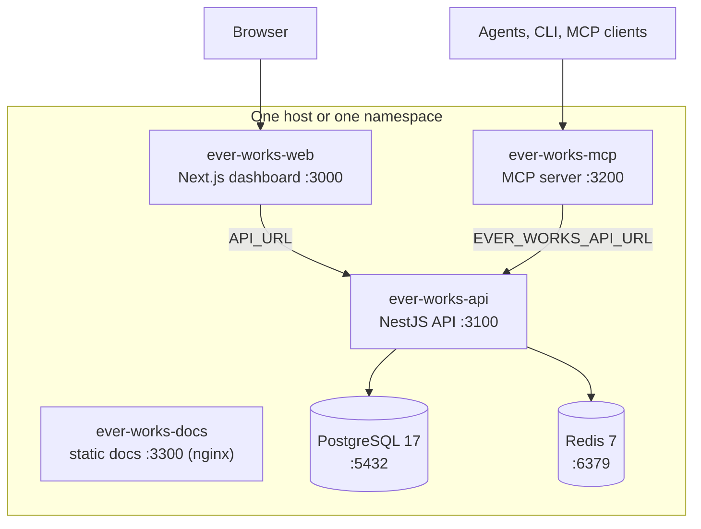

# Self-host with Docker Compose and Kubernetes

Ever Works is AGPLv3 and self-hostable in full. No part of the platform requires the hosted service: the same four container images that run the managed deployment are published to a public registry, and the same Kubernetes manifests that deploy them live in the repository.

There are two supported paths, and one honest gap:

| Path               | What it is                                                                                                  | Where it is defined   |
| ------------------ | ----------------------------------------------------------------------------------------------------------- | --------------------- |
| **Docker Compose** | Five layered Compose files at the repository root — a SQLite demo through to a Postgres + Redis stack.      | `docker-compose*.yml` |
| **Kubernetes**     | Plain manifests for three environments, applied with `envsubst` + `kubectl apply`.                          | `.deploy/k8s/`        |
| **Helm**           | **There is no Helm chart.** No `Chart.yaml` exists anywhere in the repository — copy the manifests instead. | —                     |

Routes in this guide are written without the locale prefix: the address bar shows `/en/settings/job-runtime`, this guide says `/settings/job-runtime`.

## What a full install runs



Four application containers, two backing services. Postgres holds every Work, Agent, Task and credential; Redis backs the distributed rate limiter (`THROTTLER_REDIS_URL`) and the agent queues (`REDIS_URL`).

:::caution Nothing terminates TLS for you

Only the **docs** image runs a web server of its own — it is `nginx:1.27-alpine` serving the built Docusaurus site (`.deploy/docker/docs/Dockerfile`). The web, API and MCP containers publish their ports directly, with no proxy in front. Put your own TLS terminator (Traefik, nginx, Caddy, a cloud load balancer) ahead of ports 3000 and 3100 before you expose the host.

:::

## Two edits before your first `docker compose up`

The committed `.env.compose` and `.env.demo.compose` are **templates**, and two of their values will stop the API process before NestJS even starts. Both checks run at the top of `bootstrap()` in `apps/api/src/main.ts`, before the application module is created, so the symptom is a container that exits immediately and restarts forever.

| Value                     | Why it fails as shipped                                                                                                                                                          | Fix                                                   |
| ------------------------- | -------------------------------------------------------------------------------------------------------------------------------------------------------------------------------- | ----------------------------------------------------- |
| `AUTH_SECRET`             | The template value `secure-cookie-secret-here` is 25 characters. `config.auth.secret()` throws below 32 — the web tier refuses to seal cookies with a shorter secret.            | `openssl rand -base64 48`                             |
| `PLATFORM_ENCRYPTION_KEY` | Absent from both templates. `config.platformEncryptionKey()` requires it unless `NODE_ENV` is `development`, `test` or unset — and the API image sets `ENV NODE_ENV=production`. | `openssl rand -hex 32` (read the encoding note below) |

```bash
# From the repository root, before the first `up`
printf '\nAUTH_SECRET=%s\n' "$(openssl rand -base64 48)"        >> .env.compose
printf 'PLATFORM_ENCRYPTION_KEY=%s\n' "$(openssl rand -hex 32)" >> .env.compose
# ...then delete the original AUTH_SECRET=secure-cookie-secret-here line.
```

`PLATFORM_ENCRYPTION_KEY` must decode to **exactly 32 bytes** — and nothing enforces that at boot. `config.platformEncryptionKey()` (`apps/api/src/config/constants.ts`) only checks that the variable is _present_; the length is never examined there. The decode happens lazily, the first time a secret is written: `apps/api/src/webhooks/webhook-secret.service.ts` accepts hex (64 characters), base64 (44 characters) or raw UTF-8 (32 characters), and on anything else `tryGetKey()` logs at `error` level

```text
PLATFORM_ENCRYPTION_KEY is set but not 32 bytes (got 64 chars)
```

and returns `null` — after which `encrypt()` returns the value **unchanged**, as a dev/test passthrough. The API stays up and the operator secret is stored in plaintext. There is no crash to alert you.

That makes a wrong-length key more dangerous than a missing one, and the trap is easy to fall into: the boot check's own error hint suggests `openssl rand -base64 48`, which produces 48 bytes / 64 base64 characters. That is right for `AUTH_SECRET` and **wrong** here. So after the first boot, grep the API log for the string and treat a hit as stop-the-line:

```bash
docker compose logs ever-works-api | grep 'PLATFORM_ENCRYPTION_KEY is set but not 32 bytes'
```

Anything already saved through **Settings → Plugins** or the integration screens while that message was appearing was written unencrypted. Fix the key, then re-enter and rotate those credentials.

Two more values matter as soon as `NODE_ENV=production` applies, which it always does inside the published images:

- **`WEB_URL`** — `config.webAppUrl()` throws in production rather than silently defaulting to `http://localhost:3000` and breaking every email link and OAuth callback.
- **`ALLOWED_ORIGINS`** — `assertProductionCorsConfig()` (`apps/api/src/cors-validation.ts`) throws when the list is empty in production. Set it to the public origins allowed to call the API with credentials.

## The five Compose files

| File                         | Brings up                                                                       | Store                       | Use it when                                                               |
| ---------------------------- | ------------------------------------------------------------------------------- | --------------------------- | ------------------------------------------------------------------------- |
| `docker-compose.demo.yml`    | api, web, docs (+ mcp behind a profile)                                         | SQLite in volume `api_data` | You are evaluating and want one command, no infrastructure.               |
| `docker-compose.infra.yml`   | `ever-works-db` (postgres:17-alpine), `ever-works-redis` (redis:7-alpine)       | Named volumes               | You run the apps natively with `pnpm dev` but want real backing services. |
| `docker-compose.yml`         | The full platform from published images, **plus the infra file via `include:`** | Postgres + Redis            | This is the self-host default.                                            |
| `docker-compose.build.yml`   | The same services, built from `.deploy/docker/*/Dockerfile`                     | Postgres + Redis            | You are changing the code, or you want an air-gapped build.               |
| `docker-compose.trigger.yml` | Trigger.dev **webapp only**, behind the `trigger` profile                       | Its own Postgres + Redis    | You want the Trigger.dev UI locally. Read the warning below first.        |

`docker-compose.yml` and `docker-compose.build.yml` both start with `include: ./docker-compose.infra.yml`, so Postgres and Redis come up automatically with either — you never pass `-f docker-compose.infra.yml` alongside them.

Published ports: web `3000`, API `3100`, MCP `3200`, docs `3300` (container port 80), Postgres `5432`, Redis `6379`. The Trigger.dev profile deliberately offsets its own services to `3040`, `5433` and `6389` so they can coexist with the platform's.

## Path A — evaluate with SQLite

The demo stack has no Postgres, no Redis and no background-job runtime. It exists so you can see the dashboard in about a minute.

1. Clone the repository and apply the [two secret edits](#two-edits-before-your-first-docker-compose-up) to `.env.demo.compose`.
2. Start it:

    ```bash
    docker compose -f docker-compose.demo.yml --env-file .env.demo.compose up -d
    ```

3. Watch the API come up: `docker compose -f docker-compose.demo.yml logs -f ever-works-api`.
4. Check readiness. The API answers three health routes (`apps/api/src/api.controller.ts`, `apps/api/src/health/health.controller.ts`):

    ```bash
    curl http://localhost:3100/api/health        # status + timestamp
    curl http://localhost:3100/api/health/ready  # readiness + which integrations are configured
    curl http://localhost:3100/api/version       # build version, commit, build time
    ```

5. Open `http://localhost:3000` and create the first account. The docs site is served locally at `http://localhost:3300`.

The API container writes its database to `/app/apps/api/data/database.db` on the `api_data` volume — the compose file pins `DATABASE_PATH` inline, which wins over the `./data/database.db` value in the env file. `RUN_MIGRATIONS=false` is already set there: the committed TypeORM migrations are Postgres/MySQL deltas and fail against a fresh SQLite file.

## Path B — the full stack

This is the shape to run for anything past evaluation.

1. Edit `.env.compose`: the two secrets above, then `WEB_URL`, `NEXT_PUBLIC_WEB_URL` and `ALLOWED_ORIGINS` for your real hostname, then `DATABASE_PASSWORD` (the template ships `ever_works_password`).
2. Bring the stack up. No `-f` flag is needed — `docker-compose.yml` is the default file and it includes the infra file:

    ```bash
    docker compose up -d
    docker compose ps
    ```

3. Confirm both backing services passed their healthchecks. Postgres uses `pg_isready` and Redis a `PING` probe, and the API `depends_on` both with `condition: service_healthy` — so an API that never starts usually means an unhealthy database rather than an application fault.
4. Ask the API what it thinks is wired up:

    ```bash
    curl -s http://localhost:3100/api/health/ready
    ```

    The response reports `configured` and a coarse `mode` for the AI provider, Sentry, PostHog, Trigger.dev, the job runtime, Stripe, email and storage. It deliberately never names the vendor behind each one (`apps/api/src/health/service-detection.ts`).

5. Add at least one AI provider key before you create a Work — `PLUGIN_OPENROUTER_API_KEY`, `OPENAI_API_KEY` or `ANTHROPIC_API_KEY` — or configure the provider in the dashboard under **Settings → Plugins** (`/settings/plugins`). There is no separate provider preflight: without one, the first generation step that asks the AI facade for a provider fails with `No ai provider configured or available`, and a Work or Agent pinned to a provider that is not loaded or not enabled fails with `ai provider not found: <id>` (`packages/agent/src/facades/base.facade.ts`).

### Repointing at managed Postgres and Redis

Every backing-service value lives in `.env.compose`, not in the Compose YAML: the `environment:` blocks in the service definitions are deliberately limited to container-role values (`APP_TYPE`, `PORT`, `API_URL`). A managed database is therefore an env-file edit, not a YAML fork:

```bash
DATABASE_TYPE=postgres
DATABASE_HOST=your-instance.example.com
DATABASE_PORT=5432
DATABASE_USERNAME=ever_works
DATABASE_PASSWORD=...
DATABASE_NAME=ever_works
DATABASE_SSL_MODE=true
REDIS_URL=rediss://your-redis.example.com:6379
THROTTLER_REDIS_URL=rediss://your-redis.example.com:6379
```

The bundled `ever-works-db` and `ever-works-redis` containers then sit idle. Remove the `include:` line if you want them gone entirely, and keep the `depends_on` blocks in mind — dropping the services means dropping those conditions too.

## Path C — build the images yourself

```bash
docker compose -f docker-compose.build.yml up --build -d
```

Each application service gains a `build:` block pointing at `.deploy/docker/{api,web,mcp,docs}/Dockerfile`, and every build context is the repository root because `turbo prune` walks the whole monorepo. The first build takes several minutes; later builds reuse the layer cache. Override the `image:` tags (`ever-works-api:local` and friends) if you intend to push the result to your own registry.

The API Dockerfile takes one build argument worth knowing about: `--build-arg PLUGIN_DISTRIBUTION_MODE=dynamic` produces a **core-only** image instead of baking in every plugin. See [Plugin distribution and the allowlist](#plugin-distribution-and-the-allowlist).

## Optional — self-hosted Trigger.dev

```bash
docker compose -f docker-compose.yml -f docker-compose.trigger.yml --profile trigger up -d
# Trigger.dev webapp: http://localhost:3040
```

:::warning This file runs the webapp only — jobs will queue and never execute

A complete Trigger.dev v4 self-host also needs a supervisor, runner containers, a Docker socket proxy and object storage. None of those are vendored here. With the webapp alone you can browse the management UI and exercise the connection and auth path, but submitted jobs sit in the queue indefinitely. Use Trigger.dev Cloud (set `TRIGGER_SECRET_KEY` and leave `TRIGGER_API_URL` at `https://api.trigger.dev`), follow the upstream production self-host template, or pick a different job runtime — see [Job runtime, storage and vector store](#job-runtime-storage-and-vector-store).

:::

Before starting the profile, fill in the four placeholder secrets in `.env.compose` (`TRIGGER_SESSION_SECRET`, `TRIGGER_MAGIC_LINK_SECRET`, `TRIGGER_ENCRYPTION_KEY`, `TRIGGER_MANAGED_WORKER_SECRET`) with `openssl rand -hex 32` output. They ship empty on purpose, so the webapp refuses to start rather than booting with predictable values. Then set `TRIGGER_ENABLED=true` and `TRIGGER_API_URL=http://ever-works-trigger-webapp:3000`, and pin `TRIGGER_IMAGE_TAG` to a specific v4 release instead of the floating `v4`.

## Environment files and secrets

| File                | Paired with                                      | Committed        |
| ------------------- | ------------------------------------------------ | ---------------- |
| `.env.compose`      | `docker-compose.yml`, `docker-compose.build.yml` | Yes — a template |
| `.env.demo.compose` | `docker-compose.demo.yml`                        | Yes — a template |

Both are tracked files, so editing them in place leaves your secrets in `git status`. To keep them out, put your real values in an untracked `.env.compose.local` and add a `docker-compose.override.yml` — Compose merges that file automatically, with no extra flags:

```yaml
services:
    ever-works-api:
        env_file:
            - .env.compose
            - .env.compose.local
    ever-works-web:
        env_file:
            - .env.compose
            - .env.compose.local
```

List both files explicitly, in that order: later entries win, so `.env.compose.local` overrides the template. Then prove the result before starting anything:

```bash
docker compose config | grep -A3 AUTH_SECRET
```

`docker compose config` prints the fully resolved configuration, which is the fastest way to catch a value that did not land where you thought it did. The precedence rules for `environment:` versus `env_file:` versus `.env` are spelled out in [Docker Compose Setup](../devops/docker-compose.md).

### Values you will almost certainly set

| Variable                                       | Purpose                                                                                                         |
| ---------------------------------------------- | --------------------------------------------------------------------------------------------------------------- |
| `AUTH_SECRET`                                  | Cookie sealing (web) and JWT signing (API). Minimum 32 characters.                                              |
| `PLATFORM_ENCRYPTION_KEY`                      | Master key for operator secrets at rest. Must decode to exactly 32 bytes — the length is not validated at boot. |
| `WEB_URL` / `NEXT_PUBLIC_WEB_URL`              | Public origin of the dashboard. Required in production.                                                         |
| `ALLOWED_ORIGINS`                              | Comma-separated CORS allow-list. Must be non-empty in production.                                               |
| `DATABASE_*`                                   | Engine, host, credentials. `DATABASE_TYPE` is `sqlite`, `postgres` or `mysql`.                                  |
| `REDIS_URL` / `THROTTLER_REDIS_URL`            | Agent queues and the distributed rate limiter.                                                                  |
| `GH_CLIENT_ID` / `GH_CLIENT_SECRET`            | GitHub sign-in. Callback defaults to `${WEB_URL}/api/oauth/github/callback`.                                    |
| `MAILER_PROVIDER` + `SMTP_*` / `RESEND_APIKEY` | Outbound email. Unset or `none` means the faker provider — nothing is delivered.                                |
| `STORAGE_BACKEND`                              | Where uploads land. Defaults to `local-fs`.                                                                     |
| `EVER_WORKS_JOB_RUNTIME`                       | Which background-execution engine the instance dispatches to.                                                   |

The complete list, with types and defaults, is in the [Environment Variables Reference](../environment-variables.md).

## Images and registries

Every application image is built and pushed by GitHub Actions. The prod publish workflow (`.github/workflows/docker-build-publish-prod.yml`) pushes the same build to several registries at once:

| Image | GHCR                                 | Docker Hub              | DigitalOcean                                    |
| ----- | ------------------------------------ | ----------------------- | ----------------------------------------------- |
| API   | `ghcr.io/ever-works/ever-works-api`  | `everco/ever-works-api` | `registry.digitalocean.com/ever/ever-works-api` |
| Web   | `ghcr.io/ever-works/ever-works-web`  | `everco/ever-works-web` | `registry.digitalocean.com/ever/ever-works-web` |
| MCP   | `ghcr.io/ever-works/ever-works-mcp`  | —                       | `registry.digitalocean.com/ever/ever-works-mcp` |
| Docs  | `ghcr.io/ever-works/ever-works-docs` | —                       | —                                               |

The Compose files pull `:latest` from GHCR, and that tag moves. For a deployment you intend to keep, pin something immutable: `.github/workflows/k8s-build.yml` also pushes a `sha-<commit>` tag for all four images to GHCR and then retags a moving `:prod` / `:stage` / `:dev` alias onto it, so `ghcr.io/ever-works/ever-works-api:sha-<commit>` is a stable target. Pinning by digest works too.

One non-obvious detail: the dev and stage environments use _separate image names_ (`ever-works-api-dev`, `ever-works-mcp-stage`, …), not different tags on the prod image.

### The MCP server container

The MCP server is the machine-facing surface — it exposes platform operations as MCP tools for coding agents and MCP clients. In every Compose file it sits behind the `mcp` profile, so it never starts with a plain `up`:

```bash
docker compose --profile mcp up -d ever-works-mcp
```

It needs one decision first. `apps/mcp/src/config/mcp-config.service.ts` reads `EVER_WORKS_MCP_AUTH_MODE`, which accepts `shared-key`, `shared-key-jwt`, `per-user-jwt` and `hybrid` (the default):

| Mode             | Needs `EVER_WORKS_API_KEY` | Allowed under `NODE_ENV=production`                |
| ---------------- | -------------------------- | -------------------------------------------------- |
| `per-user-jwt`   | No                         | Yes — every caller presents their own platform JWT |
| `shared-key-jwt` | Yes                        | Yes                                                |
| `hybrid`         | Yes                        | **No** — refused at boot                           |
| `shared-key`     | Yes                        | **No** — refused at boot                           |

The published MCP image sets `ENV NODE_ENV=production`, so leaving the default `hybrid` in place makes the container crash-loop on that production guard. Set `EVER_WORKS_MCP_AUTH_MODE=per-user-jwt` — exactly what the platform's own `.deploy/k8s/k8s-manifest.mcp.prod.yaml` does, and it needs no shared key at all. If you want `shared-key-jwt` instead, mint the key first in the dashboard under **Settings → API Keys** (`/settings/api-keys`) and pass it as `EVER_WORKS_API_KEY`.

## Kubernetes

The repository ships plain manifests, not a chart. They are applied by GitHub Actions with `envsubst < manifest | kubectl apply -f -`, which is why every secret in them is written as a `"$VARIABLE"` placeholder.

| Manifest                                | Deploys                                                           |
| --------------------------------------- | ----------------------------------------------------------------- |
| `.deploy/k8s/k8s-manifest.dev.yaml`     | API + web, 1 replica each, dev hostnames                          |
| `.deploy/k8s/k8s-manifest.stage.yaml`   | API + web, stage hostnames                                        |
| `.deploy/k8s/k8s-manifest.prod.yaml`    | API + web, 2 replicas each, pod anti-affinity, prod hostnames     |
| `.deploy/k8s/k8s-manifest.mcp.*.yaml`   | The MCP Service, Deployment and Ingress, one file per environment |
| `.deploy/k8s/agentmemory.optional.yaml` | Opt-in self-hosted memory service, applied manually               |

Each environment manifest contains a Service and a Deployment for `ever-works-api` and `ever-works-web`, an nginx Ingress per hostname with `force-ssl-redirect`, and — in prod — a Secret holding the kubeconfigs the platform's own Kubernetes deploy plugin uses when it deploys **your Works** to a cluster. That Secret is unrelated to running the platform itself; drop it if you do not use that provider.

### Applying them to your own cluster

1. Copy the manifest closest to your target — `k8s-manifest.prod.yaml` for a real deployment.
2. **Change the images.** They point at `registry.digitalocean.com/ever/…`. Swap in `ghcr.io/ever-works/ever-works-api:sha-<commit>` and the matching web image, and use `imagePullPolicy: IfNotPresent` once you pin immutable tags.
3. **Change the hostnames.** They appear in the Ingress rules, the TLS `secretName` fields, and in the `WEB_URL` / `API_URL` / `ALLOWED_ORIGINS` and OAuth callback env values. Change all of them together.
4. **Provide the environment.** Export every variable the manifest references, then apply it:

    ```bash
    export AUTH_SECRET=... PLATFORM_ENCRYPTION_KEY=... DATABASE_URL=... \
           SENTRY_DSN= POSTHOG_API_KEY= GH_CLIENT_ID= GH_CLIENT_SECRET=
    envsubst < k8s-manifest.prod.yaml | kubectl apply -n ever-works -f -
    ```

    `envsubst` substitutes the empty string for anything you leave unset. That is fine for optional integrations (the Sentry and PostHog SDKs are graceful no-ops without a key) and fatal for the required ones, which fail fast at boot.

5. **Bring your own database.** The manifests contain no Postgres and no Redis — the platform's own deployment uses managed instances. Point `DATABASE_*` at a managed service, or run an in-cluster operator such as CloudNativePG separately.
6. **Choose a namespace deliberately.** The Deployments and Services are namespace-less, so `kubectl -n` decides, but the Ingress objects hard-code `namespace: default`. Edit that field if you deploy anywhere else.
7. **Deploy the MCP server separately** with the matching `k8s-manifest.mcp.*.yaml`, after making the same image and hostname edits.

### What the prod manifest already does for you

| Concern           | What is set                                                                                                                                     |
| ----------------- | ----------------------------------------------------------------------------------------------------------------------------------------------- |
| Pod hardening     | `runAsNonRoot`, uid/gid 1000, `seccompProfile: RuntimeDefault`, `automountServiceAccountToken: false`, all capabilities dropped                 |
| Rollout           | `RollingUpdate` with `maxSurge: 1`, `maxUnavailable: 0` — the old pod keeps serving if the new one fails                                        |
| Spread            | Soft pod anti-affinity on `kubernetes.io/hostname` for the two API replicas                                                                     |
| Probes (API)      | Liveness and readiness on `/api/health`; a startup probe allowing 60 × 5 s for the plugin warm-up                                               |
| Probes (web, MCP) | Liveness and readiness on `/api/health` (web, port 3000) and `/health` (MCP, port 3200)                                                         |
| Requests → limits | API 672Mi / 300m → 3Gi / 2 cores; web 192Mi / 100m → 512Mi / 500m; MCP 96Mi / 50m → 256Mi / 250m                                                |
| Heap              | `NODE_OPTIONS=--max-old-space-size=2048`, deliberately ~2/3 of the API memory limit so V8 collects before the container is OOM-killed           |
| Schema            | `DATABASE_AUTOMIGRATE=false` — TypeORM `synchronize` must never run against a live database                                                     |
| Ingress           | `nginx.ingress.kubernetes.io/force-ssl-redirect`, plus `proxy-body-size: 10m` on the API so uploads are not truncated by the controller default |

:::danger Never mount a volume at `/app/plugins` in bundled mode

The API image bakes every bundled plugin into `/app/plugins`. An `emptyDir` mounted there shadows them: the plugin loader discovers zero plugins, the registry stays empty, and every AI, search and deploy capability fails with `<capability> provider not found` — including the chat assistant. That is a real outage this project has already had, and the warning is carried in the manifest itself. If you switch to dynamic distribution, point `PLUGIN_INSTALL_DIR` at a separate path such as `/app/plugins-runtime` and mount the writable volume **there**.

:::

For HorizontalPodAutoscaler shapes, secret-creation patterns, multi-replica considerations (cron duplication, connection pools, shared rate-limit counters) and probe tuning, see [Kubernetes Deployment](../devops/kubernetes.md). [DigitalOcean Deployment](../devops/digital-ocean.md) walks a worked cloud example.

## Job runtime, storage and vector store

Three subsystems are plugin-backed, and each is an instance-level operator decision expressed as an environment variable.

| Subsystem      | Variable                      | Default    | Accepted values                                                      |
| -------------- | ----------------------------- | ---------- | -------------------------------------------------------------------- |
| Job runtime    | `EVER_WORKS_JOB_RUNTIME`      | `trigger`  | `trigger`, `temporal`, `bullmq`, `pgboss`, `inngest`, `node` (Fleet) |
| Upload storage | `STORAGE_BACKEND`             | `local-fs` | `local-fs`, `aws-s3`, `minio`, `github-storage`                      |
| Vector store   | `KB_VECTOR_STORE_PROVIDER_ID` | unset      | The id of a loaded vector-store plugin — `pgvector` or `qdrant`      |

How each behaves when you get it wrong is worth knowing:

- **Job runtime.** The API logs the resolved provider at boot (`Active job-runtime provider: '<id>'`) and warns when your value is not a recognised id, falling back to the default rather than failing. Non-default providers still carry an "experimental" warning. If you are not running Trigger.dev at all, `bullmq` or `pgboss` reuse the Redis and Postgres you already have.
- **Storage.** `resolveStorageBackendId()` throws at boot on an unknown value, and the factory additionally probes `isAvailable()` — a bucket that does not exist, or credentials that cannot `HeadBucket`, fail loudly at startup instead of on the first upload. `local-fs` writes under `UPLOADS_DIR`, which means one node unless you mount shared storage.
- **Vector store.** Leaving `KB_VECTOR_STORE_PROVIDER_ID` unset is the normal case: the facade then falls back to the Work's scope-active plugin, and finally to the registry default. Setting it to a plugin that is not loaded is treated as a misconfiguration and throws — an operator pin is deliberate, so it never silently degrades.

Per-tenant overlays are managed in the dashboard rather than in env:

1. Open **Settings → Job Runtime** (`/settings/job-runtime`) to see the instance default and record a tenant-level choice.
2. Platform admins restrict which providers a tenant may pick at `/admin/tenants/:tenantId/runtime-allowlist`.
3. Operators can narrow the global list with `EVER_WORKS_TENANT_RUNTIME_ALLOWED_PROVIDERS` (comma-separated). Empty, or a list of unrecognised ids, falls back to all bundled providers rather than locking the picker.

Per-tenant **credential injection** is not wired yet: choosing `byo` records the choice, the secret pointer and an audit row, but runs still execute against the instance credentials. [Job Runtimes](../features/job-runtimes.md) states that boundary precisely; [Storage Backends](../features/storage-backends.md) covers the upload path end to end; [Secret Stores](../features/secret-stores.md) covers the credential-pointer resolvers.

## Plugin distribution and the allowlist

By default every bundled plugin ships inside the API image and is discovered at boot — no registry calls, no network dependency, no runtime installs. That is `PLUGIN_DISTRIBUTION_MODE=bundled`, and it is the right choice for most self-hosts.

The alternative pulls distributable plugins from an npm-compatible registry on first enable:

| Variable                     | Default                      | Notes                                                                    |
| ---------------------------- | ---------------------------- | ------------------------------------------------------------------------ |
| `PLUGIN_DISTRIBUTION_MODE`   | `bundled`                    | Anything other than `dynamic` coerces to `bundled` — fail-safe.          |
| `FEATURE_DYNAMIC_PLUGINS`    | `false`                      | Gates the catalog, the install/uninstall API and the admin allowlist.    |
| `PLUGIN_REGISTRY_URL`        | `https://registry.npmjs.org` | Point at your own mirror if you run one.                                 |
| `PLUGIN_REGISTRY_GITHUB_URL` | `https://npm.pkg.github.com` | Used when an allowlist row's `source` is `github-packages`.              |
| `PLUGIN_REGISTRY_TOKEN`      | unset                        | Bearer token. Secret — never logged.                                     |
| `PLUGIN_INSTALL_DIR`         | `/app/plugins`               | **Must be writable in dynamic mode.** Use a separate path in Kubernetes. |

Selecting `dynamic` with both registry URLs explicitly cleared fails at boot with a message naming the fix, rather than surfacing later as a confusing 502 on the first install. The image is built differently too: `--build-arg PLUGIN_DISTRIBUTION_MODE=dynamic` keeps only the core plugins inside it, and everything else is fetched at runtime.

### The allowlist

First-party `@ever-works/*` packages are implicitly permitted and have no rows. **Every other package needs an enabled allowlist row before it can be installed**, and no user-facing surface can bypass that.

1. Sign in as a platform admin and open `/admin/plugins/allowlist`. Non-admins get an ordinary 404, not a 403 — the route stays invisible rather than advertising itself.
2. Add a row with the package name, a version range, an optional integrity hash, and a source of `npm` or `github-packages`. Save it with `enabled: false` to register a package without permitting installs yet.
3. Toggle, re-pin or delete rows from the same table. Deleting a row does not uninstall anything already installed — uninstalling is a separate call.

The same operations are available over the API for scripted setups, behind the platform-admin guard:

```bash
# List every entry, enabled and disabled
curl -H "Authorization: Bearer $TOKEN" https://api.example.com/api/admin/plugins/allowlist

# Permit one package at an exact version
curl -X POST -H "Authorization: Bearer $TOKEN" -H 'Content-Type: application/json' \
     -d '{"packageName":"@acme/my-plugin","versionRange":"1.2.3","source":"npm"}' \
     https://api.example.com/api/admin/plugins/allowlist
```

### Admin pages an operator will use

| Route                                        | What it is                                             |
| -------------------------------------------- | ------------------------------------------------------ |
| `/admin/usage`                               | Platform-wide usage and credit consumption             |
| `/admin/plugins/allowlist`                   | Non-first-party packages permitted for runtime install |
| `/admin/tenants/:tenantId/runtime-allowlist` | Which job runtimes a given tenant may select           |

All three dashboard pages answer 404 to non-admins — they call `notFound()` rather than rendering a refusal (`apps/web/src/app/[locale]/(dashboard)/admin/**/page.tsx`), so the route stays invisible instead of advertising itself. The API endpoints behind them are guarded by `IsPlatformAdminGuard` (`apps/api/src/auth/guards/platform-admin.guard.ts`) and answer **403** — which is what the `curl` calls above return for a non-admin token.

## Upgrades

```bash
docker compose pull
docker compose up -d
docker compose logs -f ever-works-api
```

Before running that against a stack holding real data, understand how the schema is applied — there are two paths, and they are configured differently in Compose and in Kubernetes:

| Path                                | Gate                   | Compose default | Kubernetes default |
| ----------------------------------- | ---------------------- | --------------- | ------------------ |
| TypeORM `synchronize` from entities | `DATABASE_AUTOMIGRATE` | `true`          | `false`            |
| TypeORM migrations at API startup   | `RUN_MIGRATIONS`       | `false`         | `true`             |

The Compose stack bootstraps a fresh database with entity sync and leaves migrations off, because the committed migrations are **deltas on top of a synchronised schema**: they are not idempotent, they fail with `column already exists` when both paths run together, and they fail with a missing-table error when run alone against an empty database. The Kubernetes deployment does the opposite — migrations run in-process at API startup (`.deploy/docker/api/entrypoint.sh`) and `synchronize` is forced off, because `synchronize` against a live production database can silently drop columns.

The practical consequence for a durable self-host: bring the database up once with `DATABASE_AUTOMIGRATE=true` against an **empty** database, then switch to `DATABASE_AUTOMIGRATE=false` with `RUN_MIGRATIONS=true` and let migrations carry you forward from there.

Also on upgrade day:

- **Pin the tag you are moving to**, and write down the one you are moving from. `:latest` gives you no way back.
- **Roll one service at a time** (`docker compose up -d ever-works-api`) so a failed API start does not take the dashboard with it.
- **Read the API logs on first boot.** The boot-time validators fail fast and name the offending variable. Then read them again for the things that do _not_ fail fast — `PLATFORM_ENCRYPTION_KEY is set but not 32 bytes` is logged at `error` level while the container keeps serving.
- **Back up first**, every time.

## Backups

Named volumes survive `docker compose down` and are destroyed by `docker compose down -v`. What to capture:

| Volume          | Holds                                      |
| --------------- | ------------------------------------------ |
| `postgres_data` | Everything — Works, Agents, Tasks, secrets |
| `redis_data`    | Queue state (rebuildable, but not free)    |
| `api_data`      | The SQLite file, demo stack only           |

A scheduled `pg_dump` is the minimum. For a production posture — restore drills, RTO and RPO targets, and the ordering of a full rebuild — follow [Disaster Recovery](../devops/disaster-recovery.md).

Worth remembering: the platform database is not the only copy of your work. Each Work's content and code live in **your own Git repositories**, which is the point of the Git-native model, and the platform's own export, import and GitHub-sync surfaces are described in [Data Management](../features/data-management.md).

## Troubleshooting

| Symptom                                                                                                                          | Cause                                                                  | Fix                                                                                                      |
| -------------------------------------------------------------------------------------------------------------------------------- | ---------------------------------------------------------------------- | -------------------------------------------------------------------------------------------------------- |
| API exits instantly with `AUTH_SECRET must be at least 32 characters`                                                            | The template placeholder is 25 characters                              | Generate one with `openssl rand -base64 48`                                                              |
| API exits with `PLATFORM_ENCRYPTION_KEY environment variable is required`                                                        | Not set, and the image runs `NODE_ENV=production`                      | `openssl rand -hex 32`                                                                                   |
| API log shows `PLATFORM_ENCRYPTION_KEY is set but not 32 bytes` (the API stays up; secrets are written in plaintext until fixed) | Wrong encoding or length                                               | Use 64 hex characters, 44 base64 characters, or 32 raw characters — then rotate anything saved meanwhile |
| API exits with `ALLOWED_ORIGINS must be configured in production`                                                                | Empty CORS allow-list under `NODE_ENV=production`                      | Set it to your dashboard and API origins                                                                 |
| MCP container crash-loops on its auth mode                                                                                       | The default `hybrid` is refused when `NODE_ENV=production`             | `EVER_WORKS_MCP_AUTH_MODE=per-user-jwt`, or `shared-key-jwt` plus `EVER_WORKS_API_KEY`                   |
| Chat and generation fail with `<capability> provider not found`                                                                  | A volume is mounted over `/app/plugins`, shadowing the bundled plugins | Remove the mount; in dynamic mode use a separate `PLUGIN_INSTALL_DIR`                                    |
| API refuses to boot citing `PLUGIN_DISTRIBUTION_MODE=dynamic requires…`                                                          | Dynamic mode with both registry URLs cleared                           | Set `PLUGIN_REGISTRY_URL`, or the GitHub Packages fallback                                               |
| Migrations fail with `column already exists`                                                                                     | `DATABASE_AUTOMIGRATE` and `RUN_MIGRATIONS` both on                    | Pick one path — see [Upgrades](#upgrades)                                                                |
| API cannot reach Redis (`ECONNREFUSED 127.0.0.1:6379`)                                                                           | A stale `REDIS_URL` pointing at localhost inside the container         | `REDIS_URL=redis://ever-works-redis:6379`                                                                |
| Port already in use on 3000 / 3100 / 5432 / 6379                                                                                 | Another local service                                                  | Remap the host side of the `ports:` mapping, or stop the conflicting process                             |
| Trigger.dev jobs never start                                                                                                     | The bundled Compose file runs the webapp only                          | Use Trigger.dev Cloud, the upstream self-host template, or another job runtime                           |

## Related

- [Docker Compose Setup](../devops/docker-compose.md) — per-service reference, volume table and env precedence for the same five files
- [Kubernetes Deployment](../devops/kubernetes.md) — HPA shapes, secret patterns, probe tuning and multi-replica caveats
- [DigitalOcean Deployment](../devops/digital-ocean.md) · [CI/CD Pipelines](../devops/ci-cd.md) · [Security](../devops/security.md)
- [Environment Variables Reference](../environment-variables.md) — every variable, typed, with defaults
- [Installation & Prerequisites](../installation.md) — running the apps natively with `pnpm dev` instead
- [Job Runtimes](../features/job-runtimes.md) · [Storage Backends](../features/storage-backends.md) · [Secret Stores](../features/secret-stores.md)
- [Plugins](../features/plugins.md) · [MCP Server](../features/mcp-server.md) · [Knowledge Base & Memory](../features/knowledge-base.md)
- [Data Management](../features/data-management.md) · [Disaster Recovery](../devops/disaster-recovery.md)
- [Platform Tour (Screen by Screen)](./platform-tour.md) — the dashboard your install will serve
