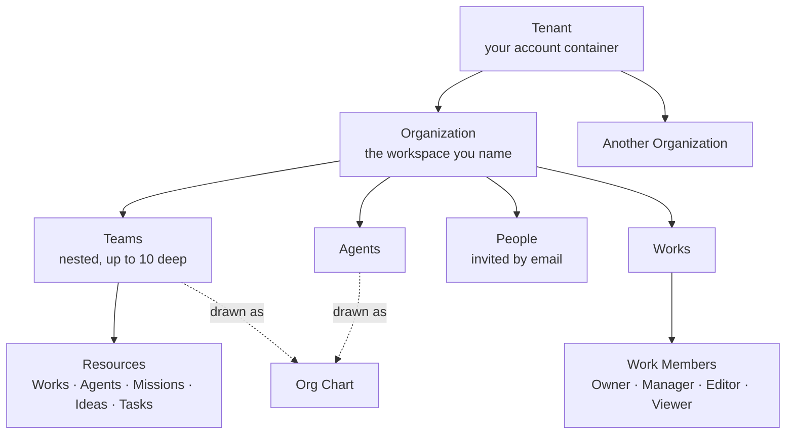

# Teams and Organizations

Ever Works has three separate ideas that all sound like "who works on this", and they do not overlap. This guide walks the whole thing end to end: create the workspace, put people in it, group Agents and humans into Teams, draw the chart, and then hand out the access that actually restricts anything.

Read it in order the first time. Each step below builds on the one before it, and the first step is not optional — Teams do not exist outside an Organization.

Routes are written the way you type them, without the locale prefix — the address bar shows `/en/teams`, this guide says `/teams`.

## The three layers, and which one you want

| You want to…                                                   | Use…                                                  | Does it grant access? |
| -------------------------------------------------------------- | ----------------------------------------------------- | --------------------- |
| Share a whole workspace with a colleague                       | An **Organization** member invitation                 | Yes — workspace-wide  |
| Group Agents and people into Engineering / Marketing / Support | A **Team**                                            | No — labels only      |
| Draw who reports to whom across the company                    | The **Team** hierarchy plus each Agent's _Reports to_ | No — labels only      |
| Let one collaborator edit exactly one website and nothing else | A **Work Member** role (Manager / Editor / Viewer)    | Yes — per Work        |
| Say "these three Works and two Agents belong to Engineering"   | A Team's **Resources** section                        | No — labels only      |

Teams are descriptive. Organization membership and Work Member roles are the two things that decide what a person can actually open.



## Step 1 — Create an Organization

Everything on this page lives inside one. A brand-new account works fine without an Organization, but `/teams` stays gated until one exists.

1. Click the **workspace switcher** — the top row of the dashboard sidebar showing your logo or the current Organization's name (`aria-label` **"Switch Organization"**). When the sidebar is collapsed it is just the icon at the top; clicking it opens the same menu.
2. Choose **+ Create Organization**. (With zero Organizations you can also use the **Create your first Organization** banner on **Settings → Profile**, `/settings`.)
3. Optionally pick a starting point under **Start from** — **Blank organization**, or a prebuilt company (see [Import a prebuilt company](#import-a-prebuilt-company) below). The step only renders when the catalog is reachable.
4. Type a **Name** (1–200 characters). The slug preview underneath is checked live against `GET /api/organizations/check-slug` and reports **Available** or **Taken, try: …**.
5. Optionally expand **Add company vision (optional)** and write the Vision (up to 5000 characters). It is injected into Idea generation, agent-run prompt assembly and Mission tick context for every Agent in this Organization, so it is worth writing.
6. Submit — **Create**, or **Create from template** when a template is selected.

:::caution The "Move your existing items?" dialog appears once, for your first Organization only
Immediately after your **first** Organization is created you are asked whether to move the Missions, Ideas and Works you already have into it. **Move existing items** re-stamps them (`POST /api/organizations/:id/upgrade-from-account`); **Start empty** leaves them in your personal scope. Once a second Organization exists the endpoint answers `409` with `UPGRADE_NOT_AVAILABLE_AFTER_MULTIPLE_ORGS` and the offer is gone for good. Decide before you create the second one.
:::

### Switching between Organizations

Picking an Organization in the switcher persists it as the workspace you land in next login (`POST /api/users/me/scope`) and crosses into it with a fresh page load at `/org/<slug>/dashboard`. That `/org/<slug>` prefix is the canonical shape for every page inside an Organization — `/org/acme/works`, `/org/acme/settings/organization`. Paths without it are your personal scope.

:::warning The Teams screens always use one Organization, and the switcher does not move them
`/teams`, `/teams/new`, `/teams/org-chart`, `/teams/:id`, `/teams/:id/settings` and `/agents/chart` all resolve the active Organization the same way: they take **`orgs[0]`** from your account — the most recently created one. The name shown as a chip in the page header is a label, not a picker. If you run more than one Organization, the Teams surface stays pointed at that one regardless of what the sidebar switcher says. Model your org structure in the Organization you created last, and do not create another one until you are done.
:::

## Step 2 — Invite the people

1. Open **Settings → Organization** (`/settings/organization`; inside an Organization workspace, `/org/<slug>/settings/organization`). If you have several Organizations, a select at the top picks which one you are editing.
2. Scroll to the **Members** block.
3. Type the person's **Email address**.
4. Click **Send invitation**.

| Who the address belongs to                            | What happens                                                                      |
| ----------------------------------------------------- | --------------------------------------------------------------------------------- |
| A stranger, or someone with an account elsewhere      | An email carries a single-use link; the row appears under **Pending invitations** |
| Someone already in this workspace, not on this roster | Added straight away, with no email                                                |
| Someone already on this roster                        | Refused — "That person is already a member of this organization."                 |
| An address that already has a pending invitation      | Refused — revoke the pending one before sending a new one                         |

The invited person lands on the public page `/org-invite/<token>`, which names the Organization, masks the invited address and prints the expiry. To accept they sign in or register **with the invited address** — the token is bound to it, so possession of the link alone is deliberately not enough. Invitations expire after 7 days by default and are throttled to 10 per minute per caller.

:::danger Organization membership is workspace-wide
The invite form says it outright: _"People you invite can see every organization in this workspace, not just this one."_ Access is granted at your account container, so someone invited into one Organization can see every Organization you own. If you need a genuinely narrow boundary for a collaborator, skip this and give them a [Work Member](#step-8--per-work-access-with-work-members) role on the single Work instead.
:::

There is exactly one Organization role today — `member` — and it is display-only, not an authorization input. Every member can invite, revoke, remove other members and edit Organization settings; the workspace owner can never be removed, and you cannot remove yourself.

## Step 3 — Create a team

Teams live at **`/teams`**, which is tab 1 of the Teams hub — **Teams | Agents | Sessions | Archived**.

1. Open `/teams`. With no Organization you get **"Teams live inside an organization"**; go back to Step 1. (The **Create Organization** button in that empty state links to the dashboard home, where the switcher lives — it does not open a create form.)
2. Click **New Team** in the page header, or **Create a team** from the empty state. Either lands on `/teams/new`.
3. Fill the form:

| Field             | Required | Notes                                                                           |
| ----------------- | -------- | ------------------------------------------------------------------------------- |
| **Name**          | Yes      | Up to 200 characters; the input stops at 200 and the API enforces the same cap  |
| **Description**   | No       | Up to 4000 characters — enforced by the API only, so a long paste fails on save |
| **Parent team**   | No       | Defaults to **No parent (top level)**; lists this Organization's existing teams |
| **Manager agent** | No       | Defaults to **No manager**; lists your Agents, first 100                        |

4. Click **Create Team**. You land on the new team's page at `/teams/:id`.

The slug is derived from the name — lowercased, accents stripped, spaces turned into dashes, truncated to 100 characters — must be unique inside the Organization, and **cannot be changed afterwards**. The settings page prints it as read-only text and the update endpoint does not accept it at all.

:::caution Two similar names collide, and the toast will not say so
`Engineering`, `engineering` and `Engineering!` all slugify to `engineering`. The second create is rejected with a slug conflict but the page only shows **"Could not create the team"**. If a create fails on a name that looks fine, check for an existing team that would produce the same slug.
:::

Over the API, the same thing:

```bash
curl -X POST http://localhost:3100/api/organizations/<org-id>/teams \
  -H "Authorization: Bearer <token>" \
  -H "Content-Type: application/json" \
  -d '{"name":"Engineering","description":"Ships and maintains the product Works."}'
```

Team writes are throttled to 30 per minute.

## Step 4 — Staff the roster

The team page shows the header (icon, **Manager** chip, a link up to the parent team, **Settings**), then **Roster**, then **Resources**, then **Sub-teams** — the last one only once the team actually has children.

1. Scroll to **Roster** and find the **Add member** row.
2. Pick a **Type** — **Agent** or **Member**. The choice switches which directory the next field reads: **Agent** offers this Organization's Agents, **Member** offers its people (`GET /api/organizations/:orgId/users`, listed as `username — email`).
3. Pick a **Who**. Anyone already on the roster is filtered out of the list, because that option could only ever fail with a conflict.
4. Pick a role — **Member** (the default) or **Lead**.
5. Click **Add**.

To take someone off, click **Remove** on their row. It acts immediately; there is no confirmation step.

| Role       | What it means                                    |
| ---------- | ------------------------------------------------ |
| **Lead**   | Display label only, shown as a highlighted chip  |
| **Member** | Display label only, the default for anyone added |

Neither role grants anything, and neither does the team's **Manager agent** — it labels the team and positions that Agent on the chart.

:::caution Only your first 100 Agents appear in the pickers
The **Manager agent** select on `/teams/new` and `/teams/:id/settings`, the roster's **Who** select and the Resources Agent list are all fed by a single request for the first 100 Agents, and the same cap applies to the Works offered under Resources. Past 100, the one you want may simply not be in the list — attach it over the API instead.
:::

### Putting an Agent on a team from the Agent's own page

The roster is not the only door. Open `/agents/:id/settings` and the **Organization** card has two selects — **Team** (default **No team**) and **Reports to** (default **No manager**) — with a **Save** button of its own. The **New Agent** dialog carries the same two fields, so an Agent can be born onto a team with a manager already set.

**Reports to** is what draws reporting lines inside a team on both charts. Team membership groups; **Reports to** nests.

## Step 5 — Give the team something to own

The **Resources** section records that a Work or an Agent belongs to this team. It never moves or deletes anything — detaching removes the label, not the object.

1. On `/teams/:id`, open **Attach a resource**.
2. Pick a **Type** — **Work** or **Agent**.
3. Type in the search box to narrow the list, pick the item, and click **Attach**.

Attached items are grouped under five headings — **Works, Agents, Missions, Ideas, Tasks** — each row linking to its own detail page with a **Remove** button. Missions, Ideas and Tasks can be attached through `POST /api/organizations/:orgId/teams/:teamId/resources` and render here when they are; the form itself only offers Work and Agent.

A resource must belong to the same Organization as the team. Attaching something from elsewhere fails as **not found** rather than "not allowed" — that is the deliberate posture described in [Who is allowed to do what today](#who-is-allowed-to-do-what-today), not a bug.

To ask the reverse question — which teams own this Work? — call `GET /api/organizations/:orgId/resource-teams?resourceType=work&resourceId=<id>`.

## Step 6 — Nest the teams

Set a **Parent team** when you create the team, or change it later under **Settings**. Sub-teams appear as cards at the bottom of the parent's page; the parent appears as a chip in the child's header.

| Rule                            | What happens if you break it                                   |
| ------------------------------- | -------------------------------------------------------------- |
| A team cannot be its own parent | Rejected                                                       |
| No cycles                       | Rejected — a team cannot move under one of its own descendants |
| Maximum depth of **10** levels  | Rejected with "Team hierarchy exceeds the maximum depth of 10" |

The depth check counts the **whole** result — the ancestors above the new parent plus the height of the subtree you are moving. Moving a deep subtree under an already-deep parent can fail even when the parent itself sits well above the limit. The settings page pre-filters the dropdown so the team and its descendants are never offered; the server still runs both checks.

**Settings** (`/teams/:id/settings`) edits **Name**, **Description**, **Parent team** and **Manager agent** behind **Save changes**. **Delete team** sits in a red **Danger zone** behind a browser confirmation, and its own description tells you what it does: _"Deleting a team re-parents its sub-teams and removes its roster. Agents and members are not deleted."_ Sub-teams each move up one level and take the deleted team's parent as their own; only the grouping disappears, and it is not reversible.

## Step 7 — Read the chart

Two charts, same renderer, different question.

| Route              | Reached from                                | Shows                                         |
| ------------------ | ------------------------------------------- | --------------------------------------------- |
| `/teams/org-chart` | **Org Chart** in the `/teams` page header   | Teams, Agents **and** human members           |
| `/agents/chart`    | The **Agents Chart** link on the Agents tab | The same tree with human members stripped out |

Both draw the Organization as the root and nest from there:

- Teams nest by parent. Inside a team: sub-teams first, then Agents, then human members.
- Agents are ordered so an Agent whose **Reports to** manager sits on the same team is drawn after that manager. Ordering is otherwise alphabetical and deterministic.
- Agents with no team hang off the root, chained by who they report to.
- A dangling or cyclic parent chain degrades to a top-level card rather than breaking the chart.

Drag to pan, scroll to zoom, or use **Zoom in** / **Zoom out** / **Fit**. Clicking a team card opens `/teams/:id`; clicking an Agent card opens that Agent. With no teams and no Agents you get **"Nothing to chart yet"** instead; with no Organization, **"Create an organization to see its Org Chart."**

Fetch the same data yourself with:

```bash
curl http://localhost:3100/api/organizations/<org-id>/org-chart \
  -H "Authorization: Bearer <token>"
```

The payload is deliberately flat — teams carrying `parentTeamId`, agents carrying `reportsToAgentId`, members, plus each node's team projections. The tree is built client-side, so you can lay it out however you like.

## Import a prebuilt company

Rather than staffing an Organization by hand, you can materialize one that already has its teams, Agents, their skills, and some starting Works and Tasks. The packages live in the public [`ever-works/orgs`](https://github.com/ever-works/orgs) catalog.

1. Open the workspace switcher and click **+ Create Organization**.
2. Under **Start from**, pick a company. Each card shows its agent and team counts.
3. Optionally change the **Name** — the override drives both the display name and the derived slug.
4. Click **Create from template**.

| From the package | Becomes                                       | Cap |
| ---------------- | --------------------------------------------- | --- |
| `COMPANY.md`     | The Organization                              | —   |
| `TEAM.md`        | A Team, with its roster and its manager Agent | 20  |
| `AGENTS.md`      | An Agent — **paused**, with no heartbeat      | 50  |
| `SKILL.md`       | A Skill, bound to the Agents that declare it  | 60  |
| `PROJECT.md`     | A **draft** Work                              | 20  |
| `TASK.md`        | A Task                                        | 200 |

The response is a report — `created` counts per entity type plus a `skipped[]` array. Per-entity failures are reported, not thrown: the Organization and everything that did import survive.

Over the API it is two calls, and the import is throttled to 5 per minute:

```bash
curl http://localhost:3100/api/org-templates \
  -H "Authorization: Bearer <token>"

curl -X POST http://localhost:3100/api/organizations/import-company \
  -H "Authorization: Bearer <token>" \
  -H "Content-Type: application/json" \
  -d '{"templateSlug":"<slug-from-the-catalog>","name":"Acme Inc."}'
```

:::caution Imported Agents arrive paused, on purpose
Nothing starts running by itself. Imported Agents have no heartbeat cadence and stay inactive until you enable them, so you can read what a template actually staffed you with — and what it is permitted to do — before any of it wakes up. Imported Works arrive as drafts for the same reason. Walk the Org Chart first, then turn Agents on one at a time.
:::

If the **Start from** step is missing entirely, the catalog was unreachable. Every failure path returns an empty list and the step simply does not render — Organization creation itself never breaks because of it. The catalog is read from `ever-works/orgs` and cached for an hour; a GitHub App installation or a token (`EVER_WORKS_ORGS_TOKEN`, then `GITHUB_TOKEN`) is a rate-limit optimization, never a requirement, because the repository is public. Pin `EVER_WORKS_ORGS_REF` to a commit SHA or a `vX.Y.Z` tag in production — a mutable ref logs a supply-chain warning on every fetch.

An imported Organization is a plain Organization: no registration provider, no linked Company Work. Importing is not registering.

## Register a Company (v1)

"Company" and "Organization" are the same row wearing two labels — **Organization** in Settings and the switcher, **Company** on the create surface. Registering is a second door into the same object, with one extra thing attached: a backing Work of kind `company` that stands for the registration record.

1. Open **`/new`** (the **+ New** button under the workspace switcher).
2. Pick the **Company** chip. The **Register Company** dialog opens immediately — the prompt box above it is ignored for this chip. Landing on `/new?type=company` opens the dialog for you.
3. Fill in **Company name** (1–200 characters) and, optionally, **Country (ISO 3166-1)** — a two-letter code such as `US` or `DE`, normalized to uppercase server-side.
4. Click **Register**.

The API then creates a draft Work of kind `company`, creates the Organization linked to it with `registrationProvider = "manual"` and `registrationStatus = "registered"`, and transitions the Work to `registered`. If this is your first Organization you get the same **"Move your existing items?"** dialog from Step 1; otherwise you land straight on `/org/<slug>/dashboard`.

:::note What "v1" means here — nothing is filed with any registrar
The dialog says so under the form: _"Manual registration for v1. Stripe Atlas integration is coming — your Organization will be linked automatically once it ships."_ No paperwork is submitted, no jurisdiction workflow runs, and the country code is recorded rather than acted on. The Company Work provisions no website or repository of its own. What you get is a real, usable Organization with the registration metadata preserved, so an incorporation provider can be attached later without re-keying anything. The lifecycle states `draft → pending → registered` already exist for that day; manual registrations land directly in `registered`.
:::

## Step 8 — Per-Work access with Work Members

This is the layer with real roles. Use it when someone should touch one Work and nothing else.

| Role        | What they can do                                            | Assignable?   |
| ----------- | ----------------------------------------------------------- | ------------- |
| **Owner**   | Everything, including deleting the Work                     | No (implicit) |
| **Manager** | Invite and remove members, edit content, trigger generation | Yes           |
| **Editor**  | Edit content and items, cannot manage members               | Yes           |
| **Viewer**  | Read-only access                                            | Yes           |

To bring someone onto a Work:

1. Open the Work, then **Settings → Members** (`/works/:id/settings/members`). The page is Manager-and-above only — an Editor or Viewer who types the URL gets a 404. (`/works/:id/members` redirects here.)
2. Click **Invite member**.
3. Choose the mode. **Direct** takes an email and a role and creates the membership immediately — the person must already have an Ever Works account, and there is no acceptance step. **Link** issues a claim URL you can copy and send yourself, at role `manager`, `editor`, `viewer` or `owner-claim`.
4. Send it. A direct invitee gets an email naming the Work, their role, and a link to it.

The Work creator is always the Owner, is not listed among the members, and cannot leave their own Work — ownership cannot be transferred. Every other member can leave with `POST /api/works/:id/members/leave`.

## Who is allowed to do what today

Two honest notes, so you size your expectations correctly.

**Organization level is all-or-nothing.** Authorization for `/api/organizations/:orgId/...` is a single check — your account's workspace container must be the Organization's. Write routes already carry an admin seam (`@OrgAdmin()`), but that seam resolves to exactly the same check as reading, deliberately: shipping an "admin" option that grants nothing would be worse than having none. So today, any member of the Organization can create, edit, re-parent and delete every team in it, and the Lead/Member labels on a roster are not part of any check.

**Failures answer "not found", never "forbidden".** Every Organization-scoped route returns `404` on any failure — an unknown id, or an id that exists in someone else's workspace. That is on purpose: a probe cannot tell the two apart, so other people's Organization ids stay opaque. When an attach or a fetch you expected to work reports "not found", the first thing to check is whether the object is in the Organization you think it is.

## Troubleshooting

| Symptom                                               | Cause and fix                                                                                                                         |
| ----------------------------------------------------- | ------------------------------------------------------------------------------------------------------------------------------------- |
| `/teams` shows "Teams live inside an organization"    | No Organization yet. Use the sidebar switcher → **+ Create Organization**; the button in that empty state only links to the home page |
| The Teams pages show the wrong Organization           | They resolve `orgs[0]`, your most recently created Organization; the sidebar switcher does not move them                              |
| "Could not create the team" on a perfectly good name  | A slug collision with an existing team. Rename to something that slugifies differently                                                |
| A long description will not save                      | The 4000-character API cap is not enforced in the browser. Shorten it                                                                 |
| The Agent or Work you want is not in a picker         | The pickers load only the first 100 of each. Attach it over the API instead                                                           |
| No **Start from** step in the create dialog           | The prebuilt-company catalog was unreachable. Creation still works, the templates just are not offered                                |
| Imported Agents are doing nothing                     | Correct — imports arrive paused with no heartbeat. Enable them one at a time                                                          |
| A button will not take a click on a narrow window     | Below roughly 768px the AI chat drawer overlays page content. Close it or widen the window                                            |
| `/works/:id/settings/members` 404s for a collaborator | That page is Manager-and-above by design. An Editor or Viewer cannot open it                                                          |

## Related

- [Organizations](../features/organizations.md) — the workspace, invitations, the Vision field, and the full API reference.
- [Teams](../features/teams.md) — the Teams feature page in reference form.
- [Work Members](../features/work-members.md) — the per-Work role model and its endpoints.
- [Agents](../features/agents.md) — the AI workers you put on a roster, and their **Reports to** field.
- [Agents Catalog](../features/agents-catalog.md) — ready-made Agents to staff a team with.
- [Company Builder](../features/company-builder.md) — where the organization-as-a-business surface is heading.
- [Merge Policy](../features/merge-policy.md) — the Organization scope of the policy chain.
- [Memory](../features/memory.md) — organization-level documents inherited by every Work.
- [Run Your Business 24/7 with Agents](./run-your-business-24-7.md) — what to do once the org chart is populated.
- [The Founder Journey](./founder-journey.md) — the same territory as a start-to-scale playbook.
- [Teams & Organizations (advanced)](../advanced/teams-and-organizations.md) — the Tenant/Organization model, scope tiers and the ownership guard.
- [Multi-Tenancy & Isolation](../advanced/multi-tenancy.md) — per-Work RBAC and settings isolation.
