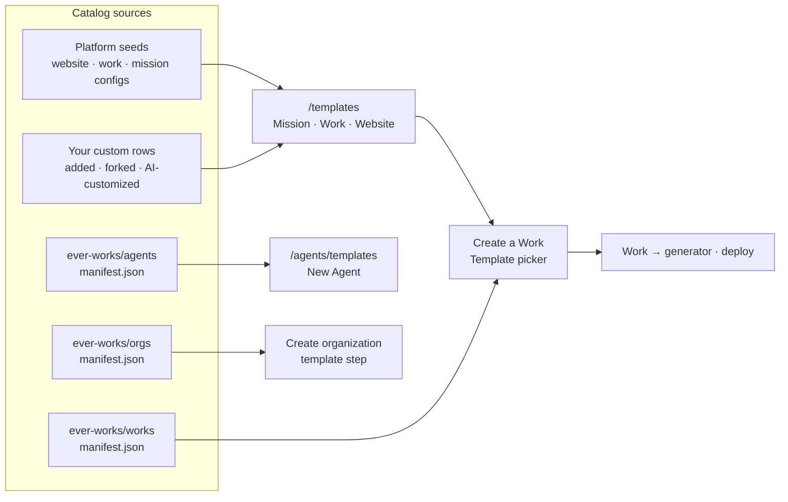

# Templates: Works, Websites, Missions, Agents, Companies

Ever Works uses the word **template** for several different things, and they are not variants of one another. One is the source code your Work's website is cloned from. One is an Agent's whole personality — prompt, skills and a starter knowledge base. One is an entire company: an org chart of Agents, Teams, Skills and draft projects that lands in your account in a single import.

This guide puts them all on one page: what each system holds, which screen it appears on, what you can do to it (fork it, add your own, restyle it with an AI agent, pull the base's updates back down), and how to contribute to the public catalog repositories that back the external ones.

Routes are written the way you type them, without the locale prefix — the address bar shows `/en/templates`, this guide says `/templates`.

## The template systems, side by side

| System                                                    | One entry is                                                                               | Where the catalog comes from                                                                                | Where you use it                                                                                        |
| --------------------------------------------------------- | ------------------------------------------------------------------------------------------ | ----------------------------------------------------------------------------------------------------------- | ------------------------------------------------------------------------------------------------------- |
| **[Website Templates](../features/website-templates.md)** | The site code cloned into a Work's website repository                                      | Seeded on boot from `website-template.config.ts`, plus custom rows you add                                  | `/templates?kind=website`, the Create-Work Template picker, `/works/:id/generator`, `/works/:id/deploy` |
| **[Work Templates](../features/work-templates.md)**       | A starter repository you fork into your own GitHub account or organization                 | Seeded from `work-template.config.ts`, plus custom rows                                                     | `/templates?kind=work`                                                                                  |
| **[Work Blueprints](../features/work-blueprints.md)**     | A ready-made Work definition — template repo coordinates plus the Work's provider defaults | `manifest.json` in the public [`ever-works/works`](https://github.com/ever-works/works) repo, cached 1 hour | The Create-Work Template picker, under **Blueprints**                                                   |
| **[Mission Templates](../features/mission-templates.md)** | A packaged Mission — cadence, guardrails, outstanding-Ideas cap, seed knowledge base       | Seeded from `mission-template.config.ts`, plus custom rows                                                  | `/templates?kind=mission` → **Use this Template**                                                       |
| **[Agent templates](../features/agents-catalog.md)**      | An Agent identity package — `.works/agent.yml`, `SOUL.md`, `prompts/`, `skills.yml`, `kb/` | `manifest.json` in [`ever-works/agents`](https://github.com/ever-works/agents), cached 1 hour               | `/agents/templates`, and the catalog inside the New Agent dialog                                        |
| **Go-to-market Agent presets**                            | A fully specified Agent — system prompt, permissions, guardrails, suggested Skills         | In platform code (`packages/agent/src/agents/agent-templates.ts`)                                           | `GET /api/agents/templates`, `POST /api/agents/from-template/:slug`, onboarding suggested agents        |
| **Skill templates**                                       | A reusable Skill body an Agent binds to                                                    | A curated in-app list (`apps/web/src/lib/api/agent-templates.ts`)                                           | `/skills/templates`                                                                                     |
| **Task templates**                                        | Two things: your own workflow templates (parent + steps), and single-Task shapes           | Your `/api/task-templates` rows, plus the curated in-app list                                               | `/tasks/templates`                                                                                      |
| **Company (organization) templates**                      | An `agentcompanies/v1` package — company, agents, teams, skills, projects                  | `manifest.json` in the public [`ever-works/orgs`](https://github.com/ever-works/orgs) repo, cached 1 hour   | The template step of the **Create organization** modal                                                  |

Three of these are external, public Git catalogs (`ever-works/works`, `ever-works/agents`, `ever-works/orgs`), which is why the list of things you can build grows without a platform release. The rest are seeded from platform code or created by you.



## Where each one lives in the UI

| Screen                  | Route                                            | What you do there                                                                                                                                                                             |
| ----------------------- | ------------------------------------------------ | --------------------------------------------------------------------------------------------------------------------------------------------------------------------------------------------- |
| Templates catalog       | `/templates?kind=mission` · `=work` · `=website` | Search and filter the catalog, **Add custom template**, **Create with AI**, refresh, and per card: **Fork**, **Edit**, **Archive**, **Make default**, **Sync from base**, **Customize again** |
| Create a Work           | `/new` → pick a kind chip                        | The Template picker lists **Your templates** first, then **Blueprints** for that kind                                                                                                         |
| Work → Generator        | `/works/:id/generator`                           | Pick the template the Work is first built from. The selector locks after the first website generation; a **Change anyway** link re-opens it                                                   |
| Work → Deploy           | `/works/:id/deploy`                              | The **Automatic Template Updates** card — switch the **Work template** of a Work that already has a repository, and set hourly auto-update and the beta branch                                |
| Agent templates browser | `/agents/templates`                              | Browse Agent starters by category; **Use template** opens `/agents/new?from=<slug>`                                                                                                           |
| Skill templates browser | `/skills/templates`                              | Browse Skill bodies; reached from **Browse templates** in the Skills block at `/agents#skills`                                                                                                |
| Task templates browser  | `/tasks/templates`                               | Your workflow templates on top, single-Task shapes below; **Use template** opens `/tasks/new?from=<slug>`                                                                                     |
| Create organization     | The **Create organization** modal                | Pick a prebuilt company, or start blank                                                                                                                                                       |

## The one catalog with three tabs: `/templates`

`/templates` is a single catalog page serving three template **kinds**. The segmented control under the page title switches between **Mission Templates**, **Work Templates** and **Website Templates**, navigating by `?kind=` so the server fetches the right list; with no `?kind=` you land on **Website Templates**.

The page gives you, for the active kind:

- An **Active default** chip in the header — the template new Works start from unless you override it per Work.
- A search box over template names, frameworks and repositories, and an **All / Built-in / Custom** filter with live counts.
- **Add custom template** — save any GitHub repository into your catalog.
- **Create with AI** — appears on the tab where AI-customizable built-in bases exist (today, the Website Templates tab).
- A refresh control (`POST /api/templates/refresh`) that re-reads the catalog.

Every card shows the source badge (**Built-in** / **Custom**, and for custom rows whether it is **Forked** or **Custom URL**), the framework, the branch it clones from, any beta branch, and — on AI-customized rows — a status chip for the latest customization run.

### Website Templates

| Id            | Name              | Repository                                                | Stack   | AI-customizable |
| ------------- | ----------------- | --------------------------------------------------------- | ------- | --------------- |
| `classic`     | Classic           | `ever-works/directory-web-template`                       | Next.js | No              |
| `minimal`     | Minimal           | configurable (defaults to the minimal directory template) | Astro   | Yes             |
| `web`         | Website           | `ever-works/web-template`                                 | Next.js | Yes             |
| `web-minimal` | Website (Minimal) | `ever-works/web-minimal-template`                         | Astro   | Yes             |

The `classic` and `minimal` templates are directory-shaped — search, categories, item pages, submissions. The `web` and `web-minimal` templates are general-purpose marketing/landing/content sites, not directories. The `minimal` entry's owner, repo, branch and beta branch are operator-configurable, so a self-hosted install can point it somewhere else.

When you do not choose a template, the [Work kind](../features/work-kinds.md) picks one:

| Work kind                                 | Default template                                    |
| ----------------------------------------- | --------------------------------------------------- |
| `website`, `landing-page`, `blog`         | `web`                                               |
| `directory`, `awesome-repo`, and the rest | `classic` (or whatever the operator has configured) |

Your own saved default for the kind wins over both — see [Set your default template](#how-to-set-your-default-template-for-a-kind).

### Work Templates

Work Templates are fork-first starters. They are not shown in the Create-Work picker; you fork one from `/templates?kind=work` and launch a Work from your fork.

| Id                          | Name                        | Repository                                  | Framework |
| --------------------------- | --------------------------- | ------------------------------------------- | --------- |
| `starter-directory`         | Starter Directory           | `ever-works/directory-web-template`         | Next.js   |
| `starter-directory-minimal` | Starter Directory (Minimal) | `ever-works/directory-web-minimal-template` | Astro     |

Seeding is idempotent, and an older built-in row pointing at the same repository under a different id is deactivated, so a curated entry never shows up twice.

### Work Blueprints

Blueprints come from the public `ever-works/works` manifest and appear in the Create-Work Template picker under **Blueprints**, filtered by the kind chip you selected. Each row carries a `status`:

| Status        | What it means                                                                 |
| ------------- | ----------------------------------------------------------------------------- |
| `production`  | Fully wired; selectable in the picker.                                        |
| `beta`        | Selectable, but expect changes.                                               |
| `placeholder` | Listed so the chip can render, but **not selectable** — no template repo yet. |

At the time of writing the manifest ships three production blueprints — `directory`, `directory-minimal` and `marketing-site` — and five placeholders: `company`, `store`, `blog`, `landing-page` and `awesome`. See [Work Blueprints](../features/work-blueprints.md) for the full field reference and the platform's validation rules.

### Mission Templates

| Id                 | Name                 | Repository                                     |
| ------------------ | -------------------- | ---------------------------------------------- |
| `starter-business` | Starter Business     | `ever-works/starter-business-mission-template` |
| `starter-content`  | Starter Content Site | `ever-works/starter-content-mission-template`  |

Mission cards are the only cards with a **Use this Template** button: it opens `/new?type=mission&template=<id>` with the Mission chip selected and the prompt pre-filled. The template's `.works/mission.yml` supplies the cadence, guardrails, cap and knowledge-base seed the new Mission inherits — all overridable at create time. [Mission Templates](../features/mission-templates.md) documents that manifest field by field.

### Agent templates

Agent templates are whole identity packages, not just metadata. One folder in `ever-works/agents` holds:

```
templates/<slug>/
  .works/agent.yml     # platform manifest — what the wizard pre-fills
  SOUL.md              # the personality contract (no frontmatter)
  prompts/system.md    # the runtime system prompt
  prompts/tasks/*.md   # one scaffold per common task
  skills.yml           # required + recommended Skill slugs
  kb/                  # starter knowledge base seeded on create
  README.md
  icon.svg
```

The live list is whatever `manifest.json` holds at the ref your deployment reads; [Agents Catalog](../features/agents-catalog.md) walks the starter set and the reader's security posture. When the repo cannot be read, the dashboard falls back to a built-in list so the chips and the browser never go empty:

| Slug                 | Title            | Category     |
| -------------------- | ---------------- | ------------ |
| `ceo`                | CEO              | Leadership   |
| `cto`                | CTO              | Leadership   |
| `lead-engineer`      | Lead Engineer    | Engineering  |
| `copywriter`         | Copywriter       | Content      |
| `sales`              | Sales            | Go-to-market |
| `brand-specialist`   | Brand Specialist | Content      |
| `starter-pm`         | Project Manager  | Coordination |
| `starter-coder`      | Coder            | Engineering  |
| `starter-researcher` | Researcher       | Research     |

### Go-to-market Agent presets

Separate from the repo catalog, the platform ships six presets in code. Unlike catalog rows, these are complete: activating one writes the preset's system prompt as the Agent's `SOUL.md`, seeds its permissions and review-before-act guardrails, and creates the Agent in **draft**.

| Slug                  | Name                | Role                                    | Category  | Suggested Skills                                                                          |
| --------------------- | ------------------- | --------------------------------------- | --------- | ----------------------------------------------------------------------------------------- |
| `content-marketer`    | Content Marketer    | Newsletter & content production         | Marketing | `newsletter-drafting`, `digest-compilation`, `campaign-reporting`                         |
| `seo-auditor`         | SEO Auditor         | Site & content search-visibility review | Marketing | `seo-audit`, `campaign-reporting`, `engagement-analysis`                                  |
| `social-scheduler`    | Social Scheduler    | Social content planning & scheduling    | Marketing | `social-scheduling`, `news-signal-detection`, `engagement-analysis`, `digest-compilation` |
| `competitive-analyst` | Competitive Analyst | Market & competitor monitoring digests  | Marketing | `competitor-watch`, `news-signal-detection`, `digest-compilation`                         |
| `lead-researcher`     | Lead Researcher     | Lead list building & enrichment         | Sales     | `lead-research`, `contact-enrichment`, `lead-scoring`, `risk-filter`                      |
| `outreach-drafter`    | Outreach Drafter    | Personalized outbound drafting          | Sales     | `outreach-personalization`, `follow-up-cadence`, `reply-detection`                        |

Every suggested Skill slug is pinned against the first-party go-to-market Skill catalog by a build-time check, so the list cannot decay into names with nothing behind them.

### Skill templates

`/skills/templates` browses reusable Skill bodies. It is a small curated set — `cron-defaults` (cron conventions for Work schedules), `secret-handling` (how Agents treat credentials in tool output) and `commit-message-style` (conventional-commit format with examples). This is **not** the Skills catalog: the installable catalog is sourced from the public `ever-works/skills` repository through the first-party Skills provider plugin, and lives in the Skills block at `/agents#skills`. See [Skills Catalog](../features/skills-catalog.md).

### Task templates

`/tasks/templates` stacks two different things on one page:

- **Workflow templates** (the top block) — your own, persisted rows with a name, labels and an ordered list of **steps**. Each step carries a title, an optional prompt, an optional Agent or agent-template binding, a `requiresApproval` flag and `dependsOn` positions. Instantiating one expands into a parent Task plus one sub-task per step, with dependencies wired as blockers. They are managed at `/api/task-templates` (`GET`, `POST`, `GET /:id`, `PATCH /:id`, `DELETE /:id`, `POST /:id/instantiate`); the first list call seeds defaults for a new account.
- **Single-Task shapes** (the catalog below) — `bug-triage`, `weekly-review` and `release-checklist`, which pre-fill the New Task form's title, description and labels.

### Company (organization) templates

A company template is an `agentcompanies/v1` package in `ever-works/orgs`:

```
companies/<slug>/
  COMPANY.md                 # name, description, goals, provenance
  agents/<slug>/AGENTS.md    # one file per agent: name, title, reportsTo, skills
  teams/<slug>/TEAM.md       # manager + members
  projects/<slug>/PROJECT.md # optional, with tasks/<slug>/TASK.md
  skills/<slug>/SKILL.md     # standard Agent Skills format
  .works/company.yml         # Ever Works sidecar: catalog metadata + per-agent hints
  images/org-chart.svg
  README.md
```

The `.works/company.yml` sidecar is what makes a package feel native: per agent it can name an `ever-works/agents` template to merge identity files from, an avatar icon, a `heartbeatCadence` (the Agent arrives **paused** — a human enables it), a monthly budget hint and focus tags. Importing one materializes an Organization plus Teams, paused Agents, Skills, draft Works and Tasks in a single call.

## Fork, add by URL, customize with AI, sync from base

### How to: add a template from a repository URL

1. Open `/templates` and switch to the kind you are adding with the **Mission Templates / Work Templates / Website Templates** control.
2. Click **Add custom template**.
3. Paste the **GitHub repository URL** (`https://github.com/owner/repository`). This is the only required field, and it is locked once saved.
4. Optionally set **Template name**, **Framework** (Next.js or Astro), **Preview image URL**, **Short description**, **Default branch** (blank means `main`) and **Beta branch**.
5. Click **Save template**. The row appears under the **Custom** filter.

Behind the button: `POST /api/templates/custom` with the kind you are on. Editing a saved row (**Edit** on the card) is `PUT /api/templates/custom/:templateId` and updates display details only. **Archive** (`POST /api/templates/custom/:templateId/archive`) removes a row from your catalog and is refused while any Work still uses it.

### How to: fork a built-in template

1. On `/templates`, find a **Built-in** card and click **Fork**.
2. Choose a **Fork destination** — your personal GitHub account or an organization you belong to. If the list is empty, connect GitHub first; the dialog says so.
3. Click **Fork and make default**.

The platform forks the repository, creates a custom catalog row pointing at your fork (remembering which template it came from), and sets it as your default for that kind — `POST /api/templates/fork`. Only **built-in** templates can be forked; a custom row is already your own repository.

### How to: restyle a template with an AI agent

AI customization creates a **new repository from a base template** and lets a code-edit agent restyle it. It is deliberately narrow: the agent may only commit `apps/web/src/styles/theme.css`, so the fork keeps compiling no matter which provider ran or how it behaved.

1. Install a **code-edit** plugin at `/settings/plugins` if you have none — the dialog names `claude-code`, `codex`, `gemini` and `opencode` as examples. If the chosen plugin runs against an external model, install an AI provider plugin too (`openai`, `anthropic`, `google`, …).
2. Connect GitHub, so there is somewhere to create the repository.
3. Open `/templates` on the **Website Templates** tab and click **Create with AI**.
4. Fill in **Template name** (it also names the new GitHub repo), pick a **Base template** — only AI-customizable bases are listed — then the **Code-edit agent**, the **AI provider** if the plugin asks for one, and the **GitHub destination**.
5. Describe the UI you want in **Describe the UI you want**. Be specific about styling; new features are out of scope.
6. Click **Create custom template** and watch the status chip: **Queued → Provisioning the new repo → Agent is applying your changes → Pushing changes → Customized**.

What actually happens: the base is cloned, its sample apps, docs site and end-to-end test app are stripped (they never ship in a deployed Work), the result is pushed to a brand-new repository named after your template with a short random suffix, and only then does the agent run. It is a fresh repository rather than a GitHub fork on purpose — GitHub allows one fork per account per repo, and you will want several custom templates from the same base.

:::caution `theme.css` is plain CSS, not the Tailwind entry file
Tailwind directives (`@apply`, `@tailwind`, `@theme`, `@utility`, `@variant`, …) are rejected in `theme.css`. Standard CSS at-rules — `@media`, `@supports`, `@font-face`, `@import` — are fine.
:::

Endpoints: `GET /api/templates/customization-providers`, `GET /api/templates/customization-ai-providers`, `POST /api/templates/custom-from-base`.

### How to: run another round, or check a run

- **Customize again** on a custom card opens the same dialog against the existing repository with a fresh prompt — `POST /api/templates/custom/:templateId/customize`. Each run pushes a new commit.
- The status chip on a card opens the live status of the latest run — `GET /api/templates/customizations/:customizationId`; the full history for a template is `GET /api/templates/:templateId/customizations`. A failed run shows its error message and a **Retry**.

### How to: pull the base's updates back down

1. On a custom card created from a base, click **Sync from base**.
2. Confirm.

`POST /api/templates/custom/:templateId/sync-base` replaces your template repository with the latest base code, using the same duplicate-update model the platform uses for website repositories, then refreshes your catalog. This **overwrites** the repository, so run your customization prompt again afterwards if you want your styling back on top of the newer base.

## Defaults: yours, and per Work

### How to: set your default template for a kind

1. Open `/templates` on the kind's tab.
2. On the card you want, open **More actions** (the ⋮ button) and choose **Make default**.
3. The **Active default** chip in the header updates.

This is `PUT /api/templates/default` and it is per user and per kind. New Works start from it unless the Work names its own template.

### How to: switch a Work's template

Two screens touch a Work's template, and they do different jobs. **Generator** is where you choose the template _before_ the Work's repository exists; **Deploy** is where you replace the template of a Work that already has one.

#### Before the first build — Generator

1. Open the Work and go to **Generator** (`/works/:id/generator`).
2. Pick a template in the selector. Its helper text reads: _Choose the Work template that will be used when the Work repository is first created._
3. Start the generation. The choice is saved against the Work immediately before the run begins.

Once the Work repository has been created, this selector is disabled and its helper text changes to _Template selection is locked after the first website generation._ So the Generator is not a general-purpose place to re-template an existing Work — it is where the first choice is made.

A **Change anyway** link sits next to that locked helper text. Clicking it re-enables the selector; if you then pick a different template and start generation, the same **Switch Work template?** confirmation described below appears, and after confirming, the toast tells you to start generation again to continue with the new template.

#### After the first build — Deploy

1. Open the Work and go to **Deploy** (`/works/:id/deploy`).
2. Find the **Automatic Template Updates** card — _Keep your Work automatically synced with the latest template changes._
3. Pick a different template in the **Work template** selector. The helper text becomes a warning: applying a new template will reset the existing Work repository from the selected template if it already exists.
4. Click **Apply template to Work repository**. Until your selection differs from the current one the button is disabled and reads **Template is up to date**, so there is no accidental no-op switch.
5. Confirm in the **Switch Work template?** dialog by clicking **Switch template**.

:::danger The confirmation is not a formality
The dialog states exactly what you are agreeing to: if the Work repository already exists, **its contents will be replaced from the selected template, and any custom code in that repository will be lost.** Push or branch anything you want to keep before you confirm.
:::

The same card carries two switches that are about _staying_ on a template rather than changing it — **Update automatically** (check for template updates every hour and apply them) and **Use beta version of template** (track the template's stage branch instead of the stable main branch) — plus the last-updated, last-checked and last-error status of those automatic updates.

#### What the switch reports

The call behind both confirmations is `POST /api/works/:id/switch-website-template`, and it reports which of four things happened:

| Outcome                    | When                                                                              |
| -------------------------- | --------------------------------------------------------------------------------- |
| `no_change`                | You selected the template the Work already uses.                                  |
| `saved_for_initialization` | The Work has no website repository yet; the choice is stored for the first build. |
| `repository_reset`         | The existing website repository was reset from the new template.                  |
| `repository_recreated`     | The website repository was recreated from the new template.                       |

Every switch is written to the Work's activity log with the previous and new template ids, so you can see later what changed and when.

## Starting an Agent, Skill or Task from a template

### How to: create an Agent from a catalog template

1. Open `/agents/templates` (or expand the template catalog inside the **New Agent** dialog).
2. Filter by category in the left rail — Leadership, Engineering, Content, Coordination, Research, and whatever else the catalog carries.
3. Click **Use template**. You land on `/agents/new?from=<slug>` with the identity pre-filled, on the details step.
4. Set scope, provider, budget, heartbeat and permissions, then create. See [Agents](../features/agents.md) for what each control does.

`/skills/templates` and `/tasks/templates` work the same way, opening `/skills/new?from=<slug>` and `/tasks/new?from=<slug>`. The Task form shows a visible notice when it has pre-filled from a URL parameter.

### How to: activate a go-to-market preset

The six presets are reachable from the API and from onboarding:

```bash
curl -H "Authorization: Bearer $EVER_WORKS_API_KEY" \
  https://api.ever.works/api/agents/templates

curl -X POST -H "Authorization: Bearer $EVER_WORKS_API_KEY" \
  -H 'Content-Type: application/json' \
  -d '{"scope":"TENANT"}' \
  https://api.ever.works/api/agents/from-template/content-marketer
```

The body accepts placement overrides only — `name`, `scope`, and `missionId` / `ideaId` / `workId`. Everything else (prompt, capabilities, permissions, guardrails) comes from the preset. The Agent is created in draft, owned by you, with review-before-act guardrails; nothing runs until you activate it. During onboarding, selecting a go-to-market role surfaces two or three of these as one-click **suggested agents**.

### How to: turn a workflow template into a task tree

1. Open `/tasks/templates` and check the **My workflows** block at the top.
2. Use **Use in a new Task** (or `POST /api/task-templates/:id/instantiate` with a `title` and optional `workId` / `missionId` / `ideaId` / `branchName`).
3. You get a parent Task plus one sub-task per step, in order, with `dependsOn` positions wired as blockers and per-step approval flags applied.

See [Tasks](../features/tasks.md) for the lifecycle those tasks then follow.

## How to: import a prebuilt company

1. Open the organization switcher and choose **Create organization**.
2. If the catalog is reachable, a template list appears. Pick a company card — the name field pre-fills from the template — or pick **Blank** to skip.
3. Adjust the name, then submit.

This calls `POST /api/organizations/import-company` with the template slug. It creates the Organization, then materializes Teams, Agents (paused), Skills, draft Works and Tasks from the package. Per-entity problems are reported in a `skipped[]` list rather than failing the whole import, and the endpoint is rate-limited to five imports a minute. Server-side caps apply: at most 50 agents, 20 teams, 60 skills, 20 projects, 200 tasks, and 128 KB per file.

The catalog covers a wide spread of shapes — engineering shops, agencies, marketing and content teams, research labs, support desks, recruiting, commerce operations and more — each row declaring how many agents, teams, skills and projects it brings. See [Organizations](../features/organizations.md) and [Teams](../features/teams.md) for what arrives.

## When a catalog cannot be read

The external catalogs are designed to degrade quietly rather than break a screen.

| Catalog             | Read path                                                                       | Ref / token settings                                                      | If it fails                                                                                                   |
| ------------------- | ------------------------------------------------------------------------------- | ------------------------------------------------------------------------- | ------------------------------------------------------------------------------------------------------------- |
| `ever-works/works`  | Tokenless read of `raw.githubusercontent.com` first, then an authenticated read | `EVER_WORKS_WORKS_REPO`, `EVER_WORKS_WORKS_REF`, `EVER_WORKS_WORKS_TOKEN` | The Create-Work picker falls back to its built-in list; failures are cached only briefly so recovery is quick |
| `ever-works/agents` | Authenticated read when a token resolves, otherwise a tokenless raw read        | `EVER_WORKS_AGENTS_REF`, `EVER_WORKS_AGENTS_TOKEN` / `GITHUB_TOKEN`       | The chips and `/agents/templates` fall back to the built-in starter list                                      |
| `ever-works/orgs`   | Authenticated read when a token resolves, otherwise a tokenless raw read        | `EVER_WORKS_ORGS_REF`, `EVER_WORKS_ORGS_TOKEN` / `GITHUB_TOKEN`           | The Create-organization modal simply hides its template step                                                  |

A token is an optimization (higher GitHub rate limits), not a requirement — all three repositories are public, and each catalog is cached for an hour.

:::caution Pin the ref in production
Each reader logs a warning when its ref is a mutable branch such as `main`. Pin `EVER_WORKS_*_REF` to a 40-character commit SHA or a `vX.Y.Z` tag in production so a catalog cannot be substituted under you after the cache expires.
:::

## Contributing to each public catalog repo

| Repository                                                  | One contribution is                                      | Validate locally                                                    |
| ----------------------------------------------------------- | -------------------------------------------------------- | ------------------------------------------------------------------- |
| [`ever-works/works`](https://github.com/ever-works/works)   | One object appended to `blueprints[]` in `manifest.json` | `node scripts/validate.mjs`                                         |
| [`ever-works/agents`](https://github.com/ever-works/agents) | One folder under `templates/<slug>/` plus a manifest row | The repo's `validate` workflow (schema checks in `schema/`)         |
| [`ever-works/orgs`](https://github.com/ever-works/orgs)     | One folder under `companies/<slug>/`                     | `node scripts/validate.mjs`, then `node scripts/build-manifest.mjs` |

### A Work blueprint

Add one object to `blueprints[]` with a unique kebab-case `slug`, a `name`, `title`, `summary`, `kind`, `chipType`, `status` and a `template.repo` inside the `ever-works` organization (the platform only ever forks repositories it controls). Exactly one blueprint per `chipType` may set `default: true`. The full field table and every rule the API enforces on the manifest are in [Work Blueprints](../features/work-blueprints.md#contributing-a-blueprint).

### An Agent template

1. Pick a lowercase, kebab-case slug of at most 60 characters. `starter-*` is reserved for the built-in set; use your own namespace otherwise.
2. Copy an existing `starter-*` folder — the shape is fixed: `.works/agent.yml`, `SOUL.md`, `README.md`, `prompts/system.md`, `prompts/tasks/*.md`, `skills.yml`, `kb/`, `icon.svg`.
3. Fill `.works/agent.yml` against `schema/agent-manifest.schema.json`; it is the source of truth for everything the New Agent wizard pre-fills.
4. Write `SOUL.md` with its eight sections — Identity, Mission, Priorities, Default behaviors, Non-default behaviors, Hard rules, Preferred output formats, Skills / KB — and **no frontmatter**.
5. Write `prompts/system.md` as the runtime system prompt, and one `prompts/tasks/<id>.md` per quick action.
6. Populate `kb/` with real, role-specific content, and fill `skills.yml` (each entry needs a `why` string).
7. Add the row to `manifest.json` — slug, name, title, summary, scope, icon, tags, path — keeping entries alphabetical within their namespace, and open a PR.

Two rules sit above the rest: a template describes an agent the platform can actually be, not a fantasy, and every template inherits the cross-cutting guardrails rather than relaxing them.

### A company package

1. Create `companies/<slug>/` and author it per the `agentcompanies/v1` specification: `COMPANY.md`, one `agents/<slug>/AGENTS.md` per agent (exactly one root agent with `reportsTo: null`), `teams/<slug>/TEAM.md`, optional `projects/`, `skills/<slug>/SKILL.md`, an org-chart image and a short `README.md`.
2. Add the `.works/company.yml` sidecar with the `catalog:` block (category, avatar icon, tags, optional `featured` and `maturity`) and any per-agent hints — `template`, `avatarIcon`, `heartbeatCadence`, `budgetMonthly`, `tags`. Never put secrets or machine paths in it.
3. Keep the package importable and stay under the platform's caps; curate a large upstream org down and say so in the README.
4. Write original prose. Adapted content needs a permissive licence plus provenance in `metadata.sources`; share-alike-derived content is not accepted.
5. Run `node scripts/validate.mjs` and `node scripts/build-manifest.mjs`, then open a PR — CI runs the same checks.

After a PR merges, the platform picks the change up on its next uncached read — within an hour on the default ref. If your operator pinned a SHA or tag, ask them to bump the pin.

## Limits worth knowing

- **AI customization is styling only.** It edits `apps/web/src/styles/theme.css` and nothing else, and it needs an installed code-edit plugin plus a connected GitHub account.
- **`classic` is not AI-customizable.** It is too large to restyle safely end to end today; `minimal`, `web` and `web-minimal` are.
- **Sync from base overwrites.** Your customization commits are replaced by the base's code; re-run the prompt afterwards.
- **Five blueprints are placeholders.** `company`, `store`, `blog`, `landing-page` and `awesome` are listed but not selectable until their template repositories are public. See [Store Builder](../features/store-builder.md) and [Company Builder](../features/company-builder.md).
- **Skill and single-Task template browsers are curated in-app lists**, not repo-backed catalogs. The installable Skills catalog is a separate system.
- **Imported company Agents arrive paused.** A human enables each heartbeat — importing an org chart never starts a workforce on its own.

## Related

- [Website Templates](../features/website-templates.md) — the four site templates and how the generator clones and updates them
- [Work Templates](../features/work-templates.md) · [Work Blueprints](../features/work-blueprints.md) · [Mission Templates](../features/mission-templates.md) — the sibling catalogs in detail
- [Work Kinds & Capabilities](../features/work-kinds.md) · [Creating a Work](../features/creating-a-work.md) — what the template you pick actually produces
- [Agents Catalog](../features/agents-catalog.md) · [Agents (Your AI Employees)](../features/agents.md) · [Skills Catalog](../features/skills-catalog.md) · [Tasks](../features/tasks.md)
- [Organizations](../features/organizations.md) · [Teams](../features/teams.md) · [Company Builder](../features/company-builder.md) · [Store Builder](../features/store-builder.md)
- [Build a Site Fully Autonomously from a Template](./autonomous-site-from-template.md) — wiring a template into a standing build loop
- [Platform Tour (Screen by Screen)](./platform-tour.md) · [Quickstart: Build a Directory](./quickstart-directory.md)
- API reference: [Template Catalog API](../api/template-catalog.md) · [Agents API](../api/agents.md) · [Tasks API](../api/tasks.md) · [Works API](../api/works.md)
