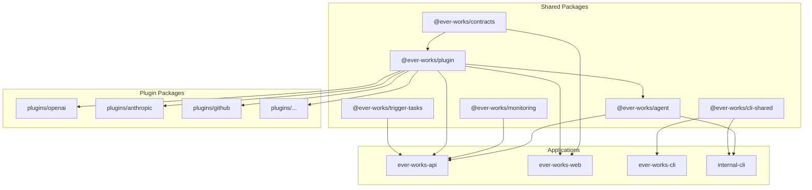

# Monorepo Structure & Tooling

The Ever Works Platform is organized as a **Turborepo + pnpm workspaces** monorepo. This guide explains the project layout, build tooling, caching strategy, and how to add new packages.

## High-Level Layout

```
ever-works/
  apps/
    api/                # NestJS 11 REST API (SWC compiler)
    web/                # Next.js 16 App Router (React 19, Turbopack)
    cli/                # Public CLI (Commander.js, esbuild)
    internal-cli/       # Internal NestJS CLI (nest-commander)
    admin/              # Admin interface
    mcp/                # MCP (Model Context Protocol) server
    docs/               # Docusaurus 3 documentation site

  packages/
    agent/              # Core AI agent logic (NestJS, TypeORM, LangChain)
    contracts/          # Shared TypeScript types and interfaces (ESM, tsup)
    plugin/             # Plugin system contracts and utilities (ESM, tsup)
    monitoring/         # Sentry + PostHog integration
    tasks/              # Trigger.dev background job definitions
    cli-shared/         # Shared utilities for CLI apps
    plugins/            # Plugin implementations (39 packages)
      openai/           # OpenAI AI provider
      anthropic/        # Anthropic AI provider
      google/           # Google AI provider (Gemini models)
      groq/             # Groq AI provider
      ollama/           # Ollama (local) AI provider
      openrouter/       # OpenRouter AI gateway (default)
      mistral/          # Mistral AI provider
      vercel-ai-gateway/# Vercel AI Gateway provider
      exa/              # Exa search
      tavily/           # Tavily search (default)
      serpapi/          # SerpAPI search
      brave/            # Brave search
      perplexity/       # Perplexity AI search
      brightdata/       # Bright Data search/scraping
      firecrawl/        # Firecrawl search/extraction
      jina/             # Jina AI search/extraction
      valyu/            # Valyu multi-source search
      linkup/           # Linkup AI-precision search
      local-content-extractor/  # Built-in HTML extractor (default)
      notion-extractor/         # Notion page extractor
      pdf-extractor/    # PDF text + OCR extractor
      scrapfly/         # Scrapfly screenshots + extraction
      screenshotone/    # ScreenshotOne screenshots
      urlbox/           # URLBox screenshots
      github/           # GitHub git provider (default) + OAuth
      vercel/           # Vercel deployment (default)
      apify/            # Apify data-source / actor imports
      standard-pipeline/         # 15-step structured pipeline (default)
      agent-pipeline/   # Autonomous Vercel-AI-SDK agent
      claude-code/      # Claude Code CLI generator
      claude-managed-agent/      # Hosted Claude Managed Agent
      codex/            # OpenAI Codex CLI generator
      gemini/           # Gemini CLI generator (distinct from `google`)
      opencode/         # OpenCode CLI generator
      make/             # Make.com workflow generator
      sim-ai/           # SIM AI workflow generator
      zapier/           # Zapier automation triggers
      comparison-generator/      # SEO A vs B comparison pages
      langfuse/         # External prompt management

  turbo.json            # Turborepo task configuration
  pnpm-workspace.yaml   # Workspace package globs
  package.json          # Root scripts, devDependencies, Prettier config
  compose.yaml          # Docker Compose for production-like setup
  .deploy/              # Dockerfiles & K8s manifests for each app
```

## pnpm Workspaces

The `pnpm-workspace.yaml` defines three workspace roots:

```yaml
packages:
  - apps/*
  - packages/*
  - packages/plugins/*
```

This means pnpm treats every directory matching these globs as a workspace package. Each has its own `package.json` and can depend on other workspace packages using the `workspace:*` protocol:

```json
{
  "dependencies": {
    "@ever-works/agent": "workspace:*",
    "@ever-works/plugin": "workspace:*",
    "@ever-works/contracts": "workspace:*"
  }
}
```

### Native Module Allowlist

The workspace configuration also restricts which packages can run postinstall scripts for security and performance:

```yaml
onlyBuiltDependencies:
  - '@nestjs/core'
  - '@sentry-internal/node-cpu-profiler'
  - '@swc/core'
  - '@tailwindcss/oxide'
  - bcrypt
  - better-sqlite3
  - core-js
  - esbuild
  - msgpackr-extract
  - protobufjs
  - sharp
  - sqlite3
```

Only these packages are allowed to execute build scripts during `pnpm install`. This prevents arbitrary code execution from transitive dependencies.

## Turborepo Configuration

The `turbo.json` file defines the task pipeline:

```json
{
  "$schema": "https://turbo.build/schema.json",
  "tasks": {
    "build": {
      "dependsOn": ["^build"],
      "outputs": ["dist/**", "build/**", ".next/**"]
    },
    "start": {
      "dependsOn": ["^build"],
      "cache": false
    },
    "start:dev": {
      "dependsOn": ["^build"],
      "persistent": true,
      "cache": false
    },
    "dev": {
      "outputs": [],
      "cache": false
    },
    "dev:trigger": {
      "outputs": [],
      "cache": false
    },
    "lint": { "outputs": [] },
    "test": { "outputs": [] },
    "type-check": { "outputs": [] },
    "clean": { "outputs": [] }
  }
}
```

### Task Definitions Explained

| Task | `dependsOn` | `outputs` | `cache` | Purpose |
|------|-------------|-----------|---------|---------|
| `build` | `^build` (build deps first) | `dist/`, `build/`, `.next/` | Yes | Production build |
| `start` | `^build` | -- | No | Start in production mode |
| `start:dev` | `^build` | -- | No (persistent) | Start with watch mode |
| `dev` | -- | -- | No | Development server |
| `dev:trigger` | -- | -- | No | Trigger.dev dev server |
| `lint` | -- | -- | Yes | ESLint checks |
| `test` | -- | -- | Yes | Run test suites |
| `type-check` | -- | -- | Yes | TypeScript compilation checks |
| `clean` | -- | -- | Yes | Remove build artifacts |

The `^build` syntax means "build all workspace dependencies first." This ensures `@ever-works/contracts` is compiled before `@ever-works/plugin`, which is compiled before `@ever-works/agent`, which is compiled before `ever-works-api`.

### Dependency Graph



## Package Organization

### `apps/` -- Deployable Applications

These are the final runnable applications. Each has its own build toolchain:

| App | Package Name | Framework | Build Tool | Port |
|-----|-------------|-----------|------------|------|
| `api` | `ever-works-api` | NestJS 11 | SWC (`nest build -b swc`) | 3100 |
| `web` | `ever-works-web` | Next.js 16 | Turbopack (dev) / Webpack (build) | 3000 |
| `cli` | `ever-works-cli` | Commander.js | esbuild | -- |
| `internal-cli` | `ever-works-internal-cli` | nest-commander | SWC | -- |
| `admin` | -- | -- | -- | -- |

### `packages/` -- Shared Libraries

Reusable libraries consumed by apps and other packages:

| Package | Scope Name | Build | Test | Description |
|---------|-----------|-------|------|-------------|
| `agent` | `@ever-works/agent` | NestJS SWC + tsc (types) | Jest | Core AI generation, database, git, pipelines |
| `contracts` | `@ever-works/contracts` | tsup (ESM) | -- | Shared TypeScript interfaces and types |
| `plugin` | `@ever-works/plugin` | tsup (ESM) | Vitest | Plugin system contracts, base classes, utilities |
| `monitoring` | `@ever-works/monitoring` | tsup | -- | Sentry error tracking + PostHog analytics |
| `tasks` | `@ever-works/trigger-tasks` | tsup | -- | Trigger.dev background job definitions |
| `cli-shared` | `@ever-works/cli-shared` | tsup | -- | Shared CLI utilities |

### `packages/plugins/` -- Plugin Implementations

Each plugin is a standalone ESM package built with tsup and tested with Vitest. Plugins declare their metadata in `package.json` under `everworks.plugin`:

```json
{
  "everworks": {
    "plugin": {
      "id": "openai",
      "name": "OpenAI",
      "category": "ai-provider",
      "capabilities": ["text-generation", "embeddings"]
    }
  }
}
```

**Plugin categories:**

| Category | Plugins |
|----------|---------|
| AI Provider | openai, anthropic, google, groq, ollama, openrouter, mistral, perplexity |
| Search | exa, tavily, serpapi, brave, valyu |
| Content Extraction | local-content-extractor, notion-extractor, pdf-extractor, firecrawl, jina, scrapfly, brightdata |
| Screenshot | screenshotone, urlbox |
| Git | github |
| Infrastructure | vercel, apify |
| Pipeline | agent-pipeline, standard-pipeline, comparison-generator |
| AI Tools | claude-code, vercel-ai-gateway |

## Caching Strategy

### Local Cache (Default)

Turborepo caches task outputs in `node_modules/.cache/turbo/`. When a task's inputs (source files, dependencies, environment variables) have not changed, Turborepo replays the cached output instead of re-running the task.

Cacheable tasks: `build`, `lint`, `test`, `type-check`

Non-cacheable tasks (`"cache": false`): `dev`, `start`, `start:dev`, `dev:trigger`

### Cache Invalidation

Turborepo automatically invalidates the cache when:

- Source files in the package change
- Dependencies in `package.json` change
- The task configuration in `turbo.json` changes
- Environment variables referenced by the task change

To manually clear the cache:

```bash
# Remove Turborepo cache
rm -rf node_modules/.cache/turbo

# Or use the clean task
pnpm clean
```

### Remote Cache (Optional)

Turborepo supports remote caching via Vercel for shared CI/CD caching:

```bash
npx turbo login
npx turbo link
```

Once linked, build artifacts are shared across team members and CI runners, significantly reducing build times.

## How to Add New Packages

### Adding a New Shared Package

1. Create the package directory:

   ```bash
   mkdir packages/my-new-package
   cd packages/my-new-package
   ```

2. Initialize `package.json`:

   ```json
   {
     "name": "@ever-works/my-new-package",
     "version": "0.0.1",
     "private": true,
     "type": "module",
     "main": "./dist/index.js",
     "types": "./dist/index.d.ts",
     "scripts": {
       "build": "tsup src/index.ts --format esm --dts",
       "dev": "tsup src/index.ts --format esm --dts --watch",
       "test": "vitest run",
       "clean": "rm -rf dist"
     }
   }
   ```

3. Add it as a dependency in consuming packages:

   ```bash
   cd apps/api
   pnpm add @ever-works/my-new-package@workspace:*
   ```

4. Build from root to verify the dependency chain:

   ```bash
   pnpm build
   ```

### Adding a New Plugin

1. Create the plugin directory under `packages/plugins/`:

   ```bash
   mkdir packages/plugins/my-plugin
   ```

2. Initialize with plugin metadata in `package.json`:

   ```json
   {
     "name": "@ever-works/plugin-my-plugin",
     "version": "0.0.1",
     "private": true,
     "type": "module",
     "everworks": {
       "plugin": {
         "id": "my-plugin",
         "name": "My Plugin",
         "category": "ai-provider",
         "capabilities": ["text-generation"]
       }
     },
     "dependencies": {
       "@ever-works/plugin": "workspace:*"
     }
   }
   ```

3. Implement the plugin by extending `BaseAiProvider` from `@ever-works/plugin/abstract`.

4. Build the plugin system to verify:

   ```bash
   pnpm build:plugins
   ```

### Adding a New App

1. Create under `apps/`:

   ```bash
   mkdir apps/my-app
   ```

2. Set up the `package.json` with a unique `name` field.

3. The app is automatically included in the workspace since `apps/*` is already in `pnpm-workspace.yaml`.

4. Run `pnpm install` to link workspace dependencies.

## Key Root Scripts

All scripts from the root `package.json`:

| Script | Command | Description |
|--------|---------|-------------|
| `dev` | `turbo dev` | Start all packages in dev/watch mode |
| `dev:api` | `turbo dev --filter=ever-works-api` | Start API only |
| `dev:web` | `turbo dev --filter=ever-works-web` | Start Web only |
| `dev:trigger` | `turbo dev:trigger --filter=@ever-works/trigger-tasks` | Start Trigger.dev dev server |
| `build` | `turbo build` | Build all packages |
| `build:apps` | `turbo build --filter=./apps/*` | Build apps only |
| `build:packages` | `turbo build --filter=./packages/*` | Build shared packages only |
| `build:plugins` | `turbo build --filter=./packages/plugin --filter=./packages/plugins/*` | Build plugin system + all plugins |
| `build:api` | `turbo build --filter=ever-works-api` | Build API only |
| `build:web` | `turbo build --filter=ever-works-web` | Build Web only |
| `lint` | `turbo lint` | ESLint all packages |
| `test` | `turbo test` | Run all test suites |
| `type-check` | `turbo type-check` | TypeScript checks across all packages |
| `clean` | `turbo clean` | Remove build artifacts |
| `format` | `prettier --write "**/*.{ts,tsx,jsx,json,css,md}"` | Format all source files |
| `format:check` | `prettier --check "**/*.{ts,tsx,jsx,json,css,md}"` | Check formatting without changes |
| `deploy:trigger` | `turbo deploy:trigger --filter=@ever-works/trigger-tasks` | Deploy Trigger.dev tasks |

## Code Quality Tooling

| Tool | Purpose | Config Location |
|------|---------|-----------------|
| **Turborepo** | Task orchestration and caching | `turbo.json` |
| **pnpm** | Package management and workspaces | `pnpm-workspace.yaml` |
| **Prettier** | Code formatting | Root `package.json` (`"prettier"` key) |
| **ESLint** | Linting | Per-package `.eslintrc.js` / `eslint.config.mjs` |
| **Husky** | Git hooks (pre-commit, commit-msg) | `.husky/` |
| **commitlint** | Conventional commit enforcement | Root `package.json` (`"commitlint"` key) |
| **TypeScript** | Type checking (5.9.3) | Per-package `tsconfig.json` |

## Next Steps

- [Installation](/installation) -- Set up the platform from scratch
- [Development Workflow](/development-workflow) -- Day-to-day commands and debugging
- [Architecture](/architecture) -- Detailed system design and data flow
- [Plugin System](/plugin-system) -- Building and extending plugins
