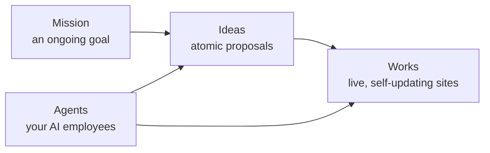

# Platform Overview

The Ever Works Platform provides the backend infrastructure for building, generating, and deploying AI-powered work websites.

## What Ever Works is

Ever Works is an **open-source, agentic runtime** that researches, ships, and maintains content-rich websites and Git repositories. It brings together two things most tools keep apart:

- **The builder experience** — describe what you want and get a shipped website, blog, directory, landing page (and, soon, [stores](/features/store-builder)) generated from a [template](/features/website-templates).
- **The autonomous workforce** — an army of AI [Agents](/features/agents) acting as real employees that keep the work going long after the first build: writing content, finding and adding items, improving code, researching, and proposing what to do next — [24/7, on a schedule](/features/autonomous-operation).

One-shot AI builders generate code and stop. Ever Works keeps building, maintaining, and growing — and because **code and content both live in your own Git**, you own everything and nothing is locked in. The platform is open source under **AGPLv3**.

### The mental model

- A **[Mission](/features/missions)** is an ambitious, ongoing goal the system keeps pursuing.
- An **[Idea](/features/ideas)** is a one-shot proposal — one Idea becomes one Work. (Unsure what to build? Capture an Idea and let it be researched first, like a lightweight plan.)
- A **[Work](/features/creating-a-work)** is the buildable, self-maintaining unit — a website, blog, directory, landing page, store, and more.
- **[Agents](/features/agents)** are named AI workers (CEO, CTO, Researcher, …) that run the Missions, Ideas, and Works for you.

For the full step-by-step, see the [Founder Journey guide](/guides/founder-journey).

## How It Works

1. **Create a Work** — A user creates a work project through the web dashboard or API, providing a topic and description.
2. **AI Generation Pipeline** — The platform's AI agents generate work items by researching the web, extracting relevant listings, validating sources, and organizing content into categories.
3. **Repository Management** — Generated content is committed to GitHub repositories (a data repo and a website repo) that the user owns.
4. **Website Deployment** — The website repository is deployed to Vercel, producing a live work website.
5. **Ongoing Updates** — Works can be regenerated, updated on a schedule, or enriched through AI conversations.

## Technology Stack

| Layer           | Technology                                     | Version                |
| --------------- | ---------------------------------------------- | ---------------------- |
| Runtime         | Node.js, TypeScript                            | 20+                    |
| API Framework   | NestJS                                         | 11                     |
| Web Dashboard   | Next.js (App Router), React, Tailwind CSS      | 16                     |
| Database ORM    | TypeORM                                        | 0.3.28                 |
| AI / LLM        | LangChain (@langchain/openai, @langchain/core) | 0.3.80                 |
| Monorepo        | Turborepo                                      | 2.x                    |
| Package Manager | pnpm                                           | 10.x (requires 9.9.0+) |
| Background Jobs | Trigger.dev                                    | —                      |
| Monitoring      | Sentry, PostHog                                | —                      |
| Git Operations  | isomorphic-git, Octokit                        | —                      |
| Search          | Tavily                                         | —                      |

## Key Repositories

| Repository                    | Description                                                             |
| ----------------------------- | ----------------------------------------------------------------------- |
| `ever-works`                  | Platform monorepo — API, web dashboard, CLI, AI agents, shared packages |
| `ever-works-website-template` | Next.js template used by generated work websites                        |
| `ever-works-docs`             | This documentation site                                                 |

## AI Providers

The platform supports 8 LLM providers, all accessed through an OpenAI-compatible interface:

- **OpenAI** — GPT-5.1, GPT-5-nano, GPT-4o-mini
- **Google** — Gemini 2.5 Flash, Gemini 2.5 Pro
- **Anthropic** — Claude Sonnet 4.5, Claude Haiku 4.5
- **Groq** — Fast inference with open models (Llama 4)
- **Mistral** — Mistral Small, Medium, Large
- **OpenRouter** — Multi-provider gateway (400+ models)
- **Ollama** — Local model inference
- **Vercel AI Gateway** — Multi-provider routing via Vercel

See [AI & Generation](/ai-agents) for details.

## Plugin System

The platform uses a **capability-driven plugin architecture**. All external integrations — AI providers, search engines, deployment, screenshots, and more — are implemented as plugins. The platform ships with **39 plugins** across multiple categories, and new plugins can be added without modifying core code. See [Plugin System](/plugin-system) for details.
