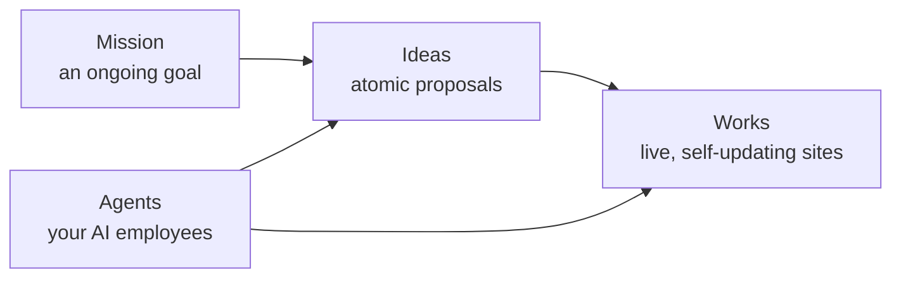

# Platform Overview

The Ever Works Platform provides the backend infrastructure for building, generating, and deploying AI-powered work websites.

## What Ever Works is

Ever Works is an **open-source, agentic runtime** that researches, ships, and maintains content-rich websites and Git repositories. It brings together two things most tools keep apart:

- **The builder experience** — describe what you want and get a shipped website, blog, directory, landing page (and, soon, [stores](/features/store-builder)) generated from a [template](/features/website-templates).
- **The autonomous workforce** — an army of AI [Agents](/features/agents) acting as real employees that keep the work going long after the first build: writing content, finding and adding items, improving code, researching, and proposing what to do next — [24/7, on a schedule](/features/autonomous-operation).

One-shot AI builders generate code and stop. Ever Works keeps building, maintaining, and growing — and because **code and content both live in your own Git**, you own everything and nothing is locked in. The platform is open source under **AGPLv3**.

### The mental model

```mermaid
flowchart LR
    M[Mission<br/>an ongoing goal] --> I[Ideas<br/>atomic proposals]
    I --> W[Works<br/>live, self-updating sites]
    A[Agents<br/>your AI employees] --> W
    A --> I
```

- A **[Mission](/features/missions)** is an ambitious, ongoing goal the system keeps pursuing.
- An **[Idea](/features/ideas)** is a one-shot proposal — one Idea becomes one Work. (Unsure what to build? Capture an Idea and let it be researched first, like a lightweight plan.)
- A **[Work](/features/creating-a-work)** is the buildable, self-maintaining unit. The kinds you pick from the chip catalog at creation time are **website**, **landing page**, **blog**, **directory** and **awesome repo**. Two further kinds exist but are minted by dedicated flows instead of the create screen: **company** (the Register-Company flow) and **campaign** (go-to-market template activation). A **store** kind has not shipped yet — see [Store Builder](/features/store-builder). Full matrix: [Work Kinds & Capabilities](./features/work-kinds.md).
- **[Agents](/features/agents)** are named AI workers (CEO, CTO, Researcher, …) that run the Missions, Ideas, and Works for you.

For the full step-by-step, see the [Founder Journey guide](/guides/founder-journey).

## How It Works

1. **Create a Work** — A user creates a work project through the web dashboard (**+ New** in the sidebar → `/new`, or `/works/new` for the full form), the platform chat, the REST API, the CLI, or an MCP client, providing a topic and description.
2. **AI Generation Pipeline** — The platform's AI agents generate work items by researching the web, extracting relevant listings, validating sources, and organizing content into categories. The run is carried out by a **pipeline plugin**: the 15-step `standard-pipeline` by default, or one of the coding-agent and automation pipelines you can select per Work.
3. **Repository Management** — Generated content is committed to **three Git repositories per Work** that the user owns: `{slug}-data` (structured item data), `{slug}` (rendered markdown), and `{slug}-website` (the deployable site). They are created in your own GitHub account or organization, or in the managed **Ever Works Git** org if you keep the onboarding default. The `company` and `campaign` kinds produce no site, so they get the data and work repositories only.
4. **Website Deployment** — The website repository is deployed to **Vercel**, to **your own Kubernetes cluster**, or to the managed **Ever Works** cluster, which allocates a `*.ever.works` subdomain and provisions a database for the Work. You choose the target in the onboarding wizard or per Work, and can attach your own domain afterwards.
5. **Ongoing Updates** — Works can be regenerated, updated on a schedule, or enriched through AI conversations — and Agents with a heartbeat keep proposing and doing the next thing without being asked.

## Surfaces

Everything above is one API with several front doors. Nothing is dashboard-only: the same operations are reachable from chat, the CLI, an MCP client, and the REST API.

| Surface                                            | What it is                                                                                                                                                                                                                                                       | Start here                                                                                                    |
| -------------------------------------------------- | ---------------------------------------------------------------------------------------------------------------------------------------------------------------------------------------------------------------------------------------------------------------- | ------------------------------------------------------------------------------------------------------------- |
| **Dashboard** (`apps/web`)                         | The Next.js App Router cockpit — home at `/`, then Works, Missions, Ideas, Tasks, Teams, Knowledge Base and Settings.                                                                                                                                            | [The Dashboard](./features/dashboard.md) · [Platform Tour](./guides/platform-tour.md)                         |
| **Platform chat & canvas**                         | A chat rail on every dashboard page that calls the same API the buttons do — roughly 400 tools, acting as you, one entity at a time, with a confirmation card before anything destructive and rich answers rendered on a side Canvas.                            | [Platform Chat](./features/platform-chat.md) · [Do Everything From Chat](./guides/do-everything-from-chat.md) |
| **REST API** (`apps/api`)                          | NestJS 11 under the `/api` prefix, authenticated by session JWT or an `ew_live_…` API key. Outside production it also serves Swagger UI at `/api/swagger`, the Scalar reference at `/api/docs`, and the raw spec at `/api/openapi.json`.                         | [API Reference](./api/index.md) · [API Keys](./features/api-keys.md)                                          |
| **MCP server** (`apps/mcp`)                        | 66 whitelisted API operations plus 6 Knowledge Base tools, `register_work` and `ping` (74 tools in all), generated from the OpenAPI spec and served over `stdio` or `streamable-http`, so Claude Desktop, Claude Code, or any MCP client can drive the platform. | [MCP Server](./features/mcp-server.md) · [MCP Client Setup](./guides/mcp-server-setup.md)                     |
| **CLI** (`ever-works-cli`)                         | `npm install -g ever-works-cli`, then the `ever-works` command with its `auth`, `work`, `plugins`, and `kb` command groups.                                                                                                                                      | [CLI Overview](./cli/index.md) · [CLI Quickstart](./guides/cli-quickstart.md)                                 |
| **Desktop app** (`apps/desktop`)                   | A native shell that either runs the whole stack on your own machine (local-stack mode) or acts as a client for an instance running elsewhere (remote-client mode).                                                                                               | [Desktop App](./features/desktop-app.md) · [Desktop guide](./guides/desktop-app.md)                           |
| **Fleet nodes** (`apps/node`, `apps/desktop-node`) | `ever-works-node enroll`, then `start`, `pause`, `resume`, `status`, `capabilities`, `clear-quarantine`, and `unenroll` — your own machines lease and run platform jobs through the `job-runtime-node` runtime.                                                  | [Fleet](./features/fleet.md)                                                                                  |

The admin interface (`apps/admin`) and the internal NestJS CLI (`apps/internal-cli`) are operator-only surfaces and are not part of the product UI.

## Technology Stack

| Layer           | Technology                                                                                                     | Version                            |
| --------------- | -------------------------------------------------------------------------------------------------------------- | ---------------------------------- |
| Runtime         | Node.js, TypeScript                                                                                            | Node >= 22, TypeScript 5.9         |
| API Framework   | NestJS                                                                                                         | 11                                 |
| Web Dashboard   | Next.js (App Router), React, Tailwind CSS                                                                      | Next 16.2, React 19.2, Tailwind 4  |
| Database ORM    | TypeORM                                                                                                        | ^0.3.31                            |
| AI / LLM        | Vercel AI SDK (`ai`, `@ai-sdk/openai-compatible`)                                                              | ai ^6, openai-compatible ^2        |
| Monorepo        | Turborepo                                                                                                      | 2.x                                |
| Package Manager | pnpm                                                                                                           | 10.33.x (engines require >= 9.9.0) |
| Background Jobs | Six pluggable job runtimes — BullMQ, pg-boss, Temporal, Trigger.dev, Inngest, Fleet nodes                      | —                                  |
| Monitoring      | Sentry, PostHog                                                                                                | —                                  |
| Git Operations  | isomorphic-git, Octokit                                                                                        | —                                  |
| Search          | Nine search plugins — Tavily (default), Brave, Exa, SerpAPI, Perplexity, Bright Data, Firecrawl, Linkup, Valyu | —                                  |

The background runtime is selected per instance under **Settings → Job Runtime**; see [Job Runtimes](./features/job-runtimes.md).

## Key Repositories

| Repository                       | Description                                                                                                                                                                                     |
| -------------------------------- | ----------------------------------------------------------------------------------------------------------------------------------------------------------------------------------------------- |
| `ever-works`                     | Platform monorepo — API, web dashboard, MCP server, CLI, desktop app, fleet node, AI agents, shared packages, the plugin catalog, **and this documentation site** (`apps/docs` renders `docs/`) |
| `directory-web-template`         | The **Classic** template (Next.js) — the default website repository for directory and awesome-repo Works                                                                                        |
| `directory-web-minimal-template` | The **Minimal** template (Astro, static) — opt-in for directory Works, registered through `WEBSITE_TEMPLATE_MINIMAL_REPO`                                                                       |
| `web-template`                   | The **Website** template (Next.js) — the default for website, landing-page, and blog Works                                                                                                      |
| `web-minimal-template`           | The **Website (Minimal)** template (Astro, static) — the opt-in general-purpose variant                                                                                                         |
| `agents`                         | Ready-made Agent definitions (CEO, CTO, and more) used as Agent templates                                                                                                                       |

The template registry lives in `packages/agent/src/generators/website-generator/config/website-template.config.ts`; see [Website Templates](./features/website-templates.md) for the full catalogue.

## AI Providers

The platform supports 11 LLM providers, all accessed through an OpenAI-compatible interface:

- **OpenAI** — GPT-5.1, GPT-5-nano, GPT-4o-mini
- **Google** — Gemini 2.5 Flash, Gemini 2.5 Pro
- **Anthropic** — Claude Sonnet 4.5, Claude Haiku 4.5
- **Groq** — Fast inference with open-weight models (`qwen/qwen3-32b` by default)
- **Grok (xAI)** — `grok-2-latest` and the rest of the xAI catalog
- **Mistral** — Mistral Small, Medium, Large
- **OpenRouter** — Multi-provider gateway (400+ models)
- **Ollama** — Local model inference
- **LM Studio** — Models served by LM Studio's local server (`http://localhost:1234/v1` by default)
- **vLLM** — Your own self-hosted vLLM OpenAI-compatible server (`http://localhost:8000/v1` by default)
- **Vercel AI Gateway** — Multi-provider routing via Vercel

See [AI & Generation](/ai-agents) for details, and [Bring Your Own AI Provider](./guides/bring-your-own-ai-provider.md) for the setup walkthrough.

## Plugin System

The platform uses a **capability-driven plugin architecture**. All external integrations — AI providers, search engines, deployment, screenshots, and more — are implemented as plugins. At the time of writing the repository holds **102 plugin packages** under `packages/plugins/`, spread across 19 categories (AI providers, pipelines, search, content extractors, connectors, job runtimes, secret stores, storage, vector stores, notification channels, email providers, metrics, and more), and new plugins can be added without modifying core code. See [Plugin System](/plugin-system) for details.

## Related

- [Getting Started](./getting-started.md) · [Installation](./installation.md)
- [The Founder Journey](./guides/founder-journey.md) · [Platform Tour](./guides/platform-tour.md)
- [Work Kinds & Capabilities](./features/work-kinds.md) · [Creating a Work](./features/creating-a-work.md)
- [Plugin System](./plugin-system/index.md) · [Job Runtimes](./features/job-runtimes.md)
- [Self-host with Docker Compose and Kubernetes](./guides/self-host-docker-kubernetes.md) · [Custom Domains and Deploy Targets](./guides/custom-domains-and-deploy-targets.md)
