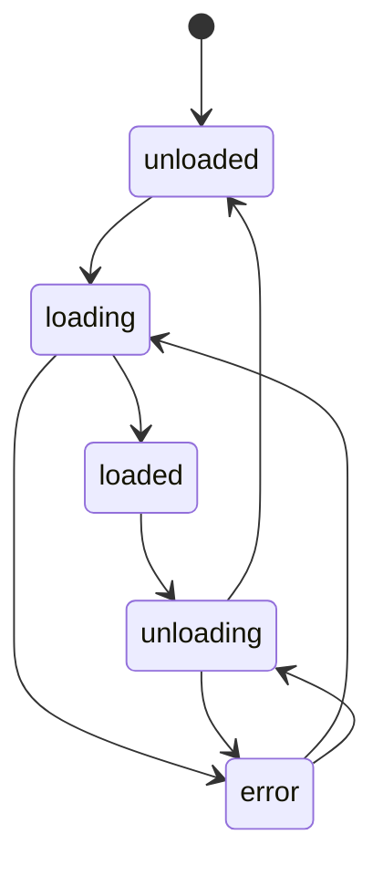

# Plugins Package Overview

The `packages/plugins/` work contains all first-party plugin implementations for the Ever Works platform. Each plugin is a standalone ESM package that extends the platform with capabilities such as AI content generation, web search, content extraction, screenshot capture, git integration, deployment, and pipeline orchestration.

## Overview

| Property            | Value                                       |
| ------------------- | ------------------------------------------- |
| **Location**        | `platform/packages/plugins/`                |
| **Module format**   | ESM (with CJS fallback)                     |
| **Build tool**      | tsup                                        |
| **Test runner**     | Vitest                                      |
| **Plugin contract** | `@ever-works/plugin` (workspace dependency) |
| **Total plugins**   | 30                                          |
| **License**         | AGPL-3.0 (individual packages)                   |

## Module Structure

Each plugin follows a consistent work layout:

```
packages/plugins/<plugin-name>/
├── package.json          # Package metadata + everworks.plugin manifest
├── tsconfig.json         # TypeScript configuration
├── tsup.config.ts        # Build configuration (ESM + CJS dual output)
├── vitest.config.ts      # Test configuration
└── src/
    ├── index.ts          # Barrel export of the plugin class
    ├── <name>.plugin.ts  # Plugin implementation
    └── __tests__/        # Test files
```

## Plugin Categories

Plugins are organized by functional category, declared in the `everworks.plugin.category` field of each plugin's `package.json`:

### AI Providers

Provide large language model access for content generation, chat completion, streaming, and embeddings.

| Plugin     | Package                         | Description                            |
| ---------- | ------------------------------- | -------------------------------------- |
| OpenAI     | `@ever-works/openai-plugin`     | GPT models via OpenAI API              |
| Anthropic  | `@ever-works/anthropic-plugin`  | Claude models via Anthropic API        |
| Google     | `@ever-works/google-plugin`     | Gemini models via Google AI API        |
| Groq       | `@ever-works/groq-plugin`       | Fast inference via Groq API            |
| Ollama     | `@ever-works/ollama-plugin`     | Local model inference via Ollama       |
| OpenRouter | `@ever-works/openrouter-plugin` | Multi-provider routing via OpenRouter  |
| Mistral    | `@ever-works/mistral-plugin`    | Mistral models via Mistral API         |
| Perplexity | `@ever-works/perplexity-plugin` | Perplexity models with built-in search |

### Search Providers

Power web research during content generation by querying external search APIs.

| Plugin  | Package                      | Description                           |
| ------- | ---------------------------- | ------------------------------------- |
| Exa     | `@ever-works/exa-plugin`     | Neural and keyword search via Exa API |
| Tavily  | `@ever-works/tavily-plugin`  | AI-optimized search via Tavily API    |
| SerpAPI | `@ever-works/serpapi-plugin` | Google search results via SerpAPI     |
| Brave   | `@ever-works/brave-plugin`   | Web search via Brave Search API       |
| Valyu   | `@ever-works/valyu-plugin`   | Search via Valyu API                  |

### Content Extraction

Extract and process content from web pages, documents, and external services.

| Plugin                  | Package                                      | Description                           |
| ----------------------- | -------------------------------------------- | ------------------------------------- |
| Local Content Extractor | `@ever-works/local-content-extractor-plugin` | Built-in HTML/text extraction         |
| Notion Extractor        | `@ever-works/notion-extractor-plugin`        | Import content from Notion workspaces |
| Firecrawl               | `@ever-works/firecrawl-plugin`               | Web scraping via Firecrawl API        |
| Jina                    | `@ever-works/jina-plugin`                    | Content extraction via Jina Reader    |
| Scrapfly                | `@ever-works/scrapfly-plugin`                | Web scraping via Scrapfly API         |
| BrightData              | `@ever-works/brightdata-plugin`              | Web data collection via Bright Data   |
| PDF Extractor           | `@ever-works/pdf-extractor-plugin`           | PDF document content extraction       |

### Screenshot Providers

Capture website screenshots for work item thumbnails and previews.

| Plugin        | Package                            | Description                       |
| ------------- | ---------------------------------- | --------------------------------- |
| ScreenshotOne | `@ever-works/screenshotone-plugin` | Screenshots via ScreenshotOne API |
| URLBox        | `@ever-works/urlbox-plugin`        | Screenshots via URLBox API        |

### Git Providers

Manage repository operations for work data storage and website deployment.

| Plugin | Package                     | Description                                               |
| ------ | --------------------------- | --------------------------------------------------------- |
| GitHub | `@ever-works/github-plugin` | Repository management, git operations, and GitHub Actions |

### Infrastructure

Handle deployment and cloud resource management.

| Plugin | Package                     | Description                   |
| ------ | --------------------------- | ----------------------------- |
| Vercel | `@ever-works/vercel-plugin` | Website deployment to Vercel  |
| Apify  | `@ever-works/apify-plugin`  | Web scraping actors via Apify |

### Pipeline

Orchestrate multi-step generation workflows.

| Plugin               | Package                                   | Description                         |
| -------------------- | ----------------------------------------- | ----------------------------------- |
| Agent Pipeline       | `@ever-works/agent-pipeline-plugin`       | AI agent-driven generation pipeline |
| Standard Pipeline    | `@ever-works/standard-pipeline-plugin`    | Rule-based generation pipeline      |
| Comparison Generator | `@ever-works/comparison-generator-plugin` | Item comparison content generation  |

### AI Tools

Extended AI capabilities and gateway services.

| Plugin            | Package                                | Description                                |
| ----------------- | -------------------------------------- | ------------------------------------------ |
| Claude Code       | `@ever-works/claude-code-plugin`       | Claude Code integration for advanced tasks |
| Vercel AI Gateway | `@ever-works/vercel-ai-gateway-plugin` | AI model routing via Vercel AI Gateway     |

## Plugin Manifest

Every plugin declares its identity and capabilities in the `everworks.plugin` field of its `package.json`:

```json
{
	"everworks": {
		"plugin": {
			"id": "openai",
			"name": "OpenAI",
			"version": "1.0.0",
			"category": "ai-provider",
			"capabilities": ["ai-provider"],
			"description": "OpenAI AI provider plugin for Ever Works platform",
			"author": { "name": "Ever Works Team" },
			"license": "AGPL-3.0",
			"builtIn": true,
			"autoEnable": false
		}
	}
}
```

| Field          | Type               | Description                                                                                                                        |
| -------------- | ------------------ | ---------------------------------------------------------------------------------------------------------------------------------- |
| `id`           | `string`           | Unique plugin identifier                                                                                                           |
| `name`         | `string`           | Human-readable display name                                                                                                        |
| `version`      | `string`           | Semantic version                                                                                                                   |
| `category`     | `PluginCategory`   | Functional category (`ai-provider`, `search`, `content-extraction`, `screenshot`, `git`, `infrastructure`, `pipeline`, `ai-tools`) |
| `capabilities` | `string[]`         | List of capability identifiers the plugin provides                                                                                 |
| `description`  | `string`           | Short description                                                                                                                  |
| `author`       | `{ name: string }` | Author information                                                                                                                 |
| `license`      | `string`           | License identifier                                                                                                                 |
| `builtIn`      | `boolean`          | Whether the plugin ships with the platform                                                                                         |
| `autoEnable`   | `boolean`          | Whether to enable automatically on first load                                                                                      |

## Key Classes and Interfaces

### Plugin Base Classes

All AI provider plugins extend `BaseAiProvider` from `@ever-works/plugin/abstract`:

```typescript
import { BaseAiProvider } from '@ever-works/plugin/abstract';
import { AiOperations } from '@ever-works/plugin/ai';

export class OpenAiPlugin extends BaseAiProvider {
	readonly id = 'openai';
	readonly name = 'OpenAI';
	readonly version = '1.0.0';
	readonly providerType = 'openai';
	readonly configurationMode = 'user-required';

	async onLoad(context: PluginContext): Promise<void> {
		await super.onLoad(context);
		this.aiOps = new AiOperations({
			/* ... */
		});
	}

	async createChatCompletion(options: ChatCompletionOptions): Promise<ChatCompletionResponse> {
		const resolvedConfig = this.resolveConfig(options.settings);
		return this.aiOps.createChatCompletion(options, resolvedConfig);
	}
}
```

### AiOperations

The `AiOperations` class from `@ever-works/plugin/ai` wraps LangChain and provides a unified API that all AI provider plugins use:

- `createChatCompletion()` -- Standard chat completion
- `createStreamingChatCompletion()` -- Streaming chat completion (async iterable)
- `createEmbedding()` -- Text embeddings
- `listModels()` -- Available model enumeration
- `testConnection()` -- Connectivity validation

### Settings Schema

Plugins define their configurable settings using JSON Schema with custom extensions:

| Extension  | Purpose                                        |
| ---------- | ---------------------------------------------- |
| `x-secret` | Marks a field as sensitive (encrypted at rest) |
| `x-scope`  | Setting scope: `user`, `global`, or `work`     |
| `x-widget` | UI widget hint (e.g., `model-select`)          |
| `x-hidden` | Hides field from the default settings UI       |
| `x-envVar` | Maps field to an environment variable          |

### Configuration Modes

Each plugin declares how it expects settings to be provided:

| Mode            | Description                                                              |
| --------------- | ------------------------------------------------------------------------ |
| `admin-only`    | Platform admin provides all settings (e.g., a centrally managed API key) |
| `user-required` | Each user must supply their own credentials (e.g., personal API key)     |
| `hybrid`        | Admin provides defaults; users can override with their own values        |

## Dependencies

All plugins share common workspace dependencies:

| Package              | Purpose                                           |
| -------------------- | ------------------------------------------------- |
| `@ever-works/plugin` | Plugin contracts, base classes, and AI operations |
| `tsup`               | Build tool (dev dependency)                       |
| `typescript`         | Type checking (dev dependency)                    |
| `vitest`             | Test runner (dev dependency)                      |

AI provider plugins additionally depend on the relevant LangChain provider package (e.g., `@langchain/openai`, `@langchain/anthropic`, `@langchain/google-genai`).

## Build and Test

### Building Plugins

```bash
# Build all plugins (from monorepo root)
pnpm build:plugins

# Build a single plugin
cd packages/plugins/openai && pnpm build

# Watch mode for development
cd packages/plugins/openai && pnpm dev
```

Each plugin builds with tsup, producing dual ESM (`dist/index.js`) and CJS (`dist/index.cjs`) output along with TypeScript declarations (`dist/index.d.ts`).

### Testing Plugins

```bash
# Run tests for a single plugin
cd packages/plugins/openai && pnpm test

# Run a specific test file
cd packages/plugins/openai && npx vitest run src/__tests__/openai.spec.ts

# Watch mode
cd packages/plugins/openai && pnpm test:watch
```

## Usage Examples

### Registering Plugins with the Platform

Plugins are discovered and loaded by the `PluginsModule` in the agent package. Built-in plugins are loaded from the `packages/plugins/` work at startup:

```typescript
import { PluginsModule } from '@ever-works/agent/plugins';
import { PluginBootstrapService } from '@ever-works/agent/plugins';

@Module({
	imports: [
		PluginsModule.forRoot({
			autoLoadBuiltIn: true,
			environment: 'production',
			encryptSecrets: true,
			maxConcurrentLoads: 5,
			loadTimeout: 30000
		})
	]
})
export class ApiModule implements OnApplicationBootstrap {
	constructor(private readonly pluginBootstrap: PluginBootstrapService) {}

	async onApplicationBootstrap() {
		await this.pluginBootstrap.bootstrap();
	}
}
```

### Creating a New Plugin

To add a new plugin to the platform:

1. Create a new work under `packages/plugins/<plugin-name>/`
2. Add a `package.json` with the `everworks.plugin` manifest
3. Implement the plugin class extending the appropriate base class
4. Export the plugin from `src/index.ts`
5. Add build configuration (`tsup.config.ts`, `tsconfig.json`, `vitest.config.ts`)

Example minimal plugin structure:

```typescript
// src/my-search.plugin.ts
import type { IPlugin, PluginContext, PluginManifest } from '@ever-works/plugin';

export class MySearchPlugin implements IPlugin {
	readonly id = 'my-search';
	readonly name = 'My Search';
	readonly version = '1.0.0';
	readonly category = 'search';
	readonly capabilities = ['search'];

	async onLoad(context: PluginContext): Promise<void> {
		context.logger.log('My Search Plugin loaded');
	}

	async onUnload(): Promise<void> {}

	getManifest(): PluginManifest {
		return {
			id: this.id,
			name: this.name,
			version: this.version,
			description: 'Custom search provider',
			category: this.category,
			capabilities: [...this.capabilities],
			author: { name: 'Your Name' },
			license: 'AGPL-3.0',
			builtIn: true,
			autoEnable: false
		};
	}
}
```

```typescript
// src/index.ts
export { MySearchPlugin, MySearchPlugin as default } from './my-search.plugin.js';
```

### Plugin Lifecycle Events

The plugin runtime emits events at each lifecycle stage. Other services can listen for these:

| Event                     | Constant                        | Description                        |
| ------------------------- | ------------------------------- | ---------------------------------- |
| `plugin:loaded`           | `PluginEvents.LOADED`           | Plugin successfully loaded         |
| `plugin:unloaded`         | `PluginEvents.UNLOADED`         | Plugin unloaded                    |
| `plugin:error`            | `PluginEvents.ERROR`            | Plugin encountered an error        |
| `plugin:settings-changed` | `PluginEvents.SETTINGS_CHANGED` | Plugin settings were updated       |
| `plugin:state-changed`    | `PluginEvents.STATE_CHANGED`    | Plugin transitioned to a new state |
| `plugin:registered`       | `PluginEvents.REGISTERED`       | Plugin registered in the registry  |
| `plugin:unregistered`     | `PluginEvents.UNREGISTERED`     | Plugin removed from the registry   |

### Plugin State Machine

Plugins follow a strict state machine with valid transitions:



## Settings Resolution

Plugin settings are resolved through a multi-layer priority system. Higher-priority sources override lower-priority ones:

| Priority    | Source    | Description                            |
| ----------- | --------- | -------------------------------------- |
| 1 (highest) | `work`    | Per-work overrides                     |
| 2           | `user`    | User-level preferences                 |
| 3           | `admin`   | Platform admin defaults                |
| 4           | `env`     | Environment variables (via `x-envVar`) |
| 5 (lowest)  | `default` | Schema-defined defaults                |

This allows flexible configuration where, for example, an admin can set a default AI model but individual users can override it with their own preference, and specific works can further customize the setting.
