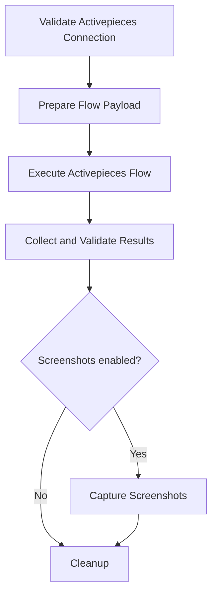

# Activepieces Plugin

| Field                          | Value                              |
| ------------------------------ | ---------------------------------- |
| Plugin ID                      | `activepieces`                     |
| Package                        | `@ever-works/activepieces-plugin`  |
| Category                       | `pipeline`                         |
| Capabilities                   | `pipeline`, `form-schema-provider` |
| Configuration Mode             | `user-required`                    |
| Auto Enable                    | No                                 |
| Selectable Provider Categories | `screenshot`                       |

## Overview

The Activepieces plugin replaces the standard generation pipeline with a flow you build in [Activepieces](https://www.activepieces.com/), the AI-first open-source automation platform. When generation runs, the plugin POSTs the work's context to a flow webhook and collects the items that flow returns from its **Return Response** action.

Use it when your generation logic belongs in a visual builder rather than in platform code — calling Activepieces' 280+ pieces (APIs, databases, scrapers), reaching an internal system that only your automation platform can see, or reusing a flow your team already maintains. Because the flow supplies its own AI and search, you do **not** need AI provider or search provider plugins configured in Ever Works; the only optional Ever Works provider is screenshot.

Activepieces is also self-hostable, which is the main reason to pick it over the hosted-only alternatives — point **Activepieces API Base URL** at your own instance and neither the payload nor the flow output leaves your infrastructure.

## Selecting It

In the work edit screen, set **Generation Pipeline** to `Activepieces Automation`. The plugin appears in the dropdown once an Activepieces API key has been configured in plugin settings.

## Configuration

Configure these under **Settings > Plugins > Activepieces Automation**:

| Setting                   | Key             | Required | Notes                                                                                                                                              |
| ------------------------- | --------------- | -------- | -------------------------------------------------------------------------------------------------------------------------------------------------- |
| Activepieces API Key      | `apiKey`        | Yes      | Generated from the Activepieces Platform Dashboard (Platform or Enterprise edition). Stored as a secret; also settable via `ACTIVEPIECES_API_KEY`. |
| Activepieces API Base URL | `baseUrl`       | No       | Defaults to `https://cloud.activepieces.com/api/v1`. Set this to your own instance when self-hosting.                                              |
| Default Project ID        | `projectId`     | No       | Needed to list flows and inspect runs — and **required** for async mode.                                                                           |
| Default Flow ID           | `defaultFlowId` | No       | Flow invoked when the generator form doesn't override it.                                                                                          |

Saving runs a connection check: with a default flow ID set it validates that flow, otherwise it pings the flows endpoint.

The base URL is passed through a lexical SSRF guard before any request carries your API key to it: non-HTTP(S) schemes, private/loopback/link-local/cloud-metadata IP literals, and the known metadata hostnames are rejected outright. See [Security](#security) for what that guard does and does not cover.

## Your Flow

Your flow must **start with a Webhook trigger** and **end with a Return Response action**. It also has to be enabled and published — the plugin refuses to trigger a flow whose status isn't `ENABLED`, and warns when there is no published version.

### Input your flow receives

```json
{
	"metadata": {
		"workId": "dir-123",
		"workName": "Best AI Tools",
		"workSlug": "best-ai-tools",
		"workDescription": "A curated list of the best AI tools",
		"prompt": "Find the best AI writing tools",
		"generationMethod": "create-update",
		"targetItems": 50
	},
	"existingSummary": {
		"totalItems": 10,
		"categories": ["Writing", "Image Generation"],
		"tags": ["free", "open-source"],
		"sampleItems": [{ "name": "ChatGPT", "url": "https://chat.openai.com" }]
	},
	"flowParams": {}
}
```

`metadata` is always present; `metadata.prompt` is the user's instruction and `metadata.targetItems` is how many new items they want. `existingSummary` is omitted when the work is empty or **Pass Existing Items Summary** is off — use it to avoid regenerating items that already exist, bearing in mind that `sampleItems` holds only the first 20 while `totalItems` is the full count. `flowParams` carries whatever you put in the Advanced section of the generator form. A `dataSource` object is present only when repository access is enabled (see [Security](#security)).

### Output your flow must return

```json
{
	"items": [
		{
			"name": "Tool Name",
			"description": "A concise description (1-3 sentences)",
			"url": "https://example.com",
			"category": "Category Name",
			"tags": ["tag1", "tag2"],
			"content": "Optional longer markdown content",
			"brand": "Optional brand name",
			"images": ["https://example.com/screenshot.png"]
		}
	]
}
```

Per-item fields:

| Field         | Maps to       | Notes                                                                                                       |
| ------------- | ------------- | ----------------------------------------------------------------------------------------------------------- |
| `name`        | `name`        | The only strictly required field — items without one are dropped silently.                                  |
| `description` | `description` | Plain text summary.                                                                                         |
| `url`         | `source_url`  | `source_url` is accepted as a fallback. A URL that fails the safety check is blanked, but the item is kept. |
| `content`     | `markdown`    | Longer markdown body for the item's detail page.                                                            |
| `category`    | `category`    | Single category name.                                                                                       |
| `tags`        | `tags`        | Array of strings.                                                                                           |
| `brand`       | `brand`       | Brand or company name.                                                                                      |
| `images`      | `images`      | Array of image URLs; unsafe URLs are stripped.                                                              |

You may also return top-level `categories` (`{ name, description }`), `tags` (`{ name }`), and `brands` (`{ name, url }`) arrays. These are **merged with**, not substituted for, the values derived from the items themselves — an explicit array can add entries and attach a `description` or `url`, but it cannot restrict the set, because every `category`, `tags` entry, and `brand` found on an item is always included. Matching is exact and case-sensitive, so an explicit `{ "name": "writing" }` alongside an item with `"category": "Writing"` produces two separate entries.

The parser is deliberately forgiving about wrapping: a bare array of items works, as does a JSON string, and it unwraps `body`, `output`, `result`, `data`, `response`, `value`, or a JSON-encoded `message` before looking for `items`. Returned items are deduplicated against existing work items by name, case-insensitively.

## Generator Form Options

### Flow Configuration

- **Activepieces Flow ID** — overrides `defaultFlowId` for this run. Generation fails early if neither is set.
- **Webhook Execution Mode** — `sync` (default) or `async`; see [Sync vs Async](#sync-vs-async).
- **Target Items** — new items to aim for (default 50, max 500). Passed through as `metadata.targetItems`.
- **Flow Timeout (minutes)** — how long to wait for the flow (default 60, clamped to 1–120).

### Data Passing

- **Pass Existing Items Summary** (default on) — sends `existingSummary` with the totals, the category and tag names, and the first 20 existing items (`sampleItems`) with their names and URLs. `totalItems` is the full count, so on a larger work the flow sees only a sample; enable **Pass Data Repository Access** if it needs the complete list. Ever Works deduplicates by name server-side regardless.
- **Pass Data Repository Access** (default off) — sends the work's GitHub data repository URL and a read token so the flow can read the full dataset. Reveals **Data Repository URL** (must be an `https://github.com/...` URL), **Repository Access Token**, and **Repository Branch** (default `data`). Read [Security](#security) before enabling.

### Features

- **Capture Screenshots** (default off) — after the flow returns, Ever Works captures screenshots for items that have a URL but no images, using your configured screenshot provider. Skipped with a warning when no screenshot plugin is available.

### Advanced

- **Custom Flow Parameters** — a JSON object delivered to the flow as `flowParams`, e.g. `{ "search_depth": "deep", "region": "US" }`.

## Pipeline Steps



| #   | Step                             | Optional | What it does                                                           |
| --- | -------------------------------- | -------- | ---------------------------------------------------------------------- |
| 1   | Validate Activepieces Connection | No       | Verifies the API key and that the target flow is enabled.              |
| 2   | Prepare Flow Payload             | No       | Builds the payload from work context, existing items, and form config. |
| 3   | Execute Activepieces Flow        | No       | Triggers the flow webhook (sync, or async with run polling).           |
| 4   | Collect & Validate Results       | No       | Parses the output, validates items, and deduplicates by name.          |
| 5   | Capture Screenshots              | Yes      | Fills in item images via the screenshot provider.                      |
| 6   | Cleanup                          | Yes      | Releases resources.                                                    |

The plugin talks to the Activepieces REST API directly — no SDK. It uses `GET /flows/{id}`, `POST /webhooks/{flowId}/sync` or `POST /webhooks/{flowId}`, and `GET /flow-runs` / `GET /flow-runs/{id}`. Platform endpoints carry `Authorization: Bearer <API_KEY>`; webhook endpoints are public per-flow URLs and are called without it, so self-hosted gateways won't reject the request.

## Sync vs Async

**Sync** (recommended) posts to `/webhooks/{flowId}/sync`; Activepieces holds the connection open until your Return Response action fires, and that response body is the flow output.

If that body includes a top-level `runId` or `flowRunId`, the plugin also makes a best-effort fetch of the matching run record for auditing — a bare `id` is deliberately ignored, since flows commonly emit their own `id` fields and looking one up would 404 or audit the wrong run. When a run record is fetched and reports that the run didn't succeed, you get a warning but the returned body is still used, since HTTP 200 already proves Return Response ran. Without one of those two keys — including for the plain `{ "items": [...] }` shape above — no run record is fetched and no run status appears in the pipeline metrics. Emit `runId` alongside your items if you want that audit trail.

**Async** posts to `/webhooks/{flowId}`, which returns immediately, then polls `GET /flow-runs` every 2 seconds until the run reaches a terminal status and reads the run's steps as the output. It **requires a Default Project ID** — that is validated before the webhook fires, so a misconfigured run doesn't burn Activepieces quota. A non-`SUCCEEDED` run fails the generation, naming the failed step. `PAUSED` is not treated as terminal, so `Delay` and `Wait for Approval` steps resume normally.

Prefer sync. Async depends on the run's step output rather than a response body you control, so the shape is far less predictable.

## Security

Enabling **Pass Data Repository Access** puts your repository URL and access token in the webhook body — not in a header. That makes them visible to every step downstream of the Webhook trigger, to the Activepieces run inspector and dashboard, and to anything your flow logs or forwards. The plugin logs a warning at the prepare-payload step so operators have an audit trail.

:::caution
If you enable it, use a [GitHub fine-grained personal access token](https://github.com/settings/tokens?type=beta) scoped to only the data repository, with **Contents: Read-only** and the shortest expiration you can tolerate. Never a classic PAT or anything with write scope. Audit your flow to be sure no step echoes the trigger body to a third party.
:::

The plugin defends the rest of the path as well: the tenant-supplied base URL and every URL coming back from the flow (item `source_url` and `images`) go through the same **lexical** SSRF guard, which rejects non-HTTP(S) schemes such as `javascript:`, `file:`, and `data:` along with private, loopback, link-local, CGNAT, and cloud-metadata IP literals and the known metadata hostnames. It does **not** resolve DNS, so a hostname that resolves to an internal address still passes — treat flow output as untrusted input rather than relying on this guard to contain a genuinely hostile flow. Raw flow output is redacted before it reaches pipeline logs — token-, secret-, and password-shaped keys are replaced with `[redacted]` — because a flow that echoes its trigger body would otherwise leak the repository token into your logs. Flow timeout is clamped server-side to 1–120 minutes, and an unrecognized webhook mode falls back to `sync`.

## How It Compares

| Concern     | Activepieces                 | Make.com                 | Zapier                            | Composio                            |
| ----------- | ---------------------------- | ------------------------ | --------------------------------- | ----------------------------------- |
| Hosting     | Cloud **or** self-hosted     | Cloud                    | Cloud                             | Cloud                               |
| Invocation  | Flow ID + webhook            | Webhook URL              | Zap webhook URL                   | Tool slug (`GMAIL_SEND_EMAIL`)      |
| Credentials | Per-project                  | Per-connection           | Per-Zap connection                | Per-user, brokered by Composio      |
| Best for    | Self-hosted automation flows | Visual scenario building | Fanning events into the long tail | Agent-style multi-user tool calling |

## Troubleshooting

| Problem                                                    | What to check                                                                                                                    |
| ---------------------------------------------------------- | -------------------------------------------------------------------------------------------------------------------------------- |
| "Invalid Activepieces API key"                             | Regenerate the key in the Platform Dashboard and re-save plugin settings. Requires Platform or Enterprise edition.               |
| "API key does not have permission to access this resource" | The key belongs to a different project — check Default Project ID.                                                               |
| "Activepieces resource not found"                          | Verify the flow ID and project ID, and that the flow is published.                                                               |
| "Flow is not enabled"                                      | Enable the flow in the Activepieces dashboard.                                                                                   |
| "No Activepieces flow ID provided"                         | Set **Default Flow ID** in plugin settings or **Activepieces Flow ID** on the generator form.                                    |
| "Async mode requires a Default Project ID"                 | Add the project ID, or switch to sync mode.                                                                                      |
| "Flow did not finish within Ns"                            | Raise **Flow Timeout** (up to 120 minutes) or make the flow faster.                                                              |
| "Output does not contain an 'items' array"                 | Your Return Response isn't emitting `{ items: [...] }`. The error lists the keys actually received.                              |
| "Returned a valid response but with no usable items"       | Items came back without a `name`, or the array was empty. Inspect the run in the Activepieces dashboard.                         |
| "Returned a string that is not valid JSON"                 | The Return Response action is sending text. Emit a JSON object.                                                                  |
| "Rate limit exceeded"                                      | Wait for the Activepieces limit to reset.                                                                                        |
| "Base URL is not safe to call"                             | The base URL is a private/loopback/metadata IP literal or metadata hostname, or isn't HTTP(S). Use a routable HTTPS URL.         |
| Items missing images                                       | Enable **Capture Screenshots** and configure a screenshot plugin; item `source_url` values that fail the SSRF guard are skipped. |

Every run is visible in the Activepieces dashboard with step-by-step output — check there first when a generation fails inside the flow.

## Related

- [Make.com Plugin](./make-plugin.md) — hosted visual scenario builder
- [Zapier Plugin](./zapier-plugin.md) — event fan-out to a very large app catalog
- [Composio Plugin](./composio-plugin.md) — per-user OAuth tool calling
- [SIM AI Workflows Plugin](./sim-ai-plugin.md) — workflow-driven pipeline alternative
- [Built-in Plugins](./built-in-plugins.md)
- [Pipeline Plugins overview](./pipeline-plugins.md)
- [Activepieces API documentation](https://www.activepieces.com/docs/endpoints/overview)
