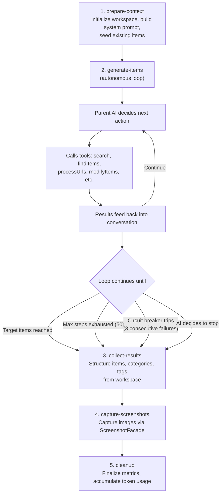

# Agent Pipeline Plugin Deep Dive

## Overview

The Agent Pipeline plugin (`@ever-works/plugins/agent-pipeline`) is an autonomous, AI-driven directory generation engine that uses tool calling to discover, extract, and organize directory items. Unlike the Standard Pipeline's deterministic 15-step flow, the Agent Pipeline gives an AI "parent" agent full autonomy to decide which tools to call, in what order, and how many times.

The plugin uses the Vercel AI SDK's `generateText()` with tool definitions, allowing the AI model to iteratively search the web, process URLs, extract items, and modify results until it reaches the target item count or exhausts its step budget.

- **Plugin ID**: `agent-pipeline`
- **Category**: `pipeline`
- **Capabilities**: `pipeline`, `form-schema`
- **Configuration Mode**: `hybrid`
- **Source**: `packages/plugins/agent-pipeline/src/`

## Architecture

### Two-Model Architecture

The Agent Pipeline uses two distinct AI models:

1. **Parent Model** (orchestrator) - Routes to `complexity: 'complex'` tier. Controls the overall generation flow, decides which tools to call, and synthesizes results. Uses the full conversation context with tool call history.

2. **Worker Model** (extraction) - Routes to `complexity: 'default'` tier. Handles content extraction from URLs within the `processUrls` tool. Operates on individual web pages without the parent's conversation context.

Both models are instantiated via `createOpenAICompatible` from `@ai-sdk/openai-compatible`, allowing any OpenAI-compatible provider to be used.

### Pipeline Steps

The Agent Pipeline defines 5 steps (compared to Standard Pipeline's 15):

| Step ID               | Step Name           | Est. Duration | Description                               |
| --------------------- | ------------------- | ------------- | ----------------------------------------- |
| `prepare-context`     | Prepare Context     | 5s            | Initialize context, compact existing data |
| `generate-items`      | Generate Items      | 120s          | Autonomous tool-calling generation loop   |
| `collect-results`     | Collect Results     | 5s            | Collect and structure final items         |
| `capture-screenshots` | Capture Screenshots | 30s           | Capture images for items                  |
| `cleanup`             | Cleanup             | 2s            | Finalize metrics and clean up resources   |

Step dependencies:

- `generate-items` requires `prepare-context`
- `collect-results` requires `generate-items`
- `capture-screenshots` requires `collect-results`
- `cleanup` requires `capture-screenshots`

### Execution Flow



### Token Usage Tracking

The `TokenUsageAccumulator` class tracks token usage across parent and worker models separately:

```typescript
interface TokenUsageBreakdown {
	parent: { promptTokens: number; completionTokens: number; totalTokens: number };
	workers: { promptTokens: number; completionTokens: number; totalTokens: number };
	total: { promptTokens: number; completionTokens: number; totalTokens: number };
}
```

## Configuration

### Settings Schema

The Agent Pipeline's form schema is defined in `form-schema.ts`:

| Field                  | Type      | Default | Min | Max    | Description                           |
| ---------------------- | --------- | ------- | --- | ------ | ------------------------------------- |
| `target_items`         | `number`  | `50`    | `1` | `500`  | Target number of items to generate    |
| `max_pages_to_process` | `number`  | `10`    | `1` | `1000` | Maximum pages to extract content from |
| `capture_screenshots`  | `boolean` | `false` | -   | -      | Whether to capture screenshots        |

### Constants

Key constants defined in `types.ts`:

| Constant                        | Value  | Description                                   |
| ------------------------------- | ------ | --------------------------------------------- |
| `DEFAULT_MAX_STEPS`             | `50`   | Maximum tool-calling iterations               |
| `DEFAULT_CONTEXT_BUDGET_RATIO`  | `0.8`  | Fraction of context window to use             |
| `MAX_URLS_PER_BATCH`            | `10`   | Maximum URLs processed per `processUrls` call |
| `WORKER_PROMPT_OVERHEAD_TOKENS` | `2000` | Token overhead reserved for worker prompts    |
| `MIN_CHUNK_CHARS`               | `4000` | Minimum characters for content chunks         |

### Worker Content Budget

The `getWorkerContentBudgetRatio()` function dynamically adjusts how much of the worker's context is allocated to content based on context size:

- Context >= 100K tokens: 70% for content
- Context >= 50K tokens: 60% for content
- Default: 50% for content

## Capabilities

### Core Capabilities

- **`pipeline`** - Full autonomous directory generation via tool calling
- **`form-schema`** - Dynamic form field definitions for the generation UI

### Tools Available to the Parent Agent

The parent agent has access to 6 tools:

#### 1. `search`

Executes web search queries via `SearchFacade`.

```typescript
parameters: {
	queries: z.array(z.string()).min(1).max(5).describe('Search queries (1-5)');
}
```

#### 2. `findItems`

Extracts directory items from search result content using the worker model.

```typescript
parameters: {
	searchResults: z.array(
		z.object({
			url: z.string(),
			title: z.string().optional(),
			snippet: z.string().optional()
		})
	);
}
```

#### 3. `processUrls`

Extracts content from specific URLs and finds directory items. Processes 1-10 URLs with concurrency of 2 (via `p-map`).

```typescript
parameters: {
	urls: z.array(z.string().url()).min(1).max(10).describe('URLs to process (1-10)');
}
```

#### 4. `modifyItems`

Modifies existing items in the workspace (update, remove, merge, or set featured status).

```typescript
parameters: {
	operations: z.array(
		z.object({
			action: z.enum(['update', 'remove', 'merge', 'set-featured']),
			slug: z.string(),
			data: z.record(z.unknown()).optional()
		})
	);
}
```

#### 5. `getWorkspaceOverview`

Returns a summary of the current workspace state: item count, categories, and items list.

```typescript
parameters: {
} // No parameters
```

#### 6. `reportProgress`

Reports progress updates that are forwarded to the user interface.

```typescript
parameters: {
    message: z.string(),
    percentage: z.number().min(0).max(100).optional()
}
```

## API Reference

### Plugin Class

```typescript
class AgentPipelinePlugin implements IPlugin, IPipelinePlugin<AgentPipelineStepId>, IFormSchemaProvider {
	readonly id = 'agent-pipeline';
	readonly name = 'Agent Pipeline';
	readonly version = '1.0.0';
	readonly category: PluginCategory = 'pipeline';
	readonly capabilities = ['pipeline', 'form-schema'];
	readonly executionMode = 'engine-orchestrated';

	async executeStep(
		stepId: AgentPipelineStepId,
		context: PipelineContext,
		execContext: StepExecutionContext
	): Promise<PipelineContext>;

	getSteps(): PipelineStepDefinition<AgentPipelineStepId>[];
	getFormSchema(): PluginFormSchema;

	async onLoad(context: PluginContext): Promise<void>;
	async onUnload(): Promise<void>;
	async healthCheck(): Promise<PluginHealthCheck>;
	getManifest(): PluginManifest;
}
```

### Step IDs

```typescript
type AgentPipelineStepId = 'prepare-context' | 'generate-items' | 'collect-results' | 'capture-screenshots' | 'cleanup';
```

### TokenUsageAccumulator

```typescript
class TokenUsageAccumulator {
	addParentUsage(usage: LanguageModelUsage): void;
	addWorkerUsage(usage: LanguageModelUsage): void;
	getBreakdown(): TokenUsageBreakdown;
	getTotalTokens(): number;
}
```

## Implementation Details

### System Prompt Construction

The system prompt is built dynamically from the generation context with these sections:

1. **Role & Scope** - Defines the agent as a directory curator
2. **Existing Items Context** - Seeds existing items for `CREATE_UPDATE` mode (includes slugs and names for deduplication)
3. **Tools Description** - Documents available tools and their constraints
4. **Generation Workflow** - Step-by-step instructions for new directory creation
5. **Modification Workflow** - Instructions for updating existing directories
6. **Category & Tag Rules** - Constraints on category/tag naming and assignment
7. **Generation Target** - Target item count and remaining budget
8. **Directory Context** - Directory name, description, domain analysis

Critical rules embedded in the system prompt:

- Never invent items without a source URL
- URL budget enforcement (respects `max_pages_to_process`)
- Deduplication is enforced by the pipeline (agent should not duplicate)

### Tool Circuit Breaker

The `ToolCircuitBreaker` prevents cascading failures when tools fail repeatedly:

```typescript
class ToolCircuitBreaker {
	constructor(threshold: number = 3);

	recordFailure(toolName: string): void;
	recordSuccess(toolName: string): void;
	isTripped(toolName: string): boolean;
	getUnavailableMessage(toolName: string): string;
	getFailedTools(): string[];
}
```

Key behaviors:

- Trips after `threshold` (default: 3) consecutive failures for a tool
- Successful calls reset the failure counter
- No half-open state (sessions are short-lived, recovery is not needed)
- Tripped tools return an error message instead of executing

### Context Compaction

The `createPrepareStep()` function creates a Vercel AI SDK `prepareStep` callback that manages conversation context size:

**4-Layer Compaction Strategy:**

1. **Truncate Oversized Outputs** - Individual tool results exceeding size limits are truncated
2. **Budget Check** - If total tokens are within budget, no further compaction needed
3. **Progressive Compaction** - Tries increasingly aggressive window sizes (10, 5, 2, 1 message pairs), keeping the most recent messages and summarizing older ones
4. **Drop Oldest Pairs** - Last resort: drops oldest assistant/tool message pairs entirely

**Tool-Specific Summarizers:**

Each tool type has a custom summarizer that preserves the most important information:

- `search` results are summarized to URL + title lists
- `processUrls` results preserve item counts and key findings
- `modifyItems` results preserve operation outcomes
- `getWorkspaceOverview` results are kept as-is (already compact)
- `reportProgress` results are dropped (informational only)

### Reasoning Model Support

The plugin supports reasoning models (like o1, o3) via `wrapReasoningFilteredModel()`, which filters out reasoning tokens from the output to prevent them from consuming context budget.

### Tool Calling Retry

The `withToolCallingRetry` utility wraps `generateText` calls with retry logic for transient failures, ensuring that temporary API issues don't abort the entire generation.

### Worker Content Extraction

The `processUrls` tool uses a worker model to extract items from web page content:

1. Fetches content via `ContentExtractorFacade`
2. Estimates token count for the content
3. Applies content budget based on `getWorkerContentBudgetRatio()`
4. Truncates content if needed to fit within worker's context window
5. Calls worker model with extraction prompt
6. Parses structured item data from response

Concurrency is limited to 2 simultaneous URL processes via `p-map` to avoid overwhelming APIs.

## Usage Examples

### Basic Generation

```typescript
const request = {
	prompt: 'Create a directory of machine learning frameworks',
	config: {
		target_items: 30,
		max_pages_to_process: 20,
		capture_screenshots: true
	}
};
```

### Update Existing Directory

```typescript
const request = {
	prompt: 'Add more deep learning and NLP frameworks',
	config: {
		generation_method: 'CREATE_UPDATE',
		target_items: 50,
		max_pages_to_process: 15
	}
};
```

### Autonomous Behavior Example

A typical generation session might look like:

```
Agent: search(["top machine learning frameworks 2025"])
Agent: processUrls(["https://example.com/ml-frameworks-comparison"])
Agent: search(["deep learning frameworks Python"])
Agent: findItems(searchResults)
Agent: processUrls(["https://pytorch.org", "https://tensorflow.org", ...])
Agent: getWorkspaceOverview()  // Check progress: 18/30 items
Agent: search(["emerging ML frameworks Rust Go"])
Agent: processUrls(["https://example.com/rust-ml-tools"])
Agent: modifyItems([{ action: 'set-featured', slug: 'pytorch' }])
Agent: reportProgress({ message: "Found 28 items, refining...", percentage: 90 })
Agent: getWorkspaceOverview()  // Check: 28/30 items - close enough
// Agent decides to stop
```

## Error Handling

### Circuit Breaker Protection

When a tool fails 3 consecutive times, the circuit breaker trips and that tool becomes unavailable for the rest of the session. The parent agent receives an error message explaining the tool is unavailable and must work with remaining tools.

### Context Overflow Protection

The 4-layer compaction strategy prevents context overflow:

1. If conversation grows beyond 80% of context window, compaction activates
2. Progressive summarization preserves recent context while compressing older messages
3. As a last resort, oldest message pairs are dropped entirely
4. The agent is never aware of compaction - it sees a consistent conversation history

### Worker Extraction Failures

Individual URL processing failures in `processUrls` are isolated:

- Each URL is processed independently
- Failed URLs are logged and skipped
- Successfully extracted items from the batch are still returned
- The circuit breaker tracks overall tool health

### Token Budget Management

The `TokenUsageAccumulator` tracks all token usage. If the budget is exhausted:

- Parent model stops generating
- Final results are collected from whatever items were discovered
- Metrics reflect actual usage vs. budget

### Error Propagation

| Error Type             | Handling                                                               |
| ---------------------- | ---------------------------------------------------------------------- |
| Tool execution failure | Logged, circuit breaker updated, agent retries with different approach |
| API rate limit         | Retry with backoff via `withToolCallingRetry`                          |
| Context overflow       | Progressive compaction, then oldest message dropping                   |
| Circuit breaker trip   | Tool becomes unavailable, agent uses remaining tools                   |
| Max steps reached      | Generation stops, results collected from current state                 |
| Worker model failure   | Individual URL skipped, batch continues                                |

## Related Plugins

- **[Standard Pipeline](./standard-pipeline-deep-dive.md)** - Deterministic 15-step alternative pipeline
- **[Claude Code](./claude-code-deep-dive.md)** - Alternative pipeline using Claude Code CLI
- **[AI Provider plugins](./openai-plugin-deep-dive.md)** (OpenAI, Anthropic, Google, etc.) - Provide the parent and worker models
- **[Search plugins](./search-plugins.md)** (Exa, Tavily, SerpAPI, Brave) - Used by the `search` tool
- **[Content Extraction plugins](./content-extraction-plugins.md)** - Used by `processUrls` for web content extraction
- **[Screenshot plugins](./screenshotone-deep-dive.md)** (ScreenshotOne, Urlbox) - Used by `capture-screenshots` step
