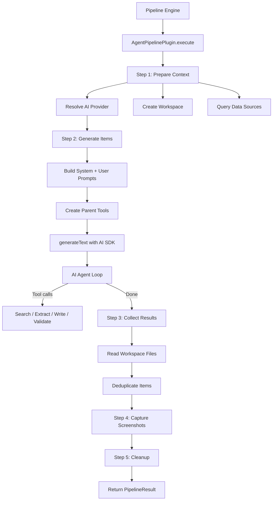

# Agent Pipeline Plugin

The Agent Pipeline plugin is an autonomous, tool-based generation pipeline that uses an AI agent to research and generate directory items. Unlike the Standard Pipeline's fixed 15-step sequence, the Agent Pipeline gives the AI model a set of tools and lets it decide how to research, extract, and create items.

**Source:** `packages/plugins/agent-pipeline/src/agent-pipeline.plugin.ts`

## Overview

| Property           | Value                                                                         |
| ------------------ | ----------------------------------------------------------------------------- |
| Plugin ID          | `agent-pipeline`                                                              |
| Category           | `pipeline`                                                                    |
| Capabilities       | `pipeline`, `form-schema-provider`                                            |
| Version            | `1.0.0`                                                                       |
| Configuration Mode | `hybrid`                                                                      |
| Auto-enable        | No                                                                            |
| Built-in           | Yes                                                                           |
| System Plugin      | No                                                                            |
| Key Dependencies   | `ai` (Vercel AI SDK), `@ai-sdk/openai-compatible`, `zod`, `fuse.js`, `tokenx` |

The plugin implements `IPlugin`, `IPipelinePlugin`, and `IFormSchemaProvider`.

## Architecture



### Two-Model Architecture

The Agent Pipeline uses a dual-model setup:

| Role             | Resolution                       | Purpose                                                    |
| ---------------- | -------------------------------- | ---------------------------------------------------------- |
| **Parent model** | `complexModel` or `defaultModel` | Orchestrates the generation, decides which tools to call   |
| **Worker model** | `defaultModel` or `complexModel` | Handles content extraction and item parsing from web pages |

Both models are resolved from the same AI provider but can be different model sizes (e.g., the parent can be a large reasoning model while the worker is a smaller, faster model).

## Pipeline Steps

The Agent Pipeline runs 5 sequential steps:

| Step | ID                    | Description                                                                             | Duration |
| ---- | --------------------- | --------------------------------------------------------------------------------------- | -------- |
| 1    | `prepare-context`     | Load existing items, resolve AI provider, query data sources, create workspace          | ~2s      |
| 2    | `generate-items`      | Run the AI agent with tool calling to research and create items                         | ~120s    |
| 3    | `collect-results`     | Read generated JSON files from the workspace, merge with data source items, deduplicate | ~2s      |
| 4    | `capture-screenshots` | Capture screenshots for items with source URLs (optional)                               | ~30s     |
| 5    | `cleanup`             | Remove the temporary workspace directory                                                | ~1s      |

## Agent Tools

The AI agent is given a set of tools it can call during generation:

### Parent Tools

Created by `createParentTools()` in `tools/parent-tools.ts`:

- **Search** -- search the web using the configured search provider
- **Process URLs** -- extract content from web pages using the content extractor facade
- **Find Items** -- search through existing items using fuzzy matching (Fuse.js)
- **Write Files** -- write generated item JSON files to the sandbox workspace
- **Validate JSON** -- validate item data against the expected schema
- **Workspace Overview** -- read the current state of the workspace

### Worker Tools

The worker model is used internally by the parent tools (particularly `processUrls`) to extract structured item data from raw web page content.

## Configuration

### Settings Schema

| Setting    | Type      | Default | Description                                                   |
| ---------- | --------- | ------- | ------------------------------------------------------------- |
| `maxSteps` | `integer` | `50`    | Maximum number of agent tool-calling steps (10--2000, hidden) |

### Selectable Provider Categories

The Agent Pipeline allows users to select providers for:

- `ai-provider` -- the AI model to use
- `search` -- the search engine for web research
- `screenshot` -- the screenshot service for image capture
- `content-extractor` -- the content extraction service
- `data-source` -- external data sources to query

## Features

### Context Compaction

The `createPrepareStep()` utility manages context window usage. As the agent accumulates tool call results, the context can grow beyond the model's limit. The prepare step compacts earlier context to stay within a configurable budget ratio (default: 80% of the model's context window).

### Tool Call Resilience

The `withToolCallingRetry()` wrapper adds retry logic around the main `generateText()` call. If a tool call fails due to a transient error, the agent can retry. The `createToolCallRepairFn()` function provides a repair callback for malformed tool call arguments.

### Circuit Breaker

Tools that repeatedly fail are tracked by a circuit breaker. After multiple failures, a tool is disabled for the remainder of the generation, and a warning is added to the result.

### Deduplication

Generated items are deduplicated by:

1. **URL normalization** -- URLs are parsed, normalized (lowercase host, stripped trailing slashes), and compared
2. **Name normalization** -- item names are lowercased and whitespace-collapsed for comparison
3. **Data source merging** -- items from data sources are compared against agent-generated items to avoid duplicates

### Token Usage Tracking

The `TokenUsageAccumulator` tracks token usage separately for the parent model and worker models. The final result includes a breakdown:

- `parent` -- tokens used by the orchestrator
- `workers` -- tokens used by all extraction workers combined
- `total` -- combined usage

### Data Source Integration

Before the agent runs, the pipeline queries configured data sources (via `dataSourceFacade.queryAll()`). New items from data sources are:

1. Compared against existing items to filter duplicates
2. Written to the workspace as a JSONL index file
3. Merged with agent-generated items after collection

## Getting Started

1. Enable the Agent Pipeline plugin on the Plugins page
2. Configure an AI provider with a model that supports tool calling
3. Optionally configure search, screenshot, and content extractor providers
4. Select "Agent Pipeline" as the pipeline provider when generating a directory

## API Reference

### Class: `AgentPipelinePlugin`

```typescript
class AgentPipelinePlugin implements IPlugin, IPipelinePlugin<AgentPipelineStepId>, IFormSchemaProvider {
	readonly id: 'agent-pipeline';
	readonly category: 'pipeline';

	execute(directory, request, existing, options?, onProgress?): Promise<PipelineResult>;
	cancel(): Promise<void>;
	getState(): PipelineState<AgentPipelineStepId> | null;
	getStepDefinitions(): readonly PipelineStepDefinition<AgentPipelineStepId>[];
	getFormFields(): FormFieldDefinition[];
	getFormGroups(): FormFieldGroup[];
	validateFormInput(values): ValidationResult;
	getDefaultValues(): Record<string, unknown>;
}
```

### Key Types

| Type                    | Purpose                                   |
| ----------------------- | ----------------------------------------- |
| `AgentPipelineStepId`   | Union of the 5 step IDs                   |
| `TokenUsageBreakdown`   | Parent, worker, and total token usage     |
| `TokenUsageAccumulator` | Mutable accumulator passed to all workers |

## Comparison with Standard Pipeline

| Aspect                   | Agent Pipeline                    | Standard Pipeline                       |
| ------------------------ | --------------------------------- | --------------------------------------- |
| Approach                 | Autonomous AI agent with tools    | Fixed 15-step sequence                  |
| Steps                    | 5 high-level steps                | 15 granular steps                       |
| Search strategy          | Agent decides queries dynamically | Predetermined search queries            |
| Checkpoint resume        | No                                | Yes                                     |
| Step-level customization | No                                | Steps can be injected/replaced/disabled |
| Model requirements       | Must support tool calling         | Any AI model                            |
| Engine orchestration     | Self-orchestrated                 | Engine-orchestrated                     |
