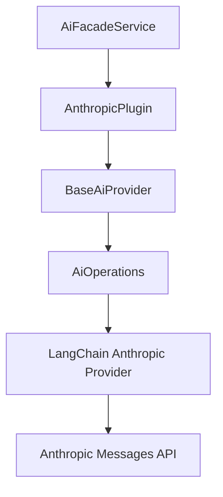
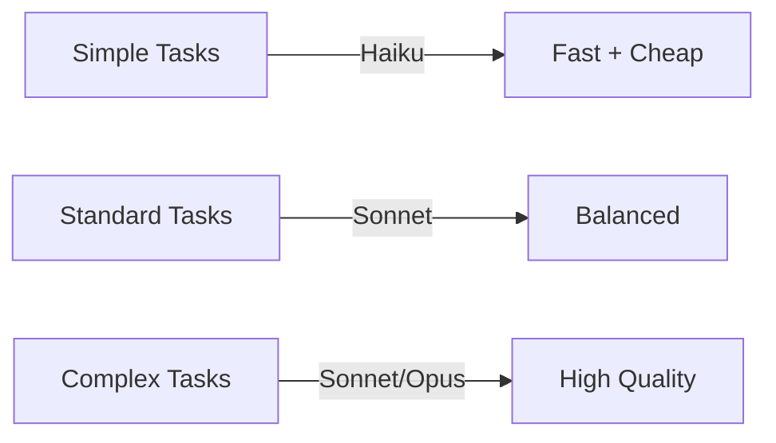
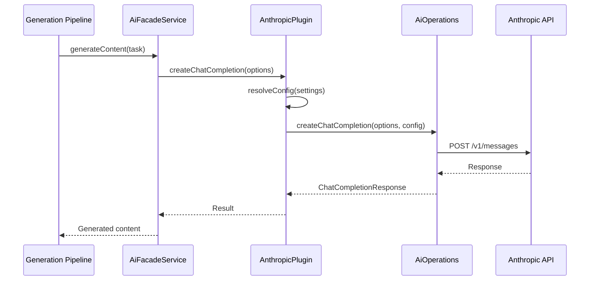

# Anthropic AI Provider Plugin

The Anthropic plugin connects Ever Works to Anthropic's Claude API. Claude is recognized for producing well-structured, nuanced content and adhering closely to instructions, making it particularly suited for work descriptions and detailed content generation.

**Source:** `packages/plugins/anthropic/src/anthropic.plugin.ts`

## Overview

| Property           | Value           |
| ------------------ | --------------- |
| Plugin ID          | `anthropic`     |
| Category           | `ai-provider`   |
| Capabilities       | `ai-provider`   |
| Version            | `1.0.0`         |
| Configuration Mode | `user-required` |
| Provider Type      | `anthropic`     |
| Auto-enable        | No              |
| Visibility         | `public`        |

Like the OpenAI plugin, the Anthropic plugin extends `BaseAiProvider` and uses `AiOperations` for all AI interactions. The `AiOperations` layer abstracts away the differences between providers using LangChain.

## Architecture



## Configuration

### Settings Schema

| Setting        | Type     | Required | Default                         | Scope    | Widget         | Description                                          |
| -------------- | -------- | -------- | ------------------------------- | -------- | -------------- | ---------------------------------------------------- |
| `apiKey`       | `string` | Yes      | --                              | `user`   | --             | Anthropic API key. Secret.                           |
| `defaultModel` | `string` | Yes      | `claude-sonnet-4-5-20250514`    | `global` | `model-select` | Default model for all AI tasks.                      |
| `simpleModel`  | `string` | No       | `claude-haiku-4-5-20251001`     | `global` | `model-select` | Model for tags, descriptions, classifications.       |
| `mediumModel`  | `string` | No       | `claude-sonnet-4-5-20250929`    | `global` | `model-select` | Model for listings, summaries, reformatting.         |
| `complexModel` | `string` | No       | `claude-sonnet-4-5-20250514`    | `global` | `model-select` | Model for full page generation, multi-step analysis. |
| `baseUrl`      | `string` | No       | `https://api.anthropic.com/v1/` | --       | --             | Custom API endpoint for proxies. Hidden.             |
| `temperature`  | `number` | No       | `0.7`                           | --       | --             | Sampling temperature (0--2). Hidden.                 |
| `maxTokens`    | `number` | No       | `4096`                          | --       | --             | Max tokens per response. Hidden.                     |

### Model Tiers

The Anthropic plugin maps Claude model families to task complexity tiers:

| Tier     | Default Model     | Use Case                                        |
| -------- | ----------------- | ----------------------------------------------- |
| Simple   | Claude 4.5 Haiku  | Tags, short descriptions, quick classifications |
| Standard | Claude 4.5 Sonnet | Listings, summaries, content reformatting       |
| Complex  | Claude 4.5 Sonnet | Full page generation, multi-step analysis       |



## Capabilities

```typescript
getCapabilities(): AiModelCapabilities {
  return {
    supportsStructuredOutput: true,
    supportsStreaming: true,
    supportsToolCalling: true,
    supportsVision: true,
    maxContextLength: 200000
  };
}
```

| Capability        | Supported | Description                                           |
| ----------------- | --------- | ----------------------------------------------------- |
| Structured Output | Yes       | JSON mode and tool use for typed responses            |
| Streaming         | Yes       | Server-sent events for real-time token delivery       |
| Tool Calling      | Yes       | Tool use for agent-based workflows                    |
| Vision            | Yes       | Image understanding with Claude's vision capabilities |
| Max Context       | 200,000   | Maximum tokens in a single context window             |

The 200K context window is the largest among the platform's AI providers, allowing Claude to process significantly more source material per request.

## Core Methods

### Chat Completion

```typescript
async createChatCompletion(options: ChatCompletionOptions): Promise<ChatCompletionResponse>
```

Routes through `AiOperations` with resolved configuration. The LangChain abstraction translates the standard `ChatCompletionOptions` format to Anthropic's Messages API format.

### Streaming Chat Completion

```typescript
async *createStreamingChatCompletion(options: ChatCompletionOptions): AsyncIterable<ChatCompletionChunk>
```

Yields `ChatCompletionChunk` objects as Claude generates tokens. Used by the conversational AI assistant.

### Embeddings

```typescript
async createEmbedding(_options: EmbeddingOptions): Promise<EmbeddingResponse> {
  throw new Error('Embeddings not supported by Anthropic');
}
```

Anthropic does not offer an embedding API. If embeddings are needed, use the OpenAI plugin or another provider that supports them alongside the Anthropic plugin for generation.

### Model Listing

```typescript
async listModels(settings?: PluginSettings): Promise<readonly AiModel[]>
```

Fetches the available Claude models from the API. Used to populate model selection in the CLI and web dashboard.

### Availability Check

```typescript
async isAvailable(settings?: PluginSettings): Promise<boolean>
```

Tests the connection by calling `aiOps.testConnection()` with the resolved configuration.

## Lifecycle

| Method            | Behavior                                                                |
| ----------------- | ----------------------------------------------------------------------- |
| `onLoad(context)` | Calls `super.onLoad()`, creates `AiOperations` with Anthropic defaults. |
| `onUnload()`      | Sets `aiOps` to `null`, calls `super.onUnload()`.                       |
| `healthCheck()`   | Returns `healthy`.                                                      |

### Initial Configuration

```typescript
this.aiOps = new AiOperations({
	apiKey: '',
	model: 'claude-sonnet-4-5-20250514',
	baseURL: 'https://api.anthropic.com/v1/',
	temperature: 0.7,
	maxTokens: 4096,
	providerType: 'anthropic'
});
```

The `providerType: 'anthropic'` tells `AiOperations` (and the underlying LangChain layer) to use the Anthropic message format and API conventions.

## Error Handling

| Scenario                | Behavior                                                |
| ----------------------- | ------------------------------------------------------- |
| Plugin not loaded       | Throws `Error('Anthropic plugin not loaded')`           |
| Embedding request       | Throws `Error('Embeddings not supported by Anthropic')` |
| API errors              | Propagated from `AiOperations` / LangChain              |
| Connection test failure | `isAvailable()` returns `false`                         |

## Differences from OpenAI Plugin

| Aspect         | Anthropic               | OpenAI               |
| -------------- | ----------------------- | -------------------- |
| Context window | 200K tokens             | 128K tokens          |
| Embeddings     | Not supported           | Supported            |
| Default model  | Claude Sonnet 4.5       | GPT-5.1              |
| Base URL       | `api.anthropic.com/v1/` | `api.openai.com/v1`  |
| Provider type  | `anthropic`             | `openai`             |
| API format     | Messages API            | Chat Completions API |

Both plugins share the same `BaseAiProvider` base class and `AiOperations` abstraction, making them interchangeable from the platform's perspective. The `AiFacadeService` can switch between them based on user configuration.

## Usage in the Platform

When Anthropic is selected as the AI provider:

1. **Content generation** -- Claude generates work item descriptions, summaries, and metadata. Its instruction-following precision is useful for maintaining consistent formatting.
2. **Conversational AI** -- Powers the chat assistant in the web dashboard.
3. **Structured extraction** -- Uses tool calling to extract structured data from web content.



## Choosing Between AI Providers

| Consider Anthropic when...              | Consider OpenAI when...                         |
| --------------------------------------- | ----------------------------------------------- |
| You need a large context window (200K)  | You need embedding support                      |
| You value precise instruction following | You want the latest GPT models                  |
| You prefer Claude's writing style       | You need multi-modal capabilities beyond vision |
| You want consistent formatting output   | You want a wider selection of model sizes       |
