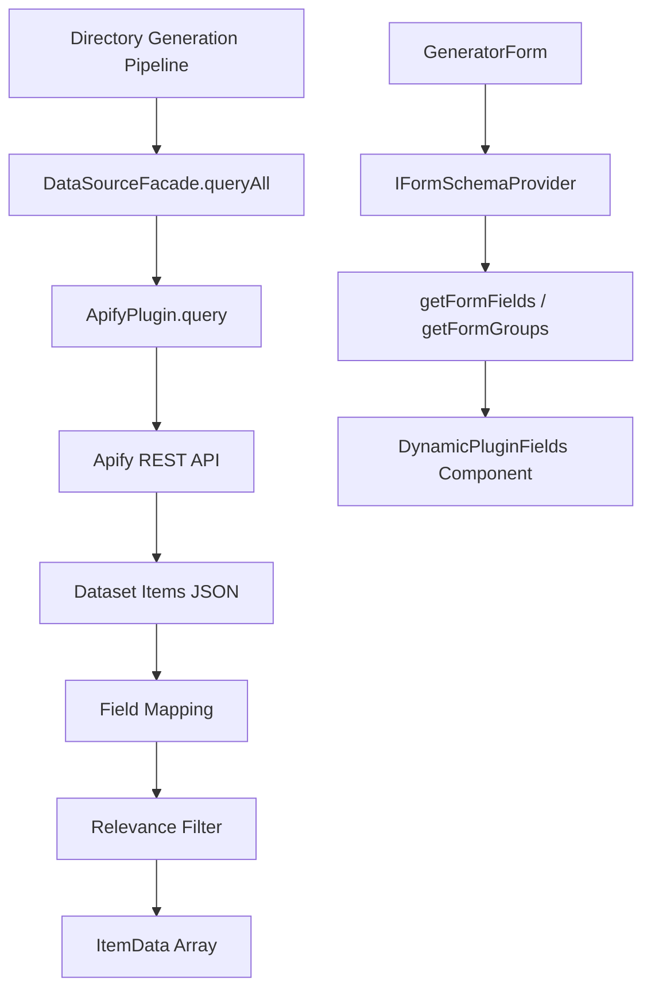
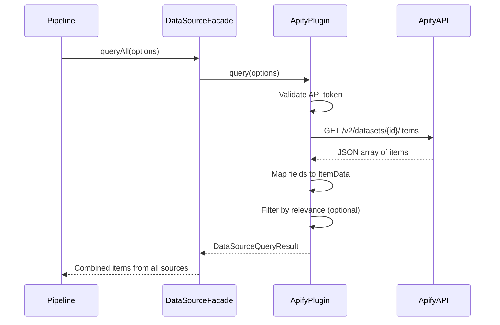
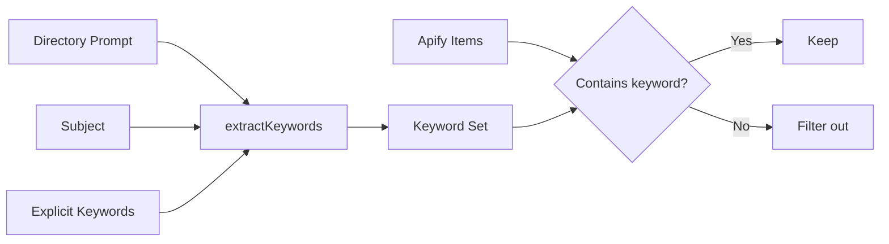

# Apify Data Source Plugin

The Apify plugin imports items from [Apify](https://apify.com) datasets and actor runs into Ever Works directories. It implements both the data source interface (to query items) and the form schema provider interface (to add configuration fields to the generation form).

**Source:** `packages/plugins/apify/src/apify.plugin.ts`

## Overview

| Property | Value |
|---|---|
| Plugin ID | `apify` |
| Category | `data-source` |
| Capabilities | `data-source`, `form-schema-provider` |
| Version | `1.0.0` |
| Built-in | No |
| System plugin | No |
| Auto-enable | No |

Unlike system plugins, the Apify plugin must be explicitly installed and enabled by users. It implements two interfaces: `IDataSourcePlugin` for querying items and `IFormSchemaProvider` for injecting fields into the directory generation form.

## Architecture



### Three-Level Configuration

The plugin uses a three-level configuration approach:

| Level | Where | What |
|---|---|---|
| Level 1 | Settings > Plugins | API token (admin or user scope) |
| Level 2 | Directory plugin settings | Enable/disable per directory |
| Level 3 | Generation form | Dataset ID, actor run ID, max items, relevance filter |

## Configuration

### Settings Schema (Level 1)

| Setting | Type | Required | Scope | Description |
|---|---|---|---|---|
| `apiToken` | `string` | Yes | `user` | Apify API token (marked as secret) |
| `defaultFieldMapping` | `object` | No | -- | Default mapping from Apify fields to item fields |

### Default Field Mapping

The field mapping controls how Apify dataset fields are transformed into Ever Works `ItemData` properties:

| ItemData Field | Default Apify Field | Description |
|---|---|---|
| `name` | `title` | Item display name |
| `description` | `description` | Item description text |
| `source_url` | `url` | Original source URL |
| `category` | `category` | Category classification |
| `image_url` | `image` | Image URL (mapped to `images[]` array) |

### Generation Form Fields (Level 3)

The plugin injects these fields into the generation form via `IFormSchemaProvider`:

| Field Name | Type | Default | Description |
|---|---|---|---|
| `apify_datasetId` | `text` | (empty) | Apify dataset ID to import from |
| `apify_actorRunId` | `text` | (empty) | Import from a specific actor run instead |
| `apify_maxItems` | `number` | `100` | Maximum items to import (0 = no limit) |
| `apify_filterByRelevance` | `boolean` | `true` | Only import items relevant to the directory prompt |

These fields are grouped under a collapsible "Apify" section:

```typescript
getFormGroups(): FormFieldGroup[] {
    return [{
        name: 'apify',
        title: 'Apify',
        description: 'Import items from Apify datasets',
        collapsible: true,
        collapsed: true,
        order: 100
    }];
}
```

The `order: 100` places the Apify section after the default pipeline fields in the form.

## Data Source Query Flow



### API URL Construction

The plugin constructs different API URLs depending on whether a dataset ID or actor run ID is provided:

| Source | API Endpoint |
|---|---|
| Dataset | `https://api.apify.com/v2/datasets/{datasetId}/items` |
| Actor run | `https://api.apify.com/v2/actor-runs/{actorRunId}/dataset/items` |

The API token and item limit are passed as query parameters.

### Field Mapping

The `mapToItemData()` method transforms each Apify item using the configured field mapping:

```typescript
private mapToItemData(item: Record<string, unknown>, mapping: FieldMapping): Partial<ItemData> {
    const name = getValue('name') || String(item.title || item.name || 'Untitled');
    return {
        name,
        slug: this.generateSlug(name),
        description: getValue('description') || '',
        source_url: getValue('source_url') || '',
        category: getValue('category'),
        images: imageUrl ? [imageUrl] : undefined
    };
}
```

Slugs are auto-generated from the item name: lowercased, non-alphanumeric characters replaced with hyphens, truncated to 100 characters.

## Relevance Filtering

When `filterByRelevance` is enabled and a `filterContext` is provided, the plugin filters items by keyword matching:

1. Keywords are extracted from the directory's `prompt`, `subject`, and explicit `keywords` using `extractKeywords()` from `@ever-works/plugin/keywords`.
2. Each item's `name` and `description` are checked against the keyword set.
3. Items containing at least one keyword are kept; others are removed.



## Form Validation

The `validateFormInput()` method ensures that either a dataset ID or actor run ID is provided when the plugin is enabled:

```typescript
validateFormInput(values: Record<string, unknown>): ValidationResult {
    if (!datasetId && !actorRunId) {
        return {
            valid: false,
            errors: [{
                path: 'apify_datasetId',
                message: 'Either Dataset ID or Actor Run ID is required'
            }]
        };
    }
    return { valid: true };
}
```

## Form Value Transformation

Before form values are passed to the pipeline, `transformFormValues()` nests the Apify-prefixed fields under an `apify` key:

```typescript
transformFormValues(values) {
    return {
        ...values,
        apify: {
            datasetId: values['apify_datasetId'],
            actorRunId: values['apify_actorRunId'],
            maxItems: values['apify_maxItems'] ?? 100,
            filterByRelevance: values['apify_filterByRelevance'] ?? true
        }
    };
}
```

## Getting Started

1. Create an Apify account at [apify.com](https://apify.com).
2. Run an actor or prepare a dataset with the items you want to import.
3. Enable the Apify plugin in **Settings > Plugins** and enter your API token.
4. When creating a directory, expand the **Apify** section in the generation form and provide your dataset ID.
5. Optionally enable relevance filtering to import only items related to your directory topic.

## Troubleshooting

| Issue | Cause | Solution |
|---|---|---|
| Empty import results | Invalid dataset ID or empty dataset | Verify the dataset ID in the Apify console |
| "Apify API token not configured" | No API token set | Enter your token in plugin settings |
| "Apify API error: 401" | Invalid API token | Regenerate the token in Apify Settings > Integrations |
| Irrelevant items imported | Relevance filter disabled or keywords too broad | Enable filtering and refine the directory prompt |
| Missing fields in imported items | Field mapping does not match dataset structure | Update the default field mapping in plugin settings |
