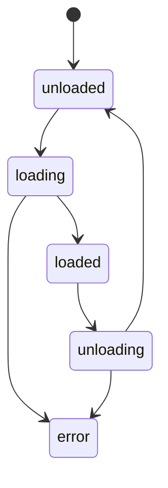

# Plugin Architecture

This page covers the technical internals of the plugin system: the SDK, interfaces, lifecycle, bootstrap process, and facade routing.

## Plugin SDK

The Plugin SDK lives at `packages/plugin/` and is published as `@ever-works/plugin`. It is a **standalone TypeScript package** with zero NestJS dependencies, so plugins can be developed and tested independently.

The SDK provides:

```
@ever-works/plugin
├── /contracts     # IPlugin, capability interfaces, manifest types
├── /abstract      # BasePlugin, BaseAiProvider, BaseGitProvider, BasePipelineStep
├── /settings      # JSON Schema types, validation, setting scopes
├── /events        # Event types for plugin-to-plugin communication
├── /pipeline      # Pipeline step types and utilities
├── /common        # Shared domain types (items, forms, etc.)
├── /helpers       # Utility functions
├── /testing       # Test utilities
└── /api           # API response helpers
```

## IPlugin Interface

Every plugin implements `IPlugin`:

```typescript
interface IPlugin {
    readonly id: string;
    readonly name: string;
    readonly version: string;
    readonly category: PluginCategory;
    readonly capabilities: readonly string[];
    readonly settingsSchema: JsonSchema;
    readonly configurationMode?: ConfigurationMode;

    onLoad(context: PluginContext): Promise<void>;
    onUnload(): Promise<void>;
    validateSettings(settings: PluginSettings): Promise<ValidationResult>;
    healthCheck?(): Promise<PluginHealthCheck>;
    getManifest?(): PluginManifest;
}
```

| Field | Description |
|-------|-------------|
| `id` | Unique identifier (e.g., `openai`, `brave`, `vercel`) |
| `category` | Primary category from the [category list](#plugin-categories) |
| `capabilities` | List of capabilities this plugin provides |
| `settingsSchema` | JSON Schema describing the plugin's configuration fields |
| `configurationMode` | Who can configure: `admin-only`, `user-required`, or `hybrid` |

## Plugin Categories

```typescript
const PLUGIN_CATEGORIES = [
    'ai-provider', 'git-provider', 'deployment', 'screenshot',
    'search', 'content-extractor', 'data-source', 'pipeline',
    'form', 'integration', 'utility', 'theme',
] as const;
```

## Capability Interfaces

Each capability has a typed interface that plugins implement alongside `IPlugin`:

### IAiProviderPlugin

For AI/LLM providers (OpenAI, Anthropic, Google, Groq, Ollama, OpenRouter):

```typescript
interface IAiProviderPlugin extends IPlugin {
    readonly providerType: string;
    readonly providerName: string;

    createChatCompletion(options: ChatCompletionOptions): Promise<ChatCompletionResponse>;
    createStreamingChatCompletion?(options: ChatCompletionOptions): AsyncIterable<ChatCompletionChunk>;
    createEmbedding?(options: EmbeddingOptions): Promise<EmbeddingResponse>;
    listModels(settings?: PluginSettings): Promise<readonly AiModel[]>;
    isAvailable(settings?: PluginSettings): Promise<boolean>;
    getCapabilities(): AiModelCapabilities;
}
```

### ISearchPlugin

For web search providers (Brave, Tavily, SerpAPI, Exa):

```typescript
interface ISearchPlugin extends IPlugin {
    readonly providerName: string;

    search(options: SearchOptions): Promise<SearchResponse>;
    isAvailable(): Promise<boolean>;
    getRateLimitInfo?(): Promise<RateLimitInfo>;
}
```

### IGitProviderPlugin

For git hosting providers (GitHub):

```typescript
interface IGitProviderPlugin extends IPlugin {
    readonly providerName: string;

    getAuth(token: string): GitAuth;
    getCloneUrl(owner: string, repo: string): string;
    cloneOrPull(options: GitCloneOptions): Promise<string>;
    commit(dir: string, message: string, committer?: GitCommitter): Promise<string>;
    push(options: GitPushOptions): Promise<void>;
    createRepository(options: CreateRepoOptions, token: string): Promise<GitRepository>;
    // ... full git operations
}
```

### IDeploymentPlugin

For deployment targets (Vercel):

```typescript
interface IDeploymentPlugin extends IPlugin {
    readonly providerName: string;

    deploy(config: DeploymentConfig, token: string): Promise<DeploymentResult>;
    getDeploymentStatus(deploymentId: string, token: string): Promise<DeploymentResult>;
    validateToken?(token: string): Promise<boolean>;
    getTeams?(token: string): Promise<Array<{ id: string; slug: string; name: string | null }>>;
}
```

### IContentExtractorPlugin

For URL content extraction (Local HTML, Notion, Tavily):

```typescript
interface IContentExtractorPlugin extends IPlugin {
    extract(options: ContentExtractionOptions): Promise<ContentExtractionResult>;
    extractBatch?(urls: readonly string[], options?: Partial<ContentExtractionOptions>): Promise<readonly ContentExtractionResult[]>;
    canExtract(url: string): Promise<boolean>;
    getSupportedFormats(): readonly ('text' | 'html' | 'markdown')[];
}
```

### IScreenshotPlugin

For website screenshots (ScreenshotOne, URLBox):

```typescript
interface IScreenshotPlugin extends IPlugin {
    takeScreenshot(options: ScreenshotOptions): Promise<ScreenshotResult>;
    isAvailable(): Promise<boolean>;
}
```

### IDataSourcePlugin

For external data sources (Apify):

```typescript
interface IDataSourcePlugin extends IPlugin {
    query(options?: DataSourceQueryOptions): Promise<DataSourceQueryResult>;
    isAvailable(): Promise<boolean>;
}
```

### IPipelineStepPlugin

For custom pipeline steps:

```typescript
interface IPipelineStepPlugin extends IPlugin {
    execute(
        context: MutableGenerationContext,
        options?: StepExecutionOptions,
        onProgress?: StepProgressCallback,
    ): Promise<MutableGenerationContext>;
    canSkip?(context: MutableGenerationContext): Promise<boolean>;
    validate?(context: MutableGenerationContext): Promise<{ valid: boolean; error?: string }>;
    rollback?(context: MutableGenerationContext, error: Error): Promise<void>;
}
```

## Base Classes

The SDK provides abstract base classes that handle common boilerplate:

| Base Class | For | Provides |
|------------|-----|----------|
| `BasePlugin` | Any plugin | Context management, logging helpers, default lifecycle |
| `BaseAiProvider` | AI plugins | LangChain integration via `AiOperations`, model listing, streaming fallback |
| `BaseGitProvider` | Git plugins | Git operation signatures, auth helpers |
| `BasePipelineStep` | Pipeline plugins | Step positioning (`after`, `before`, `replace`, `first`, `last`), progress reporting |

Example — extending `BasePlugin`:

```typescript
import { BasePlugin } from '@ever-works/plugin/abstract';

export class MyPlugin extends BasePlugin {
    readonly id = 'my-plugin';
    readonly name = 'My Plugin';
    readonly version = '1.0.0';
    readonly category = 'utility';

    async onLoad(context) {
        await super.onLoad(context);
        this.log('Plugin loaded');
    }
}
```

When you extend `BasePlugin`, you get `this.logger`, `this.cache`, `this.http`, `this.env`, and helper methods like `this.log()`, `this.logError()`, `this.logWarn()`, `this.logDebug()` for free.

## Plugin Context

When a plugin is loaded, it receives a `PluginContext` with isolated access to platform services:

```typescript
interface PluginContext {
    readonly pluginId: string;
    readonly logger: PluginLogger;      // Scoped logging
    readonly cache: PluginCache;        // Plugin-scoped key-value cache with TTL
    readonly http: PluginHttpClient;    // HTTP client (get, post, put, patch, delete)
    readonly env: PluginEnvironment;    // Platform info, flags, directories
    readonly envVars: EnvironmentVariables; // Environment variable access
    readonly services: PluginServices;  // Limited platform service interfaces

    getSettings(scope?, scopeId?): Promise<PluginSettings>;
    getResolvedSettings(scope?, scopeId?): Promise<ResolvedSettings>;
    onEvent(event, handler): EventSubscription;
    emitEvent(event, payload): void;
    registerCustomCapability(definition, implementation): void;
}
```

| Service | Description |
|---------|-------------|
| `logger` | `log()`, `error()`, `warn()`, `debug()` — prefixed with plugin ID |
| `cache` | `get()`, `set(key, value, ttl)`, `delete()`, `has()`, `clear()` — keys are namespaced per plugin |
| `http` | Full HTTP client for external API calls |
| `envVars` | `get(key)`, `getOrDefault(key, default)`, `has(key)`, `getRequired(key)` |
| `getSettings()` | Returns the resolved settings for the plugin at the requested scope |
| `onEvent()` / `emitEvent()` | Plugin-to-plugin event communication |

## Plugin Manifest

Every plugin returns a manifest that provides metadata for the UI and discovery:

```typescript
interface PluginManifest {
    id: string;
    name: string;
    version: string;
    description: string;
    category: PluginCategory;
    capabilities: readonly string[];
    icon?: PluginIcon;             // SVG, URL, base64, Lucide icon name, or emoji
    author?: { name: string };
    license?: string;
    builtIn?: boolean;             // Ships with the platform
    systemPlugin?: boolean;        // Core functionality, always enabled
    autoEnable?: boolean;          // Enabled by default for new users
    defaultForCapabilities?: readonly string[];  // Default provider for these capabilities
    readme?: string;               // Markdown documentation shown in plugin detail page
}
```

The manifest is defined in two places:
1. **`package.json`** — Under the `everworks.plugin` field (used during discovery)
2. **`getManifest()` method** — Returned at runtime (merged with package.json manifest)

## Lifecycle & State Machine

Plugins move through a controlled state machine:



Valid transitions:

| From | To |
|------|----|
| `unloaded` | `loading` |
| `loading` | `loaded`, `error` |
| `loaded` | `unloading` |
| `unloading` | `unloaded`, `error` |
| `error` | `loading`, `unloading` |

## Bootstrap Flow

On application startup, the API calls `PluginBootstrapService.bootstrap()`:

```
1. App starts → ApiModule.onApplicationBootstrap()
2. PluginBootstrapService.bootstrap()
3. PluginLoaderService.discoverAndLoadAll()
   a. Scan filesystem paths for plugin packages
   b. Read package.json → extract everworks.plugin manifest
   c. Validate manifests
   d. Topological sort (respect plugin dependencies)
   e. For each plugin (in order):
      - Dynamically import the module
      - Instantiate the plugin class
      - Validate the class structure
      - Register in PluginRegistryService
      - Persist to database (PluginEntity)
4. PluginLifecycleManagerService.callOnLoad()
   - Create PluginContext for each plugin
   - Call plugin.onLoad(context)
   - Update state to 'loaded'
5. Bootstrap complete
```

### Discovery Paths

The loader scans these directories for plugin packages:

```
./plugins
./node_modules/@ever-works
./packages/plugins
../plugins
../../packages/plugins
```

Each subdirectory is checked for a `package.json` with an `everworks.plugin` manifest.

### Dependency Resolution

Plugins can declare dependencies on other plugins in their manifest. The loader performs a **topological sort** before loading to ensure dependencies load first. Circular dependencies are detected and rejected.

## Plugin Registry

The `PluginRegistryService` maintains an in-memory index of all loaded plugins with fast lookups:

| Method | Description |
|--------|-------------|
| `get(pluginId)` | Get a plugin by ID |
| `getByCategory(category)` | All plugins in a category |
| `getByCapability(capability)` | All plugins providing a capability |
| `getDefaultForCapability(capability)` | Default plugin for a capability |
| `getReady()` | All plugins in `loaded` state |

## Facade Pattern

Each capability has a **facade service** that abstracts plugin selection from the rest of the application:

| Facade | Capability | Used By |
|--------|-----------|---------|
| `AiFacadeService` | `ai-provider` | Generation pipeline, chat, content enrichment |
| `GitFacadeService` | `git-provider` | Repository management |
| `SearchFacadeService` | `search` | Web research in generation pipeline |
| `DeployFacadeService` | `deployment` | Site deployment |
| `ScreenshotFacadeService` | `screenshot` | Image capture for items |

### How Facade Resolution Works

When a facade receives a request, it resolves which plugin to use:

1. **Explicit override** — If the caller specifies a provider, use that
2. **Directory active plugin** — Check if the directory has an active plugin for this capability
3. **Default for capability** — Use the plugin marked as `defaultForCapabilities` in its manifest
4. **First enabled** — Fall back to any enabled plugin for the capability

The facade then resolves settings for the selected plugin (following the [settings hierarchy](./settings)) and calls the plugin method with those settings.

## Database Entities

The plugin system uses three database tables:

| Entity | Scope | Key Fields |
|--------|-------|------------|
| `PluginEntity` | System/admin | `pluginId`, `state`, `manifest`, `settings`, `secretSettings` |
| `UserPluginEntity` | Per user | `userId`, `pluginId`, `enabled`, `autoEnableForDirectories`, `settings` |
| `DirectoryPluginEntity` | Per directory | `directoryId`, `pluginId`, `enabled`, `activeCapability`, `priority`, `settings` |

These tables store plugin state, per-scope settings, and enable/disable preferences. The in-memory registry is the source of truth for loaded plugins; the database persists configuration across restarts.

## Enable Resolution

When determining if a plugin is enabled for a given context:

```
System plugin? → always enabled
User disabled? → disabled everywhere
Directory context + directory record? → use directory enabled value
Directory context + user autoEnableForDirectories? → enabled
User record exists? → use user enabled value
Fallback → manifest autoEnable default (typically false)
```

## Event System

Plugins can communicate via events:

```typescript
// Subscribe to events
context.onEvent('plugin:settings-changed', (payload) => {
    // React to settings changes
});

// Emit events
context.emitEvent('plugin:custom-event', { data: 'value' });
```

Built-in events:

| Event | Trigger |
|-------|---------|
| `plugin:loaded` | Plugin successfully loaded |
| `plugin:unloaded` | Plugin unloaded |
| `plugin:error` | Plugin error occurred |
| `plugin:settings-changed` | Settings updated |
| `plugin:state-changed` | State transition |
| `plugin:registered` | Plugin registered in registry |
