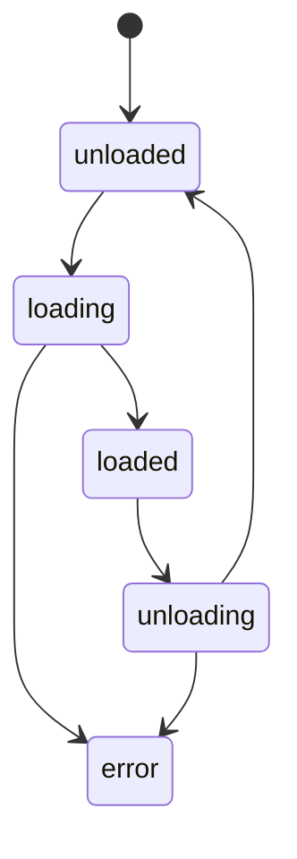

# Plugin Architecture

This page covers the technical internals of the plugin system: the SDK, interfaces, lifecycle, bootstrap process, and facade routing.

## Plugin SDK

The Plugin SDK lives at `packages/plugin/` and is published as `@ever-works/plugin`. It is a **standalone TypeScript package** with zero NestJS dependencies, so plugins can be developed and tested independently.

The SDK provides:

```
@ever-works/plugin
├── /contracts     # IPlugin, capability interfaces, manifest types
├── /abstract      # BasePlugin, BaseAiProvider, BaseGitProvider, BasePipelineStep
├── /settings      # JSON Schema types, validation, setting scopes
├── /events        # Event types for plugin-to-plugin communication
├── /pipeline      # Pipeline step types and utilities
├── /common        # Shared domain types (items, forms, etc.)
├── /helpers       # Utility functions
├── /testing       # Test utilities
└── /api           # API response helpers
```

## IPlugin Interface

Every plugin implements `IPlugin`:

```typescript
interface IPlugin {
	readonly id: string;
	readonly name: string;
	readonly version: string;
	readonly category: PluginCategory;
	readonly capabilities: readonly string[];
	readonly settingsSchema: JsonSchema;
	readonly configurationMode?: ConfigurationMode;

	onLoad(context: PluginContext): Promise<void>;
	onUnload(): Promise<void>;
	validateSettings(settings: PluginSettings): Promise<ValidationResult>;
	healthCheck?(): Promise<PluginHealthCheck>;
	getManifest?(): PluginManifest;
}
```

| Field               | Description                                                   |
| ------------------- | ------------------------------------------------------------- |
| `id`                | Unique identifier (e.g., `openai`, `brave`, `vercel`)         |
| `category`          | Primary category from the [category list](#plugin-categories) |
| `capabilities`      | List of capabilities this plugin provides                     |
| `settingsSchema`    | JSON Schema describing the plugin's configuration fields      |
| `configurationMode` | Who can configure: `admin-only`, `user-required`, or `hybrid` |

## Plugin Categories

```typescript
const PLUGIN_CATEGORIES = [
	'ai-provider',
	'git-provider',
	'deployment',
	'screenshot',
	'search',
	'content-extractor',
	'data-source',
	'pipeline',
	'form',
	'integration',
	'utility',
	'theme'
] as const;
```

## Capability Interfaces

Each capability has a typed interface that plugins implement alongside `IPlugin`:

### IAiProviderPlugin

For AI/LLM providers (OpenAI, Anthropic, Google, Groq, Ollama, OpenRouter):

```typescript
interface IAiProviderPlugin extends IPlugin {
	readonly providerType: string;
	readonly providerName: string;

	createChatCompletion(options: ChatCompletionOptions): Promise<ChatCompletionResponse>;
	createStreamingChatCompletion?(options: ChatCompletionOptions): AsyncIterable<ChatCompletionChunk>;
	createEmbedding?(options: EmbeddingOptions): Promise<EmbeddingResponse>;
	listModels(settings?: PluginSettings): Promise<readonly AiModel[]>;
	isAvailable(settings?: PluginSettings): Promise<boolean>;
	getCapabilities(): AiModelCapabilities;
}
```

### ISearchPlugin

For web search providers (Brave, Tavily, SerpAPI, Exa):

```typescript
interface ISearchPlugin extends IPlugin {
	readonly providerName: string;

	search(options: SearchOptions): Promise<SearchResponse>;
	isAvailable(): Promise<boolean>;
	getRateLimitInfo?(): Promise<RateLimitInfo>;
}
```

### IGitProviderPlugin

For git hosting providers (GitHub):

```typescript
interface IGitProviderPlugin extends IPlugin {
	readonly providerName: string;

	getAuth(token: string): GitAuth;
	getCloneUrl(owner: string, repo: string): string;
	cloneOrPull(options: GitCloneOptions): Promise<string>;
	commit(dir: string, message: string, committer?: GitCommitter): Promise<string>;
	push(options: GitPushOptions): Promise<void>;
	createRepository(options: CreateRepoOptions, token: string): Promise<GitRepository>;
	// ... full git operations
}
```

### IDeploymentPlugin

For deployment targets (Vercel):

```typescript
interface IDeploymentPlugin extends IPlugin {
	readonly providerName: string;

	deploy(config: DeploymentConfig, token: string): Promise<DeploymentResult>;
	getDeploymentStatus(deploymentId: string, token: string): Promise<DeploymentResult>;
	validateToken?(token: string): Promise<boolean>;
	getTeams?(token: string): Promise<Array<{ id: string; slug: string; name: string | null }>>;
}
```

### IContentExtractorPlugin

For URL content extraction (Local HTML, Notion, Tavily):

```typescript
interface IContentExtractorPlugin extends IPlugin {
	extract(options: ContentExtractionOptions): Promise<ContentExtractionResult>;
	extractBatch?(
		urls: readonly string[],
		options?: Partial<ContentExtractionOptions>
	): Promise<readonly ContentExtractionResult[]>;
	canExtract(url: string): Promise<boolean>;
	getSupportedFormats(): readonly ('text' | 'html' | 'markdown')[];
}
```

### IScreenshotPlugin

For website screenshots (ScreenshotOne, URLBox):

```typescript
interface IScreenshotPlugin extends IPlugin {
	takeScreenshot(options: ScreenshotOptions): Promise<ScreenshotResult>;
	isAvailable(): Promise<boolean>;
}
```

### IDataSourcePlugin

For external data sources (Apify):

```typescript
interface IDataSourcePlugin extends IPlugin {
	query(options?: DataSourceQueryOptions): Promise<DataSourceQueryResult>;
	isAvailable(): Promise<boolean>;
}
```

### IPipelineStepPlugin

For custom pipeline steps:

```typescript
interface IPipelineStepPlugin extends IPlugin {
	execute(
		context: MutableGenerationContext,
		options?: StepExecutionOptions,
		onProgress?: StepProgressCallback
	): Promise<MutableGenerationContext>;
	canSkip?(context: MutableGenerationContext): Promise<boolean>;
	validate?(context: MutableGenerationContext): Promise<{ valid: boolean; error?: string }>;
	rollback?(context: MutableGenerationContext, error: Error): Promise<void>;
}
```

## Base Classes

The SDK provides abstract base classes that handle common boilerplate:

| Base Class         | For              | Provides                                                                             |
| ------------------ | ---------------- | ------------------------------------------------------------------------------------ |
| `BasePlugin`       | Any plugin       | Context management, logging helpers, default lifecycle                               |
| `BaseAiProvider`   | AI plugins       | LangChain integration via `AiOperations`, model listing, streaming fallback          |
| `BaseGitProvider`  | Git plugins      | Git operation signatures, auth helpers                                               |
| `BasePipelineStep` | Pipeline plugins | Step positioning (`after`, `before`, `replace`, `first`, `last`), progress reporting |

Example — extending `BasePlugin`:

```typescript
import { BasePlugin } from '@ever-works/plugin/abstract';

export class MyPlugin extends BasePlugin {
	readonly id = 'my-plugin';
	readonly name = 'My Plugin';
	readonly version = '1.0.0';
	readonly category = 'utility';

	async onLoad(context) {
		await super.onLoad(context);
		this.log('Plugin loaded');
	}
}
```

When you extend `BasePlugin`, you get `this.logger`, `this.cache`, `this.http`, `this.env`, and helper methods like `this.log()`, `this.logError()`, `this.logWarn()`, `this.logDebug()` for free.

## Plugin Context

When a plugin is loaded, it receives a `PluginContext` with isolated access to platform services:

```typescript
interface PluginContext {
	readonly pluginId: string;
	readonly logger: PluginLogger; // Scoped logging
	readonly cache: PluginCache; // Plugin-scoped key-value cache with TTL
	readonly http: PluginHttpClient; // HTTP client (get, post, put, patch, delete)
	readonly env: PluginEnvironment; // Platform info, flags, works
	readonly envVars: EnvironmentVariables; // Environment variable access
	readonly services: PluginServices; // Limited platform service interfaces

	getSettings(scope?, scopeId?): Promise<PluginSettings>;
	getResolvedSettings(scope?, scopeId?): Promise<ResolvedSettings>;
	onEvent(event, handler): EventSubscription;
	emitEvent(event, payload): void;
	registerCustomCapability(definition, implementation): void;
}
```

| Service                     | Description                                                                                      |
| --------------------------- | ------------------------------------------------------------------------------------------------ |
| `logger`                    | `log()`, `error()`, `warn()`, `debug()` — prefixed with plugin ID                                |
| `cache`                     | `get()`, `set(key, value, ttl)`, `delete()`, `has()`, `clear()` — keys are namespaced per plugin |
| `http`                      | Full HTTP client for external API calls                                                          |
| `envVars`                   | `get(key)`, `getOrDefault(key, default)`, `has(key)`, `getRequired(key)`                         |
| `getSettings()`             | Returns the resolved settings for the plugin at the requested scope                              |
| `onEvent()` / `emitEvent()` | Plugin-to-plugin event communication                                                             |

## Plugin Manifest

Every plugin returns a manifest that provides metadata for the UI and discovery:

```typescript
interface PluginManifest {
	id: string;
	name: string;
	version: string;
	description: string;
	category: PluginCategory;
	capabilities: readonly string[];
	icon?: PluginIcon; // SVG, URL, base64, Lucide icon name, or emoji
	author?: { name: string };
	license?: string;
	builtIn?: boolean; // Ships with the platform; like any disk plugin it loads on first use (PLUGIN_EAGER_BUILTINS=true loads it during bootstrap)
	systemPlugin?: boolean; // Core functionality, always enabled
	autoEnable?: boolean; // Enabled by default for new users
	defaultForCapabilities?: readonly string[]; // Default provider for these capabilities
	readme?: string; // Markdown documentation shown in plugin detail page
}
```

The manifest is defined in two places:

1. **`package.json`** — Under the `everworks.plugin` field (used during discovery)
2. **`getManifest()` method** — Returned at runtime (merged with package.json manifest)

Where both set a field, package.json wins. A plugin nobody has used yet is held as a lazy proxy whose registry entry knows only the package.json manifest (see [Lazy loading and the first load](#lazy-loading-and-the-first-load)). Fields that decide whether a plugin is enabled or routed (`systemPlugin`, `autoEnable`, `category`, `capabilities`, `operations`, `executionProfile`) must therefore be declared in package.json, because they are read before any plugin loads. For every plugin discovered on disk, and for a programmatic `builtInPlugins` module that carries a `manifest`, `operations` and `executionProfile` are never taken from `getManifest()` at all, in any boot mode, so a cold replica and a warm one route a call alike, and what `getManifest()` adds never changes the registry's category or capability indexes either: it only enriches the entry once the plugin has loaded. The one exception is a programmatic `builtInPlugins` module with no `manifest`: its whole manifest, routing declarations included, comes from `getManifest()` (`PluginLoaderService.loadBuiltIn`). No app passes `builtInPlugins` today.

## Lifecycle & State Machine

Plugins move through a controlled state machine:


```mermaid
stateDiagram-v2
    [*] --> unloaded
    unloaded --> loading
    loading --> loaded
    loading --> error
    loaded --> unloading
    unloading --> unloaded
    unloading --> error
```

Valid transitions:

| From        | To                     |
| ----------- | ---------------------- |
| `unloaded`  | `loading`              |
| `loading`   | `loaded`, `error`      |
| `loaded`    | `unloading`            |
| `unloading` | `unloaded`, `error`    |
| `error`     | `loading`, `unloading` |

## Bootstrap Flow

On application startup, the API calls `PluginBootstrapService.bootstrap()`:

```
1. App starts → ApiModule.onApplicationBootstrap()
2. PluginBootstrapService.bootstrap()
3. PluginLoaderService.discoverAndLoadAll()
   a. Scan filesystem paths for plugin packages
   b. Read package.json → extract everworks.plugin manifest
   c. Validate manifests
   d. Topological sort (respect plugin dependencies)
   e. For each plugin (in order):
      - Register a lazy proxy in PluginRegistryService from the manifest
        alone (the module is NOT imported yet)
      - Persist to database (PluginEntity)
4. Run onLoad once for each programmatic builtInPlugins instance (a real instance)
5. Bootstrap complete
   - Every plugin discovered on disk, including one marked builtIn: true, is
     materialised on first use: the first-materialise hook calls
     PluginLifecycleManagerService.callOnLoad(), which creates the PluginContext
     and calls plugin.onLoad(context) ONCE
   - A plugin whose import or onLoad fails is set to 'error' (in the registry
     and the database) at that first use
```

With `PLUGIN_LAZY_LOAD=false` (the eager kill switch), step 3e instead imports every
discovered plugin, validates its class and registers the real instance, and step 4 calls
`callOnLoad()` once for every loaded plugin. Plugins passed programmatically as
`builtInPlugins` are always registered as real instances and get `callOnLoad()` once
during bootstrap.

With `PLUGIN_EAGER_BUILTINS=true`, step 4 also materialises every disk plugin marked `builtIn: true` at boot, which is how bootstrap behaved before lazy builtIns; a plugin whose import or `onLoad` fails is set to `error` and the boot continues. Leaving it unset keeps those imports out of every process that does not use every plugin, notably each Trigger.dev run, which always starts a fresh process. See [Boot Modes and Environment Variables](#boot-modes-and-environment-variables) for the measured difference.

Bootstrap never calls `callOnLoad()` on a lazy proxy: the proxy forwards `onLoad` by
materialising first, the materialisation hook runs `onLoad`, and the forwarded call would
then run it a second time. With `PLUGIN_EAGER_BUILTINS=true` it materialises the proxy instead (`materializePlugin`), and the hook runs `onLoad` once.

### Boot Modes and Environment Variables

| Variable                  | Default         | Effect                                                                                                                                                                                                                                                                                           |
| ------------------------- | --------------- | ------------------------------------------------------------------------------------------------------------------------------------------------------------------------------------------------------------------------------------------------------------------------------------------------ |
| `PLUGIN_LAZY_LOAD`        | unset (lazy)    | Exactly `false` (case-sensitive) is the eager kill switch: every plugin discovered on disk is imported, registered as a real instance and runs `onLoad` at boot. A plugin registered later at runtime is not covered (see [Known Gaps](#known-gaps)). Any other value, or none, keeps lazy mode. |
| `PLUGIN_EAGER_BUILTINS`   | unset (`false`) | Lazy mode only (it has no effect while `PLUGIN_LAZY_LOAD` is `false`). Exactly `true` (case-sensitive) materialises every disk plugin marked `builtIn: true` at boot. Anything else leaves them to their first use, like every other disk plugin.                                                |
| `PLUGIN_LOAD_CONCURRENCY` | `6`             | How many plugins one loading fan-out imports at a time (see [Bounded Loading](#bounded-loading)). A positive integer overrides the default; anything else, `0` included, keeps it. Read on each fan-out.                                                                                         |

`PluginBootstrapService` reads the first two, so they apply in every process that bootstraps plugins: the API, and the Trigger.dev worker, whose plugin hydrator (`trigger-plugin-hydrator.service.ts`) calls `bootstrap({ force: true })`. The registry's loading helpers read `PLUGIN_LOAD_CONCURRENCY` in the same processes.

Measured with `bootstrap({ force: true })` over the real `packages/plugins` directory (commit `60916d328`): with every disk builtIn materialised at boot, bootstrap took 4.8–5.0 s and 323–357 MB RSS; lazy, 56–69 ms and 108–114 MB RSS. The first generation run's provider selection afterwards loaded 5 plugins in 1.2–1.9 s and picked the same providers in both modes. Consider `PLUGIN_EAGER_BUILTINS=true` for the API deployment if first-request latency on the plugin list or the onboarding catalog matters more than boot time and memory.

### Discovery Paths

The loader scans these works for plugin packages:

```
./plugins
./node_modules/@ever-works
./packages/plugins
../plugins
../../packages/plugins
```

Each subwork is checked for a `package.json` with an `everworks.plugin` manifest.

### Dependency Resolution

Plugins can declare dependencies on other plugins in their manifest. The loader performs a **topological sort** before loading to ensure dependencies load first. Circular dependencies are detected and rejected.

## Lazy Loading and the First Load

In lazy mode the registry holds every plugin discovered on disk as a lazy proxy (`createLazyPluginProxy` in `packages/agent/src/plugins/services/lazy-plugin-proxy.ts`) until something uses it. The entry's `state` reads `loaded` from registration on, so `loaded` does not mean the module has been imported; `isColdLazyPlugin(plugin)` tells a cold proxy apart. Programmatic `builtInPlugins`, and every plugin discovered on disk in eager mode, are real instances and never cold. A plugin registered at runtime in dynamic mode (`PluginLoaderService.registerFromPath`) is a lazy proxy in both modes (see [Known Gaps](#known-gaps)).

### What Exists Only After Load

Until a plugin materialises, its `settingsSchema` reads `{}`, its `configurationMode` reads `undefined`, and the fields only its `getManifest()` declares (typically the icon, `readme`, `uiHints`, `visibility`, `defaultForCapabilities`, `supplementary`, `selectableProviderCategories`) are absent from its registry entry. Whether its import or `onLoad` fails is unknown too. Code that decides anything from those must load the plugin first (see [Which Helper to Use](#which-helper-to-use)). That is also why the fields that decide enablement and routing must be in package.json (see [Plugin Manifest](#plugin-manifest)).

The synchronous `getDefaultForCapability(capability)` reads entries as registered, so it misses a `defaultForCapabilities` only the class declares; prefer `getDefaultForCapabilityScoped`. The synchronous deploy and git `getAvailableProviders()` lists read the registry entry too, so their icon and homepage are the package.json values until the plugin loads in that process (cosmetic).

### The First-Load Contract

The first use imports the module, folds `getManifest()` into the registry entry (synchronously, in the same step that marks the proxy materialised), then runs the first-materialise hook: `PluginLifecycleManagerService.callOnLoad()` (the plugin's `onLoad`), and only after it the manifest DB upsert, which leaves the row's `state` alone when `onLoad` put the entry in `error`. The first load has **settled** once that hook has finished, successfully or not. `__isMaterialized` turns `true` at the import, before `onLoad` has run. Until the load settles:

- **A caller outside the load** (another request, another plugin) waits for it: `__materialize()`, with or without `{ waitForLoad: true }`, and every method it calls through the proxy resolve only once the load has settled, so it never calls the plugin before `onLoad` has run.
- **Code inside the load** (the hook, the plugin's own `onLoad`, anything they await, such as `context.getSettings` or a call to the plugin through the proxy) is answered at once, because it could never wait on itself. A `waitForLoad` made from there **rejects** instead of hanging: `materializePlugin` rejects, and `loadRegisteredPlugins` leaves that entry out. Never use either for a plugin from inside that plugin's own `onLoad`; use the plugin as it is there.
- **Work an `onLoad` starts without awaiting it** (a background task, a timer) counts as inside that load until the load settles. It is answered the plugin at once, possibly before `onLoad` has finished, and a `waitForLoad` it makes on this plugin, or on a plugin whose first load it started, is refused as above. Such work should not `waitForLoad` other plugins before that `onLoad` has settled; a plain use of them works.
- **A caller inside another plugin's first load** waits like any other caller, unless the wait would close a cycle: this plugin's first load already waits, directly or through other first loads, on the caller's. A first load started from inside this plugin's own `onLoad` counts as one it waits on. Then a plain call is answered at once and a `waitForLoad` rejects with an error naming both plugins, rather than both loads hanging.
- **When the first load failed** (`onLoad` threw, and `callOnLoad` put the entry in `error`), a method call that waited through the proxy for that load is refused with the reason instead of running on the half-initialised instance. `__materialize` still resolves, so re-check the entry with `pluginLoadFailure(entry, pluginId)`. Once settled, the proxy answers the real members as for any loaded plugin, so a caller that holds the proxy checks the entry's state rather than relying on that refusal.

### Which Helper to Use

| Helper                                                                               | Waits for the first load to settle                                                                                                                                | Use it for                                                                                                                                                                                                                                                                                                                                   |
| ------------------------------------------------------------------------------------ | ----------------------------------------------------------------------------------------------------------------------------------------------------------------- | -------------------------------------------------------------------------------------------------------------------------------------------------------------------------------------------------------------------------------------------------------------------------------------------------------------------------------------------- |
| `loadRegisteredPlugins(entries)` (`plugin-registry.service.ts`)                      | Yes (`__materialize({ waitForLoad: true })`)                                                                                                                      | Picking or using among several entries. Answers, in their order, only the entries still `loaded` afterwards, and never loads an entry that is already in `error` (or otherwise not `loaded`).                                                                                                                                                |
| `materializePlugin(plugin)` (`plugin-operation.util.ts`)                             | Yes (`waitForLoad`)                                                                                                                                               | The real instance of one plugin, for use. Rejects when the import fails, or when called from inside the plugin's own first load. Follow it with `pluginLoadFailure`, because a failing `onLoad` does not reject it.                                                                                                                          |
| `materializeUsablePlugin(entry, pluginId, onUnusable?)` (`plugin-operation.util.ts`) | Yes, outside the plugin's own first load (a plain `__materialize()`)                                                                                              | The real instance, or `null` when the entry is in `error` before or after the load, or the import fails. `onUnusable` hears why, for a log line.                                                                                                                                                                                             |
| `loadPluginSchema(plugin, entry?)` (`plugin-registry.service.ts`)                    | Yes when it arrives before the module is imported, whoever started the load (a plain `__materialize()` joins it); no once it is imported, when it answers at once | Reading `settingsSchema` / `configurationMode` only, never picking a plugin: a caller arriving after the import, while that first load's `onLoad` is still running, is answered before `onLoad` has settled. That is what lets a plugin's own `onLoad` read its settings. Answers `false`, without importing again, for an entry in `error`. |
| `loadPluginsForListing(entries, { inUse })` (`plugin-registry.service.ts`)           | As `loadPluginSchema`                                                                                                                                             | Lists and catalogs (see [Lists and Catalogs](#lists-and-catalogs)).                                                                                                                                                                                                                                                                          |

The registry's scoped lookups (`getEnabledPluginsScoped`, `getDefaultForCapabilityScoped`) load their candidates with `loadRegisteredPlugins`, and `BaseFacadeService` provider resolution hands out the instance from `materializePlugin`, so both already wait.

### Reading Members Through the Proxy

The stub answers its own names in every state: the manifest getters (`id`, `name`, `version`, `category`, `capabilities`, `settingsSchema`, `configurationMode`), `__isMaterialized`, `__materialize` and the `Object.prototype` members. Any other member:

- **Once the first load has settled** (and from inside it): is read from the real instance. A data member is its value, a method is the real method bound to the real instance (a sync method stays sync), and a member the plugin lacks is `undefined`, so `typeof`, `in` and `?.()` probes are truthful.
- **While the first load is settling**, for a caller outside it: a data member reads its real value, but a method reads as an async wrapper that waits for the load, then calls the real method.
- **Before load**: the read returns an async forwarding function. Calling it loads the plugin and forwards the call (rejecting with `has no method` when the member is not a function, except that an optional lifecycle method the plugin lacks answers `undefined`). So data members are not readable yet, a sync method's result arrives as a Promise, and `in` answers `true`. Load first (`__materialize`, `materializePlugin`, `loadRegisteredPlugins`), and call a method whose result must be synchronous (a streaming generator, for instance) on the materialised instance, not on the proxy.
- `then`, `catch`, `finally` and symbol keys answer `undefined` in every state, and `toJSON` answers `undefined` before load. Awaiting a proxy therefore never materialises it, and `JSON.stringify` of a cold proxy writes the stub's manifest fields.

A reader that cannot await a load (a synchronous listing, an error message, an event payload) reads a string member such as `providerName` or `sourceName` with `readPluginString(plugin, key) ?? manifest name` (`lazy-plugin-proxy.ts`). It answers the value on a real or loaded plugin and `undefined` for a cold proxy's forwarding function, which would otherwise be handed on as the name, and it imports nothing.

### Lists and Catalogs

`loadPluginsForListing(entries, { inUse })` loads the `builtIn` entries among `entries` plus every entry in `inUse`, whatever its `builtIn` flag. `inUse` is what the list's viewer uses:

- the plugins enabled for the user (`resolvePluginEnabled` with no Work, so system and `autoEnable` plugins count), for the plugin list, the settings menu and the settings page;
- the plugins with an enabled row on the Work (a `WorkPluginEntity` with `enabled: true`), for a Work's plugin list (its capability providers are picked from those rows). A plugin the Work counts as enabled without such a row is not in it (see [Known Gaps](#known-gaps)).

The onboarding catalog passes no `inUse`, so it loads builtIns only. Any other cold plugin that is not `builtIn` stays cold (`staysColdForListing`): the list shows its package.json manifest and the cold `{}` schema and resolves no settings for it, as it did when disk builtIns loaded at boot. A caller that uses a plugin (its detail page, its settings, a selection) loads it whatever its `builtIn` flag says. With `PLUGIN_EAGER_BUILTINS=true` the builtIns are loaded at boot already, so a list loads only the non-builtIns in use.

### Bounded Loading

Every fan-out that loads plugins (`loadRegisteredPlugins`, `loadPluginSchemas`, `loadPluginsForListing`) goes through `mapWithPluginLoadLimit`, which runs at most `pluginLoadConcurrency()` loads at a time and answers the results in input order. That is `DEFAULT_PLUGIN_LOAD_CONCURRENCY` (6) unless `PLUGIN_LOAD_CONCURRENCY` is a positive integer. A first load is a dynamic import, its synchronous module evaluation, `onLoad` and the manifest DB upsert (find, update, find); before the bound, a plugins page or onboarding catalog over about 100 cold plugins started all of them at once, queueing about 300 queries on the database pool and about 5 s of module evaluation in front of every other request of the process. The bound is per fan-out, not process-wide: a process-wide pool would deadlock a load whose `onLoad` loads another plugin while every slot is held.

### Known Gaps

- A plugin whose import fails is set to `error` at first use, and the registry's loading helpers do not import an entry in `error` again in that process. A later retry could not bring it back anyway, because `callOnLoad` refuses a plugin in `error`. Restart the process to retry.
- In dynamic mode, a plugin registered at runtime is always registered as a lazy proxy: `PluginLoaderService.registerFromPath` defaults to `lazy: true`, and none of its callers (install-on-use in `FacadePluginAvailabilityService`, an install or enable through the API via `PluginOperationsService.registerInstalledPlugin`, the worker's `run-plugin-operation` task) passes `lazy`. `PluginBootstrapService` wires the first-materialise and failure hooks only in lazy mode, so under `PLUGIN_LAZY_LOAD=false` such a plugin's `onLoad` never runs when it loads, and a failed import is not recorded as `error` on its entry. The loader logs a warning when it registers one that way.
- A Work's plugin list (`PluginOperationsService.listWorkPlugins`) passes as `inUse` only the plugins with an enabled `WorkPluginEntity` row. A plugin the Work counts as enabled through `systemPlugin`, the user's `autoEnableForWorks` or the manifest's `autoEnable` (`resolvePluginEnabled`) has no such row, so unless it is `builtIn` it stays cold in that list: shown as enabled for the Work, but without its settings. `everworks-playbooks` and `everworks-skills` (`autoEnable`, not `builtIn`) are two such plugins today.
- Every process boot re-registers each disk plugin lazily, and `PluginLoaderService.registerLazy` writes its `plugins` row (`persistLazyRegistration`). A row written for the same version keeps its manifest keys, with package.json's defined values on top; a row written for another version gets package.json's manifest as it is, so a key an older version's class declared does not outlive the upgrade. The richer manifest is written back only when the plugin first loads in some process, after its `onLoad`. The DB row therefore keeps enriched keys only within one plugin version, and until some process has loaded the plugin at that version it carries the package.json manifest alone. Readers of the row must not rely on `getManifest()`-only fields: the `.works/works.yml` provider projection (`WorksConfigProjectionService`) loads the registry entry to check `supplementary`. The plugin catalog's `homepage` (apps/api `plugin-catalog.service.ts`) still reads the row (cosmetic).

## Plugin Registry

The `PluginRegistryService` maintains an in-memory index of all loaded plugins with fast lookups:

| Method                                                        | Description                                                                                                      |
| ------------------------------------------------------------- | ---------------------------------------------------------------------------------------------------------------- |
| `get(pluginId)`                                               | Get a plugin by ID                                                                                               |
| `getByCategory(category)`                                     | All plugins in a category                                                                                        |
| `getByCapability(capability)`                                 | All plugins providing a capability                                                                               |
| `getDefaultForCapability(capability)`                         | Default plugin for a capability, read from entries as registered (a cold plugin's class-only fields are missing) |
| `getReady()`                                                  | All plugins in `loaded` state (a cold lazy proxy included)                                                       |
| `getEnabledPluginsScoped(capability?, workId?, userId?)`      | The `loaded` plugins enabled for the scope, each loaded first (`loadRegisteredPlugins`)                          |
| `getDefaultForCapabilityScoped(capability, workId?, userId?)` | The default for a capability with scope resolution (Work, then user, then manifest), its candidates loaded first |

## Facade Pattern

Each capability has a **facade service** that abstracts plugin selection from the rest of the application:

| Facade                    | Capability     | Used By                                       |
| ------------------------- | -------------- | --------------------------------------------- |
| `AiFacadeService`         | `ai-provider`  | Generation pipeline, chat, content enrichment |
| `GitFacadeService`        | `git-provider` | Repository management                         |
| `SearchFacadeService`     | `search`       | Web research in generation pipeline           |
| `DeployFacadeService`     | `deployment`   | Site deployment                               |
| `ScreenshotFacadeService` | `screenshot`   | Image capture for items                       |

### How Facade Resolution Works

When a facade receives a request, it resolves which plugin to use:

1. **Explicit override** — If the caller specifies a provider, use that
2. **Work active plugin** — Check if the work has an active plugin for this capability
3. **Default for capability** — Use the plugin marked as `defaultForCapabilities` in its manifest
4. **First enabled** — Fall back to any enabled plugin for the capability

The facade then resolves settings for the selected plugin (following the [settings hierarchy](./settings)) and calls the plugin method with those settings.

## Database Entities

The plugin system uses three database tables:

| Entity             | Scope        | Key Fields                                                                  |
| ------------------ | ------------ | --------------------------------------------------------------------------- |
| `PluginEntity`     | System/admin | `pluginId`, `state`, `manifest`, `settings`, `secretSettings`               |
| `UserPluginEntity` | Per user     | `userId`, `pluginId`, `enabled`, `autoEnableForWorks`, `settings`           |
| `WorkPluginEntity` | Per work     | `workId`, `pluginId`, `enabled`, `activeCapability`, `priority`, `settings` |

These tables store plugin state, per-scope settings, and enable/disable preferences. The in-memory registry is the source of truth for loaded plugins; the database persists configuration across restarts.

## Enable Resolution

When determining if a plugin is enabled for a given context:

```
System plugin? → always enabled
User disabled? → disabled everywhere
Work context + work record? → use work enabled value
Work context + user autoEnableForWorks? → enabled
User record exists? → use user enabled value
Fallback → manifest autoEnable default (typically false)
```

## Event System

Plugins can communicate via events:

```typescript
// Subscribe to events
context.onEvent('plugin:settings-changed', (payload) => {
	// React to settings changes
});

// Emit events
context.emitEvent('plugin:custom-event', { data: 'value' });
```

Built-in events:

| Event                     | Trigger                       |
| ------------------------- | ----------------------------- |
| `plugin:loaded`           | Plugin successfully loaded    |
| `plugin:unloaded`         | Plugin unloaded               |
| `plugin:error`            | Plugin error occurred         |
| `plugin:settings-changed` | Settings updated              |
| `plugin:state-changed`    | State transition              |
| `plugin:registered`       | Plugin registered in registry |
