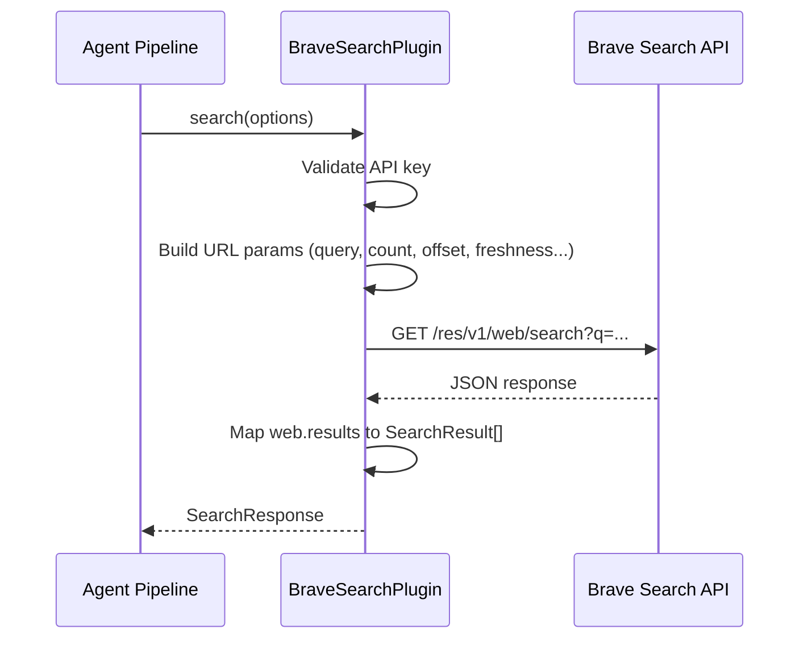
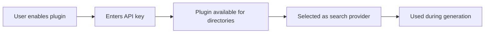

# Brave Search Plugin

The Brave Search plugin provides privacy-focused web search using the [Brave Search API](https://brave.com/search/api/). Unlike aggregated engines, Brave maintains its own independent search index and does not track users or profile their queries.

**Source:** `packages/plugins/brave/src/brave.plugin.ts`

## Overview

| Property           | Value                  |
| ------------------ | ---------------------- |
| Plugin ID          | `brave`                |
| Category           | `search`               |
| Capabilities       | `search`               |
| Version            | `1.0.0`                |
| Configuration Mode | `hybrid`               |
| Auto-enable        | No                     |
| SDK                | None (plain `fetch()`) |

The plugin implements `IPlugin` and `ISearchPlugin` from `@ever-works/plugin`. It uses raw HTTP requests against the Brave Search REST API rather than an SDK, keeping dependencies minimal.

## Architecture



## Configuration

### Settings Schema

| Setting      | Type     | Required | Default | Env Variable           | Description                                               |
| ------------ | -------- | -------- | ------- | ---------------------- | --------------------------------------------------------- |
| `apiKey`     | `string` | Yes      | --      | `PLUGIN_BRAVE_API_KEY` | Your Brave Search API key. Marked as secret (`x-secret`). |
| `maxResults` | `number` | No       | `10`    | --                     | Default maximum results per search. Range: 1--20.         |

### Obtaining an API Key

1. Go to [brave.com/search/api](https://brave.com/search/api/).
2. Sign up for a free or paid plan.
3. Copy the API key from your dashboard.
4. Enter it in the plugin settings or set the `PLUGIN_BRAVE_API_KEY` environment variable.

## Search Options

The `search()` method accepts a `SearchOptions` object and maps its fields to Brave API query parameters:

| SearchOptions Field | Brave API Parameter | Notes                                            |
| ------------------- | ------------------- | ------------------------------------------------ |
| `query`             | `q`                 | Required search query string.                    |
| `limit`             | `count`             | Capped at `MAX_RESULTS_LIMIT` (20).              |
| `page`              | `offset`            | Converted to 0-based offset. Max offset: page 9. |
| `region`            | `country`           | Two-letter country code (e.g., `us`, `gb`).      |
| `language`          | `search_lang`       | Language code (e.g., `en`, `fr`).                |
| `safeSearch`        | `safesearch`        | `off`, `moderate`, or `strict`.                  |
| `timeRange`         | `freshness`         | Mapped through `FRESHNESS_MAP` (see below).      |

### Time Range Mapping

The plugin translates standard time range values to Brave's freshness codes:

```typescript
const FRESHNESS_MAP: Record<string, string> = {
	day: 'pd', // past day
	week: 'pw', // past week
	month: 'pm', // past month
	year: 'py' // past year
};
```

A value of `'all'` skips the freshness filter entirely.

## Response Format

The plugin returns a `SearchResponse` with these fields:

```typescript
interface SearchResponse {
	results: SearchResult[]; // Mapped result objects
	query: string; // Original query
	totalResults: number; // Number of results returned
	hasMore: boolean; // Whether additional pages exist
	nextPage?: number; // Next page number if hasMore is true
	duration: number; // Request duration in milliseconds
}
```

Each `SearchResult` contains:

| Field                     | Source                      |
| ------------------------- | --------------------------- |
| `title`                   | `web.results[].title`       |
| `url`                     | `web.results[].url`         |
| `snippet`                 | `web.results[].description` |
| `faviconUrl`              | `web.results[].favicon`     |
| `position`                | 1-based index               |
| `publishedDate`           | `web.results[].age`         |
| `metadata.language`       | Language of the result      |
| `metadata.familyFriendly` | Family-friendly flag        |

## Pagination

Brave Search supports offset-based pagination with a maximum of 10 pages (offsets 0 through 9):

```
MAX_PAGE_OFFSET = 9
offset = Math.min((page - 1) * limit, MAX_PAGE_OFFSET * limit)
```

The `hasMore` flag is derived from `query.more_results_available` in the API response.

## Rate Limits

The `getRateLimitInfo()` method returns `-1` for both `remaining` and `limit`, indicating that rate limit tracking is not performed client-side. Brave enforces rate limits at the API level based on your subscription plan:

| Plan | Requests/Month |
| ---- | -------------- |
| Free | 2,000          |
| Base | 5,000          |
| Pro  | 20,000+        |

## Error Handling

- Missing API key throws an `Error` with a descriptive message pointing to the settings or environment variable.
- Non-2xx HTTP responses throw an `Error` including the status code and response body.
- All errors are logged through the plugin context logger before being re-thrown to the caller.

## Lifecycle

| Method            | Behavior                                                                                 |
| ----------------- | ---------------------------------------------------------------------------------------- |
| `onLoad(context)` | Stores the plugin context for logging.                                                   |
| `onUnload()`      | Clears the stored context.                                                               |
| `healthCheck()`   | Always returns `healthy` -- actual connectivity depends on a valid API key at call time. |
| `isAvailable()`   | Always returns `true`.                                                                   |

## Usage in the Platform

When Brave Search is enabled and selected as the active search provider for a directory, the agent pipeline calls `search()` during content generation to find information about each directory item. Its independent index can surface results that other engines miss.

```typescript
// Conceptual usage inside the generation pipeline
const bravePlugin = pluginManager.getPlugin<ISearchPlugin>('brave');
const results = await bravePlugin.search({
	query: 'best project management tools 2025',
	limit: 10,
	timeRange: 'month',
	settings: { apiKey: 'sk-...' }
});
```

## Integration with the Plugin System

The Brave plugin is a built-in plugin (`builtIn: true`) but is not a system plugin and is not auto-enabled. Users must explicitly enable it and provide their own API key. The `configurationMode` is `hybrid`, meaning both admin and user settings are supported.


