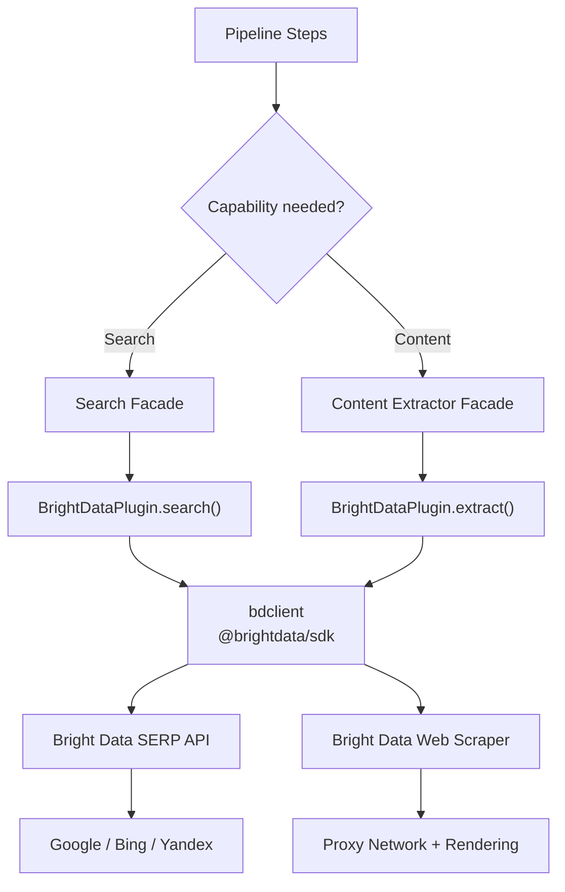
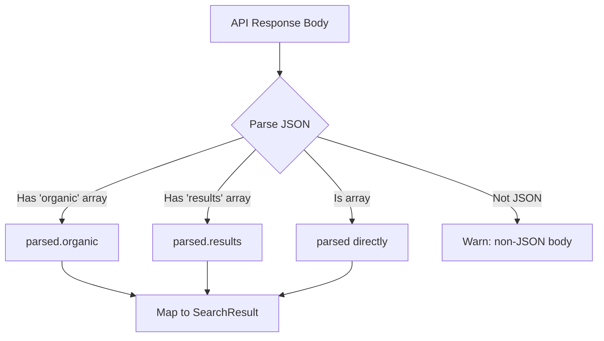
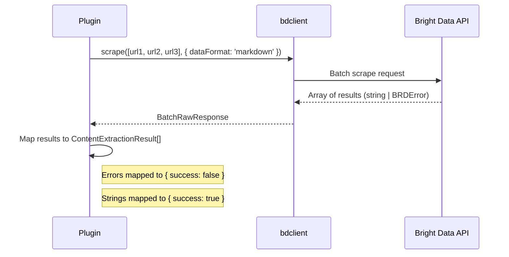
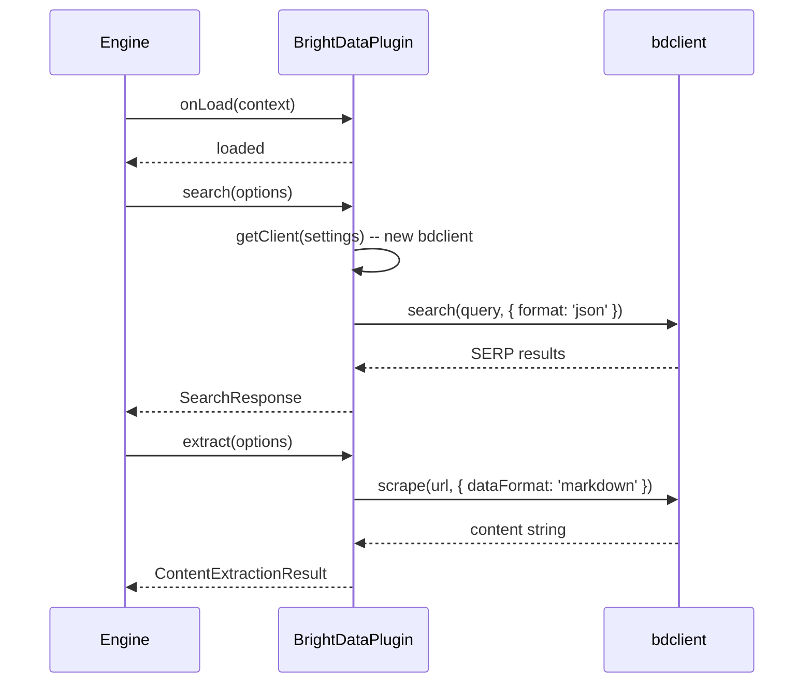

# Bright Data Search & Content Extraction Plugin

The Bright Data plugin provides web search via its SERP API and content extraction via its Web Scraper. It handles bot detection, CAPTCHAs, and geo-restrictions through a global proxy network, and supports batch scraping for processing multiple URLs concurrently.

**Source:** `packages/plugins/brightdata/src/brightdata.plugin.ts`

## Overview

| Property | Value |
|---|---|
| Plugin ID | `brightdata` |
| Package | `@ever-works/brightdata-plugin` |
| Category | `search` |
| Capabilities | `search`, `content-extractor` |
| Version | `1.0.0` |
| Configuration Mode | `hybrid` |
| Auto-enable | No |
| Built-in | Yes |
| System Plugin | No |

The plugin implements `IPlugin`, `ISearchPlugin`, and `IContentExtractorPlugin`. It uses the official `@brightdata/sdk` package to interact with the Bright Data API for both SERP search and web scraping.

## Architecture



## Configuration

### Settings Schema

| Setting | Type | Required | Scope | Description |
|---|---|---|---|---|
| `apiKey` | `string` | Yes | `user` | Bright Data API key. Secret. Env: `PLUGIN_BRIGHTDATA_API_KEY` |

### Environment Variables

| Variable | Description |
|---|---|
| `PLUGIN_BRIGHTDATA_API_KEY` | Bright Data API key (optional -- can be set via admin/user settings) |

## Search Capability (SERP API)

### Search Method

The `search()` method queries the Bright Data SERP API and returns structured results:

```typescript
const results = await brightDataPlugin.search({
    query: 'best coffee shops downtown',
    limit: 10,
    includeDomains: ['yelp.com'],
    excludeDomains: ['spam-site.com'],
    region: 'us',
    settings: { apiKey: 'your-key' }
});
```

### Domain Filtering

Domain filtering is implemented using search operator syntax appended to the query:

```typescript
// Include: adds site:domain operators
if (options.includeDomains?.length > 0) {
    const siteFilter = options.includeDomains.map((d) => `site:${d}`).join(' OR ');
    query = `${query} (${siteFilter})`;
}

// Exclude: adds -site:domain operators
if (options.excludeDomains?.length > 0) {
    const excludeFilter = options.excludeDomains.map((d) => `-site:${d}`).join(' ');
    query = `${query} ${excludeFilter}`;
}
```

### Result Parsing

The plugin handles multiple response formats from the SERP API:



Each result is mapped to the standard `SearchResult` format:

```typescript
{
    title: r.title || '',
    url: r.url || r.link || '',
    snippet: r.description || r.snippet || '',
    position: index + 1,
    source: new URL(rawUrl).hostname  // extracted from URL
}
```

### Search Options

| Option | Type | Description |
|---|---|---|
| `query` | `string` | Search query |
| `limit` | `number` | Max results (default: 20) |
| `includeDomains` | `string[]` | Filter to specific domains |
| `excludeDomains` | `string[]` | Exclude specific domains |
| `region` | `string` | Country code for geo-targeted results |

## Content Extraction Capability

### Single URL Extraction

```typescript
const result = await brightDataPlugin.extract({
    url: 'https://example.com/article',
    settings: { apiKey: 'your-key' }
});

if (result.success) {
    console.log(result.content);      // Raw content
    console.log(result.markdown);     // Markdown formatted
    console.log(result.wordCount);    // Word count
    console.log(result.readingTime);  // Estimated minutes
    console.log(result.duration);     // Extraction time (ms)
}
```

The extraction uses `dataFormat: 'markdown'` to get clean markdown output directly.

### Batch Extraction

Bright Data supports true batch scraping through its SDK, processing multiple URLs in a single API call:

```typescript
const results = await brightDataPlugin.extractBatch(
    ['https://example.com/page1', 'https://example.com/page2'],
    { settings: { apiKey: 'your-key' } }
);
```



Individual failures in a batch do not fail the entire operation -- each URL's result is independent.

### Supported Formats

```typescript
getSupportedFormats(): readonly ('text' | 'html' | 'markdown')[] {
    return ['text', 'html', 'markdown'];
}
```

### URL Validation

Only HTTP and HTTPS URLs are supported:

```typescript
async canExtract(url: string): Promise<boolean> {
    const parsed = new URL(url);
    return parsed.protocol === 'http:' || parsed.protocol === 'https:';
}
```

## Rate Limiting

The plugin reports rate limit information but does not track actual API quotas:

```typescript
async getRateLimitInfo(): Promise<RateLimitInfo> {
    return {
        remaining: -1,    // Unknown
        limit: -1,        // Unknown
        period: 'month'   // Bright Data bills monthly
    };
}
```

## Bright Data vs. Scrapfly

Both plugins provide content extraction, but they serve different strengths:

| Feature | Bright Data | Scrapfly |
|---|---|---|
| Search (SERP) | Yes | No |
| Screenshots | No | Yes |
| Content Extraction | Yes | Yes |
| Batch Scraping | Native batch API | Sequential batches (5 at a time) |
| Output Formats | text, html, markdown | markdown |
| Bot Bypass | Yes | Yes (ASP) |

## Lifecycle



## Dependencies

| Package | Version | Purpose |
|---|---|---|
| `@brightdata/sdk` | ^0.2.0 | Official Bright Data SDK |
| `@ever-works/plugin` | workspace | Plugin contracts (peer dependency) |

## Getting Started

1. Sign up at [brightdata.com](https://brightdata.com)
2. Copy your API key from the dashboard
3. Enable the Bright Data plugin in Ever Works
4. Enter the key in the **API Key** field
5. The plugin is now available for search and content extraction tasks
