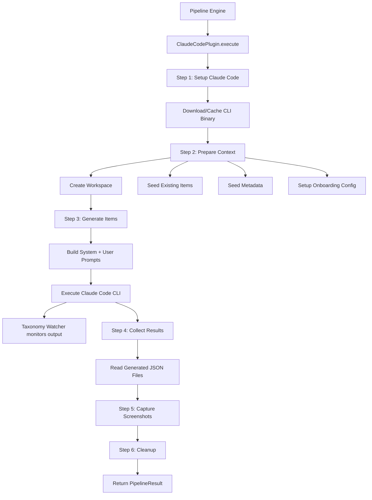

# Claude Code Generator Plugin

The Claude Code Generator plugin is a full pipeline plugin that delegates the entire directory generation process to [Claude Code](https://github.com/anthropics/claude-code). It runs a single Claude Code CLI session that autonomously handles web search, content creation, and file generation within a sandboxed workspace.

**Source:** `packages/plugins/claude-code/src/claude-code.plugin.ts`

## Overview

| Property | Value |
|---|---|
| Plugin ID | `claude-code` |
| Category | `pipeline` |
| Capabilities | `pipeline`, `form-schema-provider` |
| Version | `1.0.0` |
| Configuration Mode | `user-required` |
| Auto-enable | No |
| Built-in | Yes |
| System Plugin | No |

The plugin implements `IPlugin`, `IPipelinePlugin`, and `IFormSchemaProvider`.

## Architecture



### How It Works

Unlike other pipeline plugins that orchestrate multiple internal steps with facades, the Claude Code Generator hands the entire generation task to the Claude Code CLI as a subprocess. The CLI runs with a tailored system prompt, has access to web search through its built-in tools, and writes generated items as JSON files to a temporary workspace.

## Pipeline Steps

The plugin runs 6 sequential steps:

| Step | ID | Description | Duration |
|---|---|---|---|
| 1 | `setup-claude-code` | Downloads and caches the Claude Code CLI binary for the configured version | ~5s |
| 2 | `prepare-context` | Creates a temp workspace, seeds it with existing items and directory metadata | ~2s |
| 3 | `generate-items` | Runs the Claude Code CLI to research and generate items as JSON files | ~60-180s |
| 4 | `collect-results` | Reads generated JSON files from the workspace directory | ~2s |
| 5 | `capture-screenshots` | Takes screenshots for items that need images (optional) | ~30s |
| 6 | `cleanup` | Removes the temporary workspace directory | ~1s |

## Configuration

### Settings Schema

| Setting | Type | Default | Description |
|---|---|---|---|
| `oauthToken` | `string` | -- | Claude Code OAuth token (from `claude setup-token`) |
| `apiKey` | `string` | -- | Anthropic API key (from console.anthropic.com) |
| `version` | `string` | Latest | Claude Code CLI version to use (hidden) |
| `maxTurns` | `integer` | Default | Maximum number of agentic turns (1--100, hidden) |
| `maxBudgetUsd` | `number` | -- | Maximum budget in USD per generation (hidden) |
| `model` | `string` | -- | Model alias (`sonnet`, `opus`) or full name |

### Authentication

At least one of `oauthToken` or `apiKey` must be configured. The settings schema enforces this through the `x-requiredGroups` extension. OAuth token takes precedence when both are present.

**OAuth Token (recommended):**

```bash
claude setup-token
```

**API Key:**

Get one from [console.anthropic.com](https://console.anthropic.com).

### Environment Variables

| Variable | Description |
|---|---|
| `PLUGIN_CLAUDE_CODE_OAUTH_TOKEN` | OAuth token fallback |

## Features

### Binary Management

The `ensureBinary()` utility in `utils/binary-manager.ts` handles downloading and caching the Claude Code CLI binary. It checks whether the requested version is already cached, downloads it if needed, and returns the path to the executable.

### Workspace Sandbox

Each generation runs in an isolated temporary workspace:

1. **Creation** -- a unique directory is created under a base temp directory
2. **Seeding** -- existing items are written as reference files, and metadata (directory name, description, categories, tags, brands) is written as context files
3. **Onboarding config** -- ensures the Claude Code CLI has necessary configuration
4. **Cleanup** -- the workspace is removed after generation, even if an error occurs

### Taxonomy Watcher

The `startTaxonomyWatcher()` utility monitors the workspace for new item files during generation. As Claude Code writes items to disk, the watcher detects them and reports progress to the UI in real time (e.g., "Generated 5 of 20 items").

### Process Management

The `executeClaudeCode()` function spawns the CLI as a child process with:

- A system prompt providing generation instructions
- A user prompt with the specific directory request
- Environment variables for authentication
- Configurable max turns and budget limits
- Abort signal support for cancellation

The returned `kill` function allows the pipeline to terminate the process if the user cancels generation.

### Screenshot Capture

After items are collected, the plugin optionally captures screenshots using the configured screenshot provider. This step is skipped if:

- `capture_screenshots` is set to `false` in the request config
- No items were generated
- No screenshot facade is available
- The generation was cancelled

### Selectable Provider Categories

The Claude Code Generator only allows selecting a `screenshot` provider. All other functionality (search, content extraction) is handled internally by Claude Code.

## Getting Started

1. Enable the Claude Code Generator plugin on the Plugins page
2. Configure authentication with either an OAuth token or API key
3. Optionally set a model and budget limit
4. Select "Claude Code Generator" as the pipeline provider when generating a directory
5. Generation will run autonomously -- Claude Code handles research and item creation

## API Reference

### Class: `ClaudeCodePlugin`

```typescript
class ClaudeCodePlugin implements IPlugin, IPipelinePlugin, IFormSchemaProvider {
  readonly id: 'claude-code';
  readonly category: 'pipeline';

  execute(directory, request, existing, options?, onProgress?): Promise<PipelineResult>;
  cancel(): Promise<void>;
  getState(): PipelineState<ClaudeCodeStepId> | null;
  getStepDefinitions(): readonly PipelineStepDefinition[];
  getFormFields(): FormFieldDefinition[];
  getFormGroups(): FormFieldGroup[];
  validateFormInput(values): ValidationResult;
  getDefaultValues(): Record<string, unknown>;
}
```

### Key Types

| Type | Purpose |
|---|---|
| `ClaudeCodeStepId` | Union of the 6 step IDs |
| `ExecuteResult` | Result from the CLI process (exitCode, stdout, stderr, killed) |

## Comparison with Other Pipelines

| Aspect | Claude Code Generator | Agent Pipeline | Standard Pipeline |
|---|---|---|---|
| Execution model | External CLI subprocess | In-process AI agent | Engine-orchestrated steps |
| Search | Built-in Claude Code tools | Configurable search facade | Configurable search facade |
| AI provider | Anthropic only | Any OpenAI-compatible | Any provider |
| Authentication | OAuth token or Anthropic API key | Via AI provider plugin | Via AI provider plugin |
| Budget control | Built-in USD budget limit | Token limit via maxSteps | No built-in limit |
| Steps | 6 | 5 | 15 |
