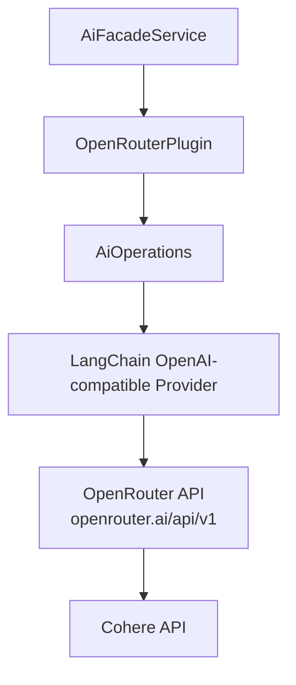
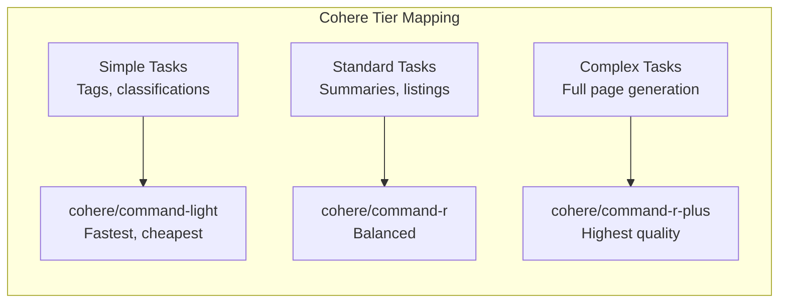

# Cohere Models via OpenRouter

Ever Works does not ship a standalone Cohere plugin. Cohere models, including the Command R family, are available through the **OpenRouter** plugin. This page describes how to configure and use Cohere models for directory generation, content creation, and AI conversations.

**Related source files:**

| File | Purpose |
|---|---|
| `packages/plugins/openrouter/src/openrouter.plugin.ts` | OpenRouter AI provider plugin |
| `packages/plugin/src/ai/reasoning.utils.ts` | Reasoning configuration utilities |

## What is Cohere?

Cohere is an enterprise AI platform that offers models optimized for business applications. Their Command R models are designed for retrieval-augmented generation (RAG), multilingual content, and structured data extraction -- all capabilities that align well with directory generation workflows.

## Available Cohere Models

Cohere models are available on OpenRouter with the `cohere/` prefix:

| Model ID (OpenRouter) | Description | Strengths |
|---|---|---|
| `cohere/command-r-plus` | Command R+ | Highest quality, RAG-optimized |
| `cohere/command-r` | Command R | Balanced quality and cost |
| `cohere/command` | Command | Cost-effective for simpler tasks |
| `cohere/command-light` | Command Light | Fastest, lowest cost |

:::note
Model availability on OpenRouter changes over time. Check [openrouter.ai/models](https://openrouter.ai/models) for the current list of available Cohere models and pricing.
:::

## Why Consider Cohere for Directories?

Cohere models have specific strengths relevant to directory generation:

| Strength | Benefit for Ever Works |
|---|---|
| **RAG optimization** | Excels at generating content from source material |
| **Multilingual support** | Strong performance across many languages |
| **Structured output** | Reliable JSON generation for item data |
| **Grounding** | Can cite sources when generating content |
| **Enterprise focus** | Consistent, reliable output quality |

## Configuration

### Setting Up Cohere Models

1. Navigate to **Settings > Plugins** in the Ever Works dashboard.
2. Ensure the **OpenRouter** plugin is enabled (enabled by default).
3. Enter your OpenRouter API key.
4. Set model fields to Cohere model IDs:

| Setting | Recommended Value |
|---|---|
| Default Model | `cohere/command-r` |
| Simple Tasks Model | `cohere/command-light` |
| Standard Tasks Model | `cohere/command-r` |
| Complex Tasks Model | `cohere/command-r-plus` |

### Environment Variables

```bash
PLUGIN_OPENROUTER_API_KEY=sk-or-...
PLUGIN_OPENROUTER_DEFAULT_MODEL=cohere/command-r
PLUGIN_OPENROUTER_SIMPLE_MODEL=cohere/command-light
PLUGIN_OPENROUTER_MEDIUM_MODEL=cohere/command-r
PLUGIN_OPENROUTER_COMPLEX_MODEL=cohere/command-r-plus
```

## Architecture

Cohere models follow the same access path as all other OpenRouter models:



The OpenRouter plugin uses an OpenAI-compatible API endpoint. OpenRouter translates requests to the Cohere-native format internally, so no special handling is needed in the plugin.

## Tiered Model Strategy

Cohere's model lineup maps naturally to the Ever Works tier system:



### Mixed-Provider Configuration

Combine Cohere with other providers for optimal cost-quality balance:

| Tier | Model | Provider | Rationale |
|---|---|---|---|
| Simple | `openai/gpt-5-nano` | OpenAI | Fastest for tags |
| Standard | `cohere/command-r` | Cohere | Strong at structured content |
| Complex | `cohere/command-r-plus` | Cohere | RAG-optimized for source-based generation |

## Capabilities

| Capability | Command R+ | Command R | Command Light |
|---|---|---|---|
| Structured output | Yes | Yes | Yes |
| Streaming | Yes | Yes | Yes |
| Tool calling | Yes | Yes | Limited |
| Vision | No | No | No |
| Embeddings | No (via OpenRouter) | No (via OpenRouter) | No |
| Multilingual | Strong | Strong | Good |

### Embedding Limitation

Cohere offers embedding models (e.g., `embed-english-v3.0`), but these are not currently accessible through the OpenRouter plugin in Ever Works. If you need embeddings:

- Use the **OpenAI** plugin (`text-embedding-3-small`).
- Use the **Google Gemini** plugin (built-in embedding support).
- Use the **Ollama** plugin with a local embedding model.

## Comparison with Other Providers

| Aspect | Cohere (via OpenRouter) | OpenAI (direct) | Anthropic (direct) |
|---|---|---|---|
| Setup | OpenRouter key | OpenAI key | Anthropic key |
| RAG optimization | Strong | Good | Good |
| Multilingual | Very strong | Good | Good |
| Structured output | Reliable | Very reliable | Reliable |
| Vision | No | Yes (GPT-4o+) | Yes (Claude) |
| Embeddings | Not via OpenRouter | Yes | No |
| Cost | Moderate | Varies by model | Varies by model |

## Use Cases for Cohere in Directories

### Multilingual Directories

Cohere's multilingual capabilities make it well-suited for directories that serve content in multiple languages. Command R models handle cross-language content generation without significant quality degradation.

### Source-Heavy Directories

When directories are built from extensive source material (web scraping, PDFs, Notion pages), Cohere's RAG optimization helps the model ground its output in the provided sources rather than hallucinating information.

### Structured Data Extraction

Cohere models reliably produce structured JSON output, which is critical for generating directory item data (names, descriptions, categories, tags, metadata).

## Troubleshooting

| Issue | Cause | Solution |
|---|---|---|
| Model not found | Model ID incorrect or model discontinued | Verify at openrouter.ai/models |
| Authentication error | Invalid OpenRouter API key | Regenerate key at openrouter.ai |
| Rate limit exceeded | Too many requests | Check OpenRouter plan limits |
| Poor multilingual output | Wrong model selected | Use Command R or Command R+ for multilingual |
| Embedding request fails | Cohere embeddings not available via OpenRouter | Use OpenAI or Ollama for embeddings |
| JSON parsing errors | Structured output not enforced | Ensure pipeline uses structured output mode |

## Further Reading

- [OpenRouter Plugin](./openrouter-plugin.md) -- complete OpenRouter configuration
- [AI Provider Plugins](./ai-provider-plugins.md) -- all available AI providers
- [DeepSeek Models](./deepseek-plugin.md) -- another provider accessible via OpenRouter
- [xAI Grok Models](./xai-plugin.md) -- Grok models via OpenRouter
- [Plugin Settings](./settings.md) -- settings resolution and configuration modes
