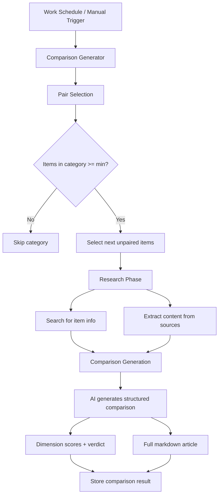

# Comparison Generator Plugin

The Comparison Generator plugin automatically creates detailed A vs B comparison pages between items in your works. Each comparison includes structured dimensions with scores, a verdict, and a full SEO-optimized markdown article suitable for publishing as a standalone comparison page.

**Source:** `packages/plugins/comparison-generator/src/comparison-generator.plugin.ts`

## Overview

| Property           | Value                  |
| ------------------ | ---------------------- |
| Plugin ID          | `comparison-generator` |
| Category           | `utility`              |
| Capabilities       | `form-schema-provider` |
| Version            | `1.0.0`                |
| Configuration Mode | `hybrid`               |
| Auto-enable        | No                     |
| Built-in           | Yes                    |
| System Plugin      | Yes                    |

The plugin implements `IPlugin`. It provides a settings schema for configuring comparison generation behavior and serves as the metadata/configuration entry point for the comparison generation feature.

## Architecture



### Generation Flow

1. **Pair selection** -- the plugin analyzes items within each category and picks the most relevant pairs that have not been compared yet
2. **Research** -- gathers information about both items using configured search and content-extraction plugins
3. **Comparison generation** -- uses the AI provider to produce a structured comparison with dimensions, scores, and a verdict
4. **Article writing** -- generates a full markdown article suitable for publishing

## Configuration

### Settings Schema

| Setting                    | Type      | Default      | Description                                                             |
| -------------------------- | --------- | ------------ | ----------------------------------------------------------------------- |
| `cadence_override`         | `string`  | `"use_work"` | How often to auto-generate: `use_work`, `daily`, `weekly`, or `monthly` |
| `max_comparisons_mode`     | `string`  | `"custom"`   | Cap mode: `custom` (use limit) or `unlimited` (all possible pairs)      |
| `max_comparisons`          | `number`  | `50`         | Maximum total comparisons (1--500, only in Custom mode)                 |
| `min_items_for_comparison` | `number`  | `3`          | Minimum items in a category before generating comparisons (2--20)       |
| `ai_provider`              | `string`  | --           | Override AI provider for comparison generation (hidden)                 |
| `ai_model`                 | `string`  | --           | Override AI model for comparison generation (hidden)                    |
| `custom_prompt`            | `string`  | --           | Additional instructions for comparison prompts (hidden)                 |
| `extended_analysis`        | `boolean` | `false`      | Generate deeper analysis alongside the standard comparison (hidden)     |

### Conditional Visibility

The `max_comparisons` field is only shown when `max_comparisons_mode` is set to `"custom"`. This is controlled via the `x-showIf` schema extension.

## Features

### Scheduled Generation

Comparisons can be generated automatically based on a configurable cadence:

| Cadence    | Behavior                                   |
| ---------- | ------------------------------------------ |
| `use_work` | Follows the work's own generation schedule |
| `daily`    | Generates a new comparison every day       |
| `weekly`   | Generates a new comparison every week      |
| `monthly`  | Generates a new comparison every month     |

Each scheduled run generates one high-quality comparison per pass to maintain quality and manage API costs.

### Manual Comparisons

Users can pick any two items and generate a comparison on demand from the Comparisons tab in the work UI. This bypasses scheduling and category requirements.

### Dimension Scoring

Each comparison breaks down the items across multiple dimensions. For each dimension:

- A score is assigned to each item
- A summary explains the scoring rationale
- The scores are used to determine an overall verdict

### Duplicate Prevention

The plugin tracks previously generated pairs so no comparison is repeated. When selecting pairs, it checks against the existing comparison history and only picks items that have not been compared yet.

### Source Attribution

Generated comparisons include references to the sources used during the research phase, providing transparency and credibility.

### Category-Based Pairing

Comparisons are generated between items within the same category, ensuring that compared items are relevant to each other. A category must have at least `min_items_for_comparison` items (default: 3) before comparisons are generated for it.

### Volume Control

Two modes control how many comparisons are generated:

| Mode          | Behavior                                                  |
| ------------- | --------------------------------------------------------- |
| **Custom**    | Caps total comparisons at `max_comparisons` (default: 50) |
| **Unlimited** | Generates all possible pairs within eligible categories   |

For a category with N items, the maximum number of pairs is N \* (N - 1) / 2. With many items, unlimited mode can generate a large number of comparisons.

## Usage

### Enabling Comparisons

1. Enable the Comparison Generator plugin on the Plugins page
2. Go to the work Generator settings
3. Configure the comparison cadence and limits
4. Comparisons will be generated according to the schedule

### Manual Comparison

1. Navigate to the Comparisons tab in your work
2. Select two items to compare
3. The comparison is generated immediately and stored

## API Reference

### Class: `ComparisonGeneratorPlugin`

```typescript
class ComparisonGeneratorPlugin implements IPlugin {
	readonly id: 'comparison-generator';
	readonly category: 'utility';

	onLoad(context: PluginContext): Promise<void>;
	onUnload(): Promise<void>;
	healthCheck(): Promise<PluginHealthCheck>;
	getManifest(): PluginManifest;
}
```

### Comparison Output Structure

Each generated comparison typically includes:

| Field           | Description                                                       |
| --------------- | ----------------------------------------------------------------- |
| Item A / Item B | The two items being compared                                      |
| Dimensions      | Array of comparison dimensions with per-item scores and summaries |
| Verdict         | Overall winner and reasoning                                      |
| Article         | Full markdown article for SEO publishing                          |
| Sources         | References used during research                                   |

## SEO Benefits

Comparison pages are a proven SEO strategy. They target high-intent search queries like "X vs Y" that indicate a user is actively evaluating options. The generated articles are structured for search engines with:

- Clear headings comparing specific dimensions
- Structured data for rich snippets
- Comprehensive, factual content based on real research
- A clear verdict to satisfy user intent
