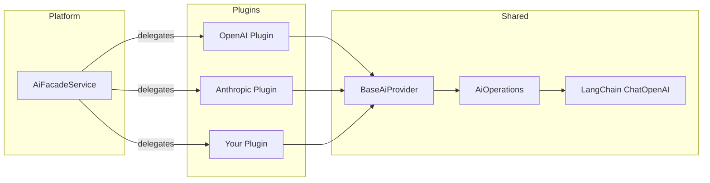
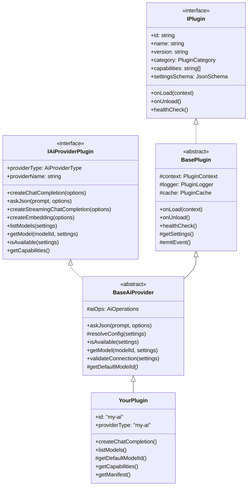
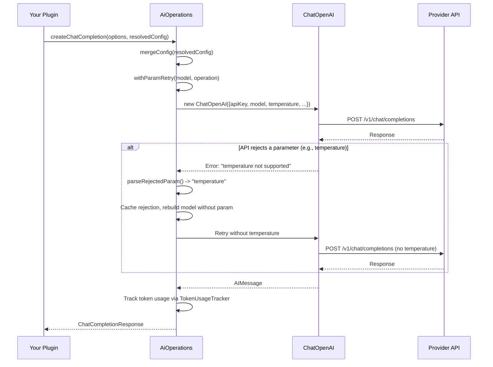

# Creating an AI Provider Plugin

AI provider plugins are the backbone of Ever Works' content generation system. They connect the platform to large language model APIs -- OpenAI, Anthropic, Google, Groq, OpenRouter, Ollama, and others -- through a unified interface that the rest of the platform consumes without caring which provider is active.

This guide walks through every step of building an AI provider plugin, from scaffolding the package to writing tests and registering the plugin with the platform.

## How AI Provider Plugins Fit Into the Architecture



**Key actors:**

| Component | Location | Role |
|---|---|---|
| `AiFacadeService` | `packages/agent/src/facades/` | Selects the active AI provider and routes requests |
| `BaseAiProvider` | `packages/plugin/src/abstract/base-ai-provider.ts` | Abstract class every AI provider extends |
| `AiOperations` | `packages/plugin/src/ai/ai-operations.ts` | Shared wrapper around LangChain's `ChatOpenAI` |
| `IAiProviderPlugin` | `packages/plugin/src/contracts/capabilities/ai-provider.interface.ts` | The TypeScript interface your plugin satisfies |

When the platform needs AI -- generating a directory listing, running the conversational assistant, extracting structured data -- it calls `AiFacadeService`, which finds the enabled AI provider plugin and invokes its methods. Your plugin receives the call, resolves user-provided settings (API key, model, temperature), and delegates to `AiOperations`, which handles the LangChain invocation, parameter retry logic, JSON repair, token tracking, and streaming.

## Prerequisites

- **Node.js** >= 20
- **pnpm** as the package manager (never npm or yarn)
- The Ever Works monorepo cloned and dependencies installed (`pnpm install`)
- Familiarity with TypeScript and async/await

## Project Scaffolding

Every AI provider plugin lives in its own directory under `packages/plugins/`. The structure is identical across all providers.

### Directory Layout

```
packages/plugins/my-ai/
  src/
    __tests__/
      my-ai.plugin.spec.ts
    my-ai.plugin.ts          # Plugin implementation
    index.ts                  # Public exports
  package.json
  tsconfig.json
  tsup.config.ts
  vitest.config.ts
```

### package.json

```json
{
  "name": "@ever-works/my-ai-plugin",
  "version": "1.0.0",
  "description": "My AI provider plugin for Ever Works platform",
  "private": false,
  "type": "module",
  "license": "MIT",
  "main": "./dist/index.cjs",
  "module": "./dist/index.js",
  "types": "./dist/index.d.ts",
  "exports": {
    ".": {
      "types": "./dist/index.d.ts",
      "import": "./dist/index.js",
      "require": "./dist/index.cjs"
    }
  },
  "files": ["dist"],
  "scripts": {
    "build": "tsup",
    "dev": "tsup --watch",
    "clean": "rm -rf dist",
    "type-check": "tsc --noEmit",
    "test": "vitest run",
    "test:watch": "vitest"
  },
  "dependencies": {
    "@ever-works/plugin": "workspace:*",
    "@langchain/openai": "^0.6.17",
    "@langchain/core": "^0.3.80"
  },
  "devDependencies": {
    "tsup": "^8.0.0",
    "typescript": "^5.9.3",
    "vitest": "^3.2.1"
  },
  "everworks": {
    "plugin": {
      "id": "my-ai",
      "name": "My AI Provider",
      "version": "1.0.0",
      "category": "ai-provider",
      "capabilities": ["ai-provider"],
      "description": "My AI provider plugin for Ever Works platform",
      "author": {
        "name": "Your Name"
      },
      "license": "MIT",
      "builtIn": true,
      "autoEnable": false
    }
  }
}
```

The `everworks.plugin` block is how the platform discovers your plugin at runtime. The `id` must be unique across all plugins. Set `builtIn: true` for plugins shipped with the platform; set it to `false` for community plugins. Set `autoEnable: false` so users opt in explicitly.

### tsconfig.json

```json
{
  "compilerOptions": {
    "target": "ES2021",
    "module": "ESNext",
    "moduleResolution": "bundler",
    "declaration": true,
    "declarationMap": true,
    "sourceMap": true,
    "outDir": "./dist",
    "strict": true,
    "esModuleInterop": true,
    "skipLibCheck": true,
    "forceConsistentCasingInFileNames": true,
    "resolveJsonModule": true,
    "isolatedModules": true,
    "noEmit": true
  },
  "include": ["src"],
  "exclude": ["node_modules", "dist"]
}
```

### tsup.config.ts

```ts
import { defineConfig } from 'tsup';

export default defineConfig({
  entry: ['src/index.ts'],
  noExternal: ['@ever-works/plugin'],
  format: ['esm', 'cjs'],
  dts: true,
  clean: true,
  sourcemap: false,
  splitting: false,
  treeshake: true,
  target: 'es2021',
  outDir: 'dist'
});
```

:::info Why `noExternal: ['@ever-works/plugin']`?
The plugin package is bundled into the output so the built plugin is self-contained. LangChain packages (`@langchain/openai`, `@langchain/core`) are left as external dependencies resolved at runtime.
:::

### vitest.config.ts

```ts
import { defineConfig } from 'vitest/config';

export default defineConfig({
  test: {
    environment: 'node',
    globals: true,
    include: ['src/**/*.{test,spec}.ts'],
    coverage: {
      provider: 'v8',
      reporter: ['text', 'json', 'html']
    }
  }
});
```

### src/index.ts

```ts
export { MyAiPlugin, MyAiPlugin as default } from './my-ai.plugin.js';
```

Every plugin exports its class as both a named and default export. The default export is what the plugin loader uses to instantiate the plugin.

## Plugin Implementation

Below is a complete, annotated implementation. Each section is explained in detail afterward.

```ts
// src/my-ai.plugin.ts

import { BaseAiProvider } from '@ever-works/plugin/abstract';
import { AiOperations } from '@ever-works/plugin/ai';
import type {
  PluginContext,
  PluginManifest,
  PluginHealthCheck,
  JsonSchema,
  PluginSettings,
  ChatCompletionOptions,
  ChatCompletionResponse,
  ChatCompletionChunk,
  EmbeddingOptions,
  EmbeddingResponse,
  AiModel,
  AiModelCapabilities
} from '@ever-works/plugin';

/**
 * My AI provider plugin
 *
 * Provides AI capabilities through the My AI API.
 * Uses 'user-required' configuration mode - users MUST provide their own API key.
 */
export class MyAiPlugin extends BaseAiProvider {
  // ──────────────────────────────────────────────
  // Identity & metadata
  // ──────────────────────────────────────────────

  readonly id = 'my-ai';
  readonly name = 'My AI Provider';
  readonly version = '1.0.0';

  /** Must match a provider type known to AiOperations (or 'openai' if the
   *  API is OpenAI-compatible). */
  readonly providerType = 'my-ai';
  readonly providerName = 'My AI';

  /** 'user-required' means every user must supply their own API key.
   *  Use 'hybrid' if the admin can also set a shared key via env var. */
  readonly configurationMode: 'admin-only' | 'user-required' | 'hybrid' = 'user-required';

  // ──────────────────────────────────────────────
  // Settings schema (JSON Schema + x-* extensions)
  // ──────────────────────────────────────────────

  readonly settingsSchema: JsonSchema = {
    type: 'object',
    properties: {
      apiKey: {
        type: 'string',
        title: 'My AI API Key',
        description: 'Connects to My AI for content generation and chat',
        'x-secret': true,
        'x-scope': 'user'
      },
      defaultModel: {
        type: 'string',
        title: 'Default Model',
        description: 'Used for all AI tasks unless a tier-specific model is set',
        default: 'my-ai-standard',
        'x-widget': 'model-select',
        'x-scope': 'global'
      },
      simpleModel: {
        type: 'string',
        title: 'Simple Tasks Model',
        description: 'Handles tags, short descriptions, and quick classifications',
        default: 'my-ai-mini',
        'x-widget': 'model-select',
        'x-scope': 'global'
      },
      mediumModel: {
        type: 'string',
        title: 'Standard Tasks Model',
        description: 'Handles listings, summaries, and content reformatting',
        default: 'my-ai-standard',
        'x-widget': 'model-select',
        'x-scope': 'global'
      },
      complexModel: {
        type: 'string',
        title: 'Complex Tasks Model',
        description: 'Handles full page generation and multi-step analysis',
        default: 'my-ai-pro',
        'x-widget': 'model-select',
        'x-scope': 'global'
      },
      temperature: {
        type: 'number',
        title: 'Temperature',
        description: 'Lower values give consistent output, higher values add variety',
        default: 0.7,
        minimum: 0,
        maximum: 2,
        'x-hidden': true
      },
      maxTokens: {
        type: 'number',
        title: 'Max Tokens',
        description: 'Limits the length of each AI-generated response',
        default: 4096,
        'x-hidden': true
      },
      baseUrl: {
        type: 'string',
        title: 'Base URL',
        description: 'My AI API endpoint',
        default: 'https://api.my-ai.com/v1',
        'x-hidden': true
      }
    },
    required: ['apiKey', 'defaultModel']
  };

  // ──────────────────────────────────────────────
  // Lifecycle
  // ──────────────────────────────────────────────

  async onLoad(context: PluginContext): Promise<void> {
    await super.onLoad(context);

    // Create AiOperations with default config.
    // The apiKey is empty here -- it gets resolved at call time
    // from user settings via resolveConfig().
    this.aiOps = new AiOperations({
      apiKey: '',
      model: 'my-ai-mini',
      temperature: 0.7,
      baseURL: 'https://api.my-ai.com/v1',
      maxTokens: 4096,
      providerType: 'my-ai'
    });

    context.logger.log('My AI Plugin loaded');
  }

  async onUnload(): Promise<void> {
    this.aiOps = null;
    await super.onUnload();
  }

  // ──────────────────────────────────────────────
  // Abstract method implementations
  // ──────────────────────────────────────────────

  async createChatCompletion(options: ChatCompletionOptions): Promise<ChatCompletionResponse> {
    if (!this.aiOps) {
      throw new Error('My AI plugin not loaded');
    }
    const resolvedConfig = this.resolveConfig(options.settings);
    return this.aiOps.createChatCompletion(options, resolvedConfig);
  }

  async *createStreamingChatCompletion(options: ChatCompletionOptions): AsyncIterable<ChatCompletionChunk> {
    if (!this.aiOps) {
      throw new Error('My AI plugin not loaded');
    }
    const resolvedConfig = this.resolveConfig(options.settings);
    yield* this.aiOps.createStreamingChatCompletion(options, resolvedConfig);
  }

  async createEmbedding(options: EmbeddingOptions): Promise<EmbeddingResponse> {
    if (!this.aiOps) {
      throw new Error('My AI plugin not loaded');
    }
    return this.aiOps.createEmbedding(options);
  }

  async listModels(settings?: PluginSettings): Promise<readonly AiModel[]> {
    if (!this.aiOps) {
      throw new Error('My AI plugin not loaded');
    }
    return this.aiOps.listModels(this.resolveConfig(settings));
  }

  protected getDefaultModelId(): string {
    return 'my-ai-mini';
  }

  // ──────────────────────────────────────────────
  // Capabilities
  // ──────────────────────────────────────────────

  getCapabilities(): AiModelCapabilities {
    return {
      supportsStructuredOutput: true,
      supportsStreaming: true,
      supportsToolCalling: true,
      supportsVision: false,
      maxContextLength: 128000
    };
  }

  // ──────────────────────────────────────────────
  // Health check
  // ──────────────────────────────────────────────

  async healthCheck(): Promise<PluginHealthCheck> {
    return {
      status: 'healthy',
      message: 'My AI plugin is ready',
      checkedAt: Date.now()
    };
  }

  // ──────────────────────────────────────────────
  // Manifest
  // ──────────────────────────────────────────────

  getManifest(): PluginManifest {
    return {
      id: this.id,
      name: this.name,
      version: this.version,
      description: 'Use My AI models for content generation and AI features',
      category: this.category,
      capabilities: [...this.capabilities],
      author: { name: 'Your Name' },
      license: 'MIT',
      builtIn: true,
      autoEnable: false,
      visibility: 'public',
      readme: [
        '## What is the My AI plugin?',
        '',
        'This plugin connects Ever Works to the My AI API.',
        '',
        '## Getting started',
        '',
        '1. Obtain an API key from the My AI dashboard',
        '2. Enable the My AI plugin on this page',
        '3. Enter your API key in the settings below',
        '4. Select your preferred models for each task complexity level'
      ].join('\n'),
      homepage: 'https://my-ai.com',
      icon: {
        type: 'svg',
        value: '<svg viewBox="0 0 24 24" fill="currentColor"><circle cx="12" cy="12" r="10"/></svg>',
        backgroundColor: '#000000'
      }
    };
  }
}

export default MyAiPlugin;
```

## Understanding the Key Abstractions

### The Inheritance Chain



### What `BaseAiProvider` Gives You for Free

You do **not** need to implement these -- they come from the base class:

| Method | Behavior |
|---|---|
| `askJson(prompt, options)` | Delegates to `AiOperations.askJson()` with Zod schema validation, JSON repair fallback, and resolved config |
| `resolveConfig(settings)` | Maps user settings (`apiKey`, `defaultModel`, `baseUrl`, `temperature`, `maxTokens`) to `AiOperationsConfig` |
| `isAvailable(settings)` | Calls `AiOperations.testConnection()` or falls back to `listModels()` |
| `getModel(modelId, settings)` | Calls `listModels()` and finds the model by ID |
| `validateConnection(settings)` | Wraps `isAvailable()` into a `ConnectionValidationResult` |
| `createStreamingChatCompletion()` | Falls back to non-streaming if not overridden |
| `createEmbedding()` | Throws "not supported" if not overridden |

### What You Must Implement

| Member | Type | Purpose |
|---|---|---|
| `id` | `string` | Unique plugin identifier (e.g., `'my-ai'`) |
| `name` | `string` | Human-readable name (e.g., `'My AI Provider'`) |
| `version` | `string` | Semver version string |
| `providerType` | `string` | Provider type passed to `AiOperations` |
| `providerName` | `string` | Display name for connection messages |
| `createChatCompletion(options)` | method | Main text completion method |
| `listModels(settings)` | method | Returns available models from the API |
| `getDefaultModelId()` | method | Returns the fallback model ID |

## Settings Schema Deep-Dive

The settings schema is a JSON Schema object extended with Ever Works' custom `x-*` properties. The platform UI renders these settings automatically.

### Model Tiers

The platform uses a tiered model system to balance cost and quality. Each tier maps to a different complexity of AI task:

| Setting | Purpose | Examples |
|---|---|---|
| `defaultModel` | Fallback for all tasks when no tier-specific model is set | `gpt-5.1`, `claude-sonnet-4.5` |
| `simpleModel` | Tags, short descriptions, quick classifications | `gpt-5-nano`, `gpt-5-mini` |
| `mediumModel` | Listings, summaries, content reformatting | `gpt-4o-mini`, `claude-sonnet-4.5` |
| `complexModel` | Full page generation, multi-step analysis | `gpt-5.1`, `gpt-5` |

The pipeline selects the appropriate model tier based on the step being executed. Users can override any tier in the plugin settings.

### x-* Extension Reference

| Extension | Type | Description |
|---|---|---|
| `x-secret` | `boolean` | Value is encrypted at rest, never returned in API responses, rendered as a password input |
| `x-scope` | `'global' \| 'user' \| 'directory'` | Where the setting is stored. `user` = per-user, `global` = shared across all users |
| `x-envVar` | `string` | Environment variable to check as a fallback when no stored setting exists |
| `x-widget` | `string` | UI widget hint. `'model-select'` renders a dropdown that calls `listModels()` |
| `x-hidden` | `boolean` | Hides the field from the settings UI (advanced tuning) |
| `x-adminOnly` | `boolean` | Only visible to admin users |
| `x-showIf` | `{ field, value }` | Conditionally show based on another field's value |

### Configuration Modes

The `configurationMode` property determines who provides the API key:

| Mode | Behavior | Example |
|---|---|---|
| `user-required` | Every user must enter their own API key. No admin fallback. | OpenAI, Anthropic, Google, Groq |
| `hybrid` | Admin can set a shared key via `x-envVar`; users can override with their own. | OpenRouter |
| `admin-only` | Only the admin configures the key; users cannot override. | Internal deployments |

For `hybrid` mode, add `x-envVar` to the `apiKey` field:

```ts
apiKey: {
  type: 'string',
  title: 'API Key',
  description: 'Connects to the AI provider',
  'x-secret': true,
  'x-scope': 'user',
  'x-envVar': 'PLUGIN_MY_AI_API_KEY'  // Admin sets this in .env
}
```

## Implementing `getCapabilities()`

Report what your provider actually supports. The platform checks these flags to decide how to interact with the model.

```ts
getCapabilities(): AiModelCapabilities {
  return {
    /** Can the model return structured JSON via response_format or withStructuredOutput? */
    supportsStructuredOutput: true,

    /** Can the model stream token-by-token? */
    supportsStreaming: true,

    /** Does the model support function/tool calling? */
    supportsToolCalling: true,

    /** Can the model accept image inputs? */
    supportsVision: false,

    /** Maximum context window in tokens */
    maxContextLength: 128000
  };
}
```

:::warning Be Accurate
Setting `supportsStructuredOutput: true` when the provider does not support it will cause `AiOperations` to attempt `withStructuredOutput()`, fail, and fall back to JSON repair. This wastes tokens and adds latency. If structured output is not supported, set it to `false` and `AiOperations` will use the JSON repair path directly.
:::

## Implementing `getManifest()`

The manifest provides metadata displayed in the plugin marketplace and settings UI.

Key fields:

| Field | Required | Description |
|---|---|---|
| `id`, `name`, `version` | Yes | Must match plugin identity properties |
| `description` | Yes | One-line description shown in plugin listings |
| `category` | Yes | Use `this.category` (inherits `'ai-provider'`) |
| `capabilities` | Yes | Use `[...this.capabilities]` |
| `icon` | Recommended | SVG icon with `fill="currentColor"` for theme compatibility |
| `readme` | Recommended | Markdown string shown on the plugin detail page |
| `homepage` | Recommended | Link to the provider's website |
| `builtIn` | Yes | `true` for platform-shipped plugins |
| `autoEnable` | Yes | `false` for most providers; `true` only for the default provider |
| `visibility` | No | `'public'` (default), `'hidden'`, or `'user-only'` |

:::tip Icon Best Practices
Use an inline SVG with `fill="currentColor"` so the icon adapts to light/dark themes. Set `backgroundColor` to the provider's brand color. Keep the SVG minimal -- under 2 KB.
:::

## Optional: Embedding Support

If your provider offers an embeddings API, override `createEmbedding()`:

```ts
async createEmbedding(options: EmbeddingOptions): Promise<EmbeddingResponse> {
  if (!this.aiOps) {
    throw new Error('My AI plugin not loaded');
  }
  return this.aiOps.createEmbedding(options);
}
```

`AiOperations.createEmbedding()` uses LangChain's `OpenAIEmbeddings` under the hood, which works with any OpenAI-compatible embeddings endpoint.

If your provider does **not** support embeddings, you do not need to override. The base class throws `'Embeddings not supported by this provider'` by default.

## Optional: Custom `resolveConfig()` Override

The default `resolveConfig()` in `BaseAiProvider` maps settings to `AiOperationsConfig` with simple truthiness checks:

```ts
protected resolveConfig(settings?: PluginSettings): Partial<AiOperationsConfig> {
  const s = settings ?? {};
  const config: Partial<AiOperationsConfig> = {};
  if (s.apiKey) config.apiKey = s.apiKey as string;
  if (s.defaultModel) config.model = s.defaultModel as string;
  if (s.baseUrl) config.baseURL = s.baseUrl as string;
  if (s.temperature !== undefined) config.temperature = s.temperature as number;
  if (s.maxTokens !== undefined) config.maxTokens = s.maxTokens as number;
  return config;
}
```

Some providers override this for stricter type checking. For example, the OpenRouter plugin ensures types are correct before passing them through:

```ts
protected override resolveConfig(settings?: PluginSettings): Partial<AiOperationsConfig> {
  const s = settings ?? {};
  const config: Partial<AiOperationsConfig> = {};

  if (s.apiKey && typeof s.apiKey === 'string') {
    config.apiKey = s.apiKey;
  }

  if (s.baseUrl && typeof s.baseUrl === 'string') {
    config.baseURL = s.baseUrl;
  }

  if (typeof s.temperature === 'number') {
    config.temperature = s.temperature;
  }

  if (typeof s.maxTokens === 'number') {
    config.maxTokens = s.maxTokens;
  }

  return config;
}
```

Override `resolveConfig()` when you need to:

- Add stricter type validation
- Map provider-specific settings (e.g., a custom `organizationId` header)
- Omit the `defaultModel` mapping (OpenRouter does this because models are selected per-request, not at the plugin level)

## Writing Tests

Tests use Vitest and mock `AiOperations` to avoid real API calls. Here is a complete test file covering all the standard test categories.

```ts
// src/__tests__/my-ai.plugin.spec.ts

import { describe, it, expect, vi, beforeEach } from 'vitest';
import { MyAiPlugin } from '../my-ai.plugin';
import type { PluginContext } from '@ever-works/plugin';
import { AiOperations } from '@ever-works/plugin/ai';

// Mock AiOperations so no real API calls are made
vi.mock('@ever-works/plugin/ai', () => {
  const MockAiOperations = vi.fn().mockImplementation(() => ({
    createChatCompletion: vi.fn().mockResolvedValue({
      id: 'test',
      choices: [],
      model: 'my-ai-standard',
      created: 0
    }),
    createStreamingChatCompletion: vi.fn(),
    createEmbedding: vi.fn(),
    askJson: vi.fn().mockResolvedValue({ result: {}, model: 'my-ai-standard', usage: undefined }),
    listModels: vi.fn().mockResolvedValue([]),
    testConnection: vi.fn().mockResolvedValue({ success: true })
  }));
  return { AiOperations: MockAiOperations };
});

describe('MyAiPlugin', () => {
  let plugin: MyAiPlugin;

  beforeEach(() => {
    vi.clearAllMocks();
    plugin = new MyAiPlugin();
  });

  // ────────────────────────────────────────────
  // Metadata
  // ────────────────────────────────────────────

  describe('metadata', () => {
    it('should have correct plugin id and name', () => {
      expect(plugin.id).toBe('my-ai');
      expect(plugin.name).toBe('My AI Provider');
      expect(plugin.version).toBe('1.0.0');
    });

    it('should have ai-provider category and capability', () => {
      expect(plugin.category).toBe('ai-provider');
      expect(plugin.capabilities).toContain('ai-provider');
    });

    it('should have user-required configuration mode', () => {
      expect(plugin.configurationMode).toBe('user-required');
    });
  });

  // ────────────────────────────────────────────
  // Settings schema
  // ────────────────────────────────────────────

  describe('settingsSchema', () => {
    it('should have required apiKey and defaultModel fields', () => {
      expect(plugin.settingsSchema).toBeDefined();
      expect(plugin.settingsSchema.type).toBe('object');
      expect(plugin.settingsSchema.properties).toHaveProperty('apiKey');
      expect(plugin.settingsSchema.required).toContain('apiKey');
      expect(plugin.settingsSchema.required).toContain('defaultModel');
    });

    it('should have apiKey as secret and user-scoped', () => {
      const apiKeySchema = plugin.settingsSchema.properties?.apiKey as any;
      expect(apiKeySchema).toBeDefined();
      expect(apiKeySchema.type).toBe('string');
      expect(apiKeySchema['x-secret']).toBe(true);
      expect(apiKeySchema['x-scope']).toBe('user');
    });

    it('should have all model tier settings', () => {
      const props = plugin.settingsSchema.properties!;
      expect(props).toHaveProperty('defaultModel');
      expect(props).toHaveProperty('simpleModel');
      expect(props).toHaveProperty('mediumModel');
      expect(props).toHaveProperty('complexModel');
    });

    it('should have temperature and maxTokens settings', () => {
      const props = plugin.settingsSchema.properties!;
      expect(props).toHaveProperty('temperature');
      expect(props).toHaveProperty('maxTokens');
      expect((props.temperature as any).type).toBe('number');
      expect((props.maxTokens as any).type).toBe('number');
    });

    it('should have description on all settings fields', () => {
      const props = plugin.settingsSchema.properties!;
      for (const [key, prop] of Object.entries(props)) {
        expect((prop as any).description, `${key} should have a description`).toBeDefined();
        expect((prop as any).description, `${key} description should not be empty`).not.toBe('');
      }
    });

    it('should have title on all settings fields', () => {
      const props = plugin.settingsSchema.properties!;
      for (const [key, prop] of Object.entries(props)) {
        expect((prop as any).title, `${key} should have a title`).toBeDefined();
      }
    });
  });

  // ────────────────────────────────────────────
  // Lifecycle hooks
  // ────────────────────────────────────────────

  describe('lifecycle hooks', () => {
    const createMockContext = (): PluginContext =>
      ({
        pluginId: 'my-ai',
        logger: {
          log: vi.fn(),
          debug: vi.fn(),
          warn: vi.fn(),
          error: vi.fn()
        },
        getSettings: vi.fn().mockResolvedValue({})
      }) as unknown as PluginContext;

    it('should load successfully', async () => {
      const mockContext = createMockContext();
      await plugin.onLoad(mockContext);
      expect(mockContext.logger.log).toHaveBeenCalledWith('My AI Plugin loaded');
    });

    it('should unload successfully', async () => {
      const mockContext = createMockContext();
      await plugin.onLoad(mockContext);
      await plugin.onUnload();
    });
  });

  // ────────────────────────────────────────────
  // Manifest
  // ────────────────────────────────────────────

  describe('manifest', () => {
    it('should return correct manifest', () => {
      const manifest = plugin.getManifest();
      expect(manifest.id).toBe('my-ai');
      expect(manifest.name).toBe('My AI Provider');
      expect(manifest.builtIn).toBe(true);
      expect(manifest.autoEnable).toBe(false);
      expect(manifest.visibility).toBe('public');
      expect(manifest.icon).toBeDefined();
      expect(manifest.icon?.type).toBe('svg');
    });
  });

  // ────────────────────────────────────────────
  // Health check
  // ────────────────────────────────────────────

  describe('healthCheck', () => {
    it('should return healthy status', async () => {
      const health = await plugin.healthCheck();
      expect(health.status).toBe('healthy');
      expect(health.message).toBe('My AI plugin is ready');
      expect(health.checkedAt).toBeDefined();
    });
  });

  // ────────────────────────────────────────────
  // askJson delegation
  // ────────────────────────────────────────────

  describe('askJson', () => {
    const createMockContext = (): PluginContext =>
      ({
        pluginId: 'my-ai',
        logger: { log: vi.fn(), debug: vi.fn(), warn: vi.fn(), error: vi.fn() },
        getSettings: vi.fn().mockResolvedValue({})
      }) as unknown as PluginContext;

    it('should delegate to aiOps.askJson with resolved config', async () => {
      await plugin.onLoad(createMockContext());
      const aiOpsInstance = (AiOperations as unknown as ReturnType<typeof vi.fn>).mock.results[0].value;

      await plugin.askJson('Generate JSON', {
        settings: { apiKey: 'sk-test' }
      });

      expect(aiOpsInstance.askJson).toHaveBeenCalledWith(
        'Generate JSON',
        expect.any(Object),
        expect.objectContaining({ apiKey: 'sk-test' }),
        expect.any(Object)
      );
    });

    it('should throw when plugin not loaded', async () => {
      await expect(plugin.askJson('test')).rejects.toThrow('Plugin not loaded');
    });
  });

  // ────────────────────────────────────────────
  // Settings threading
  // ────────────────────────────────────────────

  describe('settings threading', () => {
    const createMockContext = (): PluginContext =>
      ({
        pluginId: 'my-ai',
        logger: { log: vi.fn(), debug: vi.fn(), warn: vi.fn(), error: vi.fn() },
        getSettings: vi.fn().mockResolvedValue({})
      }) as unknown as PluginContext;

    it('should pass settings as configOverrides to AiOperations.listModels', async () => {
      await plugin.onLoad(createMockContext());
      const aiOpsInstance = (AiOperations as unknown as ReturnType<typeof vi.fn>).mock.results[0].value;

      await plugin.listModels({ apiKey: 'sk-test' });

      expect(aiOpsInstance.listModels).toHaveBeenCalledWith(
        expect.objectContaining({ apiKey: 'sk-test' })
      );
    });

    it('should pass settings as configOverrides to AiOperations.testConnection', async () => {
      await plugin.onLoad(createMockContext());
      const aiOpsInstance = (AiOperations as unknown as ReturnType<typeof vi.fn>).mock.results[0].value;

      await plugin.isAvailable({ apiKey: 'sk-test' });

      expect(aiOpsInstance.testConnection).toHaveBeenCalledWith(
        expect.objectContaining({ apiKey: 'sk-test' })
      );
    });
  });
});
```

### Running Tests

```bash
# From your plugin directory
cd packages/plugins/my-ai

# Run all tests
pnpm test

# Run in watch mode during development
pnpm test:watch

# Run a single test file
npx vitest run src/__tests__/my-ai.plugin.spec.ts
```

## Build and Registration

### Building

```bash
# Build just your plugin
cd packages/plugins/my-ai && pnpm build

# Or build all plugins from the repo root
pnpm build:plugins

# Or build everything
pnpm build
```

### Registering the Plugin

1. **Add to pnpm workspace.** The `pnpm-workspace.yaml` at the repo root already includes `packages/plugins/*`, so your new directory is automatically discovered.

2. **Install dependencies.** Run `pnpm install` from the repo root to link your new package.

3. **Verify the `everworks.plugin` block** in your `package.json`. The platform's plugin loader scans all packages for this metadata at startup.

4. **Build.** Run `pnpm build` from the repo root. Turborepo handles dependency ordering.

5. **Start the dev server.** Run `pnpm dev` and navigate to the Plugins page in the web UI. Your plugin should appear in the AI Providers section.

## How `AiOperations` Works Under the Hood

Understanding `AiOperations` helps you debug issues and decide when to override behavior.



Key behaviors:

- **Parameter retry**: If the API rejects `temperature`, `reasoning`, or `structured_output`, `AiOperations` automatically strips the rejected parameter and retries once. Rejections are cached per model so subsequent calls skip the parameter immediately.
- **JSON repair**: For `askJson()`, if `withStructuredOutput()` fails, `AiOperations` falls back to raw text invoke + `jsonrepair` + Zod parse.
- **Token tracking**: `TokenUsageTracker` is a LangChain callback that captures input/output token counts from the API response.
- **Model listing**: `listModels()` calls the standard `/v1/models` endpoint with a Bearer token header.

## Complete Checklist

Use this checklist to verify your plugin is production-ready before submitting a pull request.

### Package Setup
- [ ] Directory created at `packages/plugins/<your-plugin>/`
- [ ] `package.json` has `"type": "module"` and dual ESM/CJS exports
- [ ] `package.json` has correct `everworks.plugin` metadata
- [ ] `tsconfig.json`, `tsup.config.ts`, and `vitest.config.ts` are present
- [ ] `pnpm install` succeeds from the repo root

### Plugin Class
- [ ] Extends `BaseAiProvider`
- [ ] Sets `id`, `name`, `version`, `providerType`, `providerName`
- [ ] Sets `configurationMode` to `'user-required'` or `'hybrid'`
- [ ] Defines `settingsSchema` with `apiKey`, `defaultModel`, model tiers, `temperature`, `maxTokens`, `baseUrl`
- [ ] `apiKey` has `x-secret: true` and `x-scope: 'user'`
- [ ] Model fields have `x-widget: 'model-select'`
- [ ] `required` array includes `['apiKey', 'defaultModel']`

### Lifecycle
- [ ] `onLoad()` calls `super.onLoad(context)` first
- [ ] `onLoad()` creates `AiOperations` with empty `apiKey` and correct `providerType`
- [ ] `onUnload()` sets `this.aiOps = null` and calls `super.onUnload()`

### Methods
- [ ] `createChatCompletion()` checks `this.aiOps` and delegates with resolved config
- [ ] `createStreamingChatCompletion()` overridden (or base class fallback is acceptable)
- [ ] `listModels()` delegates to `this.aiOps.listModels()`
- [ ] `getDefaultModelId()` returns a valid model ID
- [ ] `getCapabilities()` returns accurate capability flags
- [ ] `getManifest()` returns complete manifest with icon, readme, and homepage
- [ ] `healthCheck()` returns a health status

### Exports
- [ ] `src/index.ts` exports plugin as both named and default export

### Tests
- [ ] Mock `@ever-works/plugin/ai` module
- [ ] Test metadata (id, name, version, category, configurationMode)
- [ ] Test settings schema (required fields, types, x-secret, x-scope)
- [ ] Test lifecycle (onLoad logs, onUnload succeeds)
- [ ] Test manifest (id, builtIn, visibility, icon)
- [ ] Test healthCheck
- [ ] Test askJson delegation and "not loaded" error
- [ ] Test settings threading (listModels, isAvailable pass config correctly)
- [ ] All tests pass: `pnpm test`

### Build & Quality
- [ ] `pnpm build` succeeds
- [ ] `pnpm type-check` passes
- [ ] `pnpm lint` passes
- [ ] `pnpm format` applied
