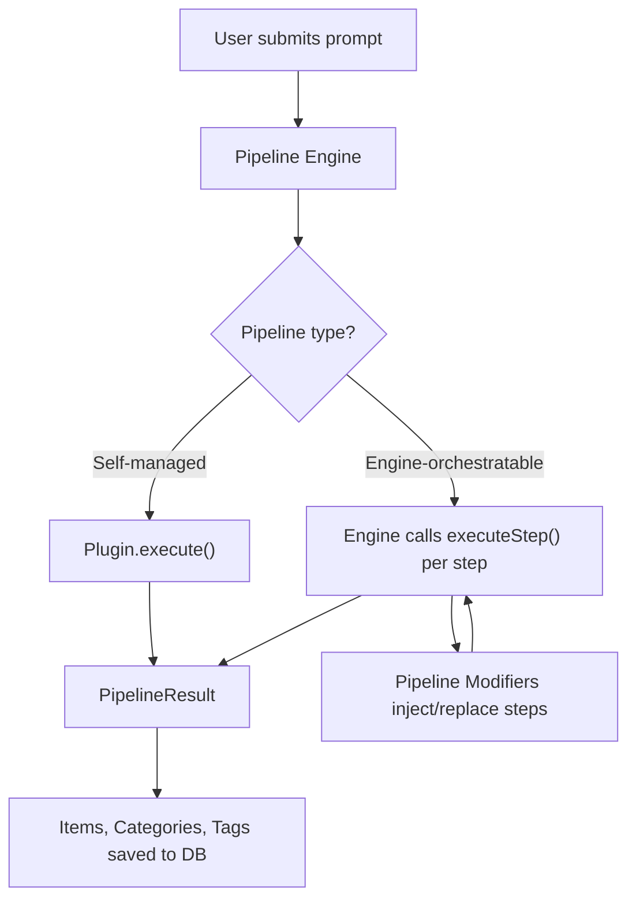
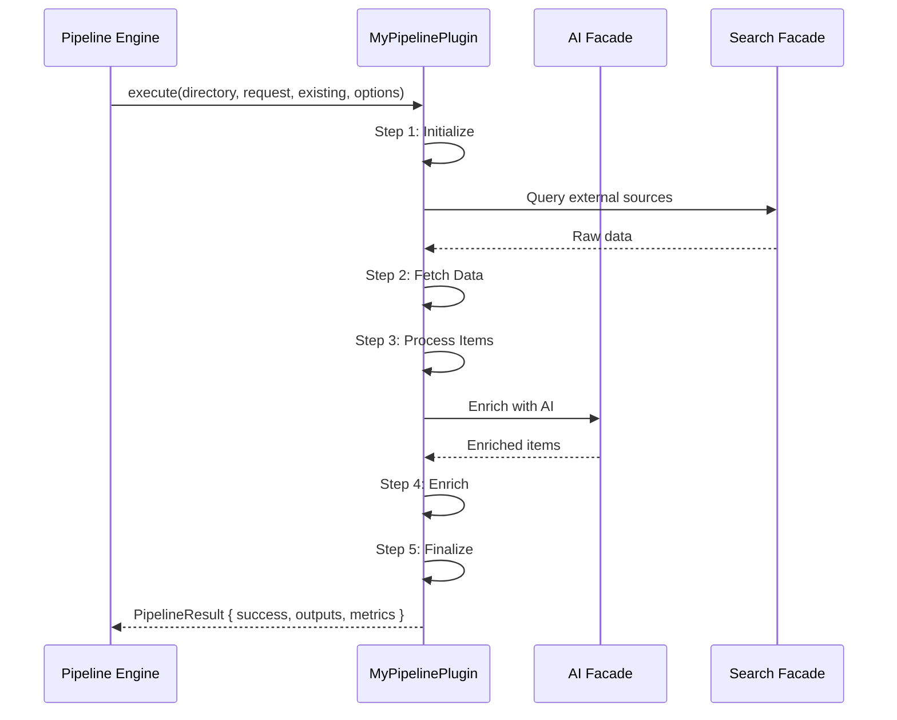
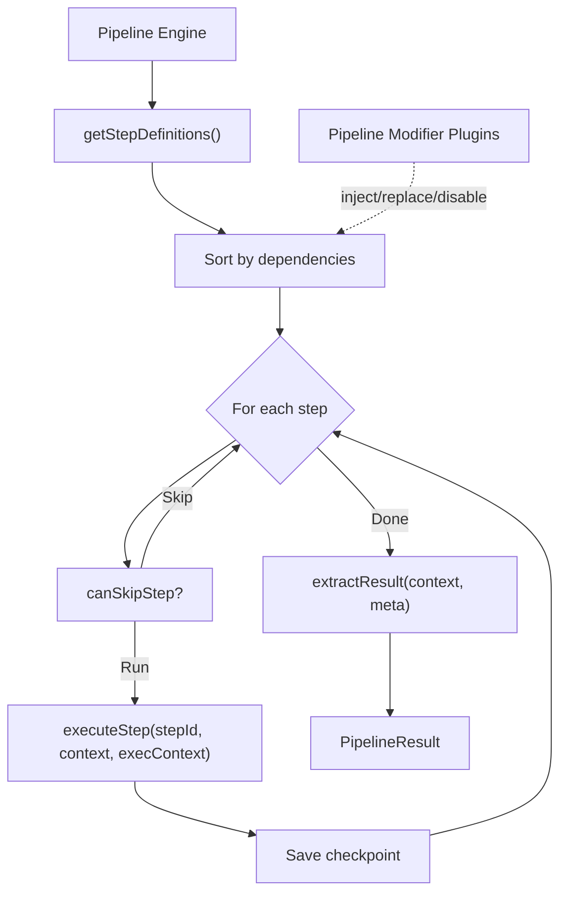
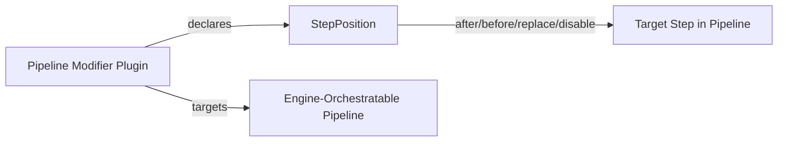

# Creating a Pipeline Plugin

Pipeline plugins are the most complex and powerful category in the Ever Works plugin system. They orchestrate the entire directory generation process -- transforming a user prompt into a structured collection of items, categories, tags, and more.

This guide covers three ways to work with pipelines:

1. **Self-Managed Pipeline** -- Your plugin owns the entire execution loop
2. **Engine-Orchestratable Pipeline** -- The platform engine runs each step individually
3. **Pipeline Modifier** -- Inject, replace, or disable steps in an existing pipeline

## How Pipeline Plugins Fit In



:::info Two Flavors of Pipeline
**Engine-orchestratable** pipelines (like Standard Pipeline) let the platform manage progress, checkpoints, and abort. They also support **pipeline modifier plugins** that can inject or replace individual steps.

**Self-managed** pipelines (like Agent Pipeline) own the entire execution loop. They have more flexibility but the platform has less control over individual steps.
:::

## Prerequisites

Before building a pipeline plugin, make sure you are familiar with:

- The [plugin system architecture](./architecture)
- The [general plugin creation guide](./creating-a-plugin)
- TypeScript generics (pipeline plugins are generic over step IDs)

You will need the `@ever-works/plugin` package, which provides all interfaces and base classes:

```bash
pnpm add -D @ever-works/plugin@workspace:*
```

## Core Interfaces

### IPipelinePlugin

Every pipeline plugin implements `IPipelinePlugin<TStepId>`. The type parameter `TStepId` is a union of your step ID strings:

```typescript
interface IPipelinePlugin<TStepId extends string = string> extends IPlugin {
	// Required: define your steps
	getStepDefinitions(): readonly PipelineStepDefinition<TStepId>[];

	// Required: run the full pipeline
	execute(
		directory: DirectoryReference,
		request: GenerationRequest,
		existing: ExistingItems,
		options?: PipelineExecutionOptions,
		onProgress?: PipelineProgressCallback
	): Promise<PipelineResult>;

	// Optional: engine-orchestrated execution
	executeStep?(
		stepId: TStepId | string,
		context: IPipelineContext,
		execContext: StepExecutionContext,
		options?: StepExecutionOptions,
		onProgress?: StepProgressCallback
	): Promise<IPipelineContext>;

	// Optional: step registration for engine orchestration
	isValidStepId?(stepId: string): stepId is TStepId;
	registerStepExecutor?(stepId: TStepId, executor: IBuiltInStepExecutor): void;

	// Optional: context lifecycle hooks
	createContext?(directory, request, existing): IPipelineContext;
	contextToSnapshot?(context: IPipelineContext): unknown;
	contextFromSnapshot?(snapshot: unknown): IPipelineContext;
	extractResult?(context, meta): PipelineResult;
	isCheckpointViable?(snapshot: unknown, completedSteps: string[]): boolean;
	canSkipStep?(stepId: string, context: IPipelineContext): boolean;

	// Optional: lifecycle
	cancel?(): Promise<void>;
	getState?(): PipelineState | null;
}
```

### PipelineStepDefinition

Each step in your pipeline is described by a `PipelineStepDefinition`:

```typescript
interface PipelineStepDefinition<TStepId extends string = string> {
	readonly id: TStepId;
	readonly name: string;
	readonly description?: string;
	readonly position: StepPosition<TStepId>;
	readonly dependencies?: readonly StepDependency<TStepId>[];
	readonly optional?: boolean;
	readonly parallelizable?: boolean;
	readonly settingsSchema?: JsonSchema;
	readonly provides?: readonly string[];
	readonly requires?: readonly string[];
	readonly estimatedDuration?: number; // seconds
}
```

### PipelineOutputs and PipelineResult

Every pipeline ultimately produces a `PipelineResult` containing `PipelineOutputs`:

```typescript
interface PipelineOutputs {
	readonly items: readonly ItemData[];
	readonly categories: readonly Category[];
	readonly tags: readonly Tag[];
	readonly collections: readonly Collection[];
	readonly brands: readonly Brand[];
	readonly domainAnalysis?: DomainAnalysis;
	readonly extra?: Readonly<Record<string, unknown>>;
}

interface PipelineResult {
	readonly success: boolean;
	readonly outputs: PipelineOutputs;
	readonly metrics?: PipelineMetrics;
	readonly duration: number;
	readonly stepsCompleted: number;
	readonly totalSteps: number;
	readonly error?: Error | string;
	readonly failedStep?: string;
	readonly state?: PipelineState;
	readonly warnings?: readonly string[];
}
```

---

## Creating a Self-Managed Pipeline Plugin

Self-managed pipelines are the simpler of the two types. Your plugin controls the entire execution loop, deciding when and how each step runs. This is the recommended approach for custom pipelines.

### 1. Define Step IDs

Create a union type of all step IDs and export the constant array:

```typescript title="src/types.ts"
export type MyPipelineStepId = 'initialize' | 'fetch-data' | 'process-items' | 'enrich' | 'finalize';

export const MY_STEP_IDS: readonly MyPipelineStepId[] = [
	'initialize',
	'fetch-data',
	'process-items',
	'enrich',
	'finalize'
] as const;
```

### 2. Define Steps

```typescript title="src/steps.ts"
import type { PipelineStepDefinition } from '@ever-works/plugin';
import type { MyPipelineStepId } from './types.js';

export const STEP_DEFINITIONS: readonly PipelineStepDefinition<MyPipelineStepId>[] = [
	{
		id: 'initialize',
		name: 'Initialize',
		description: 'Load configuration and existing data',
		position: { type: 'first' },
		dependencies: [],
		optional: false,
		parallelizable: false,
		estimatedDuration: 2
	},
	{
		id: 'fetch-data',
		name: 'Fetch Data',
		description: 'Retrieve data from external sources',
		position: { type: 'after', stepId: 'initialize' },
		dependencies: [{ stepId: 'initialize', required: true }],
		provides: ['rawData'],
		requires: [],
		optional: false,
		parallelizable: false,
		estimatedDuration: 30
	},
	{
		id: 'process-items',
		name: 'Process Items',
		description: 'Transform raw data into structured items',
		position: { type: 'after', stepId: 'fetch-data' },
		dependencies: [{ stepId: 'fetch-data', required: true }],
		provides: ['processedItems'],
		requires: ['rawData'],
		optional: false,
		parallelizable: true,
		estimatedDuration: 20
	},
	{
		id: 'enrich',
		name: 'Enrich Items',
		description: 'Add categories, tags, and metadata',
		position: { type: 'after', stepId: 'process-items' },
		dependencies: [{ stepId: 'process-items', required: true }],
		provides: ['enrichedItems'],
		requires: ['processedItems'],
		optional: false,
		parallelizable: false,
		estimatedDuration: 15
	},
	{
		id: 'finalize',
		name: 'Finalize',
		description: 'Clean up and prepare final output',
		position: { type: 'last' },
		dependencies: [{ stepId: 'enrich', required: true }],
		optional: false,
		parallelizable: false,
		estimatedDuration: 2
	}
];
```

### 3. Implement the Plugin

```typescript title="src/my-pipeline.plugin.ts"
import type {
	IPlugin,
	IPipelinePlugin,
	PluginContext,
	PluginCategory,
	PluginManifest,
	PluginHealthCheck,
	JsonSchema,
	PipelineStepDefinition,
	PipelineState,
	PipelineExecutionOptions,
	PipelineProgressCallback,
	PipelineResult,
	DirectoryReference,
	GenerationRequest,
	ExistingItems,
	StepStatus,
	MutableItemData
} from '@ever-works/plugin';
import { buildSuccessPipelineResult, collectMetadataFromItems } from '@ever-works/plugin';

import type { MyPipelineStepId } from './types.js';
import { MY_STEP_IDS } from './types.js';
import { STEP_DEFINITIONS } from './steps.js';

export class MyPipelinePlugin implements IPlugin, IPipelinePlugin<MyPipelineStepId> {
	readonly id = 'my-pipeline';
	readonly name = 'My Pipeline';
	readonly version = '1.0.0';
	readonly category: PluginCategory = 'pipeline';
	readonly capabilities = ['pipeline'] as const;

	readonly settingsSchema: JsonSchema = {
		type: 'object',
		properties: {
			maxItems: {
				type: 'integer',
				title: 'Max Items',
				description: 'Maximum number of items to generate',
				default: 50,
				minimum: 1,
				maximum: 500
			}
		}
	};

	private context: PluginContext | null = null;
	private state: PipelineState<MyPipelineStepId> | null = null;
	private abortController: AbortController | null = null;

	// ── IPlugin lifecycle ─────────────────────────────────────

	async onLoad(context: PluginContext): Promise<void> {
		this.context = context;
		context.logger.log('My Pipeline plugin loaded');
	}

	async onUnload(): Promise<void> {
		await this.cancel();
		this.context = null;
	}

	async healthCheck(): Promise<PluginHealthCheck> {
		return {
			status: 'healthy',
			message: 'My Pipeline plugin is ready',
			checkedAt: Date.now()
		};
	}

	getManifest(): PluginManifest {
		return {
			id: this.id,
			name: this.name,
			version: this.version,
			description: 'Custom pipeline for generating directory items',
			category: this.category,
			capabilities: [...this.capabilities],
			author: { name: 'Your Name' },
			license: 'MIT',
			builtIn: true,
			autoEnable: false,
			visibility: 'public',
			selectableProviderCategories: ['ai-provider', 'search', 'screenshot']
		};
	}

	// ── IPipelinePlugin ───────────────────────────────────────

	getStepDefinitions(): readonly PipelineStepDefinition<MyPipelineStepId>[] {
		return STEP_DEFINITIONS;
	}

	async execute(
		directory: DirectoryReference,
		request: GenerationRequest,
		existing: ExistingItems,
		options?: PipelineExecutionOptions,
		onProgress?: PipelineProgressCallback
	): Promise<PipelineResult> {
		const startTime = Date.now();
		this.abortController = new AbortController();
		const signal = options?.signal ?? this.abortController.signal;
		const logger = this.context?.logger ?? console;
		const execContext = options?.execContext;

		if (!execContext) {
			return this.buildErrorResult(new Error('Execution context is required'), startTime);
		}

		try {
			// ── Step 1: Initialize ────────────────────────────
			this.reportStep(onProgress, 0, 'Initialize');
			logger.log('Initializing pipeline...');

			if (signal.aborted) return this.buildCancelledResult(startTime);

			// ── Step 2: Fetch Data ────────────────────────────
			this.reportStep(onProgress, 1, 'Fetch Data');
			const rawItems = await this.fetchData(execContext, directory, request, signal);

			if (signal.aborted) return this.buildCancelledResult(startTime);

			// ── Step 3: Process Items ─────────────────────────
			this.reportStep(onProgress, 2, 'Process Items');
			const processedItems = await this.processItems(rawItems);

			if (signal.aborted) return this.buildCancelledResult(startTime);

			// ── Step 4: Enrich ────────────────────────────────
			this.reportStep(onProgress, 3, 'Enrich Items');
			const enrichedItems = await this.enrichItems(processedItems, execContext, directory);

			if (signal.aborted) return this.buildCancelledResult(startTime);

			// ── Step 5: Finalize ──────────────────────────────
			this.reportStep(onProgress, 4, 'Finalize');
			const metadata = collectMetadataFromItems(enrichedItems);

			// Build success result
			const duration = Date.now() - startTime;
			return buildSuccessPipelineResult(
				{
					items: enrichedItems,
					categories: metadata.categories,
					tags: metadata.tags,
					brands: metadata.brands,
					collections: metadata.collections
				},
				{
					duration,
					stepsCompleted: MY_STEP_IDS.length,
					totalSteps: MY_STEP_IDS.length
				}
			);
		} catch (error) {
			const err = error instanceof Error ? error : new Error(String(error));
			logger.error(`Pipeline failed: ${err.message}`);
			return this.buildErrorResult(err, startTime);
		}
	}

	async cancel(): Promise<void> {
		this.abortController?.abort();
	}

	getState(): PipelineState<MyPipelineStepId> | null {
		return this.state;
	}

	// ── Private helpers ───────────────────────────────────────

	private reportStep(onProgress: PipelineProgressCallback | undefined, stepIndex: number, stepName: string): void {
		const totalSteps = MY_STEP_IDS.length;
		const percent = Math.round((stepIndex / totalSteps) * 100);
		onProgress?.({
			percent,
			currentStepIndex: stepIndex,
			totalSteps,
			currentStepName: stepName
		});
	}

	private async fetchData(
		execContext: NonNullable<PipelineExecutionOptions['execContext']>,
		directory: DirectoryReference,
		request: GenerationRequest,
		signal: AbortSignal
	): Promise<MutableItemData[]> {
		// Your data fetching logic here
		return [];
	}

	private async processItems(rawItems: MutableItemData[]): Promise<MutableItemData[]> {
		// Your processing logic here
		return rawItems;
	}

	private async enrichItems(
		items: MutableItemData[],
		execContext: NonNullable<PipelineExecutionOptions['execContext']>,
		directory: DirectoryReference
	): Promise<MutableItemData[]> {
		// Your enrichment logic here
		return items;
	}

	private buildErrorResult(error: Error, startTime: number): PipelineResult {
		return {
			success: false,
			outputs: {
				items: [],
				categories: [],
				tags: [],
				collections: [],
				brands: []
			},
			duration: Date.now() - startTime,
			stepsCompleted: 0,
			totalSteps: MY_STEP_IDS.length,
			error
		};
	}

	private buildCancelledResult(startTime: number): PipelineResult {
		return {
			success: false,
			outputs: {
				items: [],
				categories: [],
				tags: [],
				collections: [],
				brands: []
			},
			duration: Date.now() - startTime,
			stepsCompleted: 0,
			totalSteps: MY_STEP_IDS.length,
			error: 'Pipeline cancelled'
		};
	}
}

export default MyPipelinePlugin;
```

### 4. Pipeline Execution Flow



### Key Patterns for Self-Managed Pipelines

**Check for cancellation between steps.** The `signal` from `PipelineExecutionOptions` lets users cancel a long-running generation. Check `signal.aborted` between steps:

```typescript
if (signal.aborted) return this.buildCancelledResult(startTime);
```

**Report progress.** The `onProgress` callback updates the UI in real time:

```typescript
onProgress?.({
	percent: 60,
	currentStepIndex: 2,
	totalSteps: 5,
	currentStepName: 'Process Items',
	message: 'Processing 47 items...',
	itemsProcessed: 47
});
```

**Use the execution context.** The `options.execContext` provides access to all facades (AI, search, screenshot, content extraction) and is the only way to interact with other plugins:

```typescript
const execContext = options?.execContext;
const providerConfig = await execContext.aiFacade.getProviderConfig(facadeOptions);
const searchResults = await execContext.searchFacade.search(query, facadeOptions);
```

---

## Creating an Engine-Orchestratable Pipeline Plugin

Engine-orchestratable pipelines delegate step execution to the platform engine. The engine calls `executeStep()` for each step, manages progress and checkpoints, and allows pipeline modifier plugins to inject or replace steps.

This approach is more complex but provides checkpoint resume, step-level progress tracking, and extensibility through modifiers.

### Architecture



### Implementation

The Standard Pipeline is the canonical example. Here is a simplified engine-orchestratable pipeline:

```typescript title="src/orchestrated-pipeline.plugin.ts"
import type {
	IPlugin,
	IPipelinePlugin,
	IPipelineContext,
	PluginContext,
	PluginCategory,
	PluginManifest,
	PluginHealthCheck,
	JsonSchema,
	PipelineStepDefinition,
	PipelineState,
	PipelineExecutionOptions,
	PipelineProgressCallback,
	PipelineResult,
	StepExecutionOptions,
	StepProgressCallback,
	StepExecutionContext,
	IBuiltInStepExecutor,
	DirectoryReference,
	GenerationRequest,
	ExistingItems
} from '@ever-works/plugin';

type MyStepId = 'analyze' | 'generate' | 'validate' | 'output';

export class OrchestratedPipelinePlugin implements IPipelinePlugin<MyStepId> {
	readonly id = 'orchestrated-pipeline';
	readonly name = 'Orchestrated Pipeline';
	readonly version = '1.0.0';
	readonly category: PluginCategory = 'pipeline';
	readonly capabilities = ['pipeline'] as const;
	readonly settingsSchema: JsonSchema = { type: 'object', properties: {} };

	private static readonly STEPS: PipelineStepDefinition<MyStepId>[] = [
		{
			id: 'analyze',
			name: 'Analyze Prompt',
			position: { type: 'first' },
			dependencies: [],
			provides: ['analysis'],
			requires: [],
			estimatedDuration: 5
		},
		{
			id: 'generate',
			name: 'Generate Items',
			position: { type: 'after', stepId: 'analyze' },
			dependencies: [{ stepId: 'analyze', required: true }],
			provides: ['rawItems'],
			requires: ['analysis'],
			estimatedDuration: 30
		},
		{
			id: 'validate',
			name: 'Validate Items',
			position: { type: 'after', stepId: 'generate' },
			dependencies: [{ stepId: 'generate', required: true }],
			provides: ['validatedItems'],
			requires: ['rawItems'],
			optional: true,
			estimatedDuration: 10
		},
		{
			id: 'output',
			name: 'Prepare Output',
			position: { type: 'last' },
			dependencies: [{ stepId: 'validate', required: false }],
			provides: ['finalItems'],
			requires: ['rawItems'],
			estimatedDuration: 5
		}
	];

	private stepExecutors = new Map<MyStepId, IBuiltInStepExecutor>();
	private context?: PluginContext;

	// ── Step definitions ──────────────────────────────────────

	getStepDefinitions(): PipelineStepDefinition<MyStepId>[] {
		return [...OrchestratedPipelinePlugin.STEPS];
	}

	isValidStepId(stepId: string): stepId is MyStepId {
		return OrchestratedPipelinePlugin.STEPS.some((s) => s.id === stepId);
	}

	// ── Step executor registration ────────────────────────────

	registerStepExecutor(stepId: MyStepId, executor: IBuiltInStepExecutor): void {
		this.stepExecutors.set(stepId, executor);
	}

	// ── Engine-orchestrated step execution ─────────────────────

	async executeStep(
		stepId: MyStepId | string,
		context: IPipelineContext,
		execContext: StepExecutionContext,
		options?: StepExecutionOptions,
		onProgress?: StepProgressCallback
	): Promise<IPipelineContext> {
		const executor = this.stepExecutors.get(stepId as MyStepId);
		if (!executor) {
			throw new Error(`No executor registered for step "${stepId}"`);
		}

		onProgress?.({ percent: 0, message: `Starting ${executor.name}` });

		if (options?.signal?.aborted) {
			throw new Error(`Step "${stepId}" cancelled before execution`);
		}

		const result = await executor.run(context, execContext);
		onProgress?.({ percent: 100, message: `Completed ${executor.name}` });
		return result;
	}

	// ── Full execute (throws -- engine should use executeStep) ─

	async execute(
		_directory: DirectoryReference,
		_request: GenerationRequest,
		_existing: ExistingItems,
		_options?: PipelineExecutionOptions,
		_onProgress?: PipelineProgressCallback
	): Promise<PipelineResult> {
		throw new Error(
			'This pipeline is engine-orchestrated. ' + 'Use the pipeline engine to orchestrate step execution.'
		);
	}

	// ── Context lifecycle hooks ───────────────────────────────

	createContext(
		directory: DirectoryReference,
		request: GenerationRequest,
		existing: ExistingItems
	): IPipelineContext {
		return {
			directory,
			request,
			shouldStop: false,
			warnings: []
		};
	}

	extractResult(
		context: IPipelineContext,
		meta: { duration: number; stepsCompleted: number; totalSteps: number }
	): PipelineResult {
		const ctx = context as Record<string, unknown>;
		const items = (ctx.finalItems ?? ctx.rawItems ?? []) as readonly any[];
		return {
			success: items.length > 0,
			outputs: {
				items,
				categories: [],
				tags: [],
				collections: [],
				brands: []
			},
			duration: meta.duration,
			stepsCompleted: meta.stepsCompleted,
			totalSteps: meta.totalSteps
		};
	}

	// ── IPlugin lifecycle ─────────────────────────────────────

	async onLoad(context: PluginContext): Promise<void> {
		this.context = context;
		this.registerBuiltInExecutors();
		context.logger.log('Orchestrated Pipeline loaded');
	}

	async onUnload(): Promise<void> {
		this.stepExecutors.clear();
	}

	async healthCheck(): Promise<PluginHealthCheck> {
		return {
			status: this.stepExecutors.size === OrchestratedPipelinePlugin.STEPS.length ? 'healthy' : 'degraded',
			message: `${this.stepExecutors.size} step executors registered`,
			checkedAt: Date.now()
		};
	}

	getManifest(): PluginManifest {
		return {
			id: this.id,
			name: this.name,
			version: this.version,
			description: 'Engine-orchestrated pipeline with checkpoint support',
			category: this.category,
			capabilities: [...this.capabilities],
			author: { name: 'Your Name' },
			license: 'MIT',
			builtIn: true,
			autoEnable: false,
			visibility: 'public'
		};
	}

	// ── Built-in step executors ───────────────────────────────

	private registerBuiltInExecutors(): void {
		// Register your IBuiltInStepExecutor implementations
		// this.registerStepExecutor('analyze', new AnalyzeStep());
		// this.registerStepExecutor('generate', new GenerateStep());
		// this.registerStepExecutor('validate', new ValidateStep());
		// this.registerStepExecutor('output', new OutputStep());
	}
}
```

### Implementing IBuiltInStepExecutor

Each step in an engine-orchestratable pipeline is an `IBuiltInStepExecutor`:

```typescript title="src/steps/analyze.step.ts"
import type { IBuiltInStepExecutor, IPipelineContext, StepExecutionContext } from '@ever-works/plugin';

export class AnalyzeStep implements IBuiltInStepExecutor {
	readonly name = 'Analyze Prompt';

	async run(context: IPipelineContext, execContext: StepExecutionContext): Promise<IPipelineContext> {
		const { aiFacade } = execContext;
		const userId = execContext.user?.id ?? context.directory.user?.id;

		if (!userId) {
			throw new Error('User ID is required for AI operations');
		}

		// Use the AI facade for structured output
		const analysis = await aiFacade.askJson(
			'Analyze this prompt and identify the domain, key topics, and item types.',
			context.request.prompt ?? '',
			{ userId, directoryId: context.directory.id }
		);

		// Store results on the context for downstream steps
		return {
			...context,
			analysis
		} as IPipelineContext;
	}
}
```

### Context Lifecycle Hooks

Engine-orchestratable pipelines can optionally implement context lifecycle hooks for checkpoint support:

| Hook                    | Purpose                                                                         |
| ----------------------- | ------------------------------------------------------------------------------- |
| `createContext()`       | Create the initial pipeline context from directory, request, and existing items |
| `contextToSnapshot()`   | Serialize the context for checkpoint storage                                    |
| `contextFromSnapshot()` | Deserialize a checkpoint back into a live context                               |
| `extractResult()`       | Convert the final context into a `PipelineResult`                               |
| `isCheckpointViable()`  | Determine whether a saved checkpoint is worth resuming                          |
| `canSkipStep()`         | Check if a step can be skipped because its data already exists                  |

:::tip Checkpoint Resume
When a pipeline fails mid-execution, the engine saves a checkpoint. On retry, it calls `contextFromSnapshot()` to restore the context and `isCheckpointViable()` to decide whether to resume or start fresh. Steps that already ran are skipped via `canSkipStep()`.
:::

### provides / requires: Data Flow Between Steps

The `provides` and `requires` arrays on step definitions declare the data contract between steps:

```typescript
{
    id: 'generate',
    provides: ['rawItems'],       // This step produces rawItems
    requires: ['analysis'],        // This step needs analysis data
    dependencies: [{ stepId: 'analyze', required: true }]
}
```

The engine uses these declarations to:

- Validate that all required data is available before running a step
- Determine if a step can be skipped (all `provides` keys already exist)
- Build the dependency graph for parallel execution

---

## Creating a Pipeline Modifier Plugin

Pipeline modifiers do not create new pipelines. They add, replace, or disable steps in an existing engine-orchestratable pipeline. Use the `BasePipelineStep` abstract class from `@ever-works/plugin/abstract`.

### Architecture



### Implementation

```typescript title="src/my-modifier.plugin.ts"
import { BasePipelineStep } from '@ever-works/plugin/abstract';
import type {
	IPipelineContext,
	StepExecutionOptions,
	StepProgressCallback,
	StepPosition,
	PluginManifest,
	PluginHealthCheck
} from '@ever-works/plugin';

export class SentimentAnalysisStep extends BasePipelineStep {
	// ── IPlugin properties ────────────────────────────────────
	readonly id = 'sentiment-analysis-modifier';
	readonly name = 'Sentiment Analysis';
	readonly version = '1.0.0';

	// ── Step configuration ────────────────────────────────────
	readonly stepId = 'sentiment-analysis';
	readonly stepName = 'Sentiment Analysis';
	readonly stepDescription = 'Analyzes sentiment of item descriptions';

	// Position: run after the data aggregation step
	readonly stepPosition: StepPosition = BasePipelineStep.after('deduplication-and-data-aggregation');

	// Target the standard pipeline (use ['*'] for all pipelines)
	readonly targetPipelines = ['standard-pipeline'] as const;

	// Data flow declarations
	readonly provides = ['sentimentScores'] as const;
	readonly requires = ['aggregatedItems'] as const;

	// Step is optional -- pipeline continues if it fails
	readonly optional = true;
	readonly estimatedDuration = 15;

	// ── Step execution ────────────────────────────────────────

	async execute(
		context: IPipelineContext,
		options?: StepExecutionOptions,
		onProgress?: StepProgressCallback
	): Promise<IPipelineContext> {
		// Check for abort before starting
		if (this.shouldAbort(context, options)) {
			return context;
		}

		const ctx = context as Record<string, unknown>;
		const items = (ctx.aggregatedItems ?? []) as Array<{
			name: string;
			description?: string;
		}>;

		this.reportProgress(onProgress, 0, 'Starting sentiment analysis');

		const sentimentScores: Record<string, number> = {};

		for (let i = 0; i < items.length; i++) {
			// Check for abort during processing
			if (this.shouldAbort(context, options)) {
				break;
			}

			const item = items[i];
			sentimentScores[item.name] = await this.analyzeSentiment(item.description ?? '');

			// Report progress
			this.reportProgress(
				onProgress,
				Math.round(((i + 1) / items.length) * 100),
				`Analyzed ${i + 1} of ${items.length} items`,
				i + 1,
				items.length
			);
		}

		// Store results on the context
		return {
			...context,
			sentimentScores
		} as IPipelineContext;
	}

	// ── IPlugin lifecycle ─────────────────────────────────────

	getManifest(): PluginManifest {
		return {
			id: this.id,
			name: this.name,
			version: this.version,
			description: 'Adds sentiment analysis to the generation pipeline',
			category: this.category,
			capabilities: [...this.capabilities],
			author: { name: 'Your Name' },
			license: 'MIT',
			builtIn: false,
			autoEnable: false,
			visibility: 'public'
		};
	}

	async healthCheck(): Promise<PluginHealthCheck> {
		return {
			status: 'healthy',
			message: 'Sentiment analysis step ready',
			checkedAt: Date.now()
		};
	}

	// ── Private helpers ───────────────────────────────────────

	private async analyzeSentiment(text: string): Promise<number> {
		// Your sentiment analysis logic
		return 0.5;
	}
}

export default SentimentAnalysisStep;
```

### Step Positioning

`BasePipelineStep` provides static helper methods for positioning:

| Method                             | Effect                          | Example                       |
| ---------------------------------- | ------------------------------- | ----------------------------- |
| `BasePipelineStep.after(stepId)`   | Insert after the named step     | `after('content-filtering')`  |
| `BasePipelineStep.before(stepId)`  | Insert before the named step    | `before('items-extraction')`  |
| `BasePipelineStep.replace(stepId)` | Replace the named step entirely | `replace('badge-processing')` |
| `BasePipelineStep.first()`         | Insert as the first step        | Used for setup steps          |
| `BasePipelineStep.last()`          | Insert as the last step         | Used for cleanup steps        |

:::warning Replacing Steps
When using `replace()`, your step must produce the same `provides` data as the step it replaces, or downstream steps will fail with missing data errors.
:::

### Targeting Pipelines

The `targetPipelines` property controls which pipelines this modifier applies to:

```typescript
// Target a specific pipeline
readonly targetPipelines = ['standard-pipeline'] as const;

// Target multiple pipelines
readonly targetPipelines = ['standard-pipeline', 'my-custom-pipeline'] as const;

// Target ALL engine-orchestratable pipelines
readonly targetPipelines = ['*'] as const;
```

:::note
Pipeline modifiers only work with engine-orchestratable pipelines (those that implement `executeStep` and `registerStepExecutor`). Self-managed pipelines cannot be modified.
:::

### Progress and Abort Helpers

`BasePipelineStep` provides built-in helpers:

```typescript
// Report progress (percent, message, itemsProcessed, totalItems)
this.reportProgress(onProgress, 50, 'Halfway done', 25, 50);

// Create a progress object without reporting it
const progress = this.createProgress(75, 'Almost done', 37, 50);

// Check if the pipeline should abort
if (this.shouldAbort(context, options)) {
	return context; // Return context unchanged
}
```

### Validation and Rollback

Override `validate()` to check preconditions and `rollback()` to clean up on failure:

```typescript
async validate(context: IPipelineContext): Promise<{ valid: boolean; error?: string }> {
    // The default implementation checks all `requires` keys exist
    const baseResult = await super.validate(context);
    if (!baseResult.valid) return baseResult;

    // Add custom validation
    const ctx = context as Record<string, unknown>;
    const items = ctx.aggregatedItems as unknown[];
    if (!items || items.length === 0) {
        return { valid: false, error: 'No items to analyze' };
    }

    return { valid: true };
}

async rollback(context: IPipelineContext, error: Error): Promise<void> {
    // Clean up any partial state if needed
    this.context?.logger.warn(`Rolling back: ${error.message}`);
}
```

---

## Adding Form Schema Provider

Pipeline plugins often implement `IFormSchemaProvider` so their configuration fields appear in the generation UI. This lets users configure per-generation options like target items, search limits, and feature flags.

### Implementation

```typescript title="src/form-schema.ts"
import type { FormFieldDefinition, FormFieldGroup, ValidationResult } from '@ever-works/plugin';

export function getFormFields(): FormFieldDefinition[] {
	return [
		{
			name: 'target_items',
			type: 'number',
			label: 'Target Items',
			description: 'Target number of items to generate',
			defaultValue: 50,
			validation: { min: 1, max: 500 },
			group: 'volume'
		},
		{
			name: 'capture_screenshots',
			type: 'boolean',
			label: 'Capture Screenshots',
			description: 'Take screenshots for generated items',
			defaultValue: false,
			group: 'features'
		},
		{
			name: 'quality_mode',
			type: 'select',
			label: 'Quality Mode',
			description: 'Balance between speed and quality',
			options: [
				{ value: 'fast', label: 'Fast' },
				{ value: 'balanced', label: 'Balanced' },
				{ value: 'thorough', label: 'Thorough' }
			],
			defaultValue: 'balanced',
			group: 'features'
		}
	];
}

export function getFormGroups(): FormFieldGroup[] {
	return [
		{
			name: 'volume',
			title: 'Generation Volume',
			description: 'Control how many items to generate',
			order: 0
		},
		{
			name: 'features',
			title: 'Features',
			description: 'Enable or disable generation features',
			order: 1,
			collapsible: true,
			collapsed: true
		}
	];
}

export function validateFormInput(values: Record<string, unknown>): ValidationResult {
	const errors: Array<{ path: string; message: string }> = [];

	const targetItems = values.target_items;
	if (targetItems !== undefined && targetItems !== null) {
		const num = Number(targetItems);
		if (isNaN(num) || num < 1 || num > 500) {
			errors.push({
				path: 'target_items',
				message: 'target_items must be between 1 and 500'
			});
		}
	}

	return errors.length > 0 ? { valid: false, errors } : { valid: true };
}
```

Then add `IFormSchemaProvider` to your plugin class:

```typescript
import type { IFormSchemaProvider, FormFieldDefinition, FormFieldGroup, ValidationResult } from '@ever-works/plugin';
import { getFormFields, getFormGroups, validateFormInput } from './form-schema.js';

export class MyPipelinePlugin implements IPlugin, IPipelinePlugin<MyStepId>, IFormSchemaProvider {
	readonly capabilities = ['pipeline', 'form-schema-provider'] as const;
	readonly handledConfigFields = ['*'] as const;

	getFormFields(): FormFieldDefinition[] {
		return getFormFields();
	}

	getFormGroups(): FormFieldGroup[] {
		return getFormGroups();
	}

	validateFormInput(values: Record<string, unknown>): ValidationResult {
		return validateFormInput(values);
	}

	getDefaultValues(): Record<string, unknown> {
		const defaults: Record<string, unknown> = {};
		for (const field of this.getFormFields()) {
			if (field.defaultValue !== undefined) {
				defaults[field.name] = field.defaultValue;
			}
		}
		return defaults;
	}
}
```

:::info handledConfigFields
Set `handledConfigFields` to `['*']` if your pipeline handles ALL configuration (replaces the standard form entirely). Set it to specific field names like `['max_search_queries']` if your plugin only handles a subset of configuration fields.
:::

---

## Writing Tests

Pipeline plugins use Vitest. Test both the step definitions and the execution logic.

### Testing Step Definitions

```typescript title="src/__tests__/my-pipeline.plugin.spec.ts"
import { describe, it, expect, beforeEach } from 'vitest';
import { MyPipelinePlugin } from '../my-pipeline.plugin.js';

describe('MyPipelinePlugin', () => {
	let plugin: MyPipelinePlugin;

	beforeEach(() => {
		plugin = new MyPipelinePlugin();
	});

	describe('step definitions', () => {
		it('should return all step definitions', () => {
			const steps = plugin.getStepDefinitions();
			expect(steps).toHaveLength(5);
			expect(steps.map((s) => s.id)).toEqual(['initialize', 'fetch-data', 'process-items', 'enrich', 'finalize']);
		});

		it('should have valid dependency chains', () => {
			const steps = plugin.getStepDefinitions();
			const stepIds = new Set(steps.map((s) => s.id));

			for (const step of steps) {
				for (const dep of step.dependencies ?? []) {
					expect(stepIds.has(dep.stepId)).toBe(true);
				}
			}
		});

		it('should have unique provides keys', () => {
			const steps = plugin.getStepDefinitions();
			const allProvides = steps.flatMap((s) => s.provides ?? []);
			const unique = new Set(allProvides);
			expect(allProvides.length).toBe(unique.size);
		});
	});

	describe('manifest', () => {
		it('should return valid manifest', () => {
			const manifest = plugin.getManifest();
			expect(manifest.id).toBe('my-pipeline');
			expect(manifest.category).toBe('pipeline');
			expect(manifest.capabilities).toContain('pipeline');
		});
	});

	describe('health check', () => {
		it('should report healthy', async () => {
			const health = await plugin.healthCheck();
			expect(health.status).toBe('healthy');
		});
	});
});
```

### Testing Pipeline Modifiers

```typescript title="src/__tests__/sentiment-step.spec.ts"
import { describe, it, expect, vi } from 'vitest';
import { SentimentAnalysisStep } from '../my-modifier.plugin.js';
import type { IPipelineContext } from '@ever-works/plugin';

describe('SentimentAnalysisStep', () => {
	it('should report correct step metadata', () => {
		const step = new SentimentAnalysisStep();
		expect(step.stepId).toBe('sentiment-analysis');
		expect(step.targetPipelines).toContain('standard-pipeline');
		expect(step.provides).toContain('sentimentScores');
		expect(step.requires).toContain('aggregatedItems');
	});

	it('should produce a valid step definition', () => {
		const step = new SentimentAnalysisStep();
		const def = step.getStepDefinition();
		expect(def.id).toBe('sentiment-analysis');
		expect(def.position).toEqual({ type: 'after', stepId: 'deduplication-and-data-aggregation' });
	});

	it('should process items and return sentimentScores', async () => {
		const step = new SentimentAnalysisStep();
		const context = {
			directory: { id: 'dir-1', name: 'Test', slug: 'test' },
			request: { prompt: 'test' },
			shouldStop: false,
			warnings: [],
			aggregatedItems: [
				{ name: 'Item 1', description: 'Great product' },
				{ name: 'Item 2', description: 'Terrible service' }
			]
		} as unknown as IPipelineContext;

		const onProgress = vi.fn();
		const result = await step.execute(context, {}, onProgress);

		expect(result).toHaveProperty('sentimentScores');
		expect(onProgress).toHaveBeenCalled();
	});

	it('should respect abort signal', async () => {
		const step = new SentimentAnalysisStep();
		const context = {
			directory: { id: 'dir-1', name: 'Test', slug: 'test' },
			request: { prompt: 'test' },
			shouldStop: true,
			warnings: [],
			aggregatedItems: [{ name: 'Item 1' }]
		} as unknown as IPipelineContext;

		const result = await step.execute(context);
		// Should return context unchanged when shouldStop is true
		expect(result).not.toHaveProperty('sentimentScores');
	});
});
```

### Testing Form Schema

```typescript title="src/__tests__/form-schema.spec.ts"
import { describe, it, expect } from 'vitest';
import { getFormFields, validateFormInput } from '../form-schema.js';

describe('Form Schema', () => {
	it('should return all form fields', () => {
		const fields = getFormFields();
		expect(fields.length).toBeGreaterThan(0);
		expect(fields.every((f) => f.name && f.type && f.label)).toBe(true);
	});

	it('should validate valid input', () => {
		const result = validateFormInput({ target_items: 50 });
		expect(result.valid).toBe(true);
	});

	it('should reject out-of-range values', () => {
		const result = validateFormInput({ target_items: 9999 });
		expect(result.valid).toBe(false);
		expect(result.errors).toBeDefined();
	});
});
```

---

## Build and Registration

### package.json

The `everworks.plugin` metadata in `package.json` is how the platform discovers your plugin:

```json
{
	"name": "@ever-works/my-pipeline-plugin",
	"version": "1.0.0",
	"description": "Custom pipeline plugin",
	"private": true,
	"type": "module",
	"main": "./dist/index.cjs",
	"module": "./dist/index.js",
	"types": "./dist/index.d.ts",
	"exports": {
		".": {
			"types": "./dist/index.d.ts",
			"import": "./dist/index.js",
			"require": "./dist/index.cjs"
		}
	},
	"scripts": {
		"build": "tsup",
		"dev": "tsup --watch",
		"type-check": "tsc --noEmit",
		"clean": "rm -rf dist",
		"test": "vitest run",
		"test:watch": "vitest"
	},
	"peerDependencies": {
		"@ever-works/plugin": "workspace:*"
	},
	"devDependencies": {
		"@ever-works/plugin": "workspace:*",
		"tsup": "^8.4.0",
		"typescript": "^5.7.3",
		"vitest": "^3.0.0"
	},
	"everworks": {
		"plugin": {
			"id": "my-pipeline",
			"name": "My Pipeline",
			"version": "1.0.0",
			"category": "pipeline",
			"capabilities": ["pipeline", "form-schema-provider"],
			"description": "Custom pipeline for directory generation",
			"author": {
				"name": "Your Name"
			},
			"license": "MIT",
			"builtIn": true,
			"autoEnable": false,
			"selectableProviderCategories": ["ai-provider", "search", "screenshot"]
		}
	}
}
```

### index.ts

Always provide both named and default exports:

```typescript title="src/index.ts"
export { MyPipelinePlugin } from './my-pipeline.plugin.js';
export { MyPipelinePlugin as default } from './my-pipeline.plugin.js';
```

:::warning
Use `.js` extensions in all import paths, even though the source files are `.ts`. This is required for ESM module resolution.
:::

### tsup.config.ts

```typescript title="tsup.config.ts"
import { defineConfig } from 'tsup';

export default defineConfig({
	entry: ['src/index.ts'],
	noExternal: ['@ever-works/plugin'],
	format: ['cjs', 'esm'],
	dts: true,
	clean: true,
	sourcemap: true,
	splitting: false,
	treeshake: true
});
```

### Build and Run

```bash
# Install dependencies
pnpm install

# Build your plugin
pnpm build --filter=@ever-works/my-pipeline-plugin

# Type check
pnpm type-check --filter=@ever-works/my-pipeline-plugin

# Run tests
pnpm test --filter=@ever-works/my-pipeline-plugin

# Start the API -- your plugin is auto-discovered
pnpm dev:api
```

The plugin is automatically discovered from `packages/plugins/my-pipeline/` when the API starts. No manual registration code is needed.

---

## Comparison: Which Approach to Choose

| Feature                 | Self-Managed          | Engine-Orchestratable        | Pipeline Modifier                |
| ----------------------- | --------------------- | ---------------------------- | -------------------------------- |
| **Complexity**          | Lower                 | Higher                       | Lowest                           |
| **Checkpoint resume**   | Manual                | Automatic                    | N/A (handled by target pipeline) |
| **Step-level progress** | Manual                | Automatic                    | Automatic                        |
| **Modifier support**    | No                    | Yes                          | N/A (is a modifier)              |
| **Full control**        | Yes                   | Partial                      | No                               |
| **Use case**            | Custom execution flow | Standard multi-step pipeline | Extend existing pipelines        |
| **Example**             | Agent Pipeline        | Standard Pipeline            | Custom enrichment step           |

---

## Checklist

Before submitting a pipeline plugin, verify:

- [ ] Plugin `id` in the class matches `id` in `package.json` `everworks.plugin.id`
- [ ] Both named and default exports in `index.ts`
- [ ] `.js` extensions in all import paths
- [ ] `getStepDefinitions()` returns all steps with valid dependency chains
- [ ] All `requires` keys are `provides`d by upstream steps
- [ ] Step `provides` keys are unique across the pipeline
- [ ] `execute()` checks `signal.aborted` between steps
- [ ] `execute()` reports progress via `onProgress` callback
- [ ] Error results include meaningful error messages
- [ ] Cancellation returns a proper `PipelineResult` (not an exception)
- [ ] `getManifest()` returns complete metadata with description
- [ ] `settingsSchema` marks sensitive fields with `x-secret: true`
- [ ] Form schema fields (if implementing `IFormSchemaProvider`) have validation
- [ ] `handledConfigFields` is set (`['*']` for full pipeline replacement)
- [ ] Tests cover step definitions, form schema validation, and execution
- [ ] Plugin builds with `pnpm build`
- [ ] Plugin passes type checking with `pnpm type-check`
