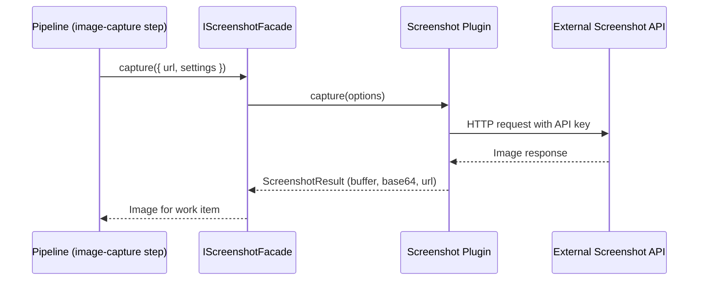

# Creating a Screenshot Plugin

Screenshot plugins capture website preview images for work items. When a work item has a source URL, the screenshot plugin generates a thumbnail that appears on the item card. This guide walks through creating a screenshot plugin from scratch, following the same patterns used by the built-in [ScreenshotOne](./screenshotone-plugin) and [Urlbox](./urlbox-plugin) plugins.

## How Screenshot Plugins Fit into the Platform

During work generation, the pipeline reaches the **image-capture** step. The `IScreenshotFacade` resolves which screenshot plugin to use, passes the item's URL along with the user's resolved settings, and receives back an image buffer or URL. That image becomes the item's preview thumbnail.



## Prerequisites

- Node.js >= 20
- pnpm (never npm or yarn)
- A screenshot API account (e.g., ScreenshotOne, Urlbox, Browserless, or your own service)
- Familiarity with the [plugin system architecture](./architecture)

## 1. Project Scaffolding

Create a new work under `packages/plugins/`:

```
packages/plugins/my-screenshot/
├── package.json
├── tsconfig.json
├── tsup.config.ts
├── vitest.config.ts
└── src/
    ├── index.ts
    ├── my-screenshot.plugin.ts
    └── __tests__/
        └── my-screenshot.plugin.spec.ts
```

### package.json

The `everworks.plugin` field is how the platform discovers your plugin at startup:

```json
{
	"name": "@ever-works/my-screenshot-plugin",
	"version": "1.0.0",
	"description": "My custom screenshot plugin for Ever Works",
	"private": true,
	"type": "module",
	"main": "./dist/index.cjs",
	"module": "./dist/index.js",
	"types": "./dist/index.d.ts",
	"exports": {
		".": {
			"types": "./dist/index.d.ts",
			"import": "./dist/index.js",
			"require": "./dist/index.cjs"
		}
	},
	"scripts": {
		"build": "tsup",
		"dev": "tsup --watch",
		"type-check": "tsc --noEmit",
		"clean": "rm -rf dist",
		"test": "vitest run --passWithNoTests",
		"test:watch": "vitest",
		"test:coverage": "vitest run --coverage"
	},
	"dependencies": {
		"my-screenshot-sdk": "^1.0.0"
	},
	"peerDependencies": {
		"@ever-works/plugin": "workspace:*"
	},
	"devDependencies": {
		"@ever-works/plugin": "workspace:*",
		"@types/node": "^22.0.0",
		"tsup": "^8.4.0",
		"typescript": "^5.7.3",
		"vitest": "^3.0.0"
	},
	"everworks": {
		"plugin": {
			"id": "my-screenshot",
			"name": "My Screenshot",
			"version": "1.0.0",
			"category": "screenshot",
			"capabilities": ["screenshot"],
			"description": "Capture website screenshots using My Screenshot API.",
			"author": {
				"name": "Your Name"
			},
			"license": "MIT",
			"builtIn": true,
			"autoEnable": false,
			"envVars": [
				{
					"name": "PLUGIN_MY_SCREENSHOT_API_KEY",
					"required": false,
					"secret": true,
					"description": "API key for My Screenshot (optional - can be set via admin/user settings)"
				},
				{
					"name": "PLUGIN_MY_SCREENSHOT_API_SECRET",
					"required": false,
					"secret": true,
					"description": "API secret for signed URLs (optional)"
				}
			]
		}
	}
}
```

Key fields in `everworks.plugin`:

| Field          | Description                                                                  |
| -------------- | ---------------------------------------------------------------------------- |
| `id`           | Unique plugin identifier. Must match the `id` property in your plugin class. |
| `category`     | Must be `"screenshot"` for screenshot plugins.                               |
| `capabilities` | Must include `"screenshot"`.                                                 |
| `builtIn`      | Set to `true` for plugins shipped with the platform.                         |
| `autoEnable`   | If `true`, the plugin is enabled by default for new installations.           |
| `envVars`      | Environment variables the plugin uses (for `.env.example` documentation).    |

### tsconfig.json

```json
{
	"compilerOptions": {
		"module": "ESNext",
		"moduleResolution": "bundler",
		"target": "ES2021",
		"types": ["node"],
		"strict": true,
		"strictNullChecks": true,
		"noImplicitAny": true,
		"declaration": true,
		"declarationMap": true,
		"sourceMap": true,
		"outDir": "./dist",
		"rootDir": "./src",
		"esModuleInterop": true,
		"skipLibCheck": true,
		"forceConsistentCasingInFileNames": true,
		"isolatedModules": true,
		"noEmit": true
	},
	"include": ["src/**/*"],
	"exclude": ["node_modules", "dist", "**/*.test.ts", "**/*.spec.ts"]
}
```

### tsup.config.ts

```typescript
import { defineConfig } from 'tsup';

export default defineConfig({
	entry: ['src/index.ts'],
	noExternal: ['@ever-works/plugin'],
	format: ['cjs', 'esm'],
	dts: true,
	clean: true,
	sourcemap: false,
	splitting: false,
	treeshake: true
});
```

### vitest.config.ts

```typescript
import { defineConfig } from 'vitest/config';

export default defineConfig({
	test: {
		globals: true,
		environment: 'node',
		include: ['src/**/*.{test,spec}.ts'],
		coverage: {
			reporter: ['text', 'json', 'html'],
			exclude: ['node_modules/', 'dist/']
		}
	}
});
```

### src/index.ts

Always export both named **and** default:

```typescript
export { MyScreenshotPlugin } from './my-screenshot.plugin.js';
export { MyScreenshotPlugin as default } from './my-screenshot.plugin.js';
```

:::warning
Use `.js` extensions in import paths, even though the source files are `.ts`. This is required for ESM module resolution.
:::

## 2. The IScreenshotPlugin Interface

Screenshot plugins implement two interfaces: `IPlugin` (base lifecycle) and `IScreenshotPlugin` (screenshot capabilities). Here is the full `IScreenshotPlugin` contract from `@ever-works/plugin`:

```typescript
interface IScreenshotPlugin extends IPlugin {
	/** Provider name for facade identification (e.g., 'ScreenshotOne', 'Urlbox') */
	readonly providerName: string;

	/** Capture a screenshot and return the image data */
	capture(options: ScreenshotOptions): Promise<ScreenshotResult>;

	/** Generate a screenshot URL without downloading the image (optional) */
	getScreenshotUrl?(options: ScreenshotOptions): Promise<string | null>;

	/** Check if the service is available (API key configured, etc.) */
	isAvailable(): Promise<boolean>;

	/** Validate API credentials (optional) */
	validateCredentials?(): Promise<ScreenshotValidationResult>;

	/** Return the list of supported image formats (optional) */
	getSupportedFormats?(): readonly ScreenshotFormat[];

	/** Return maximum supported viewport dimensions (optional) */
	getMaxDimensions?(): { width: number; height: number };
}
```

### ScreenshotOptions

Options passed to `capture()` and `getScreenshotUrl()`:

```typescript
interface ScreenshotOptions {
	readonly url: string; // URL to capture
	readonly viewportWidth?: number; // Viewport width in pixels
	readonly viewportHeight?: number; // Viewport height in pixels
	readonly format?: ScreenshotFormat; // 'png' | 'jpg' | 'jpeg' | 'webp'
	readonly fullPage?: boolean; // Capture the full scrollable page
	readonly delay?: number; // Delay in ms before capture
	readonly blockAds?: boolean; // Block advertisements
	readonly blockTrackers?: boolean; // Block tracking scripts
	readonly blockCookieBanners?: boolean; // Block cookie consent banners
	readonly cache?: boolean; // Enable caching
	readonly cacheTtl?: number; // Cache TTL in seconds
	readonly deviceScaleFactor?: number; // 1 = normal, 2 = retina
	readonly clip?: ScreenshotClip; // Crop to a region
	readonly waitForSelector?: string; // Wait for a CSS selector
	readonly waitForNavigation?: boolean; // Wait for navigation to complete
	readonly userAgent?: string; // Custom user agent
	readonly headers?: Record<string, string>; // Custom HTTP headers
	readonly cookies?: readonly ScreenshotCookie[]; // Cookies to set
	readonly settings?: PluginSettings; // Resolved plugin settings
}
```

:::info Settings are resolved at call time
The `settings` field on `ScreenshotOptions` is populated by the facade with the fully resolved settings for the current user and work. Your plugin should always read configuration from `options.settings`, never from a cached instance property.
:::

### ScreenshotResult

The return type from `capture()`:

```typescript
interface ScreenshotResult {
	readonly success: boolean; // Whether capture succeeded
	readonly imageUrl?: string; // Direct URL to the image (may expire)
	readonly cacheUrl?: string; // Permanent cached URL
	readonly imageBuffer?: Buffer; // Raw image data
	readonly imageBase64?: string; // Base64-encoded image data
	readonly error?: string; // Error message on failure
	readonly width?: number; // Image width in pixels
	readonly height?: number; // Image height in pixels
	readonly fileSize?: number; // Image file size in bytes
}
```

## 3. Complete Plugin Implementation

Below is a full screenshot plugin. Replace the API-specific calls with your provider's SDK or HTTP API.

```typescript
import type {
	IPlugin,
	IScreenshotPlugin,
	PluginContext,
	PluginCategory,
	PluginManifest,
	PluginHealthCheck,
	JsonSchema,
	PluginSettings,
	ScreenshotOptions,
	ScreenshotResult,
	ScreenshotFormat,
	ScreenshotValidationResult,
	ConnectionValidationResult
} from '@ever-works/plugin';

// ─── Local settings interface ───────────────────────────────────
// Typed wrapper around the raw PluginSettings dictionary.
interface MyScreenshotSettings {
	readonly apiKey?: string;
	readonly apiSecret?: string;
	readonly viewportWidth?: number;
	readonly viewportHeight?: number;
	readonly format?: ScreenshotFormat;
	readonly fullPage?: boolean;
	readonly deviceScaleFactor?: number;
	readonly blockAds?: boolean;
	readonly hideCookieBanners?: boolean;
	readonly quality?: number;
}

/**
 * My Screenshot Plugin
 *
 * Provides screenshot capture capabilities using the My Screenshot API.
 *
 * Settings Resolution:
 * API keys are resolved through the 4-level hierarchy:
 * 1. Work settings (highest priority)
 * 2. User settings
 * 3. Admin settings
 * 4. Environment variables: PLUGIN_MY_SCREENSHOT_API_KEY
 *
 * Configuration mode: hybrid - admin-level defaults with user/work overrides.
 */
export class MyScreenshotPlugin implements IPlugin, IScreenshotPlugin {
	// ════════════════════════════════════════════════════════════
	// IPlugin Properties
	// ════════════════════════════════════════════════════════════

	readonly id = 'my-screenshot';
	readonly name = 'My Screenshot';
	readonly version = '1.0.0';
	readonly category: PluginCategory = 'screenshot';
	readonly capabilities: readonly string[] = ['screenshot'];

	/** Provider name used by the screenshot facade for identification */
	readonly providerName = 'My Screenshot';

	/** Settings schema — defines the admin/user configuration UI */
	readonly settingsSchema: JsonSchema = {
		type: 'object',
		properties: {
			apiKey: {
				type: 'string',
				title: 'API Key',
				description: 'Your My Screenshot API key',
				'x-secret': true,
				'x-envVar': 'PLUGIN_MY_SCREENSHOT_API_KEY',
				'x-scope': 'user'
			},
			apiSecret: {
				type: 'string',
				title: 'API Secret',
				description: 'API secret for signed URLs (recommended for security)',
				'x-secret': true,
				'x-envVar': 'PLUGIN_MY_SCREENSHOT_API_SECRET',
				'x-scope': 'user'
			},
			viewportWidth: {
				type: 'number',
				title: 'Viewport Width',
				description: 'Default viewport width in pixels',
				default: 1280,
				minimum: 320,
				maximum: 3840,
				'x-envVar': 'PLUGIN_MY_SCREENSHOT_VIEWPORT_WIDTH'
			},
			viewportHeight: {
				type: 'number',
				title: 'Viewport Height',
				description: 'Default viewport height in pixels',
				default: 800,
				minimum: 200,
				maximum: 2160,
				'x-envVar': 'PLUGIN_MY_SCREENSHOT_VIEWPORT_HEIGHT'
			},
			format: {
				type: 'string',
				title: 'Image Format',
				description: 'Default output image format',
				enum: ['png', 'jpg', 'jpeg', 'webp'],
				default: 'png',
				'x-envVar': 'PLUGIN_MY_SCREENSHOT_FORMAT'
			},
			fullPage: {
				type: 'boolean',
				title: 'Full Page',
				description: 'Capture full scrollable page by default',
				default: false
			},
			deviceScaleFactor: {
				type: 'number',
				title: 'Device Scale Factor',
				description: 'Device scale factor (1 = normal, 2 = retina)',
				default: 1,
				minimum: 0.5,
				maximum: 3
			},
			quality: {
				type: 'number',
				title: 'Image Quality',
				description: 'Quality for lossy formats like JPG/WebP (1-100)',
				default: 80,
				minimum: 1,
				maximum: 100
			},
			blockAds: {
				type: 'boolean',
				title: 'Block Ads',
				description: 'Block ads when capturing screenshots',
				default: true
			},
			hideCookieBanners: {
				type: 'boolean',
				title: 'Hide Cookie Banners',
				description: 'Hide cookie consent banners when capturing',
				default: true
			}
		},
		required: ['apiKey']
	};

	/** hybrid: admin sets defaults, users and works can override */
	readonly configurationMode: 'admin-only' | 'user-required' | 'hybrid' = 'hybrid';

	private context?: PluginContext;

	// ════════════════════════════════════════════════════════════
	// IScreenshotPlugin — capture()
	// ════════════════════════════════════════════════════════════

	async capture(options: ScreenshotOptions): Promise<ScreenshotResult> {
		const settings = this.mergeSettings(options.settings);

		try {
			// 1. Build the API URL with query parameters
			const apiUrl = this.buildApiUrl(options, settings);

			// 2. Call the screenshot API
			const response = await fetch(apiUrl, {
				headers: this.buildHeaders(settings)
			});

			if (!response.ok) {
				throw new Error(`Screenshot API returned status ${response.status}`);
			}

			// 3. Read the image data into a buffer
			const arrayBuffer = await response.arrayBuffer();
			const buffer = Buffer.from(arrayBuffer);

			return {
				success: true,
				imageBuffer: buffer,
				imageBase64: buffer.toString('base64'),
				imageUrl: apiUrl,
				width: options.viewportWidth ?? settings.viewportWidth ?? 1280,
				height: options.viewportHeight ?? settings.viewportHeight ?? 800,
				fileSize: buffer.length
			};
		} catch (error) {
			const errorMessage = error instanceof Error ? error.message : String(error);
			this.context?.logger.error(`My Screenshot capture failed: ${errorMessage}`);

			return {
				success: false,
				error: errorMessage
			};
		}
	}

	// ════════════════════════════════════════════════════════════
	// IScreenshotPlugin — getScreenshotUrl()
	// ════════════════════════════════════════════════════════════

	async getScreenshotUrl(options: ScreenshotOptions): Promise<string | null> {
		const settings = this.mergeSettings(options.settings);

		try {
			return this.buildApiUrl(options, settings);
		} catch (error) {
			this.context?.logger.error(
				`My Screenshot URL generation failed: ${error instanceof Error ? error.message : String(error)}`
			);
			return null;
		}
	}

	// ════════════════════════════════════════════════════════════
	// IScreenshotPlugin — isAvailable()
	// ════════════════════════════════════════════════════════════

	async isAvailable(): Promise<boolean> {
		if (!this.context) return false;
		const settings = await this.context.getSettings();
		return Boolean(settings?.apiKey);
	}

	// ════════════════════════════════════════════════════════════
	// IPlugin — validateConnection()
	// ════════════════════════════════════════════════════════════

	async validateConnection(settings: Record<string, unknown>): Promise<ConnectionValidationResult> {
		const apiKey = settings.apiKey as string | undefined;
		if (!apiKey) {
			return { success: false, message: 'API key is not configured.' };
		}

		try {
			// Generate a test URL to verify the credentials format
			const resolvedSettings = this.mergeSettings(settings);
			const testUrl = this.buildApiUrl({ url: 'https://example.com' }, resolvedSettings);

			// Some APIs let you verify credentials without capturing
			const response = await fetch(testUrl, {
				method: 'HEAD',
				headers: this.buildHeaders(resolvedSettings)
			});

			if (response.ok || response.status === 402) {
				// 402 = valid key but no credits — still a valid connection
				return { success: true, message: 'Connection verified.' };
			}

			return { success: false, message: `Connection failed with status ${response.status}.` };
		} catch (error) {
			return {
				success: false,
				message: `Connection failed: ${error instanceof Error ? error.message : String(error)}`
			};
		}
	}

	// ════════════════════════════════════════════════════════════
	// IScreenshotPlugin — validateCredentials()
	// ════════════════════════════════════════════════════════════

	async validateCredentials(): Promise<ScreenshotValidationResult> {
		if (!this.context) {
			return { valid: false, message: 'Plugin not initialized' };
		}

		try {
			const settings = await this.context.getSettings();
			const resolvedSettings = this.mergeSettings(settings);

			if (!resolvedSettings.apiKey) {
				return { valid: false, message: 'API key is not configured' };
			}

			// Attempt a lightweight API call to verify
			const testUrl = this.buildApiUrl({ url: 'https://example.com' }, resolvedSettings);

			if (testUrl && testUrl.includes('api.myscreenshot.com')) {
				return { valid: true, message: 'Credentials are valid' };
			}

			return { valid: false, message: 'Invalid credentials format' };
		} catch (error) {
			return {
				valid: false,
				message: error instanceof Error ? error.message : 'Unknown error'
			};
		}
	}

	// ════════════════════════════════════════════════════════════
	// IScreenshotPlugin — format and dimension metadata
	// ════════════════════════════════════════════════════════════

	getSupportedFormats(): readonly ScreenshotFormat[] {
		return ['png', 'jpg', 'jpeg', 'webp'] as const;
	}

	getMaxDimensions(): { width: number; height: number } {
		return { width: 3840, height: 2160 };
	}

	// ════════════════════════════════════════════════════════════
	// IPlugin Lifecycle
	// ════════════════════════════════════════════════════════════

	async onLoad(context: PluginContext): Promise<void> {
		this.context = context;
		context.logger.log('My Screenshot Plugin loaded');
	}

	async onUnload(): Promise<void> {
		this.context = undefined;
	}

	async healthCheck(): Promise<PluginHealthCheck> {
		return {
			status: 'healthy',
			message: 'My Screenshot plugin is ready (API key required for operations)',
			checkedAt: Date.now()
		};
	}

	getManifest(): PluginManifest {
		return {
			id: this.id,
			name: this.name,
			version: this.version,
			description: 'Capture website screenshots for work items',
			category: this.category,
			capabilities: [...this.capabilities],
			author: { name: 'Your Name' },
			license: 'MIT',
			builtIn: true,
			systemPlugin: false,
			readme: [
				'## What does My Screenshot do?',
				'',
				'Automatically captures website screenshots for work items.',
				'',
				'## Getting started',
				'',
				'1. Sign up at [myscreenshot.com](https://myscreenshot.com)',
				'2. Copy your API key',
				'3. Enable the plugin and enter your credentials below'
			].join('\n'),
			homepage: 'https://myscreenshot.com',
			icon: {
				type: 'lucide',
				value: 'Camera',
				backgroundColor: '#4f46e5'
			}
		};
	}

	// ════════════════════════════════════════════════════════════
	// Private Helpers
	// ════════════════════════════════════════════════════════════

	/**
	 * Merge raw PluginSettings into a typed settings object with defaults.
	 */
	private mergeSettings(settings?: PluginSettings): MyScreenshotSettings {
		return {
			apiKey: settings?.apiKey as string | undefined,
			apiSecret: settings?.apiSecret as string | undefined,
			viewportWidth: (settings?.viewportWidth as number | undefined) ?? 1280,
			viewportHeight: (settings?.viewportHeight as number | undefined) ?? 800,
			format: (settings?.format as ScreenshotFormat | undefined) ?? 'png',
			fullPage: (settings?.fullPage as boolean | undefined) ?? false,
			deviceScaleFactor: (settings?.deviceScaleFactor as number | undefined) ?? 1,
			quality: (settings?.quality as number | undefined) ?? 80,
			blockAds: (settings?.blockAds as boolean | undefined) ?? true,
			hideCookieBanners: (settings?.hideCookieBanners as boolean | undefined) ?? true
		};
	}

	/**
	 * Build the screenshot API URL with all parameters.
	 */
	private buildApiUrl(options: ScreenshotOptions, settings: MyScreenshotSettings): string {
		if (!settings.apiKey) {
			throw new Error(
				'API key not configured. ' +
					'Set it in plugin settings or via PLUGIN_MY_SCREENSHOT_API_KEY environment variable.'
			);
		}

		const params = new URLSearchParams();
		params.set('url', options.url);
		params.set('access_key', settings.apiKey);
		params.set('viewport_width', String(options.viewportWidth ?? settings.viewportWidth ?? 1280));
		params.set('viewport_height', String(options.viewportHeight ?? settings.viewportHeight ?? 800));
		params.set('format', options.format ?? settings.format ?? 'png');
		params.set('full_page', String(options.fullPage ?? settings.fullPage ?? false));
		params.set('device_scale_factor', String(options.deviceScaleFactor ?? settings.deviceScaleFactor ?? 1));
		params.set('block_ads', String(options.blockAds ?? settings.blockAds ?? true));
		params.set('hide_cookie_banners', String(options.blockCookieBanners ?? settings.hideCookieBanners ?? true));

		if (settings.quality && settings.format !== 'png') {
			params.set('quality', String(settings.quality));
		}

		if (options.delay !== undefined) {
			params.set('delay', String(options.delay));
		}

		if (options.waitForSelector) {
			params.set('selector', options.waitForSelector);
		}

		if (options.userAgent) {
			params.set('user_agent', options.userAgent);
		}

		return `https://api.myscreenshot.com/capture?${params.toString()}`;
	}

	/**
	 * Build HTTP headers for API requests.
	 */
	private buildHeaders(settings: MyScreenshotSettings): Record<string, string> {
		const headers: Record<string, string> = {
			Accept: 'image/*'
		};

		if (settings.apiSecret) {
			headers['X-API-Secret'] = settings.apiSecret;
		}

		return headers;
	}
}

export default MyScreenshotPlugin;
```

## 4. Settings Schema Deep-Dive

The settings schema serves two purposes: it drives the settings UI in the web dashboard, and it documents the environment variable fallbacks for server-side configuration. Here are the key patterns for screenshot plugins.

### Secret Fields

API keys and secrets must be marked with `x-secret: true`. The platform encrypts these values at rest and never returns them in API responses:

```typescript
apiKey: {
    type: 'string',
    title: 'API Key',
    'x-secret': true,          // Encrypted at rest, masked in UI
    'x-envVar': 'PLUGIN_MY_SCREENSHOT_API_KEY',  // Env var fallback
    'x-scope': 'user',         // Each user provides their own key
},
```

### Viewport Settings

Define sensible defaults and hard limits that match your screenshot API's constraints:

```typescript
viewportWidth: {
    type: 'number',
    title: 'Viewport Width',
    default: 1280,
    minimum: 320,     // Smallest reasonable viewport
    maximum: 3840,    // 4K width
    'x-envVar': 'PLUGIN_MY_SCREENSHOT_VIEWPORT_WIDTH',
},
```

:::tip Viewport defaults across plugins
ScreenshotOne uses 1280x800 by default. Urlbox uses 1280x1024. Choose defaults that produce good results for most websites -- 1280px width is standard for desktop captures.
:::

### Image Format and Quality

```typescript
format: {
    type: 'string',
    enum: ['png', 'jpg', 'jpeg', 'webp'],
    default: 'png',
},
quality: {
    type: 'number',
    title: 'Image Quality',
    description: 'Quality for lossy formats (1-100)',
    default: 80,
    minimum: 1,
    maximum: 100,
},
```

PNG is lossless and the safest default. When the `quality` setting only applies to lossy formats (JPG, WebP), document that in the description.

### Content Blocking

Screenshot APIs typically offer several content blocking options. Choose the ones your API supports:

| Setting              | ScreenshotOne | Urlbox | Description                      |
| -------------------- | :-----------: | :----: | -------------------------------- |
| `blockAds`           |      Yes      |  Yes   | Block ad networks                |
| `blockTrackers`      |      Yes      |   No   | Block tracking scripts           |
| `hideCookieBanners`  |  Via option   |  Yes   | Hide GDPR/cookie consent banners |
| `blockCookieBanners` |      Yes      |   No   | Block cookie banners entirely    |

### Configuration Mode

All built-in screenshot plugins use `hybrid` configuration mode:

```typescript
readonly configurationMode: 'admin-only' | 'user-required' | 'hybrid' = 'hybrid';
```

| Mode            | Behavior                                                                               |
| --------------- | -------------------------------------------------------------------------------------- |
| `admin-only`    | Only admins configure the plugin. All users share the same API key.                    |
| `user-required` | Each user must provide their own API key.                                              |
| `hybrid`        | Admin sets defaults (viewport, format). Users can override and provide their own keys. |

## 5. Implementing capture() and getScreenshotUrl()

### capture()

The `capture()` method is the core of your plugin. It must:

1. Merge call-time options with resolved settings
2. Call the external screenshot API
3. Return a `ScreenshotResult` with the image buffer and metadata
4. Return `{ success: false, error }` on failure (never throw)

```typescript
async capture(options: ScreenshotOptions): Promise<ScreenshotResult> {
    const settings = this.mergeSettings(options.settings);

    try {
        // Build request to your screenshot API
        const apiUrl = this.buildApiUrl(options, settings);
        const response = await fetch(apiUrl);

        if (!response.ok) {
            throw new Error(`API returned status ${response.status}`);
        }

        // Convert response to buffer
        const arrayBuffer = await response.arrayBuffer();
        const buffer = Buffer.from(arrayBuffer);

        return {
            success: true,
            imageBuffer: buffer,
            imageBase64: buffer.toString('base64'),
            imageUrl: apiUrl,
            width: options.viewportWidth ?? settings.viewportWidth ?? 1280,
            height: options.viewportHeight ?? settings.viewportHeight ?? 800,
            fileSize: buffer.length,
        };
    } catch (error) {
        const errorMessage = error instanceof Error ? error.message : String(error);
        this.context?.logger.error(`Capture failed: ${errorMessage}`);

        // Return error result — do not throw
        return {
            success: false,
            error: errorMessage,
        };
    }
}
```

:::caution Never throw from capture()
The pipeline expects `capture()` to return a `ScreenshotResult` with `success: false` on failure, not to throw an exception. Throwing will cause the entire pipeline step to fail rather than gracefully skipping the item.
:::

### getScreenshotUrl()

The `getScreenshotUrl()` method generates a URL that can be embedded directly without downloading the image first. This is useful for:

- Lazy-loading screenshots in the UI
- Signed URLs that authenticate without exposing the API key
- Reducing server-side bandwidth

```typescript
async getScreenshotUrl(options: ScreenshotOptions): Promise<string | null> {
    const settings = this.mergeSettings(options.settings);

    try {
        // Some APIs support signed URLs for direct embedding
        if (settings.apiSecret) {
            return this.buildSignedUrl(options, settings);
        }

        return this.buildApiUrl(options, settings);
    } catch (error) {
        this.context?.logger.error(
            `URL generation failed: ${error instanceof Error ? error.message : String(error)}`
        );
        return null;
    }
}
```

### The mergeSettings() Pattern

Every screenshot plugin follows the same pattern for merging raw `PluginSettings` into a typed local interface:

```typescript
private mergeSettings(settings?: PluginSettings): MyScreenshotSettings {
    return {
        apiKey: settings?.apiKey as string | undefined,
        apiSecret: settings?.apiSecret as string | undefined,
        viewportWidth: (settings?.viewportWidth as number | undefined) ?? 1280,
        viewportHeight: (settings?.viewportHeight as number | undefined) ?? 800,
        format: (settings?.format as ScreenshotFormat | undefined) ?? 'png',
        fullPage: (settings?.fullPage as boolean | undefined) ?? false,
        deviceScaleFactor: (settings?.deviceScaleFactor as number | undefined) ?? 1,
        quality: (settings?.quality as number | undefined) ?? 80,
        blockAds: (settings?.blockAds as boolean | undefined) ?? true,
        hideCookieBanners: (settings?.hideCookieBanners as boolean | undefined) ?? true,
    };
}
```

This pattern gives you type safety internally while handling the untyped `PluginSettings` dictionary from the framework. Every field has a fallback default that matches what is declared in `settingsSchema`.

## 6. Connection Validation

The `validateConnection()` method is called from the web dashboard when a user clicks "Test Connection." It receives fully resolved settings (including decrypted secrets) and should verify the API credentials work.

```typescript
async validateConnection(settings: Record<string, unknown>): Promise<ConnectionValidationResult> {
    const apiKey = settings.apiKey as string | undefined;
    if (!apiKey) {
        return { success: false, message: 'API key is not configured.' };
    }

    try {
        // Make a lightweight test request
        const resolvedSettings = this.mergeSettings(settings);
        const testUrl = this.buildApiUrl(
            { url: 'https://example.com' },
            resolvedSettings
        );

        const response = await fetch(testUrl, { method: 'HEAD' });

        if (response.ok) {
            return { success: true, message: 'Connection verified.' };
        }

        if (response.status === 401 || response.status === 403) {
            return { success: false, message: 'Invalid API credentials.' };
        }

        return {
            success: false,
            message: `Unexpected response: ${response.status}`,
        };
    } catch (error) {
        return {
            success: false,
            message: `Connection failed: ${error instanceof Error ? error.message : String(error)}`,
        };
    }
}
```

:::tip Minimize cost during validation
Use a lightweight approach for validation. ScreenshotOne generates a URL without making a capture request. Urlbox generates a render link and checks if it points to the correct API domain. Avoid capturing a full screenshot just to validate credentials.
:::

## 7. Writing Tests

Screenshot plugin tests mock the external API and verify all interface methods. Use Vitest for all plugin tests.

```typescript
import { describe, it, expect, vi, beforeEach, afterEach } from 'vitest';
import { MyScreenshotPlugin } from '../my-screenshot.plugin.js';
import type { PluginContext, ScreenshotOptions } from '@ever-works/plugin';

// Mock the global fetch API
const mockFetch = vi.fn();
vi.stubGlobal('fetch', mockFetch);

describe('MyScreenshotPlugin', () => {
	let plugin: MyScreenshotPlugin;
	let mockContext: PluginContext;

	beforeEach(() => {
		plugin = new MyScreenshotPlugin();
		mockContext = {
			pluginId: 'my-screenshot',
			logger: {
				log: vi.fn(),
				error: vi.fn(),
				warn: vi.fn(),
				debug: vi.fn()
			},
			cache: {} as any,
			http: {} as any,
			env: {} as any,
			envVars: {} as any,
			services: {} as any,
			getSettings: vi.fn().mockResolvedValue({}),
			getResolvedSettings: vi.fn().mockResolvedValue({}),
			onEvent: vi.fn(),
			emitEvent: vi.fn(),
			registerCustomCapability: vi.fn(),
			getCustomCapability: vi.fn(),
			hasCustomCapability: vi.fn(),
			listCustomCapabilities: vi.fn()
		};
	});

	afterEach(() => {
		vi.clearAllMocks();
	});

	// ── Metadata ────────────────────────────────────────────

	describe('Plugin Metadata', () => {
		it('should have correct plugin metadata', () => {
			expect(plugin.id).toBe('my-screenshot');
			expect(plugin.name).toBe('My Screenshot');
			expect(plugin.version).toBe('1.0.0');
			expect(plugin.category).toBe('screenshot');
		});

		it('should have screenshot capability', () => {
			expect(plugin.capabilities).toContain('screenshot');
		});

		it('should have hybrid configuration mode', () => {
			expect(plugin.configurationMode).toBe('hybrid');
		});
	});

	// ── Settings Schema ─────────────────────────────────────

	describe('Settings Schema', () => {
		it('should require apiKey', () => {
			expect(plugin.settingsSchema.required).toContain('apiKey');
		});

		it('should mark apiKey as secret with env var fallback', () => {
			const properties = plugin.settingsSchema.properties as Record<string, any>;
			expect(properties.apiKey['x-secret']).toBe(true);
			expect(properties.apiKey['x-envVar']).toBe('PLUGIN_MY_SCREENSHOT_API_KEY');
		});

		it('should have default viewport values', () => {
			const properties = plugin.settingsSchema.properties as Record<string, any>;
			expect(properties.viewportWidth.default).toBe(1280);
			expect(properties.viewportHeight.default).toBe(800);
		});

		it('should support all standard formats', () => {
			const properties = plugin.settingsSchema.properties as Record<string, any>;
			expect(properties.format.enum).toEqual(['png', 'jpg', 'jpeg', 'webp']);
		});
	});

	// ── capture() ───────────────────────────────────────────

	describe('capture', () => {
		it('should capture screenshot successfully', async () => {
			await plugin.onLoad(mockContext);

			mockFetch.mockResolvedValueOnce({
				ok: true,
				arrayBuffer: vi.fn().mockResolvedValue(new ArrayBuffer(100))
			});

			const options: ScreenshotOptions = {
				url: 'https://example.com',
				settings: { apiKey: 'test-key' }
			};

			const result = await plugin.capture(options);

			expect(result.success).toBe(true);
			expect(result.imageBuffer).toBeDefined();
			expect(result.imageBase64).toBeDefined();
			expect(result.width).toBe(1280);
			expect(result.height).toBe(800);
		});

		it('should return error result when API key is missing', async () => {
			await plugin.onLoad(mockContext);

			const options: ScreenshotOptions = {
				url: 'https://example.com',
				settings: {}
			};

			const result = await plugin.capture(options);

			expect(result.success).toBe(false);
			expect(result.error).toContain('API key not configured');
		});

		it('should use custom viewport dimensions', async () => {
			await plugin.onLoad(mockContext);

			mockFetch.mockResolvedValueOnce({
				ok: true,
				arrayBuffer: vi.fn().mockResolvedValue(new ArrayBuffer(50))
			});

			const options: ScreenshotOptions = {
				url: 'https://example.com',
				viewportWidth: 1920,
				viewportHeight: 1080,
				settings: { apiKey: 'test-key' }
			};

			const result = await plugin.capture(options);

			expect(result.success).toBe(true);
			expect(result.width).toBe(1920);
			expect(result.height).toBe(1080);
		});

		it('should handle API errors gracefully', async () => {
			await plugin.onLoad(mockContext);

			mockFetch.mockResolvedValueOnce({
				ok: false,
				status: 500
			});

			const options: ScreenshotOptions = {
				url: 'https://example.com',
				settings: { apiKey: 'test-key' }
			};

			const result = await plugin.capture(options);

			expect(result.success).toBe(false);
			expect(result.error).toContain('status 500');
		});
	});

	// ── getScreenshotUrl() ──────────────────────────────────

	describe('getScreenshotUrl', () => {
		it('should generate URL with settings', async () => {
			await plugin.onLoad(mockContext);

			const options: ScreenshotOptions = {
				url: 'https://example.com',
				settings: { apiKey: 'test-key' }
			};

			const url = await plugin.getScreenshotUrl(options);

			expect(url).toBeDefined();
			expect(url).toContain('api.myscreenshot.com');
			expect(url).toContain('example.com');
		});

		it('should return null when API key is missing', async () => {
			await plugin.onLoad(mockContext);

			const url = await plugin.getScreenshotUrl({
				url: 'https://example.com',
				settings: {}
			});

			expect(url).toBeNull();
		});
	});

	// ── isAvailable() ───────────────────────────────────────

	describe('isAvailable', () => {
		it('should return true when API key is configured', async () => {
			vi.mocked(mockContext.getSettings).mockResolvedValue({ apiKey: 'key' });
			await plugin.onLoad(mockContext);

			expect(await plugin.isAvailable()).toBe(true);
		});

		it('should return false when not loaded', async () => {
			expect(await plugin.isAvailable()).toBe(false);
		});
	});

	// ── Lifecycle ───────────────────────────────────────────

	describe('Lifecycle', () => {
		it('should log on load', async () => {
			await plugin.onLoad(mockContext);
			expect(mockContext.logger.log).toHaveBeenCalledWith('My Screenshot Plugin loaded');
		});

		it('should clear context on unload', async () => {
			await plugin.onLoad(mockContext);
			await plugin.onUnload();

			const result = await plugin.validateCredentials();
			expect(result.valid).toBe(false);
			expect(result.message).toContain('not initialized');
		});
	});

	// ── Format & Dimension Metadata ─────────────────────────

	describe('getSupportedFormats', () => {
		it('should return all standard formats', () => {
			expect(plugin.getSupportedFormats()).toEqual(['png', 'jpg', 'jpeg', 'webp']);
		});
	});

	describe('getMaxDimensions', () => {
		it('should return maximum viewport dimensions', () => {
			const dims = plugin.getMaxDimensions();
			expect(dims.width).toBe(3840);
			expect(dims.height).toBe(2160);
		});
	});

	// ── getManifest() ───────────────────────────────────────

	describe('getManifest', () => {
		it('should return correct manifest', () => {
			const manifest = plugin.getManifest();

			expect(manifest.id).toBe('my-screenshot');
			expect(manifest.category).toBe('screenshot');
			expect(manifest.capabilities).toContain('screenshot');
			expect(manifest.icon?.type).toBe('lucide');
		});
	});
});
```

Run the tests:

```bash
cd packages/plugins/my-screenshot && pnpm test
```

## 8. Build and Registration

### Build

```bash
# Install dependencies (from repo root)
pnpm install

# Build the plugin
pnpm build --filter=@ever-works/my-screenshot-plugin

# Type check
pnpm type-check --filter=@ever-works/my-screenshot-plugin
```

### Auto-Discovery

Plugins in `packages/plugins/` are automatically discovered when the API starts. The platform reads the `everworks.plugin` field from each plugin's `package.json` to find screenshot-category plugins.

No manual registration is needed. Simply place your plugin work under `packages/plugins/` and restart the API:

```bash
pnpm dev:api
```

The plugin will appear in the admin dashboard under **Settings > Plugins** where users can enable it and configure their API keys.

### How the Facade Selects a Provider

The `IScreenshotFacade` picks the active screenshot plugin at runtime:

1. The admin or user enables one screenshot plugin in the dashboard
2. When the pipeline reaches the image-capture step, the facade loads the enabled plugin
3. The facade calls `isAvailable()` to confirm the plugin is ready
4. The facade passes `capture()` with fully resolved settings (work > user > admin > env vars)

Only one screenshot plugin is active at a time per work.

## 9. Comparison: ScreenshotOne vs. Urlbox

Understanding the differences between the two built-in plugins helps you decide which patterns to follow:

| Aspect           | ScreenshotOne                                          | Urlbox                              |
| ---------------- | ------------------------------------------------------ | ----------------------------------- |
| SDK              | `screenshotone-api-sdk`                                | `urlbox` npm package                |
| Default viewport | 1280 x 800                                             | 1280 x 1024                         |
| Retina support   | `deviceScaleFactor` (0.5-3)                            | `retina` boolean (2x)               |
| Content blocking | `blockAds` + `blockTrackers`                           | `blockAds` + `hideCookieBanners`    |
| Image quality    | N/A (PNG default)                                      | `quality` (1-100)                   |
| Signed URLs      | Via `secretKey`                                        | Via `apiSecret`                     |
| URL generation   | `client.generateTakeURL()` / `generateSignedTakeURL()` | `client.generateRenderLink()`       |
| Capture method   | `client.take()` returns Blob                           | `fetch(renderUrl)` returns Response |

## 10. Checklist

Before submitting a screenshot plugin:

- [ ] `id` in the plugin class matches `everworks.plugin.id` in `package.json`
- [ ] Category is `"screenshot"` and capabilities include `"screenshot"`
- [ ] Both named and default exports in `src/index.ts`
- [ ] `.js` extensions in all import paths
- [ ] `x-secret: true` on all sensitive fields (API keys, secrets)
- [ ] `x-envVar` set on fields that support environment variable fallback
- [ ] `configurationMode` is set to `'hybrid'`
- [ ] `capture()` returns `{ success: false, error }` on failure (never throws)
- [ ] `getScreenshotUrl()` returns `null` on failure (never throws)
- [ ] `isAvailable()` checks that the API key is configured
- [ ] `validateConnection()` verifies credentials without making a full capture
- [ ] `mergeSettings()` applies defaults matching `settingsSchema`
- [ ] Settings are read from `options.settings`, never cached on the instance
- [ ] Error messages include configuration instructions (env var name, settings path)
- [ ] `getManifest()` returns complete metadata with icon, description, and readme
- [ ] `getSupportedFormats()` returns all formats your API supports
- [ ] `getMaxDimensions()` returns the maximum viewport your API allows
- [ ] Tests cover: capture success, capture failure, missing API key, URL generation, availability, lifecycle
- [ ] Plugin builds with `pnpm build`
- [ ] Plugin passes type checking with `pnpm type-check`
- [ ] Plugin passes all tests with `pnpm test`
