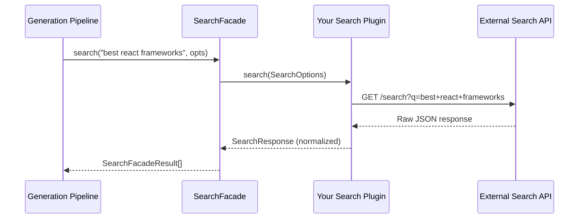
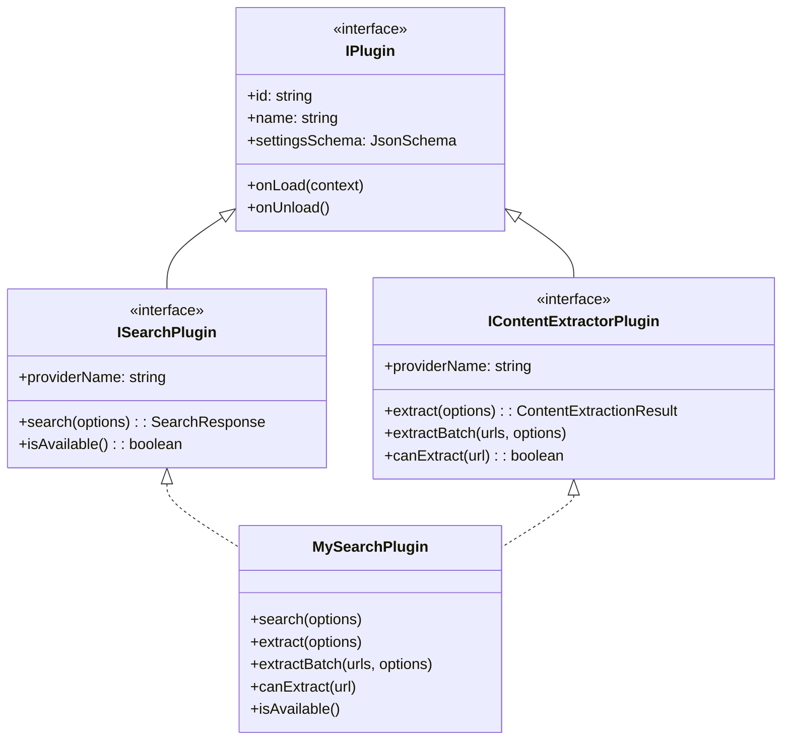

# Creating a Search Plugin

This guide covers everything you need to build a search plugin for the Ever Works platform. Search plugins provide web search capabilities that the generation pipeline uses to discover information about directory items. By the end, you will have a fully working search plugin with settings, filtering, pagination, optional content extraction, and tests.

## What Search Plugins Do

During directory generation, the **standard pipeline** runs a "web-search" step that queries the active search plugin for each item in the directory. The search facade (`ISearchFacade`) routes these queries to whichever search plugin the user has selected. Your plugin receives a `SearchOptions` object, calls an external search API, and returns normalized `SearchResponse` data that the pipeline consumes downstream for content enrichment, source validation, and AI-powered description generation.



:::info Dual-capability plugins
Some search plugins also implement `IContentExtractorPlugin` to provide URL content extraction alongside search. Exa, Tavily, and Jina all follow this pattern. This guide covers both single-capability and dual-capability plugins.
:::

## Prerequisites

- Node.js >= 20
- pnpm (never npm or yarn)
- A working Ever Works development environment (`pnpm install` from repo root)
- An API key for the search service you are integrating

## Project Scaffolding

Create a new directory under `packages/plugins/`:

```
packages/plugins/my-search/
├── package.json
├── tsconfig.json
├── tsup.config.ts
├── vitest.config.ts
└── src/
    ├── index.ts
    └── my-search.plugin.ts
```

### package.json

The `everworks.plugin` field is how the platform discovers your plugin at startup:

```json
{
    "name": "@ever-works/my-search-plugin",
    "version": "1.0.0",
    "description": "My Search Plugin - Web search using the MySearch API",
    "private": true,
    "type": "module",
    "main": "./dist/index.cjs",
    "module": "./dist/index.js",
    "types": "./dist/index.d.ts",
    "exports": {
        ".": {
            "types": "./dist/index.d.ts",
            "import": "./dist/index.js",
            "require": "./dist/index.cjs"
        }
    },
    "scripts": {
        "build": "tsup",
        "dev": "tsup --watch",
        "type-check": "tsc --noEmit",
        "clean": "rm -rf dist",
        "test": "vitest run --passWithNoTests",
        "test:watch": "vitest",
        "test:coverage": "vitest run --coverage"
    },
    "dependencies": {},
    "peerDependencies": {
        "@ever-works/plugin": "workspace:*"
    },
    "devDependencies": {
        "@ever-works/plugin": "workspace:*",
        "tsup": "^8.4.0",
        "typescript": "^5.7.3",
        "vitest": "^3.0.0"
    },
    "everworks": {
        "plugin": {
            "id": "my-search",
            "name": "My Search",
            "version": "1.0.0",
            "category": "search",
            "capabilities": ["search"],
            "description": "Web search using the MySearch API.",
            "author": {
                "name": "Your Name"
            },
            "license": "MIT",
            "builtIn": true,
            "autoEnable": false,
            "envVars": [
                {
                    "name": "PLUGIN_MY_SEARCH_API_KEY",
                    "required": false,
                    "secret": true,
                    "description": "MySearch API key (optional - can be set via admin/user settings)"
                }
            ]
        }
    }
}
```

:::tip Naming conventions
- Plugin IDs use kebab-case: `my-search`
- Package names follow `@ever-works/{id}-plugin`
- Environment variables follow `PLUGIN_{UPPER_SNAKE_ID}_API_KEY`
:::

### tsconfig.json

```json
{
    "compilerOptions": {
        "target": "ES2022",
        "module": "ES2022",
        "moduleResolution": "bundler",
        "declaration": true,
        "declarationMap": true,
        "sourceMap": true,
        "outDir": "./dist",
        "rootDir": "./src",
        "strict": true,
        "esModuleInterop": true,
        "skipLibCheck": true,
        "forceConsistentCasingInFileNames": true
    },
    "include": ["src/**/*"],
    "exclude": ["node_modules", "dist"]
}
```

### tsup.config.ts

```ts
import { defineConfig } from 'tsup';

export default defineConfig({
    entry: ['src/index.ts'],
    noExternal: ['@ever-works/plugin'],
    format: ['cjs', 'esm'],
    dts: true,
    clean: true,
    sourcemap: false,
    splitting: false,
    treeshake: true
});
```

### vitest.config.ts

```ts
import { defineConfig } from 'vitest/config';

export default defineConfig({
    test: {
        globals: true
    }
});
```

### src/index.ts

Every plugin must export both a named export and a default export of the plugin class:

```ts
export { MySearchPlugin } from './my-search.plugin.js';
export { MySearchPlugin as default } from './my-search.plugin.js';
```

## Core Interfaces

Before writing the implementation, review the two interfaces your plugin must satisfy.

### IPlugin (required for all plugins)

Every plugin implements `IPlugin` from `@ever-works/plugin`. This provides identity, settings schema, and lifecycle hooks:

```ts
interface IPlugin {
    readonly id: string;
    readonly name: string;
    readonly version: string;
    readonly category: PluginCategory;
    readonly capabilities: readonly string[];
    readonly settingsSchema: JsonSchema;
    readonly configurationMode?: ConfigurationMode;

    onLoad(context: PluginContext): Promise<void>;
    onUnload(): Promise<void>;
    healthCheck?(): Promise<PluginHealthCheck>;
    getManifest?(): PluginManifest;
    validateSettings?(settings: Record<string, unknown>): ValidationResult | Promise<ValidationResult>;
    validateConnection?(settings: Record<string, unknown>): Promise<ConnectionValidationResult>;
}
```

### ISearchPlugin (required for search capability)

```ts
interface ISearchPlugin extends IPlugin {
    readonly providerName: string;
    search(options: SearchOptions): Promise<SearchResponse>;
    isAvailable(): Promise<boolean>;
    getRateLimitInfo?(): Promise<RateLimitInfo>;
    getSupportedRegions?(): readonly string[];
    getSupportedLanguages?(): readonly string[];
}
```

## Complete Basic Search Plugin

Here is a complete, working search plugin using `fetch` (no SDK). This example targets a fictional "MySearch API" but the patterns are identical to those used by the built-in Brave, SerpAPI, and Jina plugins.

```ts
import type {
    IPlugin,
    ISearchPlugin,
    PluginContext,
    PluginCategory,
    PluginManifest,
    PluginHealthCheck,
    JsonSchema,
    SearchOptions,
    SearchResponse,
    SearchResult,
    RateLimitInfo,
    ConnectionValidationResult
} from '@ever-works/plugin';

const MAX_RESULTS_LIMIT = 50;

/**
 * Time range values mapped to the provider's freshness parameter.
 * Every search API uses different names for time filtering.
 */
const TIME_RANGE_MAP: Record<string, string> = {
    day: '1d',
    week: '7d',
    month: '30d',
    year: '365d'
};

/**
 * Safe search values mapped to the provider's parameter.
 */
const SAFE_SEARCH_MAP: Record<string, string> = {
    off: 'none',
    moderate: 'moderate',
    strict: 'strict'
};

export class MySearchPlugin implements IPlugin, ISearchPlugin {
    readonly id = 'my-search';
    readonly name = 'My Search';
    readonly version = '1.0.0';
    readonly category: PluginCategory = 'search';
    readonly capabilities: readonly string[] = ['search'];
    readonly providerName = 'MySearch';

    readonly configurationMode: 'admin-only' | 'user-required' | 'hybrid' = 'hybrid';

    readonly settingsSchema: JsonSchema = {
        type: 'object',
        properties: {
            apiKey: {
                type: 'string',
                title: 'API Key',
                description: 'Your MySearch API key. Get one at https://mysearch.example.com',
                'x-secret': true,
                'x-envVar': 'PLUGIN_MY_SEARCH_API_KEY',
                'x-scope': 'user'
            },
            maxResults: {
                type: 'number',
                title: 'Default Max Results',
                description: `Default number of results per search (max ${MAX_RESULTS_LIMIT})`,
                default: 10,
                minimum: 1,
                maximum: MAX_RESULTS_LIMIT
            }
        },
        required: ['apiKey']
    };

    private context?: PluginContext;

    // ============================================================================
    // ISearchPlugin — search
    // ============================================================================

    async search(options: SearchOptions): Promise<SearchResponse> {
        const apiKey = options.settings?.apiKey as string;
        if (!apiKey) {
            throw new Error(
                'MySearch API key not configured. '
                + 'Set it in plugin settings or via PLUGIN_MY_SEARCH_API_KEY environment variable.'
            );
        }

        const startTime = Date.now();
        const limit = Math.min(
            options.limit || (options.settings?.maxResults as number) || 10,
            MAX_RESULTS_LIMIT
        );
        const page = options.page || 1;

        // Build URL parameters
        const params = new URLSearchParams({
            q: this.buildQuery(options),
            count: String(limit)
        });

        // Pagination (offset-based)
        if (page > 1) {
            params.set('offset', String((page - 1) * limit));
        }

        // Region
        if (options.region) {
            params.set('region', options.region);
        }

        // Language
        if (options.language) {
            params.set('lang', options.language);
        }

        // Safe search
        if (options.safeSearch) {
            const mapped = SAFE_SEARCH_MAP[options.safeSearch];
            if (mapped) {
                params.set('safe', mapped);
            }
        }

        // Time range
        if (options.timeRange && options.timeRange !== 'all') {
            const mapped = TIME_RANGE_MAP[options.timeRange];
            if (mapped) {
                params.set('freshness', mapped);
            }
        }

        // Domain filtering
        if (options.includeDomains && options.includeDomains.length > 0) {
            params.set('include_domains', options.includeDomains.join(','));
        }
        if (options.excludeDomains && options.excludeDomains.length > 0) {
            params.set('exclude_domains', options.excludeDomains.join(','));
        }

        try {
            const response = await fetch(
                `https://api.mysearch.example.com/v1/search?${params.toString()}`,
                {
                    headers: {
                        Authorization: `Bearer ${apiKey}`,
                        Accept: 'application/json'
                    }
                }
            );

            if (!response.ok) {
                const errorText = await response.text();
                throw new Error(`MySearch request failed (${response.status}): ${errorText}`);
            }

            const data = await response.json();
            return this.normalizeResponse(data, options.query, page, startTime);
        } catch (error) {
            this.context?.logger.error(
                `MySearch failed: ${error instanceof Error ? error.message : String(error)}`
            );
            throw error;
        }
    }

    // ============================================================================
    // ISearchPlugin — availability and metadata
    // ============================================================================

    async isAvailable(): Promise<boolean> {
        if (!this.context) return false;
        const settings = await this.context.getSettings();
        return Boolean(settings?.apiKey);
    }

    async getRateLimitInfo(): Promise<RateLimitInfo> {
        return {
            remaining: -1,
            limit: -1,
            period: 'month'
        };
    }

    getSupportedRegions(): readonly string[] {
        return ['us', 'gb', 'de', 'fr', 'jp', 'au', 'ca', 'in', 'br'];
    }

    // ============================================================================
    // IPlugin — connection validation
    // ============================================================================

    async validateConnection(
        settings: Record<string, unknown>
    ): Promise<ConnectionValidationResult> {
        const apiKey = settings.apiKey as string | undefined;
        if (!apiKey) {
            return { success: false, message: 'MySearch API key is not configured.' };
        }

        try {
            const params = new URLSearchParams({ q: 'test', count: '1' });
            const response = await fetch(
                `https://api.mysearch.example.com/v1/search?${params.toString()}`,
                {
                    headers: {
                        Authorization: `Bearer ${apiKey}`,
                        Accept: 'application/json'
                    }
                }
            );

            if (!response.ok) {
                const errorText = await response.text();
                return {
                    success: false,
                    message: `MySearch connection failed (${response.status}): ${errorText}`
                };
            }

            return { success: true, message: 'MySearch connection verified.' };
        } catch (error) {
            return {
                success: false,
                message: `MySearch connection failed: ${error instanceof Error ? error.message : String(error)}`
            };
        }
    }

    // ============================================================================
    // IPlugin — lifecycle
    // ============================================================================

    async onLoad(context: PluginContext): Promise<void> {
        this.context = context;
        context.logger.log('MySearch Plugin loaded');
    }

    async onUnload(): Promise<void> {
        this.context = undefined;
    }

    async healthCheck(): Promise<PluginHealthCheck> {
        return {
            status: 'healthy',
            message: 'MySearch plugin is ready (API key required for operations)',
            checkedAt: Date.now()
        };
    }

    getManifest(): PluginManifest {
        return {
            id: this.id,
            name: this.name,
            version: this.version,
            description: 'Web search using the MySearch API',
            category: this.category,
            capabilities: [...this.capabilities],
            author: { name: 'Your Name' },
            license: 'MIT',
            builtIn: true,
            autoEnable: false,
            homepage: 'https://mysearch.example.com'
        };
    }

    // ============================================================================
    // Private helpers
    // ============================================================================

    /**
     * Build the query string, prepending site: and filetype: operators if present.
     */
    private buildQuery(options: SearchOptions): string {
        let query = options.query;
        if (options.site) {
            query = `site:${options.site} ${query}`;
        }
        if (options.fileType) {
            query = `filetype:${options.fileType} ${query}`;
        }
        return query;
    }

    /**
     * Normalize the raw API response into the platform's SearchResponse shape.
     */
    private normalizeResponse(
        data: Record<string, unknown>,
        query: string,
        page: number,
        startTime: number
    ): SearchResponse {
        const rawResults = (data.results || []) as Array<Record<string, unknown>>;

        const results: SearchResult[] = rawResults.map(
            (r: Record<string, unknown>, index: number) => ({
                title: (r.title as string) || '',
                url: (r.url as string) || '',
                snippet: r.snippet as string | undefined,
                displayUrl: r.display_url as string | undefined,
                faviconUrl: r.favicon as string | undefined,
                position: index + 1,
                publishedDate: r.published_date as string | undefined,
                source: r.source as string | undefined,
                metadata: {
                    score: r.relevance_score
                }
            })
        );

        const hasMore = Boolean(data.has_more);

        return {
            results,
            query,
            totalResults: (data.total_count as number) || results.length,
            hasMore,
            nextPage: hasMore ? page + 1 : undefined,
            duration: Date.now() - startTime,
            relatedSearches: data.related as readonly string[] | undefined
        };
    }
}

export default MySearchPlugin;
```

## Settings Schema in Depth

The `settingsSchema` property uses JSON Schema extended with Ever Works custom properties. These extensions control how the admin and user settings UI renders each field.

### Custom schema extensions

| Extension | Type | Purpose |
|-----------|------|---------|
| `x-secret` | `boolean` | Field value is encrypted at rest, never returned in API responses, rendered as a password input |
| `x-envVar` | `string` | Environment variable fallback checked when no user or admin value is saved |
| `x-scope` | `'global' \| 'user' \| 'directory'` | Which settings scope this field belongs to |
| `x-widget` | `string` | UI widget hint (e.g., `textarea`, `select`, `toggle`) |
| `x-adminOnly` | `boolean` | Only visible to admins |
| `x-hidden` | `boolean` | Never shown in the UI |
| `x-showIf` | `{ field, value }` | Conditional visibility based on another field |

### Example: advanced settings schema

This example adds a search type selector and a category filter, both of which are patterns found in real plugins like Exa and SerpAPI:

```ts
readonly settingsSchema: JsonSchema = {
    type: 'object',
    properties: {
        apiKey: {
            type: 'string',
            title: 'API Key',
            description: 'Your API key',
            'x-secret': true,
            'x-envVar': 'PLUGIN_MY_SEARCH_API_KEY',
            'x-scope': 'user'
        },
        searchType: {
            type: 'string',
            title: 'Search Type',
            description: 'Controls how queries are interpreted',
            enum: ['auto', 'keyword', 'semantic'],
            default: 'auto'
        },
        maxResults: {
            type: 'number',
            title: 'Default Max Results',
            description: 'Default number of results per search',
            default: 10,
            minimum: 1,
            maximum: 50
        },
        category: {
            type: 'string',
            title: 'Content Category',
            description: 'Limit results to a specific content category',
            enum: ['general', 'news', 'research', 'company', 'tweet'],
            default: 'general',
            'x-showIf': { field: 'searchType', value: 'semantic' }
        }
    },
    required: ['apiKey']
};
```

### Configuration mode

All search plugins use `configurationMode: 'hybrid'`:

| Mode | Behavior |
|------|----------|
| `admin-only` | Only admins configure settings; users see nothing |
| `user-required` | Each user must supply their own settings |
| **`hybrid`** | Admin provides defaults; users can optionally override (e.g., bring their own API key) |

### How settings are resolved at call time

Settings are **not** stored on the plugin instance. They arrive via `options.settings` on every `search()` call, already resolved by the platform through this priority chain:

```
User override > Directory override > Admin default > Environment variable > Schema default
```

Always read settings from `options.settings`, never from `this.context.getSettings()` inside `search()`. The context method is for `isAvailable()` checks where no call-time options exist.

## Handling Search Options

The `SearchOptions` interface provides a rich set of filtering parameters. Your plugin is responsible for mapping each one to the external API's equivalent.

### Time range

Every search API names time filtering differently. Use a constant map:

```ts
// Brave uses freshness codes
const TIME_RANGE_MAP: Record<string, string> = {
    day: 'pd',
    week: 'pw',
    month: 'pm',
    year: 'py'
};

// SerpAPI uses tbs parameter
const TIME_RANGE_MAP: Record<string, string> = {
    day: 'qdr:d',
    week: 'qdr:w',
    month: 'qdr:m',
    year: 'qdr:y'
};
```

Apply it in `search()`:

```ts
if (options.timeRange && options.timeRange !== 'all') {
    const mapped = TIME_RANGE_MAP[options.timeRange];
    if (mapped) {
        params.set('freshness', mapped);
    }
}
```

### Domain filtering

`includeDomains` and `excludeDomains` narrow results to or away from specific sites. Some APIs accept these as dedicated parameters; others require query-string operators:

```ts
// Option A: Dedicated API parameters (Exa, Tavily)
if (options.includeDomains?.length) {
    params.set('include_domains', options.includeDomains.join(','));
}
if (options.excludeDomains?.length) {
    params.set('exclude_domains', options.excludeDomains.join(','));
}

// Option B: Query-string operators (Google/SerpAPI)
if (options.includeDomains?.length) {
    const sitePrefix = options.includeDomains
        .map((d) => `site:${d}`)
        .join(' OR ');
    query = `(${sitePrefix}) ${query}`;
}
if (options.excludeDomains?.length) {
    const exclusions = options.excludeDomains
        .map((d) => `-site:${d}`)
        .join(' ');
    query = `${query} ${exclusions}`;
}
```

### Safe search

Map the platform's three-level enum to the provider's parameter:

```ts
const SAFE_SEARCH_MAP: Record<string, string> = {
    off: 'off',
    moderate: 'medium',
    strict: 'active'
};

if (options.safeSearch) {
    params.set('safesearch', SAFE_SEARCH_MAP[options.safeSearch] || 'off');
}
```

### Pagination

The platform uses 1-based page numbers. Convert to whatever the provider expects (usually an offset):

```ts
const page = options.page || 1;
if (page > 1) {
    const offset = (page - 1) * limit;
    params.set('offset', String(offset));
}
```

Return pagination metadata in the response so the pipeline knows whether more results exist:

```ts
return {
    results,
    query: options.query,
    totalResults: data.total || results.length,
    hasMore: Boolean(data.has_more),
    nextPage: data.has_more ? page + 1 : undefined,
    duration: Date.now() - startTime
};
```

### Site and file type operators

The `site` and `fileType` options are typically prepended to the query string:

```ts
private buildQuery(options: SearchOptions): string {
    let query = options.query;
    if (options.site) {
        query = `site:${options.site} ${query}`;
    }
    if (options.fileType) {
        query = `filetype:${options.fileType} ${query}`;
    }
    return query;
}
```

## Adding Content Extraction (Dual-Capability Plugin)

Several built-in search plugins (Tavily, Exa, Jina) also implement `IContentExtractorPlugin` to provide URL content extraction alongside search. This is useful when the same API can both search and extract page content.

### Updating the manifest

Update `capabilities` and `package.json` to declare both capabilities:

```json
"capabilities": ["search", "content-extractor"]
```

### Implementing IContentExtractorPlugin

Add the `IContentExtractorPlugin` interface to your class:

```ts
import type {
    IContentExtractorPlugin,
    ContentExtractionOptions,
    ContentExtractionResult
} from '@ever-works/plugin';

export class MySearchPlugin
    implements IPlugin, ISearchPlugin, IContentExtractorPlugin
{
    readonly capabilities: readonly string[] = ['search', 'content-extractor'];

    // ... all existing ISearchPlugin methods ...

    // ================================================================
    // IContentExtractorPlugin
    // ================================================================

    async extract(
        options: ContentExtractionOptions
    ): Promise<ContentExtractionResult> {
        const apiKey = options.settings?.apiKey as string;
        if (!apiKey) {
            throw new Error('MySearch API key not configured.');
        }

        const startTime = Date.now();

        try {
            const response = await fetch(
                `https://api.mysearch.example.com/v1/extract`,
                {
                    method: 'POST',
                    headers: {
                        Authorization: `Bearer ${apiKey}`,
                        'Content-Type': 'application/json'
                    },
                    body: JSON.stringify({
                        url: options.url,
                        include_images: options.includeImages ?? false,
                        include_links: options.includeLinks ?? false,
                        max_length: options.maxLength
                    })
                }
            );

            if (!response.ok) {
                return {
                    success: false,
                    url: options.url,
                    error: `Extraction failed (${response.status})`,
                    duration: Date.now() - startTime
                };
            }

            const data = (await response.json()) as Record<string, unknown>;

            const content = data.text as string | undefined;
            return {
                success: true,
                url: options.url,
                finalUrl: data.final_url as string | undefined,
                title: data.title as string | undefined,
                content,
                markdown: data.markdown as string | undefined,
                duration: Date.now() - startTime,
                wordCount: content
                    ? content.split(/\s+/).length
                    : 0
            };
        } catch (error) {
            return {
                success: false,
                url: options.url,
                error: error instanceof Error
                    ? error.message
                    : String(error),
                duration: Date.now() - startTime
            };
        }
    }

    async extractBatch(
        urls: readonly string[],
        options?: Partial<ContentExtractionOptions>
    ): Promise<readonly ContentExtractionResult[]> {
        // Simple sequential implementation; override with
        // a batch API call if the provider supports it.
        return Promise.all(
            urls.map((url) =>
                this.extract({
                    url,
                    ...options,
                    settings: options?.settings
                })
            )
        );
    }

    async canExtract(url: string): Promise<boolean> {
        try {
            const parsed = new URL(url);
            return parsed.protocol === 'http:'
                || parsed.protocol === 'https:';
        } catch {
            return false;
        }
    }

    getSupportedFormats(): readonly ('text' | 'html' | 'markdown')[] {
        return ['text', 'markdown'];
    }
}
```

:::note extractBatch
If the external API supports batch extraction in a single call (like Tavily's `client.extract([urls])`), implement `extractBatch` using the batch endpoint for better performance. The sequential fallback shown above works but is slower.
:::

### Architecture of a dual-capability plugin



## Writing Tests

Search plugins are tested with Vitest. Since fetch-based plugins do not depend on SDKs, you mock the global `fetch` function directly.

Create `src/__tests__/my-search.plugin.spec.ts`:

```ts
import { describe, it, expect, vi, beforeEach, afterEach } from 'vitest';
import { MySearchPlugin } from '../my-search.plugin.js';

// Mock the global fetch
const mockFetch = vi.fn();
vi.stubGlobal('fetch', mockFetch);

describe('MySearchPlugin', () => {
    let plugin: MySearchPlugin;

    const mockContext = {
        pluginId: 'my-search',
        logger: {
            log: vi.fn(),
            error: vi.fn(),
            warn: vi.fn(),
            debug: vi.fn()
        },
        cache: {
            get: vi.fn(),
            set: vi.fn(),
            delete: vi.fn(),
            has: vi.fn(),
            clear: vi.fn()
        },
        http: {} as any,
        env: {} as any,
        envVars: {} as any,
        services: {} as any,
        getSettings: vi.fn().mockResolvedValue({ apiKey: 'test-key' }),
        getResolvedSettings: vi.fn(),
        onEvent: vi.fn(),
        emitEvent: vi.fn(),
        registerCustomCapability: vi.fn(),
        getCustomCapability: vi.fn(),
        hasCustomCapability: vi.fn(),
        listCustomCapabilities: vi.fn()
    };

    const baseSettings = { apiKey: 'test-api-key', maxResults: 10 };

    beforeEach(async () => {
        plugin = new MySearchPlugin();
        await plugin.onLoad(mockContext as any);
        mockFetch.mockReset();
    });

    afterEach(async () => {
        await plugin.onUnload();
    });

    // ================================================================
    // Identity and metadata
    // ================================================================

    describe('metadata', () => {
        it('has correct id and category', () => {
            expect(plugin.id).toBe('my-search');
            expect(plugin.category).toBe('search');
            expect(plugin.capabilities).toContain('search');
        });

        it('requires apiKey in settings schema', () => {
            expect(plugin.settingsSchema.required).toContain('apiKey');
        });

        it('marks apiKey as secret', () => {
            const props = plugin.settingsSchema.properties!;
            expect(props.apiKey['x-secret']).toBe(true);
        });
    });

    // ================================================================
    // Search
    // ================================================================

    describe('search', () => {
        it('returns normalized results', async () => {
            mockFetch.mockResolvedValueOnce({
                ok: true,
                json: async () => ({
                    results: [
                        {
                            title: 'Result 1',
                            url: 'https://example.com/1',
                            snippet: 'First result'
                        },
                        {
                            title: 'Result 2',
                            url: 'https://example.com/2',
                            snippet: 'Second result'
                        }
                    ],
                    total_count: 100,
                    has_more: true
                })
            });

            const response = await plugin.search({
                query: 'test query',
                settings: baseSettings
            });

            expect(response.results).toHaveLength(2);
            expect(response.results[0].title).toBe('Result 1');
            expect(response.results[0].position).toBe(1);
            expect(response.query).toBe('test query');
            expect(response.hasMore).toBe(true);
            expect(response.nextPage).toBe(2);
            expect(response.duration).toBeGreaterThanOrEqual(0);
        });

        it('throws when API key is missing', async () => {
            await expect(
                plugin.search({ query: 'test', settings: {} })
            ).rejects.toThrow('API key not configured');
        });

        it('throws on HTTP error', async () => {
            mockFetch.mockResolvedValueOnce({
                ok: false,
                status: 401,
                text: async () => 'Unauthorized'
            });

            await expect(
                plugin.search({ query: 'test', settings: baseSettings })
            ).rejects.toThrow('401');
        });
    });

    // ================================================================
    // Domain filtering
    // ================================================================

    describe('domain filtering', () => {
        it('passes includeDomains to the API', async () => {
            mockFetch.mockResolvedValueOnce({
                ok: true,
                json: async () => ({ results: [], has_more: false })
            });

            await plugin.search({
                query: 'test',
                includeDomains: ['example.com', 'docs.example.com'],
                settings: baseSettings
            });

            const calledUrl = mockFetch.mock.calls[0][0] as string;
            expect(calledUrl).toContain('include_domains=example.com');
        });

        it('passes excludeDomains to the API', async () => {
            mockFetch.mockResolvedValueOnce({
                ok: true,
                json: async () => ({ results: [], has_more: false })
            });

            await plugin.search({
                query: 'test',
                excludeDomains: ['spam.com'],
                settings: baseSettings
            });

            const calledUrl = mockFetch.mock.calls[0][0] as string;
            expect(calledUrl).toContain('exclude_domains=spam.com');
        });
    });

    // ================================================================
    // Time range
    // ================================================================

    describe('time range', () => {
        it('maps day to the provider freshness parameter', async () => {
            mockFetch.mockResolvedValueOnce({
                ok: true,
                json: async () => ({ results: [], has_more: false })
            });

            await plugin.search({
                query: 'test',
                timeRange: 'day',
                settings: baseSettings
            });

            const calledUrl = mockFetch.mock.calls[0][0] as string;
            expect(calledUrl).toContain('freshness=1d');
        });

        it('ignores "all" time range', async () => {
            mockFetch.mockResolvedValueOnce({
                ok: true,
                json: async () => ({ results: [], has_more: false })
            });

            await plugin.search({
                query: 'test',
                timeRange: 'all',
                settings: baseSettings
            });

            const calledUrl = mockFetch.mock.calls[0][0] as string;
            expect(calledUrl).not.toContain('freshness');
        });
    });

    // ================================================================
    // Pagination
    // ================================================================

    describe('pagination', () => {
        it('sends offset for page > 1', async () => {
            mockFetch.mockResolvedValueOnce({
                ok: true,
                json: async () => ({ results: [], has_more: false })
            });

            await plugin.search({
                query: 'test',
                page: 3,
                limit: 10,
                settings: baseSettings
            });

            const calledUrl = mockFetch.mock.calls[0][0] as string;
            expect(calledUrl).toContain('offset=20');
        });
    });

    // ================================================================
    // Availability
    // ================================================================

    describe('isAvailable', () => {
        it('returns true when API key is configured', async () => {
            expect(await plugin.isAvailable()).toBe(true);
        });

        it('returns false when no context', async () => {
            await plugin.onUnload();
            expect(await plugin.isAvailable()).toBe(false);
        });
    });

    // ================================================================
    // Connection validation
    // ================================================================

    describe('validateConnection', () => {
        it('succeeds with a valid key', async () => {
            mockFetch.mockResolvedValueOnce({
                ok: true,
                json: async () => ({ results: [] })
            });

            const result = await plugin.validateConnection(
                { apiKey: 'valid-key' }
            );
            expect(result.success).toBe(true);
        });

        it('fails when key is missing', async () => {
            const result = await plugin.validateConnection({});
            expect(result.success).toBe(false);
        });
    });

    // ================================================================
    // Lifecycle
    // ================================================================

    describe('lifecycle', () => {
        it('reports healthy in healthCheck', async () => {
            const health = await plugin.healthCheck!();
            expect(health.status).toBe('healthy');
        });

        it('returns a valid manifest', () => {
            const manifest = plugin.getManifest!();
            expect(manifest.id).toBe('my-search');
            expect(manifest.category).toBe('search');
        });
    });
});
```

### Running tests

```bash
# From the plugin directory
cd packages/plugins/my-search
pnpm test

# Single file
npx vitest run src/__tests__/my-search.plugin.spec.ts

# Watch mode
pnpm test:watch

# Coverage
pnpm test:coverage
```

## Build and Registration

### Building

```bash
# Build just your plugin
cd packages/plugins/my-search
pnpm build

# Or build all plugins from the repo root
pnpm build:plugins
```

The build produces `dist/index.js` (ESM), `dist/index.cjs` (CJS), and `dist/index.d.ts` (types).

### Registration

The platform auto-discovers plugins at startup by scanning `packages/plugins/*/package.json` for the `everworks.plugin` field. No manual registration code is needed. After building, restart the dev server:

```bash
pnpm dev:api
```

Your plugin will appear in the admin plugins list where it can be enabled and configured.

### Making your plugin the default

If you want your plugin to be the default search provider when no other is configured, add `defaultForCapabilities` to the manifest:

```json
{
    "everworks": {
        "plugin": {
            "id": "my-search",
            "capabilities": ["search"],
            "autoEnable": true,
            "systemPlugin": true,
            "defaultForCapabilities": ["search"]
        }
    }
}
```

:::warning
Only one plugin should be the default for a given capability. If multiple plugins declare `defaultForCapabilities: ["search"]`, the last one loaded wins. Built-in Tavily is currently the platform default for search.
:::

## Reference: Built-in Search Plugins

| Plugin | API Style | Capabilities | Domain Filtering | Time Range | Pagination |
|--------|-----------|-------------|-----------------|------------|------------|
| **Tavily** | SDK (`@tavily/core`) | search, content-extractor | `includeDomains`, `excludeDomains` params | Not supported | Not supported |
| **Brave** | fetch | search | Not supported | `freshness` param (pd/pw/pm/py) | Offset-based (max 9 pages) |
| **SerpAPI** | fetch | search | Query-string operators | Not mapped | `start` offset |
| **Exa** | SDK (`exa-js`) | search, content-extractor | `includeDomains`, `excludeDomains` params | `startPublishedDate` | Cursor-based |
| **Jina** | fetch | search, content-extractor | Not supported | Not supported | Not supported |

## Checklist

Use this checklist before submitting your search plugin:

- [ ] **Package structure**: `package.json`, `tsconfig.json`, `tsup.config.ts`, `vitest.config.ts` all present
- [ ] **Plugin manifest**: `everworks.plugin` in `package.json` with correct `id`, `category: "search"`, and `capabilities`
- [ ] **Interfaces**: Class implements both `IPlugin` and `ISearchPlugin`
- [ ] **providerName**: Readonly string property is declared
- [ ] **Settings schema**: `apiKey` field with `x-secret: true` and `x-envVar`
- [ ] **configurationMode**: Set to `'hybrid'`
- [ ] **search()**: Reads API key from `options.settings`, not from `this.context`
- [ ] **search()**: Returns a valid `SearchResponse` with `results`, `query`, `hasMore`, and `duration`
- [ ] **search()**: Handles all relevant `SearchOptions` (timeRange, domains, safeSearch, pagination)
- [ ] **search()**: Throws with a clear message when the API key is missing
- [ ] **isAvailable()**: Returns `true` when API key is present in context settings
- [ ] **validateConnection()**: Makes a lightweight API call to verify the key works
- [ ] **onLoad/onUnload**: Store and clear `context` reference
- [ ] **healthCheck()**: Returns a `PluginHealthCheck` with status and timestamp
- [ ] **getManifest()**: Returns a complete `PluginManifest`
- [ ] **Error handling**: All fetch errors are caught, logged via `this.context?.logger.error()`, and re-thrown
- [ ] **Index file**: Exports both named and default exports
- [ ] **Tests**: Search results, error handling, domain filtering, time range, pagination, availability, connection validation
- [ ] **Build**: `pnpm build` succeeds with no TypeScript errors
- [ ] **Type check**: `pnpm type-check` passes
- [ ] **(Optional) Content extraction**: If dual-capability, implements `IContentExtractorPlugin` with `extract()`, `canExtract()`, and `getSupportedFormats()`
- [ ] **(Optional) Batch extraction**: If dual-capability, implements `extractBatch()` for multi-URL extraction
