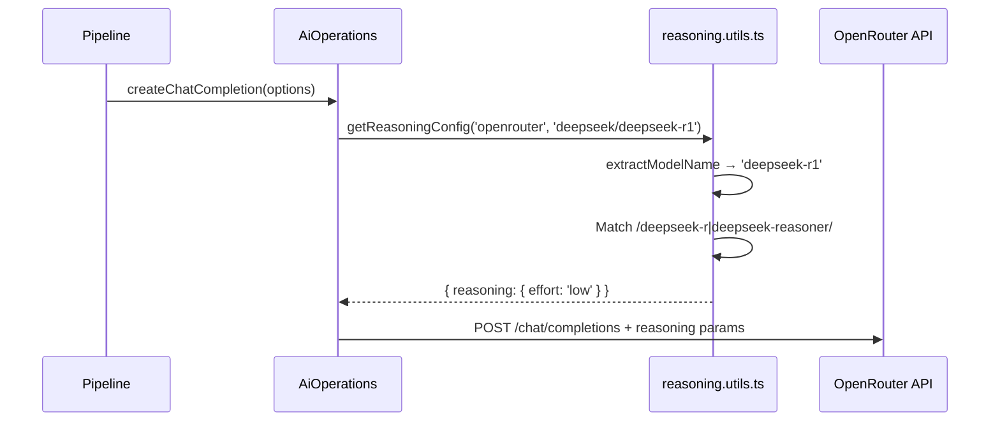
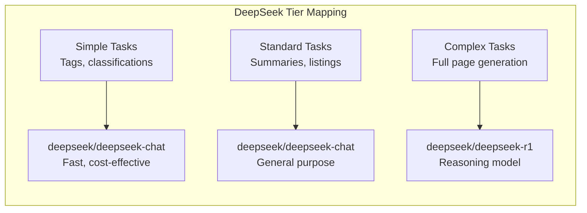

# DeepSeek Models via OpenRouter

Ever Works does not ship a standalone DeepSeek plugin. DeepSeek models are accessed through the **OpenRouter** plugin, which is the platform's default AI provider. This page explains how to configure OpenRouter to use DeepSeek models for directory generation and AI conversations.

**Related source files:**

| File                                                                                 | Purpose                                     |
| ------------------------------------------------------------------------------------ | ------------------------------------------- |
| `packages/plugins/openrouter/src/openrouter.plugin.ts`                               | OpenRouter AI provider plugin               |
| `packages/plugin/src/ai/reasoning.utils.ts`                                          | Reasoning configuration for DeepSeek models |
| `apps/internal-cli/src/commands/config/ai-providers/ai-provider-registry.service.ts` | AI provider registry with model lists       |

## Available DeepSeek Models

DeepSeek models are available through two providers in Ever Works:

### Via OpenRouter

OpenRouter lists DeepSeek models with the `deepseek/` prefix:

| Model ID                  | Description                 | Best For                                    |
| ------------------------- | --------------------------- | ------------------------------------------- |
| `deepseek/deepseek-r1`    | DeepSeek R1 reasoning model | Complex analysis, multi-step reasoning      |
| `deepseek/deepseek-chat`  | DeepSeek Chat               | General-purpose content generation          |
| `deepseek/deepseek-coder` | DeepSeek Coder              | Technical content, code-related directories |

### Via Ollama (Local)

DeepSeek models can also be run locally through the Ollama plugin:

| Model ID            | Description                               |
| ------------------- | ----------------------------------------- |
| `deepseek-r1`       | Local DeepSeek R1 (various quantizations) |
| `deepseek-coder-v2` | Local DeepSeek Coder V2                   |

### Via Groq

Groq provides distilled DeepSeek models with ultra-fast inference:

| Model ID                       | Description                       |
| ------------------------------ | --------------------------------- |
| `deepseek-r1-distill-qwen-32b` | DeepSeek R1 distilled to Qwen 32B |

## Reasoning Model Configuration

DeepSeek R1 is classified as a reasoning model. The platform automatically applies reasoning configuration to prevent verbose chain-of-thought output from consuming tokens unnecessarily.

From `packages/plugin/src/ai/reasoning.utils.ts`:

```typescript
{
    pattern: /deepseek-r|deepseek-reasoner/,
    openrouter: { reasoning: { effort: 'low' } }
}
```

When a DeepSeek reasoning model is selected, the platform sends a `reasoning.effort: 'low'` parameter through OpenRouter. This instructs the model to minimize its internal reasoning tokens while still producing structured output.

### How Reasoning Config Resolution Works



The `extractModelName` function strips the provider prefix (`deepseek/deepseek-r1` becomes `deepseek-r1`) before matching against the pattern list.

## Configuring DeepSeek as Your AI Provider

### Option 1: Through OpenRouter (Recommended)

1. Open the **Ever Works dashboard** and navigate to **Settings > Plugins**.
2. Ensure the **OpenRouter** plugin is enabled (it is by default).
3. Enter your OpenRouter API key if not already configured.
4. Set the model fields to DeepSeek models:

| Setting              | Recommended Value        |
| -------------------- | ------------------------ |
| Default Model        | `deepseek/deepseek-chat` |
| Simple Tasks Model   | `deepseek/deepseek-chat` |
| Standard Tasks Model | `deepseek/deepseek-chat` |
| Complex Tasks Model  | `deepseek/deepseek-r1`   |

### Option 2: Through Ollama (Local, Free)

1. Install [Ollama](https://ollama.ai) on your machine.
2. Pull a DeepSeek model: `ollama pull deepseek-r1`
3. Enable the **Ollama** plugin in the Ever Works dashboard.
4. Set the default model to `deepseek-r1`.

### Option 3: Through Groq (Fast Inference)

1. Obtain a Groq API key from [console.groq.com](https://console.groq.com).
2. Enable the **Groq** plugin.
3. Set the model to `deepseek-r1-distill-qwen-32b`.

## Environment Variables

When using DeepSeek through OpenRouter, configure via environment variables:

```bash
PLUGIN_OPENROUTER_API_KEY=sk-or-...
PLUGIN_OPENROUTER_DEFAULT_MODEL=deepseek/deepseek-chat
PLUGIN_OPENROUTER_SIMPLE_MODEL=deepseek/deepseek-chat
PLUGIN_OPENROUTER_COMPLEX_MODEL=deepseek/deepseek-r1
```

## Tiered Model Strategy

DeepSeek models work well in a tiered configuration that balances cost and quality:



| Tier     | Recommended Model        | Reasoning                                      |
| -------- | ------------------------ | ---------------------------------------------- |
| Simple   | `deepseek/deepseek-chat` | Fast responses for tags and short descriptions |
| Standard | `deepseek/deepseek-chat` | Solid quality for summaries and listings       |
| Complex  | `deepseek/deepseek-r1`   | Chain-of-thought reasoning for detailed pages  |

## Mixing DeepSeek with Other Providers

Because OpenRouter aggregates multiple providers, you can mix DeepSeek models with models from other providers across tiers:

| Tier     | Model                    | Provider |
| -------- | ------------------------ | -------- |
| Simple   | `openai/gpt-5-nano`      | OpenAI   |
| Standard | `deepseek/deepseek-chat` | DeepSeek |
| Complex  | `deepseek/deepseek-r1`   | DeepSeek |

This is configured through the OpenRouter plugin settings -- no additional plugins are needed.

## Capabilities

DeepSeek models accessed through OpenRouter support:

| Capability        | DeepSeek Chat | DeepSeek R1 |
| ----------------- | ------------- | ----------- |
| Structured output | Yes           | Yes         |
| Streaming         | Yes           | Yes         |
| Tool calling      | Yes           | Limited     |
| Vision            | No            | No          |
| Embeddings        | No            | No          |

:::note
DeepSeek models do not currently support embeddings. If your workflow requires semantic search, pair DeepSeek with a provider that supports embeddings (OpenAI, Google Gemini, or Ollama).
:::

## Troubleshooting

| Issue                    | Cause                                | Solution                                                                 |
| ------------------------ | ------------------------------------ | ------------------------------------------------------------------------ |
| Verbose reasoning output | Reasoning effort not applied         | Verify the model ID matches `deepseek-r1` or `deepseek-reasoner` pattern |
| Model not found          | Incorrect model ID                   | Use the `deepseek/` prefix when using OpenRouter                         |
| Slow responses with R1   | Reasoning models are slower          | Use `deepseek-chat` for simple tasks; reserve R1 for complex ones        |
| Rate limits              | OpenRouter rate limiting             | Check your OpenRouter plan; add billing credits if needed                |
| Embedding error          | DeepSeek does not support embeddings | Switch to OpenAI or Ollama for embedding tasks                           |

## Cost Considerations

DeepSeek models are generally more cost-effective than comparable models from OpenAI or Anthropic. When accessed through OpenRouter:

- **DeepSeek Chat**: Significantly cheaper per token than GPT-4o
- **DeepSeek R1**: Competitive with other reasoning models while often cheaper

Check [openrouter.ai/models](https://openrouter.ai/models) for current pricing. OpenRouter displays per-token costs for every available model.

## Further Reading

- [OpenRouter Plugin](./openrouter-plugin.md) -- full OpenRouter configuration reference
- [Groq Plugin](./groq-plugin.md) -- fast inference with distilled DeepSeek models
- [Ollama Plugin](./ollama-plugin.md) -- running DeepSeek models locally
- [AI Provider Plugins](./ai-provider-plugins.md) -- overview of all AI provider plugins
