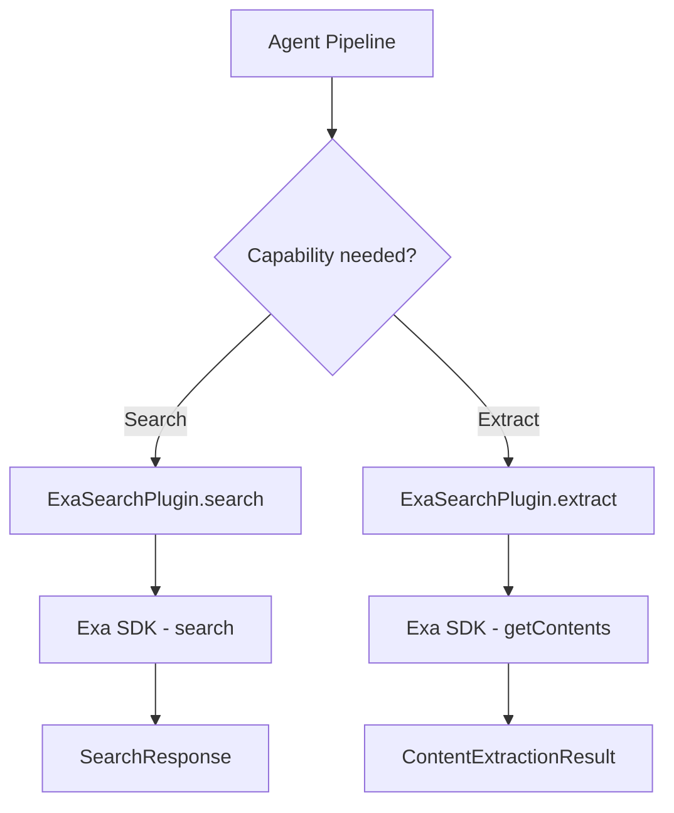
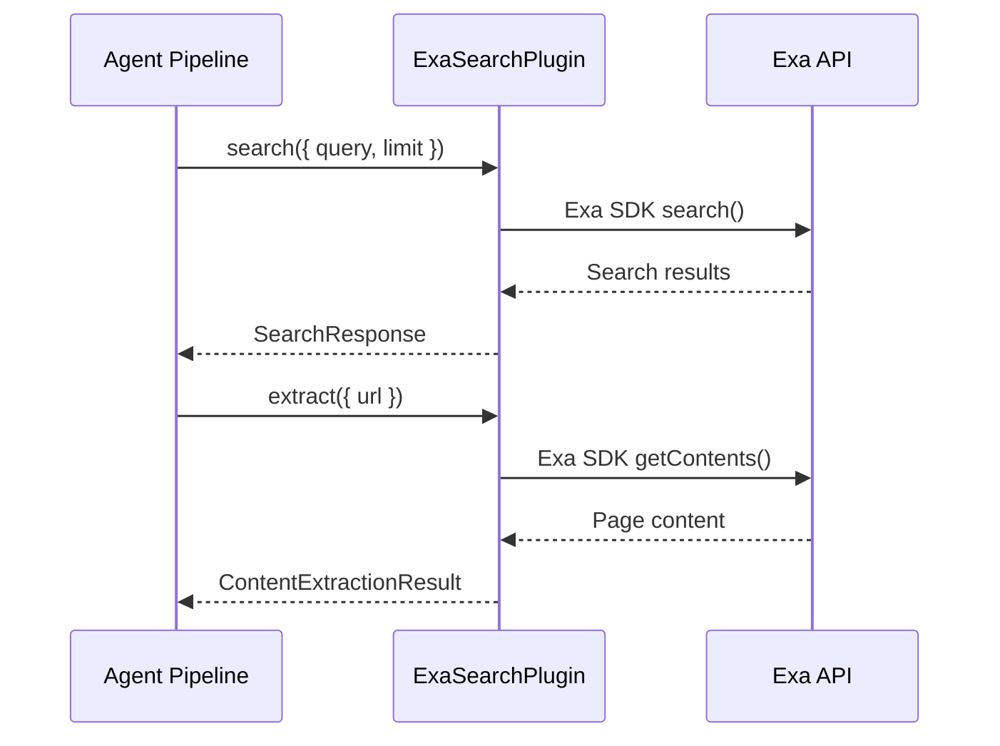

# Exa Search Plugin

The Exa plugin provides AI-native search and content extraction through the [Exa API](https://exa.ai). It supports neural (semantic) search, keyword search, and an auto mode that selects the best approach for each query. The plugin also doubles as a content extractor, pulling clean text from web pages.

**Source:** `packages/plugins/exa/src/exa.plugin.ts`

## Overview

| Property           | Value                         |
| ------------------ | ----------------------------- |
| Plugin ID          | `exa`                         |
| Category           | `search`                      |
| Capabilities       | `search`, `content-extractor` |
| Version            | `1.0.0`                       |
| Configuration Mode | `hybrid`                      |
| Auto-enable        | No                            |
| SDK                | `exa-js`                      |

The plugin implements three interfaces: `IPlugin`, `ISearchPlugin`, and `IContentExtractorPlugin`.

## Architecture



## Configuration

### Settings Schema

| Setting      | Type     | Required | Default | Env Variable         | Description                                    |
| ------------ | -------- | -------- | ------- | -------------------- | ---------------------------------------------- |
| `apiKey`     | `string` | Yes      | --      | `PLUGIN_EXA_API_KEY` | Your Exa API key. Marked as secret.            |
| `searchType` | `string` | No       | `auto`  | --                   | Search mode: `auto`, `neural`, or `keyword`.   |
| `maxResults` | `number` | No       | `10`    | --                   | Default max results per search. Range: 1--100. |
| `category`   | `string` | No       | `""`    | --                   | Category filter for results (see below).       |

### Search Types

| Mode      | Description                                                                               |
| --------- | ----------------------------------------------------------------------------------------- |
| `auto`    | Exa chooses the best approach per query. Recommended for general use.                     |
| `neural`  | Semantic search that understands meaning, not just keywords. Best for conceptual queries. |
| `keyword` | Traditional keyword matching. Best for exact phrases or technical terms.                  |

### Category Filters

Restrict results to a specific content type:

| Category         | Description                   |
| ---------------- | ----------------------------- |
| `company`        | Company websites and pages    |
| `research paper` | Academic papers and research  |
| `news`           | News articles                 |
| `tweet`          | Twitter/X posts               |
| `personal site`  | Personal blogs and portfolios |
| `github`         | GitHub repositories and pages |

Leave empty for unrestricted search across all categories.

## Search Capability

### SearchOptions Mapping

| SearchOptions Field   | Exa SDK Parameter    | Notes                                        |
| --------------------- | -------------------- | -------------------------------------------- |
| `query`               | First argument       | Required search query.                       |
| `limit`               | `numResults`         | Falls back to `settings.maxResults` or `10`. |
| `settings.searchType` | `type`               | `auto`, `neural`, or `keyword`.              |
| `settings.category`   | `category`           | Optional content category filter.            |
| `includeDomains`      | `includeDomains`     | Restrict results to these domains.           |
| `excludeDomains`      | `excludeDomains`     | Exclude results from these domains.          |
| `timeRange`           | `startPublishedDate` | Converted to ISO date relative to now.       |

### Time Range Conversion

```typescript
const TIME_RANGE_DAYS: Record<string, number> = {
	day: 1,
	week: 7,
	month: 30,
	year: 365
};
// Converted to: new Date(Date.now() - days * 86400000).toISOString()
```

### Response Format

Each `SearchResult` includes:

| Field           | Source                 |
| --------------- | ---------------------- |
| `title`         | `result.title`         |
| `url`           | `result.url`           |
| `publishedDate` | `result.publishedDate` |
| `source`        | `result.author`        |
| `faviconUrl`    | `result.favicon`       |
| `position`      | 1-based index          |

## Content Extraction Capability

The Exa plugin implements `IContentExtractorPlugin`, providing two extraction methods.

### Single URL Extraction

```typescript
const result = await exaPlugin.extract({
	url: 'https://example.com/article',
	settings: { apiKey: 'exa-...' }
});
// result.content contains the extracted text
```

The `extract()` method calls `client.getContents()` with `text: true` and `livecrawl: 'fallback'`. The `livecrawl` option uses live crawling as a backup when cached content is unavailable.

### Batch Extraction

```typescript
const results = await exaPlugin.extractBatch(['https://example.com/page1', 'https://example.com/page2'], {
	settings: { apiKey: 'exa-...' }
});
```

Batch extraction sends all URLs in a single API call. On failure, it returns error results for every URL rather than throwing.

### Supported Formats

The content extractor returns `text` format only:

```typescript
getSupportedFormats(): readonly ('text' | 'html' | 'markdown')[] {
  return ['text'];
}
```

### URL Validation

The `canExtract()` method accepts any `http:` or `https:` URL.

## Error Handling

| Scenario                    | Behavior                                                                  |
| --------------------------- | ------------------------------------------------------------------------- |
| Missing API key             | Throws `Error` with message pointing to settings or `PLUGIN_EXA_API_KEY`. |
| Search failure              | Logs error via context logger, re-throws to caller.                       |
| Extraction failure (single) | Returns `{ success: false, error: '...' }` instead of throwing.           |
| Extraction failure (batch)  | Returns error results for all URLs in the batch.                          |

## Client Instantiation

A new `Exa` client is created for each operation using the API key from settings:

```typescript
private getClient(settings?: PluginSettings): Exa {
  const apiKey = settings?.apiKey as string;
  if (!apiKey) {
    throw new Error(API_KEY_ERROR);
  }
  return new Exa(apiKey);
}
```

This per-request approach ensures that user-scoped API keys are always applied correctly.

## Lifecycle

| Method            | Behavior                                                            |
| ----------------- | ------------------------------------------------------------------- |
| `onLoad(context)` | Stores plugin context for logging.                                  |
| `onUnload()`      | Clears stored context.                                              |
| `healthCheck()`   | Returns `healthy` (actual availability depends on a valid API key). |
| `isAvailable()`   | Always returns `true`.                                              |

## Usage in the Platform

Exa serves dual roles during work generation:

1. **Search provider** -- Finds semantically relevant information about work items using neural search.
2. **Content extractor** -- Pulls clean text from discovered web pages to enrich work descriptions.



## Rate Limits

Rate limit tracking is not performed client-side (`getRateLimitInfo()` returns `-1` for both fields). Exa enforces limits at the API level based on your account plan.
