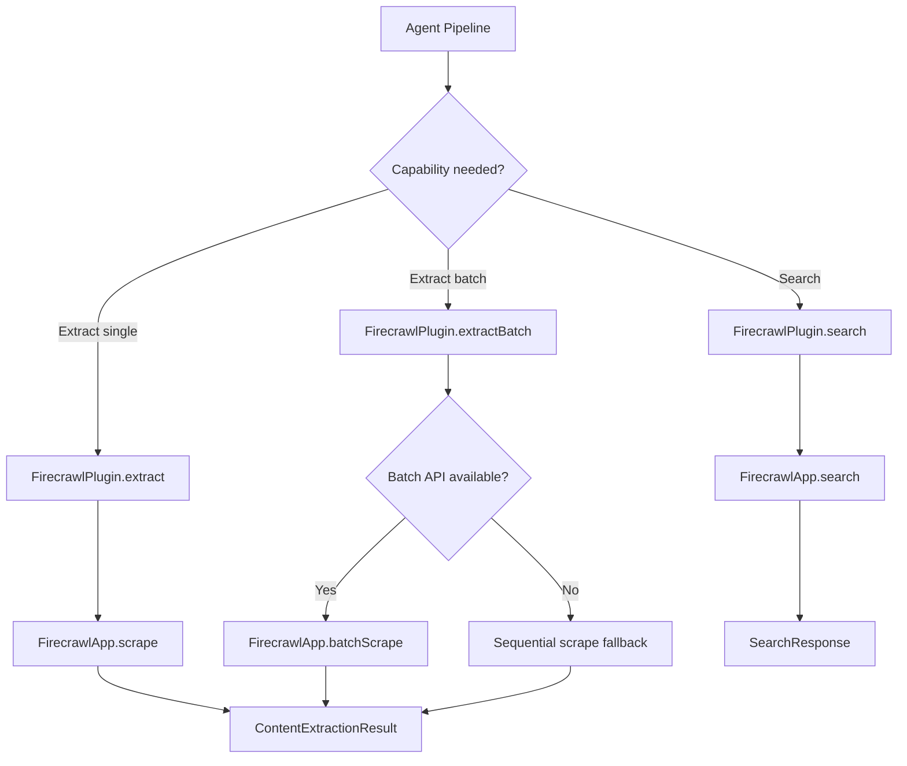
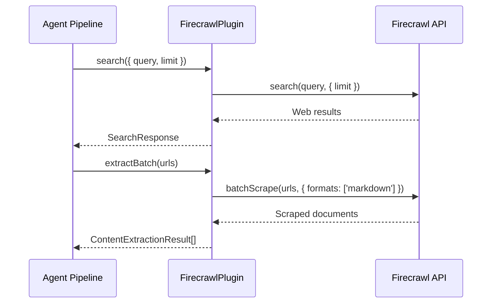

# Firecrawl Plugin

The Firecrawl plugin provides web search and content extraction through the [Firecrawl API](https://firecrawl.dev). Firecrawl specializes in scraping JavaScript-rendered pages, bypassing anti-bot protections, and returning clean, well-structured markdown.

**Source:** `packages/plugins/firecrawl/src/firecrawl.plugin.ts`

## Overview

| Property           | Value                         |
| ------------------ | ----------------------------- |
| Plugin ID          | `firecrawl`                   |
| Category           | `search`                      |
| Capabilities       | `search`, `content-extractor` |
| Version            | `1.0.0`                       |
| Configuration Mode | `hybrid`                      |
| Auto-enable        | No                            |
| SDK                | `@mendable/firecrawl-js`      |

The plugin implements `IPlugin`, `ISearchPlugin`, and `IContentExtractorPlugin`.

## Architecture



## Configuration

### Settings Schema

| Setting  | Type     | Required | Env Variable               | Description                               |
| -------- | -------- | -------- | -------------------------- | ----------------------------------------- |
| `apiKey` | `string` | Yes      | `PLUGIN_FIRECRAWL_API_KEY` | Your Firecrawl API key. Marked as secret. |

### Obtaining an API Key

1. Create an account at [firecrawl.dev](https://firecrawl.dev).
2. Copy your API key from the dashboard.
3. Enter it in the plugin settings or set the `PLUGIN_FIRECRAWL_API_KEY` environment variable.

## Search Capability

The search method uses the Firecrawl SDK's `search()` function:

```typescript
const response = await client.search(options.query, {
	limit: options.limit
});
```

### Response Mapping

Results are extracted from the `response.web` array and mapped to `SearchResult`:

| Field      | Source                   | Fallback        |
| ---------- | ------------------------ | --------------- |
| `title`    | `item.title`             | `""`            |
| `url`      | `item.url`               | `""`            |
| `snippet`  | `item.description`       | `item.markdown` |
| `position` | 1-based index            | --              |
| `source`   | Hostname from `item.url` | `undefined`     |

The search response always sets `hasMore: false` since Firecrawl does not provide pagination information.

## Content Extraction

### Single Page Scraping

The `extract()` method scrapes a single URL using Firecrawl's `scrape()` function with markdown output:

```typescript
const doc = await client.scrape(options.url, {
	formats: ['markdown']
});
```

#### Extraction Result

| Field         | Description                                                    |
| ------------- | -------------------------------------------------------------- |
| `content`     | Clean markdown extracted from the page                         |
| `markdown`    | Same as `content`                                              |
| `title`       | From `doc.metadata.title`                                      |
| `finalUrl`    | Resolved URL from `doc.metadata.url` (if different from input) |
| `wordCount`   | Word count from splitting markdown on whitespace               |
| `readingTime` | `Math.ceil(wordCount / 200)` minutes                           |

If the scrape returns empty markdown, the method returns `{ success: false }` with an appropriate error message.

### Batch Scraping

The `extractBatch()` method attempts two strategies:

1. **Batch API (preferred):** Calls `client.batchScrape()` with all URLs in a single request.
2. **Sequential fallback:** If the batch API fails, falls back to `Promise.allSettled()` calling `extract()` for each URL individually.

```typescript
// Strategy 1: Batch API
try {
	const job = await client.batchScrape([...urls], {
		options: { formats: ['markdown'] }
	});
	if (job.data && job.data.length > 0) {
		return job.data.map(/* ... */);
	}
} catch {
	// Strategy 2: Sequential fallback
}

const results = await Promise.allSettled(urls.map((url) => this.extract({ url, ...options })));
```

The sequential fallback uses `Promise.allSettled()` instead of `Promise.all()` to ensure that individual failures do not prevent other URLs from being processed.

### Supported Formats

```typescript
getSupportedFormats(): readonly ('text' | 'html' | 'markdown')[] {
  return ['markdown'];
}
```

Firecrawl returns markdown only. This is its primary strength -- it handles JavaScript rendering and produces clean markdown from any page.

## Key Advantages

| Feature              | Description                                                    |
| -------------------- | -------------------------------------------------------------- |
| JavaScript rendering | Handles dynamic/SPA pages that simple HTTP fetches miss        |
| Anti-bot bypass      | Automatically handles common protections like CAPTCHAs         |
| Clean output         | Returns well-structured markdown, stripping ads and navigation |
| Metadata extraction  | Captures page title, description, and final URL                |
| Batch processing     | Native batch API for efficient multi-URL extraction            |

## Client Instantiation

A new `FirecrawlApp` instance is created for each operation:

```typescript
private getClient(settings?: PluginSettings): FirecrawlApp {
  const apiKey = settings?.apiKey as string;
  if (!apiKey) {
    throw new Error(API_KEY_ERROR);
  }
  return new FirecrawlApp({ apiKey });
}
```

## Error Handling

| Scenario                      | Behavior                                                                 |
| ----------------------------- | ------------------------------------------------------------------------ |
| Missing API key               | Throws `Error` with descriptive message.                                 |
| Search failure                | Logs error, re-throws to caller.                                         |
| Single extraction failure     | Returns `{ success: false, error: '...' }`.                              |
| Batch API failure             | Falls back to sequential extraction.                                     |
| Sequential extraction failure | Uses `Promise.allSettled()` -- individual failures return error results. |
| Empty content                 | Returns `{ success: false, error: 'No content extracted' }`.             |

## Rate Limits

Rate limit tracking is not performed client-side (`getRateLimitInfo()` returns `-1`). Firecrawl enforces limits at the API level. Typical plan limits:

| Plan     | Credits/Month | Pages/Scrape |
| -------- | ------------- | ------------ |
| Free     | 500           | 1            |
| Starter  | 3,000         | Configurable |
| Standard | 100,000       | Configurable |

## Lifecycle

| Method            | Behavior                                      |
| ----------------- | --------------------------------------------- |
| `onLoad(context)` | Stores plugin context.                        |
| `onUnload()`      | Clears context.                               |
| `healthCheck()`   | Returns `healthy`.                            |
| `isAvailable()`   | Returns `true`.                               |
| `canExtract(url)` | Returns `true` for `http:` and `https:` URLs. |

## Usage in the Platform

Firecrawl is particularly valuable for works that reference JavaScript-heavy websites. During generation:

1. **Search** finds relevant pages about each work item.
2. **Content extraction** scrapes those pages -- including SPAs and dynamically-rendered content -- into clean markdown for enriching item descriptions.


