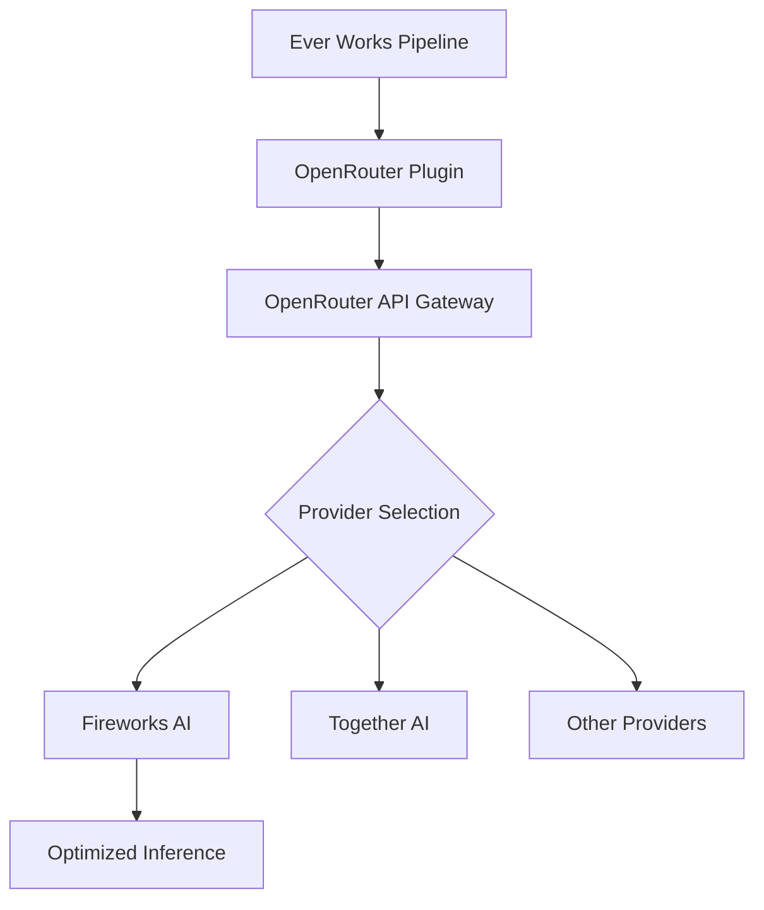
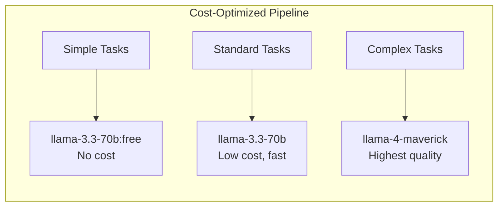

# Fireworks AI Models via OpenRouter

Ever Works does not ship a standalone Fireworks AI plugin. Fireworks AI is one of the inference providers that OpenRouter routes requests to when you select open-source models. This page explains how Fireworks AI fits into the Ever Works AI pipeline and how to take advantage of its fast inference.

**Related source files:**

| File                                                   | Purpose                           |
| ------------------------------------------------------ | --------------------------------- |
| `packages/plugins/openrouter/src/openrouter.plugin.ts` | OpenRouter AI provider plugin     |
| `packages/plugin/src/ai/reasoning.utils.ts`            | Reasoning configuration utilities |

## What is Fireworks AI?

Fireworks AI is a fast-inference platform for open-source AI models. It specializes in optimized serving of models like Llama, Mistral, and Qwen, often achieving faster response times than other providers. When you use open-source models through OpenRouter in Ever Works, Fireworks AI may be one of the backend providers handling your requests.

## How OpenRouter Uses Fireworks AI

OpenRouter acts as a routing layer. When you select a model such as `meta-llama/llama-3.3-70b-instruct`, OpenRouter can route the request to whichever provider offers the best combination of price, speed, and availability -- including Fireworks AI.



You do not choose Fireworks AI directly. Instead, you choose a model, and OpenRouter handles provider selection automatically.

### Provider Preferences

OpenRouter allows users to set provider preferences on their account. If you want to ensure requests are routed to Fireworks AI specifically:

1. Log in to your [OpenRouter account](https://openrouter.ai).
2. Navigate to account settings.
3. Set provider preferences for your preferred models.

These preferences are applied at the OpenRouter level, outside of Ever Works configuration.

## Models Commonly Served by Fireworks AI

Fireworks AI typically serves open-source models. Common models that may be routed to Fireworks AI include:

| Model ID (OpenRouter)               | Description        |
| ----------------------------------- | ------------------ |
| `meta-llama/llama-3.3-70b-instruct` | Meta Llama 3.3 70B |
| `meta-llama/llama-4-scout`          | Meta Llama 4 Scout |
| `mistralai/mistral-large`           | Mistral Large      |
| `qwen/qwen-2.5-72b-instruct`        | Qwen 2.5 72B       |

## Configuration in Ever Works

Since Fireworks AI is accessed transparently through OpenRouter, no special configuration is needed beyond setting up the OpenRouter plugin:

1. Enable the **OpenRouter** plugin (enabled by default).
2. Enter your OpenRouter API key.
3. Select the open-source models you want to use.

### Environment Variables

```bash
PLUGIN_OPENROUTER_API_KEY=sk-or-...
PLUGIN_OPENROUTER_DEFAULT_MODEL=meta-llama/llama-3.3-70b-instruct
```

## Performance Characteristics

Fireworks AI is known for fast inference times. This benefits Ever Works in several ways:

| Benefit                         | Description                                                |
| ------------------------------- | ---------------------------------------------------------- |
| **Faster work generation** | Items are processed more quickly during pipeline execution |
| **Lower latency AI chat**       | Conversational responses arrive faster                     |
| **Better throughput**           | More items can be processed in parallel                    |

### Speed Comparison

| Provider                      | Relative Speed              | Cost              |
| ----------------------------- | --------------------------- | ----------------- |
| Fireworks AI (via OpenRouter) | Fast                        | Per-token, varies |
| Groq (direct)                 | Very fast (custom hardware) | Free tier + paid  |
| Ollama (local)                | Depends on hardware         | Free              |
| OpenAI (direct)               | Standard                    | Per-token         |

If raw inference speed is your top priority and you want open-source models, consider the **Groq** plugin as a direct alternative. Groq uses custom LPU hardware and offers the fastest inference for supported models.

## Tiered Strategy with Fireworks-Served Models



| Tier     | Model                                    | Why                                     |
| -------- | ---------------------------------------- | --------------------------------------- |
| Simple   | `meta-llama/llama-3.3-70b-instruct:free` | Zero cost for tags and classifications  |
| Standard | `meta-llama/llama-3.3-70b-instruct`      | Good quality, fast via Fireworks AI     |
| Complex  | `meta-llama/llama-4-maverick`            | Best open-source quality for full pages |

## Capabilities

Models served by Fireworks AI through OpenRouter support standard capabilities:

| Capability               | Supported       |
| ------------------------ | --------------- |
| Structured output (JSON) | Yes             |
| Streaming                | Yes             |
| Tool calling             | Model-dependent |
| Vision                   | Model-dependent |
| Embeddings               | Generally no    |

## Comparison: Fireworks AI vs Groq vs Ollama

| Aspect        | Fireworks AI (via OpenRouter) | Groq (direct plugin) | Ollama (direct plugin) |
| ------------- | ----------------------------- | -------------------- | ---------------------- |
| Access method | Transparent via OpenRouter    | Dedicated plugin     | Dedicated plugin       |
| API key       | OpenRouter key                | Groq key             | None required          |
| Speed         | Fast                          | Very fast            | Hardware-dependent     |
| Cost          | Per-token                     | Free tier available  | Free                   |
| Privacy       | Cloud-hosted                  | Cloud-hosted         | Local                  |
| Model control | OpenRouter selects provider   | Fixed to Groq        | Full local control     |
| Embeddings    | No                            | No                   | Yes                    |

## Troubleshooting

| Issue                            | Cause                                                          | Solution                                                |
| -------------------------------- | -------------------------------------------------------------- | ------------------------------------------------------- |
| Cannot select Fireworks directly | OpenRouter handles routing                                     | Use OpenRouter provider preferences for routing control |
| Slow response times              | Not routed to Fireworks AI                                     | Check OpenRouter provider preferences                   |
| Rate limit errors                | Provider-level rate limits                                     | Upgrade your OpenRouter plan or switch providers        |
| Model quality varies             | Different providers may serve slightly different quantizations | Pin provider preferences in your OpenRouter account     |

## Further Reading

- [OpenRouter Plugin](./openrouter-plugin.md) -- complete OpenRouter configuration
- [Groq Plugin](./groq-plugin.md) -- dedicated fast-inference plugin
- [Ollama Plugin](./ollama-plugin.md) -- local inference option
- [Together AI Models](./together-plugin.md) -- another open-source model provider
- [AI Provider Plugins](./ai-provider-plugins.md) -- overview of all providers
