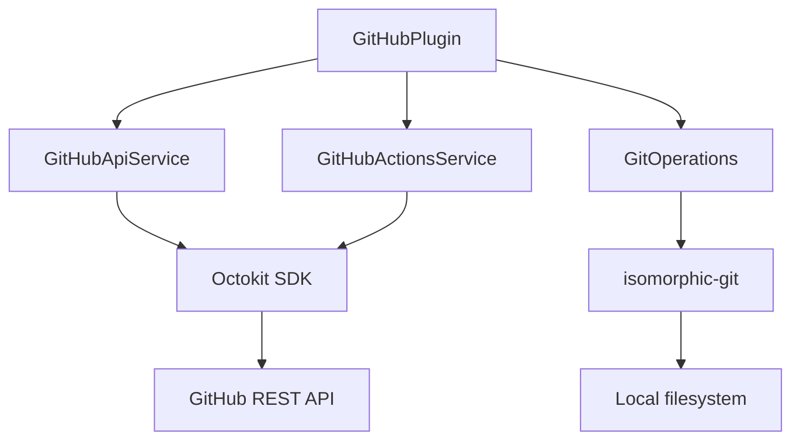
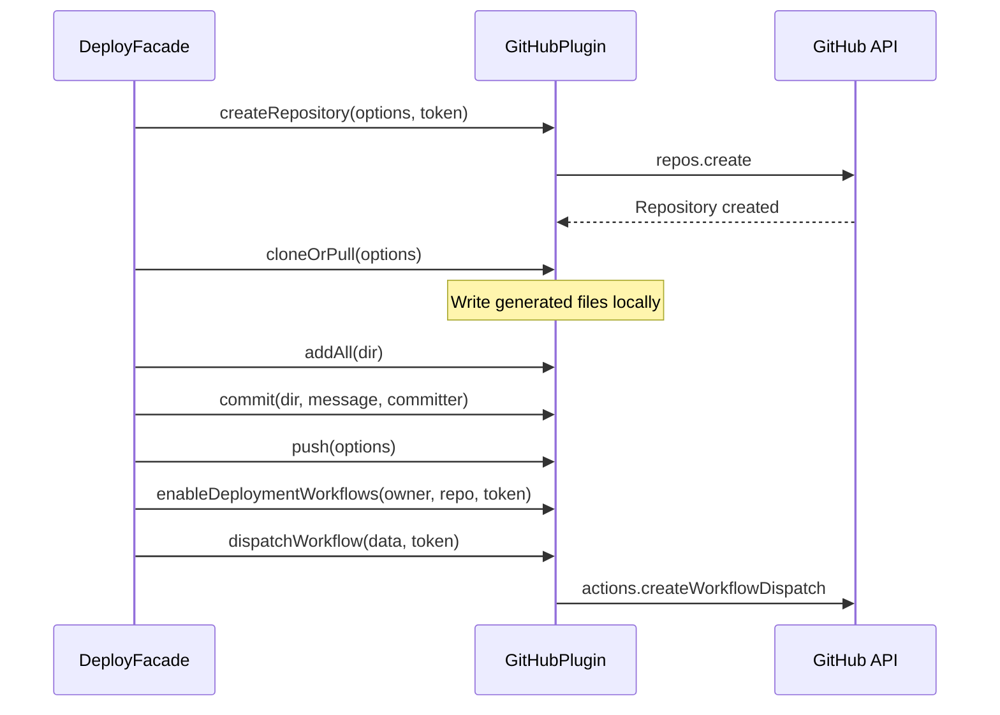

# GitHub Plugin

The GitHub plugin is a core system plugin that provides Git operations, repository management, pull request workflows, and OAuth authentication through the GitHub API. It is the backbone of the deployment pipeline, managing the repositories that store generated directory content.

**Source:** `packages/plugins/github/src/`

## Overview

| Property | Value |
|---|---|
| Plugin ID | `github` |
| Category | `git-provider` |
| Capabilities | `git-provider`, `oauth` |
| Version | `1.0.0` |
| Configuration Mode | `admin-only` |
| System Plugin | Yes |
| Auto-enable | Yes |
| Visibility | `user-only` |

The plugin implements `IPlugin`, `IGitProviderPlugin`, and `IOAuthPlugin`. As a system plugin, it is automatically enabled and its configuration is managed by platform administrators.

## Architecture

The plugin is composed of three layers:



| Component | Source File | Responsibility |
|---|---|---|
| `GitHubPlugin` | `github.plugin.ts` | Main plugin class, interface adapter |
| `GitHubApiService` | `github-api.service.ts` | Remote GitHub API operations via Octokit |
| `GitHubActionsService` | `github-actions.service.ts` | GitHub Actions workflow and secret management |
| `GitOperations` | `@ever-works/plugin/git` | Local git operations via isomorphic-git |

## Configuration

### Settings Schema

| Setting | Type | Scope | Env Variable | Description |
|---|---|---|---|---|
| `clientId` | `string` | `global` | `PLUGIN_GITHUB_CLIENT_ID` | GitHub OAuth App Client ID. Admin-only. |
| `clientSecret` | `string` | `user` | `PLUGIN_GITHUB_CLIENT_SECRET` | GitHub OAuth App Client Secret. Secret, admin-only. |
| `apiBaseUrl` | `string` | `global` | -- | API base URL for GitHub Enterprise. Default: `https://api.github.com`. Hidden. |

Configuration is admin-only because the OAuth credentials are shared across the platform.

## Authentication

### Git Authentication

The `getAuth()` method returns credentials for Git operations:

```typescript
getAuth(token: string): GitAuth {
  return { username: 'x-access-token', password: token };
}
```

This format is used by isomorphic-git for HTTPS-based Git operations.

### OAuth Flow

The plugin implements the `IOAuthPlugin` interface for GitHub-based sign-in:

| Method | Purpose |
|---|---|
| `getAuthorizationUrl(state, config)` | Builds `github.com/login/oauth/authorize` URL with scopes |
| `exchangeCodeForToken(code, config)` | Exchanges authorization code for access token |
| `getAuthenticatedUser(token)` | Returns user profile from the token |

#### Default OAuth Scopes

```typescript
const DEFAULT_SCOPES = [
  'user:email',        // Read user email
  'read:user',         // Read user profile
  'repo',              // Full repo access
  'delete_repo',       // Delete repositories
  'workflow',          // Manage GitHub Actions
  'write:repo_hook',   // Create webhooks
  'read:org',          // Read organization membership
  'project'            // Access projects
] as const;
```

## Repository Operations

All remote repository operations go through `GitHubApiService`, which uses the `Octokit` SDK:

### CRUD Operations

| Method | Description |
|---|---|
| `getRepository(owner, repo, token)` | Get repository details. Returns `null` on 404. |
| `listRepositories(token, page, perPage, options)` | List user/org repositories, sorted by `updated`. |
| `createRepository(options, token)` | Create repo under user or organization. Checks for existing first. |
| `deleteRepository(owner, repo, token)` | Delete a repository. |
| `updateRepository(owner, repo, data, token)` | Update privacy and description. |
| `hasRepositoryAccess(owner, repo, token)` | Check if token has access to a repo. |
| `repositoryExists(owner, repo, token)` | Check if repository exists. |

### List Repositories Options

```typescript
interface ListRepositoriesOptions {
  type?: 'user' | 'org';   // Filter by owner type
  owner?: string;           // Organization name (when type is 'org')
}
```

### Fork and Template Operations

| Method | Description |
|---|---|
| `forkRepository(owner, repo, options, token)` | Fork a repo. Polls up to 2 minutes for fork to become available. |
| `createRepositoryFromTemplate(templateOwner, templateRepo, options, token)` | Create repo from a template. |
| `hasForkRelationship(forkOwner, forkRepo, parentOwner, parentRepo, token)` | Check parent-fork relationship. |

## Branch Operations

| Method | Description |
|---|---|
| `listBranches(owner, repo, token)` | List all branches with pagination. Marks default and protected branches. |
| `createBranch(owner, repo, name, fromRef, token)` | Create branch from an existing ref. |
| `deleteBranch(owner, repo, name, token)` | Delete a branch. |
| `getLatestCommit(owner, repo, branch, token)` | Get the latest commit on a branch. |

## Pull Request Operations

| Method | Description |
|---|---|
| `createPullRequest(options, token)` | Create a PR with title, head, base, body, and draft flag. |
| `getPullRequest(owner, repo, prNumber, token)` | Get PR details. |
| `mergePullRequest(owner, repo, prNumber, options, token)` | Merge a PR. Supports `merge`, `squash`, and `rebase` methods. |
| `listPullRequests(owner, repo, options, token)` | List PRs filtered by state. |
| `getPullRequestFiles(owner, repo, prNumber, token)` | Get files changed in a PR. |
| `createPullRequestComment(owner, repo, prNumber, body, token)` | Add a comment to a PR. |
| `closePullRequest(owner, repo, prNumber, token)` | Close a PR without merging. |

## Content Access

| Method | Description |
|---|---|
| `getFileContent(owner, repo, path, ref, token)` | Read a file from a repo. Base64-decoded to UTF-8. |
| `getReadme(owner, repo, ref, token)` | Get README using the dedicated API, with fallback file lookup. |
| `getRawFileUrl(owner, repo, branch, path)` | Build `raw.githubusercontent.com` URL. |
| `getDirectoryContents(owner, repo, path, token)` | List files and directories at a path. |

## GitHub Actions Service

The `GitHubActionsService` manages CI/CD workflows:

### Secrets and Variables

| Method | Description |
|---|---|
| `getRepositoryPublicKey(owner, repo, token)` | Get the repo's public key for encrypting secrets. |
| `setActionSecret(data, publicKey, token)` | Create or update a repository secret. Uses `libsodium-wrappers` for encryption. |
| `setActionVariable(data, token)` | Create or update a repository variable. Updates existing, creates if 404. |

### Workflow Management

| Method | Description |
|---|---|
| `listWorkflows(owner, repo, token)` | List all workflows in a repo. |
| `enableWorkflow(owner, repo, workflowId, token)` | Enable a workflow. |
| `disableWorkflow(owner, repo, workflowId, token)` | Disable a workflow. |
| `enableDeploymentWorkflows(owner, repo, token)` | Enable deployment-related workflows, disable others. |
| `dispatchWorkflow(data, token)` | Trigger a workflow dispatch event. |

### Active Workflow Configuration

The plugin defines which workflows are considered deployment workflows:

```typescript
const ACTIVE_WORKFLOW_NAMES = ['Vercel Deployment', 'Production deployment'] as const;
const ACTIVE_WORKFLOW_FILES = [
  '.github/workflows/deploy_vercel.yaml',
  '.github/workflows/deploy_prod.yaml'
] as const;
```

`enableDeploymentWorkflows()` enables these and disables all others, with an optional 7-second delay to allow newly created repos to register their workflows.

## Local Git Operations

Local git operations are provided by `GitOperations` from `@ever-works/plugin/git`:

| Method | Description |
|---|---|
| `cloneOrPull(options)` | Clone a repo or pull if it already exists locally. |
| `pull(dir, token, committer)` | Pull latest changes. |
| `add(dir, paths)` | Stage specific files. |
| `addAll(dir)` | Stage all changes. |
| `commit(dir, message, committer)` | Create a commit. |
| `push(options)` | Push to remote. |
| `getCurrentBranch(dir)` | Get current branch name. |
| `switchBranch(dir, branch, create)` | Switch branches, optionally creating a new one. |
| `getStatus(dir)` | List file changes. |
| `getLocalDir(owner, repo)` | Get the local directory path for a repo. |

## Error Handling

The plugin uses Octokit's `RequestError` for error classification:

- **404 errors**: Returned as `null` from get methods, `false` from check methods, or `[]` from list methods.
- **403 errors**: Treated similarly to 404 for access checks.
- **Other errors**: Re-thrown to the caller.

## Usage in the Deployment Pipeline


