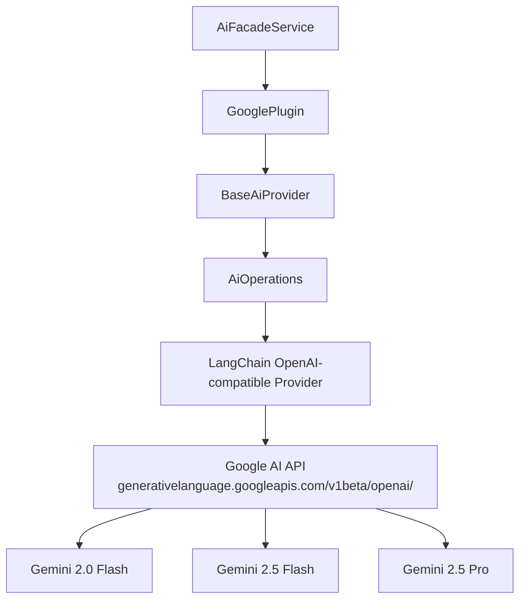
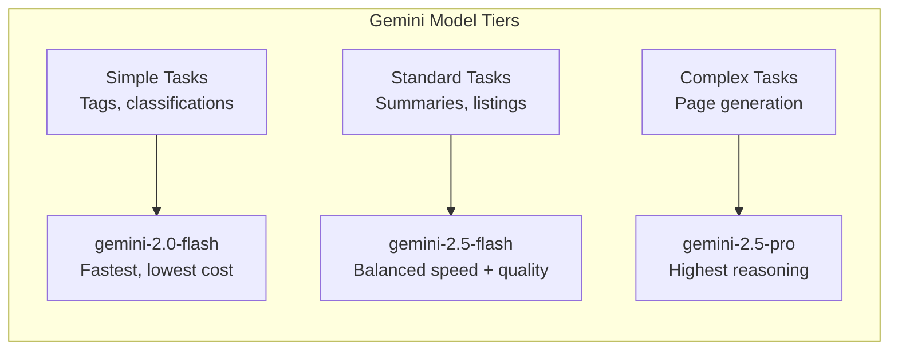
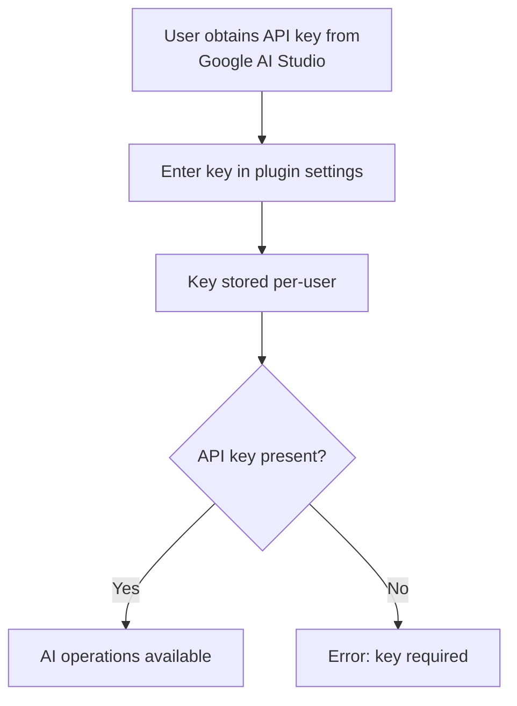
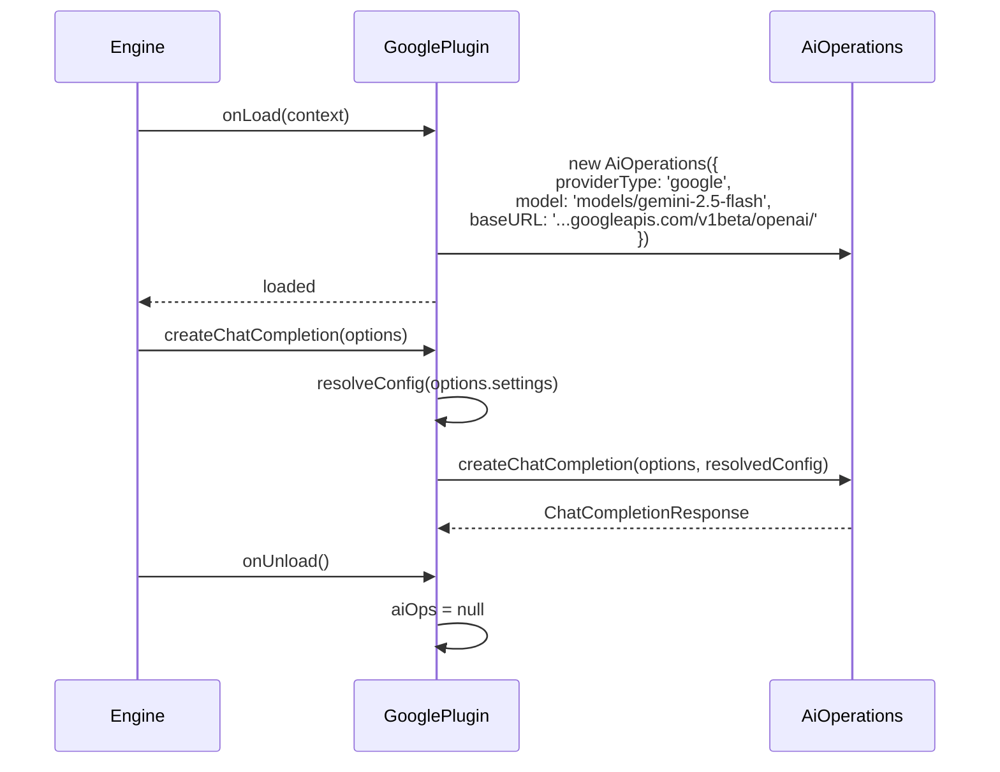

# Google Gemini AI Provider Plugin

The Google Gemini plugin connects Ever Works to Google's Gemini models, offering an exceptionally large context window (up to 1 million tokens), built-in embedding models, and vision capabilities. It extends `BaseAiProvider` and communicates with Google's API through an OpenAI-compatible endpoint.

**Source:** `packages/plugins/google/src/google.plugin.ts`

## Overview

| Property           | Value                       |
| ------------------ | --------------------------- |
| Plugin ID          | `google`                    |
| Package            | `@ever-works/google-plugin` |
| Category           | `ai-provider`               |
| Capabilities       | `ai-provider`               |
| Version            | `1.0.0`                     |
| Configuration Mode | `user-required`             |
| Provider Type      | `google`                    |
| Auto-enable        | No                          |
| Built-in           | Yes                         |
| Visibility         | `public`                    |

## Architecture



Google provides an OpenAI-compatible API endpoint at `https://generativelanguage.googleapis.com/v1beta/openai/`, which means the plugin reuses the same LangChain OpenAI provider with a custom `baseURL`.

## Configuration

### Settings Schema

| Setting        | Type     | Required | Default                                                    | Scope    | Widget         | Description                                          |
| -------------- | -------- | -------- | ---------------------------------------------------------- | -------- | -------------- | ---------------------------------------------------- |
| `apiKey`       | `string` | Yes      | --                                                         | `user`   | --             | Google AI API key. Secret.                           |
| `defaultModel` | `string` | Yes      | `models/gemini-2.5-flash`                                  | `global` | `model-select` | Default model for all AI tasks.                      |
| `simpleModel`  | `string` | No       | `models/gemini-2.0-flash`                                  | `global` | `model-select` | Model for tags, descriptions, classifications.       |
| `mediumModel`  | `string` | No       | `models/gemini-2.5-flash`                                  | `global` | `model-select` | Model for listings, summaries, reformatting.         |
| `complexModel` | `string` | No       | `models/gemini-2.5-pro`                                    | `global` | `model-select` | Model for full page generation, multi-step analysis. |
| `temperature`  | `number` | No       | `0.7`                                                      | --       | --             | Sampling temperature (0--2). Hidden.                 |
| `maxTokens`    | `number` | No       | `4096`                                                     | --       | --             | Max tokens per response. Hidden.                     |
| `baseUrl`      | `string` | No       | `https://generativelanguage.googleapis.com/v1beta/openai/` | --       | --             | API endpoint. Hidden.                                |

### Model Tiers



| Tier     | Default Model             | Strengths                                                |
| -------- | ------------------------- | -------------------------------------------------------- |
| Simple   | `models/gemini-2.0-flash` | Fast inference, low cost, good for structured extraction |
| Standard | `models/gemini-2.5-flash` | Strong reasoning with thinking, balanced performance     |
| Complex  | `models/gemini-2.5-pro`   | Advanced reasoning, best quality output                  |

### Model Naming Convention

Google Gemini models use a `models/` prefix:

```
models/gemini-2.0-flash
models/gemini-2.5-flash
models/gemini-2.5-pro
```

## Capabilities

| Capability         | Supported            | Details                                      |
| ------------------ | -------------------- | -------------------------------------------- |
| Structured Output  | Yes                  | JSON mode and schema-constrained generation  |
| Streaming          | Yes                  | Server-sent events for incremental responses |
| Tool Calling       | Yes                  | Function calling for structured tasks        |
| Vision             | Yes                  | Image analysis and understanding             |
| Max Context Length | **1,048,576 tokens** | 1M token context window                      |

The 1 million token context window is the largest among all AI provider plugins, making Gemini ideal for processing large volumes of source material during work generation.

### Context Window Comparison

| Provider                   | Max Context          |
| -------------------------- | -------------------- |
| **Google Gemini**          | **1,048,576 tokens** |
| Mistral                    | 128,000 tokens       |
| OpenAI (via OpenRouter)    | 128,000 tokens       |
| Anthropic (via OpenRouter) | 200,000 tokens       |

## Usage Examples

```typescript
// Chat completion
const response = await googlePlugin.createChatCompletion({
	messages: [{ role: 'user', content: 'Describe this business' }],
	settings: { apiKey: 'AIza...' }
});

// Streaming
for await (const chunk of googlePlugin.createStreamingChatCompletion({
	messages: [{ role: 'user', content: 'Write a detailed description' }],
	settings: { apiKey: 'AIza...' }
})) {
	process.stdout.write(chunk.content ?? '');
}

// Embeddings
const embedding = await googlePlugin.createEmbedding({
	input: 'text for semantic search'
});

// Structured JSON output
const result = await googlePlugin.askJson('Generate category taxonomy', {
	settings: { apiKey: 'AIza...' }
});

// List available models
const models = await googlePlugin.listModels({ apiKey: 'AIza...' });

// Test connectivity
const available = await googlePlugin.isAvailable({ apiKey: 'AIza...' });
```

## Configuration Mode

Google Gemini uses `user-required` configuration mode. Each user must provide their own Google AI API key -- there is no admin-level shared key option.



## Why Use Gemini?

| Advantage         | Description                                                      |
| ----------------- | ---------------------------------------------------------------- |
| Extended context  | Process up to 1M tokens -- ideal for large source documents      |
| Embedding support | Built-in text-embedding models for semantic search               |
| Cost-efficient    | Gemini Flash models deliver strong results at low per-token cost |
| Vision            | Analyze images and screenshots during content generation         |
| Thinking models   | Gemini 2.5 models use extended thinking for better reasoning     |

## Lifecycle



## Health Check

```typescript
async healthCheck(): Promise<PluginHealthCheck> {
    return {
        status: 'healthy',
        message: 'Google Gemini plugin is ready',
        checkedAt: Date.now()
    };
}
```

To verify API connectivity, call `isAvailable()` with a valid API key. This invokes `testConnection()` against the Google API.

## Dependencies

| Package              | Version   | Purpose                              |
| -------------------- | --------- | ------------------------------------ |
| `@ever-works/plugin` | workspace | Plugin contracts and base classes    |
| `@langchain/openai`  | ^0.6.17   | LangChain OpenAI-compatible provider |
| `@langchain/core`    | ^0.3.80   | LangChain core abstractions          |

## Getting Started

1. Obtain an API key from [Google AI Studio](https://aistudio.google.com/apikey)
2. Enable the Google Gemini plugin in Ever Works
3. Enter your API key in the settings
4. Select preferred Gemini models for each task complexity level
