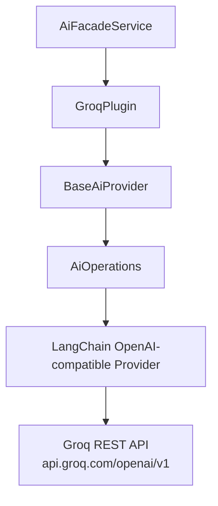
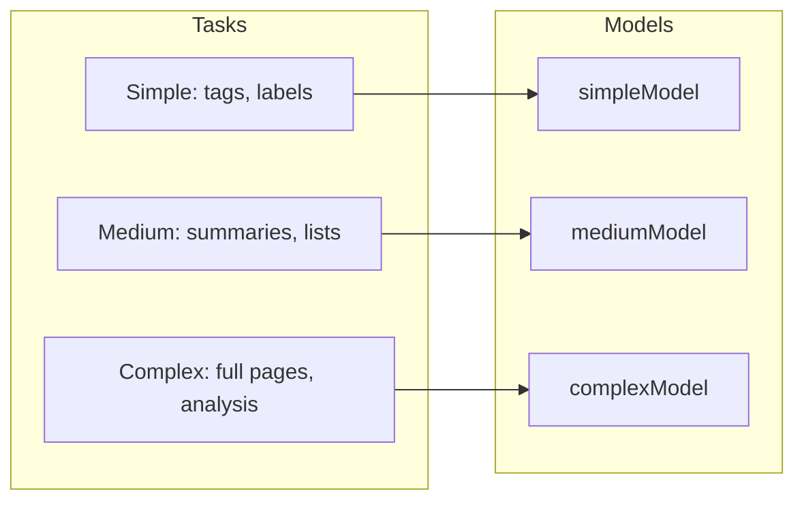

# Groq AI Provider Plugin

The Groq plugin provides ultra-fast AI inference through [Groq's](https://groq.com) custom LPU (Language Processing Unit) hardware. It extends `BaseAiProvider` and uses the shared `AiOperations` layer that wraps LangChain under the hood.

**Source:** `packages/plugins/groq/src/groq.plugin.ts`

## Overview

| Property           | Value           |
| ------------------ | --------------- |
| Plugin ID          | `groq`          |
| Category           | `ai-provider`   |
| Capabilities       | `ai-provider`   |
| Version            | `1.0.0`         |
| Configuration Mode | `user-required` |
| Provider Type      | `groq`          |
| Auto-enable        | No              |
| Built-in           | Yes             |
| Visibility         | `public`        |

Groq runs open-source models such as Llama and Qwen at significantly higher speeds than conventional cloud providers, making it well suited for works with many items where generation speed is a priority.

## Architecture



Groq exposes an OpenAI-compatible API endpoint, so the plugin uses the same `AiOperations` abstraction as other providers. The `providerType: 'groq'` flag ensures LangChain selects the correct configuration.

## Configuration

### Settings Schema

| Setting        | Type     | Default                          | Scope    | Description                                                 |
| -------------- | -------- | -------------------------------- | -------- | ----------------------------------------------------------- |
| `apiKey`       | `string` | (required)                       | `user`   | Groq API key (marked as secret)                             |
| `defaultModel` | `string` | `qwen/qwen3-32b`                 | `global` | Used for all AI tasks unless a tier-specific model is set   |
| `simpleModel`  | `string` | `qwen/qwen3-32b`                 | `global` | Handles tags, short descriptions, and quick classifications |
| `mediumModel`  | `string` | `qwen/qwen3-32b`                 | `global` | Handles listings, summaries, and content reformatting       |
| `complexModel` | `string` | `qwen/qwen3-32b`                 | `global` | Handles full page generation and multi-step analysis        |
| `baseUrl`      | `string` | `https://api.groq.com/openai/v1` | hidden   | Custom API endpoint for proxies or compatible services      |
| `temperature`  | `number` | `0.7`                            | hidden   | Controls output randomness (0--2)                           |
| `maxTokens`    | `number` | `4096`                           | hidden   | Maximum response length                                     |

### Required Fields

- `apiKey` -- users must provide their own Groq API key
- `defaultModel` -- at least one model must be selected

### Schema Extensions

The API key field uses `x-secret: true` to render a masked password input with a show/hide toggle in the dashboard:

```json
{
	"apiKey": {
		"type": "string",
		"title": "Groq API Key",
		"x-secret": true,
		"x-scope": "user"
	}
}
```

The `baseUrl` field uses `x-hidden: true` to keep it out of the standard settings UI. It is only needed when routing requests through a proxy.

## Model Capabilities

| Capability                    | Supported      |
| ----------------------------- | -------------- |
| Structured output (JSON mode) | Yes            |
| Streaming responses           | Yes            |
| Tool calling                  | Yes            |
| Vision (image input)          | Yes            |
| Embeddings                    | **No**         |
| Max context length            | 128,000 tokens |

### Embedding Limitation

Groq does not currently support embedding models. Calling `createEmbedding()` throws an error:

```typescript
async createEmbedding(_options: EmbeddingOptions): Promise<EmbeddingResponse> {
    throw new Error('Embeddings not supported by Groq');
}
```

If your workflow requires embeddings (e.g., for semantic search within works), pair Groq with a second provider that supports embeddings, such as OpenAI or Ollama.

## Tiered Model Assignment



| Tier    | Use Cases                                 | Recommended Models                          |
| ------- | ----------------------------------------- | ------------------------------------------- |
| Simple  | Tags, short descriptions, classifications | `llama-3.1-8b-instant`, `gemma2-9b-it`      |
| Medium  | Listings, summaries, content reformatting | `qwen/qwen3-32b`, `llama-3.3-70b-versatile` |
| Complex | Full page generation, multi-step analysis | `qwen/qwen3-32b`, `llama-3.3-70b-versatile` |

If a tier-specific model is not set, the `defaultModel` is used for all tiers.

## Lifecycle

### Loading

```typescript
async onLoad(context: PluginContext): Promise<void> {
    await super.onLoad(context);
    this.aiOps = new AiOperations({
        apiKey: '',
        model: 'qwen/qwen3-32b',
        baseURL: 'https://api.groq.com/openai/v1',
        temperature: 0.7,
        maxTokens: 4096,
        providerType: 'groq'
    });
}
```

The `apiKey` is intentionally empty at load time. It is merged from the user's saved settings via `resolveConfig()` before each request.

### Availability Check

`isAvailable()` calls `AiOperations.testConnection()` with the resolved configuration. It returns `false` if no API key is configured or the connection fails.

## API Methods

| Method                                   | Description                                 |
| ---------------------------------------- | ------------------------------------------- |
| `createChatCompletion(options)`          | Single chat completion request              |
| `createStreamingChatCompletion(options)` | Streaming chat completion (async generator) |
| `createEmbedding(options)`               | **Throws error** -- not supported           |
| `listModels(settings)`                   | List available models from Groq             |
| `isAvailable(settings)`                  | Test API key and connection                 |
| `getCapabilities()`                      | Return supported capabilities               |
| `healthCheck()`                          | Return plugin health status                 |

## Comparison: Groq vs Ollama

| Aspect             | Groq                            | Ollama                      |
| ------------------ | ------------------------------- | --------------------------- |
| Hosting            | Cloud (Groq servers)            | Self-hosted                 |
| API key required   | Yes                             | Usually not                 |
| Speed              | Very fast (custom LPU hardware) | Depends on local hardware   |
| Cost               | Free tier + paid plans          | Free (your own hardware)    |
| Embeddings         | Not supported                   | Supported                   |
| Data privacy       | Data sent to Groq servers       | Data stays local            |
| Model availability | Curated set of models           | Any Ollama-compatible model |

## Getting Started

1. Obtain a free API key from [console.groq.com/keys](https://console.groq.com/keys).
2. Enable the Groq plugin in the Ever Works dashboard under **Settings > Plugins**.
3. Enter your API key in the settings.
4. Select your preferred models for each task complexity tier.
5. Groq will be used for content generation during work builds and AI conversations.

## Troubleshooting

| Issue                   | Cause                            | Solution                                                         |
| ----------------------- | -------------------------------- | ---------------------------------------------------------------- |
| Authentication error    | Invalid or missing API key       | Verify your key at [console.groq.com](https://console.groq.com)  |
| Rate limit exceeded     | Too many requests                | Wait and retry, or upgrade your Groq plan                        |
| Embedding request fails | Groq does not support embeddings | Use a different provider for embeddings                          |
| Model not available     | Model removed from Groq          | Check Groq docs for current model list and update your selection |
| Slow responses          | Network latency to Groq servers  | Check your connection; Groq inference itself is fast             |
