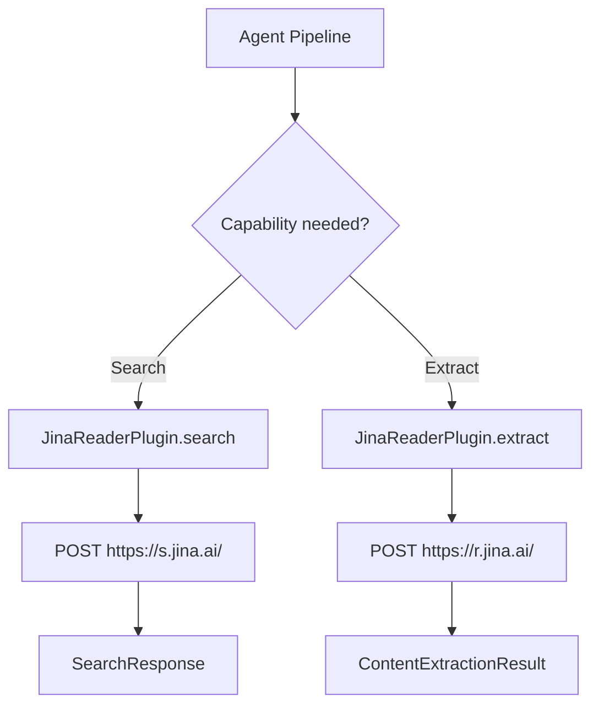
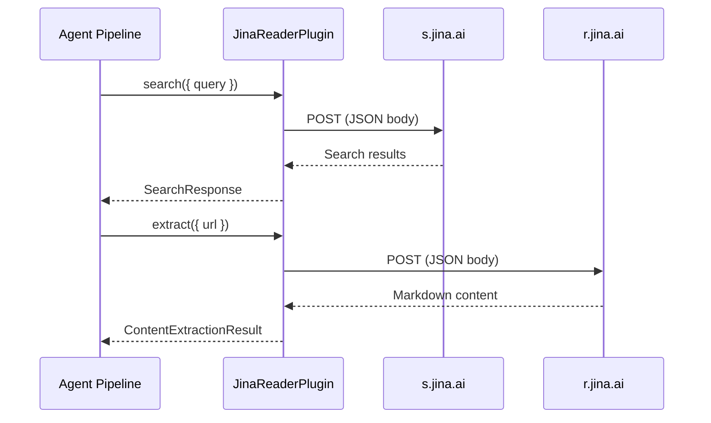

# Jina AI Plugin

The Jina AI plugin provides web search with LLM-optimized results and content extraction that converts any web page into clean markdown. It communicates directly with Jina's Reader and Search APIs using plain `fetch()` calls.

**Source:** `packages/plugins/jina/src/jina.plugin.ts`

## Overview

| Property           | Value                         |
| ------------------ | ----------------------------- |
| Plugin ID          | `jina`                        |
| Category           | `content-extractor`           |
| Capabilities       | `search`, `content-extractor` |
| Version            | `1.0.0`                       |
| Configuration Mode | `hybrid`                      |
| Auto-enable        | No                            |
| SDK                | None (plain `fetch()`)        |

Despite having its primary category as `content-extractor`, the plugin implements both `ISearchPlugin` and `IContentExtractorPlugin`, making it usable as either a search provider or a content extractor.

## Architecture



## Configuration

### Settings Schema

| Setting  | Type     | Required | Env Variable          | Description                          |
| -------- | -------- | -------- | --------------------- | ------------------------------------ |
| `apiKey` | `string` | Yes      | `PLUGIN_JINA_API_KEY` | Your Jina API key. Marked as secret. |

The Jina plugin has a minimal settings schema -- only an API key is required. There are no additional configuration options exposed to users.

## API Endpoints

The plugin uses two Jina API endpoints:

| Endpoint   | URL                  | Purpose                            |
| ---------- | -------------------- | ---------------------------------- |
| Search API | `https://s.jina.ai/` | Web search with structured results |
| Reader API | `https://r.jina.ai/` | Content extraction from URLs       |

## Search Capability

### Request Format

Search requests are sent as `POST` to the Search API with a JSON body:

```typescript
const body = {
	q: options.query, // Search query
	num: options.limit, // Number of results (optional)
	gl: options.region, // Geographic location (optional)
	hl: options.language // Language hint (optional)
};
```

### Headers

| Header           | Value                        | Purpose                                   |
| ---------------- | ---------------------------- | ----------------------------------------- |
| `Accept`         | `application/json`           | Request JSON response                     |
| `Content-Type`   | `application/json`           | JSON request body                         |
| `X-Respond-With` | `no-content`                 | Skip content extraction in search results |
| `Authorization`  | `Bearer <apiKey>`            | Authentication                            |
| `X-Site`         | First `includeDomains` entry | Restrict search to a specific domain      |

The `X-Respond-With: no-content` header tells Jina to return search results without extracting full page content, reducing latency and cost.

### Response Mapping

```typescript
interface JinaSearchResult {
	title: string;
	description?: string;
	url: string;
	content?: string;
	date?: string;
	usage?: { tokens: number };
}
```

Each result is mapped to the standard `SearchResult`:

| Field           | Source                               |
| --------------- | ------------------------------------ |
| `title`         | `result.title`                       |
| `url`           | `result.url`                         |
| `snippet`       | `result.description`                 |
| `position`      | 1-based index                        |
| `publishedDate` | `result.date`                        |
| `source`        | Hostname extracted from `result.url` |

### Timeout

Search requests use a 30-second `AbortSignal` timeout.

## Content Extraction Capability

### Single URL Extraction

The `extract()` method calls the Reader API to convert a web page into markdown:

```typescript
const result = await jinaPlugin.extract({
	url: 'https://example.com/article',
	settings: { apiKey: 'jina-...' },
	includeImages: true,
	includeLinks: true,
	timeout: 30000
});
```

### Reader API Response

```typescript
interface JinaReaderResponse {
	code: number;
	status: number;
	data: {
		title: string;
		description?: string;
		url: string;
		content: string; // Clean markdown content
		publishedTime?: string;
		images?: Record<string, string>; // { alt: src }
		links?: Record<string, string>; // { text: href }
		metadata?: Record<string, string>;
		warning?: string;
		usage?: { tokens: number };
	};
}
```

### Extraction Result Fields

| Field         | Description                                                                        |
| ------------- | ---------------------------------------------------------------------------------- |
| `content`     | Clean markdown extracted from the page                                             |
| `markdown`    | Same as `content` (Jina returns markdown natively)                                 |
| `title`       | Page title                                                                         |
| `finalUrl`    | Resolved URL if the page redirected                                                |
| `images`      | Array of `{ src, alt }` objects (when `includeImages` is not `false`)              |
| `links`       | Array of `{ href, text, isExternal }` objects (when `includeLinks` is not `false`) |
| `metadata`    | Description, published date, and language when available                           |
| `wordCount`   | Calculated from `content.split(/\s+/)`                                             |
| `readingTime` | Estimated reading time in minutes (`wordCount / 200`)                              |

### Batch Extraction

The `extractBatch()` method processes URLs in batches of 5 with a 100ms delay between batches to avoid overwhelming the API:

```typescript
const batchSize = 5;
for (let i = 0; i < urls.length; i += batchSize) {
	const batch = urls.slice(i, i + batchSize);
	const batchResults = await Promise.all(batch.map((url) => this.extract({ url, ...options })));
	results.push(...batchResults);

	if (i + batchSize < urls.length) {
		await new Promise((resolve) => setTimeout(resolve, 100));
	}
}
```

### Supported Formats

```typescript
getSupportedFormats(): readonly ('text' | 'html' | 'markdown')[] {
  return ['text', 'markdown'];
}
```

Jina returns both text and markdown formats, making it particularly useful for content that needs to preserve structure.

## Error Handling

| Scenario              | Behavior                                                                                  |
| --------------------- | ----------------------------------------------------------------------------------------- |
| Missing API key       | Throws `Error` at search time; returns `{ success: false }` at extraction time.           |
| Search API error      | Logs error, re-throws.                                                                    |
| Non-OK HTTP (search)  | Throws `Error` with status code and status text.                                          |
| Non-OK HTTP (extract) | Returns `{ success: false, error: '...' }`.                                               |
| Empty content         | Returns `{ success: false, error: 'No content returned' }`.                               |
| Timeout               | Controlled by `AbortSignal.timeout()` (30s default for search, configurable for extract). |

## Rate Limits

The `getRateLimitInfo()` method reports the rate limit period as `minute` (distinct from most other plugins that report `month`), reflecting Jina's per-minute rate limiting model. Actual limits depend on your Jina plan.

## Lifecycle

| Method            | Behavior                                      |
| ----------------- | --------------------------------------------- |
| `onLoad(context)` | Stores plugin context for logging.            |
| `onUnload()`      | Clears stored context.                        |
| `healthCheck()`   | Returns `healthy`.                            |
| `isAvailable()`   | Returns `true`.                               |
| `canExtract(url)` | Returns `true` for `http:` and `https:` URLs. |

## Usage in the Platform

During work generation, Jina can serve as:

1. **Search provider** -- Finds relevant web pages about work items with LLM-optimized result snippets.
2. **Content extractor** -- Converts discovered pages into clean markdown for enriching item descriptions, stripping ads, navigation, and other noise.


